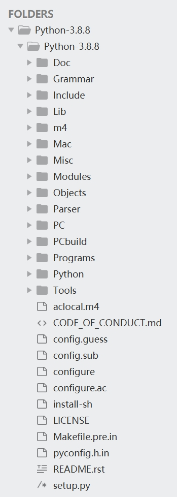
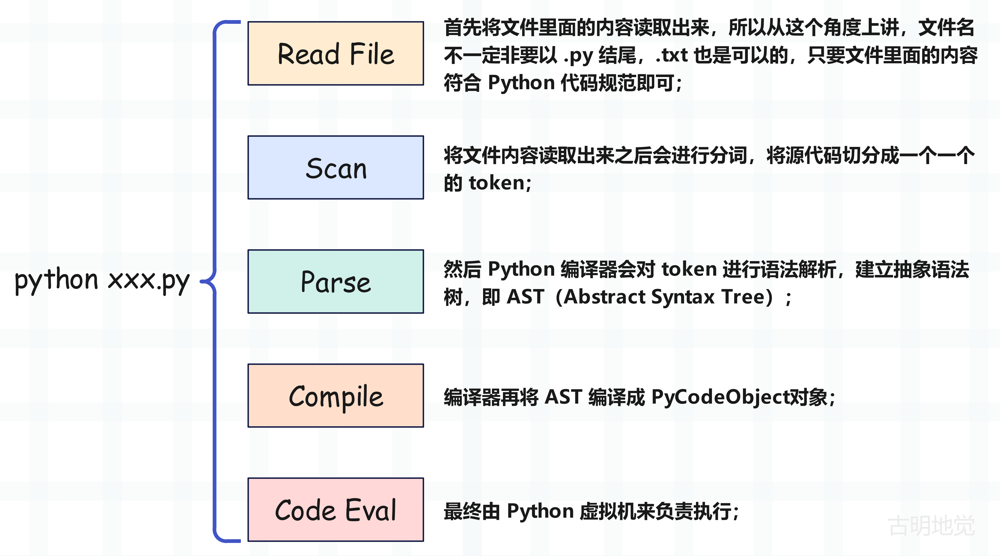
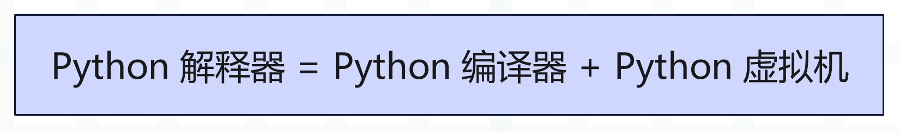

## CPython 源码结构

工欲善其事，必先利其器，在剖析源码之前，要先将它下载下来，并熟悉里面的结构。我们登录官网下载 CPython，本系列剖析的版本是 3.8.8，你可以点击此[链接](https://www.python.org/ftp/python/3.8.8/Python-3.8.8.tgz)进行下载。

压缩包下载下来之后解压，即可得到整个 CPython 工程项目，我们看看它长什么样子？

以上便是 CPython3.8.8 源码结构，我们解释一下每个目录的作用。

**Doc 目录**

存储 Python 文档的源文件（.rst），用于编译之后生成官方文档。

**Grammar 目录**

负责定义 Python 的语法规则。

**Include 目录**

包含 Python 所有公开的头文件，这些文件定义了 Python 的 C API，在编写扩展模块和嵌入式开发时会用到。

**Lib 目录**

Python 的标准库，对于那些不影响性能的模块会用 Python 编写，然后放在 Lib 目录下面。

**Modules 目录**

Python 的内置库，这些库都是用 C 编写的，编译之后会内嵌在解释器里面。我们举个例子：

~~~python
import random, _random
import re, _sre
import io, _io
import ast, _ast
~~~

以 random 为例，它是用来生成随机数的，和性能密切相关。所以它的核心功能由 C 编写，编译之后内嵌在解释器里，模块名为 _random。只不过 Python 又封装了一个 random，在内部会导入 _random，像 re 和 _sre、asyncio 和 _asyncio 都是类似的关系。

Modules 目录里面实现了大量和性能相关的模块，比如 sys、time、gc 等等，我们后续再聊。

**Objects 目录**

包含 Python 内置数据结构的底层实现，像字典、列表、元组、函数等，底层实现都定义在 Objects 目录中。

**Parser 目录**

负责 Python 代码的编译，虽然 Python 是解释型语言，但也是要经过编译的。编译的结果为 PyCodeObject 对象，它里面包含了要执行的字节码，编译完之后会交给虚拟机执行。

所以 Python 解释器 = Python 编译器 + Python 虚拟机。

**Python 目录**

Python 虚拟机的具体实现，字节码的执行、执行环境的管理等都在里面。

**Mac 目录**

用于 Mac OS X 平台的特定工具和脚本。

**Misc 目录**

包含各种杂项文件，如配置脚本、工具等。

**PC 目录**

专为 Windows 平台编写的配置文件和特定扩展。

**PCbuild 目录**

用于在 Windows 上编译 Python 的项目文件。

**Programs 目录**

包含 Python 其它可执行文件（如 IDLE）的源代码。

**Tools 目录**

包含用 Python 编写的各种脚本和工具，帮助开发和维护 Python。

以上就是 CPython 的源码结构，对它有一个基本的认识有助于我们后续的源码学习。

## 解释器、编译器、虚拟机

我们上面说了，**Python 解释器 = Python 编译器 + Python 虚拟机**，当解释器执行 py 文件时都经历了哪些过程呢？

Read File、Scanner、Parser、Compiler 都是由 Python 编译器负责的，Code Eval 则由 Python 虚拟机负责。

因此 Python 虽然是解释型语言，但也有编译的过程。源代码会被编译器编译成 PyCodeObject 对象，然后再交给虚拟机来执行。而之所以要存在编译，是为了让虚拟机能更快速地执行，比如在编译阶段常量都会提前分配好，而且还可以尽早检测出语法上的错误。

而 Python 编译器和 Python 虚拟机组合起来，便是 Python 解释器。

如果你了解 Java，那么应该知道 Java 也有编译器和虚拟机。只不过 Java 的编译器和虚拟机是分开的，而 Python 则是整合在一起的。

不过在后续介绍 Python 源码的时候，我们暂不涉及 Python 编译器的部分，也就是 Parser 目录里面的代码不做分析，因为涉及到编译原理。而且编译这一过程也不是 Python 语言独有的，任何一门编程语言、当然还有 SQL 都会涉及到编译。所以探究 Python 代码的编译过程没太大意义，我们的重点是 Python 代码的编译结果，以及虚拟机是如何执行的？

## 小结

本文就说到这里，赶快下载 Python 3.8 源码，来和我一起学习 Python 吧（ヾ(◍°∇°◍)ﾉﾞ）。

-----

&nbsp;

**欢迎大家关注我的公众号：古明地觉的编程教室。**

**如果觉得文章对你有所帮助，也可以请作者吃个馒头，Thanks♪(･ω･)ﾉ。**

