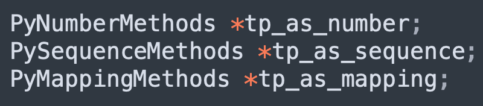
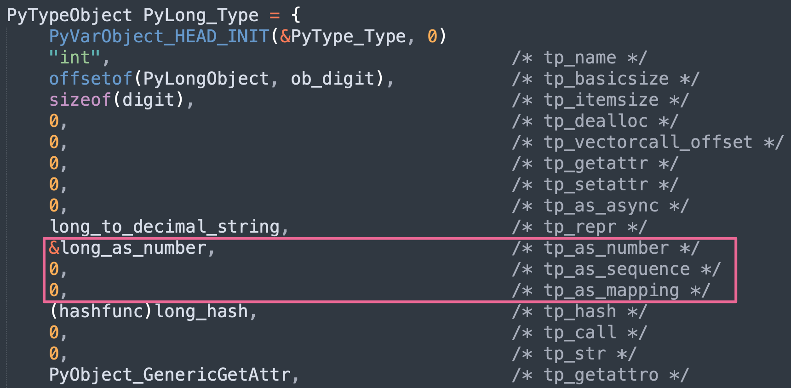
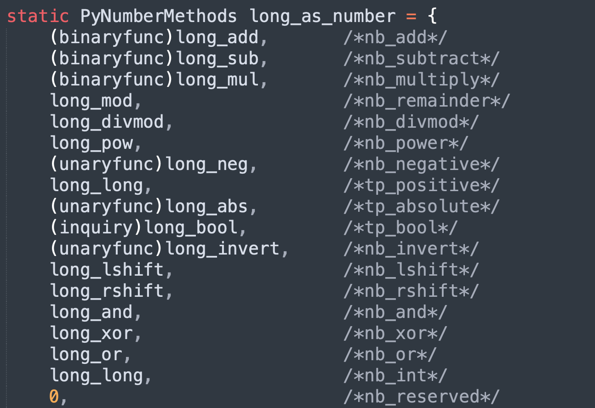
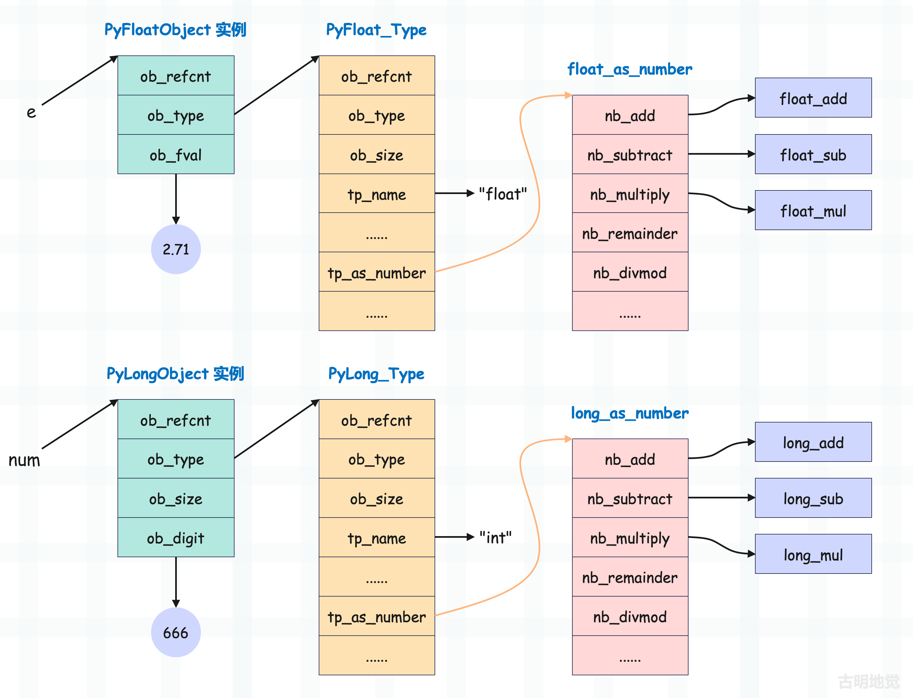

我们知道所有类型对象在底层都由结构体 PyTypeObject 实例化得到，但内部字段接收的值不同，得到的类型对象就不同。类型对象不同，那么实例对象的表现就不同，这也正是一种对象区别于另一种对象的关键所在。

比如 PyLong_Type 的 tp_iter 是空，那么整数就不是可迭代对象，而 PyList_Type 的 tp_iter 不是空，那么列表就是可迭代对象。再比如 PyLong_Type 和 PyFloat_Type，虽然内部都实现了 tp_hash，但它们是不同的类型，所以整数和浮点数的哈希值计算方式也不一样。

因此类型对象决定了实例对象的行为，比如能否调用、能否计算哈希值、能否迭代等等，这些都由类型对象决定。

PyTypeObject 里面定义了很多函数指针，比如 tp_call、tp_hash 等等，它们可能指向某个具体的函数，也可能为空。这些函数指针可以看做是类型对象所定义的操作，这些操作决定了其实例对象在运行时的行为。

~~~python
class A:
    
    # tp_new
    def __new__(cls, *args, **kwargs):
        pass
    
    # tp_init
    def __init__(self):
        pass
    
    # tp_call
    def __call__(self):
        pass
    
    # tp_getattro
    def __getattr__(self, attr):
        pass
    
    # tp_setattro
    def __setattr__(self, key, value):
        pass
    
    ...
    ...
~~~

像 tp_call、tp_hash、tp_new 等字段会直接对应 Python 里的魔法函数，它们以双下划线开头、以双下划线结尾。但除了魔法函数之外，每种类型还可以有很多自定义的成员函数。

~~~python
# 自定义 foo 和 bar
class A:

    def foo(self):
        pass

    def bar(self):
        pass

# 当然内置类型也是如此
# 像 str 定义了 join、split、upper 等
print(str.join)
print(str.split)
print(str.upper)
# 像 list 定义了 append、extend，insert 等
print(list.append)
print(list.extend)
print(list.insert)
~~~

这些自定义的函数会一起保存在类型对象的 tp_methods 里面，负责让实例对象更具有表现力。另外需要补充的是，类型对象里面定义的是函数，也叫成员函数，但实例对象在获取之后会自动包装成方法。所以当提到魔法函数和魔法方法时，其实表达的是同一个意思，只不过一个是站在类的角度，一个是站在实例的角度。

所以实例对象能调用的方法都定义在类型对象里面，并且通过实例调用本质上就是一个语法糖，但用起来更加优雅。假设有一个类 A，实例对象为 a，那么 a.some() 底层会转成 A.some(a)，至于这背后的细节后续再聊。

但除了以上这些，PyTypeObject 还提供了三个字段。

每个字段分别指向一个结构体实例，结构体实例中有大量的字段，这些字段都是函数指针，指向了具体的函数。所以它们也被称为方法簇，分别应用于如下操作。

- tp_as_number：负责数值型操作，比如整数、浮点数的加减乘除；
- tp_as_sequence：负责序列型操作，比如字符串、列表、元组等通过索引取值的行为；
- tp_as_mapping：负责映射型操作，比如字典通过 key 映射出 value；

我们以 tp_as_number 为例，它指向 PyNumberMethods 类型的结构体实例，那么这个结构体长什么样子呢？

~~~C
// Include/cpython/object.h

typedef struct {
    // __add__，对应 + 操作符，如 a + b
    binaryfunc nb_add;
    // __sub__，对应 - 操作符，如 a - b
    binaryfunc nb_subtract;
    // __mul__，对应 * 操作符，如 a * b
    binaryfunc nb_multiply;
    // __mod__，对应 % 操作符，如 a % b
    binaryfunc nb_remainder;
    // __divmod__，对应 divmode 函数，如 divmod(a, b)
    binaryfunc nb_divmod;
    // __power__，对应 ** 操作符，如 a ** b
    ternaryfunc nb_power;
    // __neg__，对应 - 操作符，如 -a
    unaryfunc nb_negative;
    // __pos__，对应 + 操作符，如 +a
    unaryfunc nb_positive;
    // __abs__，对应 abs 函数，如 abs(a)
    unaryfunc nb_absolute;
    // __bool__，如 bool(a)
    inquiry nb_bool;
    // __invert__，对应 ~ 操作符，如 ~a
    unaryfunc nb_invert;
    // __lshift__，对应 << 操作符，如 a << b
    binaryfunc nb_lshift;
    // __rshift__，对应 >> 操作符，如 a >> b
    binaryfunc nb_rshift;
    // __and__，对应 & 操作符，如 a & b
    binaryfunc nb_and;
    // __xor__，对应 ^ 操作符，如 a ^ b
    binaryfunc nb_xor;
    // __or__，对应 | 操作符，如 a | b
    binaryfunc nb_or;
    // __int__，如 int(a)
    unaryfunc nb_int;
    // ...
} PyNumberMethods;
~~~

你看到了什么？是不是想到了 Python 里面的魔法方法，所以它们也被称为方法簇。

在 PyNumberMethods 这个方法簇里面定义了作为一个数值对象应该支持的操作，同理，在 PySequenceMethods 和 PyMappingMethods 中分别定义了作为一个序列对象和映射对象应该支持的操作，这两种对象的典型例子就是 list 和 dict。

所以，只要类型对象提供相关操作，实例对象便具备对应的行为，因为实例对象所调用的方法都是由类型对象提供的。

~~~Python
class Girl:

    def __init__(self, name, age):
        self.name = name
        self.age = age

    def say(self):
        pass

    def cry(self):
        pass

g = Girl("古明地觉", 16)
print(g.__dict__)  # {'name': '古明地觉', 'age': 16}
print("say" in Girl.__dict__)  # True
print("cry" in Girl.__dict__)  # True
~~~

实例对象的属性字典，只包含了一些在 \_\_init\_\_ 里面设置的属性而已，而实例能够调用的 say、cry 都是定义在类型对象中的。

因此一定要记住：类型对象定义的操作，决定了实例对象的行为。

~~~python
class Int(int):

    def __getitem__(self, item):
        return item

a = Int(1)
b = Int(2)

print(a + b)  # 3
print(a["你好"])  # 你好
~~~

继承了 int 的自定义类 Int 在实例化之后自然是一个数值对象，但 a[""] 却是一个类似于字典才具有的行为，那为什么可以实现呢？原因就是我们重写了 \_\_getitem\_\_ 这个魔法函数，它在底层对应 PyMappingMethods 中的 mp_subscript 操作，因此最终 Int 实例对象表现的像一个字典一样。

归根结底就在于这几个方法簇都只是 PyTypeObject 的一个字段罢了，默认使用 PyTypeObject 结构体创建的 PyLong_Type 所生成的实例对象（整数）是不具备列表和字典的属性特征的。但我们通过继承 PyLong_Type，同时指定 \_\_getitem\_\_，使得构建出来的类型对象所生成的实例对象，同时具备多种属性特征，就是因为解释器支持这种做法。

自定义的类在底层也是 PyTypeObject 结构体实例，而在继承 int 的时候，将其内部定义的 PyNumberMethods 方法簇也继承了下来，而我们又单独实现了 PyMappingMethods 中的 mp_subscript。所以自定义类 Int 的实例对象具备了整数的全部行为，以及字典的部分行为（因为我们只实现了 \_\_getitem\_\_）。

下面再通过 PyLong_Type 实际考察一下：

整数对象支持数值操作，所以在创建 PyLong_Type 时，实现了 tp_as_number。但整数显然不支持序列和映射操作，因此字段 tp_as_sequence 和 tp_as_mapping 就是 0，相当于空。

而 tp_as_number 字段被赋值为 long_as_number，看一下它长什么样。

里面的 long_add、long_sub、long_mul 等等显然都是已经定义好的函数指针，在创建 PyNumberMethods 结构体实例 long_as_number 的时候，这些函数指针分别赋值给了字段 nb_add、nb_substract、nb_multiply 等等。然后创建完 long_as_number 之后，再将其指针交给 PyLong_Type 的 tp_as_number 字段。

因此整数在操作的时候，比如相加，会先通过 变量->ob_type->tp_as_number->nb_add 获取该操作对应的函数指针，其中 int 类型对象的 tp_as_number 字段的值是 &long_as_number，因此获取其字段 nb_add 的时候，拿到的就是 long_add 函数指针，然后调用。

同理 float 类型里的 tp_as_number 字段则被赋值成了 &float_as_number，获取 nb_add 字段的时候，拿到的就是 float_add 函数指针。不同类型的对象的行为不同，它们都有属于自己的一组方法簇。

最后再画一张图总结一下，假设有两个变量，分别是 e = 2.71 和 num = 666。

所以对象的行为是由其类型对象定义的操作所决定的，比如一个对象可以计算长度，那么它的类型对象要实现 \_\_len\_\_；一个对象可以转成整数，那么它的类型对象要实现 \_\_int\_\_ 或 \_\_index\_\_。

~~~python
class A:

    def __len__(self):
        return 123

    def __int__(self):
        return 456

a = A()
print(len(a))  # 123
print(int(a))  # 456
# len(a) 在底层会执行 A.__len__(a)
# int(a) 在底层会执行 A.__int__(a)
print(A.__len__(a))  # 123
print(A.__int__(a))  # 456
~~~

总之核心就是一句话：类型对象定义了哪些操作，决定了实例对象具有哪些行为。

------

&nbsp;

**欢迎大家关注我的公众号：古明地觉的编程教室。**

**如果觉得文章对你有所帮助，也可以请作者吃个馒头，Thanks♪(･ω･)ﾉ。**

