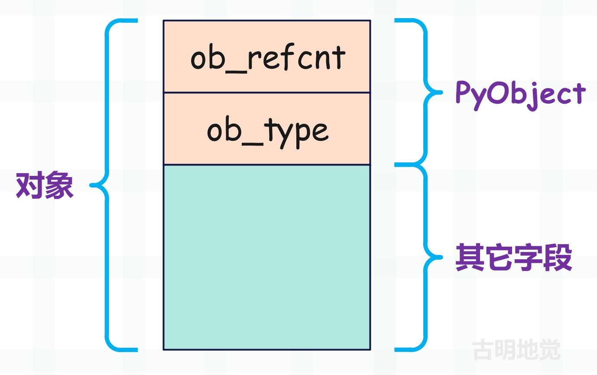
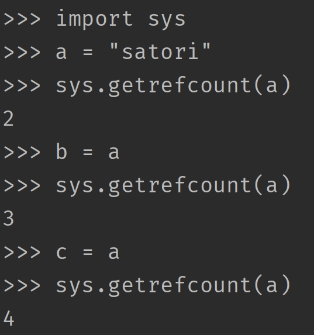
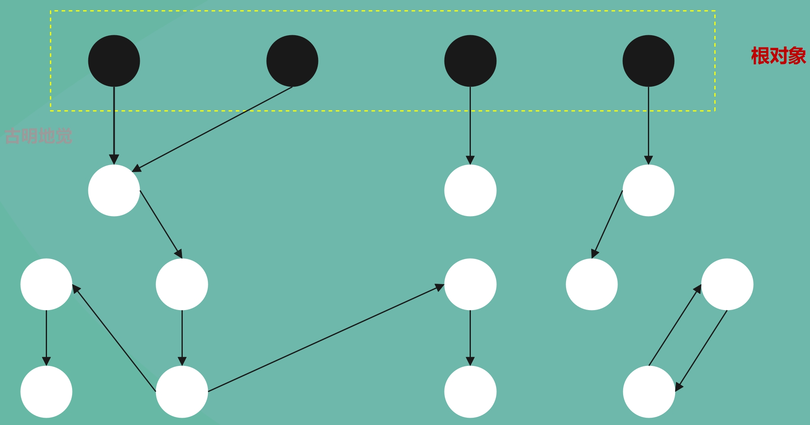
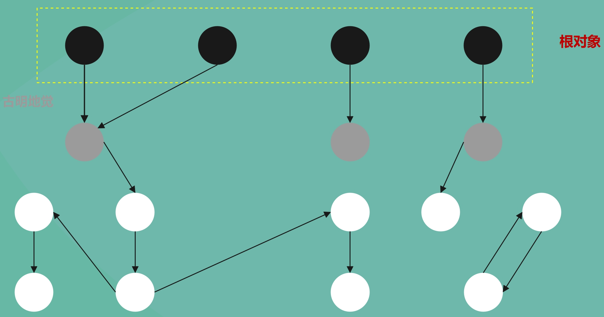
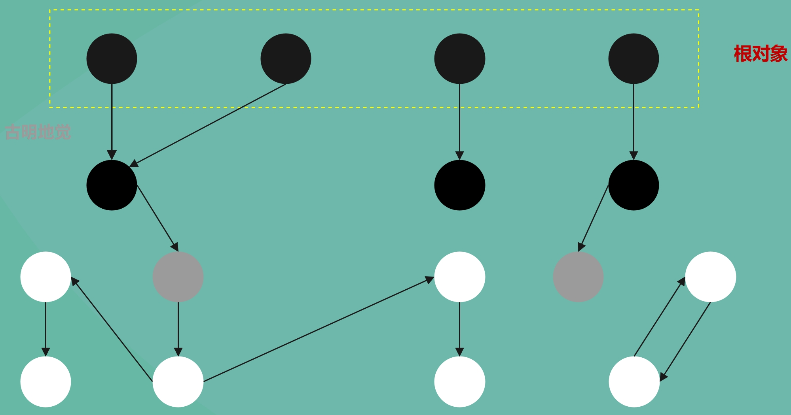
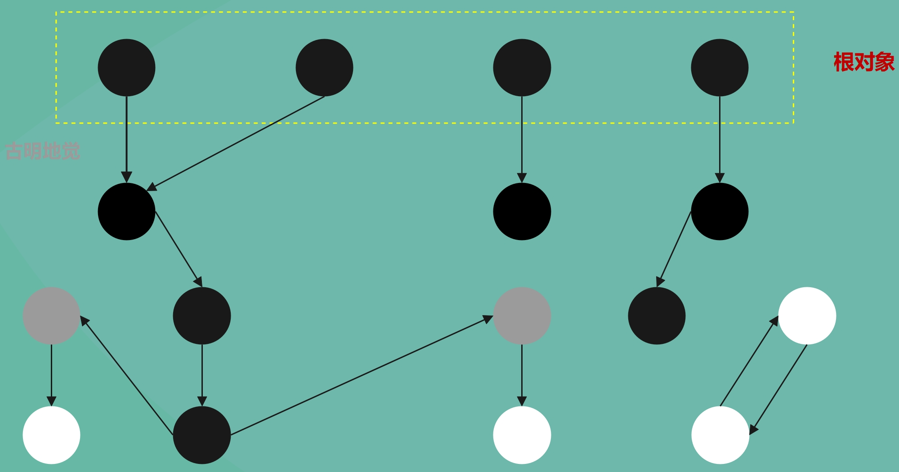
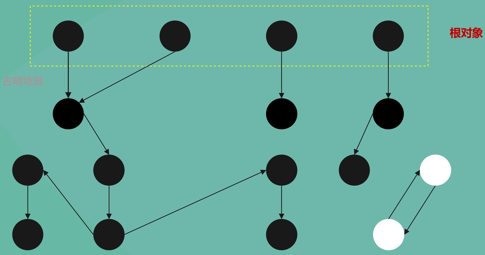
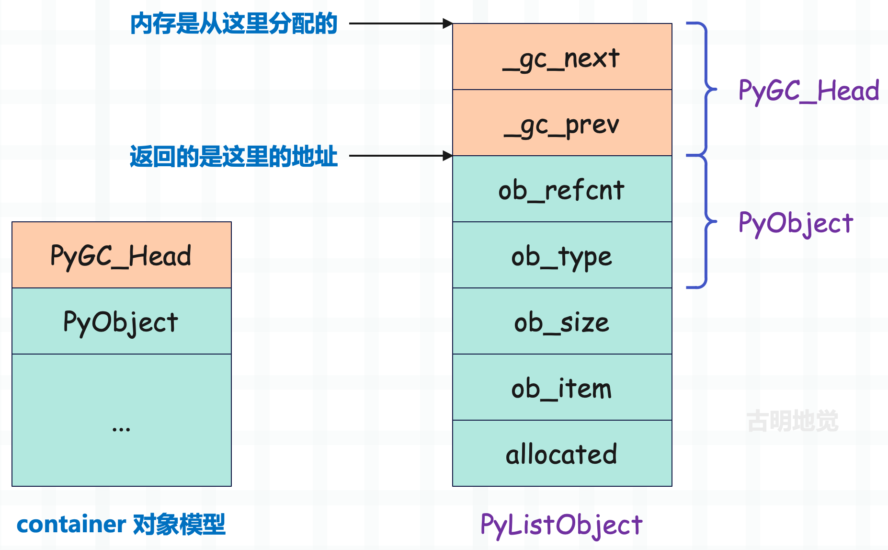
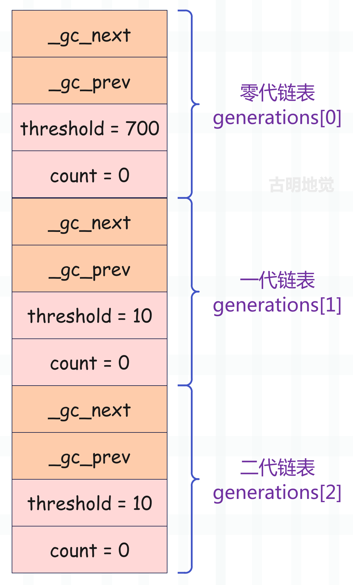

## 楔子

现在绝大部分高级语言都自带了垃圾回收机制，将开发者从繁重的内存管理工作中解放了出来。Python 作为一门高级语言，同样自带了垃圾回收，然而 Python 的垃圾回收和 Java，C# 等语言有一个很大的不同，那就是 Python 中大多数对象的生命周期是通过对象的引用计数来管理的。

## 引用计数

Python 对象的基石 PyObject 有两个属性，一个是对象的类型，还有一个就是引用计数。

所以从广义上讲，引用计数也算是一种垃圾回收机制，而且是一种最简单、最直观的垃圾回收机制。尽管需要一个值来维护引用计数，但引用计数有一个最大的优点，就是实时性。任何内存，一旦没有指向它的引用，那么就会被回收。而其它的垃圾回收技术必须在某种特定条件下才能进行无效内存的回收。

引用计数机制会带来一些额外开销，因为要时刻维护引用计数的值，并且与 Python 运行时所进行的内存分配、释放、引用赋值的次数成正比。这一点和主流的垃圾回收技术，比如标记-清除（mark-sweep）、停止-复制（stop-copy）等方法相比是一个弱点，因为它们带来的额外开销只和内存数量有关，至于有多少变量引用了这块内存则不关心。

因此为了与引用计数搭配，在内存的分配和释放上获得最高的效率，Python 设计了大量的缓存池机制，比如小整数对象池、字符串的 intern 机制，列表的 freelist 缓存池等等，这些大量使用的面向特定对象的缓存机制弥补了引用计数的软肋。

那么引用计数什么时候会增加，什么时候会减少呢？

**引用计数加 1**

- 对象被创建，如 a = 1；
- 对象被引用，如 b = a；
- 对象的引用作为参数传到一个函数中，如 func(a)；
- 对象的引用作为列表、元组等容器里面的元素；

**引用计数减 1**

- 对象的引用被显式地销毁，如 del a；
- 对象的引用指向了其它的对象，如 a = 2；
- 对象的引用离开了它所在的作用域，比如函数的局部变量，在函数执行完毕时会被销毁；
- 对象的引用所在的容器被销毁，或者从容器中删除等等；

**查看引用计数**

查看一个对象的引用计数，可以通过 sys.getrefcount(obj)，但由于又作为了 getrefcount 函数的参数，所以引用计数会多 1。

Python 的变量只是一个和对象绑定的符号，在底层都是 PyObject \* 泛型指针，所谓 b = a 在底层其实是把指针变量 a 存储的地址拷贝给了指针变量 b，所以此时 b 也指向了 a 指向的对象，因此字符串对象的引用计数就会加 1。

而每当减少一个引用，引用计数就会减 1。尽管我们用 sys.getrefcount 得到的结果是 2，但是当这个函数执行完，由于局部变量的销毁，其实结果已经变成了 1。

因此引用计数机制非常简单，就是多一个引用，引用计数加 1；少一个引用，引用计数减 1；如果引用计数为 0，说明对象已经没有变量引用了，那么就直接销毁（但内存不一定释放）。这就是引用计数机制的实现原理，简单且直观。

从目前来看，引用计数机制貌似还挺不错的，虽然需要额外用一个字段（ob_refcnt）来时刻维护引用计数的值，但对于现在的 CPU 和内存来说，完全不是事儿。最主要的是，引用计数机制真的很简单、很直观。但可惜的是，它存在一个致命的缺陷，导致它在垃圾回收机制中几乎被判了"死刑"，这一缺陷就是"循环引用"。而且也正是因为"循环引用"这个致命伤，导致在狭义上并不把引用计数看成是垃圾回收机制的一种。

~~~Python
lst1 = []
lst2 = [] 

lst1.append(lst2) 
lst2.append(lst1) 

del lst1, lst2
~~~

初始的时候，lst1 和 lst2 指向的对象的引用计数都为 1，而在 lst1.append(lst2) 之后，lst2 指向的对象的引用计数就变成了 2，同理 lst2.append(lst1) 导致 lst1 指向的对象的引用计数也变成了 2。因此当我们 del lst1, lst2 的时候，引用计数会从 2 变成 1，由于不为 0，所以 lst1 和 lst2 指向的对象都不会被回收。此时我们就说 lst1 和 lst2 指向的对象之间发生了循环引用，如果只有引用计数机制的话，那么显然这两者是回收不了的。

为了更直观的观察到这个现象，我们用 ctypes 来模拟一下这个过程。

~~~Python
from ctypes import *
import gc

class PyObject(Structure):

    _fields_ = [
        ("ob_refcnt", c_ssize_t),
        ("ob_type", c_void_p)
    ]

# 创建两个列表
lst1 = []
lst2 = []

# 获取它们的 PyObject *
# 注意：这一步不会改变对象的引用计数
py_lst1 = PyObject.from_address(id(lst1))
py_lst2 = PyObject.from_address(id(lst2))

# 显然初始的时候，引用计数都为 1
print(py_lst1.ob_refcnt)  # 1
print(py_lst2.ob_refcnt)  # 1

# lst2 作为列表的一个元素，所以指向的对象的引用计数加 1
lst1.append(lst2)
print(py_lst1.ob_refcnt)  # 1
print(py_lst2.ob_refcnt)  # 2

# lst1 作为列表的一个元素，所以指向的对象的引用计数加 1
lst2.append(lst1)
print(py_lst1.ob_refcnt)  # 2
print(py_lst2.ob_refcnt)  # 2

# 删除 lst1、lst2 之后，发现引用计数还为 1
del lst1, lst2
print(py_lst1.ob_refcnt)  # 1
print(py_lst2.ob_refcnt)  # 1

# 显然我们希望的结果是引用计数为 0
# 但是现在不为 0，原因就是发生了循环引用
# 于是 Python 的垃圾回收就登场了，调用 gc.collect() 发动一次 gc
gc.collect()
print(py_lst1.ob_refcnt)  # 0
print(py_lst2.ob_refcnt)  # 0

# nice，我们看到此时引用计数都变成了 0，两个对象也都会被回收
~~~

这里提前给出结论，一个对象是否被回收只取决于它的引用计数（ob_refcnt）是否为 0，只要为 0 就回收，不为 0 就存活。但由于对象之间会发生循环引用，导致引用计数失效，所以严格意义上不能把引用计数机制看成是垃圾回收机制的一种。于是 Python 除了引用计数机制之外，还提供了真正的垃圾回收技术（标记-清除和分代收集），来弥补这一漏洞。其工作方式也很简单，就是找出那些发生循环引用的对象，然后将循环引用导致增加的引用计数再给减掉，这样对象的引用计数不就正常了吗？

比如上面代码中 lst1 和 lst2 指向的对象，当 gc 触发时，垃圾回收器发现循环引用导致它们的引用计数增加了 1，于是会再将它们的引用计数减去 1，然后变成 0。而引用计数机制发现引用计数变为 0，便会将对象回收。

所以对象回收与否，完全是由它的引用计数决定的，垃圾回收只是在给引用计数机制擦屁股。如果程序不出现循环引用，那么引用计数机制足矣。但当出现了循环引用，垃圾回收机制就要出来解决这一点，将循环引用造成的影响抵消掉，从而让引用计数机制能够正常工作。

那么接下来的重点，就是要看看 Python 的垃圾回收是怎么解决循环引用的？

## 三色标记模型

无论何种垃圾回收机制，一般都分为两个阶段：垃圾检测和垃圾回收。

+ 垃圾检测：从所有已经分配的内存中区别出可回收和不可回收的内存。
+ 垃圾回收：将垃圾检测阶段所标识出来的可回收内存块交还给系统堆，后续可以分配给其它对象。所以垃圾回收，并不是说直接把这块内存的数据清空，而是将使用权交出去，不会自己霸占了。

而 Python 的垃圾回收采用的是标记-清除和分代收集，分代收集我们一会儿再说，先来看看标记-清除是怎么实现的。从具体的实现上来讲，标记-清除方法同样遵循垃圾回收的两个阶段，其简要过程如下：

+ 1）寻找根对象（root object）集合，所谓的 root object 就是一些全局引用和函数栈的引用，这些引用指向的对象是不可被删除的，而这个 root object 集合也是垃圾检测动作的起点；
+ 2）从 root object 集合出发，沿着 root object 集合中的每一个引用进行探索，如果能到达某个对象，则称该对象是可达的（reachable），可达的对象也不能被删除。这个阶段就是垃圾检测阶段；
+ 3）当垃圾检测阶段结束后，所有的对象被分成了可达的（reachable）和不可达的（unreachable）。所有可达对象都必须予以保留，而不可达对象所占用的内存将被回收；

而在这个过程中，Python 会建立一个三色标记模型，它为标记-清除算法提供了一个清晰的实现框架。这个模型的核心就在于，它会将对象标记为三种颜色，分别是黑色、灰色、白色，所以叫三色标记模型。

+ 黑色（Black）：对象已被访问 / 标记，并且其引用的其它对象也都已经扫描完毕，该对象确定为可达对象。
+ 灰色（Gray）：对象已被访问 / 标记，但其引用的其它对象还未被扫描，该对象处于正在处理的过渡状态。
+ 白色（White）：对象尚未被访问 / 标记。

如果将三色标记模型考虑进去，那么整个回收过程如下：

+ 1）垃圾回收开始时，所有对象都是白色。
+ 2）将 root 对象标记为灰色。
+ 3）遍历灰色对象，将其引用的对象也标记为灰色，然后再将自身标记为黑色（从灰变黑）。
+ 4）重复步骤 3）直到没有灰色对象。
+ 5）检测结束后，对象要么是黑色，要么是白色。如果是黑色，那么说明对象可达，不能删除；如果是白色，那么说明对象不可达（为垃圾），需要删除。

我们再用图像的方式，来解释一下上述过程。

在垃圾回收动作被激活之前，系统中已分配的对象之间的引用关系组成了一张有向图，对象是图中的节点，而对象之间的引用关系则是节点和节点之间的连线。

黑色的节点表示被引用的活跃对象，也就是可达对象；白色的节点表示需要回收、但因循环引用而导致无法回收的垃圾对象，也就是不可达对象。由于根对象本身就是可达的，所以直接将它标记为黑色。然后我们假设除了根对象之外都是不可达的，所以下面都标记成了白色，至于它到底是不是白色，需要通过遍历才知道。

然后开始遍历了，显然从根对象开始遍历，根对象是可达的，被根对象引用的对象同样也是可达的。所以从根对象出发，沿着引用关系遍历，能够遍历到的对象都是可达的，我们将其标记为灰色。

这里可能有人会产生一个疑问，既然都可达了，为啥不直接标记成黑色呢？或者说三色标记模型本身就不太需要灰色，只要黑色和白色就够了。其实灰色状态有两个重要作用：

+ 标记扫描进度：引入灰色状态能够清晰地显示当前正在处理哪些对象，可以避免重复扫描或遗漏，如果没有灰色就无法得知扫描到哪里了。
+ 支持增量回收：灰色作为中间状态，允许垃圾回收过程动态暂停和恢复。暂停时灰色对象记录了未完成的扫描位置，这对减少程序停顿时间很重要。

> 所以虽然理论上可以没有灰色状态，但在实际实现中它能提高效率和灵活性。

然后继续扫描，遍历灰色对象。

将灰色对象引用的其它对象也设置为灰色，然后再将自身设置为黑色。所以灰色只是一层中间状态，它和黑色都代表可达，只是通过引入灰色能够显示扫描进度和支持增量回收。因此对于那些可达对象，会先被标记为灰色，等到遍历这些灰色对象引用的对象（也标记为灰色）之后，再将上一层的灰色对象标记为黑色。

> 事实上 root 对象也应该先标记为灰色的，等到遍历它引用的对象时，再将它标记为黑色。只是为了方便，我们这里就直接标记为黑色了，大家理解就好。

然后继续从新的被标记成灰色的对象开始往下找，就是一层一层遍历嘛。所以遍历灰色对象，整个过程就做两件事：

+ 将其直接引用的对象设置为灰色。
+ 然后再将其自身设置为黑色（从灰变黑）。

凡是被引用到了的对象，都是可达的，不能删除。

如果从根对象集合开始，按照广度优先的策略进行搜索的话，那么不难想象，灰色节点就如同波纹一样不断向外扩散。凡是被灰色波纹触碰到的就会变成黑色，没有被触碰到的则还是原来的白色。

遍历完所有的对象之后，说明垃圾检测阶段结束了。如果是白色，说明是不可达的，会被回收；如果是黑色，说明是可达的，不会被回收。

比如图中的两个白色节点，从任何一个根节点出发都遍历不到，显然它们是因为循环引用而无法被回收的垃圾对象。这时垃圾回收器会将它们的引用计数减 1，所以上面说的垃圾回收并不是真的就直接把对象回收了，而是减少它的引用计数。至于对象的回收，则是由引用计数机制发现对象的引用计数为 0、然后调用 tp_dealloc 实现的。

> 正如一开始说的那样，垃圾回收只是在给引用计数机制擦屁股。垃圾回收做的工作就是修正对象的引用计数，解决循环引用带来的问题，而对象的回收则由引用计数机制负责。

以上就是垃圾回收中的标记-清除法，还是很好理解的，Python 内部采用的就是这种方法，先找出所有的根对象，然后再从根对象出发找到所有的可达对象。

## 分代收集技术

上面说了，Python 主要的内存管理手段是引用计数，而标记-清除和分代收集只是为了打破循环引用而引入的补充技术。

这一事实意味着垃圾回收只关注可能会产生循环引用的对象，而像整数、字符串这些对象是绝对不可能产生循环引用的，因为它们内部不可能持有对其它对象的引用，所以直接通过引用计数机制就可以实现，另外后面我们说的垃圾回收也专指那些可能产生循环引用的对象。

循环引用只会发生在 container 对象之间，所谓 container 对象指的就是内部可持有对其它对象的引用的对象，比如字典、列表、元组、自定义类对象、自定义类对象的实例对象等等。所以当垃圾回收机制开始运行时，只需要检查这些 container 对象即可，对于整数、字符串、浮点数等对象则不需要理会，这使得垃圾回收带来的开销只取决于 container 对象的数量，而非所有对象的数量。

为了达到这一点，Python 就必须跟踪所创建的每一个 container 对象，并将这些对象组织到一个集合中，只有这样，才能将垃圾回收的动作限制在这些对象上。而 Python 的做法是维护一条双向链表（实际上是 3 条），我们称之为可收集对象链表，所有的 container 对象在创建之后，都会被插入到这条链表当中，成为可收集对象。

> 可收集对象，指的一定是 container 对象。

当然，除了维护用于 container 对象的链表之外，还会维护一个名为 refchain 的链表，这个链表也是双向的，用于引用计数机制。程序中产生的所有对象都会挂到这个链表上，注意是所有对象。当对象要被回收时，就将它从 refchain 里面摘除，比较简单。

所以 refchain 会跟踪所有对象的生命周期，而 GC 链表（可收集对象链表）只跟踪可能产生循环引用的 container 对象的生命周期。任何一个对象在创建之后都会加入到 refchain 里面，而 container 对象由于要参与垃圾回收，所以它还必须加入到可收集对象链表里面。

### 可收集对象链表

在分析 Python 对象机制的时候我们看到，任何一个对象都可以分为两部分，一部分是 PyObject_HEAD，另一部分是对象自身的数据。然而对于需要被垃圾回收机制跟踪的 container 对象来说还不够，因为要加入到可收集对象链表中，所以 container 对象还需要一些额外的信息，这个信息位于 PyObject_HEAD 之前，称为 PyGC_Head。

~~~C
// Include/cpython/objimpl.h
typedef struct {
    // 指向链表中的下一个对象，值为 0 表示对象未被跟踪
    uintptr_t _gc_next;
    // 指向链表中的上一个对象
    // 注：_gc_prev 的后两个位会用作标志位，其它位表示地址
    uintptr_t _gc_prev;
} PyGC_Head;
~~~

对于可收集的 container 对象，其内存布局与我们之前了解的内存布局是不同的，这一点可以从可收集 container 对象的创建进行窥探。

~~~C
// Modules/gcmodule.c

PyObject *
_PyObject_GC_New(PyTypeObject *tp)
{
    // 对于 container 对象，会调用 _PyObject_GC_New 申请内存，之前见过的
    // 然后 _PyObject_GC_New 内部调用了 _PyObject_GC_Malloc
    PyObject *op = _PyObject_GC_Malloc(_PyObject_SIZE(tp));
    if (op != NULL)
        op = PyObject_INIT(op, tp);
    return op;
}

PyObject *
_PyObject_GC_Malloc(size_t basicsize)
{
    return _PyObject_GC_Alloc(0, basicsize);
}

static PyObject *
_PyObject_GC_Alloc(int use_calloc, size_t basicsize)
{
    struct _gc_runtime_state *state = &_PyRuntime.gc;
    PyObject *op;
    PyGC_Head *g;
    size_t size;
    if (basicsize > PY_SSIZE_T_MAX - sizeof(PyGC_Head))
        return PyErr_NoMemory();
    // 将对象和 PyGC_Head 所需的内存加起来
    size = sizeof(PyGC_Head) + basicsize;
    // 为对像和 PyGC_Head 申请内存
    if (use_calloc)
        g = (PyGC_Head *)PyObject_Calloc(1, size);
    else
        g = (PyGC_Head *)PyObject_Malloc(size);
    if (g == NULL)
        return PyErr_NoMemory();
    // ...
    // 根据 PyGC_Head 的地址得到 PyObject 的地址
    op = FROM_GC(g);
    return op;
}
~~~

可以很清晰地看到，当 Python 为可收集的 container 对象申请内存空间时，还额外为 PyGC_Head 申请了空间，并且地址位于 container 对象之前。但是返回的时候又调用了 FROM_GC，也就是说返回的仍是 container 对象的地址。

所以像列表、字典等 container 对象的内存分布就应该变成这样。

可收集 container 对象的内存可以分为三个部分，首先第一部分用于垃圾回收机制，然后紧跟着的是 Python 所有对象都会有的 PyObject，最后才是 container 自身的数据。这里的 container 对象，既可以是 PyDictObject，也可以是 PyListObject、PyTupleObject 等等。

另外当垃圾回收机制运行期间，我们需要在可收集 container 对象的 PyGC_Head 和 PyObject 之间来回切换。更确切的说，有时我们持有一个对象 A 的 PyObject 的地址，但是需要根据这个地址来获得 PyGC_Head 的地址，而有时又需要反过来进行逆运算。所以 Python 提供了两个地址之间的转换算法：

~~~C
// Modules/gcmodule.c

// 根据 PyObject 得到 PyGC_Head
#define AS_GC(o) ((PyGC_Head *)(o)-1)
// 根据 PyGC_Head 得到 PyObject
#define FROM_GC(g) ((PyObject *)(((PyGC_Head *)g)+1))
~~~

所以每个 container 对象在创建时都会额外包含一个 PyGC_Head，但此时它还不是可收集的，如果要成为可收集对象，那么还要加入到可收集对象链表中。而这个动作是发生在创建 container 对象的最后一步，以 PyListObject 的创建为例。

~~~C
// Objects/listobject.c

PyObject *
PyList_New(Py_ssize_t size)
{
    PyListObject *op;
    // ...
    Py_SIZE(op) = size;
    op->allocated = size;
    // 在返回 op 之前调用了 _PyObject_GC_TRACK
    _PyObject_GC_TRACK(op);
    return (PyObject *) op;
}
~~~

这个 \_PyObject_GC_TRACK 已经见过很多回了，之前的解释是开启 GC 跟踪，但是现在我们明白了，这一步本质上就是将创建的 container 对象链接到了可收集对象链表中。而链接到可收集对象链表之后，这个 container 对象就成为了可收集对象，开始被 GC 跟踪了。

那么这一步是怎么实现的呢？

~~~C
// Include/internal/pycore_object.h

#define _PyObject_GC_TRACK(op) \
    _PyObject_GC_TRACK_impl(__FILE__, __LINE__, _PyObject_CAST(op))

static inline void _PyObject_GC_TRACK_impl(const char *filename, int lineno,
                                           PyObject *op)
{
    _PyObject_ASSERT_FROM(op, !_PyObject_GC_IS_TRACKED(op),
                          "object already tracked by the garbage collector",
                          filename, lineno, "_PyObject_GC_TRACK");

    PyGC_Head *gc = _Py_AS_GC(op);
    _PyObject_ASSERT_FROM(op,
                          (gc->_gc_prev & _PyGC_PREV_MASK_COLLECTING) == 0,
                          "object is in generation which is garbage collected",
                          filename, lineno, "_PyObject_GC_TRACK");

    PyGC_Head *last = (PyGC_Head*)(_PyRuntime.gc.generation0->_gc_prev);
    _PyGCHead_SET_NEXT(last, gc);
    _PyGCHead_SET_PREV(gc, last);
    _PyGCHead_SET_NEXT(gc, _PyRuntime.gc.generation0);
    _PyRuntime.gc.generation0->_gc_prev = (uintptr_t)gc;
}
~~~

前面说了，Python 会将垃圾回收限制在其维护的可收集对象链表上，因为所有的循环引用一定是在这个链表的对象里面发生的。而在 \_PyObject_GC_TRACK 之后，我们创建的 container 对象也就置身于垃圾回收机制的掌控之中了，也就是之前所说的开启 GC 跟踪。

同样的，Python 也提供了将一个 container 对象从链表中摘除的方法，显然这个方法会在对象被销毁的时候调用。

~~~C
// Include/internal/pycore_object.h

#define _PyObject_GC_UNTRACK(op) \
    _PyObject_GC_UNTRACK_impl(__FILE__, __LINE__, _PyObject_CAST(op))

static inline void _PyObject_GC_UNTRACK_impl(const char *filename, int lineno,
                                             PyObject *op)
{
    _PyObject_ASSERT_FROM(op, _PyObject_GC_IS_TRACKED(op),
                          "object not tracked by the garbage collector",
                          filename, lineno, "_PyObject_GC_UNTRACK");

    PyGC_Head *gc = _Py_AS_GC(op);
    PyGC_Head *prev = _PyGCHead_PREV(gc);
    PyGC_Head *next = _PyGCHead_NEXT(gc);
    _PyGCHead_SET_NEXT(prev, next);
    _PyGCHead_SET_PREV(next, prev);
    gc->_gc_next = 0;
    gc->_gc_prev &= _PyGC_PREV_MASK_FINALIZED;
}
~~~

很明显，\_PyObject_GC_UNTRACK 只是 \_PyObject_GC_TRACK 的逆运算而已。就这样，借助 \_gc_next 和 \_gc_prev 指针，Python 将需要跟踪的对象一个接一个地组织成双向链表。

### 零代链表、一代链表、二代链表

无论什么语言，写出来的程序都有共同之处，那就是不同对象的生命周期会存在不同。有的对象所占的内存块的生命周期很短，而有的内存块的生命周期则很长，甚至可能从程序的开始持续到程序结束，这两者的比例大概是 80~90%。这对垃圾回收机制有着重要的意义，因为像标记-清除这样的算法所带来的额外开销和系统中内存块的数量有很大关系，当内存块越多的时候，垃圾检测带来的额外开销就越多，相反则越少。

因此我们可以采用一种空间换时间的策略，因为目前所有 container 对象都在一个链子上，每当进行垃圾回收的时候，都要把所有对象全部检查一遍。而其实有不少比较稳定的对象（经历多次垃圾回收的洗礼后仍保持存活），完全没有必要每次都检查，或者说检查的频率可以降低一些。

于是聪明如你已经猜到了，再来一条链子不就可以了，把那些比较稳定的对象移到另外一条链子上，而新的链子进行垃圾回收的频率会低一些。

所以思想就是：将系统中的 container 对象根据其存活时间划分为不同的集合，每一个集合就称为一个"代"，垃圾回收的频率随着"代"的存活时间的增大而减小。也就是说，存活时间越长的对象就越可能不是垃圾，就越可能是程序中需要一直存在的对象，就应该少去检测它。

那么问题来了，这个存活时间是如何衡量的呢？或者说怎么判断一个对象是否稳定呢？显然上面已经给出结论了，就是通过经历垃圾回收的次数来评判，如果一个对象经历的垃圾回收次数越多，那么显然其存活时间就越长。

Python 的垃圾回收器会在条件满足时（至于什么条件稍后说），进行一次垃圾回收（注意：不同的代的垃圾回收频率是不同的），而一些对象在多次垃圾回收之后都能活下来，这就说明这些对象存活的时间更长，或者像上面说的更稳定，那么就不应该再把它们放在这条链子上了，而是会移动到新的链子上。而在新的链子上，进行垃圾回收的频率会降低，因为既然稳定了，检测就不必那么频繁了，或者说新的链子上触发垃圾回收所需要的时间更长了。

另外关于"代"，似乎是一个比较抽象的概念，但在 Python 中，你可以把"代"想象成多个对象组成的集合，或者把"代"想象成链表也可以。因为这些对象都挂在链表上面，并且属于同一"代"的对象都被链接到同一个链表中。

而 Python 底层总共存在三条链表，说明对象可以分为三代，即零代、一代、二代，一个"代"就是一条上面提到的可收集对象链表。

~~~C
// Include/internal/pycore_mem.h

#define NUM_GENERATIONS 3
struct gc_generation {
    PyGC_Head head;
    // "代"不同，这两个字段的含义也不同，一会儿再聊
    int threshold;
    int count;
};

// Modules/gcmodule.c
#define _GEN_HEAD(n) GEN_HEAD(state, n)
    struct gc_generation generations[NUM_GENERATIONS] = {
        /* PyGC_Head,                                    threshold,    count */
        {{(uintptr_t)_GEN_HEAD(0), (uintptr_t)_GEN_HEAD(0)},   700,        0},
        {{(uintptr_t)_GEN_HEAD(1), (uintptr_t)_GEN_HEAD(1)},   10,         0},
        {{(uintptr_t)_GEN_HEAD(2), (uintptr_t)_GEN_HEAD(2)},   10,         0},
    };
    for (int i = 0; i < NUM_GENERATIONS; i++) {
        state->generations[i] = generations[i];
    };
    state->generation0 = GEN_HEAD(state, 0);
    struct gc_generation permanent_generation = {
          {(uintptr_t)&state->permanent_generation.head,
           (uintptr_t)&state->permanent_generation.head}, 0, 0
    };
    state->permanent_generation = permanent_generation;
}
~~~

每一个"代"就是一个 gc_generation 结构体实例，而维护了三个 gc_generation 结构体实例的数组 generations，控制了三条可收集对象链表的头结点，这就是 Python 用于分代垃圾收集的三个"代"。

对于零代 gc_generation，其中的 count 记录了当前这条可收集对象链表中一共有多少个 container 对象。而在 \_PyObject_GC_Alloc 中可以看到每当分配了内存，就会执行 \_PyRuntime.gc.generations[0].count++ 动作，将零代链表中所维护的对象数量加 1。这预示着所有新创建的 container 对象都会被加入到零代链表中，而这一点也确实如此，已经被 \_PyObject_GC_TRACK 证明了。

而当三个"代"初始化完毕之后，对应的 gc_generation 数组大概是这样的。

我们看到"代"不同，对应的 threshold 也不同。对于零代链表而言，threshold 字段表示该条可收集对象链表中最多可容纳多少个新创建的 container 对象，从源码中我们看到是 700 个。而一旦零代链表中新创建的 container 对象超过了 700 个，那么会立刻触发垃圾回收。

~~~C
// Modules/gcmodule.c

static Py_ssize_t
collect_generations(struct _gc_runtime_state *state)
{
    Py_ssize_t n = 0;
    // 当 count 大于 threshold 的时候
    for (int i = NUM_GENERATIONS-1; i >= 0; i--) {
        if (state->generations[i].count > state->generations[i].threshold) {
            if (i == NUM_GENERATIONS - 1
                && state->long_lived_pending < state->long_lived_total / 4)
                continue;
            // 执行此函数对链表进行清理
            n = collect_with_callback(state, i);
            break;
        }
    }
    return n;
}
~~~

当调用 \_PyObject_GC_Alloc 为 container 对象分配内存时，零代链表的 count 字段自增 1，并将该对象接入零代链表。当调用 PyObject_GC_Del 释放 container 对象的内存时，零代链表的 count 字段自减 1。

~~~C
// Modules/gcmodule.c

static PyObject *
_PyObject_GC_Alloc(int use_calloc, size_t basicsize)
{
    // ...
    state->generations[0].count++; /* number of allocated GC objects */
    // ...
}

void
PyObject_GC_Del(void *op)
{
    // ..
    if (state->generations[0].count > 0) {
        state->generations[0].count--;
    }
    // ...
}
~~~

当 count 大于 threshold 时，也就是新创建的 container 对象的个数（准确的说，还要减去已回收的 container 对象的个数）超过了 700 个，那么清理一次零代链表。等清理完零代链表之后，将 count 重置为 0，然后继续重新统计新创建的 container 对象的个数，如果它减去已回收的 container 对象的个数又超过了 threshold（默认 700），那么继续清理零代链表。

然后零代链表每清理一次，一代链表的 count 字段自增 1，一代链表每清理一次，二代链表的 count 字段自增 1。所以可以得出结论：

+ 零代链表的 count 字段维护的是新创建的 container 对象的数量减去已回收的 container 对象的数量，如果 count 超过了 700，那么清理零代链表，并将自身的 count 字段清零，一代链表的 count 字段自增 1。
+ 一代链表的 count 字段维护的是零代链表的清理次数，它的 threshold 是 10。所以当零代链表的清理次数达到 11 次时，会清理一次一代链表。然后将自身的 count 字段和零代链表的 count 字段清零，二代链表的 count 字段自增 1。
+ 二代链表的 count 字段维护的是一代链表的清理次数，它的 threshold 是 10。所以当一代链表的清理次数达到 11 次时，会清理一次二代链表。然后将自身的 count 字段和一代链表、零代链表的 count 字段都清零。

而上面用于清理链表的 collect_generations 函数，内部是一个 for 循环，所以无论是清理哪一代链表，都是执行的这个函数。当然，真正用来清理的其实是内部调用的 collect_with_callback 函数，清理零代链表，里面的参数 i 就是 0；清理一代链表，里面的参数 i 就是 1；清理二代链表，里面的参数 i 就是 2。

> 其实 collect_with_callback 函数也不是终点，它内部又调用了collect 函数，我们后续再聊。

总之清理完毕之后，就可以区分出可达和不可达的对象。可达的对象会被移入到下一"代"，因为它们是稳定的，所以检测频率应该降低。而不可达的对象，在引用计数被修正之后，显然会被引用计数机制干掉。

以上就是分代收集的秘密，总结一下就是：

+ 零代链表中新创建的 container 对象的个数减去已回收的 container 对象的个数达到了 701，触发一次零代链表的清理；
+ 零代链表的清理次数达到了 11 次，触发一次一代链表的清理；
+ 一代链表的清理次数达到了 11 次，触发一次二代链表的清理；

需要补充一点，清理某个"代"时，会将它前面的"代"都合并到该"代"，一起清理。然后可达的对象会移入下一个代，不可达的对象由于循环引用的影响被消除，最终会被引用计数机制干掉。

再透过源码验证一下我们的结论：

~~~C
// Modules/gcmodule.c

static Py_ssize_t
collect(struct _gc_runtime_state *state, int generation,
        Py_ssize_t *n_collected, Py_ssize_t *n_uncollectable, int nofail)
{
    int i;
    Py_ssize_t m = 0;  // 可达对象的个数
    Py_ssize_t n = 0;  // 不可达对象的个数
    PyGC_Head *young;  // 正在检测的代
    PyGC_Head *old;   // 下一个代
    // ...

    // 当清理的是零代或一代链表时
    if (generation+1 < NUM_GENERATIONS)
        // 将下一代链表的 count 字段自增 1
        state->generations[generation+1].count += 1;
    // 同时将它前面的代的 count 字段清零
    for (i = 0; i <= generation; i++)
        state->generations[i].count = 0;

    // 将前面的代都合并到该代
    for (i = 0; i < generation; i++) {
        gc_list_merge(GEN_HEAD(state, i), GEN_HEAD(state, generation));
    }
    // ...
    
    // 将可达的对象移入下一个代
    if (young != old) {
        if (generation == NUM_GENERATIONS - 2) {
            state->long_lived_pending += gc_list_size(young);
        }
        gc_list_merge(young, old);
    }
    else {
        untrack_dicts(young);
        state->long_lived_pending = 0;
        state->long_lived_total = gc_list_size(young);
    }

    // 所有不可达的对象都是垃圾，要被清理
    gc_list_init(&finalizers);
    move_legacy_finalizers(&unreachable, &finalizers);
    move_legacy_finalizer_reachable(&finalizers);
    
    // 返回可达对象的个数 + 不可达对象的个数
    return n+m;
}
~~~

以上就是分代收集技术。

## 小结

到目前为止，我们算是理解 Python 的垃圾回收到底是怎么一回事了。总结一下就是引用计数机制为主，标记-清除和分代收集为辅，后者主要是为了弥补前者的致命缺点而存在的。因为光有引用计数是不够的，严格意义上讲它也算不上垃圾回收，所以还需要依赖标记-清除和分代收集为其兜底（这两者才是真正的垃圾回收机制）。

下一篇，我们将从源码层面，来剖析垃圾回收是怎么实现的。

---------

&nbsp;

**欢迎大家关注我的公众号：古明地觉的编程教室。**

**如果觉得文章对你有所帮助，也可以请作者吃个馒头，Thanks♪(･ω･)ﾉ。**

