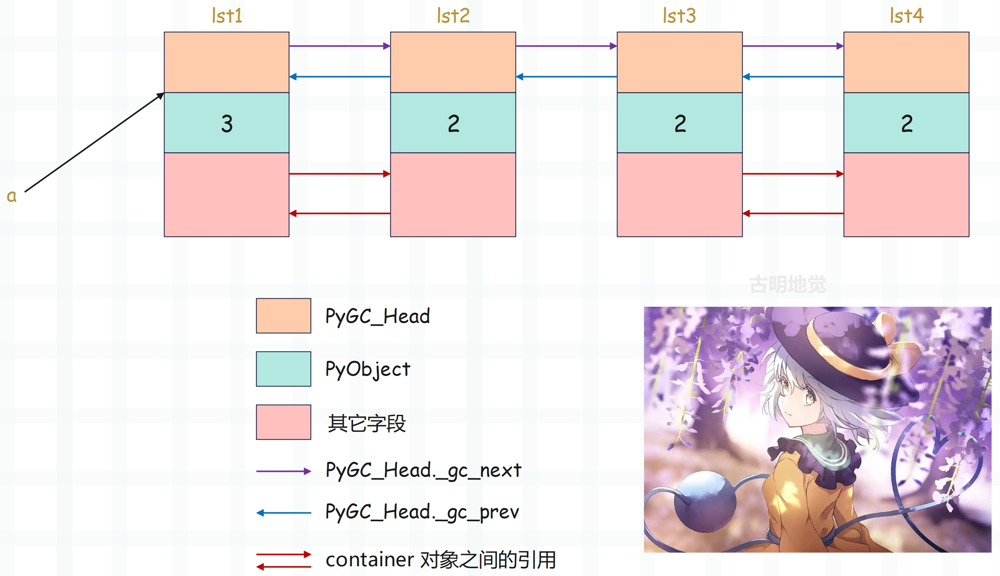
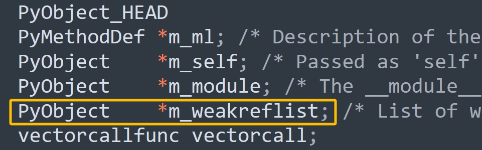

## 楔子

Python 的垃圾回收是通过标记-清除和分代收集实现的，下面就通过源码来考察一下。

我们知道，清理一代链表时会顺带清理零代链表，总之就是把比自己"代"小的链子也清理了。那么这是怎么做到的呢？其实答案就在 gc_list_merge 函数中。

如果清理的是一代链表，那么在开始垃圾回收之前，Python 会将零代链表（比它年轻的），整个链接到一代链表之后，这样的话在清理一代的时候也会清理零代。当然啦，清理二代链表也是同理，会将一代链表和零代链表，整个链接到二代链表之后，这样清理二代的时候也会清理一代和零代。

~~~C
// Include/cpython/objimpl.h

// 获取 PyGC_Head 的 _gc_next 字段，它保存了可收集对象链表中下一个 container 对象的地址
#define _PyGCHead_NEXT(g)        ((PyGC_Head*)(g)->_gc_next)

// 获取 PyGC_Head 的 _gc_prev 字段，它保存了可收集对象链表中上一个 container 对象的地址
// 但由于 _gc_prev 的后两位（低地址的两位）有其它用，所以要和 _PyGC_PREV_MASK 按位与
#define _PyGCHead_PREV(g) ((PyGC_Head*)((g)->_gc_prev & _PyGC_PREV_MASK))

// _gc_prev 的倒数第一个位表示 tp_finalize 是否被调用
#define _PyGC_PREV_MASK_FINALIZED  (1)
// _gc_prev 的倒数第二个位表示对象所处的"代"是否正在被 GC
#define _PyGC_PREV_MASK_COLLECTING (2)
// _gc_prev 的前 62 个位表示地址，由于 uintptr_t 是 64 位无符号整型
// 所以 (((uintptr_t) -1) << _PyGC_PREV_SHIFT) 会得到一个前 62 个位是 1，后 2 个位是 0 的数
// 因此 _gc_prev & _PyGC_PREV_MASK 得到的就是地址
#define _PyGC_PREV_SHIFT           (2)
#define _PyGC_PREV_MASK            (((uintptr_t) -1) << _PyGC_PREV_SHIFT)

// 将 g->_gc_next 设置为 p
#define _PyGCHead_SET_NEXT(g, p) ((g)->_gc_next = (uintptr_t)(p))

// 将 g->_gc_prev 设置为 p，注意：前 62 个位表示地址
#define _PyGCHead_PREV(g) ((PyGC_Head*)((g)->_gc_prev & _PyGC_PREV_MASK))


// Modules/gcmodule.c
static void
gc_list_merge(PyGC_Head *from, PyGC_Head *to)
{
    // from 和 to 分别表示对应的链表的虚拟头结点（dummyHead）
    assert(from != to);
    if (!gc_list_is_empty(from)) {
        // 因为是双向链表，所以 to 的 _prev 是对应链表的尾节点
        PyGC_Head *to_tail = GC_PREV(to);
        // from 的 _gc_next 是对应链表的真实头结点
        PyGC_Head *from_head = GC_NEXT(from);
        // from 的 _gc_prev 是对应链表的尾节点
        PyGC_Head *from_tail = GC_PREV(from);
        assert(from_head != from);
        assert(from_tail != from);
        // 更新指针
        _PyGCHead_SET_NEXT(to_tail, from_head);
        _PyGCHead_SET_PREV(from_head, to_tail);

        _PyGCHead_SET_NEXT(from_tail, to);
        _PyGCHead_SET_PREV(to, from_tail);
    }
    gc_list_init(from);
}
~~~

gc_list_merge 做的事情就是将 from 链表合并到 to 链表的末尾，假设清理的是零代链表，那么这里的 from 就是零代链表，to 就是一代链表，此后的标记-清除算法就在 merge 之后的那一条链表上进行。

在探究标记-清除垃圾回收方法之前，我们需要建立一个简单的循环引用的例子。

~~~Python
lst1 = []
lst2 = []

lst1.append(lst2)
lst2.append(lst1)

# 注意这里多了一个外部引用
a = lst1

lst3 = []
lst4 = []

lst3.append(lst4)
lst4.append(lst3)
~~~

示意图如下：



数字指的是当前对象的引用计数，显然 lst1 为 3，其它的都为 2，因为有一个额外的变量 a 也指向了 lst1 指向的对象。而 lst1 和 lst2，lst3 和 lst4 之间均发生了循环引用。

## 寻找 root object 集合

按照之前对垃圾收集算法的一般性描述，如果要使用标记-清除算法，首先需要找到 root object。那么在上面的那幅图中，哪些是属于 root object 呢？

让我们换个角度来思考，前面提到 root object 是不能被删除的对象。也就是说，在可收集对象链表的外部存在着对该对象的引用，删除这个对象会导致错误的行为，而在当前这个例子中显然只有 lst1 属于 root object。但这仅仅是观察的结果，那么如何设计一种算法来得到这个结果呢？

我们注意到这样一个事实，如果两个对象的引用计数都为 1，但仅仅是它们之间存在着循环引用，那么这两个对象是需要被回收的。也就是说，尽管它们的引用计数表现为非 0，但实际上有效的引用计数为 0。

这里提出了一个有效引用计数的概念，为了获得有效的引用计数，必须将循环引用的影响消除，或者将这个闭环从引用中摘除（循环引用在有向图中会形成一个环），而具体的实现方式就是将两个对象的引用计数都减去 1。这样一来，两个对象的引用计数都会变成 0，我们便挥去了循环引用的迷雾，使有效引用计数现出了真身。

那么如何使两个对象的引用计数都减 1 呢，很简单，假设这两个对象为 A 和 B，那么从 A 出发，由于它有一个对 B 的引用，于是将 B 的引用计数减 1；然后顺着引用达到 B，发现它有一个对 A 的引用，那么同样会将 A 的引用计数减1，这样就完成了循环引用对象间环的删除。

> 总结一下就是，Python 会寻找那些具有循环引用的对象，并尝试把它们的引用计数都减去 1。

但是这样就出现了一个问题，假设可收集对象链表中的 <font color="blue">container 对象 A</font> 有一个对<font color="blue">对象 C</font> 的引用，而 C 并不在这个链表中。如果在 A 没有被回收的情况下，将 C 的引用计数减 1，那么显然 C 的引用计数会被错误地减少 1，这将导致未来的某个时刻对 C 的引用会出现悬空。要想解决这个问题，就需要我们在 A 没有被删除的情况下恢复 C 的引用计数，可如果采用这样的方案的话，那么维护引用计数的复杂度将成倍增长。

换一个角度，其实有更好的做法，我们不改动真实的引用计数，而是改动引用计数的副本。对于副本，无论做什么样的改动，都不会影响对象生命周期的维护，因为它唯一的作用就是寻找 root object 集合。那么这个副本在哪里体现呢？答案是 PyGC_Head 的 \_gc_prev 字段。这里有人可能好奇了，\_gc_prev 不是用来存储地址的吗。

+ 在正常时期：\_gc_prev 的前 62 个位用来存储地址；
+ 在 GC 时期：\_gc_prev 的前 62 个位用来存储引用计数副本。

所以这是两个不同时期的用途，我们看一下源码。

~~~C
// Include/cpython/objimpl.h

#define _PyGC_PREV_MASK_FINALIZED  (1)
#define _PyGC_PREV_MASK_COLLECTING (2)
#define _PyGC_PREV_SHIFT           (2)
#define _PyGC_PREV_MASK            (((uintptr_t) -1) << _PyGC_PREV_SHIFT)

// Modules/gcmodule.c

#define PREV_MASK_COLLECTING   _PyGC_PREV_MASK_COLLECTING

static inline int
gc_is_collecting(PyGC_Head *g)
{
    // 对象所处的代是否正在被 GC，如果 _gc_prev 的倒数第二位是 1，表示正在被 GC
    return (g->_gc_prev & PREV_MASK_COLLECTING) != 0;
}

static inline void
gc_clear_collecting(PyGC_Head *g)
{
    // 将 _gc_prev 的倒数第二位设置为 0，表示对象所处的代没有被 GC
    g->_gc_prev &= ~PREV_MASK_COLLECTING;
}

static inline Py_ssize_t
gc_get_refs(PyGC_Head *g)
{
    // 将 _gc_prev 右移 2 位，返回引用计数副本
    return (Py_ssize_t)(g->_gc_prev >> _PyGC_PREV_SHIFT);
}

static inline void
gc_set_refs(PyGC_Head *g, Py_ssize_t refs)
{   
    // 让 _gc_prev 的前 62 个位存储引用计数副本
    g->_gc_prev = (g->_gc_prev & ~_PyGC_PREV_MASK)
        | ((uintptr_t)(refs) << _PyGC_PREV_SHIFT);
}

static inline void
gc_reset_refs(PyGC_Head *g, Py_ssize_t refs)
{
    // 只保留 _gc_prev 的倒数第一位，然后将倒数第二位设置为 1
    // 再让前 62 个位保存引用计数副本
    g->_gc_prev = (g->_gc_prev & _PyGC_PREV_MASK_FINALIZED)
        | PREV_MASK_COLLECTING
        | ((uintptr_t)(refs) << _PyGC_PREV_SHIFT);
}
~~~

在垃圾回收的第一步，就是遍历可收集对象链表，将每个对象的引用计数拷贝给引用计数副本。

~~~C
// Modules/gcmodule.c
static void
update_refs(PyGC_Head *containers)
{
    // 获取链表的真实头结点
    PyGC_Head *gc = GC_NEXT(containers);
    for (; gc != containers; gc = GC_NEXT(gc)) {
        // FROM_GC(gc) 会拿到 PyObject 的地址，再调用 Py_REFCNT 便可拿到引用计数
        // 然后将引用计数拷贝给 PyGC_Head 的 _gc_prev 字段，作为副本
        gc_reset_refs(gc, Py_REFCNT(FROM_GC(gc)));
        _PyObject_ASSERT(FROM_GC(gc), gc_get_refs(gc) != 0);
    }
}
~~~

而接下来的动作就是要将环引用摘除。

~~~C
// Modules/gcmodule.c
static void
subtract_refs(PyGC_Head *containers)
{
    traverseproc traverse;
    PyGC_Head *gc = GC_NEXT(containers);
    // 遍历链表的每一个对象
    for (; gc != containers; gc = GC_NEXT(gc)) {
        // 获取 PyObject 的地址
        PyObject *op = FROM_GC(gc);
        // 调用类型对象的 tp_traverse 字段
        traverse = Py_TYPE(op)->tp_traverse;
        (void) traverse(FROM_GC(gc),
                       (visitproc)visit_decref,
                       op);
    }
}
~~~

我们注意到里面有一个 tp_traverse，介绍类型对象的时候说过这个字段，它用于垃圾回收的检测阶段，通过遍历对象所引用的其它对象，确定对象之间的引用关系，帮助垃圾回收器识别出所有活跃的对象和出现循环引用的对象。除了 tp_traverse 之外还有一个和它搭配的 tp_clear，用于清除阶段，负责减少出现循环引用的对象的引用计数。

因为 tp_traverse 定义在类型对象中，所以它和特定的 container 对象有关。一般来说，tp_traverse 的动作就是遍历 container 对象中的每一个引用，然后对引用执行 visit_decref 操作。

~~~C
// Include/object.h
typedef int (*visitproc)(PyObject *, void *);
typedef int (*traverseproc)(PyObject *, visitproc, void *);

// Include/objimpl.h
#define Py_VISIT(op)                                                    \
    do {                                                                \
        if (op) {                                                       \
            int vret = visit(_PyObject_CAST(op), arg);                  \
            if (vret)                                                   \
                return vret;                                            \
        }                                                               \
    } while (0)

// Objects/listobject.c
PyTypeObject PyList_Type = {
    //...
    (traverseproc)list_traverse,     /* tp_traverse */
    //...
};

static int
list_traverse(PyListObject *o, visitproc visit, void *arg)
{
    Py_ssize_t i;
    // 对列表中的每一个元素都执行 Py_VISIT，Py_VISIT 是一个宏，会调用参数 visit
    // 而 visit 就是 subtract_refs 函数内部在调用 tp_traverse 时传递的 visit_decref 函数
    for (i = Py_SIZE(o); --i >= 0; )
        Py_VISIT(o->ob_item[i]);
    return 0;
}

// Modules/gcmodule.c
static int
visit_decref(PyObject *op, void *parent)
{
    _PyObject_ASSERT(_PyObject_CAST(parent), !_PyObject_IsFreed(op));
    // 如果 op 指向的对象参与垃圾回收
    if (PyObject_IS_GC(op)) {
        // 基于 PyObject 的地址获取 PyGC_Head 的地址
        PyGC_Head *gc = AS_GC(op);
        // 如果所处的代正在被 GC
        if (gc_is_collecting(gc)) {
            // 调用 gc_decref 减少引用计数
            gc_decref(gc);
        }
    }
    return 0;
}
~~~

比如我们要删除一个列表，那么显然在删除之前，列表里面每个元素的引用计数肯定要减一。

在完成了 subtract_refs 之后，可收集对象链表中所有 container 对象之间的环引用就被摘除了。这时有一些 container 对象的 PyGC_Head.\_gc_prev 还不为 0，这就意味着存在对这些对象的外部引用，这些对象就是开始标记-清除算法的 root object。

举个栗子：

~~~Python
import sys

lst1 = []
lst2 = []

lst1.append(lst2)
lst2.append(lst1)

# 注意这里多了一个外部引用
a = lst1

print(sys.getrefcount(a))  # 4
print(sys.getrefcount(lst1))  # 4
print(sys.getrefcount(lst2[0]))  # 4
~~~

由于 sys.getrefcount 函数本身会多一个引用，所以减去 1 的话，结果都是 3，表示它们指向的对象的引用计数为 3。所以这个时候 a 就想到了，除了我，还有两位老铁 lst1 和 lst2[0] 也指向了我指向的对象。

## 垃圾标记

还是以上面的代码为例。

~~~Python
import sys

lst1 = []
lst2 = []

lst1.append(lst2)
lst2.append(lst1)

# 注意这里多了一个外部引用
a = lst1

print(sys.getrefcount(a))  # 4
print(sys.getrefcount(lst1))  # 4
print(sys.getrefcount(lst2[0]))  # 4
~~~

假设现在执行了删除操作 del lst1, lst2, lst3, lst4，那么成功地寻找到 root object 集合之后，我们就可以从 root object 出发，沿着引用链，一个接一个地标记不能回收的内存。但是从 root object 出发前，需要先将现在的内存链表一分为二，一条链表维护 root object 集合，成为 root 链表；而另一条链表中维护剩下的对象，成为 unreachable 链表。

由于 unreachable 链表上面的对象都是可回收的垃圾，那么显然目前的 unreachable 链表是名不副实的，或者说不符合上面的对象都可回收的条件。因为里面可能存在被 root 链表中的对象直接引用或间接引用的对象，这些对象是不可以回收的，因此一旦在标记中发现了这样的对象，那么就应该将其从 unreachable 移到 root 链表中。当完成标记之后，unreachable 链表中剩下的对象就是名副其实的垃圾对象了，那么接下来的垃圾回收只需要限制在 unreachable 链表中即可。

正如我们一开始介绍的三色标记模型，确定完 root object 集合之后，就假设剩下的对象都是不可达的。然后遍历，如果可达，证明我们冤枉它了，那么就为它平冤昭雪（标记为可达）。为此 Python 专门准备了一条名为 unreachable 的链表，通过 move_unreachable 函数完成了对原始链表的切分。

~~~C
// Modules/gcmodule.c
static void
move_unreachable(PyGC_Head *young, PyGC_Head *unreachable)
{
    // 记录 young 链表中的前一个节点
    PyGC_Head *prev = young;
    // 从 young 链表的真实头结点开始遍历
    PyGC_Head *gc = GC_NEXT(young);

    // 遍历整个 young 链表，直到 gc 等于链表的 dummyHead
    while (gc != young) {
        // 如果引用计数不为 0，说明对象可达
        if (gc_get_refs(gc)) {
            // 获取 PyObject 的地址
            PyObject *op = FROM_GC(gc);
            // 获取 tp_traverse
            traverseproc traverse = Py_TYPE(op)->tp_traverse;
            _PyObject_ASSERT_WITH_MSG(op, gc_get_refs(gc) > 0,
                                      "refcount is too small");
            // 通过 tp_traverse 调用 visit_reachable 标记可达对象
            (void) traverse(op,
                    (visitproc)visit_reachable,
                    (void *)young);
            // 重新链接 prev 指针
            _PyGCHead_SET_PREV(gc, prev);
            // 清除 collecting 标记，即对象不再处于 GC 中
            gc_clear_collecting(gc);
            prev = gc;
        }
        // 引用计数为 0
        else {
            // 对象可能不可达，将其移到 unreachable 链表
            // 首先从 young 链表中移除
            prev->_gc_next = gc->_gc_next;
            // 加入 unreachable 链表的尾部
            PyGC_Head *last = GC_PREV(unreachable);
            last->_gc_next = (NEXT_MASK_UNREACHABLE | (uintptr_t)gc);
            _PyGCHead_SET_PREV(gc, last);
            gc->_gc_next = (NEXT_MASK_UNREACHABLE | (uintptr_t)unreachable);
            unreachable->_gc_prev = (uintptr_t)gc;
        }
        gc = (PyGC_Head*)prev->_gc_next;
    }
    // 更新 young 链表尾指针
    young->_gc_prev = (uintptr_t)prev;
}
~~~

函数调用完之后会将 young 链表中的对象进行分类，young 链表保留可达对象，unreachable 链表存放不可达对象。

然后是里面的 visit_reachable 函数，它是怎么将对象标记为可达的呢？来看一下。

~~~C
// Modules/gcmodule.c
static int
visit_reachable(PyObject *op, PyGC_Head *reachable)
{
    // 如果对象不参与垃圾回收，直接返回
    if (!PyObject_IS_GC(op)) {
        return 0;
    }
    // 获取 PyGC_Head 的地址
    PyGC_Head *gc = AS_GC(op);
    // 获取引用计数
    const Py_ssize_t gc_refs = gc_get_refs(gc);
    // 忽略未跟踪对象和其它代的对象
    if (gc->_gc_next == 0 || !gc_is_collecting(gc)) {
        return 0;
    }
    // 对象虽然在 unreachable 链表中，但实际是可达的，那么从 unreachable 链表中移除
    if (gc->_gc_next & NEXT_MASK_UNREACHABLE) {
        PyGC_Head *prev = GC_PREV(gc);
        PyGC_Head *next = (PyGC_Head*)(gc->_gc_next & ~NEXT_MASK_UNREACHABLE);
        _PyObject_ASSERT(FROM_GC(prev),
                         prev->_gc_next & NEXT_MASK_UNREACHABLE);
        _PyObject_ASSERT(FROM_GC(next),
                         next->_gc_next & NEXT_MASK_UNREACHABLE);
        prev->_gc_next = gc->_gc_next;  // copy NEXT_MASK_UNREACHABLE
        _PyGCHead_SET_PREV(next, prev);

        gc_list_append(gc, reachable);
        gc_set_refs(gc, 1);
    }
    else if (gc_refs == 0) {
        // 对象在 young 链表中，但还未被遍历到，标记为可达
        gc_set_refs(gc, 1);
    }
    // 无需处理
    else {
        _PyObject_ASSERT_WITH_MSG(op, gc_refs > 0, "refcount is too small");
    }
    return 0;
}
~~~

所以该函数主要处理三种情况：

+ unreachable 中的可达对象：移回 young 链表。
+ young 中未遍历的对象：标记为可达。
+ 其它可达对象：无需处理。

当 move_unreachable 完成之后，最初的一条链表就被切分成了两条链表，在 unreachable 链表中，就是发现的垃圾对象，是垃圾回收的目标。

但是等一等，在 unreachable 链表中，所有的对象都可以安全回收吗？垃圾回收在清理对象的时候，一旦发现对象的类对象里面定义了 \_\_del\_\_ 函数，那么在清理该对象的时候就会调用 \_\_del\_\_，因此也叫析构函数，这是 Python 为开发人员提供的在对象被销毁时进行某些资源释放的 Hook 机制。

现在问题来了，我们已经知道最终在 unreachable 链表中出现的对象都是只存在循环引用的对象，需要被销毁。但是假如现在在 unreachbale 中，有两个对象 A 和 B， 对象 B 在 \_\_del\_\_ 中调用了对象 A 的某个操作，这意味着安全的垃圾回收必须保证对象 A 要在对象 B 之后被回收，但 Python 无法做到这一点，Python 在回收垃圾时不能保证回收的顺序。因此有可能 A 已经被销毁了，然后 B 在销毁时又访问已经不存在的 A，毫无疑问，Python 遇到麻烦了。虽然同时满足存在 \_\_del\_\_ 和循环引用这两个条件的概率非常低，但 Python 不能对此置之不理。

于是 Python 采用了一种保守的做法，会将 unreachable 链表中拥有 \_\_del\_\_ 的实例对象统统都移到 \_gc_runtime_state.garbage 中。

~~~C
// Include/internal/pycore_pymem.h
struct _gc_runtime_state {
    // 需要延迟删除的对象组成的单向链表，通过 gc_prev 指针连接
    PyObject *trash_delete_later;
    // tp_dealloc 的递归调用深度，防止递归过深
    int trash_delete_nesting;
    // 是否启用 GC
    int enabled;
    // 是否启用调试模式
    int debug;
    // 存储三条可收集对象链表的虚拟头结点
    struct gc_generation generations[NUM_GENERATIONS];
    // 零代链表的虚拟头结点，为优化访问效率，单独使用一个字段保存
    PyGC_Head *generation0;
    // 永久代，存放不需要回收的对象
    struct gc_generation permanent_generation;
    // 记录每代的统计信息（收集次数、对象数等）
    struct gc_generation_stats generation_stats[NUM_GENERATIONS];
    // 标记当前是否正在进行 GC，防止 GC 重入
    int collecting;
    // 指向一个列表，里面存储了产生循环引用但无法安全回收的对象（一般是重写了 __del__）
    PyObject *garbage;
    // GC 事件回调函数列表，允许外部监控 GC 过程
    PyObject *callbacks;
    // 完整 GC（第二代）后存活的对象数，用于评估长期存活的对象数量
    Py_ssize_t long_lived_total;
    // 在非完整 GC 中存活且等待首次完整 GC 的对象数，用于优化 GC 策略
    Py_ssize_t long_lived_pending;
};
~~~

这些字段共同构成了 Python GC 的运行时状态，支持分代回收、延迟删除、调试等功能。

## 垃圾回收

要回收 unreachable 链表中的垃圾对象，就必须先打破对象间的循环引用，上面我们已经阐述了如何打破循环引用的办法，下面来看看具体的销毁过程。

~~~C
// Modules/gcmodule.c

// 检查链表是否为空（链表中是否只有 dummyHead）
static inline int
gc_list_is_empty(PyGC_Head *list)
{
    // 对于一个双向链表来说，如果为空
    // 那么它的 _gc_next、_gc_prev 都指向 dummyHead 自身
    return (list->_gc_next == (uintptr_t)list);
}

// 将对象添加到链表的尾节点
static inline void
gc_list_append(PyGC_Head *node, PyGC_Head *list)
{
    // list 就是 dummyHead，它的上一个节点显然是链表的尾节点
    PyGC_Head *last = (PyGC_Head *)list->_gc_prev;
    // node->_gc_prev = last
    _PyGCHead_SET_PREV(node, last);
    // last->_gc_next = node
    _PyGCHead_SET_NEXT(last, node);
    // node->_gc_next = dummyHead
    _PyGCHead_SET_NEXT(node, list);
    // dummyHead->_gc_prev = node
    list->_gc_prev = (uintptr_t)node;
}

// 将对象从链表中摘除
static inline void
gc_list_remove(PyGC_Head *node)
{
    // node 的上一个节点
    PyGC_Head *prev = GC_PREV(node);
    // node 的下一个节点
    PyGC_Head *next = GC_NEXT(node);
    // 让 node 的上一个节点的 _gc_next 指向 node 的下一个节点
    _PyGCHead_SET_NEXT(prev, next);
    // 让 node 的下一个节点的 _gc_prev 指向 node 的上一个节点
    _PyGCHead_SET_PREV(next, prev);
    // 此时便完成了对象的摘除
    // 将 _gc_next 设置为 0，表示不再被 GC 跟踪
    node->_gc_next = 0; /* object is not currently tracked */
}

static void
delete_garbage(struct _gc_runtime_state *state,
               PyGC_Head *collectable, PyGC_Head *old)
{
    assert(!PyErr_Occurred());
    // 遍历 collectable 链表直到为空
    while (!gc_list_is_empty(collectable)) {
        // 获取可收集对象链表中的下一个 container 对象，但拿到的是 PyGC_Head 的地址
        PyGC_Head *gc = GC_NEXT(collectable);
        // 基于 PyGC_Head 的地址获取 PyObject 的地址
        PyObject *op = FROM_GC(gc);
        // 断言引用计数 > 0
        _PyObject_ASSERT_WITH_MSG(op, Py_REFCNT(op) > 0,
                                  "refcount is too small");
        // debug 模式：保存到 garbage 列表
        if (state->debug & DEBUG_SAVEALL) {
            assert(state->garbage != NULL);
            if (PyList_Append(state->garbage, op) < 0) {
                PyErr_Clear();
            }
        }
        // 非 debug 模式：尝试清理对象
        else {
            inquiry clear;
            // 调用 tp_clear
            if ((clear = Py_TYPE(op)->tp_clear) != NULL) {
                Py_INCREF(op);
                (void) clear(op);
                if (PyErr_Occurred()) {
                    _PyErr_WriteUnraisableMsg("in tp_clear of",
                                              (PyObject*)Py_TYPE(op));
                }
                Py_DECREF(op);
            }
        }
        // 如果对象仍在原位置，说明还活着，移到 old 链表，但它后续可能会死亡（稍后解释相关细节）
        if (GC_NEXT(collectable) == gc) {
            gc_list_move(gc, old);
        }
    }
}
~~~

整个过程会调用 container 对象的类型对象中的 tp_clear 字段，该调用会调整 container 对象中引用的其它对象的引用计数，从而打破循环引用的最终目标。还是以 PyListObject 为例：

~~~C
// Objects/listobject.c
PyTypeObject PyList_Type = {
    PyVarObject_HEAD_INIT(&PyType_Type, 0)
    "list",
    sizeof(PyListObject),
    // ...
    (traverseproc)list_traverse,                /* tp_traverse */
    (inquiry)_list_clear,                       /* tp_clear */
    // ...
};

static int
_list_clear(PyListObject *a)
{
    Py_ssize_t i;
    PyObject **item = a->ob_item;
    if (item != NULL) {
        // 获取 ob_size
        i = Py_SIZE(a);
        // 因为要被销毁了，所以将 ob_size 设置为 0
        Py_SIZE(a) = 0;
        // 将指向指针数组的二级指针设置为 NULL
        a->ob_item = NULL;
        // 容量设置为 0
        a->allocated = 0;
        // 数组里面指针指向的对象，也全部减少引用计数
        // 因为列表要被销毁了，不再持有对它们的引用
        while (--i >= 0) {
            Py_XDECREF(item[i]);
        }
        // 释放数组所占的内存
        PyMem_FREE(item);
    }
    return 0;
}
~~~

我们注意到，在 delete_garbage 中，有一些 unreachable 链表中的对象会被重新送回到 reachable 链表（即 delete_garbage 的 old 参数）中。这是由于进行 clear 动作时，如果成功进行，通常一个对象会把自己从可收集对象链表中摘除。但由于某些原因，对象可能在 clear 动作时，没有成功完成必要的动作，从而没有将自己从 collectable 链表中摘除。这表示对象认为自己还不能被销毁，所以 Python 需要将这种对象放回到 reachable 链表中。

然后当对象被销毁时，肯定要调用析构函数，我们在上面看到了\_list_clear。假设是调用了 lst3 的 \_list_clear，那么不好意思，接下来会调用 lst4 的析构函数。因为 lst3 和 lst4 存在循环引用，所以调用了 lst3 的 \_list_clear 会减少 lst4 的引用计数。由于这两位老铁都被删除了，还惺惺相惜赖在内存里面不走，所以将 lst4 的引用计数减少 1 之后，只能归于湮灭了，会调用其 list_dealloc，注意：这时候调用的是 lst4 的 list_dealloc。

~~~C
// Objects/listobject.c
static void
list_dealloc(PyListObject *op)
{
    Py_ssize_t i;
    // 从可收集对象链表中移除
    PyObject_GC_UnTrack(op);
    Py_TRASHCAN_BEGIN(op, list_dealloc)
    if (op->ob_item != NULL) {
        i = Py_SIZE(op);
        // 依次遍历，减少内部元素的引用计数
        while (--i >= 0) {
            Py_XDECREF(op->ob_item[i]);
        }
        // 释放内存
        PyMem_FREE(op->ob_item);
    }
    // 缓存池机制
    if (numfree < PyList_MAXFREELIST && PyList_CheckExact(op))
        free_list[numfree++] = op;
    else
        Py_TYPE(op)->tp_free((PyObject *)op);
    Py_TRASHCAN_END
}
~~~

调用 lst3 的 \_list_clear，减少内部元素引用计数的时候，会导致 lst4 的引用计数为 0。而一旦 lst4 的引用计数为 0，那么是不是也要执行和 lst3 一样的 \_list_clear动作呢？然后会发现 lst3 的引用计数也为 0 了，因此 lst3 也会被销毁，准确的说是指向的对象被销毁。

循环引用，彼此共生，销毁之路，怎能独自前行？最终 lst3 和 lst4 都会执行内部的 list_dealloc，释放内部元素，调整参数，当然还有所谓的缓存池机制等等。总之如此一来，lst3 和 lst4 指向的对象就都被安全地回收了。

<font color="blue">虽然有很多对象挂在可收集对象链表中，但大部分时间都是引用计数机制在维护这些对象，只有面对引用计数无能为力的循环引用，垃圾收集机制才会起到作用。这里没有把引用计数看成垃圾回收机制的一种，事实上，如果不是循环引用的话，那么垃圾回收完全不用出马。因为没有循环引用的话，垃圾回收的作用相当于只是将对象标记为可达，并移入下一代链表。</font>

<font color="blue">所以挂在可收集对象链表上的对象都是引用计数不为 0 的，如果为 0 早被引用计数机制干掉了。而引用计数不为 0 的情况也有两种：一种是被程序使用的对象，二是产生循环引用的对象。被程序使用的对象是不能被回收的，所以垃圾回收只能处理那些循环引用的对象。</font>

<font color="blue">这里多提一句，可收集对象链表中的对象越多，那么垃圾回收发动一次的开销就越大。假设有一个类的实例对象，显然它也是需要被 GC 跟踪的，但如果我们能保证这个对象一定不会发生循环引用，那么可不可以不让它参与 GC 呢？因为不会发生循环引用，GC 检测也只是在做无用功，这样还不如不检测。</font>

<font color="blue">答案是可以的，当我们写 C 扩展的时候可以这么做，但是纯 Python 代码不行，解释器没有在 Python 的层面将这一特性暴露出来。因为解释器并不知道实际会不会产生循环引用，所以只要是有能力产生循环引用的 container 对象，统统会被 GC 跟踪，也就是会被挂在可收集对象链表上。而我们在用 C 或 Cython 写扩展时是可以实现的，如果能够人为保证某个对象一定不会出现循环引用，那么可以不让它参与 GC，从而降低 GC 的成本。</font>

## PyObject_GC_Track 

container 对象如果想成为可收集对象，那么必须调用 PyObject_GC_Track 函数加入到可收集对象链表中，这个函数之前看到过，但没有详细介绍，这里再补充一下。

~~~C
// Modules/gcmodule.c
void
PyObject_GC_Track(void *op_raw)
{
    // 将对象加入到可收集对象链表中，也就是让对象被 GC 跟踪
    PyObject *op = _PyObject_CAST(op_raw);
    // 如果对象已经被 GC 跟踪了（_gc_next 不为 0），那么报错
    if (_PyObject_GC_IS_TRACKED(op)) {
        _PyObject_ASSERT_FAILED_MSG(op,
                                    "object already tracked "
                                    "by the garbage collector");
    }
    // 调用 _PyObject_GC_TRACK
    _PyObject_GC_TRACK(op);
}

// Include/internal/pycore_object.h
#define _PyObject_GC_TRACK(op) \
    _PyObject_GC_TRACK_impl(__FILE__, __LINE__, _PyObject_CAST(op))

static inline void _PyObject_GC_TRACK_impl(const char *filename, int lineno,
                                           PyObject *op)
{
    // 如果对象已经被 GC 跟踪，那么报错
    _PyObject_ASSERT_FROM(op, !_PyObject_GC_IS_TRACKED(op),
                          "object already tracked by the garbage collector",
                          filename, lineno, "_PyObject_GC_TRACK");
    // _Py_AS_GC 和之前介绍的 AS_GC 做的事情是一样的，都是基于 PyObject 的地址得到 PyGC_Head 的地址
    PyGC_Head *gc = _Py_AS_GC(op);
    // _gc_prev 的倒数第二个位表示对象所处的"代"是否正在被 GC
    // 如果它和 _PyGC_PREV_MASK_COLLECTING 按位与之后不等于 0，说明正在被 GC，那么报错
    // 注意：这里的第二个参数（断言条件）有点反直觉，刚好是相反的
    _PyObject_ASSERT_FROM(op,
                          (gc->_gc_prev & _PyGC_PREV_MASK_COLLECTING) == 0,
                          "object is in generation which is garbage collected",
                          filename, lineno, "_PyObject_GC_TRACK");
    // _PyRuntime.gc.generation0 表示零代链表的头结点，准确来说是虚拟头结点（dummyHead）
    // 那么它的 _gc_prev 字段便是零代链表中的最后一个对象的地址
    PyGC_Head *last = (PyGC_Head*)(_PyRuntime.gc.generation0->_gc_prev);
    // 将 last->_gc_next 设置为 gc
    _PyGCHead_SET_NEXT(last, gc);
    // 将 gc->_gc_prev 设置为 last
    _PyGCHead_SET_PREV(gc, last);
    // 将 gc->_gc_next 设置为 _PyRuntime.gc.generation0，即链表的虚拟头结点
    _PyGCHead_SET_NEXT(gc, _PyRuntime.gc.generation0);
    // 将虚拟头结点的 _gc_prev 设置为 gc
    _PyRuntime.gc.generation0->_gc_prev = (uintptr_t)gc;
    
    // 以上几步执行完之后，新的对象就插入到了零代链表的尾部
}
~~~

所以这个函数的作用就是将对象插入到零代链表的尾部，非常简单，这里算是补充了一下之前遗漏的内容。当然除了 PyObject_GC_Track 之外，还有 PyObject_GC_UnTrack，可以自己看一下。

## 对象的弱引用

再来聊一聊弱引用，关于引用分为两种，分别是强引用和弱引用。默认情况下，引用都是强引用，会导致对象的引用计数加 1，而弱引用则不会导致对象的引用计数增加。

### 如何实现弱引用

如果想实现弱引用，需要使用 weakref 模块，一般来说这个模块用的比较少，因为弱引用本身用的就不多。但是弱引用在很多场景中，可以发挥出很神奇的功能。

~~~Python
import weakref

class RefObject:

    def __del__(self):
        print("del executed")


obj = RefObject()
# 对象的弱引用通过 weakref.ref 类来创建
r = weakref.ref(obj)
print(obj) 
"""
<__main__.RefObject object at 0x7faf3a1578b0>
"""
# 显示关联 RefObject
print(r)
"""
<weakref at 0x7faf3a293d60; to 'RefObject' at 0x7faf3a1578b0>
"""

# 对引用进行调用的话, 即可得到原对象
print(r() is obj)  
"""
True
"""

# 删除 obj 会执行析构函数
del obj  
"""
del executed
"""

# 之前说过 r() 等价于 obj, 但是 obj 被删除了, 所以返回 None
# 从这里返回 None 也能看出这个弱引用是不会增加引用计数的
print("r():", r()) 
"""
r(): None
"""
# 打印弱引用, 告诉我们状态已经变成了 dead
print(r)  
"""
<weakref at 0x7faf3a293d60; dead>
"""
~~~

通过弱引用可以实现缓存的效果，当弱引用的对象存在时，则对象可用；当对象不存在时，则返回 None，程序不会因此而报错。这个和缓存本质上是一样的，也是一个有则用、无则重新获取的技术。

此外 weak.ref 还可以接收一个可选的回调函数，删除引用指向的对象时就会调用这个回调函数。

~~~python
import weakref

class RefObject:

    def __del__(self):
        print("del executed")


obj = RefObject()
r = weakref.ref(obj, lambda ref: print("引用被删除了", ref))
del obj  
print("r():", r()) 
"""
del executed
引用被删除了 <weakref at 0x7faf3a0deae0; dead>
r(): None
"""
# 回调函数会接收一个参数, 也就是死亡之后的弱引用
~~~

前面说了，对象的弱引用会由单独的字段保存，也就是保存在列表中。当对象被删除时，会遍历这个列表，依次执行弱引用绑定的回调函数。

创建弱引用除了通过 weakref.ref 之外，还可以使用代理。有时候使用代理比使用弱引用更方便，使用代理可以像使用原对象一样，而且不要求在访问对象之前先调用代理。这说明，可以将代理传递到一个库，而这个库并不知道它接收的是一个代理，而不是一个真正的对象。

~~~Python
import weakref

class RefObject:

    def __init__(self, name):
        self.name = name

    def __del__(self):
        print("del executed")


obj = RefObject("my obj")
r = weakref.ref(obj)
p = weakref.proxy(obj)

# 可以看到引用加上()才相当于原来的对象
# 而代理不需要，直接和原来的对象保持一致
print(obj.name)  # my obj
print(r().name)  # my obj
print(p.name)  # my obj

# 但是注意: 弱引用在调用之后就是原对象, 而代理不是
print(r() is obj)  # True
print(p is obj)  # False

del obj  # del executed

try:
    # 删除对象之后, 再调用引用, 打印为 None
    print(r())  # None
    # 如果是使用代理, 则会报错
    print(p)
except Exception as e:
    print(e)  # weakly-referenced object no longer exists
~~~

weakref.proxy 和 weakref.ref 一样，也可以接收一个额外的回调函数。

### 字典的弱引用

weakref 专门提供了 key 为弱引用或 value 为弱引用的字典，先来看看普通字典。

~~~Python
class A:

    def __del__(self):
        print("__del__")

a = A()

# 创建一个普通字典
d = {}
# 由于 a 作为了字典的 key, 那么 a 指向的对象的引用计数会加 1, 变成 2
d[a] = "xxx"

# 删除 a, 对对象无影响, 不会触发析构函数
del a
print(d)
"""
{<__main__.A object at 0x7f27bdeb8c70>: 'xxx'}
"""
# 删除字典，内部元素的引用计数减 1，因此会触发对象的析构
del d
"""
__del__
"""
~~~

但如果是对 key 为弱引用的字典的话，就不一样了。

~~~Python
import weakref

class A:

    def __del__(self):
        print("__del__")

a = A()

# 创建一个弱引用字典, 它的 api 和普通字典一样
d = weakref.WeakKeyDictionary()
print("d:", d)  
"""
d: <WeakKeyDictionary at 0x7fc1c529f370>
"""

# 此时 a 指向的对象的引用计数不会增加
d[a] = "xxx"
print("before del a:", list(d.items()))
"""
before del a: [(<__main__.A object at 0x7fc1c52a2c70>, 'xxx')]
"""

# 删除 a, 对象会被回收
del a
"""
__del__
"""
print("after del a:", list(d.items()))
"""
after del a: []
"""
~~~

key 为弱引用的字典不会增加 key 的引用计数，并且当对象被回收时，会自动从字典中消失。当然除了可以创建 key 为弱引用的字典，还可以创建 value 为弱引用的字典。

~~~Python
import weakref

class A:

    def __del__(self):
        print("__del__")

a = A()

d = weakref.WeakValueDictionary()
# value 为弱引用
d["xxx"] = a
print("before del a:", list(d.items()))
"""
before del a: [('xxx', <__main__.A object at 0x7fd20737dc70>)]
"""
# 删除 a, 对象会被回收
del a
"""
__del__
"""
print("after del a:", list(d.items()))
"""
after del a: []
"""
~~~

整个过程是一样的，当对象被回收时，键值对会自动从字典中消失。除了字典，我们还可以创建弱引用集合，将对象放入集合中不会增加对象的引用计数。

~~~Python
import weakref

class A:

    def __del__(self):
        print("__del__")

a = A()

s = weakref.WeakSet()
s.add(a)
print(len(s))
del a
print(len(s))
"""
1
__del__
0
"""
~~~

### 让自定义类支持弱引用

每一个自定义类的实例，都会有自己的属性字典 \_\_dict\_\_。而我们知道字典使用的是哈希表，这是一个空间换时间的数据结构，因此如果想省内存的话，那么通常的做法是指定 \_\_slots\_\_ 属性，这样实例就不会再有属性字典 \_\_dict\_\_ 了。

~~~Python
import weakref

class A:

    __slots__ = ("name", "age")

    def __init__(self):
        self.name = "古明地觉"
        self.age = 17

a = A()

try:
    weakref.ref(a)
except Exception as e:
    print(e)  # cannot create weak reference to 'A' object

try:
    weakref.proxy(a)
except Exception as e:
    print(e)  # cannot create weak reference to 'A' object

try:
    d = weakref.WeakSet()
    d.add(a)
except Exception as e:
    print(e)  # cannot create weak reference to 'A' object
~~~

此时我们发现，A 的实例对象没办法被弱引用，因为指定了 \_\_slots\_\_。那么要怎么解决呢？很简单，直接在 \_\_slots\_\_ 里面加一个属性就好了。

```Python
import weakref

class A:

    # 多指定一个 __weakref__, 表示支持弱引用
    __slots__ = ("name", "age", "__weakref__")

    def __init__(self):
        self.name = "古明地觉"
        self.age = 17

a = A()

weakref.ref(a)
weakref.proxy(a)
d = weakref.WeakSet()
d.add(a)
```

没有报错，可以看到此时就支持弱引用了。

### 从 C 的角度来看强引用和弱引用

首先 C 源代码变成可执行文件会经历如下几个步骤：

- 预处理：进行头文件展开，宏替换等等；
- 编译：通过词法分析和语法分析，将预处理之后的文件翻译成汇编代码，内存分配也是在此过程完成的；
- 汇编：将汇编代码翻译成目标文件，目标文件中存放的也就是和源文件等效的机器代码；
- 链接：程序中会引入一些外部库，需要将目标文件中的符号与外部库的符号链接起来，最终形成一个可执行文件；

而在链接这一步，这些符号必须能够被正确决议，如果没有找到某些符号的定义，连接器就会报错，这种就是强引用。而对于弱引用，如果该符号有定义，则链接器将该符号的引用决议，如果该符号未被定义，则链接器也不会报错。链接器处理强引用和弱引用的过程几乎一样，只是对于未定义的弱引用，链接器不认为它是一个错误的值。一般对于未定义的弱引用，链接器默认其为 0，或者是一个其它的特殊的值，以便于程序代码能够识别。

### 弱引用是怎么实现的

弱引用看起来很神奇，但实现起来比想象中简单的多。对象本质上是一个结构体实例，结构体内部会有一个字段专门负责维护该对象的弱引用。



从注释可以看出这个字段指向一个列表，而弱引用在创建之后，会添加到该列表中。由于弱引用保存了原对象的指针和一个回调函数（但是不增加对象的引用计数），所以当原对象被销毁时，虚拟机会遍历这个列表，清理弱引用保存的指针并执行回调函数（如果设置了）。

但是奇怪了，我们之前在介绍整数、浮点数等结构的时候，没有看到类似 weakreflist 这样的字段啊。是的，所以它们无法被弱引用。

## Python 的 gc 模块

这个 gc 模块之前提到过，它是用 C 编写的，源码对应 Modules/gcmodule.c，当 Python 编译好时，就内嵌在解释器里面了。我们可以导入它，但在 Python 安装目录里面是看不到的。

<font color="darkblue">**gc.enable()：开启垃圾回收**</font>

这个函数表示开启垃圾回收机制，默认是自动开启的。

<font color="darkblue">**gc.disable()：关闭垃圾回收**</font>

~~~Python
import gc

class A:
    pass

# 关掉 gc
gc.disable()

while True:
    a1 = A()
    a2 = A()

    # 此时内部出现了循环引用
    a1.__dict__["attr"] = a2
    a2.__dict__["attr"] = a1

    # 由于循环引用，所以光靠引用计数是不够的
    # 还需要垃圾回收，但是我们给关闭了
    del a1, a2
~~~

看一下内存占用：


无限循环，并且每次循环都会创建新的对象，最终导致内存占用无限增大，几秒钟的时间便增长到 33 个 G。

~~~Python
import gc

class A:
    pass

# 关掉 gc
gc.disable()

while True:
    a1 = A()
    a2 = A()
~~~

这里我们依旧关闭了 GC，但由于每一次循环都会指向一个新的对象，而之前的对象由于没有变量指向了，那么引用计数为 0，直接就被引用计数机制干掉了，内存会一直稳定，不会出现增长。

所以即使关闭了 GC，对于那些引用计数为 0 的，该删除还是会删除的。因此引用计数很简单，就是按照对应的规则该加 1 加 1，该减 1 减 1，一旦为 0，直接销毁。而当出现循环引用的时候，才需要 GC 闪亮登场。因此这里虽然关闭了 GC，但没有循环引用，所以没事。

而第一个例子出现了循环引用，而引用计数机制只会根据引用计数来判断，发现引用计数不为 0，所以就一直傻傻地不回收，程序又一直创建新的对象，最终导致内存越用越多。如果第一个例子开启了 GC，那么就会通过标记-清除的方式将产生循环引用的对象的引用计数减 1，而引用计数机制发现引用计数为 0 了，就会将对象回收掉。

<font color="darkblue">**gc.isenabled()：判断 GC 是否开启**</font>

~~~Python
import gc

print(gc.isenabled())  # True
gc.disable()
print(gc.isenabled())  # False
~~~

默认是开启的。

<font color="darkblue">**gc.collect()：立刻触发垃圾回收**</font>

~~~Python
import gc

class A:

    def __init__(self, name):
        self.name = name

    def __del__(self):
        print(f"{self.name} 被删除了")

a1 = A("古明地觉")
a2 = A("古明地恋")

# 发生循环引用
a1.obj = a2
a2.obj = a1

# 无事发生
del a1, a2
print("------")

# 强行触发垃圾回收，参数表示指定的"代"
# 目前对象显然是在零代链表上，应该清理零代
# 但是清理一代和二代也可以，因为会顺带清理零代
gc.collect(0)
"""
------
古明地觉 被删除了
古明地恋 被删除了
"""
~~~

<font color="darkblue">**gc.get_threshold()：返回每一代的阈值**</font>

~~~Python
import gc

print(gc.get_threshold())  # (700, 10, 10)
~~~

<font color="darkblue">**gc.set_threshold()：设置每一代的阈值**</font>

~~~Python
import gc

gc.set_threshold(1000, 100, 100)
print(gc.get_threshold())  # (1000, 100, 100)
~~~

<font color="darkblue">**gc.get_count()：查看每一代的值达到了多少**</font>

~~~Python
import gc

# 你的结果可能和我这里不一样
print(gc.get_count())  # (133, 7, 8)
~~~

<font color="darkblue">**gc.get_stats()：返回每一代的具体信息**</font>

~~~Python
from pprint import pprint
import gc

pprint(gc.get_stats())
"""
[{'collected': 678, 'collections': 95, 'uncollectable': 0},
 {'collected': 569, 'collections': 8, 'uncollectable': 0},
 {'collected': 0, 'collections': 0, 'uncollectable': 0}]
"""
~~~

<font color="darkblue">**gc.get_objects()：返回一个列表，里面是被垃圾回收器跟踪的所有对象**</font>

~~~Python
import gc

print(gc.get_objects())
~~~

打印的内容会很多，因为有大量的 container 对象在被跟踪。

<font color="darkblue">**gc.is_tracked(obj)：查看对象 obj 是否被垃圾回收器跟踪**</font>

~~~Python
import gc

a = 1
b = []

print(gc.is_tracked(a))  # False
print(gc.is_tracked(b))  # True

# 只有那些有能力产生循环引用的对象才会被垃圾回收器跟踪
~~~

<font color="darkblue">**gc.get_referrers(obj)：返回所有引用了 obj 的对象**</font>

<font color="darkblue">**gc.get_referents(obj)：返回所有被 obj 引用了的对象**</font>

~~~Python
import gc

lst = [[1, 2, 3]]

# 引用了 lst[0] 的对象，显然就是 lst 本身
# 因为引用的对象可以有多个，所以会返回一个列表，因此结果是 [lst]
print(gc.get_referrers(lst[0]))  # [[[1, 2, 3]]]

# 被 lst[0] 引用的对象，显然是三个整数
print(gc.get_referents(lst[0]))  # [3, 2, 1]
~~~

<font color="darkblue">**gc.freeze()：冻结所有被垃圾回收器跟踪的对象，并在以后的垃圾回收中不处理**</font>

<font color="darkblue">**gc.unfreeze()：取消所有冻结的对象，让它们继续参与垃圾回收**</font>

<font color="darkblue">**gc.get_freeze_count()：获取冻结的对象的个数**</font>

~~~Python
import gc

# 不需要参数，会自动找到被垃圾回收器跟踪的对象
gc.freeze()
# 说明有很多内置对象在被跟踪，但被我们冻结了
print(gc.get_freeze_count())  # 40132

# 再冻结一个
b = []
gc.freeze()

# 只要打印的结果比上面多 1 就行
print(gc.get_freeze_count())  # 40133

# 取消冻结
gc.unfreeze()
print(gc.get_freeze_count())  # 0
~~~

<font color="darkblue">**gc.get_debug()：获取 debug 级别**</font>

<font color="darkblue">**gc.set_debug()：设置 debug 级别**</font>

~~~Python
import gc

print(gc.get_debug())  # 0

# DEBUG_STATS：在垃圾收集过程中打印所有统计信息
# DEBUG_COLLECTABLE：打印发现的可收集对象
# DEBUG_UNCOLLECTABLE：打印 unreachable 对象（除了 uncollectable 对象）
# DEBUG_SAVEALL：将对象保存到 gc.garbage（一个列表）里面，而不是释放它
# DEBUG_LEAK：对内存泄漏的程序进行 debug（everything but STATS）

class A:
    pass

class B:
    pass

a = A()
b = B()

gc.set_debug(gc.DEBUG_STATS | gc.DEBUG_SAVEALL)
print(gc.garbage)  # []

a.b = b
b.a = a
del a, b
gc.collect()  # 强制触发垃圾回收

# 下面都是自动打印的
"""
gc: collecting generation 2...
gc: objects in each generation: 213 3203 36737
gc: objects in permanent generation: 0
gc: done, 4 unreachable, 0 uncollectable, 0.0000s elapsed
gc: collecting generation 2...
gc: objects in each generation: 0 0 39551
gc: objects in permanent generation: 0
gc: done, 0 unreachable, 0 uncollectable, 0.0000s elapsed
gc: collecting generation 2...
gc: objects in each generation: 630 0 39421
gc: objects in permanent generation: 0
gc: done, 19090 unreachable, 0 uncollectable, 0.0150s elapsed
gc: collecting generation 2...
gc: objects in each generation: 0 0 36645
gc: objects in permanent generation: 0
gc: done, 5792 unreachable, 0 uncollectable, 0.0000s elapsed
gc: collecting generation 2...
gc: objects in each generation: 0 0 36526
gc: objects in permanent generation: 0
gc: done, 373 unreachable, 0 uncollectable, 0.0000s elapsed
"""

print(gc.garbage)
"""
[<__main__.A object at 0x000001BBEEBC3670>, 
 <__main__.B object at 0x000001BBBE145780>, 
 {'b': <__main__.B object at 0x000001BBBE145780>}, 
 {'a': <__main__.A object at 0x000001BBEEBC3670>}]
"""
~~~

以上就是 gc 模块相关的内容，对于平常的业务开发来说，使用频率不高。

## 小结

Python 采用了最经典的（最土的）引用计数机制来作为自动管理内存的方案，但由于无法解决循环引用，于是又引入标记-清除、分代收集，进行了极大的完善。

尽管引用计数机制需要花费额外的开销来维护引用计数，但是在如今这个年代，这点开销算个啥。而且引用计数也有好处，不然早就随着时代的前进而被扫进历史的垃圾堆里面了。至于好处有两点：第一，引用计数机制很方便，很直观，由于大部分对象都不会出现循环引用，所以引用计数机制能够直接解决，不需要什么复杂的操作；第二，引用计数机制将对象回收的开销分摊在了整个运行时，这对 Python 的响应是有好处的。

当然内存管理和垃圾回收是一门非常精细和繁琐的技术，有兴趣的话可以自己大刀阔斧地冲进 Python 的源码中自由翱翔。

--------------

&nbsp;

**欢迎大家关注我的公众号：古明地觉的编程教室。**


**如果觉得文章对你有所帮助，也可以请作者吃个馒头，Thanks♪(･ω･)ﾉ。**


