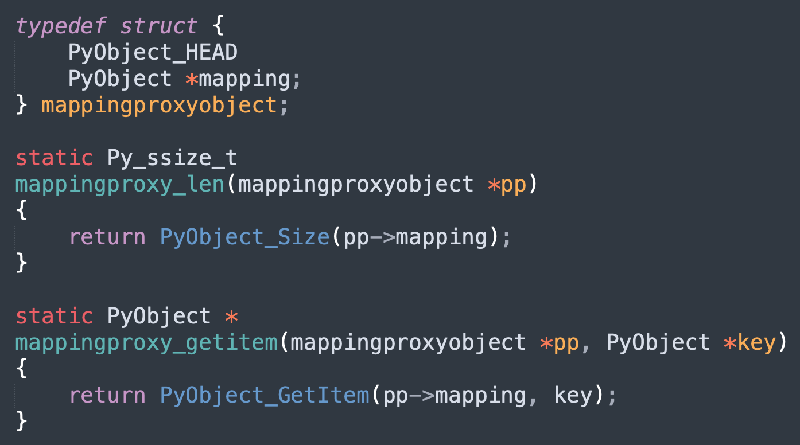
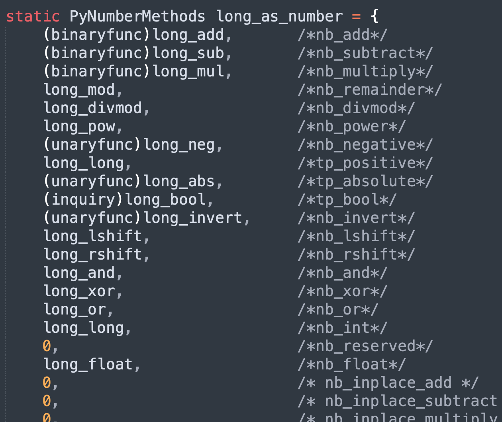
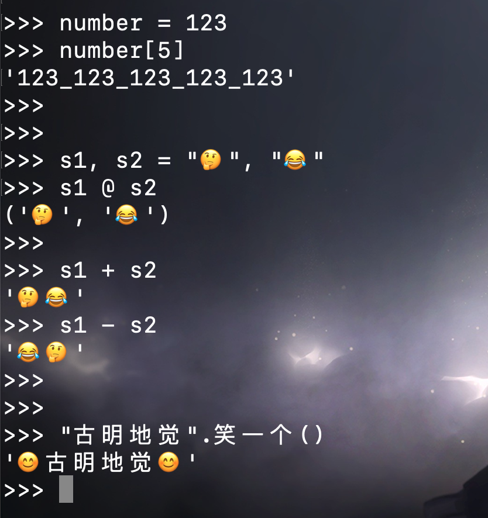

## 楔子

分析了那么久的虚拟机，多少会有点无聊，那么本次我们来介绍一个好玩的，看看如何修改 Python 的底层数据结构和运行时。了解虚拟机除了可以让我们写出更好的代码之外，还可以对 Python 进行改造。举个栗子：


是不是很有趣呢？通过 Python 内置的 ctypes 模块即可做到，而具体的实现方式一会儿说。所以本次的工具就是 ctypes 模块，需要你对它已经或多或少有一些了解，如果不了解的话也没关系，我们会在下一篇文章介绍 ctypes。

Python 的对象本质上就是 C 的 malloc 函数为结构体实例在堆区申请的一块内存，比如整数是 PyLongObject、浮点数是 PyFloatObject、列表是 PyListObject，以及所有的类型都是 PyTypeObject 等等。

下面就来构造这些数据结构并观察 Python 对象的运行时表现。

> **免责声明：本文介绍的内容绝不能用于生产环境，仅仅只是为了更好地理解 Python 虚拟机、或者做测试的时候使用，用于生产环境是绝对的大忌。**

## 浮点数

先来看看浮点数，因为浮点数比整数要简单，看一下底层的定义。

```c
typedef struct {
    PyObject_HEAD
    double ob_fval;
} PyFloatObject;
```

除了 PyObject 这个公共的头部信息之外，只有一个额外的 ob_fval，用于存储具体的值，而类型直接使用 C 的 double。

```Python
from ctypes import *

class PyObject(Structure):
    # PyObject，所有对象底层都会有这个结构体
    _fields_ = [
        ("ob_refcnt", c_ssize_t),
        # 类型对象一会儿说，这里就先用 void * 模拟
        ("ob_type", c_void_p)  
    ]

class PyFloatObject(PyObject):
    # 定义 PyFloatObject，继承 PyObject
    _fields_ = [
        ("ob_fval", c_double)
    ]

# 创建一个浮点数
f = 3.14
# 构造 PyFloatObject，将对象的地址传进去
# float_obj 就是 f 在底层的表现形式
float_obj = PyFloatObject.from_address(id(f))
print(float_obj.ob_fval)  # 3.14

# 修改一下
print(
    f"f = {f}，id(f) = {id(f)}"
)  # f = 3.14，id(f) = 39868760276016
float_obj.ob_fval = 1.73
print(
    f"f = {f}，id(f) = {id(f)}"
)  # f = 1.73，id(f) = 39868760276016
```

我们修改 float_obj.ob_fval 也会影响 f，并且修改前后 f 指向的对象的地址没有发生改变。同时我们也可以观察一个对象的引用计数，举个栗子：

```Python
f = 3.14
float_obj = PyFloatObject.from_address(id(f))
# 此时 3.14 这个浮点数的引用计数为 3
print(float_obj.ob_refcnt)  # 3
# 再来一个
f2 = f
print(float_obj.ob_refcnt)  # 4
f3 = f
print(float_obj.ob_refcnt)  # 5

# 删除变量
del f2, f3
print(float_obj.ob_refcnt)  # 3
```

所以这就是引用计数机制，当对象被引用，引用计数加 1；当引用该对象的变量被删除，引用计数减 1；当对象的引用计数为 0 时，对象被销毁。

## 整数

再来看看整数，我们知道 Python 整数是不会溢出的，换句话说，它可以计算无穷大的数。那么问题来了，它是怎么办到的呢？想要知道答案，只需看底层的结构体定义即可。

```C
typedef struct {
    PyObject_VAR_HEAD
    // digit 等价于 unsigned int
    digit ob_digit[1];  
} PyLongObject;
```

明白了，原来 Python 的整数在底层是用数组存储的，通过串联多个无符号 32 位整数来表示更大的数。

~~~Python
from ctypes import *

class PyVarObject(Structure):
    _fields_ = [
        ("ob_refcnt", c_ssize_t),
        ("ob_type", c_void_p),
        ("ob_size", c_ssize_t)
    ]

class PyLongObject(PyVarObject):
    _fields_ = [
        ("ob_digit", (c_uint32 * 1))
    ]

num = 1024
long_obj = PyLongObject.from_address(id(num))
print(long_obj.ob_digit[0])  # 1024
# PyLongObject 的 ob_size 表示 ob_digit 数组的长度
# 此时显然为 1
print(long_obj.ob_size)  # 1

# 但是在介绍整数的时候说过，ob_size 还可以表示整数的符号
# 我们将 ob_size 改成 -1，再打印 num
long_obj.ob_size = -1
print(num)  # -1024
# 此时就悄悄地将 num 改成了负数
~~~

当然我们也可以修改值：

```Python
num = 1024
long_obj = PyLongObject.from_address(id(num))
long_obj.ob_digit[0] = 4096
print(num)  # 4096
```

digit 是 32 位无符号整型，不过虽然占 32 个位，但实际只用 30 个位，这也意味着一个 digit 能存储的最大整数就是 2 的 30 次方减 1。如果数值再大一些，那么就需要两个 digit 来存储，第二个 digit 的最低位从 31 开始。

```Python
# 此时一个 digit 能够存储的下，所以 ob_size 为 1
num1 = 2 ** 30 - 1
long_obj1 = PyLongObject.from_address(id(num1))
print(long_obj1.ob_size)  # 1

# 此时一个 digit 存不下了，所以需要两个 digit，因此 ob_size 为 2
num2 = 2 ** 30
long_obj2 = PyLongObject.from_address(id(num2))
print(long_obj2.ob_size)  # 2
```

当然了，用数组实现大整数的思路其实没什么新鲜的，难点在于大整数的数学运算的具体实现，它们才是重点，也是比较考验编程功底的地方。

## 字节序列

字节序列就是 Python 的 bytes 对象，在存储或网络通讯时，传输的都是字节序列。bytes 对象在底层的结构体为 PyBytesObject，看一下相关定义。

```C
typedef struct {
    PyObject_VAR_HEAD
    Py_hash_t ob_shash;
    char ob_sval[1];
} PyBytesObject;
```

解释一下里面每个字段的含义：

+ PyObject_VAR_HEAD：变长对象的公共头部；
+ ob_shash：保存该字节序列的哈希值，之所以选择保存是因为在很多场景都需要 bytes 对象的哈希值。而 Python 在计算哈希值的时候，需要遍历每一个字节，因此开销比较大。所以在计算一次之后会保存起来，这样以后就不需要算了，可以直接拿来用，并且 bytes 对象是不可变的，所以哈希值是不变的；
+ ob_sval：这个和 PyLongObject 中的 ob_digit 的声明方式是类似的，虽然声明的时候长度是 1，但具体是多少则取决于 bytes 对象的字节数量。这是 C 语言中定义"变长数组"的技巧，虽然写的长度是 1，但是你可以当成 n 来用，n 可取任意值。显然这个 ob_sval 存储的是所有的字节，因此 Python 中的 bytes 对象在底层是通过字符数组存储的。而且数组会多申请一个空间，用于存储 \\0，因为 C 是通过 \\0 来表示一个字符数组的结束，但是计算 ob_size 的时候不包括 \\0；

~~~python
from ctypes import *

class PyVarObject(Structure):
    _fields_ = [
        ("ob_refcnt", c_ssize_t),
        ("ob_type", c_void_p),
        ("ob_size", c_ssize_t)
    ]

class PyBytesObject(PyVarObject):
    _fields_ = [
        ("ob_shash", c_ssize_t),
        # 这里我们就将长度声明为 100
        ("ob_sval", (c_char * 100))
    ]

b = b"hello"
bytes_obj = PyBytesObject.from_address(id(b))
# 长度
print(bytes_obj.ob_size, len(b))  # 5 5
# 哈希值
print(bytes_obj.ob_shash)  # 967846336661272849
print(hash(b))  # 967846336661272849

# 修改哈希值，再调用 hash 函数会发现结果变了
# 说明 hash(b) 会直接获取底层已经计算好的 ob_shash 字段的值
bytes_obj.ob_shash = 666
print(hash(b))  # 666

# 修改 ob_sval
bytes_obj.ob_sval = b"hello world"
print(b)  # b'hello'
# 我们看到打印的依旧是 "hello"
# 原因是 ob_size 为 5，只会选择前 5 个字节
# 修改之后再次打印
bytes_obj.ob_size = 11
print(b)  # b'hello world'
bytes_obj.ob_size = 15
# 用 \0 填充
print(b)  # b'hello world\x00\x00\x00\x00'
~~~

除了 bytes 对象之外，Python 还有一个 bytearray 对象，它和 bytes 对象类似，只不过 bytes 对象是不可变的，而 bytearray 对象是可变的。

## 列表

列表可以说使用的非常广泛了，在初学列表的时候，有人会告诉你列表就是一个大仓库，什么都可以存放。但我们知道，列表中存放的元素其实都是泛型指针 PyObject *。

看看列表的底层结构：

```c
typedef struct {
    PyObject_VAR_HEAD
    PyObject **ob_item;
    Py_ssize_t allocated;
} PyListObject;
```

里面有如下字段：

- PyObject_VAR_HEAD：变长对象的公共头部信息；
- ob_item：一个二级指针，指向一个 PyObject * 类型的指针数组，这个指针数组保存的便是对象的指针，而操作底层数组都是通过 ob_item 来进行操作的；
- allocated：容量，我们知道列表底层是使用了 C 的数组，而底层数组的长度就是列表的容量；

```Python
from ctypes import *

class PyVarObject(Structure):
    _fields_ = [
        ("ob_refcnt", c_ssize_t),
        ("ob_type", c_void_p),
        ("ob_size", c_ssize_t)
    ]

class PyListObject(PyVarObject):
    _fields_ = [
        # ctypes 下面有一个 py_object 类，它等价于底层的 PyObject *
        # 但 ob_item 类型为 PyObject **，所以这里的类型声明为 POINTER(py_object)
        ("ob_item", POINTER(py_object)),
        ("allocated", c_ssize_t)
    ]

lst = [1, 2, 3, 4, 5]
list_obj = PyListObject.from_address(id(lst))
# 列表在计算长度的时候，会直接获取 ob_size 字段的值
# 对元素进行添加、删除，ob_size 也会动态变化，因为该字段负责维护列表的长度
print(list_obj.ob_size)  # 5
print(len(lst))  # 5

# 修改 ob_size 为 2，打印列表只会显示两个元素
list_obj.ob_size = 2
print(lst)  # [1, 2]
try:
    lst[2]  # 访问索引为 2 的元素会越界
except IndexError as e:
    print(e)  # list index out of range

# 修改元素，由于 ob_item 里面的元素是 PyObject *
# 所以这里需要调用 py_object 显式转一下
list_obj.ob_item[0] = py_object("😂")
print(lst)  # ['😂', 2]
```

是不是很有趣呢？

## 元组

下面来看看元组，我们可以把元组看成是不支持元素添加、修改、删除等操作的列表。元组的实现机制非常简单，可以看作是在列表的基础上丢弃了增删改等操作。

```C
typedef struct {
    PyObject_VAR_HEAD
    PyObject *ob_item[1];
} PyTupleObject;
```

元组的底层结构体定义也非常简单，一个引用计数、一个类型、一个指针数组，数组里面的 1 可以想象成 n。和列表不同，元组没有 allocated，因为它是不可变的，不支持扩容操作。

```python
from ctypes import *

class PyVarObject(Structure):
    _fields_ = [
        ("ob_refcnt", c_ssize_t),
        ("ob_type", c_void_p),
        ("ob_size", c_ssize_t)
    ]

class PyTupleObject(PyVarObject):
    _fields_ = [
        # 这里我们假设里面可以存 10 个元素
        ("ob_item", (py_object * 10)),
    ]

tpl = (11, 22, 33)
tuple_obj = PyTupleObject.from_address(id(tpl))
print(tuple_obj.ob_size)  # 3
print(len(tpl))  # 3

# 修改元组内的元素
print(f"修改前：id(tpl) = {id(tpl)}，tpl = {tpl}")
tuple_obj.ob_item[0] = py_object("🍑")
print(f"修改后：id(tpl) = {id(tpl)}，tpl = {tpl}")
"""
修改前：id(tpl) = 140570376749888，tpl = (11, 22, 33)
修改后：id(tpl) = 140570376749888，tpl = ('🍑', 22, 33)
"""
```

此时我们就成功修改了元组里面的元素，并且修改前后元组的地址没有改变。

所谓的对象是否可变，取决于解释器有没有将修改对象的接口暴露给我们，但站在解释器的角度上，没有什么可变不可变，都是可变的。

## 给类对象增加属性

我们知道类对象是有自己的属性字典的，但这个字典不允许修改，因为准确来说它不是字典，而是一个 mappingproxy 对象。

```Python
print(str.__dict__.__class__)  # <class 'mappingproxy'>

try:
    str.__dict__["嘿"] = "蛤"
except Exception as e: 
    print(e)  # 'mappingproxy' object does not support item assignment
```

我们无法通过修改 mappingproxy 对象来给类增加属性，因为它不支持增加、修改以及删除操作。当然自定义的类可以通过 setattr 方法实现，但内置的类是行不通的，内置的类无法通过 setattr 进行属性添加。

因此如果想给内置的类增加属性，只能通过 mappingproxy 入手，我们看一下它的底层结构。



所谓的 mappingproxy 就是对字典包了一层，并只提供了查询功能。而且从函数 mappingproxy_len 和 mappingproxy_getitem 可以看出，mappingproxy 对象的长度就是内部字典的长度，获取 mappingproxy 对象的元素实际上就是获取内部字典的元素，因此操作 mappingproxy 对象就等价于操作其内部的字典。

所以我们只要能拿到 mappingproxy 对象内部的字典，那么就可以直接操作字典来修改类属性。而 Python 有一个模块叫 gc，它可以帮我们实现这一点，举个栗子：

~~~python
import gc

tpl = ("hello", 123, "😒")
# gc.get_referents(obj) 返回所有被 obj 引用的对象
# 以列表的形式返回
print(gc.get_referents(tpl))  # ['😒', 123, 'hello']
# 显然 tpl 引用的就是内部的三个元素

# 此外还有 gc.get_referrers(obj)，它会返回所有引用了 obj 的对象
~~~

那么问题来了，你觉得 mappingproxy 对象引用了谁呢？显然就是内部的字典。

```python
import gc

# str.__dict__ 是一个 mappingproxy 对象
# 这里拿到其内部的字典
d = gc.get_referents(str.__dict__)[0]
# 随便增加一个属性
d["嘿"] = "蛤"
print(str.嘿)  # 蛤
print("嘿".嘿)  # 蛤

# 当然我们也可以增加一个函数，记得要有一个 self 参数
d["smile"] = lambda self: self + "😊"
print("微笑".smile())  # 微笑😊
print(str.smile("微笑"))  # 微笑😊
```

但需要注意的是，我们上面添加的是不存在的新属性，如果是覆盖一个已经存在的属性或者函数，那么还缺一步。

~~~python
from ctypes import *
import gc

s = "hello world"
print(s.split())  # ['hello', 'world']

d = gc.get_referents(str.__dict__)[0]
# 覆盖 split 函数
d["split"] = lambda self, *args: "我被 split 了"
# 这里需要调用 pythonapi.PyType_Modified 来更新上面所做的修改
# 如果没有这一步，那么是没有效果的，甚至还会出现丑陋的段错误，使得解释器异常退出
pythonapi.PyType_Modified(py_object(str))
print(s.split())  # 我被 split 了
~~~

但是还不够完善，因为函数的名字没有修改，而且覆盖之后原来的名字也找不到了。

```Python
print(s.split.__name__)  # <lambda>
```

函数在修改之后名字就变了，匿名函数的名字就叫 \<lambda\>，所以我们可以再完善一下。

~~~Python
from ctypes import *
import gc

def patch_builtin_class(cls, name, value):
    """
    :param cls: 要修改的类
    :param name: 属性名或者函数名
    :param value: 值
    :return:
    """
    if type(cls) is not type:
        raise ValueError("cls 必须是一个类对象")
    # 获取 cls.__dict__ 内部的字典
    cls_attrs = gc.get_referents(cls.__dict__)[0]
    # 如果该属性或函数不存在，结果为 None
    # 否则将值取出来，赋值给 old_value
    old_value = cls_attrs.get(name, None)
    # 将 name、value 组合起来放到 cls_attrs 中，为 cls 这个类添砖加瓦
    cls_attrs[name] = value

    # 如果 old_value 为 None，说明我们添加了一个新的属性或函数
    # 如果 old_value 不为 None，说明我们覆盖了一个已存在的属性或函数
    if old_value is not None:
        try:
            # 将原来函数的 __name__、__qualname__ 赋值给新的函数
            # 如果不是函数，而是普通属性，那么会因为没有 __name__ 而抛出 AttributeError
            # 这里我们直接 pass 掉即可，无需关心
            value.__name__ = old_value.__name__
            value.__qualname__ = old_value.__qualname__
        except AttributeError:
            pass
        # 但是原来的属性或函数最好也不要丢弃，我们可以改一个名字
        # 假设我们修改 split 函数，那么修改之后
        # 原来的 split 就需要通过 _str_split 进行调用
        cls_attrs[f"_{cls.__name__}_{name}"] = old_value

    # 不要忘了最关键的一步
    pythonapi.PyType_Modified(py_object(cls))


s = "hello world"
print(s.title())  # Hello World
# 修改内置属性
patch_builtin_class(str, "title", lambda self: "我单词首字母大写了")
print(s.title())  # 我单词首字母大写了
print(s.title.__name__)  # title
# 而原来的 title 则需要通过 _str_title 进行调用
print(s._str_title())  # Hello World
~~~

是不是很好玩呢？很明显，我们不仅可以修改 str，任意的内置的类都是可以修改的。

```Python
lst = [1, 2, 3]
# 将 append 函数换成 pop 函数
patch_builtin_class(list, "append", lambda self: list.pop(self))
# 我们知道 append 需要接收一个参数，但这里不需要传，因为函数已经被换掉了
lst.append()
print(lst)  # [1, 2]
# 而原来的 append 函数，则需要通过 _list_append 进行调用
lst._list_append(666)
print(lst)  # [1, 2, 666]
```

我们还可以添加一个类方法或静态方法：

~~~Python
patch_builtin_class(
    list,
    "new",
    classmethod(lambda cls, n: list(range(n)))
)
print(list.new(5))  # [0, 1, 2, 3, 4]
~~~

还是很有趣的，但需要注意的是，目前的 patch_builtin_class 只能为类添加属性或函数，但其 "实例对象" 使用操作符时的表现是无法操控的。什么意思呢？我们举个栗子：

~~~Python
a, b = 3, 4
# 每一个操作背后都被抽象成了一个魔法方法
print(int.__add__(a, b))  # 7
print(a.__add__(b))  # 7
print(a + b)  # 7

# 重写 __add__
patch_builtin_class(int, "__add__", lambda self, other: self * other)
print(int.__add__(a, b))  # 12
print(a.__add__(b))  # 12
print(a + b)  # 7
~~~

我们看到重写了 \_\_add\_\_ 之后，直接调用魔法方法的话是没有问题的，打印的是重写之后的结果。而使用操作符 + 时，却没有走我们重写之后的 \_\_add\_\_，所以 a + b 的结果还是 7。

~~~python
s1, s2 = "hello", "world"
patch_builtin_class(str, 
                    "__sub__", 
                    lambda self, other: (self, other))
print(s1.__sub__(s2))  
# ('hello', 'world')

try:
    s1 - s2
except TypeError as e:
    print(e) 
# unsupported operand type(s) for -: 'str' and 'str'
~~~

重写了 \_\_sub\_\_ 之后，直接调用魔法方法的话也是没有问题的，但是用操作符的方式就会报错，告诉我们字符串不支持减法操作，但明明实现了 \_\_sub\_\_ 方法啊。

介绍类型对象的时候，我们看到里面有三个操作簇：

- tp_as_number：实例对象为数值时，所支持的操作；
- tp_as_sequence：实例对象为序列时，所支持的操作；
- tp_as_mapping：实例对象为映射时，所支持的操作；

它们都是结构体指针，指向的结构体中的每一个字段都是一个函数指针，指向的函数便是实例对象可执行的操作。以 int 类型为例，int 在底层对应 PyLong_Type，它的 tp_as_number 字段被初始化为 &long_as_number，我们来看一下。



因此 PyNumberMethods 的字段就是整数所拥有的魔法方法，当然也包括浮点数。

而我们若想改变操作符的表现行为，需要修改的是 tp_as_\* 里面的字段，而不是简单地修改属性字典。比如我们想修改 a + b 的表现行为，那么就将类对象的 tp_as_number 里面的 nb_add 给改掉。

修改方式也很简单，如果是整形，那么就覆盖掉 long_add，也就是 `(&PyLong_Type)->long_as_number->nb_add`；同理，如果是浮点型，那么就覆盖掉 float_add，也就是 `(&PyFloat_Type)->float_as_number->nb_add`。

## 重载操作符

先说明一下，我们这里针对的都是内置的类。如果是自定义的类，那么利用 Python 的动态特性就足够了。

类对象有 4 个方法簇，分别是 tp_as_number、tp_as_sequence、tp_as_mapping、tp_as_async。这个 tp_as_async 我们没有说，它是和协程有关的，暂时不需要管。总之如果想改变操作符的表现结果，那么就重写里面对应的函数即可。

~~~Python
from ctypes import *
import gc


# 将这些对象提前声明好，之后再进行成员的初始化
class PyObject(Structure): pass


class PyTypeObject(Structure): pass


class PyNumberMethods(Structure): pass


class PySequenceMethods(Structure): pass


class PyMappingMethods(Structure): pass


class PyAsyncMethods(Structure): pass


class PyFile(Structure): pass


PyObject._fields_ = [("ob_refcnt", c_ssize_t),
                     ("ob_type", POINTER(PyTypeObject))]

PyTypeObject._fields_ = [
    ('ob_base', PyObject),
    ('ob_size', c_ssize_t),
    ('tp_name', c_char_p),
    ('tp_basicsize', c_ssize_t),
    ('tp_itemsize', c_ssize_t),
    ('tp_dealloc', CFUNCTYPE(None, py_object)),
    ('printfunc', CFUNCTYPE(c_int, py_object, POINTER(PyFile), c_int)),
    ('getattrfunc', CFUNCTYPE(py_object, py_object, c_char_p)),
    ('setattrfunc', CFUNCTYPE(c_int, py_object, c_char_p, py_object)),
    ('tp_as_async', CFUNCTYPE(PyAsyncMethods)),
    ('tp_repr', CFUNCTYPE(py_object, py_object)),
    ('tp_as_number', POINTER(PyNumberMethods)),
    ('tp_as_sequence', POINTER(PySequenceMethods)),
    ('tp_as_mapping', POINTER(PyMappingMethods)),
    ('tp_hash', CFUNCTYPE(c_int64, py_object)),
    ('tp_call', CFUNCTYPE(py_object, py_object, py_object, py_object)),
    ('tp_str', CFUNCTYPE(py_object, py_object)),
    # 不需要的可以不用写
]

# 方法集就是一个结构体实例，结构体成员都是函数指针
# 所以这里我们要将相关的函数类型声明好
inquiry = CFUNCTYPE(c_int, py_object)
unaryfunc = CFUNCTYPE(py_object, py_object)
binaryfunc = CFUNCTYPE(py_object, py_object, py_object)
ternaryfunc = CFUNCTYPE(py_object, py_object, py_object, py_object)
lenfunc = CFUNCTYPE(c_ssize_t, py_object)
ssizeargfunc = CFUNCTYPE(py_object, py_object, c_ssize_t)
ssizeobjargproc = CFUNCTYPE(c_int, py_object, c_ssize_t, py_object)
objobjproc = CFUNCTYPE(c_int, py_object, py_object)
objobjargproc = CFUNCTYPE(c_int, py_object, py_object, py_object)

PyNumberMethods._fields_ = [
    ('nb_add', binaryfunc),
    ('nb_subtract', binaryfunc),
    ('nb_multiply', binaryfunc),
    ('nb_remainder', binaryfunc),
    ('nb_divmod', binaryfunc),
    ('nb_power', ternaryfunc),
    ('nb_negative', unaryfunc),
    ('nb_positive', unaryfunc),
    ('nb_absolute', unaryfunc),
    ('nb_bool', inquiry),
    ('nb_invert', unaryfunc),
    ('nb_lshift', binaryfunc),
    ('nb_rshift', binaryfunc),
    ('nb_and', binaryfunc),
    ('nb_xor', binaryfunc),
    ('nb_or', binaryfunc),
    ('nb_int', unaryfunc),
    ('nb_reserved', c_void_p),
    ('nb_float', unaryfunc),
    ('nb_inplace_add', binaryfunc),
    ('nb_inplace_subtract', binaryfunc),
    ('nb_inplace_multiply', binaryfunc),
    ('nb_inplace_remainder', binaryfunc),
    ('nb_inplace_power', ternaryfunc),
    ('nb_inplace_lshift', binaryfunc),
    ('nb_inplace_rshift', binaryfunc),
    ('nb_inplace_and', binaryfunc),
    ('nb_inplace_xor', binaryfunc),
    ('nb_inplace_or', binaryfunc),
    ('nb_floor_divide', binaryfunc),
    ('nb_true_divide', binaryfunc),
    ('nb_inplace_floor_divide', binaryfunc),
    ('nb_inplace_true_divide', binaryfunc),
    ('nb_index', unaryfunc),
    ('nb_matrix_multiply', binaryfunc),
    ('nb_inplace_matrix_multiply', binaryfunc)]

PySequenceMethods._fields_ = [
    ('sq_length', lenfunc),
    ('sq_concat', binaryfunc),
    ('sq_repeat', ssizeargfunc),
    ('sq_item', ssizeargfunc),
    ('was_sq_slice', c_void_p),
    ('sq_ass_item', ssizeobjargproc),
    ('was_sq_ass_slice', c_void_p),
    ('sq_contains', objobjproc),
    ('sq_inplace_concat', binaryfunc),
    ('sq_inplace_repeat', ssizeargfunc)]

# 将这些魔法方法的名字和底层的结构体成员组合起来
magic_method_dict = {
    "__add__": ("tp_as_number", "nb_add"),
    "__sub__": ("tp_as_number", "nb_subtract"),
    "__mul__": ("tp_as_number", "nb_multiply"),
    "__mod__": ("tp_as_number", "nb_remainder"),
    "__pow__": ("tp_as_number", "nb_power"),
    "__neg__": ("tp_as_number", "nb_negative"),
    "__pos__": ("tp_as_number", "nb_positive"),
    "__abs__": ("tp_as_number", "nb_absolute"),
    "__bool__": ("tp_as_number", "nb_bool"),
    "__inv__": ("tp_as_number", "nb_invert"),
    "__invert__": ("tp_as_number", "nb_invert"),
    "__lshift__": ("tp_as_number", "nb_lshift"),
    "__rshift__": ("tp_as_number", "nb_rshift"),
    "__and__": ("tp_as_number", "nb_and"),
    "__xor__": ("tp_as_number", "nb_xor"),
    "__or__": ("tp_as_number", "nb_or"),
    "__int__": ("tp_as_number", "nb_int"),
    "__float__": ("tp_as_number", "nb_float"),
    "__iadd__": ("tp_as_number", "nb_inplace_add"),
    "__isub__": ("tp_as_number", "nb_inplace_subtract"),
    "__imul__": ("tp_as_number", "nb_inplace_multiply"),
    "__imod__": ("tp_as_number", "nb_inplace_remainder"),
    "__ipow__": ("tp_as_number", "nb_inplace_power"),
    "__ilshift__": ("tp_as_number", "nb_inplace_lshift"),
    "__irshift__": ("tp_as_number", "nb_inplace_rshift"),
    "__iand__": ("tp_as_number", "nb_inplace_and"),
    "__ixor__": ("tp_as_number", "nb_inplace_xor"),
    "__ior__": ("tp_as_number", "nb_inplace_or"),
    "__floordiv__": ("tp_as_number", "nb_floor_divide"),
    "__div__": ("tp_as_number", "nb_true_divide"),
    "__ifloordiv__": ("tp_as_number", "nb_inplace_floor_divide"),
    "__idiv__": ("tp_as_number", "nb_inplace_true_divide"),
    "__index__": ("tp_as_number", "nb_index"),
    "__matmul__": ("tp_as_number", "nb_matrix_multiply"),
    "__imatmul__": ("tp_as_number", "nb_inplace_matrix_multiply"),

    "__len__": ("tp_as_sequence", "sq_length"),
    "__concat__": ("tp_as_sequence", "sq_concat"),
    "__repeat__": ("tp_as_sequence", "sq_repeat"),
    "__getitem__": ("tp_as_sequence", "sq_item"),
    "__setitem__": ("tp_as_sequence", "sq_ass_item"),
    "__contains__": ("tp_as_sequence", "sq_contains"),
    "__iconcat__": ("tp_as_sequence", "sq_inplace_concat"),
    "__irepeat__": ("tp_as_sequence", "sq_inplace_repeat")
}
keep_method_alive = {}
keep_method_set_alive = {}


# 以上就准备就绪了
# 下面再将之前的 patch_builtin_class 函数补充一下即可
def patch_builtin_class(cls, name, value):
    """
    :param cls: 要修改的类
    :param name: 属性名或者函数名
    :param value: 值
    :return:
    """
    if type(cls) is not type:
        raise ValueError("cls 必须是一个类对象")
    cls_attrs = gc.get_referents(cls.__dict__)[0]
    old_value = cls_attrs.get(name, None)
    cls_attrs[name] = value
    if old_value is not None:
        try:
            value.__name__ = old_value.__name__
            value.__qualname__ = old_value.__qualname__
        except AttributeError:
            pass
        cls_attrs[f"_{cls.__name__}_{name}"] = old_value
    pythonapi.PyType_Modified(py_object(cls))
    # 以上逻辑不变，然后对参数 name 进行检测
    # 如果是魔方方法、并且 value 是一个可调用对象，那么修改操作符
    # 否则直接 return
    if not (name in magic_method_dict and callable(value)):
        return
    # 比如 name 是 __sub__
    # 那么 tp_as_name, rewrite == "tp_as_number", "nb_sub"
    tp_as_name, rewrite = magic_method_dict[name]
    # 获取类对应的底层结构，PyTypeObject 实例
    type_obj = PyTypeObject.from_address(id(cls))
    # 根据 tp_as_name 判断到底是哪一个方法集
    # 这里我们没有实现 tp_as_mapping 和 tp_as_async
    # 有兴趣可以自己实现一下
    struct_method_set_class = (
        PyNumberMethods if tp_as_name == "tp_as_number"
        else PySequenceMethods if tp_as_name == "tp_as_sequence"
        else PyMappingMethods if tp_as_name == "tp_as_mapping"
        else PyAsyncMethods)
    
    # 获取具体的方法集（指针）
    struct_method_set_ptr = getattr(type_obj, tp_as_name, None)
    if not struct_method_set_ptr:
        # 如果不存在此方法集，我们实例化一个，然后设置到里面去
        struct_method_set = struct_method_set_class()
        # 注意我们要传一个指针进去
        setattr(type_obj, tp_as_name, pointer(struct_method_set))
    # 然后对指针进行解引用，获取方法集，也就是对应的结构体实例
    struct_method_set = struct_method_set_ptr.contents
    # 遍历 struct_method_set_class，判断到底重写的是哪一个魔法方法
    cfunc_type = None
    for field, ftype in struct_method_set_class._fields_:
        if field == rewrite:
            cfunc_type = ftype
    # 构造新的函数
    cfunc = cfunc_type(value)
    # 更新方法集
    setattr(struct_method_set, rewrite, cfunc)
    # 至此我们的功能就完成了，但还有一个非常重要的点，就是上面的 cfunc
    # 虽然它是一个底层可以识别的 C 函数，但它本质上仍然是一个 Python 对象
    # 其内部维护了 C 级数据，赋值之后底层会自动提取，而这一步不会增加引用计数
    # 所以这个函数结束之后，cfunc 就被销毁了（连同内部的 C 级数据）
    # 这样后续再调用相关操作符的时候就会出现段错误，解释器异常退出
    # 因此我们需要在函数结束之前创建一个在外部持有它的引用
    keep_method_alive[(cls, name)] = cfunc
    # 当然还有我们上面的方法集，也是同理
    keep_method_set_alive[(cls, name)] = struct_method_set
~~~

代码量还是稍微有点多的，但是不难理解，我们将这些代码放在一个单独的文件里面，文件名就叫 unsafe_magic.py，然后导入它。

```Python
from unsafe_magic import patch_builtin_class


# 重载 [] 操作符
patch_builtin_class(int, 
                    "__getitem__", 
                    lambda self, item: "_".join([str(self)] * item))
# 重载 @ 操作符
patch_builtin_class(str, 
                    "__matmul__", 
                    lambda self, other: (self, other))
# 重载 - 操作符
patch_builtin_class(str, 
                    "__sub__",
                    lambda self, other: other + self)

# 添加一个方法
patch_builtin_class(str,
                    "笑一个",
                    lambda self: "😊笑一个😊")
```

你觉得之后会发生什么呢？我们测试一下：



怎么样，是不是很好玩呢？

~~~python
from unsafe_magic import patch_builtin_class


patch_builtin_class(tuple, "append", lambda self, item: self + (item, ))
t = ()
print(t.append(1).append(2).append(3).append(4))  # (1, 2, 3, 4)
~~~

因此 Python 给开发者赋予的权限是非常高的，你可以玩出很多意想不到的新花样。

另外再多说一句，当对象不支持某个操作符的时候，我们能够让它实现该操作符；但如果对象已经实现了某个操作符，那么其逻辑就改不了了，举个栗子：

~~~python
from unsafe_magic import patch_builtin_class

# str 没有 __div__，我们可以为其实现，此时字符串便拥有了除法的功能
patch_builtin_class(str, 
                    "__div__", 
                    lambda self, other: (self, other))
print("hello" / "world")  # ('hello', 'world')

# 但 __add__ 是 str 本身就有的，也就是说字符串本身就可以相加
# 那么此时我们就无法覆盖加法这个操作符了
patch_builtin_class(str, 
                    "__add__", 
                    lambda self, other: (self, other))
print("你" + "好")  # 你好

# 上面使用加号，并没有走我们重写之后的 __add__ 方法，因为字符串本身就支持加法运算
# 但也有例外，就是当出现 TypeError 的时候，那么解释器会执行我们重写的方法
# 比如字符串和整数相加会出现 TypeError，因此解释器会执行重写的 __add__
print("你" + 123)  # ('你', 123)
# 但如果是调用魔方方法，那么会直接走重写的 __add__
print("你".__add__("好"))  # ('你', '好')
~~~

不过上述这个问题在 3.6 版本的时候是没有的，操作符会无条件地执行我们重写的魔法方法。但在 3.8 的时候出现了这个现象，至于更高版本的 Python，可以自己测试一下。

## 小结

以上我们就用 ctypes 玩了一些骚操作，内容还是有点单调，当然你也可以玩的再嗨一些。但是无论如何，一定不要在生产上使用，线上不要出现这种会改变解释器运行逻辑的代码。如果只是为了调试、或者想从实践的层面更深入地了解虚拟机，那么没事可以玩一玩。

------

&nbsp;

**欢迎大家关注我的公众号：古明地觉的编程教室。**


**如果觉得文章对你有所帮助，也可以请作者吃个馒头，Thanks♪(･ω･)ﾉ。**

