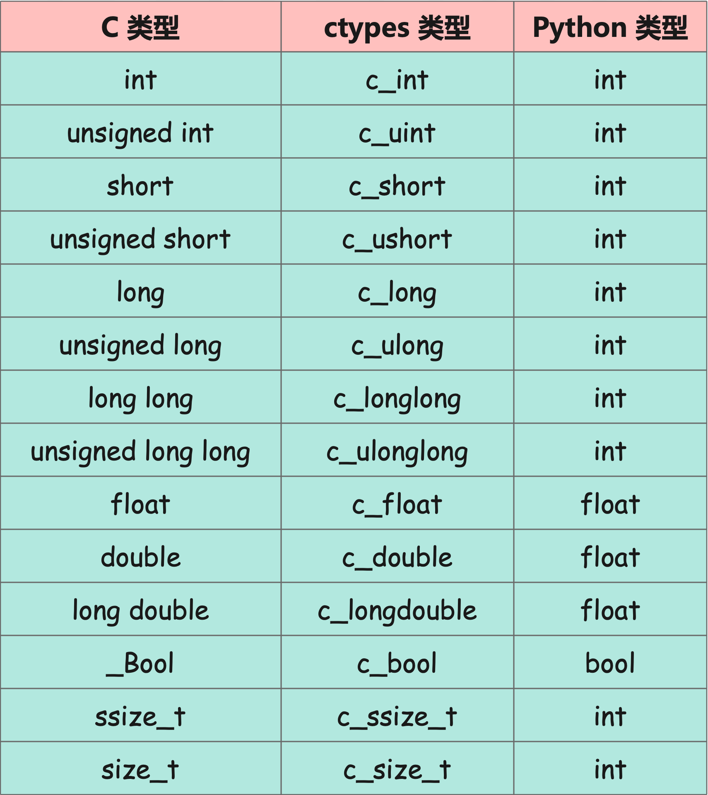

## 楔子

关于 Python 调用 C 库有很多种方式，通过 ctypes 调用 C 库是最简单的一种方式，因为只对操作系统有要求。比如 Windows 上编译的动态库是 .dll 文件，Linux 上编译的动态库是 .so 文件，只要操作系统一致，那么任何提供了 ctypes 模块的 Python 解释器都可以调用。所以当 Python 和 C 的交互不复杂时一般会使用 ctypes，比如嵌入式设备，可能只是简单调用底层驱动提供的某个接口而已。

再比如我们使用 C 写了一个高性能的算法，然后通过 ctypes 模块进行调用也是可以的。只是 ctypes 具有相应的局限性，就是 C 提供的接口不能太复杂。因为 ctypes 提供的交互能力还是比较有限的，最明显的问题就是不同语言的数据类型不同，一些复杂的交互方式还是比较难做到的，还有多线程的控制问题等等。

## 举个小例子

首先举个例子演示一下，我们创建一个文件 main.c。

```C
int f() {
    return 123;
}
```

这是个简单到不能再简单的 C 函数，然后将它编译成动态库，编译方式如下：


其中源文件可以指定多个，这里我们将 main.c 编译成 main.dll，那么命令就是：<font color="blue">gcc main.c -shared -o main.dll</font>。编译成功之后，通过 ctypes 来进行调用。

~~~Python
import ctypes

# 使用 ctypes 很简单，直接 import 进来
# 然后通过 ctypes.CDLL 或 ctypes.cdll.LoadLibrary 加载动态链接库
lib = ctypes.CDLL("./main.dll")

# 加载之后就得到了动态链接库对象，我们起名为 lib
# 然后通过属性访问的方式去调用里面的函数
print(lib.f())  # 123

# 如果不确定函数是否存在，那么建议使用反射
# 因为函数不存在，通过 . 的方式获取是会抛异常的
f = getattr(lib, "f", None)
if f:
    print(f)  # <_FuncPtr object at 0x7fc0388bb640>
    print(lib.f())  # 123

# 不存在 f2 这个函数，所以得到的结果为 None
f2 = getattr(lib, "f2", None)
print(f2)  # None
~~~

所以使用 ctypes 去调用动态链接库非常方便，过程很简单：

- 1）通过 ctypes.CDLL 去加载动态库；
- 2）加载动态链接库之后会返回一个对象，我们上面起名为 lib；
- 3）然后可以直接通过 lib 调用里面的函数，但为了程序的健壮性，我们会更倾向于使用反射，确定调用的函数存在后才会调用。

> 另外上面是以 Windows 系统演示的，Linux 也是一样的，只不过动态库在 Linux 系统上是以 .so 结尾。

此外也可以在 C 中进行打印，举个例子：

```C
#include <stdio.h>

void f(){
    printf("hello world\n");
}
```

然后编译，进行调用。

```Python
import ctypes

lib = ctypes.CDLL("./main.dll")
lib.f()  # hello world
```

以上的输出是 C 里面的 printf 打印的。

另外需要注意：ctypes 调用的都是 C 函数，如果你用 C++ 编译器，那么会编译成 C++ 中的函数，而这两种函数是不一样的。比如 C 的函数不支持重载，说白了就是不能定义两个同名的函数；而 C++ 的函数是支持重载的，只要参数类型不一样即可，然后调用的时候会根据传递的参数调用对应的函数。

所以当我们使用 C++ 编译器的时候，需要通过 <font color="blue">extern "C" {}</font> 将函数包起来，这样 C++ 编译器在编译的时候会将其编译成 C 的函数。

```C
#include <stdio.h>

#ifdef __cplusplus
extern "C" {
#endif

void f() {
    printf("hello world\n");
}

#ifdef __cplusplus
}
#endif
```

当然我们在介绍 ctypes 时使用的都是 gcc，会编译成 C 的函数，所以后面 extern "C" 的逻辑就不加了。

以上就演示了如何通过 ctypes 模块来调用 C 的动态库，但显然目前还是远远不够的。比如说：

```c
double f() {
    return 3.14;
}
```

函数返回了一个浮点数，那么调用的时候，会得到什么结果呢？来试一下：

```Python
import ctypes

lib = ctypes.CDLL(r"./main.dll")
print(lib.f())  # 1374389535
```

我们看到返回了一个不符合预期的结果，先暂且不纠结它是怎么来的，现在的问题是它返回的为什么不是 3.14 呢？原因是 ctypes 在解析的时候默认是按照整型来解析的，但当前的 C 函数返回的是浮点型，因此函数在调用之前需要显式地指定其返回值类型。

不过在这之前，我们需要先来看看 Python 类型和 C 类型之间的转换关系。

## Python 类型与 C 类型之间的转换

使用 ctypes 调用动态链接库，主要是调用库里面使用 C 编写好的函数，但这些函数肯定是需要参数的，还有返回值。那么问题来了，不同语言的变量类型不同，所以 Python 能够直接往 C 编写的函数中传参吗？显然不行，因此 ctypes 提供了大量的类，帮我们将 Python 中的类型转成 C 语言中的类型。

### 数值类型转换

C 语言的数值类型分为如下：

- int：整型；
- unsigned int：无符号整型；
- short：短整型；
- unsigned short：无符号短整型；
- long：该类型取决于系统，可能是长整型，也可能等同于 int；
- unsigned long：该类型取决于系统，可能是无符号长整型，也可能等同于 unsigned int；
- long long：长整型；
- unsigned long long：无符号长整型；
- float：单精度浮点型；
- double：双精度浮点型；
- long double：长双精度浮点型，此类型的浮点数占 16 字节；
- _Bool：布尔类型；
- ssize_t：等同于长整型；
- size_t：等同于无符号长整型；

和 Python 以及 ctypes 之间的对应关系如下：



下面来演示一下：

```python
import ctypes
# 以下都是 ctypes 提供的类
# 将 Python 的数据传进去，就可以转换为 C 的数据
print(ctypes.c_int(1))  # c_long(1)
print(ctypes.c_uint(1))  # c_ulong(1)
print(ctypes.c_short(1))  # c_short(1)
print(ctypes.c_ushort(1))  # c_ushort(1)
print(ctypes.c_long(1))  # c_long(1)
print(ctypes.c_ulong(1))  # c_ulong(1)
print(ctypes.c_longlong(1))  # c_longlong(1)
print(ctypes.c_ulonglong(1))  # c_ulonglong(1)
print(ctypes.c_float(1.1))  # c_float(1.100000023841858)
print(ctypes.c_double(1.1))  # c_double(1.1)
print(ctypes.c_longdouble(1.1))  # c_double(1.1)
print(ctypes.c_bool(True))  # c_bool(True)
# 相当于 c_longlong 和 c_ulonglong
print(ctypes.c_ssize_t(10))  # c_longlong(10)
print(ctypes.c_size_t(10))  # c_ulonglong(10)
```

而 C 的数据转成 Python 的数据也非常容易，只需要在此基础上获取 value 属性即可。

```Python
import ctypes
print(ctypes.c_int(1024).value)  # 1024
print(ctypes.c_int(1024).value == 1024)  # True
```

以上是数值类型，比较简单。

### 字符类型转换

C 语言的字符类型分为如下：

- char：一个 -128~127 的整数；
- unsigned char：一个 0~255 的整数；
- wchar：一个 unicode 字符；

和 Python 以及 ctypes 之间的对应关系如下：


举个例子：

~~~python
import ctypes

# 必须传递一个字节，或者一个 int，代表 C 里面的字符
print(ctypes.c_char(b"a"))  # c_char(b'a')
print(ctypes.c_char(97))  # c_char(b'a')
# 和 c_char 类似，但是 c_char 既可以接收单个字节、也可以接收整数
# 而这里的 c_byte 只接收整数
print(ctypes.c_byte(97))  # c_byte(97)

# 同样只能传递整数
print(ctypes.c_ubyte(97))  # c_ubyte(97)

# 传递一个 unicode 字符
# 当然 ascii 字符也是可以的，并且不是字节形式
print(ctypes.c_wchar("憨"))  # c_wchar('憨')
~~~

以上是字符类型。

### 字符串类型转换

C 的字符串分为以下两种：

- char \*：ASCII 字符组成的字符串；
- wchar_t \*：宽字符组成的字符串；

对应关系如下：


举个例子：

~~~Python
from ctypes import *

# c_char_p 就是 c 里面的字符数组了，可以把它看成是 Python 中的 bytes 对象
# 而里面也要传递一个 bytes 对象，然后返回一个地址
# 下面就等价于 char *s = "hello world";
x = c_char_p(b"hello world")
print(x)  # c_char_p(2196869884000)
print(x.value)  # b'hello world'

# 直接传递一个字符串，同样返回一个地址
y = c_wchar_p("古明地觉")
print(y)  # c_wchar_p(2196868827808)
print(y.value)  # 古明地觉
~~~

常见的类型就是上面这些，至于其它的类型，比如指针、数组、结构体、回调函数等等，ctypes 也是支持的，我们后面会介绍。

## 参数传递

下面来看看如何向 C 函数传递参数。

```C
#include <stdio.h>

void test(int a, float f, char *s) {
    printf("a = %d, b = %.2f, s = %s\n", a, f, s);
}
```

一个简单的 C 文件，编译成 dll 之后让 Python 去调用，这里编译之后的文件名还叫做 main.dll。

```Python
from ctypes import *

lib = CDLL("./main.dll")
try:
    lib.test(1, 1.2, b"hello world")
except Exception as e:
    print(e)  
# argument 2: <class 'TypeError'>: Don't know how to convert parameter 2

# 我们看到报错了，告诉我们不知道如何转化第二个参数
# 因为 Python 的数据和 C 的数据不一样，所以不能直接传递
# 除了整数之外，其它的数据都需要使用 ctypes 来包装一下
# 另外整数最好也包装一下，这里传入 c_int(1) 和 1 是一样的
lib.test(
    c_int(1), c_float(1.2), c_char_p(b"hello world")
)  # a = 1, b = 1.20, s = hello world
```

我们看到完美地打印出来了，再来试试布尔类型。

```C
#include <stdio.h>

void test(_Bool flag)
{   
    // 布尔类型本质上是一个 int
    printf("a = %d\n", flag);
}
```

布尔类型在 C 里面对应的名字是 _Bool。

```Python
import ctypes
from ctypes import *

lib = ctypes.CDLL("./main.dll")

lib.test(c_bool(True))  # a = 1
lib.test(c_bool(False))  # a = 0
# 可以看到 True 被解释成了 1，False 被解释成了 0

# 我们说整数会自动转化
# 而布尔类型继承自整型，所以布尔值也可以直接传递
lib.test(True)  # a = 1
lib.test(False)  # a = 0
```

以上就是 Python 向 C 函数传递参数，因为是 C 的函数，所以 Python 的数据不能直接传，需要使用 ctypes 转一下才能传递。

## 传递可变的字符串

通过调用 c_char_p 即可得到一个 C 的字符串，或者说字符数组，并且在传递之后，C 函数还可以对其进行修改。

```C
#include <stdio.h>

void test(char *s)
{
    s[0] = 'S';
    printf("%s\n", s);
}
```

文件名为 main.c，编译成 main.dll。

```Python
from ctypes import *

lib = CDLL("./main.dll")
lib.test(c_char_p(b"satori"))  # Satori
```

我们看到小写的字符串，第一个字符变成了大写，但即便能修改我们也不建议这么做，因为 bytes 对象在 Python 中是不能更改的，所以在 C 中也不应该更改。当然不是说不让修改，而是应该换一种方式。

如果需要修改的话，那么不要使用 c_char_p 的方式来传递，而是建议通过 create_string_buffer 来给 C 函数传递可以修改字符的空间。

```Python
from ctypes import *

# 传入一个 int，表示创建一个具有固定大小的字符缓存
s = create_string_buffer(10)
# 直接打印就是一个对象
print(s)  # <ctypes.c_char_Array_10 object at 0x00...>
# 也可以获取 value 打印它的值，此时是空字节串
print(s.value)  # b''
# 并且它还有一个 raw 方法，表示 C 的字符数组
# 由于长度为 10，并且没有内容，所以全部是 \x00，即 C 的 \0
print(s.raw)  # b'\x00\x00\x00\x00\x00\x00\x00\x00\x00\x00'
# 还可以查看长度
print(len(s))  # 10
```

create_string_buffer 如果只传一个 int，那么表示创建对应长度的字符缓存。除此之外，还可以指定字节串，此时的字符缓存大小和指定的字节串长度是一致的：

```Python
from ctypes import *

# 直接创建了一个字符缓存
s = create_string_buffer(b"hello")
print(s)  # <ctypes.c_char_Array_6 object at 0x000...>
print(s.value)  # b'hello'
# 我们知道在 C 中，字符数组是以 \0 作为结束标记的
# 所以结尾会有一个 \0，因为 raw 表示 C 中原始的字符数组
print(s.raw)  # b'hello\x00'
# 长度为 6，b"hello" 五个字符再加上 \0 一共 6 个
print(len(s))
```

当然 create_string_buffer 还可以在指定字节串的同时，指定空间大小。

```Python
from ctypes import *

# 如果不指定容量，那么默认和对应的字符数组大小一致
# 但还可以同时指定容量，记得容量要比前面的字节串的长度要大
s = create_string_buffer(b"hello", 10)
print(s)  # <ctypes.c_char_Array_10 object at 0x000...>
print(s.value)  # b'hello'
# 长度为 10，剩余的 5 个显然是 \0
print(s.raw)  # b'hello\x00\x00\x00\x00\x00'
print(len(s))  # 10
```

由于 C 使用 \0 作为字符串结束标记，因此缓存大小为 10 的 buffer，最多能容纳 9 个有效字符。下面我们来看看如何传递 create_string_buffer：

```C
#include <stdio.h>

int test(char *s)
{   
    // 变量的形式依旧是 char *s
    // 下面的操作相当于把字符数组中索引为 5 到 11 的部分换成 " satori"
    s[5] = ' ';
    s[6] = 's';
    s[7] = 'a';
    s[8] = 't';
    s[9] = 'o';
    s[10] = 'r';
    s[11] = 'i';
    printf("s = %s\n", s);
}
```

来测试一下：

```python
from ctypes import *

lib = CDLL("./main.dll")
s = create_string_buffer(b"hello", 20)
lib.test(s)  # s = hello satori
```

此时就成功地修改了，这里的 b"hello" 占五个字节，下一个正好是索引为 5 的地方，然后把索引为 5 到 11 的部分换成对应的字符。但需要注意的是，一定要小心 \\0，因为 C 字符串一旦遇到了 \\0 就表示这个字符串结束了。

~~~python
from ctypes import *

lib = CDLL("./main.dll")
# 这里把 "hello" 换成 "hell"，看看会发生什么
s = create_string_buffer(b"hell", 20)
lib.test(s)  # s = hell

# 我们看到只打印了 "hell"，这是为什么？
# 再打印一下这个 s.raw
print(s.raw)  # b'hell\x00 satori\x00\x00\x00\x00\x00\x00
~~~

create_string_buffer 返回的对象是可变的，在将 s 传进去之后被修改了。如果没有传递的话，我们知道它是长这样的：

`b'hell\x00\x00\x00\x00\x00\x00\x00\x00\x00\x00\x00\x00\x00\x00\x00\x00'`

hell 的后面全部是 C 的 \\0，修改之后变成了这样：

`b'hell\x00 satori\x00\x00\x00\x00\x00\x00\x00\x00'`

我们看到确实是把索引为 5 到 11 的部分变成了 " satori"，但是 C 语言在扫描字符数组的时候一旦遇到了 \\0，就表示结束了，而 hell 的下一个字符就是 \\0。因此即便后面还有内容也不会输出了，所以直接就只打印了 hell。

另外除了 create_string_buffer 之外，还有一个 create_unicode_buffer，针对于 wchar_t *，用法和 create_string_buffer 类似。

## ctypes 获取返回值

通过 ctypes 向动态链接库中的函数传参是没有问题的，但如何拿到返回值呢？之前都是使用 printf 直接打印的，这样显然不行，我们肯定是要拿到返回值去做一些别的事情的。

可能有人觉得在 C 函数中直接 return 不就可以啦，还记得之前演示的返回浮点数的例子吗？明明返回了 3.14，但得到的却是一大长串整数，所以我们需要在调用函数之前告诉 ctypes 返回值的类型。

~~~C
int test1(int a, int b)
{
    int c;
    c = a + b;
    return c;
}

float test2()
{
    return 2.71;
}
~~~

编译成 main.dll，测试一下：

```Python
from ctypes import *

lib = CDLL("./main.dll")
print(lib.test1(25, 33))  # 58
print(lib.test2())  # -1076719780
```

我们看到 test1 的结果是正常的，但是 test2 就有问题了，因为默认都会按照整型进行解析，所以 test2 函数的结果肯定是不正确的。

因为 Python 的数据类型和 C 的数据类型是不同的，正如我们传递参数一样，需要使用 ctypes 转化一下。那么在获取返回值的时候，也需要提前使用 ctypes 指定一下返回值到底是什么类型，只有这样才能正确地拿到动态链接库中函数的返回值。

```Python
from ctypes import *

lib = CDLL("./main.dll")
print(lib.test1(25, 33))  # 58

# 相当于告诉 ctypes，在解析 test2 函数返回值的时候
# 请按照 c_float 进行解析，然后拿到的就是 Python 的 float
lib.test2.restype = c_float
print(lib.test2())  # 2.7100000381469727
```

字符串也是同理：

```C
#include <wchar.h>

char * test1()
{
    char *s = "hello satori";
    return s;
}

wchar_t * test2()
{
    // 遇到 wchar_t 的时候，需要导入 wchar.h 头文件
    wchar_t *s = L"古明地觉";
    return s;
}
```

测试一下：

```Python
from ctypes import *

lib = CDLL("./main.dll")
# 在不指定返回值类型的时候，一律按照整型解析
# 那么拿到的就是 Python 的整数
print(lib.test1())  # 1788100608
# 我们需要指定一下返回的类型，也就是 c_char_p
# 告诉 ctypes 在解析的时候，将 test1 的返回值按照 c_char_p 进行解析
lib.test1.restype = c_char_p
# 然后拿到的就是 bytes 对象，此时就没有问题了
print(lib.test1())  # b'hello satori'

# 同理对于 unicode 也是一样的
# 如果不指定类型，得到的依旧是一个整数
lib.test2.restype = c_wchar_p
print(lib.test2())  # 古明地觉
```

因此我们就将 Python 的类型和 C 的类型通过 ctypes 关联起来了，传参的时候需要转化，同理获取返回值的时候也要使用 ctypes 来声明一下类型。因为默认是按照整型来解析的，至于返回的整型的值到底是什么？从哪里来的？我们不需要关心，你可以理解为地址、或者某块内存的脏数据，但是不管怎么样，结果肯定是不正确的（如果函数返回的就是整型则除外）。

所以需要提前声明一下返回值的类型，声明方式：<font color="blue">lib.CFunction.restype = ctypes类型</font>。lib 就是 ctypes 调用 .dll 或者 .so 得到的动态链接库，而里面的函数则是一个个的 CFunction，然后设置内部的 restype（返回值类型），这样在调用时就可以得到正确的返回值了。

另外即便返回值类型设置的不对，比如：test1 返回一个 char \*，但我们将类型设置为 c_float，调用的时候也不会报错，而且得到的也是一个 float，但这个结果肯定是不对的。

~~~python
from ctypes import *

lib = CDLL("./main.dll")
lib.test1.restype = c_char_p
print(lib.test1())  # b'hello satori'

# 设置为 c_float
lib.test1.restype = c_float
# 获取了不知道从哪里来的脏数据
print(lib.test1())  # 2.5420596244190436e+20

# 另外 ctypes 调用还有一个特点
lib.test2.restype = c_wchar_p
print(
    lib.test2(123, c_float(1.35), c_wchar_p("呼呼呼"))
)  # 古明地觉
~~~

我们看到 test2 是不需要参数的，如果我们传了那么就会忽略掉，依旧能得到正常的返回值。但是不要这么做，因为没准就出问题了，所以还是该传几个参数就传几个参数。

然后还需要注意：C 的 float 和 double 虽然都表示浮点数，但精度不同，两者也不能混用。

~~~c
#include <math.h>

float test1(int a, int b)
{
    float c;
    c = sqrt(a * a + b * b);
    return c;
}
~~~

测试一下：

```python
from ctypes import *

lib = CDLL("./main.dll")

# 得到的结果是一个整数，默认都是按照整型解析的
print(lib.test1(3, 4))  # 1084227584

# 我们需要指定返回值的类型，告诉 ctypes 返回的是一个 c_float
lib.test1.restype = c_float
# 此时结果就是对的
print(lib.test1(3, 4))  # 5.0

# 如果指定为 double 呢？
lib.test1.restype = c_double
# 得到的结果也有问题，总之类型一定要匹配
print(lib.test1(3, 4))  # 5.356796015e-315

# 至于 int 就不用说了，因为默认就是 c_int，所以和第一个结果是一样的
lib.test1.restype = c_int
print(lib.test1(3, 4))  # 1084227584
```

所以类型一定要匹配，该是什么类型就是什么类型。即便动态库中返回的是 float，我们在 Python 中通过 ctypes 也要指定为 c_float，而不是指定为 c_double，尽管都是浮点数并且 double 的精度还更高，但结果依旧是不正确的。

至于整型就不需要关心了，但即便如此，int、long 也建议不要混用，而且传参的时候最好也进行转化。

## 给函数传递指针

指针是 C 语言的灵魂，而且绝大部分的 Bug 也都是指针所引起的，那么指针类型在 Python 里面如何表示呢？非常简单，通过 ctypes.POINTER 即可表示 C 的指针类型，比如：

- C 的 int \* 可以用 POINTER(c_int) 表示；
- C 的 float \* 可以用 POINTER(c_float) 表示；

所以通过 POINTER(类型) 即可表示对应的指针类型，而如果是获取某个对象的指针，可以通过 pointer 函数。

~~~Python
from ctypes import *

# 在 C 里面就相当于，long a = 1024; long *p = &a;
p = pointer(c_long(1024))
print(p)  # <__main__.LP_c_long object at 0x7ff3639d0dc0>
print(p.__class__)  # <class '__main__.LP_c_long'>

# pointer 可以获取任意类型的指针
print(
    pointer(c_float(3.14)).__class__
)  # <class '__main__.LP_c_float'>
print(
    pointer(c_double(2.71)).__class__
)  # <class '__main__.LP_c_double'>
~~~

同理，我们也可以通过指针获取指向的值，也就是对指针进行解引用。

~~~Python
from ctypes import *

p = pointer(c_long(123))
# 通过 contents 即可获取指向的值，相当于对指针进行解引用
print(p.contents)  # c_long(123)
print(p.contents.value)  # 123

# 如果对 p 再使用一次 pointer 函数，那么会获取 p 的指针
# 此时相当于二级指针 long **，所以类型为 LP_LP_c_long
print(
    pointer(pointer_p)
)  # <__main__.LP_LP_c_long object at 0x7fe6121d0bc0>

# c_long 的三级指针，类型为 LP_LP_LP_c_long
print(
    pointer(pointer(pointer_p))
)  # <__main__.LP_LP_LP_c_long object at 0x7fb2a29d0bc0>

# 三次解引用，获取对应的值
print(
    pointer(pointer(pointer_p)).contents.contents.contents
)  # c_long(123)
print(
    pointer(pointer(pointer_p)).contents.contents.contents.value
)  # 123
~~~

除了使用 pointer 函数获取指针之外，还可以使用 byref 函数，那这两者有什么区别呢？很简单，byref 返回的指针相当于右值，而 pointer 返回的指针相当于左值。举个栗子：

```C
// 以整型指针为例：
int num = 123;
int *p = &num
```

对于上面的例子，如果是 byref，那么结果相当于 &num，拿到的就是一个具体的值。如果是 pointer，那么结果相当于 p。这两者在传递的时候是没有区别的，只是对于 pointer 来说，它返回的是一个左值，我们可以继续拿来做文章。

```Python
from ctypes import *

n = c_int(123)
# 拿到变量 n 的指针
p1 = byref(n)
p2 = pointer(n)
# pointer 返回的是左值，我们可以继续做文章
# 比如继续获取指针，此时获取的就是 p2 的指针
print(byref(p2))  # <cparam 'P' (0000023953796888)>

# 但是 p1 不行，因为 byref 返回的是一个右值
try:
    print(byref(p1))
except Exception as e:
    print(e)  # byref() argument must be a ctypes instance, not 'CArgObject'
```

因此两者的区别就在这里，不过我们在传递的时候是无所谓的，传递哪一个都可以。不过相比 byref，pointer 的功能更强大一些，因此直接使用 pointer 即可。下面实际演示一下：

~~~C
// 接收两个 float *，返回一个 float *
float *test1(float *a, float *b)
{
    // 因为返回指针，所以为了避免被销毁，我们使用 static 静态声明
    static float c;
    c = *a + *b;
    return &c;
}
~~~

编译成动态库，调用一下：

~~~Python
from ctypes import *

lib = CDLL("./main.dll")

# 声明返回值类型是 POINTER(c_float)，也就是 float *
lib.test1.restype = POINTER(c_float)
# 别忘了传递指针，因为函数接收的是指针，两种传递方式都可以
res = lib.test1(byref(c_float(3.14)), pointer(c_float(5.21)))
print(res)  # <__main__.LP_c_float object at 0x000001FFF1F468C0>
print(type(res))  # <class '__main__.LP_c_float'>
# 这个 res 和调用 pointer() 得到的值的类型是一样的
# 都是 <class '__main__.LP_c_float'>
# 我们调用 contents 即可拿到 ctypes 中的值
# 然后再调用 value 就能拿到 Python 中的值
print(res.contents)  # c_float(8.350000381469727)
print(res.contents.value)  # 8.350000381469727
~~~

因此我们看到，如果返回的是指针类型，可以使用 POINTER(类型) 来声明。也就是说 POINTER 是用来声明指针类型的，而 byref、pointer 则是用来获取指针的。

然后在 C 里面还有 char *、wchar_t *、void *，这几个虽然也是指针，但在 ctypes 里面专门提供了 c_char_p、c_wchar_p、c_void_p 与之对应。由于 c_char_p 和 c_wchar_p 是作为一个单独的类型存在的（虽然也是指针类型），因此和调用 pointer 得到的指针不同，它们没有 contents 属性，直接通过 value 属性即可拿到 Python 中的对象。

## 声明类型

如果想拿到正确的返回值，那么需要事先声明返回值的类型。而我们传递参数的时候，也是可以事先声明的。

~~~Python
from ctypes import *

lib = CDLL("./main.dll")

# 注意：要指定为一个元组，即便只有一个参数也要指定为元组
lib.test1.argtypes = (POINTER(c_float), POINTER(c_float))
lib.test1.restype = POINTER(c_float)

# 和 restype 不同，argtypes 实际上是可以不要的
# 因为返回值默认按照整型解析，所以我们需要通过 restype 事先声明返回值的类型
# 但是对于 argtypes 来说，由于传参的时候，类型已经体现在参数中了
# 所以 argtypes 即便没有也是可以的
# 因此 argtypes 的作用就类似于静态语言中的类型声明
# 先把类型定好，如果传的类型不对，直接报错
try:
    # 这里第二个参数传 c_int
    res = lib.test1(byref(c_float(3.21)), c_int(123))
except Exception as e:
    # 所以直接就报错了
    print(e)  
# argument 2: <class 'TypeError'>: expected LP_c_float instance instead of c_long

# 此时正确执行
res1 = lib.test1(byref(c_float(3.21)), byref(c_float(666)))
print(res1.contents.value)  # 669.2100219726562
~~~

比较简单。

## 传递数组

下面来看看如何使用 ctypes 传递数组，这里我们只讲传递，不讲返回。因为 C 语言返回数组给 Python 实际上会存在很多问题，比如：返回的数组的内存由谁来管理，不用了之后空间由谁来释放，事实上 ctypes 内部对于返回数组支持的也不是很好。

~~~Python
import ctypes

# C 里面创建数组的方式如下：int a[5] = {1, 2, 3, 4, 5}
# 使用 ctypes 的话
array = (ctypes.c_int * 5)(1, 2, 3, 4, 5)
# (ctypes.c_int * N) 等价于 int a[N]，相当于构造出了一个类型
# 然后再通过调用的方式指定数组的元素即可
# 这里指定元素的时候可以用 Python 的 int
# 会自动转成 C 的 int，当然我们也可以使用 c_int 手动包装
print(len(array))  # 5
print(array)  # <__main__.c_int_Array_5 object at 0x7f96276fd4c0>

for i in range(len(array)):
    print(array[i], end=" ")  # 1 2 3 4 5
print()

array = (ctypes.c_char * 3)(97, 98, 99)
print(list(array))  # [b'a', b'b', b'c']

array = (ctypes.c_byte * 3)(97, 98, 99)
print(list(array))  # [97, 98, 99]
~~~

我们看一下数组在 Python 里面的类型，因为数组存储的元素类型为 c_int、数组长度为 5，所以这个数组在 Python 里面的类型就是 c_int_Array_5，而打印的时候则显示为 c_int_Array_5 的实例对象。

可以调用 len 方法获取长度，也可以通过索引的方式获取指定的元素，并且由于内部实现了迭代器协议，因此还能使用 for 循环去遍历，或者使用 list 直接转成列表等等，都是可以的。

另外，数组在作为参数传递的时候会退化为指针，所以长度信息就丢失了，使用 sizeof 计算出来的结果就是一个指针的大小。因此将数组作为参数传递的时候，应该将当前数组的长度信息也传递过去，否则可能会访问非法的内存。

~~~C
// 字符数组默认是以 \0 作为结束的，可以通过 strlen 来计算长度
// 但是对于整型数组来说我们不知道有多长
// 所以要再指定一个参数 int size，调用函数的时候告诉函数这个数组有多长
int sum(int *arr, int size)
{
    int i;
    int s = 0;
    arr[3] = 10;
    arr[4] = 20;
    for (i = 0;i < size; i++){
        s += arr[i];
    }
    return s;
}
~~~

测试一下：

```Python
from ctypes import *

lib = CDLL("./main.dll")

# 创建包含 5 个元素的数组，但是只给 3 个元素
arr = (c_int * 5)(1, 2, 3)
# 在动态链接库中，设置剩余两个元素
# 所以如果没问题的话，结果应该是 1 + 2 + 3 + 10 + 20
print(lib.sum(arr, 5))  # 36
```

以上就是传递数组相关的内容，但是不建议返回数组。

## 传递结构体

结构体应该是 C 里面最重要的结构之一了，假设有这样一个结构体：

```C
typedef struct {
    int field1;
    float field2;
    long field3[5];
} MyStruct;
```

要如何在 Python 里面表示它呢？

```Python
import ctypes
# C 的结构体在 Python 里面显然要通过类来实现
# 但这个类一定要继承 ctypes.Structure
class MyStruct(ctypes.Structure):
    # 结构体的每一个字段对应一个元组
    # 第一个元素为字段名，第二个元素为类型
    # 然后多个字段放在一个列表中，并用变量 _fields_ 指定
    _fields_ = [
        ("field1", ctypes.c_int),
        ("field2", ctypes.c_float),
        ("field3", ctypes.c_long * 5),
    ]
# field1、field2、field3 就类似函数参数一样
# 可以通过位置参数、关键字参数指定
s = MyStruct(field1=ctypes.c_int(123),
             field2=ctypes.c_float(3.14),
             field3=(ctypes.c_long * 5)(11, 22, 33, 44, 55))

print(s)  # <__main__.MyStruct object at 0x7ff9701d0c40>
print(s.field1)  # 123
print(s.field2)  # 3.140000104904175
print(s.field3)  # <__main__.c_long_Array_5 object at 0x...>
print(list(s.field3))  # [11, 22, 33, 44, 55]
```

就像实例化一个普通的类一样，然后也可以像获取实例属性一样获取结构体字段。这里获取之后会自动转成 Python 的类型，比如 c_int 类型会自动转成 int，c_float 会自动转成 float，而数组由于 Python 没有内置，所以直接打印为 c_long_Array_5 的实例对象，我们需要调用 list 转成列表。

然后来测试一下：

```C
struct Girl {
  char *name;
  int age;
  char *gender;
  int class;
};

// 接收一个结构体，返回一个结构体
struct Girl test1(struct Girl g){
  g.name = "古明地觉";
  g.age = 16;
  g.gender = "female";
  g.class = 2;
  return g;
}
```

我们向 C 中传递一个结构体，然后再返回：

```Python
from ctypes import *

lib = CDLL("./main.dll")

class Girl(Structure):
    _fields_ = [
        ("name", c_char_p),
        ("age", c_int),
        ("gender", c_char_p),
        ("class", c_int)
    ]


# 此时返回值类型就是一个 Girl 类型
# 另外这里类型的名称和 C 中结构体的名字不一样也是可以的
lib.test.restype = Girl
# 传入一个实例，拿到返回值
g = Girl()
res = lib.test(g)
print(res)  # <__main__.Girl object at 0x000...>
print(res.name)  # b'\xe5\x8f\xa4\xe6\x98\x8e\xe5\x9c\xb0\xe8\xa7\x89'
print(str(res.name, encoding="utf-8"))  # 古明地觉
print(res.age)  # 16
print(res.gender)  # b'female'
print(getattr(res, "class"))  # 2
```

如果是结构体指针呢？

~~~C
struct Girl {
    char *name;
    int age;
    char *gender;
    int class;
};

// 接收一个指针，返回一个指针
struct Girl *test(struct Girl *g){
    g -> name = "satori";
    g -> age = 16;
    g -> gender = "female";
    g -> class = 2;
    return g;
}
~~~

向 C 传递一个结构体指针，然后返回一个结构体指针。

```python
from ctypes import *

lib = CDLL("./main.dll")

class Girl(Structure):
    _fields_ = [
        ("name", c_char_p),
        ("age", c_int),
        ("gender", c_char_p),
        ("class", c_int)
    ]

# 此时指定为 Girl 类型的指针
lib.test.restype = POINTER(Girl)
# 传入一个 Girl *，拿到返回值
g = Girl()
res = lib.test(pointer(g))
# 但返回的是指针，所以还需要通过 contents 才可以拿到对应的值
print(res.contents.name)  # b'satori'
print(res.contents.age)  # 16
print(res.contents.gender)  # b'female'
print(getattr(res.contents, "class"))  # 2

# 另外我们不仅可以通过返回的 res 去访问字段，还可以通过 g 来访问
# 因为传递的是 g 的指针，修改指针指向的内存就相当于修改 g
print(res.contents.name)  # b'satori'
```

因此对于结构体来说，先创建一个结构体实例 g，如果动态链接库的函数中接收的是结构体，那么直接把 g 传进去等价于将 g 拷贝了一份，此时函数中进行任何修改都不会影响原来的 g。

但如果函数中接收的是结构体指针，我们传入 pointer(g) 相当于把 g 的指针拷贝了一份，在函数中修改是会影响 g 的。而返回的 res 也是一个指针，所以除了通过 res.contents 来获取结构体中的值之外，还可以通过 g 来获取。再举个栗子对比一下：

```C
struct Num {
  int x;
  int y;
};

struct Num test1(struct Num n){
  n.x += 1;
  n.y += 1;
  return n;
}

struct Num *test2(struct Num *n){
  n->x += 1;
  n->y += 1;
  return n;
}
```

测试一下：

```Python
from ctypes import *

lib = CDLL("./main.dll")

class Num(Structure):
    _fields_ = [
        ("x", c_int),
        ("y", c_int),
    ]

num = Num(x=1, y=2)
print(num.x, num.y)  # 1 2

lib.test1.restype = Num
res = lib.test1(num)
# 我们看到通过 res 得到的结果是修改之后的值
# 但是对于 num 来说没有变
print(res.x, res.y)  # 2 3
print(num.x, num.y)  # 1 2
# 因为我们将 num 传进去之后，相当于将 num 拷贝了一份
# 所以 res 获取的结果是自增之后的结果，但是 num 还是之前的 num


# 再来试试传递指针，将 pointer(num) 传进去
lib.test2.restype = POINTER(Num)
res = lib.test2(pointer(num))
print(num.x, num.y)  # 2 3
print(res.contents.x, res.contents.y)  # 2 3
# 我们看到将指针传进去之后，相当于把 num 的指针拷贝了一份
# 然后在函数中修改，相当于修改指针指向的内存，所以会影响外面的 num
```

在 C 中实现多返回值，一般也是通过传递指针实现的。比如想让一个函数返回三个值，那么就接收三个参数，调用之前先将这几个变量声明好，调用的时候将指针传进去，然后在函数内部修改指针指向的值。当函数调用结束之后，这几个变量的值不就被改变了吗？不就相当于实现了多返回值吗？至于函数本身，可以返回一个 int，如果返回值为 0 代表变量修改成功，返回值为 -1 代表修改失败。

像 Nginx 就是这么做的，对于 C 想要实现多返回值这是最简洁的办法。

另外可能有人好奇，这里的 C 函数直接返回一个指针没有问题吗？答案是没问题，因为指针指向的结构体是在 Python 里面创建的。

## 回调函数

最后看一下如何在 Python 中表示 C 的函数，首先 C 的函数可以有多个参数，但只有一个返回值。举个栗子：

```c
long add(long *a, long *b) {
    return *a + *b;
}
```

该函数接收两个 long *、返回一个 long，这种函数要如何表示呢？答案是通过 CFUNCTYPE。

```Python
from ctypes import *

# 第一个参数是函数的返回值类型，后面是函数的参数类型
# 参数有多少写多少，没有关系，但是返回值只能有一个
# 比如函数返回一个 long，接收两个 long *，所以就是
t = CFUNCTYPE(c_long, POINTER(c_long), POINTER(c_long))
# 如果函数不需要返回值，那么写一个 None 即可，然后得到一个类型 t
# 此时的类型 t 就等同于 C 的 typedef long (*t)(long*, long*);

# 定义一个 Python 函数
# a、b 为 long *，返回值为 c_long
def add(a, b):
    return a.contents.value + b.contents.value
  
# 将我们自定义的函数传进去，就得到了 C 的函数
c_add = t(add)
# C 实现的函数对应的类型在底层是 PyCFunction_Type 类型
print(c_add)  # <CFunctionType object at 0x7fa52fa29040>
print(
    c_add(pointer(c_long(22)), pointer(c_long(33)))
)  # 55
```

下面实际演示一下，看看如何使用回调函数，说白了就是把一个函数指针作为函数的参数。

```c
int add(int a, int b, int (*f)(int *, int *)){
  return f(&a, &b);
}
```

add 函数返回一个 int，接收两个 int 和一个函数指针。

~~~Python
from ctypes import *

lib = CDLL("./main.dll")

def add(a, b):
    return a.contents.value + b.contents.value

t = CFUNCTYPE(c_int, POINTER(c_int), POINTER(c_int))
func = t(add)
# 然后调用，别忘了声明返回值类型，当然这里是 int 就无所谓了
lib.add.restype = c_int
print(lib.add(88, 96, func))
print(lib.add(59, 55, func))
print(lib.add(94, 105, func))
"""
184
114
199
"""
~~~

## 类型转换

然后再说一下类型转换，ctypes 提供了一个 cast 函数，可以将指针的类型进行转换。

```Python
from ctypes import *

# cast 的第一个参数接收的必须是某种 ctypes 对象的指针
# 第二个参数是 ctypes 指针类型
# 这里相当于将 long * 转成了 float *
p1 = pointer(c_long(123))
p2 = cast(p1, POINTER(c_float))
print(p2)  # <__main__.LP_c_float object at 0x7f91be201dc0>
print(p2.contents)  # c_float(1.723597111119525e-43)
```

指针在转换之后，还是引用相同的内存块，所以整型指针转成浮点型指针之后，打印的结果乱七八糟。当然数组也可以转化，因为数组等价于数组首元素的地址，我们举个栗子：

```Python
from ctypes import *

t1 = (c_int * 3)(1, 2, 3)
# 将 int * 转成 long long *
t2 = cast(t1, POINTER(c_longlong))
print(t2[0])  # 8589934593
```

原来数组元素是 int 类型（4 字节），现在转成了 long long（8 字节），但是内存块并没有变。因此 t2 获取元素时会一次性获取 8 字节，所以 t1[0] 和 t1[1] 组合起来等价于 t2[0]。

```Python
from ctypes import *

t1 = (c_int * 3)(1, 2, 3)
t2 = cast(t1, POINTER(c_long))
print(t2[0])  # 8589934593
# 将 32 位整数 1 和 32 位整数 2 组合起来，当成一个 64 位整数
print((2 << 32) + 1)  # 8589934593
```

## 小结

再次总结一下，ctypes 调用 C 库非常简单，它和 Python 的版本完全无关，也不涉及任何的 Python/C API，只是将 Python 的数据转成 C 的数据然后调用而已，这就要求 C 库的接口不能太复杂。

以 Golang 为例，Python 还可以调用 Golang 编写的动态库，当然 Python 和 Golang 无法直接交互，它们需要以 C 作为媒介。假如 Golang 的一个导出函数的参数是接口类型，那你觉得 Python 有办法调用吗？显然几乎是不可能实现的，因为 Python 没有办法表示 Golang 的接口类型。

因此在调用动态库的时候，库函数内部的逻辑可以很复杂，但是参数和返回值一定要简单，最好是整数、浮点数、字符串之类的。

-----

&nbsp;

**欢迎大家关注我的公众号：古明地觉的编程教室。**


**如果觉得文章对你有所帮助，也可以请作者吃个馒头，Thanks♪(･ω･)ﾉ。**


