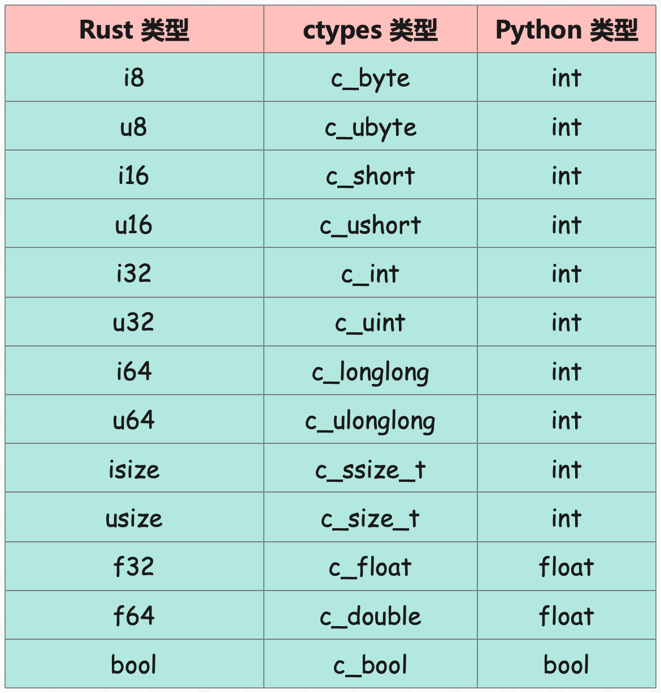

## 楔子

Rust 让 Python 更加伟大，随着 Rust 的流行，反而让 Python 的生产力提高了不少。因为有越来越多的 Python 工具，都选择了 Rust 进行开发，并且性能也优于同类型的其它工具。比如：

- ruff：速度极快的代码分析工具，以及代码格式化工具；
- orjson：一个高性能的 JSON 解析库；
- watchfiles：可以对指定目录进行实时监控；
- polars：和 pandas 类似的数据分析工具；
- pydantic：数据验证工具；
- ......

总之现在 Rust + Python 已经成为了一个趋势，并且 Rust 也提供了一系列成熟好用的工具，比如 PyO3、Maturin，专门为 Python 编写扩展。不过关于 PyO3 我们以后有机会再聊，本篇文章先来介绍如何将 Rust 代码编译成动态库，然后交给 Python 的 ctypes 模块调用。

正如上一篇文章所说，通过 ctypes 调用动态库是最简单的一种方式，它只对操作系统有要求，只要操作系统一致，那么任何提供了 ctypes 模块的 Python 解释器都可以调用。当然这也侧面要求，Rust 提供的接口不能太复杂，因为 ctypes 提供的交互能力还是比较有限的，最明显的问题就是不同语言的数据类型不同，一些复杂的交互方式还是比较难做到的，还有多线程的控制问题等等。

## 举个例子

下面我们举个例子感受一下 Python 和 Rust 的交互过程，首先通过如下命令创建一个 Rust 项目：

```sh
cargo new py_lib --lib
```

创建完之后修改 Cargo.toml，在里面加入如下内容：

~~~toml
[lib]
# 编译之后的动态库的名称
name = "py_lib"
# 表示编译成一个和 C 语言二进制接口（ABI）兼容的动态链接库
crate-type = ["cdylib"]
~~~

cdylib 表示生成动态库，如果想生成静态库，那么就指定为 staticlib。

下面开始编写源代码，在生成项目之后，src 目录下会有一个 lib.rs，它是整个库的入口点。我们的代码比较简单，直接写在 lib.rs 里面即可。

~~~rust
#[no_mangle]
pub extern "C" fn add(a: i32, b: i32) -> i32 {
    a + b
}

#[no_mangle]
pub extern "C" fn get_square_root(v: i32) -> f64 {
    (v as f64).sqrt()
}
~~~

在定义函数时需要使用 pub extern "C" 进行声明，它表示创建一个外部可见、遵循 C 语言调用约定的函数，因为 Python 使用的是 C ABI。此外还要给函数添加一个 #[no_mangle] 属性，让编译器在将 Rust 函数导出为 C 函数时，不要改变函数的名称，确保在编译成动态库后，函数名保持不变，否则在调用动态库时就找不到指定的函数了。

> Rust 有个名称修饰（Name Mangling）的机制，在跨语言操作时，会修改函数名，增加一些额外信息。这种修改对 Rust 内部使用没有影响，但会干扰其它语言的调用，因此需要通过 #[no_mangle] 将该机制禁用掉。

代码编写完成，我们通过 cargo build 进行编译，然后在 target/debug 目录下就会生成相应的动态库。由于库的名称为 py_lib，那么生成的库文件名就叫 libpy_lib.dylib（我的系统是 macOS）。

> 当功能全部实现并且测试通过时，最好重新编译一次，并加上 --release 参数。这样可以对代码进行优化，当然编译时间也会稍微长一些，并且生成的库文件会在 target/release 目录中。

编译器生成动态库后，会自动加上一个 lib 前缀（Windows 系统除外），至于后缀则与操作系统有关。

- Windows 系统，后缀名为 .dll；
- macOS 系统，后缀名为 .dylib；
- Linux 系统，后缀名为 .so；

然后通过 Python 进行调用。

~~~python
import ctypes

# 和调用 C 的动态库的逻辑是一样的
# 因为 Python 不关心动态库是 C 编译的，还是 Rust 编译的
py_lib = ctypes.CDLL("../py_lib/target/debug/libpy_lib.dylib")

print(py_lib.add(11, 22))  # 33

get_square_root = getattr(py_lib, "get_square_root", None)
print(get_square_root)  # <_FuncPtr object at 0x7fae30a2b040>
~~~

以上就是通过 ctypes 模块来调用 Rust 编译生成的动态库，但显然目前还是远远不够的，比如说：

```Python
from ctypes import CDLL

py_lib = CDLL("../py_lib/target/debug/libpy_lib.dylib")

square_root = py_lib.get_square_root(100)
print(square_root)  # 0
```

100 的平方根是 10，但却返回了 0。这是因为 ctypes 在解析返回值的时候默认是按照整型来解析的，但当前的函数返回的是浮点型，因此函数在调用之前需要显式地指定其返回值类型。

不过在这之前，我们需要先来看看 Python 类型和 Rust 类型之间的转换关系。

## 数值类型

使用 ctypes 调用动态链接库，主要是调用库里面使用 Rust 编写好的函数，但这些函数是需要参数的，还有返回值。而不同语言的变量类型不同，Python 不能直接往 Rust 编写的函数中传参，因此 ctypes 提供了大量的类，帮我们将 Python 的类型转成 Rust 的类型。

> 与其说转成 Rust 的类型，倒不如说转成 C 的类型，因为 Rust 导出的函数要遵循 C 的调用约定。



下面来测试一下，首先编写 Rust 代码：

~~~Rust
#[no_mangle]
pub extern "C" fn add_u32(a: u32) -> u32 {
    a + 1
}
#[no_mangle]
pub extern "C" fn add_isize(a: isize) -> isize {
    a + 1
}
#[no_mangle]
pub extern "C" fn add_f32(a: f32) -> f32 {
    a + 1.
}
#[no_mangle]
pub extern "C" fn add_f64(a: f64) -> f64 {
    a + 1.
}
#[no_mangle]
pub extern "C" fn reverse_bool(a: bool) -> bool {
    !a
}
~~~

编译之后 Python 进行调用。

```python
from ctypes import *

py_lib = CDLL("../py_lib/target/debug/libpy_lib.dylib")

print(py_lib.add_u32(123))  # 124
print(py_lib.add_isize(666))  # 667
try:
    print(py_lib.add_f32(3.14))
except Exception as e:
    print(e)  # <class 'TypeError'>: Don't know how to convert parameter 1

# 可以看到报错了，告诉我们不知道如何转化第 1 个参数
# 因为 Python 的数据和 C 的数据不一样，所以不能直接传递
# 但整数是个例外，除了整数，其它数据都需要使用 ctypes 包装一下
# 另外整数最好也包装一下，因为不同整数之间，精度也有区别
print(py_lib.add_f32(c_float(3.14)))  # 1
# 虽然没报错，但是结果不对，结果应该是 3.14 + 1 = 4.14，而不是 1
# 因为 ctypes 调用函数时默认使用整型来解析，但该函数返回的不是整型
# 需要告诉 ctypes，add_f32 函数返回的是 c_float，请按照 c_float 来解析
py_lib.add_f32.restype = c_float
print(py_lib.add_f32(c_float(3.14)))  # 4.140000343322754

# f32 和 f64 是不同的类型，占用的字节数也不一样
# 所以 c_float 和 c_double 之间不可混用，虽然都是浮点数
py_lib.add_f64.restype = c_double
print(py_lib.add_f64(c_double(3.14)))  # 4.140000000000001

py_lib.reverse_bool.restype = c_bool
print(py_lib.reverse_bool(c_bool(True)))  # False
print(py_lib.reverse_bool(c_bool(False)))  # True
```

不复杂，以上我们就实现了数值类型的传递。

## 字符类型

字符类型有两种，一种是 ASCII 字符，本质上是个 u8；一种是 Unicode 字符，本质上是个 u32。

~~~rust
#[no_mangle]
pub extern "C" fn get_char(a: u8) -> u8  {
    a + 1
}

#[no_mangle]
pub extern "C" fn get_unicode(a: u32) -> u32  {
    let chr = char::from_u32(a).unwrap();
    if chr == '憨' {
        '批' as u32
    } else {
        a
    }
}
~~~

我们知道 Rust 专门提供了 4 个字节的 char 类型来表示 unicode 字符，但对于外部导出函数来说，使用 char 是不安全的，所以直接使用 u8 和 u32 就行。编译之后，Python 调用：

```Python
from ctypes import *

py_lib = CDLL("../py_lib/target/debug/libpy_lib.dylib")

# 指定返回值为 c_byte，会返回一个整数
py_lib.get_char.restype = c_byte
print(py_lib.get_char(97))  # 98
# 指定返回值为 c_char，会返回一个字符（长度为 1 的 bytes 对象）
py_lib.get_char.restype = c_char
print(py_lib.get_char(97))  # b'b'

py_lib.get_unicode.restype = c_wchar
print(py_lib.get_unicode(c_wchar("嘿")))  # 嘿
# 直接传一个 u32 整数也可以，因为 unicode 字符在底层就是个 u32
print(py_lib.get_unicode(ord("憨")))  # 批
```

以上就是字符类型的操作，比较简单。

## 字符串类型

再来看看字符串，我们用 Rust 实现一个函数，它接收一个字符串，然后返回大写形式。

~~~rust
use std::ffi::{CStr, CString};
use std::os::raw::c_char;

#[no_mangle]
pub extern "C" fn to_uppercase(s: *const c_char) -> *mut c_char {
    // 将 *const c_char 转成 &CStr
    let s = unsafe {
        CStr::from_ptr(s)
    };
    // 将 &CStr 转成 &str，然后调用 to_uppercase 转成大写，得到 String
    let s = s.to_str().unwrap().to_uppercase();
    // 将 String 转成 *mut char 返回
    CString::new(s).unwrap().into_raw()
}
~~~

解释一下里面的 CStr 和 CString，在 Rust 中，CString 用于创建 C 风格的字符串（以 \\0 结尾），拥有自己的内存。关键的是，CString 拥有值的所有权，当实例离开作用域时，它的析构函数会被调用，相关内存会被自动释放。而 CStr，它和 CString 之间的关系就像 str 和 String 的关系，所以 CStr 一般以引用的形式出现。并且 CStr 没有 new 方法，不能直接创建，它需要通过 from_ptr 方法从原始指针转化得到。

然后指针类型是 \*const 和 \*mut，分别表示指向 C 风格字符串首字符的不可变指针和可变指针，它们的区别主要在于指向的数据是否可以被修改。如果不需要修改，那么使用 \*const 会更安全一些。

我们编写 Python 代码测试一下。

~~~python
from ctypes import *

py_lib = CDLL("../py_lib/target/debug/libpy_lib.dylib")

s = "hello 古明地觉".encode("utf-8")
# 默认是按照整型解析的，所以不指定返回值类型的话，会得到脏数据
print(py_lib.to_uppercase(c_char_p(s)))
"""
31916096
"""
# 指定返回值为 c_char_p，表示按照 char * 来解析
py_lib.to_uppercase.restype = c_char_p
print(
    py_lib.to_uppercase(c_char_p(s)).decode("utf-8")
)
"""
HELLO 古明地觉
"""
~~~

从表面上看似乎挺顺利的，但背后隐藏着内存泄露的风险，因为 Rust 里面创建的 CString 还驻留在堆区，必须要将它释放掉。所以我们还要写一个函数，用于释放字符串。

~~~rust
use std::ffi::{CStr, CString};
use std::os::raw::c_char;

#[no_mangle]
pub extern "C" fn to_uppercase(s: *const c_char) -> *mut c_char {
    let s = unsafe {
        CStr::from_ptr(s)
    };
    let s = s.to_str().unwrap().to_uppercase();
    CString::new(s).unwrap().into_raw()
}

#[no_mangle]
pub extern "C" fn free_cstring(s: *mut c_char) {
    unsafe {
        if s.is_null() { return }
        // 基于原始指针创建 CString，拿到堆区字符串的所有权
        // 然后离开作用域，自动释放
        CString::from_raw(s)
    };
}
~~~

然后来看看 Python 如何调用：

~~~Python
from ctypes import *

py_lib = CDLL("../py_lib/target/debug/libpy_lib.dylib")

s = "hello 古明地觉".encode("utf-8")
# Rust 返回的是原始指针，这里必须要拿到它保存的地址，所以指定返回值为 c_void_p
# 如果指定为 c_char_p，那么会直接转成 bytes 对象，这样地址就拿不到了
py_lib.to_uppercase.restype = c_void_p
ptr = py_lib.to_uppercase(c_char_p(s))
# 将 ptr 转成 c_char_p，获取 value 属性，即可得到具体的 bytes 对象
print(cast(ptr, c_char_p).value.decode("utf-8"))
"""
HELLO 古明地觉
"""
# 内容我们拿到了，但堆区的字符串还没有释放，所以调用 free_cstring
py_lib.free_cstring(c_void_p(ptr))
~~~

通过 CString 的 into_raw，可以基于 CString 创建原始指针 \*mut，然后 Python 将指针指向的堆区数据拷贝一份，得到 bytes 对象。但这个 CString 依旧驻留在堆区，所以 Python 不能将返回值指定为 c_char_p，因为它会直接创建 bytes 对象，这样就拿不到指针了。因此将返回值指定为 c_void_p，调用函数会得到一串整数，这个整数就是指针保存的地址。

我们使用 cast 函数可以将地址转成 c_char_p，获取它的 value 属性拿到具体的字节串。再通过 c_void_p 创建原始指针交给 Rust，调用 CString 的 from_raw，可以基于 \*mut 创建 CString，从而将所有权夺回来，然后离开作用域时释放堆内存。

## 给函数传递指针

如果扩展函数里面接收的是指针，那么 Python 要怎么传递呢？

~~~rust
#[no_mangle]
pub extern "C" fn add(a: *mut i32, b: *mut i32) -> i32 {
    // 定义为 *mut，那么可以修改指针指向的值，定义为 *const，则不能修改
    if a.is_null() || b.is_null() {
        0
    } else {
        let res = unsafe {
            *a + *b
        };
        unsafe {
            // 这里将 *a 和 *b 给改掉
            *a = 666;
            *b = 777;
        }
        res
    }
}
~~~

定义了一个 add 函数，接收两个 i32 指针，返回解引用后相加的结果。但是在返回之前，我们将 \*a 和 \*b 的值也修改了。

```Python
from ctypes import *

py_lib = CDLL("../py_lib/target/debug/libpy_lib.dylib")

a = c_int(22)
b = c_int(33)
# 计算
print(py_lib.add(pointer(a), pointer(b)))  # 55
# 我们看到 a 和 b 也被修改了
print(a, a.value)  # c_int(666) 666
print(b, b.value)  # c_int(777) 777
```

非常简单，那么问题来了，能不能返回一个指针呢？答案是当然可以，只不过存在一些注意事项。

由于 Rust 本身的内存安全原则，直接从函数返回一个指向本地局部变量的指针是不安全的。因为该变量的作用域仅限于函数本身，一旦函数返回，该变量的内存就会被回收，从而出现悬空指针。

为了避免这种情况出现，我们应该在堆上分配内存，但这又出现了之前 CString 的问题。Python 在拿到值之后，堆内存依旧驻留在堆区。因此 Rust 如果想返回指针，那么同时还要定义一个释放函数。

~~~Rust
#[no_mangle]
pub extern "C" fn add(a: *const i32, b: *const i32) -> *mut i32 {
    // 返回值的类型是 *mut i32，所以 res 不能直接返回，因此它是 i32
    let res = unsafe {*a + *b};
    // 创建智能指针（将 res 装箱），然后返回原始指针
    Box::into_raw(Box::new(res))
}

#[no_mangle]
pub extern "C" fn free_i32(ptr: *mut i32) {
    if !ptr.is_null() {
        // 转成 Box<i32>，同时拿到所有权，在离开作用域时释放堆内存
        unsafe { let _ = Box::from_raw(ptr); }
    }
}
~~~

然后 Python 进行调用：

```Python
from ctypes import *

py_lib = CDLL("../py_lib/target/debug/libpy_lib.dylib")

a, b = c_int(22), c_int(33)
# 指定类型为 c_void_p
py_lib.add.restype = c_void_p
# 拿到指针保存的地址
ptr = py_lib.add(pointer(a), pointer(b))
# 将 c_void_p 转成 POINTER(c_int) 类型，也就是 c_int *
# 通过它的 contents 属性拿到具体的值
print(cast(ptr, POINTER(c_int)).contents)  # c_int(55)
print(cast(ptr, POINTER(c_int)).contents.value)  # 55
# 释放堆内存
py_lib.free_i32(c_void_p(ptr))
```

这样我们就拿到了指针，并且也不会出现内存泄露。但是单独定义一个释放函数还是有些麻烦的，所以 Rust 自动提供了一个 free 函数，专门用于释放堆内存。举个例子：

```rust
use std::ffi::{CStr, CString};
use std::os::raw::c_char;

#[no_mangle]
pub extern "C" fn to_uppercase(s: *const c_char) -> *mut c_char {
    let s = unsafe {
        CStr::from_ptr(s)
    };
    let s = s.to_str().unwrap().to_uppercase();
    CString::new(s).unwrap().into_raw()
}

#[no_mangle]
pub extern "C" fn add(a: *const i32, b: *const i32) -> *mut i32 {
    let res = unsafe {*a + *b};
    Box::into_raw(Box::new(res))
}
```

这是出现过的两个函数，它们的内存都申请在堆区，但我们将内存释放函数删掉了，因为 Rust 自动提供了一个 free 函数，专门用于堆内存的释放。

~~~Python
from ctypes import *

py_lib = CDLL("../py_lib/target/debug/libpy_lib.dylib")

# 返回值类型指定为 c_void_p，表示万能指针
py_lib.to_uppercase.restype = c_void_p
py_lib.add.restype = c_void_p

ptr1 = py_lib.to_uppercase(
    c_char_p("Serpen 老师".encode("utf-8"))
)
ptr2 = py_lib.add(
    pointer(c_int(123)), pointer(c_int(456))
)
# 函数调用完毕，将地址转成具体的类型的指针
print(cast(ptr1, c_char_p).value.decode("utf-8"))
"""
SERPEN 老师
"""
print(cast(ptr2, POINTER(c_int)).contents.value)
"""
579
"""
# 释放堆内存，直接调用 free 函数即可，非常方便
py_lib.free(c_void_p(ptr1))
py_lib.free(c_void_p(ptr2))
~~~

以上我们就实现了指针的传递和返回，但对于整数、浮点数而言，直接返回它们的值即可，没必要返回指针。

## 传递数组

下面来看看如何传递数组，由于数组在作为参数传递的时候会退化为指针，所以数组的长度信息就丢失了，使用 sizeof 计算出来的结果就是一个指针的大小。因此将数组作为参数传递的时候，应该将当前数组的长度信息也传递过去，否则可能会访问非法的内存。

我们实现一个功能，Rust 接收一个 Python 数组，进行原地排序。

```rust
use std::slice;

#[no_mangle]
pub extern "C" fn sort_array(arr: *mut i32, len: usize) {
    assert!(!arr.is_null());

    unsafe {
        // 得到一个切片 &mut[i32]
        let slice = slice::from_raw_parts_mut(arr, len);
        slice.sort();  // 排序
    }
}
```

然后 Python 进行调用：

~~~Python
from ctypes import *

py_lib = CDLL("../py_lib/target/debug/libpy_lib.dylib")

# 一个列表
data = [3, 2, 1, 5, 4, 7, 6]
# 但是列表不能传递，必须要转成 C 数组
# Array_Type 就相当于 C 的 int array[len(data)]
Array_Type = c_int * len(data)
# 创建数组
array = Array_Type(*data)
print(list(array))  # [3, 2, 1, 5, 4, 7, 6]
py_lib.sort_array(array, len(array))
print(list(array))  # [1, 2, 3, 4, 5, 6, 7]
~~~

排序实现完成，这里的数组是 Python 传过去的，并且进行了原地修改。那 Rust 可不可以返回数组给 Python 呢？从理论上来说可以，但实际不建议这么做，因为你不知道返回的数组的长度是多少？

如果你真的想返回数组的话，那么可以将数组拼接成字符串，然后返回。

~~~rust
use std::ffi::{c_char, CString};

#[no_mangle]
pub extern "C" fn create_array() -> *mut c_char {
    // 筛选出 1 到 50 中，能被 3 整除的数
    // 并以逗号为分隔符，将这些整数拼接成字符串
    let vec = (1..=50)
        .filter(|c| *c % 3 == 0)
        .map(|c| c.to_string())
        .collect::<Vec<String>>()
        .join(",");
    CString::new(vec).unwrap().into_raw()
}
~~~

编译之后交给 Python 调用。

~~~Python
from ctypes import *

py_lib = CDLL("../py_lib/target/debug/libpy_lib.dylib")

# 只要是需要释放的堆内存，都建议按照 c_void_p 来解析
py_lib.create_array.restype = c_void_p
# 此时拿到的就是指针保存的地址，在 Python 里面就是一串整数
ptr = py_lib.create_array()
# 由于是字符串首字符的地址，所以转成 char *，拿到具体内容
print(cast(ptr, c_char_p).value.decode("utf-8"))
"""
3,6,9,12,15,18,21,24,27,30,33,36,39,42,45,48
"""
# 此时我们就将数组拼接成字符串返回了
# 但是堆区的 CString 还在，所以还要释放掉，调用 free 函数即可
# 注意：ptr 只是一串整数，或者说它就是 Python 的一个 int 对象
# 换句话说 ptr 只是保存了地址值，但它不具备指针的含义
# 因此需要再使用 c_void_p 包装一下（转成指针），才能传给 free 函数
py_lib.free(c_void_p(ptr))
~~~

因此虽然不建议返回数组，但将数组转成字符串返回也不失为一个办法，当然除了数组，你还可以将更复杂的结构转成字符串返回。

## 传递结构体

结构体应该是 Rust 里面最重要的结构之一了，它要如何和外部交互呢？

~~~rust
use std::ffi::c_char;

#[repr(C)]
pub struct Girl {
    pub name: *mut c_char,
    pub age: u8,
}

#[no_mangle]
pub extern "C" fn create_struct(name: *mut c_char, age: u8) -> Girl {
    Girl { name, age }
~~~

因为结构体实例要返回给外部，所以它的字段类型必须是兼容的，不能定义 C 理解不了的类型。然后还要设置 #[repr(C)] 属性，来保证结构体的内存布局和 C 是兼容的。

下面通过 cargo build 命令编译成动态库，Python 负责调用。

~~~Python
from ctypes import *

py_lib = CDLL("../py_lib/target/debug/libpy_lib.dylib")

class Girl(Structure):

    _fields_ = [
        ("name", c_char_p),
        ("age", c_uint8),
    ]

# 指定 create_struct 的返回值类型为 Girl
py_lib.create_struct.restype = Girl
girl = py_lib.create_struct(
    c_char_p("S 老师".encode("utf-8")),
    c_uint8(18)
)
print(girl.name.decode("utf-8"))  # S 老师
print(girl.age)  # 18
~~~

调用成功，并且此时是没有内存泄露的。

当通过 FFI 将数据从 Rust 传递到 Python 时，如果传递的是指针，那么会涉及内存释放的问题。但如果传递的是值，那么它会复制一份给 Python，而原始的值（这里是结构体实例）会被自动销毁，所以无需担心。

然后是结构体内部的字段，虽然里面的 name 字段是 *mut c_char，但它的值是由 Python 传过来的，而不是在 Rust 内部创建的，因此没有问题。但如果将 Rust 代码改一下：

```rust
use std::ffi::{c_char, CString};

#[repr(C)]
pub struct Girl {
    pub name: *mut c_char,
    pub age: u8,
}

#[no_mangle]
pub extern "C" fn create_struct() -> Girl {
    let name = CString::new("S 老师").unwrap().into_raw();
    let age = 18;
    Girl { name, age }
}
```

这时就尴尬了，此时的字符串是 Rust 里面创建的，转成原始指针之后，Rust 将不再管理相应的堆内存（因为 into_raw 将所有权转移走了），此时就需要手动管理堆内存了。

~~~Python
from ctypes import *

py_lib = CDLL("../py_lib/target/debug/libpy_lib.dylib")

class Girl(Structure):

    _fields_ = [
        ("name", c_char_p),
        ("age", c_uint8),
    ]

# 指定 create_struct 的返回值类型为 Girl
py_lib.create_struct.restype = Girl
girl = py_lib.create_struct()
print(girl.name.decode("utf-8"))  # S 老师
print(girl.age)  # 18
# 直接传递 girl 即可，会释放 girl 里面的字段在堆区的内存
py_lib.free(girl)
~~~

此时就不会出现内存泄露了，在 free 的时候，将变量 girl 传进去，释放掉内部字段占用的堆内存。当然，Rust 也可以返回结构体指针，通过 Box\<T\> 实现。

```rust
#[no_mangle]
pub extern "C" fn create_struct() -> *mut Girl {
    let name = CString::new("S 老师").unwrap().into_raw();
    let age = 18;
    Box::into_raw(Box::new(Girl { name, age }))
}
```

注意：之前是 name 字段在堆上，但结构体实例在栈上，现在 name 字段和结构体实例都在堆上。然后 Python 调用也很简单，关键是释放的问题。

```Python
from ctypes import *

py_lib = CDLL("../py_lib/target/debug/libpy_lib.dylib")

class Girl(Structure):

    _fields_ = [
        ("name", c_char_p),
        ("age", c_uint8),
    ]

# 此时返回值类型就变成了 c_void_p
# 当返回指针时，建议将返回值设置为 c_void_p
py_lib.create_struct.restype = c_void_p
# 拿到指针（一串整数）
ptr = py_lib.create_struct()
# 将指针转成指定的类型，而类型显然是 POINTER(Girl)
# 调用 POINTER(T) 的 contents 方法，拿到相应的结构体实例
girl = cast(ptr, POINTER(Girl)).contents
# 访问具体内容
print(girl.name.decode("utf-8"))  # S 老师
print(girl.age)  # 18

# 释放堆内存，这里的释放分为两步，并且顺序不能错
# 先 free(girl)，释放掉内部字段（name）占用的堆内存
# 然后 free(c_void_p(ptr))，释放掉结构体实例 girl 占用的堆内存
py_lib.free(girl)
py_lib.free(c_void_p(ptr))
```

不难理解，只是在释放结构体实例的时候需要多留意，如果内部有字段占用堆内存，那么需要先将这些字段释放掉。而释放的方式是将结构体实例作为参数传给 free 函数，然后再传入 c_void_p 释放结构体实例。

## 回调函数

最后看一下 Python 如何传递函数给 Rust，因为 Python 和 Rust 之间使用的是 C ABI，所以函数必须遵循 C 的标准。

```rust
// calc 接收三个参数，前两个参数是 *const i32
// 最后一个参数是函数，它接收两个 *const i32，返回一个 i32
#[no_mangle]
pub extern "C" fn calc(
    a: *const i32, b: *const i32,
    op: extern "C" fn(*const i32, *const i32) -> i32
) -> i32
{
    op(a, b)
}
```

然后看看 Python 如何传递回调函数。

```Python
from ctypes import *

py_lib = CDLL("../py_lib/target/debug/libpy_lib.dylib")

# 基于 Python 函数创建 C 函数，通过 @CFUNCTYPE() 进行装饰
@CFUNCTYPE(c_int, POINTER(c_int), POINTER(c_int))
def add(a, b):  # a、b 为 int *，通过 .contents.value 拿到具体的值
    return a.contents.value + b.contents.value

@CFUNCTYPE(c_int, POINTER(c_int), POINTER(c_int))
def sub(a, b):
    return a.contents.value - b.contents.value

@CFUNCTYPE(c_int, POINTER(c_int), POINTER(c_int))
def mul(a, b):
    return a.contents.value * b.contents.value

@CFUNCTYPE(c_int, POINTER(c_int), POINTER(c_int))
def div(a, b):
    return a.contents.value // b.contents.value

a = pointer(c_int(10))
b = pointer(c_int(2))
print(py_lib.calc(a, b, add))  # 12
print(py_lib.calc(a, b, sub))  # 8
print(py_lib.calc(a, b, mul))  # 20
print(py_lib.calc(a, b, div))  # 5
```

成功实现了向 Rust 传递回调函数，当然例子举得有点刻意了，比如参数类型指定为 i32 即可，没有必要使用指针。

## 小结

以上我们就介绍了 Python 如何调用 Rust 编译的动态库，再次强调一下，通过 ctypes 调用动态库是最方便、最简单的方式。它和 Python 的版本无关，也不涉及底层的 C 扩展，它只是将 Rust 编译成 C ABI  用。

因此这也侧面要求，函数的参数和返回值的类型应该是 C 可以表示的类型，比如 Rust 函数不能返回一个 trait 对象。总之在调用动态库的时候，库函数内部的逻辑可以很复杂，但是参数和返回值最好要简单。

如果你发现 Python 代码存在大量的 CPU 密集型计算，并且不怎么涉及复杂的 Python 数据结构，那么不妨将这些计算交给 Rust。

----

&nbsp;

**欢迎大家关注我的公众号：古明地觉的编程教室。**


**如果觉得文章对你有所帮助，也可以请作者吃个馒头，Thanks♪(･ω･)ﾉ。**


