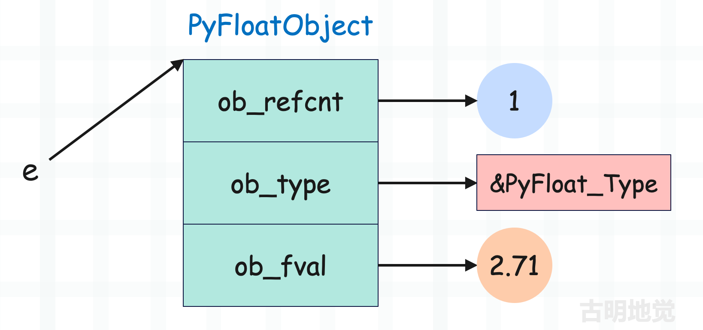
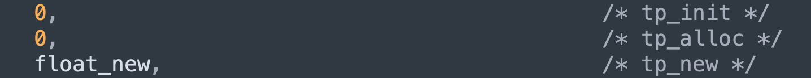
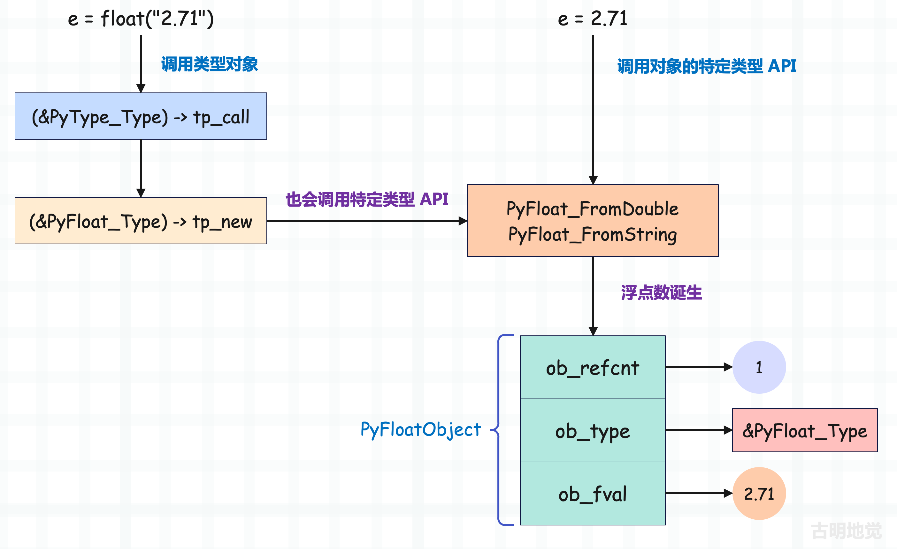
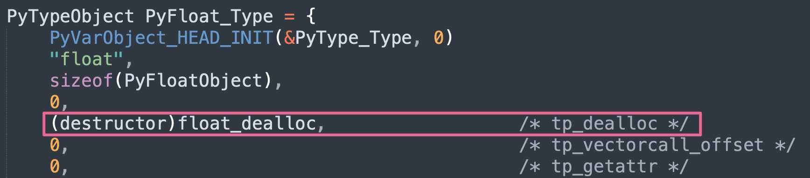
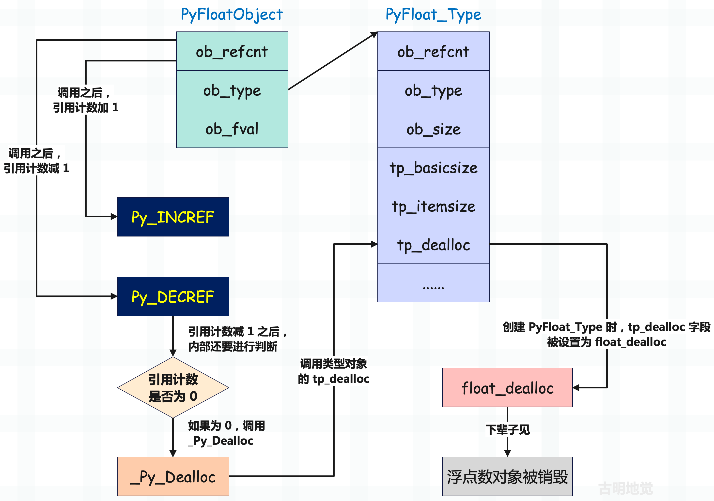

## 楔子

从现在开始，我们就来分析 Python 的内置对象，看看它们在底层是如何实现的。但说实话，我们在前面几篇文章中介绍对象的时候，已经说了不少了，不过从现在开始要进行更深入的分析。

除了对象本身，还要看对象支持的操作在底层是如何实现的。我们首先以浮点数为例，因为它是最简单的，没错，浮点数比整数要简单，至于为什么，等我们分析整数的时候就知道了。

## 浮点数的底层结构

要想搞懂浮点数的实现原理，就要知道它在底层是怎么定义的，当然在这之前我们已经见过它很多遍了。

~~~c
// Include/floatobject.h
typedef struct {
    PyObject_HEAD
    double ob_fval;
} PyFloatObject;
~~~

它包含了一个公共头部 PyObject 和一个 double 类型的 ob_fval 字段，毫无疑问这个 ob_fval 字段负责存储浮点数的具体数值。

我们以 e = 2.71 为例，底层结构如下。

还是很简单的，每个对象在底层都是由结构体表示的，这些结构体中有的字段负责维护对象的元信息，有的字段负责维护具体的值。比如这里的 2.71，总要有一个字段来存储 2.71 这个值，而这个字段就是 ob_fval。所以浮点数的结构非常简单，直接使用一个 C 的 double 来维护。

假设我们要将两个浮点数相加，相信你已经知道解释器会如何做了。通过 PyFloat_AsDouble 将两个浮点数的 ob_fval 抽出来，然后相加，最后再根据相加的结果创建一个新的 PyFloatObject 即可。

## 浮点数是怎么创建的

下面来看看浮点数是如何创建的，在前面的文章中，我们说内置对象可以使用对应的特定类型 API 创建，也可以通过调用类型对象创建。

调用类型对象 float 创建实例对象，解释器会执行元类 type 的 tp_call，它指向了 type_call 函数。然后 type_call 内部会先调用类型对象（这里是 float）的 tp_new 为其实例对象申请一份空间，申请完毕之后对象就创建好了。然后再调用 tp_init，并将实例对象作为参数传递进去，进行初始化，也就是设置属性。

但是对于 float 来说，它内部的 tp_init 字段为 0，也就是空。

这就说明 float 没有 \_\_init\_\_，因为浮点数太过简单，只需要一个 tp_new 即可。我们举个例子：

~~~Python
class Girl1:
    def __init__(self, name, age):
        self.name = name
        self.age = age

# __new__ 负责开辟空间、生成实例对象
# __init__ 负责给实例对象绑定属性

# 但其实 __init__ 所做的工作可以直接在 __new__ 当中完成
# 换言之有 __new__ 就足够了，其实可以没有__init__
# 我们将上面的例子改写一下

class Girl2:
    def __new__(cls, name, age):
        instance = object.__new__(cls)
        instance.name = name
        instance.age = age
        return instance

g1 = Girl1("古明地觉", 16)
g2 = Girl2("古明地觉", 16)
print(g1.__dict__ == g2.__dict__)  # True
~~~

我们看到效果是等价的，因为 \_\_init\_\_ 负责给 self 绑定属性，而这个 self 是 \_\_new\_\_ 返回的。那么很明显，我们也可以在  \_\_new\_\_ 当中绑定属性，而不需要  \_\_init_\_。

但是按照规范，属性绑定应该放在 \_\_init\_\_ 中执行。只是对于浮点数而言，由于其结构非常简单，所以底层就没有给 float 实现 \_\_init_\_\_，所有操作都是在 \_\_new\_\_ 当中完成的。

~~~Python
print(float.__init__ is object.__init__)  # True
print(tuple.__init__ is object.__init__)  # True
print(list.__init__ is object.__init__)  # False
~~~

所以 float 没有 \_\_init\_\_，即便获取拿到的也是 object 的 \_\_init\_\_，因为 object 是 float 的基类。同理 tuple 也没有，但 list 是有的。

那么下面就来看一下 PyFloat_Type 的 tp_new，看它是如何创建浮点数的。通过 PyFloat_Type 的定义我们可以看到，在创建的时候给 tp_new 字段设置的是 float_new，那么一切秘密就隐藏在 float_new 里面。

~~~c
// Objects/clinic/floatobject.c.h
static PyObject *
float_new(PyTypeObject *type, PyObject *args, PyObject *kwargs)
{
    PyObject *return_value = NULL;
    PyObject *x = _PyLong_Zero;
    // float 不接收关键字参数，如果传递了，那么报错
    if ((type == &PyFloat_Type) &&
        !_PyArg_NoKeywords("float", kwargs)) {
        goto exit;
    }
    // float 只接收 0 到 1 个位置参数，如果不满足，那么报错
    if (!_PyArg_CheckPositional("float", PyTuple_GET_SIZE(args), 0, 1)) {
        goto exit;
    }
    // 如果参数个数为 0，说明调用 float 时没传参数，那么直接跳转到 skip_optional 标签
    // 由于变量 x 的值初始为 _PyLong_Zero，所以在 Python 中，float() 和 float(0) 是等价的
    if (PyTuple_GET_SIZE(args) < 1) {
        goto skip_optional;
    }
    // 否则说明传递了一个参数，那么获取该参数
    x = PyTuple_GET_ITEM(args, 0);
skip_optional:
    // 调用 float_new_impl，拿到返回值
    // 所以核心实现位于 float_new_impl 函数中
    return_value = float_new_impl(type, x);

exit:
    return return_value;
}

// Objects/floatobject.c
static PyObject *
float_new_impl(PyTypeObject *type, PyObject *x)
{   
    // 如果 type 不是 &PyFloat_Type，那么必须是它的子类，否则调用 float_subtype_new 会报错
    // 但该条件很少触发，因为创建的是浮点数，所以 type 自然是 &PyFloat_Type
    if (type != &PyFloat_Type)
        return float_subtype_new(type, x); 
    // 然后检测 x 的类型，如果它是一个字符串，那么就根据字符串创建浮点数，比如 float("3.14")
    if (PyUnicode_CheckExact(x))
        return PyFloat_FromString(x);
    // 不是字符串，则调用 PyNumber_Float
    return PyNumber_Float(x);
}
~~~

再来看看 PyNumber_Float。

~~~C
// Objects/abstract.c
PyObject *
PyNumber_Float(PyObject *o)
{
    PyNumberMethods *m;
    
    // 如果传递的是 NULL，直接返回错误
    if (o == NULL) {
        return null_error();
    }
    
    // 如果传递的本身就是个浮点数，那么增加引用计数，直接返回
    if (PyFloat_CheckExact(o)) {
        Py_INCREF(o);
        return o;
    }
    // 走到这里说明对象不是浮点数，那么它必须要能转成浮点数
    // 也就是类型对象的内部要有 __float__ 这个魔法函数，即 nb_float
    // 获取方法簇
    m = o->ob_type->tp_as_number;
    // 如果方法簇不为空，并且也实现了 nb_float
    if (m && m->nb_float) {
    	  // 那么获取 nb_float 指向的函数并调用，将对像转成浮点数
        PyObject *res = m->nb_float(o);
        double val;
        // 如果 res 不为 NULL，并且是浮点数，那么返回
        // PyFloat_CheckExact 负责检测一个对象的类型是否是 <class 'float'>
        // 其逻辑等价于 type(res) is float
        if (!res || PyFloat_CheckExact(res)) {
            return res;
        }
        // 走到这里说明 __float__ 返回的对象不是浮点数，即对象的类型不是 float
        // 如果不是 float，那么 float 的子类目前也是可以的（会抛警告）
        // PyFloat_Check 负责检测对象的类型是否是 float 或者其子类
        // 其逻辑等价于 isinstance(res, float)
        if (!PyFloat_Check(res)) {
            // 如果返回的对象的类型不是 float 或者其子类，那么报错
            PyErr_Format(PyExc_TypeError,
                         "%.50s.__float__ returned non-float (type %.50s)",
                         o->ob_type->tp_name, res->ob_type->tp_name);
            Py_DECREF(res);
            return NULL;
        }
        // 到这里说明返回的对象的类型是 float 的子类，此时也是合法的，但会抛出警告
        if (PyErr_WarnFormat(PyExc_DeprecationWarning, 1,
                "%.50s.__float__ returned non-float (type %.50s).  "
                "The ability to return an instance of a strict subclass of float "
                "is deprecated, and may be removed in a future version of Python.",
                o->ob_type->tp_name, res->ob_type->tp_name)) {
            Py_DECREF(res);
            return NULL;
        }
        // res 虽然是 float 子类的实例对象，但依旧具备浮点数的特征，因此将内部的数值抽出来
        val = PyFloat_AS_DOUBLE(res);
        // 减少 res 指向对象的引用计数
        Py_DECREF(res);
        // 创建 PyFloatObject 实例，并返回它的泛型指针
        // 因此即使 __float__ 返回的是 float 子类的实例对象，也会默认转成 float 对象（浮点数）返回
        return PyFloat_FromDouble(val);
    }
    // 如果 float 接收的参数没有实现 nb_float（__float__），那么会去找 nb_index（__index__）
    if (m && m->nb_index) {
        // 内部会调用对象的 nb_index
        PyObject *res = PyNumber_Index(o);
        if (!res) {
            return NULL;
        }
        // __index__ 返回的必须是整数
        // 所以调用的是 PyLong_AsDouble，表示基于 Python 整数创建 C 浮点数
        double val = PyLong_AsDouble(res);
        Py_DECREF(res);
        if (val == -1.0 && PyErr_Occurred()) {
            return NULL;
        }
        // 通过 C 浮点数创建 Python 浮点数
        return PyFloat_FromDouble(val);
    }
    // 到这里说明对象没有实现 __float__ 和 __index__
    // 那么检测传递的对象的类型是不是 float 的子类
    // 如果是，证明它的结构和浮点数是一致的
    // 直接根据 ob_fval 构建 PyFloatObject
    if (PyFloat_Check(o)) {
        return PyFloat_FromDouble(PyFloat_AS_DOUBLE(o));
    }
    // 如果以上条件都不满足，说明它有可能是字节串、字节数组、字符串（但类型是 str 的子类）等等
    // 那么直接交给 PyFloat_FromString
    return PyFloat_FromString(o);
}
~~~

所以一个 float 调用居然要走这么多逻辑，总之解释器为我们考虑了很多。我们用 Python 来演绎一下：

~~~Python
# 2.71 是一个字符串，所以在 float_new_impl 里面直接调用 PyFloat_FromString
print(float("2.71"))  # 2.71

class E:

    def __float__(self):
        return 2.71

# 传递的参数是一个 E 类型，所以会进入 PyNumber_Float 函数
# 由于对象实现了 nb_float，所以会直接调用
print(float(E()))  # 2.71

class N:

    def __index__(self):
        return 3

# N 不是字符串类型，显然也会进入 PyNumber_Float 函数
# 由于对象实现了 nb_index，所以会直接调用
print(float(N()))  # 3.0

class PI:

    class Float(float):
        pass

    def __float__(self):
        return self.Float(3.14)

# 显然会调用内部的 __float__，但 __float__ 返回的不是 float 实例，而是 float 子类的实例
# 虽然这种做法是允许的，但会抛出警告：DeprecationWarning: PI.__float__ returned non-float (type Float).
# 警告的内容就是源码中描述的那样
print(float(PI()))  # 3.14

# 参数不是字符串，也没有实现 __float__ 和 __index__，那么直接执行 PyFloat_FromString
print(float(b"1.414"))  # 1.414
~~~

以上是通过类型对象创建，但在底层实际上也是调用了对象的特定类型 APl。

~~~C
PyObject *
PyFloat_FromDouble(double);

PyObject *
PyFloat_FromString(PyObject *);
~~~

+ PyFloat_FromDouble：基于 C 浮点数创建 Python 浮点数；
+ PyFloat_FromString：基于字符串创建 Python 浮点数；

如果以 e = 2.71 这种方式创建，那么解释器在编译的时候就知道这是一个浮点数，因此会一步到胃，直接调用 PyFloat_FromDouble，然后在该函数内部会根据 C 的浮点数 2.71 创建对应的 PyFloatObject。而通过类型对象调用的话则会有一些额外的开销，因为这种方式最终也会调用相关的特定类型 API，但是在调用之前会干一些别的事情，比如类型检测等等。

所以 e = 2.71 比 float(2.71)、float("2.71") 都要高效。

因此对于内置对象来说，可以调用它的类型对象去创建，这是最通用的逻辑。但这种做法会先兜个圈子，然后再去使用对象的特定类型 API，肯定没有直接使用特定类型 API 的效率高，也就是说 e = 2.71 这种方式是最快的，底层会直接调用 PyFloat_FromDouble。

对于其它对象也是同理，当然大部分情况下我们也都是使用特定类型 API 来创建的。以列表为例，比起 list()，我们更习惯使用［］。

还没结束，浮点数的实际创建过程我们还没有见到，因为最终还是调用特定类型 API 创建的。那么接下来就以 PyFloat_FromDouble 函数为例，看看浮点数在底层的创建过程。

~~~C
// Objects/floatobject.c
#define PyFloat_MAXFREELIST    100
// 缓存池的元素个数，最多不能超过 PyFloat_MAXFREELIST
static int numfree = 0;
// 指向缓存池（一个链表）的头结点，因为缓存池是一个由 PyFloatObject 实例组成的链表
static PyFloatObject *free_list = NULL;
// 介绍引用计数时说过，引用计数如果为 0，那么对象会被销毁
// 但是对象所占的内存则不一定释放，而是会缓存起来，浮点数也是如此
// 销毁浮点数时，会将其放入缓存池中，创建浮点数时，也会优先从缓存池里面获取
// 而缓存池是使用链表实现的，每一个节点都是一个 PyFloatObject 实例，然后 free_list 指向链表的头节点

PyObject *
PyFloat_FromDouble(double fval)
{   
    // 如果 op 不为 NULL，说明缓存池中有可用对象
    PyFloatObject *op = free_list;
    if (op != NULL) {
        // 而一旦获取了，那么要维护 free_list，让它指向下一个节点
        // 但问题来了，为啥获取下一个节点要通过 Py_TYPE，它不是负责返回 ob_type 吗？
        // 相信你已经猜到原因了，因为 ob_type 充当了链表中的 next 指针
        // 关于这里的细节，后续介绍缓存池的时候会详细说
        free_list = (PyFloatObject *) Py_TYPE(op);
        // 然后还要将缓存池（链表）的节点个数减 1
        numfree--;
    } else {
        // 否则说明缓存池里面没有空闲的可用对象，那么要重新申请内存
        // PyObject_MALLOC 是基于 malloc 的一个封装，但对内存碎片做了优化
        op = (PyFloatObject*) PyObject_MALLOC(sizeof(PyFloatObject));
        if (!op)
            return PyErr_NoMemory();
    }
    // 走到这里说明内存分配好了，PyFloatObject 也创建了
    // 但是不是还少了点啥呢？没错，显然内部的字段还没有初始化
    // 还是那句话，内置类型的实例对象该分配多少空间，解释器了如指掌
    // 因为通过 PyFloatObject 内部的字段一算就出来了
    // 所以虽然对象创建了，但是 ob_refcnt、ob_type、以及 ob_fval 三个字段还没有初始化
    // 因此还要将其 ob_refcnt 设置为 1，因为新创建的对象的引用计数是 1
    // 以及将 ob_type 设置为指向 PyFloat_Type 的指针，因为它的类型是 float
    // 而 PyObject_INIT 专们用来设置 ob_refcnt 以及 ob_type，它的源码解释在下面
    (void)PyObject_INIT(op, &PyFloat_Type);
    // 将内部的 ob_fval 字段设置为参数 fval，此时三个字段都已经初始化完毕
    op->ob_fval = fval;
    // 变量是泛型指针 PyObject *，所以还要转成 PyObject * 之后才能返回
    return (PyObject *) op;
}

// 补充：PyObject_INIT 的定义如下
// Include/objimpl.h
#define PyObject_INIT(op, typeobj) \
    _PyObject_INIT(_PyObject_CAST(op), (typeobj))

static inline PyObject*
_PyObject_INIT(PyObject *op, PyTypeObject *typeobj)
{
    assert(op != NULL);
    // 设置实例对象的 ob_type
    Py_TYPE(op) = typeobj;
    // 如果 typeobj 是自定义的动态类，那么还要将类型对象的引用计数加 1
    // 因为实例对象创建了，意味着类型对象会多一个引用
    // 当然这只是针对于动态类，如果 typeobj 是内置的静态类型，那么不做处理
    // 因为内置类型超越了引用计数规则，永远不会被析构
    if (PyType_GetFlags(typeobj) & Py_TPFLAGS_HEAPTYPE) {
        Py_INCREF(typeobj);
    }
    // 将实例对象的引用计数初始化为 1
    _Py_NewReference(op);
    return op;
}

// Objects/floatobject.c
void
_Py_NewReference(PyObject *op)
{
    if (_Py_tracemalloc_config.tracing) {
        _PyTraceMalloc_NewReference(op);
    }
    _Py_INC_REFTOTAL;
    // 初始化为 1
    op->ob_refcnt = 1;
    _Py_AddToAllObjects(op, 1);
    _Py_INC_TPALLOCS(op);
}
~~~

**所以整体流程如下：**

+ 为实例对象分配内存空间，空间分配完了对象也就创建了，不过会优先使用缓存池；
+ 初始化实例对象内部的引用计数和类型指针；
+ 初始化 ob_fval 字段为参数 fval；

另外这里又体现了之前说的一个现象，对于自定义的类而言，想要创建实例对象必须要借助于类型对象。但使用特定类型 API 创建浮点数，却压根不需要类型对象 float，而是直接就创建了。创建完之后再让其 ob_type 字段指向 float，将类型和实例关联起来即可。

而之所以能这么做的根本原因就在于，内置类型的实例对象在底层都是静态定义好的，字段已经写死了，所以创建的时候不需要类型对象。解释器知道创建这样的对象需要分配多少内存，所以会直接创建，创建完之后再对内部字段进行初始化，比如设置引用计数和类型。

但对于我们自定义的类而言，想要创建实例对象就必须要借助于类型对象了。

## 浮点数是怎么销毁的

当删除一个变量时，解释器会通过函数 Py_DECREF 来减少该变量指向的对象的引用计数，并判断引用计数减一之后是否为 0，如果为 0 则调用其类型对象的 tp_dealloc 回收该对象。

~~~C
// Include/object.h
#define Py_INCREF(op) _Py_INCREF(_PyObject_CAST(op))

static inline void _Py_DECREF(const char *filename, int lineno,
                              PyObject *op)
{
    // ...
    if (--op->ob_refcnt != 0) {
        // ...
    }
    else {
        _Py_Dealloc(op);
    }
}

// Objects/object.c
void
_Py_Dealloc(PyObject *op)
{
    destructor dealloc = Py_TYPE(op)->tp_dealloc;
    // 函数里面有个宏判断，编译展开之后就是下面这一行
    (*dealloc)(op);
}
~~~

所以当浮点数被销毁时，会调用 PyFloat_Type 的 tp_dealloc，这是显然的。而 PyFloat_Type 的 tp_dealloc 被初始化为 float_dealloc。

在 float_dealloc 函数内部我们会清晰地看到一个浮点数被销毁的全部过程，关于它的源代码，我们会在介绍缓存池的时候细说。总之到这里我们已经知道了浮点数被销毁的整个流程，下面来画张图描述一下。

以上就是浮点数对象被销毁的流程图，整个过程很简单。

在将对象的引用计数减 1 之后会判断是否为 0，如果为 0，则调用 \_Py\_Dealloc 销毁对象。而在 \_Py\_Dealloc 内部会获取对象的类型对象，然后拿到类型对象的 tp_dealloc 字段指向的函数。对于浮点数来说，这个函数就是 float_dealloc。

然后执行 float_dealloc(obj) 将对象销毁，但占用的空间会被缓存起来（取决于是否有缓存池以及缓存池的容量）。

所以整个流程理解起来没有任何难度，里面唯一没有说的就是 float_dealloc，即浮点数的具体销毁过程，这个等介绍缓存池的时候再一起说。

## 小结

以上就是浮点数在底层的创建和销毁过程，下一篇文章来聊一聊浮点数的缓存池。当一些占用内存较小的对象在被销毁时，不会释放所占的内存，而是缓存起来。等下一次再使用的时候，直接从缓存池中获取，从而避免了频繁申请内存。

-------

&nbsp;

**欢迎大家关注我的公众号：古明地觉的编程教室。**

**如果觉得文章对你有所帮助，也可以请作者吃个馒头，Thanks♪(･ω･)ﾉ。**

