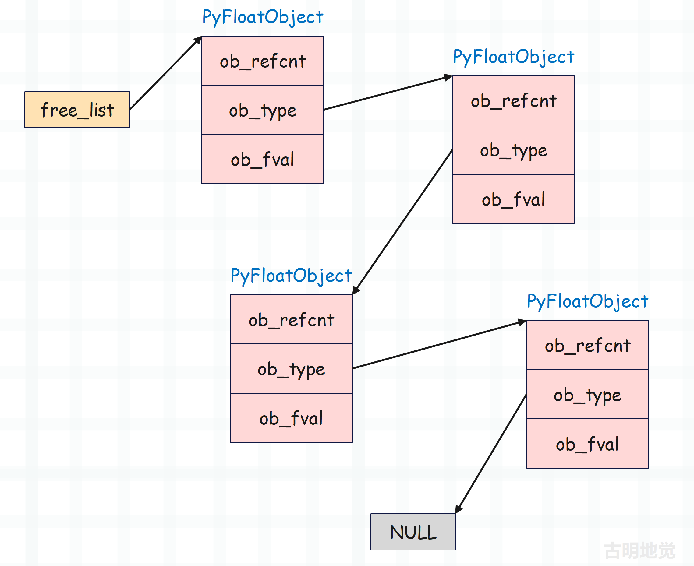
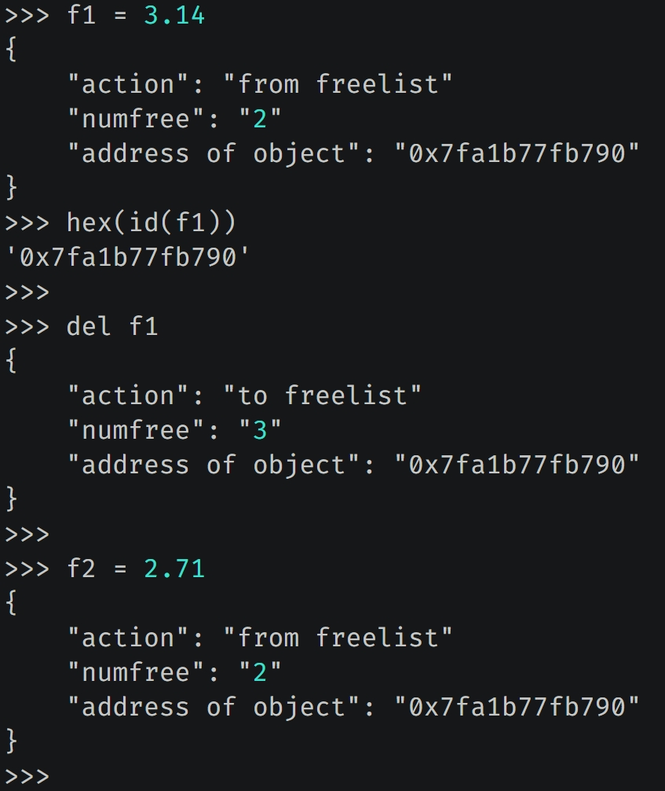
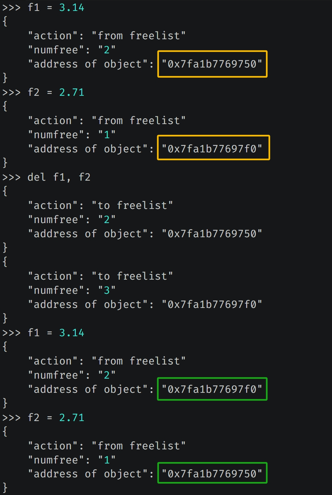

## 楔子

浮点数这种对象经常容易被创建和销毁，因为它很简单，使用频率高。如果每次创建都借助操作系统分配内存、每次销毁都借助操作系统回收内存的话，那效率会低到什么程度，可想而知。

因此 Python 解释器在操作系统之上封装了一个内存池，在内存管理的时候会详细介绍，目前可以认为内存池就是解释器预先向操作系统申请的一部分内存，专门用于小对象的快速创建和销毁，从而避免了频繁和操作系统打交道，这便是 Python 的内存池机制。

但浮点数的使用频率很高，并且使用时还会创建和销毁大量的临时对象，举个例子:

~~~Python
a = 95.5
b = 117.3
c = 108.9

avg = (a + b + c) / 3
~~~

计算平均值的时候，会先计算 a + b，创建一个临时对象。接着让临时对象和 c 相加再创建一个临时对象，然后除以 3得到结果。最后销毁临时对象，并将结果交给变量 avg。

尽管我们平常很少注意到这些，但运算背后所产生的对象的创建和销毁的次数，比我们想象的要多。特别是在循环的时候，会伴随大量的对象创建和销毁操作，
如果每次创建和销毁对象都要伴随着内存操作，这个时候即便有内存池机制，效率也是不高的，因为使用内存池虽然可以不经过操作系统，但它也会增加解释器系统的开销。

因此解释器在浮点数对象被销毁后，并不急着回收对象所占用的内存，换句话说其实对象还在，只是将该对象放入一个空闲的链表中。之前我们说对象可以理解为一片内存空间，对象如果被销毁，那么理论上内存空间要归还给操作系统，或者回到内存池中。但 Python 考虑到效率，并没有真正地释放内存，而是将对象放入到链表中，占用的内存还在。

后续如果需要创建新的浮点数对象时，那么从链表中直接取出之前放入的对象（我们认为被回收的对象），然后根据新的浮点数对象重新初始化对应的字段即可，这样就避免了内存分配造成的开销。而这个链表就是我们说的缓存池，当然不光浮点数对象有缓存池，Python 的很多其它对象也有对应的缓存池，比如列表。

## 缓存池的实现细节

下面看一下浮点数的缓存池的具体细节。

~~~C
// Objects/floatobject.c

// 缓存池（链表）的最大长度
// 因此池子里面最多容纳 100 个 PyFloatobject
#define PyFloat_MAXFREELIST    100

// 缓存池已经容纳了多少个 PyFloatobject
static int numfree = 0;
// 指向缓存池（链表）的头节点
static PyFloatObject *free_list = NULL;
~~~

我们观察一下 free_list，发现它是一个 PyFloatObect \*，这就说明缓存池（链表）中的每一个节点都是 PyFloatObject 实例。但以我们刷 Leetcode 的经验，链表里的每个节点应该有一个 next 字段指向下一个节点，可 PyFloatObject 里面似乎并没有这样的字段啊。

相信你已经猜到原因了，因为解释器是使用 ob_type 字段来指向下一个对象。本来 ob_type 指向的应该是 PyFloat_Type，但在缓存池中指向的是下一个 PyFloatObject。

以上就是浮点数的缓存池，说白了就是一个链表，free_list 指向链表的头节点，节点之间通过 ob_type 字段充当 next 指针。

## 再探浮点数的创建与销毁

我们以 PyFloat_FromDouble 这个 API 为例，再回顾一下浮点数的创建,

~~~C
// Objects/floatobject.c

PyObject *
PyFloat_FromDouble(double fval)
{   
    // 获取缓存池的头结点指针
    PyFloatObject *op = free_list;
    // 如果 op 不为 NULL，说明它指向了 PyFloatObject
    // 换句话说就是，缓存池里面有可用节点
    if (op != NULL) {
        // 维护 free_list，让它指向链表的下一个节点
        free_list = (PyFloatObject *) Py_TYPE(op);
        // 缓存池的节点个数减 1
        numfree--;
    } else {
        op = (PyFloatObject*) PyObject_MALLOC(sizeof(PyFloatObject));
        if (!op)
            return PyErr_NoMemory();
    }
    (void)PyObject_INIT(op, &PyFloat_Type);
    op->ob_fval = fval;
    return (PyObject *) op;
}
~~~

在链表中，ob_type 被用于指向下一个节点，换言之 ob_type 保存的是下一个 PyFloatObject 的地址。不过话虽如此，可 ob_type 的类型仍是 PyTypeObject \*。因此在存储的时候，PyFloatObject \* 一定是先转成了 PyTypeObject \*，之后再交给 ob_type 保存。因为对于指针来说，是可以任意转化的，我们一会儿看 float_dealloc 的时候就知道了。

那么同理，这里的 Py_TYPE(op) 在获取下一个节点的指针之后，还要再转成 PyFloatObject *，然后才能交给 free_list 保存。如果没有下一个对象了，那么 free_list 就是 NULL，在下一次分配的时候，上面的 if (op!=NULL) 就会不成立，从而走下面的 else，使用 PyObject_MALLOC 重新分配内存。

既然对象创建时可以从缓存池获取，那么销毁的时候，肯定要放入到缓存池中。而销毁对象时，会调用类型对象的 tp_dealloc（析构函数），对于浮点数而言就是 float_dealloc，我们看一下源代码。

~~~C
static void
float_dealloc(PyFloatObject *op)
{   
    // 如果要放入浮点数的缓存池，那么它必须是浮点数
    if (PyFloat_CheckExact(op)) {
        // 如果缓存池中的节点个数已经达到了 PyFloat_MAXFREELIST，那么直接释放掉
        if (numfree >= PyFloat_MAXFREELIST)  {
            PyObject_FREE(op);
            return;
        }
        // 否则放入到缓存池中
        // 缓存池的节点个数加 1
        numfree++;
        // 因为对象要成为链表的新头结点，那么它的 ob_type（充当 next）要指向当前头结点
        // 所以将 ob_type 的值设置为 state->free_list 即可
        // 但 ob_type 字段的类型为 PyTypeObject *，而 free_list 是 PyFloatobject *
        // 因此赋值之后，要将类型转换一下
        Py_TYPE(op) = (struct _typeobject *)free_list;
        // 然后将 op 赋值为 state->free_list，也就是让 free_list 指向新的头结点
        free_list = op;
    }
    // 如果销毁的对象不是浮点数，而是 float 子类的实例，那么直接释放内存
    else
        Py_TYPE(op)->tp_free((PyObject *)op);
}

~~~

以上便是浮点数缓存池的具体实现，说白了缓存池的作用只有一个，就是在对象被销毁的时候不释放所占的内存，下次创建新的对象时能够直接拿来用。因为内存没有被释放，因此创建起来就会快很多。

## 侵入 PyFloatObject

下面我们修改解释器源代码，当创建和销毁浮点数的时候，打印一些日志信息。

日志信息以字典的形式打印，里面有三个 key，含义如下：

+ action：如果值为 "from_freelist"，表示从缓存池获取对象；如果值为 "to_freelist" 表示对象放入缓存池。
+ numfree：从缓存池获取对象、或将对象放入缓存池之后的元素个数。
+ address of object：创建或销毁的对象的地址。

当创建 f1 的时候，指向的浮点数会从缓存池中获取，日志信息中的对象地址显然和 Python 里打印的地址是一样的。然后 del f1，会将对象放入缓存池中。最后新建一个变量 f2，显然它指向的浮点数会复用 f1 指向的浮点数的内存。

再举个例子：

我们重新创建变量 f1、f2，并打印对象地址，然后删除 f1、f2 变量，之后再重新创建 f1、f2 变量并打印对象地址，结果发现地址在删除前后正好是相反的。至于原因，如果思考一下将对象放入缓存池、以及从缓存池获取对象时所采取的策略，那么很容易就明白了。

因为 del f1,f2 的时候会先删除 f1，再删除 f2。删除 f1 的时候，会将 f1 指向的对象作为链表中的头结点，然后删除 f2 的时候，会将 f2 指向的对象作为链表中新的头结点，所以之前 f1 指向的对象就变成了链表中的第二个节点。

> 浮点数缓存池在添加节点的时候，采用的是头插法。

而获取的时候，也会从链表的头部开始获取，所以当重新创建变量 f1 的时候，其指向的对象使用的是之前变量 f2 指向的对象所占的内存，而一旦获取，那么 free_list 指针会指向下一个节点。然后创建变量 f2 的时候，其指向的对象使用的就是之前变量 f1 指向的对象所占的内存。

因此前后打印的地址是相反的，所以我们算是通过实践从另一个角度印证了之前分析的结论。

## 通过 ctypes 模拟底层数据结构

有时我们想观察底层数据结构的表现行为时，不一定非要修改解释器，因为那样太麻烦，还要重新编译。Python 在上层提供了一种方式，可以让我们通过 Python 的类轻松地模拟 C 的结构体。

~~~python
from ctypes import *

class PyObject(Structure):
    """
    继承 ctypes.structure，便可以得到c的结构体
    然后通过 fields 指定结构体字段
    """
    # _fields_ 是一个列表，内部的元组对应结构体的字段
    _fields_ = [
        ("ob_refcnt", c_ssize_t),
        ("ob_type", c_void_p),
    ]
    # ob_refcnt 是 Py_ssize_t 类型，等价于 c_ssize_t
    # 至于 ob_type，我们就指定 void *，因为暂时不用这个字段

class PyFloatObject(PyObject):
    """
    继承 Pyobject，相当于结构体的嵌套
    """
    _fields_ = [
        ("ob_fval", c_double)
    ]

e = 2.71
# 创建 PyFloatObject 实例，返回它的指针
# from_address 表示根据对象的地址创建
f = PyFloatObject.from_address(id(e))
# 此时 e 和 f 都指向了 2.71 这个浮点数

# 注意接下来会发生神奇的一幕
print(e)  # 2.71
print(hex(id(e)))  # 0x1f94d2382f0

# f 等价于底层的 PyFloatObject *，修改 ob_fval 字段
f.ob_fval = 3.14
print(e)  # 3.14
print(hex(id(e)))  # 0x1f94d2382f0
~~~

我们看到 id(e) 在前后并没有发生改变，证明 e 指向的始终是同一个对象，但是它的值却变了。咦，不是说浮点数是不可变对象吗？如果想变的话只能创建一个新的浮点数，这样一来前后打印的地址应该会变才对啊。

首先说明结论是没错的，可这是从 Python 的角度而言。如果是从解释器的角度来看的话，没有什么可变不可变，只要我们想让它可变，那么它就是可变的。

另外为了更好地观察底层数据结构的表现，我们后面会经常使用这种方式，而且会介绍更多的骚操作，但是切记这种动态修改解释器的做法不可用于生产环境。

## 小结

以上就是浮点数的缓存池机制，简单来说是一种空间换时间的做法。

为了避免频繁地和内核打交道，CPython 引入了内存池机制，事先会向操作系统申请一部分内存，然后根据大小划分成不同的单元，按需分配。这样就无需频繁和操作系统的内核打交道了，因为系统调用是代价昂贵的操作。

但有了内存池还不够，我们知道 Python 对象是分配在堆上的，而在堆上分配内存效率要比栈差很多。所以又引入了缓存池，对象在被销毁后不释放所占内存，而是通过一个链表串起来，留着下次备用。

-------

&nbsp;

**欢迎大家关注我的公众号：古明地觉的编程教室。**

**如果觉得文章对你有所帮助，也可以请作者吃个馒头，Thanks♪(･ω･)ﾉ。**

