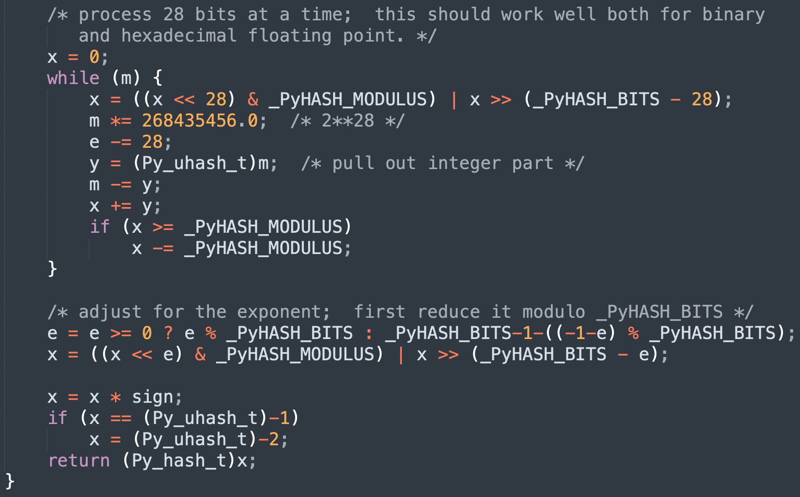
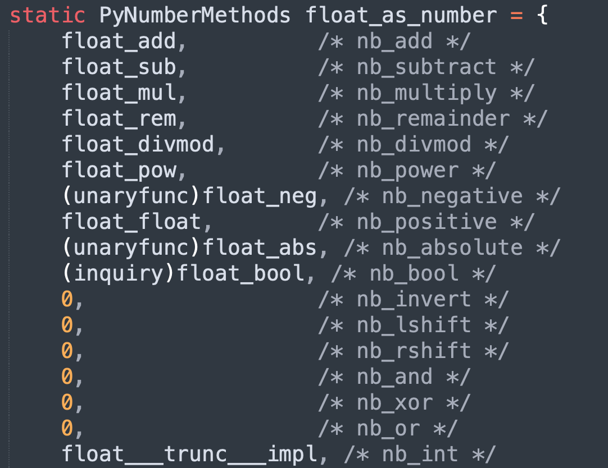
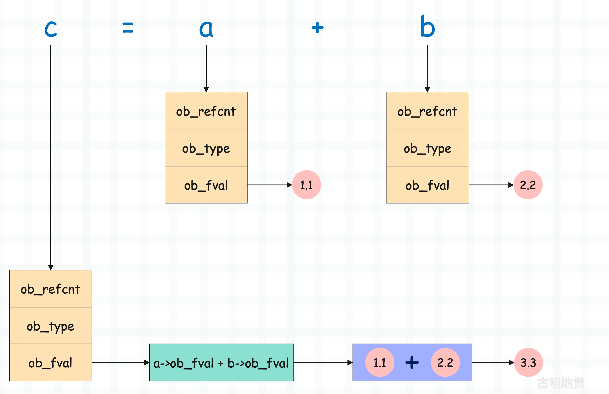

## 楔子

本篇文章来聊一聊浮点数支持的操作，之前说过实例对象的相关操作都定义在类型对象里面，所以我们需要查看 PyFloat_Type。

~~~C
// Objects/floatobject.c
PyTypeObject PyFloat_Type = {
    PyVarObject_HEAD_INIT(&PyType_Type, 0)
    "float",
    sizeof(PyFloatObject),
    // 浮点数的 __repr__ 方法
    (reprfunc)float_repr,                       /* tp_repr */
    // 浮点数作为数值对象拥有的算数操作
    &float_as_number,                           /* tp_as_number */
    // ...
    // 浮点数的哈希操作
    (hashfunc)float_hash,                       /* tp_hash */
    // ...
    // 浮点数支持的比较操作
    float_richcompare,                          /* tp_richcompare */
    // ...
};

~~~

还是之前说的，Python 底层的函数命名以及 API 都是很有规律的，举个例子：

+ tp_repr 字段表示实例对象的字符串格式化，在 PyFloat_Type 里面它被赋值为 float_repr。
+ tp_hash 字段表示实例对象的哈希操作，在 PyFloat_Type 里面它被赋值为 float_hash。
+ tp_richcompare 字段表示实例对象的比较操作，所有的比较运算均由该字段负责实现，在 PyFloat_Type 里面它被赋值为 float_richcompare。

下面我们来通过源码看一下底层实现。

## 浮点数的字符串打印

由于 PyFloat_Type 没有实现 tp_str（字段的值为 0 ），所以打印一个浮点数会执行 tp_repr，它对应的具体实现为 float_repr 函数。

~~~C
// Objects/floatobject.c

static PyObject *
float_repr(PyFloatObject *v)
{
    PyObject *result;  // 返回值
    char *buf;
    // 将 Python 浮点数转成 C 的浮点数，然后再转成字符串
    buf = PyOS_double_to_string(PyFloat_AS_DOUBLE(v),
                                'r', 0,
                                Py_DTSF_ADD_DOT_0,
                                NULL);
    if (!buf)
        return PyErr_NoMemory();
    // 基于 C 字符串创建 Python 字符串
    result = _PyUnicode_FromASCII(buf, strlen(buf));
    // 释放 buf，然后返回
    PyMem_Free(buf);
    return result;
}
~~~

比较简单，当然具体的转换逻辑由 PyOS_double_to_string 函数负责，内部最终会调用 C 的库函数，感兴趣可以看一下。

## 浮点数的哈希值

获取浮点数的哈希值会执行 tp_hash，它对应的具体实现为 float_hash。

~~~C
// Objects/floatobject.c
static Py_hash_t
float_hash(PyFloatObject *v)
{
    return _Py_HashDouble(v->ob_fval);
}
~~~

具体的哈希计算逻辑由 _Py_HashDouble 负责，通过 `v->ob_fval` 拿到 C 浮点数，然后传进去计算哈希值。

感兴趣可以看一下具体的哈希值计算逻辑，该函数位于 Python/pyhash.c 中。

## 浮点数的比较操作

浮点数之间的比较操作由 tp_richcompare 字段负责实现，该字段的值为 float_richcompare。

~~~C
// Include/object.h
#define Py_LT 0  // 小于
#define Py_LE 1  // 小于等于
#define Py_EQ 2  // 等于
#define Py_NE 3  // 不等于
#define Py_GT 4  // 大于
#define Py_GE 5  // 大于等于

// Objects/floatobject.c
static PyObject*
float_richcompare(PyObject *v, PyObject *w, int op)
{   
   // 假设在 Python 里面执行了 3.14 == 2.71
   // 那么这里的 v 和 w 就会指向 3.14 和 2.71，而 op 就是 Py_EQ
    double i, j;
    int r = 0;

    assert(PyFloat_Check(v));
    // 通过 ((PyFloatObject *) v)->ob_fval 拿到具体的 C 浮点数
    i = PyFloat_AS_DOUBLE(v);

    // 变量只是泛型指针 PyObject *，它究竟指向什么类型的对象是需要判断的
    // 对于 v == w 来讲，如果能执行该函数，我们只能确保 v 一定指向浮点数，但 w 则不一定
    // 所以需要判断，如果 w 的类型是 float 或者 float 的子类，那么转成 C double 并赋值给 j
    if (PyFloat_Check(w))
        // 绝大部分情况都会触发此分支
        j = PyFloat_AS_DOUBLE(w);

    else if (!Py_IS_FINITE(i)) {
        // ...
    }

    else if (PyLong_Check(w)) {
        // ...
    } 

    else        /* w isn't float or int */
        goto Unimplemented;

 Compare:
    PyFPE_START_PROTECT("richcompare", return NULL)
    // 拿到 i 和 j 之后，判断 op 是哪一种操作符，然后执行相应的比较逻辑      
    switch (op) {
    case Py_EQ:
        r = i == j;
        break;
    case Py_NE:
        r = i != j;
        break;
    case Py_LE:
        r = i <= j;
        break;
    case Py_GE:
        r = i >= j;
        break;
    case Py_LT:
        r = i < j;
        break;
    case Py_GT:
        r = i > j;
        break;
    }
    PyFPE_END_PROTECT(r)
    return PyBool_FromLong(r);

 Unimplemented:
    Py_RETURN_NOTIMPLEMENTED;
}
~~~

该函数的代码量还是有一些大的，但逻辑很好理解，主要是会对 w 做一些类型上的检测。因为 w 不一定是浮点数，比如 3.14 != [] 同样会触发该函数，但函数里的 w 指向的就不是浮点数，而是列表。

不过大部分情况下，两个对象比较的时候，如果符号左侧是浮点数，那么右侧基本也是浮点数。所以基本上都会走开始的 if 分支，然后进入比较逻辑。但如果符号右侧不是浮点数，那么会执行剩下的分支，逻辑会更复杂一些。

## 浮点数的算数操作

最后是重头戏，来看看浮点数是如何运算的。由于加减乘除等算术操作很常见，所以解释器将其抽象成 PyNumberMethods 方法簇。对于数值型对象来说，它的类型对象会实现此方法簇，并由 tp_as_number 字段指向。

~~~C
// Include/cpython/object.h
typedef struct {
    binaryfunc nb_add;
    binaryfunc nb_subtract;
    binaryfunc nb_multiply;
    binaryfunc nb_remainder;
    binaryfunc nb_divmod;
    ternaryfunc nb_power;
    unaryfunc nb_negative;
    unaryfunc nb_positive;
    unaryfunc nb_absolute;
    inquiry nb_bool;
    unaryfunc nb_invert;
    binaryfunc nb_lshift;
    binaryfunc nb_rshift;
    binaryfunc nb_and;
    binaryfunc nb_xor;
    binaryfunc nb_or;
    // ...
} PyNumberMethods;
~~~

PyNumberMethods 这个结构体在前面已经介绍过，每个字段都是一个函数指针，对应一个算术操作。而根据参数个数的不同，这些函数可以分为多种。

+ unaryfunc： 一元函数，只接收一个参数，返回 PyObject *；
+ binaryfunc： 二元函数，接收两个参数，返回 PyObject *；
+ ternaryfunc： 三元函数，接收三个参数，返回 PyObject *；
+ inquiry：一元函数，接收一个参数，但返回的是 int。

它们本质上就是解释器基于参数的类型和个数而起的别名，除了以上这些，还有很多其它的别名，具体可以查看 Include/object.h。

由于浮点数是数值型对象，所以 PyFloat_Type 实现了该方法簇，值为 float_as_number，来看一下，它位于 Objects/floatobject.c 中。

像 float_add 负责浮点数的加法运算，float_sub 负责浮点数的减法运算，都比较简单。但我们看到有的函数指针被赋值成了 0，如果为 0 则表示不支持相应操作，比如浮点数不支持位运算。

> 在 C 语言中，给指针类型的字段赋值为 0 和赋值为 NULL 是等价的。

好，下面我们以加法运算为例，看一下具体实现。

~~~C
// Objects/floatobject.c
static PyObject *
float_add(PyObject *v, PyObject *w)
{
    // 显然两个 Python 浮点数相加，一定是先转成 C 的浮点数，然后再相加
    // 加完之后再根据结果创建新的 Python 浮点数
    double a,b;  // 声明两个 double 变量
    // CONVERT_TO_DOUBLE 是一个宏，从名字上也能看出来它的作用
    // 将 PyFloatObject 里面的 ob_fval 抽出来，赋值给 double 变量
    CONVERT_TO_DOUBLE(v, a);
    CONVERT_TO_DOUBLE(w, b);
    PyFPE_START_PROTECT("add", return 0)
    // 将 a 和 b 相加，然后再重新赋值给 a      
    a = a + b;
    PyFPE_END_PROTECT(a)
    // 根据相加后的结果创建新的 PyFloatObject 对象
    // 并将其指针转成 PyObject * 之后返回
    return PyFloat_FromDouble(a);
}
~~~

以上就是浮点数的加法运算，核心如下：

+ 定义两个 double 变量 a 和 b。
+ 将相加的两个 Python 浮点数维护的值（ob_fval）抽出来，交给 a 和 b。
+ 让 a 和 b 相加，将相加的结果传入 PyFloat_FromDouble 函数中创建新的 PyFloatObject，然后返回其 PyObject *。

> 另外 float_add 里面还有两个宏我们没有说，分别是：PyFPE_START_PROTECT 和 PyFPE_END_PROTECT，它们是做什么的呢？首先浮点数计算一般都遵循 IEEE-754 标准，如果计算时出现了错误，那么需要将 IEEE-754 异常转换成 Python 异常，而这两个宏就是用来干这件事情的。
>
> 所以我们不需要管它，这两个宏定义在 Include/pyfpe.h 中，并且已经在 Python3.9 的时候被移除了。

以上便是浮点数的加法运算，所谓的浮点数在底层就是一个 PyFloatObject 结构体实例。而结构体实例无法直接相加，所以必须先将结构体中维护的值抽出来，对于浮点数而言就是 ob_fval，然后转成 C 的 double 再进行相加。最后根据相加的结果创建新的结构体实例，于是新的 Python 对象便诞生了。

假设 a, b = 1.1, 2.2，那么 c = a + b 的流程如下所示：

但如果是 C 的两个浮点数相加，那么编译之后就是一条简单的机器指令，然而 Python 则需要额外做很多其它工作。并且后续在介绍整数的时候，你会发现 Python 的整数相加更麻烦，但对于 C 而言同样是一条简单的机器码就可以搞定。

> 所以为什么 Python 会比 C 慢很多倍，从一个简单的加法上面就可以看出来。

以上是浮点数的加法操作，至于减法、乘法、除法等操作也是类似的。

~~~C
// Objects/floatobject.c
static PyObject *
float_add(PyObject *v, PyObject *w)
{
    double a,b;
    CONVERT_TO_DOUBLE(v, a);
    CONVERT_TO_DOUBLE(w, b);
    PyFPE_START_PROTECT("add", return 0)
    a = a + b;
    PyFPE_END_PROTECT(a)
    return PyFloat_FromDouble(a);
}

static PyObject *
float_sub(PyObject *v, PyObject *w)
{
    double a,b;
    CONVERT_TO_DOUBLE(v, a);
    CONVERT_TO_DOUBLE(w, b);
    PyFPE_START_PROTECT("subtract", return 0)
    a = a - b;
    PyFPE_END_PROTECT(a)
    return PyFloat_FromDouble(a);
}

static PyObject *
float_mul(PyObject *v, PyObject *w)
{
    double a,b;
    CONVERT_TO_DOUBLE(v, a);
    CONVERT_TO_DOUBLE(w, b);
    PyFPE_START_PROTECT("multiply", return 0)
    a = a * b;
    PyFPE_END_PROTECT(a)
    return PyFloat_FromDouble(a);
}

static PyObject *
float_div(PyObject *v, PyObject *w)
{
    double a,b;
    CONVERT_TO_DOUBLE(v, a);
    CONVERT_TO_DOUBLE(w, b);
    if (b == 0.0) {
        PyErr_SetString(PyExc_ZeroDivisionError,
                        "float division by zero");
        return NULL;
    }
    PyFPE_START_PROTECT("divide", return 0)
    a = a / b;
    PyFPE_END_PROTECT(a)
    return PyFloat_FromDouble(a);
}
~~~

代码逻辑是类似的，整个过程就是将 Python 浮点数里面的值抽出来，得到 C 浮点数，然后进行运算，再基于运算的结果创建 Python 浮点数，并返回它的泛型指针。

## 小结

到此浮点数就介绍完了，之所以先介绍浮点数，是因为浮点数最简单。至于整数，其实并没有那么简单，因为它的值在底层是通过数组存储的。而浮点数的值则是用一个 double 类型的字段来维护，会更简单一些，所以我们就先拿浮点数开刀了。

首先我们介绍了浮点数的创建和销毁，创建有两种方式，分别是使用对象的特定类型API 和调用类型对象。前者速度更快，但只适用于内置数据结构，而后者更加通用。

销毁的时候则调用类型对象内部的 tp_dealloc 字段指向的 float_dealloc 函数。当然为了保证效率，避免内存的频繁创建和回收，解释器为浮点数引入了缓存池机制，我们也分析了背后的原理。

最后浮点数还支持数值运算，PyFloat_Type 的 tp_as_number 字段指向了 PyNumberMethods 结构体实例 float_as_number，里面有大量的函数指针，每个指针指向了具体的函数，专门用于浮点数的运算。至于运算的具体逻辑，我们也以加法为例详细介绍了 float_add 函数的实现。核心就是将 Python 对象内部的值抽出来，转成 C 的类型，然后运算，最后再根据运算的结果创建 Python 对象，并返回泛型指针。

关于浮点数，如果你还想知道它的更多内容，可以进入源码中，大肆探索一番。

-----

&nbsp;

**欢迎大家关注我的公众号：古明地觉的编程教室。**

**如果觉得文章对你有所帮助，也可以请作者吃个馒头，Thanks♪(･ω･)ﾉ。**

