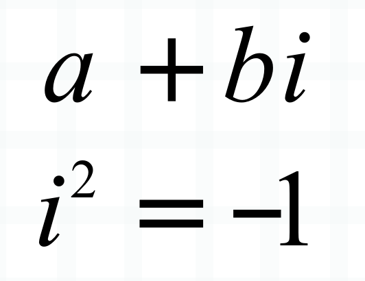
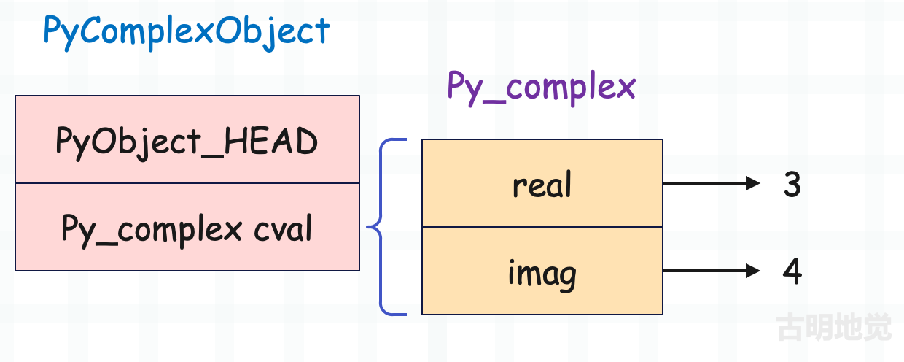
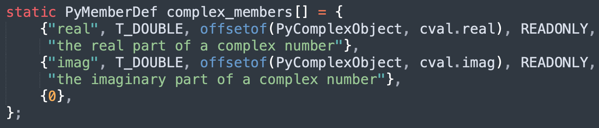
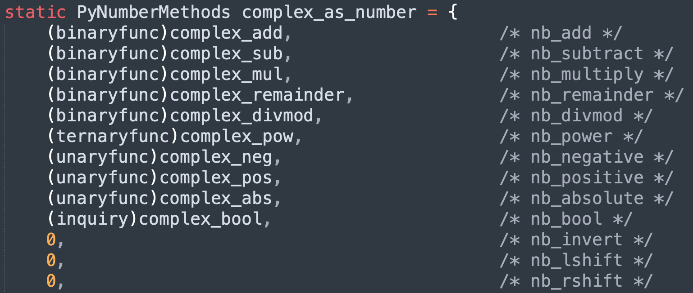
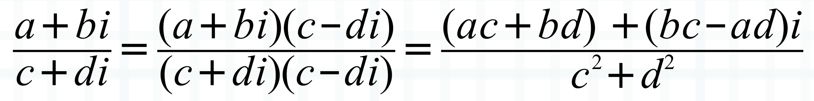

## 楔子

本篇文章来聊一聊复数，尽管在日常开发中基本用不到复数，但对它有一个深刻的认识，知道它是做什么的，个人觉得还是很有必要的。另外，本系列力求精致、详细，因此每一个细节都要到位。

那么下面就来解释一下什么是复数。

## 什么是复数

复数是一种用来扩展实数的数，它由实数和虚数两部分组成，用来解决实数范围内无法解决的问题，基本形式如下。

形如 a + bi 的数，我们称之为复数，其中 a 和 b 是浮点数（实数），i 是虚数，满足 i 的平方等于 -1。

所以复数不仅包含实数，还包含虚数，形式为 a + bi，然后 a 被称为复数的实部，b 被称为复数的虚部。如果两个复数的实部相同，虚部相反，那么它们互为共轭复数，比如 1 + 3i 和 1-3i。

如果对复数的实部和虚部进行平方和再开根号，便可得到复数的模，比如 3 + 4i 的模便是 5。

复数的引入可以帮助我们更好地理解和解决许多数学以及物理问题，特别是在涉及振动、波动和电路分析等领域，比如：

+ 电工程：分析交流电路和信号处理；
+ 控制系统：用于系统稳定性分析；
+ 量子力学：描述波函数和量子态；
+ 流体力学：用于描述流动问题；

当然复数也有自己的运算规则。

**加法：两个复数相加等于对应的实部和虚部分别相加**

**减法：两个复数相减等于对应的实部和虚部分别相减**

**乘法：两个复数的乘法使用分配率**

**除法：两个复数的乘法涉及到共轭复数**

以上就是复数的基本概念，下面来看看 Python 的复数是怎么实现的。

## 复数的底层结构

复数的实现比想象中要简单很多，说白了就是维护两个浮点数而已。

~~~C
// Include/complexobject.h
typedef struct {
    double real;
    double imag;
} Py_complex;

typedef struct {
    PyObject_HEAD
    Py_complex cval;
} PyComplexObject;
~~~

我们看到复数的结构和浮点数是非常相似的，只不过浮点数只用一个 double 来维护具体的值。而复数因为存在实部和虚部，因此需要两个 double，其中 real 维护复数的实部，imag 维护复数的虚部。

~~~python
# 在别的语言中，虚数都是用 i 来表示
# 而 Python 觉得 i 是一个很常用的变量，所以使用 j 来表示虚数
cpx = 3 + 4j
# 其中 3 为实部，4 为虚部
print(cpx)  # (3+4j)
# 如果虚部为 1，那么要写成 1j，不能只写 j，否则解释器会认为 j 是一个变量
print(3 + 1j)  # (3+1j)
# 复数的实部可以为 0
print(2j)  # 2j
# 当然虚部也可以为 0，如果虚部为 0，那么要写成 0j，不能不写
# 因为 3 和 3+0j 不是等价的，前者是整数，后者是复数
print(0j)  # 0j
print(3 + 0j)  # (3+0j)
~~~

整个过程非常简单，当解释器看到 3 + 4j 的时候，就知道要创建复数了，因为解释器对内置的数据结构了如指掌，所以在底层会创建一个 PyComplexObject 结构体实例。

没有什么难度，和浮点数是类似的。

## 复数的行为

类型对象定义的操作，决定了实例对象的行为，所以我们需要查看复数的类型都定义了哪些操作。复数的类型在 Python 里面对应 \<class 'complex'\>，那么根据解释器的命名规则，它在底层应该由 PyComplex_Type 负责实现。

~~~C
// Objects/complexobject.c
PyTypeObject PyComplex_Type = {
    PyVarObject_HEAD_INIT(&PyType_Type, 0)
    "complex",
    sizeof(PyComplexObject),
    // ...
    &complex_as_number,                         /* tp_as_number */
    0,                                          /* tp_as_sequence */
    0,                                          /* tp_as_mapping */
    // ...
    complex_richcompare,                        /* tp_richcompare */
    // ...
    complex_methods,                            /* tp_methods */
    complex_members,                            /* tp_members */
    // ...
};
~~~

complex 的类型也是 type，它的实例对象的大小就是 PyComplexObject 结构体的大小。然后我们看下它的 tp_members，该字段表示实例对象有哪些属性，它被赋值为 complex_members。

它有两个属性，分别是 real 和 imag，类型为 double，并且是只读的。那么在 Python 里面创建复数之后，便可以获取 real 和 imag 属性。

~~~Python
cpx = 3 + 4j
# 注意：虽然写的是 3 + 4j，但实部和虚部都是浮点数
print(cpx.real)  # 3.0
print(cpx.imag)  # 4.0
~~~

然后 complex 类型还实现了 tp_richcompare，用于复数之间的比较，但对于复数来说，比较操作只支持等于和不等于。

~~~C
// Objects/complexobject.c
static PyObject *
complex_richcompare(PyObject *v, PyObject *w, int op)
{
    PyObject *res;  // 比较结果
    Py_complex i;   // 复数的实部和虚部组成的结构体
    int equal;      // 两个复数是否相等
    
    // 如果 op 不是 ==、也不是 !=，那么报错
    // 因为复数只支持这两种比较操作
    if (op != Py_EQ && op != Py_NE) {
        goto Unimplemented;
    }

    assert(PyComplex_Check(v));
    // 获取复数 v 的 cval 字段，并赋值给 i
    // 即 i = ((PyComplexObject *) v)->cval
    TO_COMPLEX(v, i);

    if (PyLong_Check(w)) {
        // ...
    }
    else if (PyFloat_Check(w)) {
        // ...
    }
    else if (PyComplex_Check(w)) {
        Py_complex j;
        // j = ((PyComplexObject *) w)->cval
        TO_COMPLEX(w, j);
        // 如果实部和虚部都相等，那么两个复数相等
        equal = (i.real == j.real && i.imag == j.imag);
    }
    else {
        goto Unimplemented;
    }
    // equal 为 1，表示两个复数相等，为 0 表示两个复数不相等
    // 如果 op 为 Py_EQ，那么相等返回 True，不等返回 False
    // 如果 op 为 Py_NE，那么相等返回 False，不等返回 True
    if (equal == (op == Py_EQ))
         res = Py_True;
    else
         res = Py_False;

    Py_INCREF(res);
    return res;

Unimplemented:
    Py_RETURN_NOTIMPLEMENTED;
}
~~~

以上就是复效的比较，核心就是比较对应的实部和虚部是否均相等。

由于复数也属于数值型对象，所以它也实现了 tp_as_number 方法簇。

我们以复数的加法和减法为例，看一下源码细节。

~~~C
// Objects/complexobject.c

// 负责将两个 Py_complex 结构体实例相加
Py_complex
_Py_c_sum(Py_complex a, Py_complex b)
{
    // 复数的值由 Py_complex 结构体维护，它里面有 real 和 imag 两个字段
    Py_complex r;
    // 两个 Py_complex 实例相加的时候，等于内部的 real 和 imag 字段分别相加
    r.real = a.real + b.real;
    r.imag = a.imag + b.imag;
    return r;
}

// 负责将两个 Py_complex 结构体实例相减
Py_complex
_Py_c_diff(Py_complex a, Py_complex b)
{
    Py_complex r;
    r.real = a.real - b.real;
    r.imag = a.imag - b.imag;
    return r;
}

// 基于 Py_complex 创建 PyComplexObject
PyObject *
PyComplex_FromCComplex(Py_complex cval)
{
    PyComplexObject *op;
    // 为 PyComplexObject 结构体实例申请内存
    // 我们看到内存大小可以直接计算出来，因为内置数据结构在底层是写死的
    // 解释器对它们了如指掌，直接通过 sizeof 算一下即可，不需要借助类型对象
    op = (PyComplexObject *) PyObject_MALLOC(sizeof(PyComplexObject));
    // 如果 op 为 NULL，表示内存不够，申请失败
    if (op == NULL)
        return PyErr_NoMemory();
    // 初始化引用计数，并将 op->ob_type 初始化为 &PyComplex_Type
    // 也就是让实例对象和类型对象建立联系
    (void)PyObject_INIT(op, &PyComplex_Type);
    // 最后初始化 cval 字段，它是 Py_complex 结构体实例，负责维护复数具体的值
    op->cval = cval;
    // 转成泛型指针 PyObject * 之后返回
    return (PyObject *) op;
}

// 复数的加法
static PyObject *
complex_add(PyObject *v, PyObject *w)
{
    Py_complex result;
    // 将两个复数的 cval 抽出来，赋值给 a 和 b
    Py_complex a, b;
    TO_COMPLEX(v, a);
    TO_COMPLEX(w, b);
    PyFPE_START_PROTECT("complex_add", return 0)
    // 调用 _Py_c_sum 进行相加，得到新的 Py_complex
    result = _Py_c_sum(a, b);
    PyFPE_END_PROTECT(result)
    // 基于 Py_complex 创建 PyComplexObject
    return PyComplex_FromCComplex(result);
}

// 复数的减法
static PyObject *
complex_sub(PyObject *v, PyObject *w)
{
    Py_complex result;
    // 将两个复数的 cval 抽出来，赋值给 a 和 b
    Py_complex a, b;
    TO_COMPLEX(v, a);
    TO_COMPLEX(w, b);
    PyFPE_START_PROTECT("complex_sub", return 0)
    // 调用 _Py_c_diff 进行相减，得到新的 Py_complex
    result = _Py_c_diff(a, b);
    PyFPE_END_PROTECT(result)
    // 基于 Py_complex 创建 PyComplexObject      
    return PyComplex_FromCComplex(result);
}
~~~

以上就是复数的加法和减法，比较简单，至于其它操作，感兴趣可以自己阅读一下源码。

## 小结

本次我们就介绍了复数的底层结构以及它的一些相关操作，总的来说和浮点数是比较像的。不过还是像上面说的那样，对于我们日常开发来说，复数用的并不多，甚至可以说是几乎不用，但通过它来加深对源码的理解以及感受 Python 对象的设计哲学，还是非常有意义的。

下一篇文章来说一说整数，我们知道 Python 整数不会溢出，那么它是怎么设计的呢？背后有什么黑科技呢？我们下一篇文章再聊。

-------

&nbsp;

**欢迎大家关注我的公众号：古明地觉的编程教室。**

**如果觉得文章对你有所帮助，也可以请作者吃个馒头，Thanks♪(･ω･)ﾉ。**

