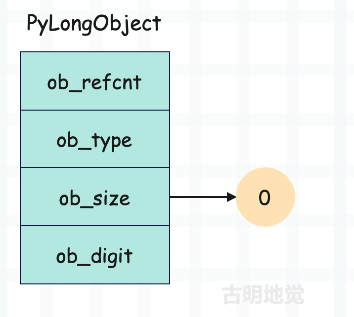
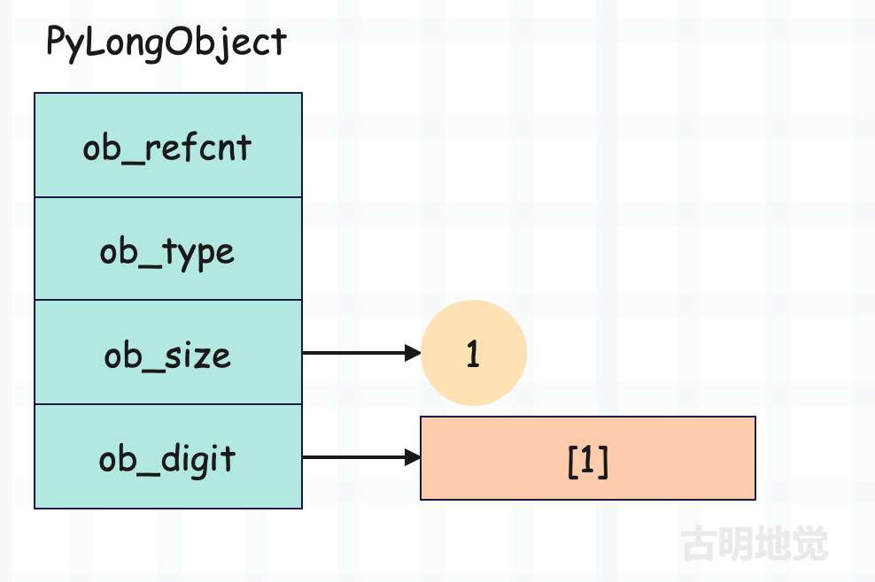
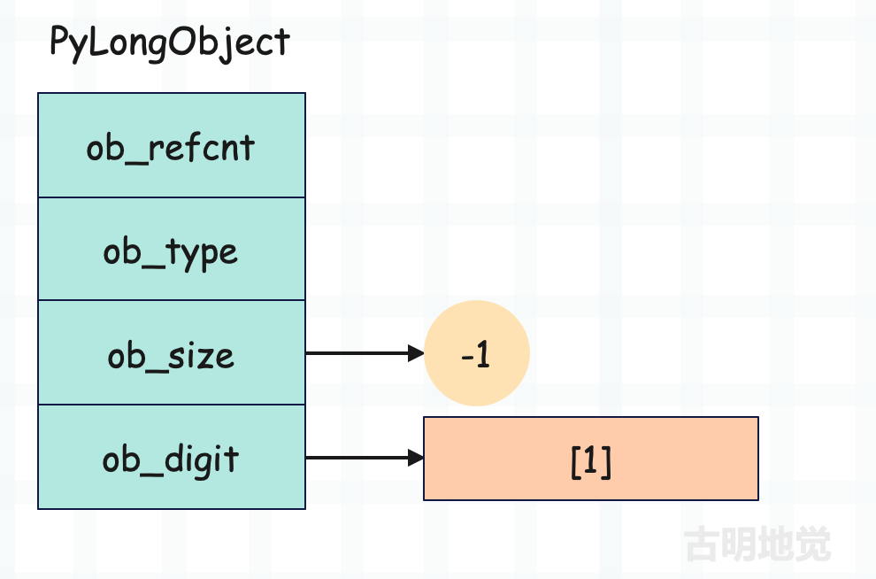
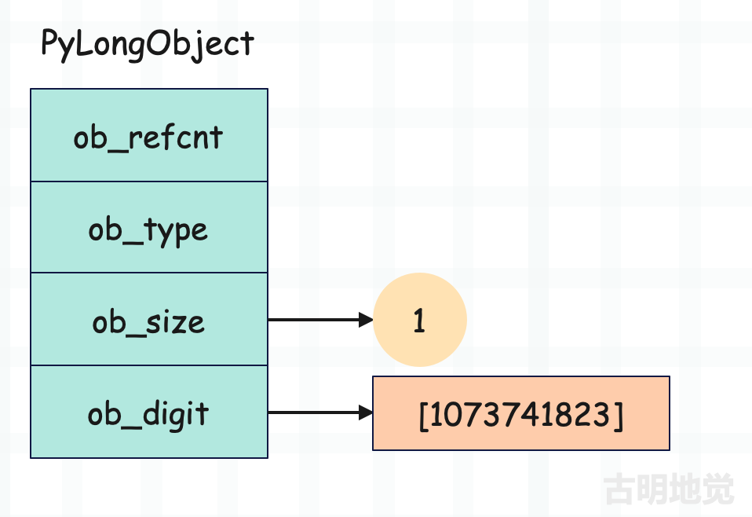
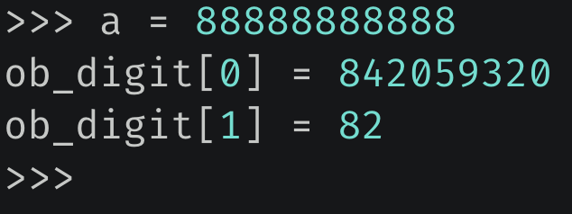

## 楔子

本篇文章来分析一下 Python 整数的实现原理，我们知道 Python 整数是不会溢出的，换句话说它可以计算无穷大的数。只要你的内存足够，它就能计算，但对于 C 来说显然是不行的，C 能保存的整数范围是有限的。

但问题是，Python 的底层是 C 实现的，那么它是怎么做到整数不溢出的呢？想要知道答案，那么看一下整数在底层是怎么定义的就行了。

## 整数的底层结构

Python 整数在底层由 PyLongObject 结构体负责承载，看一下它的定义。

~~~C
// Include/longobject.h
typedef struct _longobject PyLongObject;

// Include/longintrepr.h
struct _longobject {
    PyObject_VAR_HEAD
    digit ob_digit[1];
};
~~~

里面每个字段的含义如下：

+ ob_refcnt：对象的引用计数；
+ ob_type：对象的类型；
+ ob_size：数组 ob_digit 的长度；
+ ob_digit：digit 类型的数组；

别的先不说，就冲里面的 ob_size 我们就可以思考一番。首先 Python 的整数有大小、但应该没有长度的概念吧，那为什么会有一个 ob_size 呢？从结构体字段来看，这个 ob_size 表示数组 ob_digit 的长度，而这个 ob_digit 显然是用来维护具体的值。

相信你已经猜到 Python 整数不会溢出的秘密了，因为它内部通过数组来存储整数，所以能存储无限大的数。因此答案出来了，虽然整数没有我们生活中的那种长度的概念，但它是个变长对象，因为不同的整数占用的内存可能是不一样的。尽管它没有字符串、列表那种长度的概念，或者说无法对整数使用 len 函数，但它是个变长对象。

接下来的重点就是这个 ob_digit 数组，我们要从它的身上挖掘信息，看看整数是怎么放在里面的，不过首先我们要搞清楚这个 digit 是什么类型。

~~~C
// Include/longintrepr.h
#if PYLONG_BITS_IN_DIGIT == 30
    typedef uint32_t digit;
#elif PYLONG_BITS_IN_DIGIT == 15
    typedef unsigned short digit;
#else
    #error "PYLONG_BITS_IN_DIGIT should be 15 or 30"
~~~

PYLONG_BITS_IN_DIGIT 是一个宏，这个宏是做什么的我们先不管，总之如果机器是 64 位的，那么它会被定义为 30，机器是 32 位的，则会被定义为 15。而现在的机器基本都是 64 位的，所以 PYLONG_BITS_IN_DIGIT 等于 30，因此 digit 等价于 uint32_t，即 unsigned int。

因此 ob_digit 是一个无符号 32 位整型数组，至于长度，虽然声明为 1，但其实没有限制，你可以当成任意长度的数组来用，这是 C 语言的一个常见特性。和 Go 不同，C 数组的长度不属于类型信息。至于数组具体多长，取决于存储的整数有多大，显然整数越大，这个数组就越长，占用的空间也就越大。

## 探究整数的秘密

了解了 ob_digit 数组之后，来分析一下它是怎么存储整数的？

首先抛出一个问题，如果你是 Python 的设计者，要保证整数不会溢出，你会怎么办？我们不妨再把问题简化一下，假设有一个 8 位无符号整数类型，我们知道它能表示的最大数字是 255，但这时候如果要表示 256，该怎么办呢？

可能有人会想，那用两个数来存储不就好了，一个存储 255，一个存储 1，然后将这两个数放在数组里面。这个答案虽然有些接近，但其实还有偏差：就是我们并不能简单地按照大小拆分，比如 256 拆分成 255 和 1，要是 265 就拆分成 255 和 10，不能这样拆分，而是要通过二进制的方式，也就是用新的整数来模拟更高的位。

如果感到困惑的话没有关系，我们以 Python 整数的底层存储为例，来详细解释一下这个过程。解释器实现整数也是通过我们上面说的这种方式，但考虑的会更加全面一些。

**整数 0**

注意：当表示的整数为 0 时，ob_digit 数组为空，不存储任何值。而 ob_size 为 0，表示这个整数的值为 0，这是一种特殊情况。

**整数 1**

**整数 -1**

我们看到 ob_digit 数组没有变化，但是 ob_size 变成了 -1。没错，整数的正负是通过 ob_size 决定的，ob_digit 存储的其实是绝对值。无论整数 n 是多少，-n 和 n 对应的 ob_digit 是完全一致的，但是 ob_size 则互为相反数。所以 ob_size 除了表示数组的长度之外，还可以表示对应整数的正负。

因此我们之前说整数越大，底层的 ob_digit 数组就越长。更准确地说是绝对值越大，底层数组就越长。所以 Python 在比较两个整数的大小时，会先比较 ob_size，如果 ob_size 不一样则可以直接比较出大小。显然 ob_size 越大，对应的整数越大，不管 ob_size 是正是负，都符合这个结论。

**整数 2 \*\* 30 - 1**

如果想表示 2 \*\* 30 - 1，那么也可以使用一个 digit 表示。话虽如此，但为什么突然说这个数字呢？答案是：虽然 digit 是 4 字节、32 位，但解释器只用 30 个位。

之所以这么做是和加法进位有关系，如果 32 个位全部用来存储其绝对值，那么相加产生进位的时候，可能会溢出。比如 2 \*\* 32 - 1，此时 32 个位全部占满了，即便它只加上 1，也会溢出。那么为了解决这个问题，就需要先强制转换为 64 位整数再进行运算，从而会影响效率。但如果只用 30 个位的话，那么加法是不会溢出的。

因为 30 个位最大就是 2 \*\* 30 - 1，即便两个这样的数相加，结果也是 2 \*\* 31 - 2。而 32 个位最大能表示 2 \*\* 32 - 1，所以肯定不会溢出的。如果一开始 30 个位就存不下，那么数组中会有两个 digit。

所以虽然将 32 位全部用完，可以只用一个 digit 表示更大的整数，但会面临相加之后一个 digit 存不下的情况，于是只用 30 个位。如果数值大到 30 个位存不下的话，那么就会多使用一个 digit。

这里可能有人发现了，如果使用 31 个位的话，那么相加产生的最大值就是 2 \*\* 32 - 2，依旧可以使用一个 32 位整型存储啊，那 Python 为啥要牺牲两个位呢？答案是为了乘法运算。

> 为了方便计算乘法，需要多保留 1 位用于计算溢出。这样当两个整数相乘的时候，可以直接按 digit 计算，并且由于兼顾了"溢出位"，可以把结果直接保存在一个寄存器中，以获得最佳性能。

具体细节就不探究了，只需要知道整数在底层是使用 unsigned int 类型的数组来维护具体的值即可，并且虽然该类型的整数有 32 个位，但解释器只用 30 个位。

然后还记得我们在看 digit 类型的时候，说过一个宏吗？PYLONG_BITS_IN_DIGIT，在 64 位机器上等于 30，在 32 位机器上等于 15。相信这个宏表示的是啥你已经清楚了，它代表的就是使用的 digit 的位数。

**整数 2 \*\* 30**

问题来了，我们说 digit 只用 30 个位，所以 2 ** 30 - 1 是一个 digit 能存储的最大值。而现在是 2 \*\* 30，所以数组中就要有两个 digit 了。

我们看到此时就用两个 digit 来存储了，然后数组里面的元素是 0 和 1，而且充当高位的放在后面，因为是使用新的 digit 来模拟更高的位。由于一个 digit 只用 30 位，那么数组中第一个 digit 的最低位就是 1，第二个 digit 的最低位就是 31，第三个 digit 的最低位就是 61，以此类推。

所以如果 ob_digit 为 [a, b, c]，那么对应的整数就等于：

如果 ob_digit 不止 3 个，那么就按照 30 个位往上加，比如 ob_digit 还有第四个元素 d，那么就再加上 d * 2 ** 90 即可。

以上就是 Python 整数的存储奥秘，说白了就是串联多个小整数来表达大整数。并且这些小整数之间的串联方式并不是简单的相加，而是将各自的位组合起来，共同形成一个具有更高位的大整数，比如将两个 32 位整数串联起来，表示 64 位整数。

## 整数占的内存大小是怎么计算的

下面我们再分析一下，一个整数要占用多大的内存。

相信所有人都知道可以使用 sys.getsizeof 计算内存大小，但是这大小到底是怎么来的，估计会一头雾水。因为 Python 中对象的大小，是根据底层的结构体计算出来的。

由于 ob_refcnt、ob_type、ob_size 这三个是整数所必备的，它们都是 8 字节，加起来 24 字节，所以任何一个整数所占内存都至少 24 字节。至于具体占多少，则取决于 ob_digit 里面的元素有多少个。

因此整数所占内存等于 24 + 4 * ob_size的绝对值。

~~~Python
import sys

# 如果是 0 的话，ob_digit 数组为空，所以大小就是 24 字节
print(sys.getsizeof(0))  # 24

# 如果是 1 的话，ob_digit 数组有一个元素，所以大小是 24 + 4 = 28 字节
print(sys.getsizeof(1))  # 28
# 同理
print(sys.getsizeof(2 ** 30 - 1))  # 28

# 一个 digit 只用 30 位，所以最大能表示 2 ** 30 - 1
# 如果是 2 ** 30，那么就需要两个元素，所以大小是 24 + 4 * 2 = 32 字节
print(sys.getsizeof(2 ** 30))  # 32
print(sys.getsizeof(2 ** 60 - 1))  # 32

# 如果是两个 digit，那么能表示的最大整数就是 2 ** 60 - 1
# 因此 2 ** 60 需要三个 digit，所以大小是 24 + 4 * 3 = 36 字节
print(sys.getsizeof(1 << 60))  # 36
print(sys.getsizeof((1 << 90) - 1))  # 36

print(sys.getsizeof(1 << 90))  # 40
~~~

所以整数的大小就是这么计算的，当然不光整数，其它的对象也是如此，计算的都是底层结构体的大小。

另外我们也可以反推一下，如果有一个整数 88888888888，那么它对应的底层数组 ob_digit 有几个元素呢？每个元素的值又是多少呢？下面来分析一波。

~~~Python
import numpy as np

# 假设占了 n 个位
# 由于 n 个位能表达的最大整数是 2 ** n - 1
a = 88888888888
# 所以只需获取以 2 为底、a + 1 的对数，即可算出 n 的大小
print(np.log2(a + 1))  # 36.371284042320475
~~~

计算结果表明，如果想要存下这个整数，那么至少需要 37 个位。而 1 个 digit 用 30 个位，很明显需要两个 digit。

~~~Python
# 如果 ob_digit 有两个元素
# 那么对应的整数就等于 ob_digit[0] + ob_digit[1] * 2 ** 30
a = 88888888888
print(a // 2 ** 30)  # 82
print(a - 82 * 2 ** 30)  # 842059320
~~~

所以整数 88888888888 在底层对应的 ob_digit 数组为 [842059320, 82]，下面修改解释器，来验证这一结论。

我们看到结果和我们分析的是一样的，但这种办法有点麻烦，我们可以通过之前说的 ctypes 来构造底层的结构体，在 Python 的层面模拟 C 的行为。

~~~Python
from ctypes import *

class PyLongObject(Structure):
    _fields_ = [
        ("ob_refcnt", c_ssize_t),
        ("ob_type", c_void_p),
        ("ob_size", c_ssize_t),
        ("ob_digit", c_uint32 * 2)
    ]

a = 88888888888
# 基于对象的地址构造 PyLongObject 对象
long_obj = PyLongObject.from_address(id(a))
# 打印结果和我们预期的一样
print(long_obj.ob_digit[0])  # 842059320
print(long_obj.ob_digit[1])  # 82

# 如果将 ob_digit[1] 改成 28，那么 a 会变成多少呢？
# 很简单，算一下就知道了
long_obj.ob_digit[1] = 28
print(842059320 + 28 * 2 ** 30)  # 30906830392
# 那么 a 会不会也打印这个结果呢？毫无疑问，肯定会的
print(a)  # 30906830392

# 并且前后 a 保存的地址没有发生改变，因为我们修改的是底层数组
# 因此所谓的可变和不可变，都只是根据 Python 的表现抽象出来的
# 或者说，对象是否可变，取决于解释器有没有将修改对象的接口暴露出来
# 要是解释器没有提供修改对象的接口，那么对象就是不可变的
# 但如果站在解释器的层面上看，则没啥可变或不可变，一切都由我们决定
~~~

通过打印 ob_digit 存储的值，我们验证了得出的结论，原来 Python 是通过数组来存储整数，并且数组的类型虽然是无符号 32 位整数，但是只用 30 个位。

## 小结

以上我们就探究了 Python 整数的秘密，它是怎么实现的。不过还没有结束，后续还要继续分析小整数对象池，以及整数的行为。

-----

&nbsp;

**欢迎大家关注我的公众号：古明地觉的编程教室。**

**如果觉得文章对你有所帮助，也可以请作者吃个馒头，Thanks♪(･ω･)ﾉ。**

