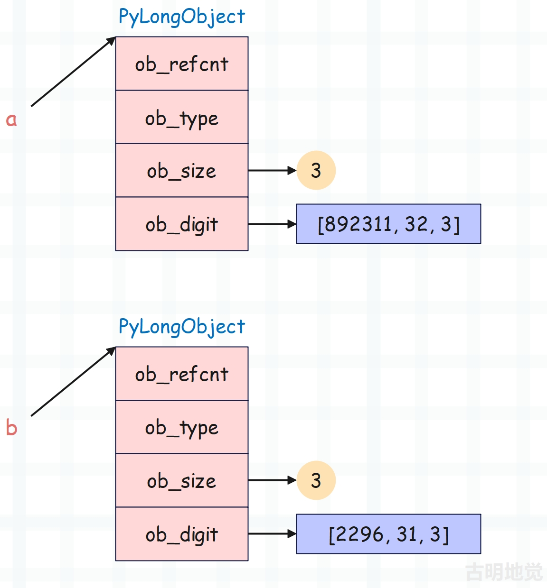
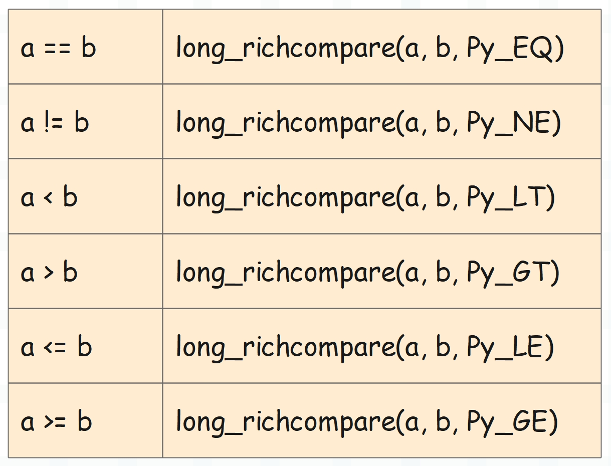
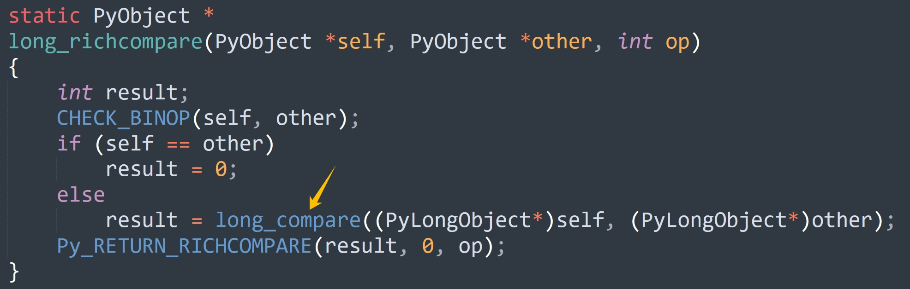

## 楔子

通过考察整数的底层实现，我们明白了它能够保证不溢出的缘由。整数的值在底层是由 C 数组来维护的，通过组合多个 digit（uint32_t）来实现大整数的存储。这么做的好处就是 Python 整数没有大小限制了，因此不会溢出，而不会溢出是因为数组没有长度限制，所以只要你的内存足够，就可以存任意大的数。

Python 表示：存不下？会溢出？这都不是事儿，直接继续往数组里面塞 digit 就 ok 了。另外数组存的是绝对值，符号是通过 ob_size 体现的。

不过说实话，用数组实现大整数的做法非常普遍，并没有什么神秘的，就是将多个整数组合起来，模拟具有更高位的大整数。但这种实现方式的难点在于大整数的数学运算，它们才是重点，实现的时候比较考验编程技巧以及思维逻辑。

因此 Python 的整数比浮点数要复杂的多，浮点数在底层直接用 C 的 double 来维护具体的值，因此运算的话，比如相加，直接转成 C 的 double 做加法即可。但整数就不行了，在底层不能简单地将数组相加。

下面来看看具体实现。

## 整数的大小比较

先来看看整数的大小比较，由于整数具体的值是通过数组维护的，显然数组越长，整数的绝对值就越大，这是毫无疑问的。至于整数的正负，则由 ob_size 来体现。

因此可以得出一个结论：当两个整数在比大小时，可以先比较各自的 ob_size，如果 ob_size 不一样，可以直接比较出大小，并且 ob_size 越大，对应的整数越大。但如果两个整数的 ob_size  一样，那么就从数组 ob_digit 的尾部元素开始，不断向前进行比较。只要两个整数的 ob_digit 中有一个对应元素不相同，那么就可以比较出大小。

之所以从数组的尾部开始，是因为数组元素的索引越大，那么充当的位数就越高，而在比较的时候显然要从高位开始比。

~~~Python
# ob_digit = [892311, 32, 3]
a = 3458764548181171607
# ob_digit = [2296, 31, 3]
b = 3458764547106539768
~~~

我们以 a 和 b 为例，显然 a 大于 b，那么在底层，它们是如何比较的呢？

如果 ob_size 不相等，那么可以直接比较出大小。但这里两个整数的 ob_size 是相等的，所以需要比较 ob_digit，并且是从后往前比。具体做法就是让索引从 ob_digit 长度减 1 开始，依次往前遍历。

+ 因为 `a->ob_digit[2]` 等于 `b->ob_digit[2]`，此时无法比较出大小，因此索引减一，比较上一个元素。
+ 因为 `a->ob_digit[1]` 大于 `b->ob_digit[1]`，所以成功比较出大小，可以得出 |a| 大于 |b|。

当然啦，由于数组反映的是绝对值的大小，所以还需要判断符号。

+ 如果是正数，那么和绝对值相同。
+ 但如果是负数，那么绝对值越大，对应的整数反而越小，因此比较之后的结果还要再乘上 -1。

~~~Python
from ctypes import *

class PyLongObject(Structure):
    _fields_ = [
        ("ob_refcnt", c_ssize_t),
        ("ob_type", c_void_p),
        ("ob_size", c_ssize_t),
        ("ob_digit", c_uint32 * 3)
    ]

a = 3458764548181171607
b = 3458764547106539768
long_obj1 = PyLongObject.from_address(id(a))
long_obj2 = PyLongObject.from_address(id(b))
print(list(long_obj1.ob_digit))  # [892311, 32, 3]
print(list(long_obj2.ob_digit))  # [2296, 31, 3]
~~~

以上就是整数的大小比较逻辑，下面再看一下具体的源码实现。

int 类型对象的 tp_richcompare 字段的值为 long_richcompare，所以具体的比较逻辑便由该函数负责实现。

~~~C
// Objects/longobject.c

static PyObject *
long_richcompare(PyObject *self, PyObject *other, int op)
{   
    // 比较结果
    int result;
    // 类型检测，确保 self 和 other 的类型都是整数
    CHECK_BINOP(self, other);
    // self 和 other 都是泛型指针 PyObject *
    // 如果 self == other，说明指针保存的地址相同，它们指向的是同一个对象
    // 因此可以直接判定两者相等
    if (self == other)
        result = 0;
    else
        // 否则调用 long_compare，将对象维护的 ob_digit 抽出来，挨个比较
        // 如果 self > other，那么 result 为 1
        // 如果 self == other，那么 result 为 0
        // 如果 self < other，那么 result 为 -1
        result = long_compare((PyLongObject*)self, (PyLongObject*)other);
    // 一会儿解释
    Py_RETURN_RICHCOMPARE(result, 0, op);
}
~~~

在 Python 中不同的算术操作符会对应不同的魔法方法，而在 C 中均由 long_richcompare 函数实现。

而在 long_richcompare 里面，不管操作符是什么，result 都是固定的。

+ 如果 self > other，那么 result 为 1；
+ 如果 self == other，那么 result 为 0；
+ 如果 self < other，那么 result 为 -1；

不管我们传入的操作符 op 是什么，都不影响上面的结论，因为 result 只是表达了 self 和 other 之间的关系。然后再看一下结尾的 Py_RETURN_RICHCOMPARE 这个宏，它的定义如下。

~~~C
// Include/object.h
#define Py_RETURN_RICHCOMPARE(val1, val2, op)                               \
    do {                                                                    \
        switch (op) {                                                       \
        case Py_EQ: if ((val1) == (val2)) Py_RETURN_TRUE; Py_RETURN_FALSE;  \
        case Py_NE: if ((val1) != (val2)) Py_RETURN_TRUE; Py_RETURN_FALSE;  \
        case Py_LT: if ((val1) < (val2)) Py_RETURN_TRUE; Py_RETURN_FALSE;   \
        case Py_GT: if ((val1) > (val2)) Py_RETURN_TRUE; Py_RETURN_FALSE;   \
        case Py_LE: if ((val1) <= (val2)) Py_RETURN_TRUE; Py_RETURN_FALSE;  \
        case Py_GE: if ((val1) >= (val2)) Py_RETURN_TRUE; Py_RETURN_FALSE;  \
        default:                                                            \
            Py_UNREACHABLE();                                               \
        }                                                                   \
    } while (0)
~~~

这个宏做的事情很简单，就是基于操作符比较 val1 和 val2，如果 if 条件成立，返回 Python 的 True，否则返回 Python 的 False。而在 long_richcompare 里面，最后调用这个宏的时候，给 val1、val2 传的是 result 和 0。注意：这一步稍微有点绕，我们举个例子就简单了。

假设 self = 5，other = 6，我们要判断 self \> other 是 True 还是 False。

首先 self 小于 other，因此在 long_richcompare 里面比较之后，result 会等于 -1。那么调用宏的时候，传的三个参数就是 -1、0、Py_GT。然后执行对应分支，发现 val1 > val2 不成立，于是返回 False，因此 self > other 的结果也是 False。

所以 long_richcompare 里面的 result 只是通过 1、0、-1 描述了 self 和 other 之间的关系（C 语言的特点之一），而判断 self > other 最终等价于判断 result > 0，同理其它操作符也是如此。

再举个例子，假设要判断 self <= other，那么最终等价于判断 result <= 0。

+ 如果 self > other，那么 result 就是 1，而 1 <= 0 不成立，所以 self <= other 就是 False。
+ 如果 self == other，那么 result 就是 0，而 0 <= 0 成立，所以 self <= other 就是 True。
+ 如果 self < other，那么 result 就是 -1，而 -1 <= 0 成立，所以 self <= other 就是 True。

因此最后这一步还是很巧妙的，但也稍微有一点绕。估计有人会好奇，为啥不能像浮点数那样直接比较呢？其实原因很好想，因为浮点数在底层使用 double 类型的字段来维护具体的值，比较逻辑非常简单。但整数不同，由于整数的值是通过数组维护的，比较起来非常复杂，如果还按照上面那种做法，那么每个分支里面会存在大量重复代码。

所以整数在比较的时候，先不管指定的操作符是什么，而是先判断两个数的大小关系。如果两个数是大于关系，那么给 result 赋值为 1；等于关系，赋值为 0；小于关系，赋值为 1。

最后将两个整数的比较操作，转成 result 和 0 的比较操作，这个实现思路非常巧妙，你在工作中也可以用起来。

但是还没结束，我们还有最关键的一步没有看。

显然这最关键的一步就在 long_compare 身上，它负责具体的比较逻辑。

~~~C
// Objects/longobject.c

static int
long_compare(PyLongObject *a, PyLongObject *b)
{
    Py_ssize_t sign;
    // 如果两个整数的 ob_size 不一样，那么直接可以比较出大小
    if (Py_SIZE(a) != Py_SIZE(b)) {
        sign = Py_SIZE(a) - Py_SIZE(b);
    }
    else {
        // 否则说明 ob_size 一样，那么获取 ob_size 的绝对值，即数组 ob_digit 的长度
        Py_ssize_t i = Py_ABS(Py_SIZE(a));
        // 从后往前依次比较数组元素的大小
        while (--i >= 0 && a->ob_digit[i] == b->ob_digit[i])
            ;
        // 如果两个数组的元素全部一样，那么 i 最终会等于 -1
        if (i < 0)
            sign = 0;
        // 否则说明两个数组中索引为 i 的元素存在不同
        else {
            // 那么比较大小
            sign = (sdigit)a->ob_digit[i] - (sdigit)b->ob_digit[i];
            // 如果 ob_size < 0，说明是负数，那么比较结果还要再乘上 -1
            if (Py_SIZE(a) < 0)
                sign = -sign;
        }
    }
    // 如果 a < b，那么 sign < 0，直接返回 -1
    // 如果 a == b，那么 sign == 0，直接返回 0
    // 如果 a > b，那么 sign > 0，直接返回 1
    return sign < 0 ? -1 : sign > 0 ? 1 : 0;
}
~~~

以上就是 Python 整数的比较逻辑，所以一个简单的整数比较，Python 底层居然做了这么多工作。

## 小结

以上就是整数的比较逻辑，所以用数组实现大整数的思路没什么特别的，但难点就在于运算。而为了方便大家理解和消化，本篇文章暂时只介绍比较操作，下一篇文章来介绍整数的运算。

------

&nbsp;

**欢迎大家关注我的公众号：古明地觉的编程教室。**

**如果觉得文章对你有所帮助，也可以请作者吃个馒头，Thanks♪(･ω･)ﾉ。**

