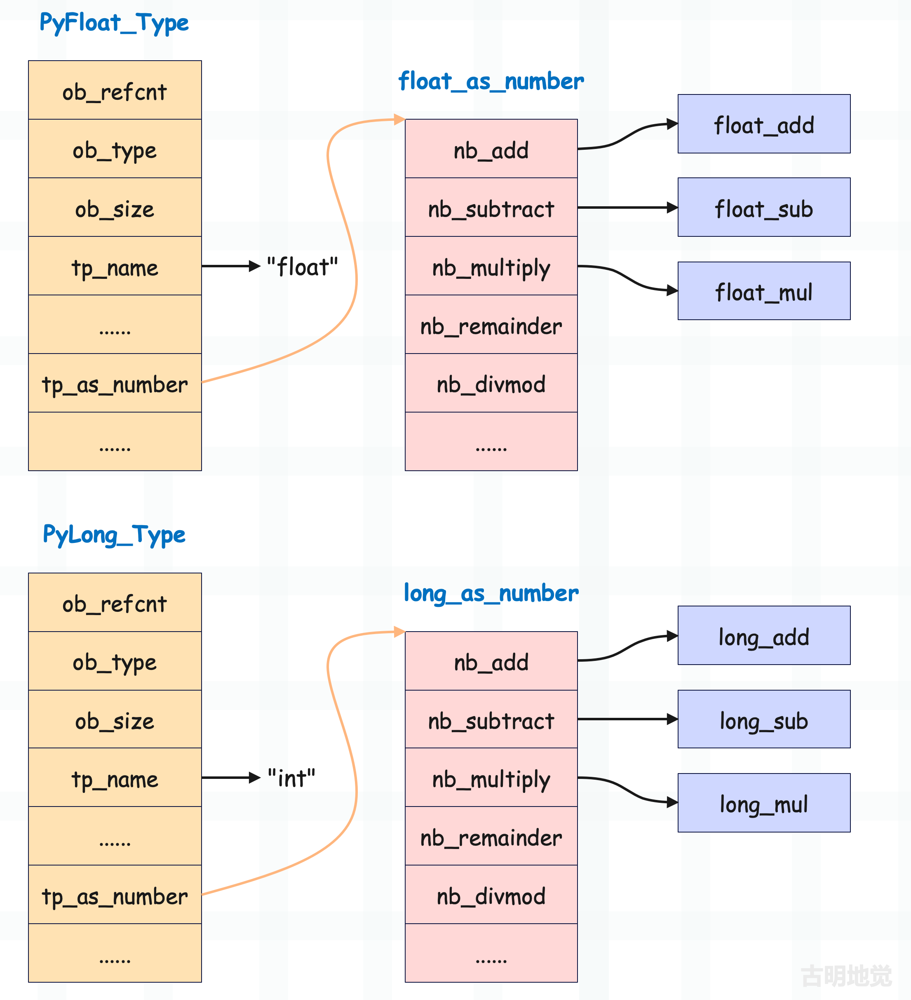
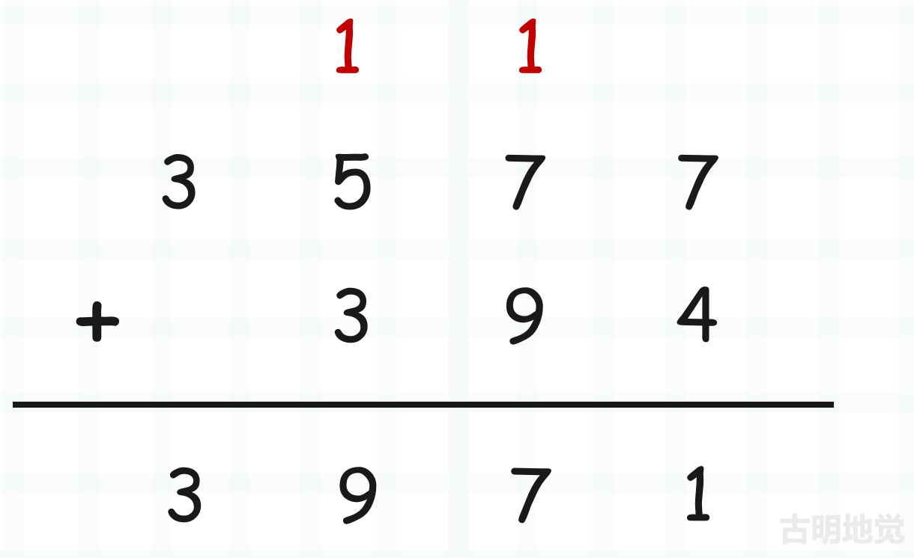
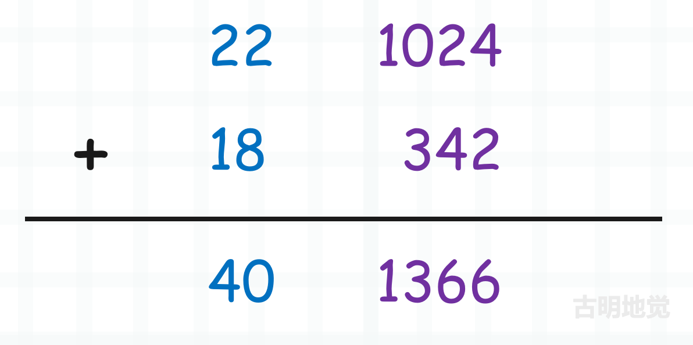

## 楔子

本篇文章来探讨一下整数的加减法是怎么做的，因为整数在底层采用数组进行存储，所以它的加减法就不像浮点数那么简单。

在介绍浮点数的时候说过，对于数值型对象，它的类型一定实现了 tp_as_number 字段，该字段指向了 PyNumberMethods 结构体实例。结构体里面的每个字段都是一个函数指针，对应数值型对象的一个操作。

比如 nb_add 负责加法操作，nb_substract 负责减法操作等等，本篇文章就来探讨一下。首先整数支持的操作非常多，这里我们只探讨加减法。

## 整数加减法的运算原理

整数的加法和减法分别由 long_add 和 long_sub 实现，但运算的核心却不在这两个函数上，它们内部会调用另外两个函数。因为数组保存了整数的绝对值，所以 Python 将整数的运算转成了绝对值运算，而底层有两个函数专门用来做这件事情，分别是 x_add 和 x_sub。

+ x_add(a, b)：计算 a 和 b 的绝对值之和；
+ x_sub(a, b)：计算 a 和 b 的绝对值之差；

所以整数相加就可以这么做，假设两个整数 a 和 b 相加：

+ 如果 a 和 b 均为正数，那么通过 x_add 计算 a 和 b 的绝对值之和即可；
+ 如果 a 和 b 均为负数，那么通过 x_add 计算两者的绝对值之和，然后再取相反数；
+ 如果 a 为负数，b 为正数，那么通过 x_sub 计算 b 和 a 的绝对值之差即可；
+ 如果 a 为正数，b 为负数，那么通过 x_sub 计算 a 和 b 的绝对值之差即可；

而整数相减也是同理，还是整数 a 和 b，两者相减：

+ 如果 a 为正数，b 为负数，那么通过 x_add 计算两者的绝对值之和即可；
+ 如果 a 为负数，b 为正数，那么通过 x_add 计算两者的绝对值之和，然后再取相反数；
+ 如果 a 和 b 均为正数，那么通过 x_sub 计算 a 和 b 的绝对值之差即可；
+ 如果 a 和 b 均为负数，那么通过 x_sub 计算 b 和 a 的绝对值之差即可；

> 相加时，符号相同会调用 x_add、符号不同会调用 x_sub。相减时，符号相同会调用 x_sub、符号不同会调用 x_add。

所以这就是 Python 的设计，因为绝对值的加减法不用考虑符号的影响，实现更为简单，所以 Python 将整数运算转化成整数的绝对值运算。那么下面我们的重心就在 x_add 和 x_sub 上面了，看看它们是如何对大整数绝对值进行运算的。到这里你可能会有疑问，大整数运算这么复杂，效率会差吧。显然这是啃腚的，整数数值越大，整数对象的底层数组就越长，运算开销也就越大。

**但 Python 底层有一个机制叫做快分支，因为通用逻辑能处理所有情况，那么它的效率必然不高。而快分支则是对那些可以简单运算的情况提前进行处理，比如在对 a 和 b 计算加减法的时候，底层会先判断数组的长度是否均小于等于 1，如果是则说明数组中最多只有一个元素。这样的话，就可以直接转成 C 的整数进行运算了，这样性能损耗就可以忽略不计。**

> 关于快分支，需要再单独解释一下。我们举个生活中的例子：好比你去见女朋友，正常情况下，你需要买花，并且精心打扮。但如果女朋友不在生理期，那么这一切都不需要做，只需买杯奶茶就好了。所以先判断女朋友是否在生理期，如果不在，那么只需买杯奶茶就能牵手便属于快分支。快分支具有命中率高等特点，绝大部分都是这个情况，而一旦命中快分支，那么程序便可快速处理。

回到上面的例子，只要整数不超过 2 \*\* 30 - 1，都可以走快分支，显然这可以满足绝大部分场景，因为这个数字已经很大了。至于 x_add 和 x_sub 则属于通用逻辑，而通用也意味着平庸，但如果快分支没有命中，那么就只能走通用逻辑了。

而我们的重点就是要研究 x_add 和 x_sub 的实现，感受大整数运算的魅力。不过在介绍之前，不妨想象一下我们平时将两个整数相加的时候是怎么做的。

从最低位开始进行相加，逢十进一，ob_digit 也是同理。我们可以把数组中的每一个元素看成是一个整体，只不过它不再是逢十进一，而是逢 2 \*\* 30 进一。

~~~python
# 数组的每个元素最大能表示 2 ** 30 - 1
# 把元素整体想象成我们生活中加法的个位、十位、百位...
# 然后对应的位相加，逢 2 ** 30 进一
a = [1024, 22]
b = [342, 18]
c = [1024 + 342, 22 + 18]  # [1366, 40]

print(
    a[0] + a[1] * 2 ** 30
    +
    b[0] + b[1] * 2 ** 30
    ==
    c[0] + c[1] * 2 ** 30
)  # True
~~~

所以仍旧是对应的位进行相加，和我们生活中的加法并无本质上的区别。只不过生活中的加法，每一位能表示 0~9，逢十进一。而 Python 底层的加法，因为整数使用数组存储，那么每一个位能表示 0 ~ 2 \*\* 30 - 1，逢 2 \*\* 30 进一。

把 1024、342 想象成个位，把 22、18 想象成十位，并且此时不再是逢十进一，而是逢 2 \*\* 30 进一。

~~~python
a = [2 ** 30 - 1, 16]
b = [2 ** 30 - 1, 21]
# a[0] + b[0] 超过了 2 ** 30，要进个 1
# 而逢十进一之后，该位要减去十
# 那么逢 2 ** 30 进一之后，显然要减去 2 ** 30
c = [
    a[0] + b[0] - 2 ** 30,
    a[1] + b[1] + 1
]

print(
    a[0] + a[1] * 2 ** 30
    +
    b[0] + b[1] * 2 ** 30
    ==
    c[0] + c[1] * 2 ** 30
)  # True
~~~

然后是绝对值减法，和绝对值加法一样，也可以类比生活中的减法，从低位到高位分别相减。如果某一位相减的时候发现不够了，那么要向高位借一位。比如 27 减去 9，由于 7 比 9 小，因此向 2 借一位变成 17，减去 9，得 8。但 2 被借了一位，所以剩下 1，因此结果为 18。

~~~python
a = [5, 3]
b = [6, 1]
result = []

# 如果计算 a - b，整个过程是怎样的呢？
# 首先是 a[0] - b[0]，由于 a[0] < b[0]
# 所以要借一位，而一个位是 2 ** 30
result.append(a[0] + 2 ** 30 - b[0])
# 然后是 a[1] - b[1]
# 由于 a[1] 被借走了一个位，因此要减 1
result.append(a[1] - 1 - b[1])
print(result)  # [1073741823, 1]

# 验证一下
print(
    (a[0] + a[1] * 2 ** 30)
    -
    (b[0] + b[1] * 2 ** 30)
)  # 2147483647
print(
    result[0] + result[1] * 2 ** 30
)  # 2147483647
~~~

结果没有问题，以上我们就从原理上介绍了大整数的加减法，下面再看一下源码实现。

## 整数加减法源码实现

当整数相加时会执行 long_add 函数，看一下它的具体实现。

~~~c
// Objects/longobject.c
static PyObject *
long_add(PyLongObject *a, PyLongObject *b)
{
    PyLongObject *z;  // 指向运算后的整数
    CHECK_BINOP(a, b);  // 确保 a 和 b 都指向整数
    
    // 如果两个整数的 ob_digit 数组最多只有一个元素
    // 那么取出来判断正负之后，直接进行运算即可
    // 由于 2 ** 30 - 1 已经很大了，所以绝大部分场景，都会执行此分支
    if (Py_ABS(Py_SIZE(a)) <= 1 && Py_ABS(Py_SIZE(b)) <= 1) {
        // MEDIUM_VALUE 是一个宏，接收一个 abs(ob_size) <= 1 的 PyLongObject *
        // 如果 ob_size 等于 0, 那么返回 0
        // 如果 ob_size 等于 1, 那么返回 ob_digit[0]
        // 如果 ob_size 等于 -1, 那么返回 -ob_digit[0]        
        // 所以计算出 MEDIUM_VALUE(a) + MEDIUM_VALUE(b) 之后
        // 将结果转成 PyLongObject，然后返回其泛型指针即可
        // 因此当数组中元素个数不超过 1 的时候，显然是可以直接相加的
        return PyLong_FromLong(MEDIUM_VALUE(a) + MEDIUM_VALUE(b));
    }
    // 否则走通用分支
    if (Py_SIZE(a) < 0) {
        // 如果 a 是负数、b 是负数，那么先计算 |a| + |b|
        if (Py_SIZE(b) < 0) {
            z = x_add(a, b);
            if (z != NULL) {
                // 然后对 z 取相反数
                assert(Py_REFCNT(z) == 1);
                Py_SIZE(z) = -(Py_SIZE(z));
            }
        }
        // 如果 a 是负数、b 是正数，那么计算 |b| - |a|      
        else
            z = x_sub(b, a);
    }
    else {
        // 如果 a 是正数、b 是负数，那么计算 |a| - |b|
        if (Py_SIZE(b) < 0)
            z = x_sub(a, b);
        // 如果 a 是正数、b 是正数，那么计算 |a| + |b|      
        else
            z = x_add(a, b);
    }
    return (PyObject *)z;
}
~~~

因此 long_add 函数并不长，但是调用了 x_add 和 x_sub，显然核心逻辑是在这两个函数里面。至于 long_add 函数，它的逻辑如下：

+ 判断两个整数底层对应的数组的长度是否均小于等于 1，如果是的话那么通过宏 MEDIUM_VALUE 直接将其转成 C 的一个 digit，当然符号也会考虑在内。然后直接相加、返回即可。显然这里走的是快分支，或者说快速通道。
+ 但如果其中一方的数组长度（ob_size）大于 1，那么判断两者的符号。如果都为负数，那么通过 x_add 计算两者的绝对值之和，然后取相反数。
+ 如果 a 为负数，b 为正数，那么通过 x_sub 计算 b 和 a 的绝对值之差即可；
+ 如果 a 为正数，b 为负数，那么通过 x_sub 计算 a 和 b 的绝对值之差即可；
+ 如果都为正数，那么通过 x_add 计算 a 和 b 的绝对值之和即可；

所以 Python 整数设计的非常巧妙，ob_digit 虽然用来维护具体数值，但它并没有考虑正负，整数的正负是通过 ob_size 来表示的。通过将运算变成绝对值运算，实现起来会方便很多。

说完了 long_add，再来看看 long_sub，这两者是类似的。

~~~C
// Objects/longobject.c
static PyObject *
long_sub(PyLongObject *a, PyLongObject *b)
{
    PyLongObject *z;  // 指向运算后的整数
    CHECK_BINOP(a, b);  // 确保 a 和 b 都指向整数
    
    // 如果两个整数的 ob_digit 数组最多只有一个元素
    // 那么取出来判断正负之后，直接进行运算即可
    if (Py_ABS(Py_SIZE(a)) <= 1 && Py_ABS(Py_SIZE(b)) <= 1) {
        return PyLong_FromLong(MEDIUM_VALUE(a) - MEDIUM_VALUE(b));
    }
    // 否则走通用分支    
    if (Py_SIZE(a) < 0) {
        // 如果 a 是负数、b 是负数，那么先计算 |a| - |b|
        if (Py_SIZE(b) < 0)
            z = x_sub(a, b);
        // 如果 a 是负数、b 是正数，那么先计算 |a| + |b|
        else
            z = x_add(a, b);
        // 然后对 z 取相反数
        if (z != NULL) {
            assert(Py_SIZE(z) == 0 || Py_REFCNT(z) == 1);
            Py_SIZE(z) = -(Py_SIZE(z));
        }
    }
    else {
        // 如果 a 是正数、b 是负数，那么计算 |a| + |b|
        if (Py_SIZE(b) < 0)
            z = x_add(a, b);
        // 如果 a 是正数、b 是正数，那么计算 |a| - |b|
        else
            z = x_sub(a, b);
    }
    return (PyObject *)z;
}
~~~

所以 long_add 和 long_sub 的代码是类似的，它们将整数的运算转成了整数的绝对值运算，所以关键要理解什么时候用 x_add，什么时候用 x_sub。

**a + b**

+ 如果 a 是正数，b 是正数，调用 x_add(a, b)，计算 |a| + |b|；
+ 如果 a 是负数、b 是负数，调用 x_add(a, b)，计算 |a| + |b|，然后再取反；
+ 如果 a 是正数、b 是负数，调用 x_sub(a, b)，计算 |a| - |b|；
+ 如果 a 是负数、b 是正数，调用 x_sub(b, a)，计算 |b| - |a|；

所以相加时，符号相同会调用 x_add、符号不同会调用 x_sub。

**a - b**

+ 如果 a 是正数、b 是负数，调用 x_add(a, b)，计算 |a| + |b|；
+ 如果 a 是负数、b 是正数，调用 x_add(a, b)，计算 |a| + |b|，然后再取反；
+ 如果 a 是正数，b 是正数，调用 x_sub(a, b)，计算 |a| - |b|；
+ 如果 a 是负数，b 是负数，调用 x_sub(b, a)，计算 |b| - |a|。当然在源码中调用的是 x_sub(a, b)，计算 |a| - |b|，然后再取相反数；

所以相减时，符号相同会调用 x_sub、符号不同会调用 x_add。

接下来我们的重点就是绝对值加法和绝对值减法的具体实现细节。

## 绝对值加法

函数 x_add 负责绝对值加法，但是介绍之前，需要先了解几个宏，它们在 x_add 中会有体现。

~~~C
// Include/longintrepr.h
#define PyLong_SHIFT    30
#define PyLong_BASE     ((digit)1 << PyLong_SHIFT)
#define PyLong_MASK     ((digit)(PyLong_BASE - 1))
~~~

显然 PyLong_BASE 等于 2 \*\* 30，PyLong_MASK等于 2 \*\* 30 - 1（说明 32 个位，前两个位是 0，后三十个位都是 1）。

然后我们可以看 x_add 的具体实现了。

~~~C
// Objects/longobject.c

static PyLongObject *
x_add(PyLongObject *a, PyLongObject *b)
{
    // 参数 a 和 b 指向了两个要相加的整数对象
    // 获取整数在底层的 ob_size
    Py_ssize_t size_a = Py_ABS(Py_SIZE(a)), size_b = Py_ABS(Py_SIZE(b));
    // 指向两个整数的相加结果
    PyLongObject *z;
    // 循环变量
    Py_ssize_t i;
    // 每个部分的运算结果
    digit carry = 0;
    
    // 如果 size_a 小于 size_b，说明 |a| < |b|
    // 那么将两个整数交换位置，确保操作符左边的数大于右边的数
    // 这么做也符合人类习惯，可以想象一下小学时候的加法计算
    // 如果一个位数多，一个位数少，也会习惯的将位数多的放在左边
    if (size_a < size_b) {
        { PyLongObject *temp = a; a = b; b = temp; }
        { Py_ssize_t size_temp = size_a;
            size_a = size_b;
            size_b = size_temp; }
    }
    // 申请一个 ob_digit 的长度为 size_a + 1 的 PyLongObject
    // 但为什么是 size_a + 1 呢? 由于上面的 if 语句，使得 size_a 一定不小于 size_b
    // 那么 a 和 b 相加之后的 z 的 ob_size 一定不小于 size_a
    // 但是也可能比 size_a 多 1，比如: a = 2 ** 60 - 1, b = 1
    // 那么相加之后结果为 2 ** 60，于是 ob_size 就变成了 3
    // 因此在创建 z 的时候，ob_digit 的容量会等于 size_a + 1
    z = _PyLong_New(size_a+1);
    
    // 正常情况下, z 是一个 PyLongObject *，但如果 z == NULL, 表示分配失败（程序崩溃）
    // 但说实话, 除非你内存不够了, 否则这种情况不会发生
    if (z == NULL)
        return NULL;
    
    // 重点来了，因为 size_a > size_b，所以会以 size_b 为准，两者从低位向高位依次对应相加
    // 当 b 到头了，再单独算 a 的剩余部分;
    // 因此以 i < size_b 作为条件
    for (i = 0; i < size_b; ++i) {
        // 将 a->ob_digit[i] + b->ob_digit[i] 作为 carry
        // 显然 carry 如果没有超过 2 ** 30 - 1 的话
        // 那么它就是 z -> ob_digit[i] 的值
        carry += a->ob_digit[i] + b->ob_digit[i];
        // 但 carry 是可能溢出的，当溢出时，应该要减去 2 ** 30，所以还要判断是否产生了进位
        // 但解释器没有使用常规的判断，而是选择了效率更高的位运算（carry & PyLong_MASK
        // 由于 PyLong_MASK 等于 (1 << 30) - 1，所以它的前两个位是 0，后面三十个位全是 1
        // 因此当 carry 不超过 2 ** 30 - 1 时，carry & PyLong_MASK 就等于 carry
        // 当 carry 超过 2 ** 30 - 1 时，carry & PyLong_MASK 就等于 carry - 2 ** 30
        z->ob_digit[i] = carry & PyLong_MASK;
        // 然后当 carry 产生进位时，显然不可以丢，它们要作用在数组中下一个元素相加的结果上
        // 所以这里将 carry 右移 30 位，也就是产生的进位，然后重新赋值给 carry，并作用在下一轮循环中
        // 如果没有产生进位，那么 carry 为 0，如果产生了进位，那么 carry 为 1
        carry >>= PyLong_SHIFT;
    }
    
    // 如果 b 到头了, 那么继续从当前的 i 开始遍历，直到 i == size_a, 逻辑还是和上面一样
    for (; i < size_a; ++i) {
        // 此时只需要加上 a->ob_digit[i] 即可，因为 b 到头了
        carry += a->ob_digit[i];
        // 这里也要按位与 PyLong_MASK, 因为也可能存在进位的情况
        // 拿生活中的 99999 + 1 为例，此时 a = 99999, b = 1，显然第一次循环 b 就到头了
        // 但后面单独循环 a 的时候, 依旧会产生进位，所以这里也是同理
        z->ob_digit[i] = carry & PyLong_MASK;
        // carry 右移 30 位得到进位，然后重新赋值给 carry
        carry >>= PyLong_SHIFT;
    }
    // 两个循环结束之后, 其实还差一步，还拿 99999 + 1 举例子
    // 按照顺序相加得到的是 00000，因为最后还进了一个 1，这里的 carry 也是同理
    // 因此 z 的 ob_size 要比 size_a 多 1, 目的就在于此
    // 所以要将 z->ob_digit 的最后一个元素设置成 carry
    z->ob_digit[i] = carry;
    // 但如果最后的 carry 没有进位的话, 显然其结果就是 0
    // 所以最后没有直接返回 z, 而是返回了 long_normalize(z)
    // 这个 long_normalize 函数的作用是从后往前依次检查 ob_digit 的元素
    // 如果为 0, 那么就将其 ob_size 减去 1, 直到出现一个不为 0 的元素
    // 比如 ob_digit 为 [0, 3, 1, 0, 0, 0]，长度为 6，但规范化之后的数组长度显然是 3
    // 当然对于我们当前来说, 显然最多只会检查一次，因为它的 ob_size 只比 size_a 多 1
    // 所以判断数组最后一个元素是否为 0 即可，如果为 0 则说明没有产生进位
    return long_normalize(z);
}
~~~

整数在底层实现的很巧妙，不理解的话可以多看几遍，然后我们在 Python 的层面上再反推一下，进一步感受底层的运算过程。

~~~Python
# 假设有 a 和 b 两个整数
# 当然这里是使用列表直接模拟的底层数组 ob_digit
a = [1073741744, 999, 765, 123341]
b = [841, 1073741633, 2332]
# 然后创建 z, 表示 a 和 b 的相加结果
z = []

# 为了更直观, 我们一步步手动相加
# 首先是将 a[0] + b[0], 得到 carry
carry = a[0] + b[0]
# 但 carry 可能大于 2 ** 30 - 1，所以要进行判断
# 如果大于，那么要减去 2 ** 30，否则保持不变
# 而我们说这一步可以使用位运算来实现，将 carry 与上 (2 ** 30 - 1) 即可
print(carry & (2 ** 30 - 1))  # 761
# 结果是 761，说明 carry 比 2 ** 30 -1 大
# 然后 z 的第一个元素就是 761
z.append(761)

# 然后计算 a[1] + b[1] 得到新的 carry
# 但是之前的 carry 大于 2 ** 30 - 1，所以还要再加上 carry >> 30，即进位
carry = (carry >> 30) + a[1] + b[1]
# 然后 carry & (2 ** 30 - 1) 得到 809，说明 carry 依旧大于 2 ** 30 - 1
print(carry & (2 ** 30 - 1))  # 809
# 然后 z 的第二个元素就是 809
z.append(809)

# 计算 a[2] + b[2] 的时候也是同理
carry = (carry >> 30) + a[2] + b[2]
# 但显然此时的 carry 已经不大于 2 ** 30 - 1 了
print(carry & (2 ** 30 - 1))  # 3098
# 说明 z 的第三个元素是 3098
z.append(3098)

# 此时 b 到头了，所以直接将 a[3] 作为 carry
# 当然还要判断上一步的 carry 是否大于 2 ** 30 - 1
# 所以还是右移 30 位，当不大于 2 ** 30 - 1 时，carry >> 30 就是 0
carry = (carry >> 30) + a[3]
print(carry & (2 ** 30 - 1))  # 123341
z.append(123341)

# 此时 a 也遍历完毕，但是不要忘记再对 carry 进行判断
# 如果大于  2** 30 - 1，那么会产生进位，所以 z 还要再 append 一个 1
# 当然这里 carry 没有超过 2 ** 30 - 1

# 此时 z 为 [761, 809, 3098, 123341]
print(z)  # [761, 809, 3098, 123341]

# 因此 ob_digit 为 [1073741744, 999, 765, 123341]
# 和 ob_digit 为 [841, 1073741633, 2332] 的两个 PyLongObject 相加
# 得到的新的 PyLongObject 的 ob_digit 为 [761, 809, 3098, 123341]
print(
    a[0] + a[1] * 2 ** 30 + a[2] * 2 ** 60 + a[3] * 2 ** 90
    +
    b[0] + b[1] * 2 ** 30 + b[2] * 2 ** 60
    ==
    z[0] + z[1] * 2 ** 30 + z[2] * 2 ** 60 + z[3] * 2 ** 90
)  # True
~~~

以上就是绝对值加法，我们从源码的角度和Python代码的角度分别解释了一遍。看完了绝对值加法，再来看看绝对值减法。

## 绝对值减法：x_sub

和绝对值加法一样，绝对值减法也可以类比生活中的减法，从低位到高位分别相减。如果某一位相减的时候发现不够了，那么要向高位借一位。比如 27 减去 9，7 比 9 小，因此向 2 借一位变成 17，减去 9，得 8。但 2 被借了一位，所以剩下 1，因此结果为 17。

~~~C
// Objects/longobject.c

static PyLongObject *
x_sub(PyLongObject *a, PyLongObject *b)
{   
    // 依旧是获取两者的 ob_size 的绝对值
    Py_ssize_t size_a = Py_ABS(Py_SIZE(a)), size_b = Py_ABS(Py_SIZE(b));
    // z 指向相加之后的 PyLongObject
    PyLongObject *z;
    // 循环变量
    Py_ssize_t i;
    // 如果 size_a 小于 size_b, 那么 sign 就是 -1, 否则就是 1
    int sign = 1;
    // 之前 carry 保存相加的结果，这里的 borrow 保存相减的结果
    // 名字很形象, 相加要进位叫 carry、相减要借位叫 borrow
    digit borrow = 0;

    // 接下来依旧要判断两个整数的大小，确保相减的时候，绝对值大的一方在左边
    // 相加的时候，大的一方在左边还是在右边，其实没太大影响
    // 而相减的时候如果大的一方在左边，显然会省事很多
    // 所以如果 size_a 比 size_b 小，说明 a 的绝对值比 b 小
    if (size_a < size_b) {
        // 那么令 sign = -1，因为 a 和 b 交换了位置，所以后续相减之后还要再乘上 sign
        // 因为计算的是绝对值之差，符号是在绝对值之差计算完毕之后通过 sign 判断的
        sign = -1;
        // 交换 a 和 b 的位置
        { PyLongObject *temp = a; a = b; b = temp; }
        { Py_ssize_t size_temp = size_a;
            size_a = size_b;
            size_b = size_temp; }
    }
    // 如果 size_a == size b，那么需要依次比较 ob_digit 里的元素，才能判断出大小
    else if (size_a == size_b) {
        // 所以从 ob_digit 的尾部开始遍历
        i = size_a;
        while (--i >= 0 && a->ob_digit[i] == b->ob_digit[i])
            ;
        // 如果都相等，那么 i 会等于 -1，相减的结果为 0，此时直接返回 0 即可
        // 所以这一步也是为了能够快速返回结果，而额外做的一层判断
        if (i < 0)
            return (PyLongObject *)PyLong_FromLong(0);
        // 但如果某个对应的元素不相等，那么只需判断这两者谁大谁小即可
        // 假设 a 的 ob_digit 是 [2, 3, 4, 5]，b 的 ob_digit 是 [1, 2, 4, 5]
        // 那么上面的 while 循环结束之后，i 会等于 1，显然只需要判断索引为 1 时，对应的值谁大谁小即可
        if (a->ob_digit[i] < b->ob_digit[i]) {
            // 如果 a->ob_digit[i] < b->ob_digit[i]，同样说明 a 小于 b
            // 因此将 sign 设置为 -1, 然后交换 a 和 b 的位置
            sign = -1;
            { PyLongObject *temp = a; a = b; b = temp; }
        }
        // 因为高位在减法的时候会被抵消掉，所以 size_a 和 size_b 直接设置成 i + 1 即可
        // 假设两个整数的 ob_digit 分别是 [2, 3, 4, 5] 和 [1, 2, 4, 5]
        // 因为后两个元素是一样的，所以后续只需要对索引为 [0: i+1] 的部分做差即可
        size_a = size_b = i+1;
    }
    // a 和 b 相减之后，结果一定不超过 a，因此 ob_digit 的长度一定小于等于 size_a
    z = _PyLong_New(size_a);
    if (z == NULL)
        return NULL;
    // 然后下面的逻辑和 x_add 是类似的
    for (i = 0; i < size_b; ++i) {
        /* The following assumes unsigned arithmetic
           works module 2**N for some N>PyLong_SHIFT. */
        borrow = a->ob_digit[i] - b->ob_digit[i] - borrow;
        z->ob_digit[i] = borrow & PyLong_MASK;
        borrow >>= PyLong_SHIFT;
        borrow &= 1; /* Keep only one sign bit */
    }
    for (; i < size_a; ++i) {
        borrow = a->ob_digit[i] - borrow;
        z->ob_digit[i] = borrow & PyLong_MASK;
        borrow >>= PyLong_SHIFT;
        borrow &= 1; /* Keep only one sign bit */
    }
    assert(borrow == 0);
    if (sign < 0) {
        Py_SIZE(z) = -Py_SIZE(z);
    }
    return long_normalize(z);
}
~~~

