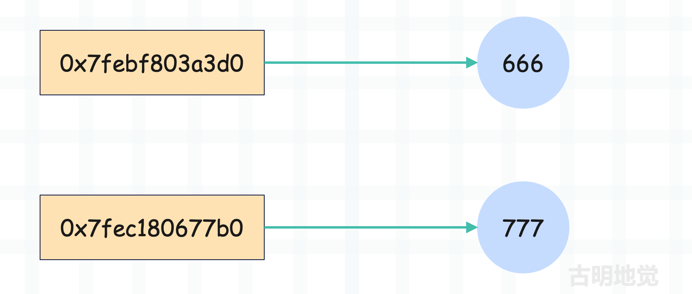

## Python 中一切皆对象

在学习 Python 的时候，你肯定听过这么一句话：<font color="darkblue">Python 中一切皆对象</font>。没错，在 Python 世界里，一切都是对象。整数是一个对象、字符串是一个对象、字典是一个对象，甚至 int, str, list 以及我们使用 class 关键字自定义的类，它们也是对象。

像 int, str, list 等基本类型，以及自定义的类，由于它们可以表示类型，因此我们称之为<font color="darkblue">类型对象</font>；类型对象实例化得到的对象，我们称之为<font color="darkblue">实例对象</font>。但不管是哪种对象，它们都属于对象。因此 Python 将面向对象理念贯彻的非常彻底，面向对象中的类和对象在 Python 中都是通过对象实现的。

在面向对象理论中，存在着<font color="darkblue">类</font>和<font color="darkblue">对象</font>两个概念，像 int、dict、tuple、以及使用 class 关键字自定义的类型对象实现了面向对象理论中<font color="darkblue">类</font>的概念，而 123、3.14、"string" 等实例对象则实现了面向对象理论中<font color="darkblue">对象</font>的概念。但在 Python 里面，面向对象中的类和对象都是通过对象实现的。

我们举个例子：

~~~Python
# dict 是一个类，因此它属于类型对象
# 类型对象实例化得到的对象属于实例对象
print(dict)
"""
<class 'dict'>
"""
print(dict(a=1, b=2))
"""
{'a': 1, 'b': 2}
"""
~~~

因此可以用一张图来描述面向对象在 Python 中的体现。


而如果想查看一个对象的类型，可以使用 type，或者通过对象的 \_\_class\_\_ 属性。

~~~python
data = [1, 2, 3]
# 查看类型
print(type(data))
"""
<class 'list'>
"""
print(data.__class__)
"""
<class 'list'>
"""
~~~

如果想判断一个对象是不是指定类型的实例对象，可以使用 isinstance。

~~~Python
data = [1, 2, 3]
# 判断是不是指定类型的实例对象
print(isinstance(data, list))
"""
True
"""
~~~

但是问题来了，按照面向对象的理论来说，对象是由类实例化得到的，这在 Python 中也是适用的。既然是对象，那么就必定有一个类来实例化它，换句话说对象一定要有类型。至于一个对象的类型是什么，就看这个对象是被谁实例化的，被谁实例化，那么类型就是谁，比如列表的类型是 list，字典的类型是 dict 等等。

而 Python 中一切皆对象，所以像 int, str, tuple 这些内置的类对象也是具有相应的类型的，那么它们的类型又是谁呢？使用 type 查看一下就知道了。

~~~Python
print(type(int))  # <class 'type'>
print(type(str))  # <class 'type'>
print(type(dict))  # <class 'type'>
print(type(type))  # <class 'type'>
~~~

我们看到类型对象的类型，无一例外都是 type。而 type 我们也称其为<font color="red">元类</font>，表示类型对象的类型。至于 type 本身，它的类型还是 type，所以它连自己都没放过，把自己都变成自己的对象了。

因此在 Python 中，你能看到的任何对象都是有类型的，可以使用 type 查看，也可以获取该对象的 \_\_class\_\_ 属性查看。所以：实例对象、类型对象、元类，Python 中任何一个对象都逃不过这三种身份。

到这里可能有人会发现一个有意思的点，我们说 int 是一个类对象，这显然是没有问题的。因为站在整数（比如 123）的角度上，int 是一个不折不扣的类对象；但如果站在 type 的角度上呢？显然我们又可以将 int 理解为实例对象，因此 class 具有二象性。

至于 type 也是同理，虽然它是元类，但本质上也是一个类对象。

> 注：不仅 type 是元类，那些继承了 type 的类也可以叫做元类。

然后 Python 中还有一个关键的类型（对象），叫做 object，它是所有类型对象的基类。不管是什么类，内置的类也好，我们自定义的类也罢，它们都继承自 object。因此 object 是所有类型对象的基类、或者说父类。

那如果我们想获取一个类都继承了哪些基类，该怎么做呢？方式有三种：

~~~python
class A: pass

class B: pass

class C(A): pass

class D(B, C): pass

# 首先 D 继承自 B 和 C, C 又继承 A
# 我们现在要来查看 D 继承的父类

# 方法一: 使用 __base__
print(D.__base__)  
"""
<class '__main__.B'>
"""

# 方法二: 使用 __bases__
print(D.__bases__)  
"""
(<class '__main__.B'>, <class '__main__.C'>)
"""

# 方法三: 使用 __mro__
print(D.__mro__)
"""
(<class '__main__.D'>, <class '__main__.B'>, 
 <class '__main__.C'>, <class '__main__.A'>, 
 <class 'object'>)
"""
~~~

- \_\_base\_\_：如果继承了多个类，那么只显示继承的第一个类，没有显式继承则返回 <font color="blue">\<class 'object'\></font>
- \_\_bases\_\_：返回一个元组，会显示所有直接继承的父类，没有显式继承则返回 <font color="blue">(\<class 'object'\>,)</font>
- \_\_mro\_\_: mro（Method Resolution Order）表示方法查找顺序，会从自身出发，找到最顶层的父类。因此返回自身、继承的基类、以及基类继承的基类，一直找到 object

而如果想查看某个类型是不是另一个类型的子类，可以通过 issubclass。

~~~python
print(issubclass(str, object))
"""
True
"""
~~~

因此，我们可以得出以下两个结论：

- type 站在类型金字塔的最顶端，任何一个对象按照类型追根溯源，最终得到的都是 type；
- object 站在继承金字塔的最顶端，任何一个类型对象按照继承关系追根溯源，最终得到的都是 object；

但要注意的是，我们说 type 的类型还是 type，但 object 的基类则不再是 object，而是 None。

~~~python
print(type.__class__)  # <class 'type'>

# 注：以下打印结果容易让人产生误解
# 它表达的含义是 object 的基类为空
# 而不是说 object 继承 None
print(object.__base__)  # None
~~~

但为什么 object 的基类是 None，而不是它自身呢？其实答案很简单，Python 在查找属性或方法的时候，自身如果没有的话，会按照 \_\_mro\_\_ 指定的顺序去基类中查找。所以继承链一定会有一个终点，否则就会像没有出口的递归一样出现死循环了。

我们用一张图将对象之间的关系总结一下：


- 实例对象的类型是类型对象，类型对象的类型是元类；
- 所有类型对象的基类都收敛于 object；
- 所有对象的类型都收敛于 type；

因此 Python 算是将<font color="blue">**一切皆对象**</font>的理念贯彻到了极致，也正因为如此，Python 才具有如此优秀的动态特性。

但是还没结束，我们再重新审视一下上面那张图，会发现里面有两个箭头看起来非常的奇怪。object 的类型是 type，type 又继承了 object。

~~~python
print(type.__base__)  # <class 'object'>
print(object.__class__)  # <class 'type'>
~~~

因为 type 是所有类的元类，而 object 是所有类的基类，这就说明 type 要继承自 object，而 object 的类型是 type。很多人都会对这一点感到奇怪，这难道不是一个先有鸡还是先有蛋的问题吗？答案不是的，这两个对象是共存的，它们之间的定义是互相依赖的。而具体是怎么一回事，我们后续分析。

## 变量其实是指针

Python 的变量只是一个名字，如果站在 C 语言的角度来看，那么就是一个指针。所以 Python 的变量保存的其实是对象的内存地址，或者说指针，而<font color="blue">指针指向的内存</font>存储的才是对象。

所以在 Python 中，我们都说变量指向了某个对象。在其它静态语言中，变量相当于是为某块内存起的别名，获取变量等于获取这块内存所存储的值。而 Python 中变量代表的内存所存储的不是对象，而是对象的指针（或者说引用）。

我们举例说明，看一段 C 代码。

```C
#include <stdio.h>

void main()
{
    int a = 666;
    printf("address of a = %p\n", &a);

    a = 667;
    printf("address of a = %p\n", &a);
}
```

编译执行一下：


赋值前后地址都是 0x7fff9eda521c，没有变化，再来看一段 Python 代码。

~~~python
a = 666
print(hex(id(a)))  # 0x7febf803a3d0

a = 667
print(hex(id(a)))  # 0x7fec180677b0
~~~

我们看到 Python 里面输出的地址发生了变化，下面分析一下原因。

首先在 C 中，创建一个变量的时候必须规定好类型，比如 <font color="blue">int a = 666</font>，那么变量 a 就是 int 类型，以后在所处的作用域中就不可以变了。如果这时候再设置 <font color="blue">a = 777</font>，那么等于是把内存中存储的 666 换成 777，a 的地址和类型是不会变化的。

而在 Python 中，<font color="blue">a = 666</font> 等于是先开辟一块内存，存储的值为 666，然后让变量 a 指向这片内存，或者说让变量 a 保存这块内存的地址。然后 <font color="blue">a = 777</font> 的时候，再开辟一块内存，然后让 a 指向存储 777 的内存，由于是两块不同的内存，所以它们的地址是不一样的。



所以 Python 的变量只是一个和对象关联的名字，它代表的是对象的指针。换句话说 Python 的变量就是个便利贴，可以贴在任何对象上，一旦贴上去了，就代表这个对象被引用了。

## 值传递？引用传递？

再来看看变量之间的传递，在 Python 中是如何体现的。

~~~python
a = 666
print(hex(id(a)))  # 0x1f4e8ca7fb0

b = a
print(hex(id(b)))  # 0x1f4e8ca7fb0
~~~

我们看到打印的地址是一样的，再用一张图解释一下。


<font color="blue">a = 666</font> 的时候，先开辟一份内存，再让 a 存储对应内存的地址；然后 <font color="blue">b = a</font> 的时候，会把 a 拷贝一份给 b，所以 b 和 a 存储了相同的地址，它们都指向了同一个对象。

因此说 Python 是值传递、或者引用传递都是不准确的，准确的说 Python 是<font color="red">变量的值传递，对象的引用传递</font>。因为 Python 的变量可以认为是 C 的一个指针，在 <font color="blue">b = a</font> 的时候，等于把 a 指向的对象的地址（a 本身）拷贝一份给 b，所以对于变量来说是值传递；然后 a 和 b 又都是指向对象的指针，因此对于对象来说是引用传递。

**在这个过程中，对象没有重复创建，它只是多了一个引用。**

另外还有最关键的一点，Python 的变量是一个指针，当传递变量的时候，传递的是指针；但是在操作变量的时候，会操作变量指向的内存。所以 <font color="blue">id(a)</font> 获取的不是 a 的地址，而是 a 指向的内存的地址（在底层其实就是 a 本身）；同理 b = a，是将 a 本身，或者说将 a 存储的、指向某个具体的对象的地址传递给了 b。

另外在 C 的层面，显然 a 和 b 属于指针变量，那么 a 和 b 有没有地址呢？显然是有的，只不过在 Python 中是获取不到的，解释器只允许获取对象的地址。

我们再举个函数的例子：

~~~python
def some_func(num):
    print("address of local num", hex(id(num)))
    num = 667
    print("address of local num", hex(id(num)))

num = 666
print("address of global num", hex(id(num)))
some_func(num)
"""
address of global num 0x2356cd698d0
address of local num 0x2356cd698d0
address of local num 0x2356c457f90
"""
~~~

函数的参数也是一个变量，所以 some_func(num) 其实就是把全局变量 num 存储的对象的地址拷贝一份给局部变量 num，所以两个 num 指向了同一个对象，打印的地址相同。然后函数内部又执行了 num = 667，相当于让局部变量指向新的对象，或者说保存新对象的地址，因此打印的结果发生变化。

## 变量有类型吗？

当提到类型时，这个类型指的是变量的类型还是对象的类型呢？不用想，肯定是对象的类型。因为 Python 的变量是个指针，操作指针会自动操作它指向的内存，所以使用 type(a) 查看的其实是变量 a 指向的对象的类型。

那么问题来了，我们在创建变量的时候，并没有显式地指定类型啊，那么解释器是如何判断一个变量指向什么类型的数据呢？答案是：解释器是通过靠猜的方式，通过赋的值（或者说变量引用的值）来推断类型。

因此在 Python 中，如果你想创建一个变量，那么必须在创建变量的时候同时赋值，否则解释器就不知道这个变量指向的数据是什么类型。所以 Python 是先创建相应的值，这个值在 C 中对应一个结构体，结构体里面有一个字段专门用来记录该值对应的类型，<font color="red">因此在 Python 中，类型是和对象绑定的，而不是和变量</font>。当创建完值之后，再让这个变量指向它，所以 Python 中是先有值后有变量。

但在 C 里面显然不是这样的，因为 C 的变量代表的内存所存储的就是具体的值，所以在 C 里面可以直接声明一个变量的同时不赋值。因为 C 要求声明变量时必须指定类型，所以变量声明之后，其类型和内存大小就已经固定了。

而 Python 的变量存的是个地址，它只是指向了某个对象，所以由于其便利贴的特性，可以贴在任意对象上面。但是不管贴在哪个对象，都必须先有对象才可以，不然变量贴谁去。

> 另外，尽管 Python 在创建变量的时候不需要指定类型，但 Python 是强类型语言，而且是动态强类型。

## 小结

以上我们就聊了聊 Python 的变量和对象，核心就在于：变量保存的不是对象本身，而是对象的内存地址，站在 C 的角度上看变量就是一个指针。

尽管 Python 一切皆对象，但你拿到的都是对象的指针，变量是一个指针，函数是一个指针，元组、列表、字典里面存储的还是指针。我们可以想象一下列表，它底层是基于数组实现的，由于 C 数组要求里面每个元素的类型和大小都相同，因此从这个角度上讲，列表内部存储的只能是指针。

-----

&nbsp;

**欢迎大家关注我的公众号：古明地觉的编程教室。**


**如果觉得文章对你有所帮助，也可以请作者吃个馒头，Thanks♪(･ω･)ﾉ。**


