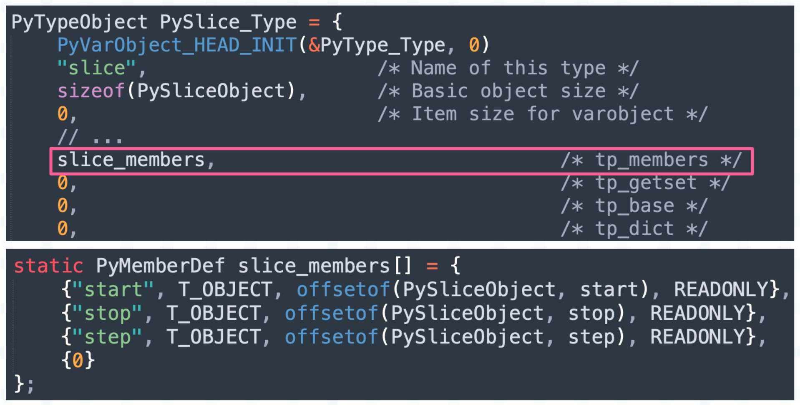
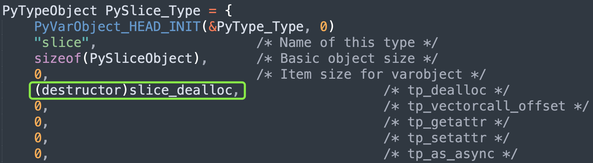
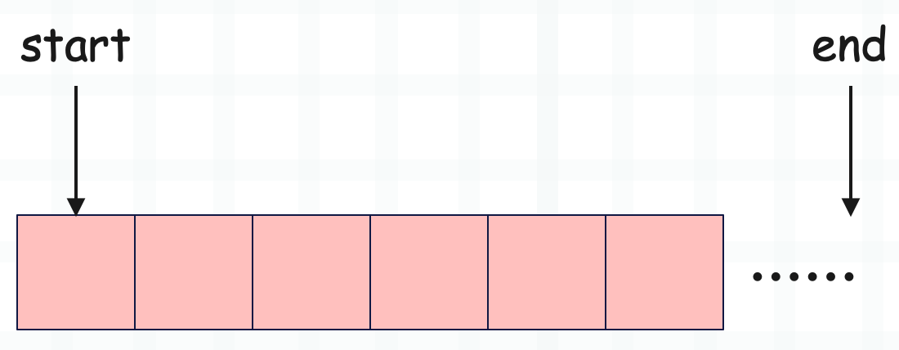
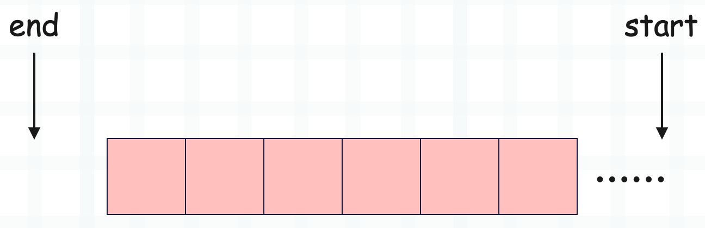
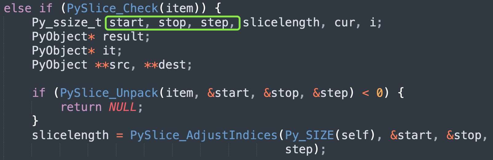

## 楔子

本篇文章来探讨一下切片是如何实现的，因为在操作字符串、元组、列表等数据结构时，我们经常会使用切片截取数据，所以对切片做一个全方位的了解是很有必要的。

~~~Python
data = list(range(10))
print(data[1: 8: 3])  # [1, 4, 7]
~~~

以上就是基于切片截取数据，在工作中我们会大量使用切片。但你知道吗，其实切片也是一个对象，类型为 slice，下面我们来看一下切片的底层结构。

## 切片的底层结构

切片的类型是 slice，那么根据解释器的 API 命名规则，我们猜测：

+ 切片（slice 对象）在底层对应 PySliceObject 结构体实例；
+ slice 类型本身在底层对应 PySlice_Type；

下面看一下具体实现。

~~~C
// Include/sliceobject.h
typedef struct {
    PyObject_HEAD
    PyObject *start, *stop, *step;
} PySliceObject;
~~~

切片是不可变对象，除了对象的公共头部之外，还有三个字段，分别表示切片的起始位置、终止位置、步长。这也意味着创建切片时，可以给 slice 传递三个参数。

~~~Python
# 创建一个切片
s = slice(1, 8, 3)
print(s)  # slice(1, 8, 3)
~~~

问题来了，切片创建的时候，传递的参数绑定在了哪些属性上呢？前面我们说过，实例对象可以绑定哪些属性，会定义在类型对象的 tp_members 字段中。

我们看到切片拥有三个属性，名称也是 start、stop、step。

~~~python
s = slice(1, 8, 3)
print(s)  # slice(1, 8, 3)
print(s.start)  # 1
print(s.stop)  # 8
print(s.step)  # 3
~~~

非常简单，你在 Python 里面看到的一切，都能从源码中找到答案。

## 切片是怎么创建的

切片是内置类型的实例对象，对于这样的对象，有两种创建方式，相信你已经知道我要说什么了。我们在最开始专门用了十篇文章，从宏观的角度介绍了 Python 的对象模型，目的就在于此。

创建内置对象的两种方式：

+ 通过对象的特定类型 API 创建，只适用于内置对象；
+ 通过调用类型对象创建，所有对象都适用；

解释器对内置对象了如指掌，它们对应的结构体在源码中是写死的，直接 sizeof 一下即可知晓要申请多大内存，完全不需要借助类型对象。

~~~python
data = list(range(10))
# 通过特定类型 API 创建
print(data[1: 8: 3])  # [1，4，7]
# 通过调用类型对象创建
print(data[slice(1, 8, 3)])  # [1，4，7]
~~~

解释器看到 data[1: 8: 3] 就知道要创建一个切片，并且是在数据截取的过程中创建的，我们不能单独写一个 1: 8: 3，这是不符合语法规则的。如果真的想单独创建一个切片，那么需要通过 slice(1, 8, 3) 的方式。

下面通过源码，看一下底层的创建过程。

~~~C
// Objects/sliceobject.c
static PyObject *
slice_new(PyTypeObject *type, PyObject *args, PyObject *kw)
{
    PyObject *start, *stop, *step;
    start = stop = step = NULL;
    // slice 不接收关键字参数，因此 kw 要指向空字典
    if (!_PyArg_NoKeywords("slice", kw))
        return NULL;
    // slice 接收 1 ~ 3 个位置参数，因此 args 指向的元组必须包含 1 ~ 3 个元素
    // 然后解析 args，将内部的元素分别赋值给 start、stop、step
    if (!PyArg_UnpackTuple(args, "slice", 1, 3, &start, &stop, &step))
        return NULL;

    // 如果 stop == NULL，说明只传递了一个参数，按照顺序这个参数会赋值给 start
    // 但很明显，如果只有一个参数，那么这个参数应该交给 stop 保存
    // 于是让 stop = start，并让 start = NULL，至于这么做的原因可以想象一下 range
    // 如果是 range(0, 9)，那么起始位置和终止位置就是 0 和 9
    // 但如果是 range(9)，那么这个 9 就是终止位置
    if (stop == NULL) {
        stop = start;
        start = NULL;
    }
    // 假设传了一个参数 8，那么这里就是 PySlice_New(NULL, 8, NULL)
    // 假设传了两个参数 1、8，那么这里就是 PySlice_New(1, 8, NULL)
    // 假设传了三个参数 1、8、3，那么这里就是 PySlice_New(1, 8, 3)
    return PySlice_New(start, stop, step);
}

// 切片缓存，注：slice_cache 只能缓存一个切片
static PySliceObject *slice_cache = NULL;

PyObject *
PySlice_New(PyObject *start, PyObject *stop, PyObject *step)
{
    PySliceObject *obj;
    // 如果 slice_cache 不为 NULL，证明缓存了切片，那么赋值给 obj
    // 由于 slice_cache 只能缓存一个切片，那么赋值给 obj 之后，自身要重置为 NULL
    if (slice_cache != NULL) {
        obj = slice_cache;
        slice_cache = NULL;
        _Py_NewReference((PyObject *)obj);
    } else {
        // 否则调用 PyObject_GC_New 为 PySliceObject 实例申请内存
        obj = PyObject_GC_New(PySliceObject, &PySlice_Type);
        if (obj == NULL)
            return NULL;
    }
    // 如果 start、stop、step 是 NULL，那么转成 Python 的 None
    if (step == NULL) step = Py_None;
    Py_INCREF(step);
    if (start == NULL) start = Py_None;
    Py_INCREF(start);
    if (stop == NULL) stop = Py_None;
    Py_INCREF(stop);
    // 设置切片的 start、stop、step 属性
    obj->step = step;
    obj->start = start;
    obj->stop = stop;
    // 接收 GC 跟踪（在之后的篇章中会解释）
    _PyObject_GC_TRACK(obj);
    // 转成泛型指针之后返回
    return (PyObject *) obj;
}
~~~

以上就是切片的创建过程，非常简单，我们用 Python 代码演示一遍。

~~~Python
print(slice(8))  # slice(None, 8, None)
print(slice(1, 8))  # slice(1, 8, None)
print(slice(1, 8, 3))  # slice(1, 8, 3)
~~~

结果和源码是一致的。

## 切片的缓存

从源码中可以看到，切片是有缓存的。

~~~c
static PySliceObject *slice_cache = NULL;
~~~

这个字段用于缓存被回收的切片，并且从切片的创建过程可以看出只会缓存一个，而不是像浮点数那样以链表的形式缓存多个。之所以这么做，是因为在大部分情况下，切片用完之后会立即销毁。

~~~python
data = list(range(10))
# 创建一个切片，截取完数据之后就销毁
print(data[0: 3])  # [0, 1, 2]
# 创建一个切片，截取完数据之后就销毁
print(data[2: 7])  # [2, 3, 4, 5, 6]
~~~

像 data[start: stop: step] 这种形式，当数据截取完毕之后，创建的切片会立即回收，所以对于解释器来说，它只需要缓存一个切片即可。因此你可以认为同一时刻只会存在一个有效切片，那什么时候会存在多个呢？

~~~Python
data = list(range(10))
s1 = slice(0, 3)
s2 = slice(2, 7)
print(data[s1])  # [0, 1, 2]
print(data[s2])  # [2, 3, 4, 5, 6]
~~~

在这种情况下，会同时存在多个有效切片，比如 s1 和 s2 都指向了有效的切片。但很明显，我们在工作中不会这么做，而是在截取数据时，让解释器通过切片的特定类型 API 自动创建。

下面我们来打印切片的地址，看看切片是否被缓存起来了。

~~~python
# 创建一个切片，缓存如果存在，从缓存获取，否则创建新的切片
>>> s1 = slice(0, 3)
>>> id(s1)
140190801666944

# 创建切片，因为 s1 和 s2 是两个独立的切片，所以它们的地址是不一样的
>>> s2 = slice(2, 7)
>>> id(s2)
140190800965120

# 删除 s1，那么它指向的切片会被放到缓存中
>>> del s1

# 创建新的切片，使用缓存，显然它的地址和之前 s1 指向的切片的地址是一样的
>>> s3 = slice(1, 5)
>>> id(s3)
140190801666944

# 由于缓存为空，那么删除 s2，它指向的切片会被放入缓存
>>> del s2

# 创建新的切片，显然它的地址和之前 s2 指向的切片的地址是一样的
>>> s4 = slice(1, 6)
>>> id(s4)
140190800965120
~~~

打印结果表明，切片是会被缓存的，但我们怎么证明切片只会缓存一个呢？这个直接看源码即可，根据之前的经验，对象被放入缓存这一步一定发生在对象被销毁的时候，所以我们只需要看切片的销毁过程即可。

对象被销毁时，会调用类型对象的 tp_dealloc，也就是析构函数。

类型对象的 tp_basicsize 保存了实例对象的基础大小，对于切片而言就是 sizeof(PySliceObject)，然后切片又是定长对象，因此 tp_itemsize 是 0。所以切片的大小是固定的，PyObject 占 16 字节，start、end、step 各占 8 字节，总共 40 字节，因此任何一个切片的大小都是固定的 40 字节。

而这个大小即使不借助类型对象也可以计算出来，因为内置对象的定义都是写死的，解释器对它们了如指掌。

为了唤醒大家的记忆，加深理解，以前的内容会时不时回顾一下。我们继续看切片的销毁，对应的析构函数是 slice_dealloc。

~~~C
// Objects/sliceobject.c
static void
slice_dealloc(PySliceObject *r)
{
    // 取消 GC 跟踪，相关内容后续介绍
    _PyObject_GC_UNTRACK(r);
    // 切片销毁时，减少 start、stop、step 指向对象的引用计数
    Py_DECREF(r->step);
    Py_DECREF(r->start);
    Py_DECREF(r->stop);
    // 关键来了，如果 slice_cache 为 NULL，证明没有缓存
    // 那么让 slice_cache 保存销毁的切片的指针，而切片的内存不释放
    // 这样下一次创建切片时就不需要申请内存了，直接使用缓存即可
    // 因为没有申请内存，只是初始化了 start、stop、step 三个字段，所以效率会更高
    if (slice_cache == NULL)
        slice_cache = r;
    // 否则释放切片所占的内存
    else
        PyObject_GC_Del(r);
}
~~~

从源码中可以看到，如果 slice_cache 不为空，说明已经缓存了一个切片，if 条件不成立，于是会选择释放内存，所以切片只会缓存一个。

## 切片属性的初始化

切片接收 1 到 3 个元素，但我们可能只传一个，那么剩余的属性是怎么初始化的呢？举个例子：

~~~python
>>> data = list(range(10))
>>> data[: 5]
[0, 1, 2, 3, 4]
>>> data[1:]
[1, 2, 3, 4, 5, 6, 7, 8, 9]
>>> data[1:: 2]
[1, 3, 5, 7, 9]
>>> data[:: 2]
[0, 2, 4, 6, 8]
>>> data[:]
[0, 1, 2, 3, 4, 5, 6, 7, 8, 9]
~~~

这些切片都是合法的，当参数不足时，它们的 start、end、step 是怎么设置的呢？

~~~C
// Objects/sliceobject.c

// 该函数接收指向切片的指针，以及三个整型指针
// 会将切片的起始位置、终止位置、步长解析出来，赋值给 *start、*stop、*step
// 所以该函数会在其它函数的内部被调用，先声明 Py_ssize_t start, stop, step
// 然后将切片指针、&start、&stop、&end 传递给 PySlice_Unpack 进行调用
// 当该函数执行完毕时，外部就拿到了切片的起始位置、终止位置以及步长
int
PySlice_Unpack(PyObject *_r,
               Py_ssize_t *start, Py_ssize_t *stop, Py_ssize_t *step)
{
    // 将 PyObject * 转成 PySliceObject *
    PySliceObject *r = (PySliceObject*)_r;
    Py_BUILD_ASSERT(PY_SSIZE_T_MIN + 1 <= -PY_SSIZE_T_MAX);
  
    // 判断步长，如果解析出的步长为空，那么将 *step 赋值为 1
    // 所以当不指定步长时，步长会被设置为 1，因此 data[::] 等价于 data[:: 1]
    if (r->step == Py_None) {
        *step = 1;
    }
    else {
        // 如果步长不为空，那么它应该是整数，或者是实现了 __index__ 的类的实例对象
        // 但如果步长的类型不合法，那么 _PyEval_SliceIndex 里面会设置异常
        // 合法的话，会将 r->step 赋值给 *step
        if (!_PyEval_SliceIndex(r->step, step)) return -1;
        // 步长不能为 0，否则设置 ValueError("slice step cannot be zero")
        if (*step == 0) {
            PyErr_SetString(PyExc_ValueError,
                            "slice step cannot be zero");
            return -1;
        }
        // 如果步长小于 -PY_SSIZE_T_MAX，那么设置为 -PY_SSIZE_T_MAX
        // 显然这一步基本不会发生
        if (*step < -PY_SSIZE_T_MAX)
            *step = -PY_SSIZE_T_MAX;
    }
  
    // 检测起始位置，如果为 None
    // 当步长大于 0 时，将 *start 设置为 0
    // 当步长小于 0 时，将 *start 设置为 int64 最大值，这背后的原理一会儿解释
    if (r->start == Py_None) {
        *start = *step < 0 ? PY_SSIZE_T_MAX : 0;
    }
    // 说明起始位置不为 None
    else {
        // 如果起始位置的类型不合法，那么设置异常，直接返回，否则赋值给 *start
        if (!_PyEval_SliceIndex(r->start, start)) return -1;
    }
  
    // 如果终止位置为 None
    // 当步长大于 0 时，将 *stop 设置为 PY_SSIZE_T_MAX，即 int64 最大值
    // 当步长小于 0 时，将 *stop 设置为 PY_SSIZE_T_MIN，即 int64 最小值
    if (r->stop == Py_None) {
        *stop = *step < 0 ? PY_SSIZE_T_MIN : PY_SSIZE_T_MAX;
    }
    // 说明终止位置不为 None
    else {
        // 如果终止位置不合法，那么设置异常，直接返回，否则赋值给 *stop
        if (!_PyEval_SliceIndex(r->stop, stop)) return -1;
    }

    return 0;
}
~~~

代码逻辑有一些绕，虽然我们知道它在做什么，但问题是这么做的意义是什么呢？在解释之前，我们先用 Python 代码将该函数所做的事情再描述一遍，这样更容易理解。

~~~Python
PY_SSIZE_T_MAX = 2 ** 63 - 1
PY_SSIZE_T_MIN = -2 ** 63

# 如果切片同时包含起始位置、终止位置、步长，会直接赋值给 start、end、step
# 这种情况最简单，就不赘述了，我们来讨论未被同时指定的情况

# 步长为空，比如 data[1: 8]
start = 1
end = 8
step = 1

# 起始位置为空，步长大于 0，比如 data[: 8]
start = 0
end = 8
step = 1
# 起始位置为空，步长小于 0，比如 data[: 8: -1]
start = PY_SSIZE_T_MAX
end = 8
step = -1

# 终止位置为空，步长大于 0，比如 data[2:]
start = 2
end = PY_SSIZE_T_MAX
step = 1
# 终止位置为空，步长小于 0，比如 data[2:: -1]
start = 2
end = PY_SSIZE_T_MIN
step = -1

# 起始位置、终止位置均为空，步长大于 0，比如 data[::]
start = 0
end = PY_SSIZE_T_MAX
step = 1
# 起始位置、终止位置均为空，步长小于 0，比如 data[:: -1]
start = PY_SSIZE_T_MAX
end = PY_SSIZE_T_MIN
step = -1
~~~

下面来分析一下它为什么要这么做，首先我们要知道，所谓的切片截取数据，本质上就是一层 for 循环。

~~~python
def slice_data(data: list, start: int, end: int, step: int) -> list:
    ret_data = []
    assert step != 0
    if step > 0:
        while start < end and start < len(data):
            ret_data.append(data[start])
            start += step
    else:
        while start > end and start >= 0:
            ret_data.append(data[start])
            start -= step * -1
    return ret_data

data = list(range(0, 10))
print(data[: 5])
print(slice_data(data, 0, 5, 1))
"""
[0, 1, 2, 3, 4]
[0, 1, 2, 3, 4]
"""
print(data[8: 3: -1])
print(slice_data(data, 8, 3, -1))
"""
[8, 7, 6, 5, 4]
[8, 7, 6, 5, 4]
"""
~~~

所以当步长大于 0 时，从左往右遍历，当步长小于 0 时，从右往左遍历。最后我们再画两张图，看完之后你就彻底理解了。

**当步长大于 0 时：**

步长大于 0 时，从左往右遍历。

如果 start 未指定，那么设置为 0，表示从头截取，这很好理解，但问题是 end 应该设置为多少。由于 PySlice_Unpack 相当于只是做了一步预处理，它并不包含截取的原始数据的信息，所以 end 如果不指定，直接设置为 int64 最大值。

**当步长小于 0 时：**

当步长小于 0 时，从右往左遍历。

因为不知道截取的原始数据有多长，所以如果 start 未指定，那么设置为 int64 最大值。但不管是从左往右还是从右往左，end 都是不包含的，所以当 end 为空时，不能指定为 0，否则索引为 0 的元素就取不到了。当然也不能设置为 -1，因为 -1 会被当成是合法的负数索引，后续截取数据时会被解释为最后一个元素的索引，所以它被设置成了 int64 最小值。

我们以使用切片截取列表为例，后续介绍列表的时候还会详细说：

代码中的 item 指向切片，截取数据之前要先获取它内部的 start、stop、step 属性，于是创建三个 Py_ssize_t 变量，并将指针作为参数，调用 PySlice_Unpack。当调用结束后，就拿到了切片的起始位置、终止位置、步长。

但还没有结束，我们说 PySlice_Unpack 只是对切片里面的值做了一些预处理，比如当 step 为 1 并且 end 没有指定时，那么 end 会被设置为 PY_SSIZE_T_MAX。

所以它下面又调用了函数 PySlice_AdjustIndices，会将截取的原始数据的长度也传进去，然后对 start、end、step 做进一步处理，所有的序列对象在基于切片截取数据时都会有这两步。我们看一下该函数的逻辑。

~~~C
// Objects/sliceobject.c
Py_ssize_t
PySlice_AdjustIndices(Py_ssize_t length,
                      Py_ssize_t *start, Py_ssize_t *stop, Py_ssize_t step)
{
    // 参数 length：截取的原始数据的长度
    // 参数 start、stop：指向起始位置和终止位置的指针
    // 参数 step：步长
  
    assert(step != 0);
    assert(step >= -PY_SSIZE_T_MAX);
    
    // 如果起始位置小于 0
    if (*start < 0) {
        // 那么加上长度，得到正数索引，因为负数索引就是个语法糖
        *start += length;
        // 如果加上长度之后还小于 0，那么判断步长
        /* 如果 step > 0，表示从前往后遍历，因此当 *start < 0 时，
           直接将 *start 设置为 0，最终会从第一个元素开始往后遍历
        
           如果 step < 0，表示从后往前遍历，因此当 *start < 0 时，
           显然遍历不到任何元素，因为索引是大于 0 的，所以直接将 *start 设置为 -1 */        
        if (*start < 0) {
            *start = (step < 0) ? -1 : 0;
        }
    }
    // 如果起始位置大于等于长度，继续判断步长
    else if (*start >= length) {
        /* 如果 step > 0，表示从前往后遍历，因此当 *start >= length 时，
           显然遍历不到任何元素，因为最大索引为 length - 1
           所以直接将 *start 设置为 length
           
           如果 step < 0，表示从后往前遍历，因此当 *start >= length 时，
           直接将 *start 设置为 length - 1，最终会从最后一个元素往前遍历 */       
        *start = (step < 0) ? length - 1 : length;
    }
    
    // 如果终止位置小于 0
    if (*stop < 0) {
        // 那么加上长度，得到正数索引
        *stop += length;
        // 如果加上长度之后还小于 0，那么判断步长
        /* 如果 step > 0，表示从前往后遍历，因此当 *stop < 0 时，
           显然遍历不到任何元素，因此直接将 *stop 设置为 0
           
           如果 step < 0，表示从后往前遍历，因此当 *stop < 0 时，
           直接将 *stop 设置为 -1，最终会从后往前遍历到头 */           
        if (*stop < 0) {
            *stop = (step < 0) ? -1 : 0;
        }
    }
    // 如果终止位置大于等于长度，继续判断步长
    else if (*stop >= length) {
        /* 如果 step > 0，表示从前往后遍历，因此当 *stop >= length 时，
           直接设置为 length，会从 start 往后遍历到头
           
           如果 step < 0，表示从后往前遍历，因此当 *stop >= length 时，
           此时遍历不到任何元素，直接设置为 length - 1 */           
        *stop = (step < 0) ? length - 1 : length;
    }
    
    // 到这里 *start、*stop 就已经转换好了
    // 或者说 PY_SSIZE_T_MIN、PY_SSIZE_T_MAX 已经基于 length 被替换掉了
    // 然后计算 *start 和 *stop 之间的距离，也就是应该要遍历多少个元素
    if (step < 0) {
        if (*stop < *start) {
            return (*start - *stop - 1) / (-step) + 1;
        }
    }
    else {
        if (*start < *stop) {
            return (*stop - *start - 1) / step + 1;
        }
    }
    // 如果不符合条件的话，比如像 data[3: 8: -1]，显然遍历不到任何元素
    // 那么直接返回 0
    return 0;
}
~~~

可以看到，哪有什么岁月静好，我们之所以能够通过各种姿势使用切片，全靠解释器在替我们负重前行，它在背后做了非常多的工作。正如前面提到的，C 是一门很单纯的语言，Python 的花里胡哨的操作回归到 C 里面，就是普通的 if else 以及 while、for。

## 小结

以上我们就介绍了切片的底层结构，切片也是一个对象，拥有自己的缓存。并且 Python 针对切片提供的语法也非常丰富：

+ data[:: 1]，从左往右遍历，或者说从前往后遍历；
+ data[:: -1]，从右往左遍历；
+ data[:: 2]，只筛选索引为偶数的元素；
+ 起始位置和终止位置可以为负数，会自动转成正数；

所以切片用起来很方便，但要明白这背后都是因为解释器做了大量的工作。当然大部分情况下我们使用切片都是无感知的，一般不会刻意地想着要去创建一个切片，只是字符串、列表、元组等数据都支持通过切片截取数据，所以切片还是值得我们深入了解一下的。

-----

&nbsp;

**欢迎大家关注我的公众号：古明地觉的编程教室。**

**如果觉得文章对你有所帮助，也可以请作者吃个馒头，Thanks♪(･ω･)ﾉ。**

