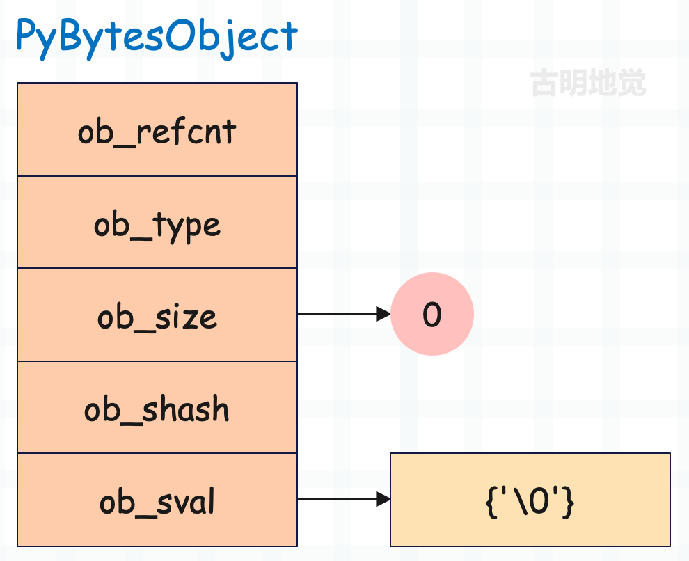

## 楔子

本篇文章来聊一聊 bytes 对象，也就是字节串，而说到字节串就不得不提字符串。

+ 字符串是由任意数量的字符组成的序列，用于表示文本数据。在大多数编程语言中，字符串被视为一种高层数据类型，能够处理和操作文本信息。
+ 字节串是由任意数量的字节组成的序列，用于表示二进制数据。

字符串具有特定的字符编码，比如 UTF-8、ASCII 等等，这些编码定义了字符如何在内存中表示。而字节串没有预定义的编码，它只是原始的二进制序列，在处理非文本数据时非常有用。

计算机在存储数据以及通过网络传输数据时，数据格式都是二进制字节串，所以如果你想传输一段文本，那么必须先将它转成字节串。

~~~python
name = "古明地觉"

print(name.encode("utf-8"))
"""
b'\xe5\x8f\xa4\xe6\x98\x8e\xe5\x9c\xb0\xe8\xa7\x89'
"""
print(name.encode("utf-16"))
"""
b'\xff\xfe\xe4S\x0ef0W\xc9\x89'
"""
print(name.encode("gbk"))
"""
b'\xb9\xc5\xc3\xf7\xb5\xd8\xbe\xf5'
"""
~~~

字节串传输之后还需要转成文本数据，这个过程叫做反序列化。但由于字节串不保存编码信息，它只是一坨字节流，因此反序列化时还需要知道指定的编码，如果编码指定错误，那么反序列化会失败。

~~~python
# name_utf8 和 name_gbk 都只是普通的字节串
name_utf8 = b'\xe5\x8f\xa4\xe6\x98\x8e\xe5\x9c\xb0\xe8\xa7\x89'
name_gbk = b'\xb9\xc5\xc3\xf7\xb5\xd8\xbe\xf5'

# 如果反序列化，必须要知道原始文本使用的编码是什么
print(name_utf8.decode("utf-8"))
print(name_gbk.decode("gbk"))
"""
古明地觉
古明地觉
"""

# 如果指定了错误的编码，那么反序列化会失败
try:
    name_utf8.decode("gbk")
except UnicodeDecodeError as e:
    print(e)
"""
'gbk' codec can't decode byte 0xa7 in position 10: illegal multibyte sequence
"""
~~~

另外我们看到字符串只有 4 个字符，但序列化之后的字节串却明显多于 4 个字节。这是因为一个字节最多能表示 256 个字符，对于英文字符来说已经足够了，但对于非英文字符则力不从心，毕竟光普通的中文字符就好几千个。

所以便有了多字节编码，它使用多个字节来表示一个字符，具体使用多少个，则取决于编码。如果是 GBK 编码，那么两个字节表示一个字符，如果是 UTF-8 编码，那么三个字节表示一个字符，当然这里的字符指的是非英文字符。所以在反序列化的时候，需要指定正确的编码，否则解析一定会失败。

以上就是关于 bytes 对象的一些基础概念，下面来看一下它的底层结构。

## 字节串的底层结构

字节串的类型是 bytes，那么我们有理由相信它在底层由 PyBytesObject 结构体表示。

~~~C
// Include/bytesobject.h
typedef struct {
    PyObject_VAR_HEAD
    Py_hash_t ob_shash;
    char ob_sval[1];
} PyBytesObject;
~~~

我们看一下里面的字段：

+ PyObject_VAR_HEAD：变长对象的公共头部，因为字节串是由若干个字节组成的，具有长度的概念，所以它是变长对象。
+ ob_shash：保存字节串的哈希值，因为计算哈希值需要遍历所有的字节，如果每获取一次哈希值都要重新计算的话，性能会有影响。所以第一次计算之后会用 ob_shash 字段保存起来，之后就不再计算了。如果 bytes 对象的哈希值尚未计算，那么 ob_shash 为 -1。
+ ob_sval：char 类型的数组，负责保存具体的字节。这个和整数的 ob_digit 字段的声明方式类似，由于数组长度不属于类型的一部分，因此虽然声明的时候长度是 1，但其实长度不受限制，具体是多少取决于 bytes 对象的字节数量。

我们创建几个不同的 bytes 对象，然后通过画图感受一下。

**val = b""**

我们看到即便是空的字节序列，底层的 ob_sval 也需要一个 '\\0'，那么这个结构体实例占多大内存呢？首先 ob_sval 之外的四个成员，每个都占 8 字节，而 ob_sval 是一个 char 类型的数组，一个 char 占 1 字节，所以 bytes 对象的内存大小等于 32 + ob_sval 的长度。

而 ob_sval 里面至少有一个 '\\0'，因此一个空的字节序列需要占 33 字节的内存。

~~~python
>>> sys.getsizeof(b"")
33
~~~

注意：ob_size 统计的是 ob_sval 中有效字节的个数，不包括 '\\0'，但是计算占用内存的时候，显然是需要考虑在内的，因为它确实占用了一个字节的空间。因此我们说 bytes 对象占的内存等于 33 + ob_size 也是可以的。

**val = b"abc"**

显然内存大小等于 32 + 4 = 36 字节。

因此 bytes 对象的底层结构还是很好理解的，因为它是字节序列，所以在底层用一个 char 类型的数组来维护具体的值再合适不过了。

## 创建 bytes 对象

下面来看一下 bytes 对象的创建方式，这里我们暂时先不介绍底层是如何创建的，等到介绍缓存池的时候再说。这里来聊一聊如何在 Python 中创建，虽然该系列是剖析源码，但是光说底层的话可能会有一些无趣，因此这个过程中也会穿插大量的 Python 内容。

先观察 Python 代码执行时的表现，再通过底层的源码进行解析，两者结合起来更容易让人理解。另外该系列也能保证即使你没有相应的 C 语言基础，也一样能收获很多。

~~~Python
b = b"hello"
~~~

以上是最简单的创建方式，它使用我们之前说的特定类型 API，但通过这种方式创建的字节串只能包含 ASCII 字符。下面这种方式是不行的：

~~~python
b = b"古明地觉"
~~~

"古明地觉" 包含非 ASCII 字符，所以采用多字节编码，但编码方式也有多种，比如 UTF-8、GBK 等等，解释器不知道你用的是哪一种。因此采用字面量的方式，只能包含 ASCII 字符，因为对于 ASCII 字符而言，不管使用哪种编码，得到的结果都是一样的。但如果包含非 ASCII 字符，那么必须手动指定编码。

~~~Python
b = bytes("古明地觉", encoding="utf-8")
print(b)
"""
b'\xe5\x8f\xa4\xe6\x98\x8e\xe5\x9c\xb0\xe8\xa7\x89'
"""
~~~

里面的 \\x 表示十六进制，我们知道字符 a 的 ASCII 码是 97，对应十六进制是 61。同理字符 b 是 62，字符 c 是 63，那么 b"abc" 就还可以这么创建。

~~~Python
b = b"\x61\x62\x63"
print(b)
"""
b'abc'
"""
~~~

以上是根据十六进制的数字创建 bytes 对象，注意：采用这种方式创建必须指定 \\x，然后 b"\\x61" 表示的是 1 个字节，并且该字节对应的 ASCII 码的十六进制是 61，也就是字符 a。而 b"61" 表示的是两个字节。

~~~Python
# \x61、\x62、\x63 均表示 1 字节
print(b"\x61\x62\x63")
"""
b'abc'
"""
# 下面这个创建的 bytes 对象是 6 字节
print(b"616263")
"""
b'616263'
"""
~~~

可如果有一串字符也是十六进制格式，但开头没有 \\x，这个时候要怎么转成 bytes 对象呢？很简单，使用 bytes.fromhex 方法即可。

~~~Python
print(bytes.fromhex("616263"))
"""
b'abc'
"""

# 转成 bytes 对象之后，如果是可打印字符的话
# 那么会显示对应的字符，比如 abc
# 如果是不可打印字符，就原本输出，比如 \xff
print(bytes.fromhex("616263FF"))
"""
b'abc\xff'
"""
~~~

该方法会将里面的字符串当成十六进制来解析，得到 bytes 对象。并且使用这种方式的话，字符的个数一定是偶数，每个字符的范围均是 0~9、A~F（或者 a~f）。因为十六进制需要两个字符来表示，范围是 00 到 FF。即便小于 16，也必须用两个字符表示，比如我们可以写 05，但绝不能只写个 5。

总之使用 bytes.fromhex 创建时，字符串的长度一定是一个偶数，从前往后每两个分为一组。使用字面量的方式创建时也是如此，比如我们可以写成 b"\\x01\\x02"，但不能写成 b"\\x1\\x2"。

~~~python
# 不可以写成 b"\x0"，会报错
print(b"\x00")  # b'\x00'

# \x 后面至少跟两个字符，但这里跟了 3 个字符
# 所以 \x 会和 61 组合得到 'a'
# 至于后面的那个 1 就单纯的表示字符 '1'
print(b"\x611")  # b'a1'
~~~

所以 \\x 后面可以跟超过两个以上的字符，超过两个以上的部分会被当成普通字符来处理，与十六进制无关。每个 \\x 只和它后面的两个字符结合，因此 \\x 后面不能少于两个字符。

然后我们通过索引获取的时候，得到的也是一个整数：

~~~python
b = "古".encode("utf-8")
print(b)  # b'\xe5\x8f\xa4'
print([b[0], b[1], b[2]])  # [229, 143, 164]
~~~

所以 bytes 对象的每个字节都是 0 ~ 255 之间的一个整数，那么问题来了，如果我有每个字节对应的整数，那么如何再转成 bytes 对象呢？

~~~Python
# 里面的每个整数都必须位于 0 ~ 255 之间
print(bytes([229, 143, 164]))
print(bytes([229, 143, 164, 97, 98, 99]))
"""
b'\xe5\x8f\xa4'
b'\xe5\x8f\xa4abc'
"""

print(bytes([229, 143, 164]).decode("utf-8"))
print(bytes([229, 143, 164, 97, 98, 99]).decode("utf-8"))
"""
古
古abc
"""
~~~

以上就是 bytes 对象的几种创建方式，我们再总结一下。

~~~python
# 1）通过字面量的方式创建
print(b"hello")  # b'hello'
# 也可以使用十六进制的 ASCII 码，但要指定 \x 前缀
# \x 会和它后面的两个数字（范围是 0 ~ 9、A ~ F）进行组合，表示一个字符
print(b"\x61\x62\x63")  # b'abc'
# 除了十六进制之外，还可以使用八进制的 ASCII 码，前缀是 \
# \ 会和它后面的三个数字（范围是 0 ~ 7）进行组合，表示一个字符
# 97、98、99 对应的八进制为 141、142、143
print(b"\141\142\143")  # b'abc'
# 注：\x 要求后面必须跟两个数字，比如可以写 \x05，但不可以写 \x5
# 而八进制的 \ 则不做要求，后面可以跟 1 ~ 3 个数字
# 比如 9 不属于八进制整数，所以下面这个字节串长度为 4
# 分别是 \014、9、\142、\143，而八进制的 14 对应的十六进制是 c
# 所以打印 b"\x0c9bc"
print(b"\149\142\143")  # b'\x0c9bc'

# 2）通过调用类型对象 bytes 创建
print(bytes([97, 98, 99]))  # b'abc'
# 也可以传一个字符串，并指定编码
print(bytes("嘿嘿", encoding="utf8"))  # b'\xe5\x98\xbf\xe5\x98\xbf'

# 3）调用 bytes.fromhex 方法创建
print(bytes.fromhex("616263"))  # b'abc'
~~~

通过这些方法，我们可以很轻松地将数据转成 bytes 对象。

## 小结

本篇文章我们就聊了聊什么是 bytes 对象，以及它的底层结构和几种创建方式。

bytes 对象的含义是字节串，或者字节序列，它由一系列的字节组成。并且随着编码不同、字符范围不同，可能一个字节对应一个字符，也可能两个字节对应一个字符，或者三个字节对应一个字符。

-----

&nbsp;

**欢迎大家关注我的公众号：古明地觉的编程教室。**

**如果觉得文章对你有所帮助，也可以请作者吃个馒头，Thanks♪(･ω･)ﾉ。**

