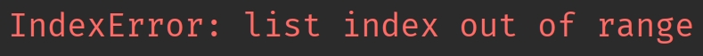

## 楔子

介绍完 bytes 对象在底层的数据结构之后，我们来研究一下它支持的操作，由于操作定义在类型对象中，显然我们需要查看 bytes 类型。

## bytes 类型

根据解释器 API 的命名规则，bytes 类型在底层应该对应 PyBytes_Type。

~~~C
// Objects/bytesobject.c
PyTypeObject PyBytes_Type = {
    PyVarObject_HEAD_INIT(&PyType_Type, 0)
    "bytes",
    PyBytesObject_SIZE,
    sizeof(char),
    // ...
    &bytes_as_number,                           /* tp_as_number */
    &bytes_as_sequence,                         /* tp_as_sequence */
    &bytes_as_mapping,                          /* tp_as_mapping */
    // ...
};
~~~

实例对象的大小信息保存在类型对象中，由 tp_basicsize 和 tp_itemsize 负责维护。

+ tp_basicsize：实例对象的基本大小，对于 bytes 对象来说就是 PyBytesObject_SIZE。
+ tp_itemsize：如果实例对象是变长对象，并且结构体本身还保存了具体的元素，那么该字段则表示每个元素的大小，否则为 0。对于 bytes 对象来说就是 sizeof(char)，即 1 字节。

其中 PyBytesObject_SIZE 是一个宏，等于 offsetof(PyBytesObject, ob_sval) + 1，也就是结构体的起始位置到 ob_sval 字段的偏移量再加 1。显然这个大小是固定不变的基础大小，那么它等于多少呢？

~~~C
typedef struct {
    PyObject_VAR_HEAD
    Py_hash_t ob_shash;
    char ob_sval[1];
} PyBytesObject;
~~~

很明显，大小是 32 + 1 = 33 字节，然后再加上 sizeof(char) \* ob_size 就是整个 bytes 对象的大小。由于 sizeof(char) 等于 1，所以 bytes 对象的大小等于 PyBytesObject_SIZE 加上 ob_size，我们后面介绍 bytes 对象的创建时会看到。

然后看一下方法簇，我们发现这三个方法簇 bytes 对象居然都支持。

~~~C
// Objects/bytesobject.c

static PyNumberMethods bytes_as_number = {
    0,              /*nb_add*/
    0,              /*nb_subtract*/
    0,              /*nb_multiply*/
    bytes_mod,      /*nb_remainder*/
};

static PySequenceMethods bytes_as_sequence = {
    // 计算长度，如 len(b"abc")
    (lenfunc)bytes_length,         /*sq_length*/
    // 将两个 bytes 对象相加
    // 比如 b"abc" + b"def"
    (binaryfunc)bytes_concat,      /*sq_concat*/
    // 将 bytes 对象重复 N 次
    // 比如 "abc" * 3
    (ssizeargfunc)bytes_repeat,    /*sq_repeat*/
    // 基于索引获取 bytes 对象的指定元素
    // 比如 b"abc"[1]
    (ssizeargfunc)bytes_item,      /*sq_item*/
    0,                             /*sq_slice*/
    0,                             /*sq_ass_item*/
    0,                             /*sq_ass_slice*/
    // 判断 bytes 对象是否包含某个元素
    (objobjproc)bytes_contains     /*sq_contains*/
};

static PyMappingMethods bytes_as_mapping = {
    // 获取 bytes 对象的长度
    (lenfunc)bytes_length,
    // 基于切片截取 bytes 对象
    (binaryfunc)bytes_subscript,
    0,
};
~~~

+ 对于数值型操作，bytes 对象实现了 nb_remainder，它居然支持求余数，这是怎么回事？好吧，我表现的有些刻意了，其实就是一个字节串的格式化操作。
+ 对于序列型操作，bytes 对象支持五个，从名字上看也知道是做什么的，不过这些我们一会儿都会说。
+ 对于映射型操作，bytes 对象支持两个。虽然 bytes 对象不是字典，但解释器允许它做一些类似于映射的操作，这种设计使得 bytes 对象具有更加丰富和灵活的操作接口。

下面我们就来详细介绍这些操作的底层实现，它们都位于 Objects/bytesobject.c 中。

## bytes 对象的格式化

bytes 对象借用取模运算符 % 实现格式化，它对应 `bytes_as_number->nb_remainder` 字段，该字段被赋值为 bytes_mod。

~~~C
static PyObject *
bytes_mod(PyObject *self, PyObject *arg)
{
    if (!PyBytes_Check(self)) {
        Py_RETURN_NOTIMPLEMENTED;
    }
    // PyBytes_AS_STRING 会返回 PyBytesObject 的 ob_sval 字段
    // PyBytes_GET_SIZE 会返回 PyBytesObject 的 ob_size 字段，即长度
    // arg 是传递的参数，它是一个元组
    return _PyBytes_FormatEx(PyBytes_AS_STRING(self), PyBytes_GET_SIZE(self),
                             arg, 0);
}
~~~

最终会调用 _PyBytes_FormatEx 进行格式化，我们再以 Python 为例。

~~~Python
info = b"name: %s, age: %d"
print(info % (b"satori", 17))  # b'name: satori, age: 17'
~~~

bytes 对象的格式化，在工作中其实用的不多。

## 计算 bytes 对象的长度

计算字节串的长度会执行 `bytes_as_sequence->sq_length`，该字段被赋值为 bytes_length。

~~~C
static Py_ssize_t
bytes_length(PyBytesObject *a)
{
    return Py_SIZE(a);
}
~~~

Py_SIZE 是一个宏，我们之前说过，它会返回对象的 ob_size。

~~~Python
name = b"satori"
# 直接返回 ob_size
print(len(name))  # 6
~~~

ob_size 维护了 bytes 对象的有效字节个数，计算长度的时候直接返回。

## 将 bytes 对象重复 N 次

bytes 对象支持乘法操作，可以重复指定次数，举个例子。

~~~python
word = b"abc"
# 重复 3 次
print(word * 3)  # b'abcabcabc'
~~~

我们看到这里使用了乘法运算符，所以很容易联想到 PyNumberMethods 的 nb_mul，但对于 bytes 对象而言却不是这样，它对应的是 PySequenceMethods 的 sq_repeat。所以 Python 的同一个操作符，在底层会对应不同的函数，比如 long_mul 和 float_mul、以及这里的 bytes_repeat，在 Python 的层面都是 \* 这个操作符。

下面我们看一下具体逻辑，它由 bytes_repeat 函数实现。

~~~C
static PyObject *
bytes_repeat(PyBytesObject *a, Py_ssize_t n)
{
    Py_ssize_t i;
    Py_ssize_t j;
    Py_ssize_t size;  // 新创建的 bytes 对象的 ob_size
    PyBytesObject *op;  // 指向新创建的 bytes 对象
    size_t nbytes;  // 应该为 bytes 对象内部的 char 数组（ob_sval）申请多大内存
    
    // 如果 bytes 对象乘上一个小于 0 的数，那么等价于乘以 0
    if (n < 0)
        n = 0;
    // Py_SIZE(a) * n 就是新创建的 bytes 对象的长度
    // 如果这个长度超过了 PY_SSIZE_T_MAX，那么报错，字节串过长
    // 另外注意这里的条件，正常思路是 Py_SIZE(a) * n > PY_SSIZE_T_MAX
    // 但为了避免 Py_SIZE(a) * n 发生溢出，所以改成了除法
    // 这个和我们写二分查找求平均值是一个道理
    if (n > 0 && Py_SIZE(a) > PY_SSIZE_T_MAX / n) {
        PyErr_SetString(PyExc_OverflowError,
            "repeated bytes are too long");
        return NULL;
    }
    // 将 Py_SIZE(a) * n 赋值给 size
    size = Py_SIZE(a) * n;
    // 如果 size 和 Py_SIZE(a) 相等，说明 n 为 1，或者 Py_SIZE(a) 为 0
    // 但不管哪一种，都意味着新创建的 bytes 对象和原始的 bytes 对象是相同的
    // 既然这样的话，就没必要创建了，直接给原始的 bytes 对象的引用计数加一，然后返回即可
    if (size == Py_SIZE(a) && PyBytes_CheckExact(a)) {
        Py_INCREF(a);
        return (PyObject *)a;
    }
    // 需要为内部的 char 数组申请的内存大小，一个元素一个字节
    // 注：严格意义上说，nbytes 应该等于 char 数组的内存大小减 1
    // 因为额外存储 '\0' 所需的一字节被算在了 PyBytesObject_SIZE 里面
    // 所以这个 nbytes 的含义其实和 bytes 对象的长度是等价的
    nbytes = (size_t)size;
    // PyBytesObject_SIZE + nbytes 便是 bytes 对象的内存大小了
    // 但如果两者相加的结果反而小于等于 nbytes，说明产生溢出了（发生了环绕）
    if (nbytes + PyBytesObject_SIZE <= nbytes) {
        // 那么报错，字节串太长了
        PyErr_SetString(PyExc_OverflowError,
            "repeated bytes are too long");
        return NULL;
    }
    // 为新创建的 bytes 对象申请 PyBytesObject_SIZE + nbytes 大小的内存
    op = (PyBytesObject *)PyObject_MALLOC(PyBytesObject_SIZE + nbytes);
    // 如果 op 为 NULL，说明内存不足
    if (op == NULL)
        return PyErr_NoMemory();
    // 初始化，将 op->ob_type 设置为 &PyBytes_Type，将 op->ob_size 设置为 size
    (void)PyObject_INIT_VAR(op, &PyBytes_Type, size);
    // 将 ob_shash 初始化为 -1，等到需要计算的时候，再更新 ob_shash
    // 一旦更新，后续就不用再计算了，会直接返回 ob_shash
    op->ob_shash = -1;
    // ob_sval 要额外存储一个 '\0'，显然它位于索引为 size 的位置
    // 因此有效字符的数量为 size，但 ob_sval 的大小为 size + 1
    // 那么问题来了，既然这样的话，nbytes 应该等于 size + 1 才对，为啥等于 size 呢
    // 很简单，原因已经说过了，因为 PyBytesObject_SIZE 为 offsetof(PyBytesObject, ob_sval) + 1
    // offsetof(PyBytesObject, ob_sval) 表示从结构体起始位置到 ob_sval 的偏移量
    // 或者你也可以理解为 ob_sval 之前的所有字段的大小
    // 但它又额外加上了 1，所以 '\0' 需要的空间已经被申请了，因此没有问题
    op->ob_sval[size] = '\0';
    
    // 此时对象的内存就已经申请好了，类型、长度等元数据也设置好了，接下来就是拷贝元素了
    // 首先做一个快分支判断，如果原始的 bytes 对象的长度为 1，证明新的 bytes 对象的所有字节都是一样的
    // 直接将 op->ob_sval 里面的 n 个元素设置为 a->ob_sval[0] 即可
    if (Py_SIZE(a) == 1 && n > 0) {
        memset(op->ob_sval, a->ob_sval[0] , n);
        return (PyObject *) op;
    }
    // 否则将 a->ob_sval 里面除了 '\0' 之外的有效字符拷贝到 op->ob_sval 里面
    // 每次拷贝 Py_SIZE(a) 个字符，直到拷贝的字符个数达到 size
    i = 0;
    if (i < size) {
        memcpy(op->ob_sval, a->ob_sval, Py_SIZE(a));
        i = Py_SIZE(a);
    }
    while (i < size) {
        j = (i <= size-i)  ?  i  :  size-i;
        memcpy(op->ob_sval+i, op->ob_sval, j);
        i += j;
    }
    // 将 PyBytesObject * 类型的 op 转成 PyObject *，然后返回，交给变量保存
    return (PyObject *) op;
}
~~~

所以通过观察源码，你会发现 Python 里面的操作并没有什么神奇的，简单思考一下就知道它的底层逻辑。再比如后续介绍的切片截取，即使现在还没看具体源码，但也能猜到底层就是单纯的 for 循环。

## 基于索引和切片获取元素

bytes 对象也支持通过索引和切片截取指定部分的元素。

~~~Python
buf = b"abcde"
# 基于索引获取元素，拿到的是整数
print(buf[0])  # 97
# 基于切片获取元素，拿到的依旧是字节串
print(buf[0: 1])  # b'a'
~~~

那么底层是怎么做的呢？

~~~C
static PyObject*
bytes_subscript(PyBytesObject* self, PyObject* item)
{
    // 如果是 buf[0] 这种，那么 self 就是 buf，item 就是 0
    // 如果是 buf[0: 3] 这种，那么 self 就是 buf，item 就是 slice(0, 3)
    // 所以要对 item 进行检测，判断它到底是索引还是切片
    if (PyIndex_Check(item)) {
        // 如果 item 是整数或者实现了 tp_as_number->nb_index
        // 那么表示索引，会转成 Py_ssize_t，如果转换失败，那么会设置异常回溯栈
        Py_ssize_t i = PyNumber_AsSsize_t(item, PyExc_IndexError);
        // 如果 PyErr_Occurred() 为真，那么表示有异常发生
        // 但问题是这里为什么要多一个 i == -1 呢？我们稍后再说
        if (i == -1 && PyErr_Occurred())
            return NULL;
        // 如果转换之后发现 i 小于 0，表示使用的是负数索引
        // 那么要加上长度，变成正数索引，因此负数索引本质上也是 Python 的一个语法糖
        if (i < 0)
            i += PyBytes_GET_SIZE(self);
        // 到这里发现 i 如果还小于 0，或者本身大于等于长度，那么索引越界
        if (i < 0 || i >= PyBytes_GET_SIZE(self)) {
            PyErr_SetString(PyExc_IndexError,
                            "index out of range");
            return NULL;
        }
        // 否则说明索引 i 是合法的，那么获取数组 ob_sval 中索引为 i 的元素
        // 但拿到的是 C 的整数，所以还要基于 C 整数创建 Python 整数，然后返回
        return PyLong_FromLong((unsigned char)self->ob_sval[i]);
    }
    // 如果 item 是切片
    else if (PySlice_Check(item)) {
        // 我们知道切片有三个属性，分别是起始位置、终止位置、步长
        Py_ssize_t start, stop, step, slicelength, i;
        size_t cur;
        char* source_buf;
        char* result_buf;
        PyObject* result;
        // 解析切片，将内部属性赋值给 start、stop、step
        // 关于 PySlice_Unpack 我们在介绍切片的时候说过
        if (PySlice_Unpack(item, &start, &stop, &step) < 0) {
            return NULL;
        }
        // 这个函数在介绍切片的时候也说过
        // 它会调整 start 和 stop 的值，比如将负数转成正数，然后返回应该遍历的元素个数
        slicelength = PySlice_AdjustIndices(PyBytes_GET_SIZE(self), &start,
                                            &stop, step);
        // 如果小于等于 0，说明截取不到任何元素，因此直接返回空字节串
        if (slicelength <= 0) {
            // 基于 C 的字符数组和拷贝的字节数，创建 Python 的字节串
            return PyBytes_FromStringAndSize("", 0);
        }
        // 如果 start 为 0，step 为 1，并且截取的元素个数和原始字节串的长度相等
        // 比如 buf[::] 这种，说明截取之后的字节串和原始字节串相同
        // 那么直接给原始字节串增加一个引用计数，然后返回即可
        else if (start == 0 && step == 1 &&
                 slicelength == PyBytes_GET_SIZE(self) &&
                 PyBytes_CheckExact(self)) {
            Py_INCREF(self);
            return (PyObject *)self;
        }
        // 如果步长为 1，那么从索引为 start 的位置截取 slicelength 个字节即可
        // PyBytes_AS_STRING(self) 会返回字节串的 ob_sval，即 C 字符数组
        // ob_sval + start 会将指针偏移到索引为 start 的位置
        // 然后通过 C 的 memcpy 函数从 start 开始拷贝 slicelength 个字节
        else if (step == 1) {
            return PyBytes_FromStringAndSize(
                PyBytes_AS_STRING(self) + start,
                slicelength);
        }
        // 否则说明步长不为 1，此时只能使用循环了
        else {
            // 拿到原始字节串的 ob_sval
            source_buf = PyBytes_AS_STRING(self);
            // 创建长度为 slicelength 的字节串
            // 注意：此时内部字符数组的容量已经有了，但还没有元素
            result = PyBytes_FromStringAndSize(NULL, slicelength);
            if (result == NULL)
                return NULL;
            // 拿到新创建的字节串的 ob_sval
            result_buf = PyBytes_AS_STRING(result);
            // 从 start 开始遍历，遍历 slicelength 次，指针每次跳 step 个元素
            for (cur = start, i = 0; i < slicelength;
                 cur += step, i++) {
                // 将元素设置进去
                result_buf[i] = source_buf[cur];
            }
            // 返回
            return result;
        }
    }
    // 如果 item 既不是整数也不是切片，那么报错
    else {
        PyErr_Format(PyExc_TypeError,
                     "byte indices must be integers or slices, not %.200s",
                     Py_TYPE(item)->tp_name);
        return NULL;
    }
}

~~~

虽然代码有点长，但逻辑一点都不难。还是那句话，对于 C 这样朴素的语言来说，就是 if 判断加循环。

## 聊一聊异常

在看 bytes_subscript 源码时，我们提出了一个问题。

上面代码中为什么要有一个 i == -1 判断呢？要解释这一点，首先必须要理解 Python 的异常是怎么抛出来的。

所谓的抛异常，本质上就是底层的某个 C 函数的代码逻辑出现了问题，不能继续执行了，于是将异常信息设置到回溯栈中，并给出一个表示错误的返回值。当解释器发现返回值不对时，就知道程序出错了，于是将回溯栈的异常写入到 stderr（标准错误输出）中。

比如这里，当检测到索引小于 0 或大于等于长度时，就知道索引越界了，不能再执行了。于是会通过 PyErr_SetString 将异常设置到回溯栈中，并返回了 NULL，表示错误的返回值。

因为对于当前函数来说，它的返回值类型是 PyObject \*，如果正常执行，那么返回值应该指向一个合法的 PyObject。但当逻辑出现错误时，就意味着函数不能再执行了，于是设置异常并返回 NULL。而解释器在看到返回值为 NULL 时，就知道该函数执行出现错误了，那么会将回溯栈里的异常信息输出到 stderr 中，

~~~Python
data = []
# data[1] 在底层会执行 bytes_subscript(data, 1)
# 但是发现索引 1 大于等于长度，于是会将异常信息写入到 stderr，并返回 NULL
# 解释器发现返回的是 NULL，就知道执行出错了，否则返回值一定会指向一个合法的 PyObject
# 于是解释器会将回溯栈里的异常写入到 stderr，并终止运行（暂时不考虑异常捕获）
print(data[1])
~~~

在 Python 中看到的就是下面这个样子。

所以这就是抛异常的本质，如果 C 函数执行逻辑有问题，那么会以异常的形式将信息写入到回溯栈，并给出一个表示错误的返回值。外界发现返回值有问题时，就知道执行出错了，最终会由解释器将回溯栈里的异常写入到 stderr 当中。

既然 C 函数执行出现问题会设置异常，那么判断函数执行是否有问题，除了看它的返回值是否正常之外，还可以通过检测异常回溯栈。如果回溯栈里面有异常，调用 PyErr_Occurred 会返回真，否则返回假。

但 PyErr_Occurred 的效率稍微低一些，而直接判断返回值会更快，因为只是一个比较操作。比如这里的 bytes_subscript 函数，只需要检测它的返回值是否等于 NULL 即可判断函数执行是否出现异常。因为返回值类型是 PyObject \*，如果正常执行，返回值一定不是 NULL，否则说明程序出问题了。

但 PyNumber_AsSsize_t 函数则不同，该函数的返回值类型是整型。

索引要么是整数，要么是实现了 \_\_index\_\_ 的类的实例对象，内部调用的 _PyNumber_Index 会统一将 item 转成 Python 整数并返回，如果转换失败则设置异常并返回 NULL。

而 PyNumber_AsSsize_t 函数则负责将 Python 整数转成 C 的 ssize_t 整数，但当它发现返回的 value 没有指向一个合法的 PyObject，而是 NULL，就知道 _PyNumber_Index 执行失败了。那么对于 PyNumber_AsSsize_t 而言，它也不能再执行了，应该返回一个表示错误的返回值。但 PyNumber_AsSsize_t 的返回值类型不是 PyObject \*，而是整型，所以它不能返回 NULL。那么返回多少呢？解释器使用 -1 来充当表示错误的哨兵返回值。

但 -1 除了可以表示出现错误，也可能是函数正常执行，而返回值本身就是 -1。所以和指针类型不同，对于指针类型，通过返回值是否为 NULL 即可判断函数是否执行正常，而返回整型则需要借助 PyErr_Occurred。

比如发现 i 不等于 -1，说明 PyNumber_AsSsize_t 执行正常，不用再判断了。如果 i 等于 -1，那么则需要进一步检查异常回溯栈，如果栈不为空，证明确实发生错误了。如果栈为空，证明此时返回的 -1 不是因出现错误而返回的哨兵值，而是函数正常执行、但返回值本身就是 -1。

假设 PyNumber_AsSsize_t 因为索引类型不合法而返回了 -1，那么 bytes_subscript 就知道调用出现了错误，于是也不能再执行了，于是立即返回。由于它的返回值类型是 PyObject \*，所以会返回 NULL。而最后当解释器看到 bytes_subscript 返回的是 NULL 时，就知道程序应该报错，于是会将回溯栈里的异常抛出来，并结束进程。

## 小结

以上我们就介绍了 bytes 对象（字节串）的一些操作的底层实现，不过还没结束，下一篇文章我们来聊一聊 bytes 对象的加法运算。

当然加法运算本身很简单，之所以单独摘出来是因为背后涉及一个非常重要的概念：缓冲区，它也是 Numpy 得以实现的关键，下一篇文章细聊。

----

&nbsp;

**欢迎大家关注我的公众号：古明地觉的编程教室。**

**如果觉得文章对你有所帮助，也可以请作者吃个馒头，Thanks♪(･ω･)ﾉ。**

