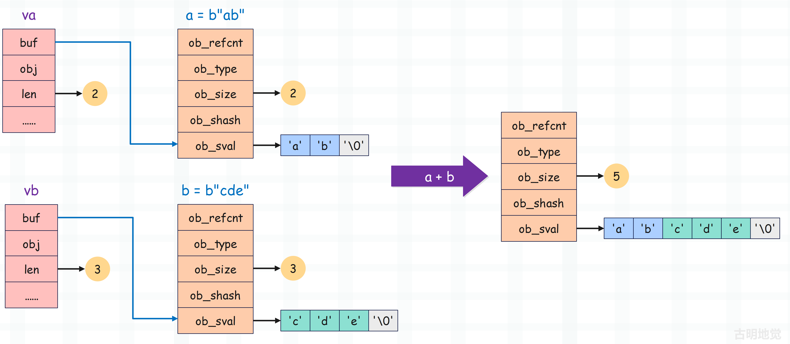

## 楔子

bytes 对象支持加法运算，将两个 bytes 对象合并为一个，举个例子。

~~~Python
b1 = b"abc"
b2 = b"def"
print(b1 + b2)  # b'abcdef'
~~~

这背后是怎么实现的呢？我们通过源码分析一下，并通过 bytes 对象的相加，介绍一下缓冲区的知识。

## bytes 对象的加法运算

提到加法，很容易联想到 PyNumberMethods 的 nb_add，比如：PyLongObject 的 long_add 和 PyFloatObject 的 float_add。

但对于 bytes 对象而言却不是这样，加法操作对应的是 PySequenceMethods 的 sq_concat。所以我们将加法运算改成合并，会更合适一些，只是它在 Python 层面对应的也是 + 操作符。对于 bytes 对象而言，sq_concat 字段会被赋值为 bytes_concat。

~~~C
static PyObject *
bytes_concat(PyObject *a, PyObject *b)
{
    // 两个 Py_buffer 结构体类型的变量，用于维护缓冲区
    // 关于缓冲区，我们一会儿说
    Py_buffer va, vb;
    // 相加结果
    PyObject *result = NULL;
    // 此时缓冲区啥也没有，默认将缓冲区的长度初始化为 -1
    va.len = -1;
    vb.len = -1;
    // 每个 bytes 对象底层都对应一个缓冲区，可以通过 PyObject_GetBuffer 获取
    // 这里获取两个 bytes 对象的缓冲区，然后交给变量 va 和 vb
    // 获取成功返回 0，获取失败返回非 0
    // 如果下面的条件不成功，就意味着获取失败了，说明至少有一个老铁不是 bytes 类型
    if (PyObject_GetBuffer(a, &va, PyBUF_SIMPLE) != 0 ||
        PyObject_GetBuffer(b, &vb, PyBUF_SIMPLE) != 0) {
        // 然后设置异常，PyExc_TypeError 表示 TypeError（类型错误）
        // 专门用来表示对一个对象执行了它所不支持的操作
        PyErr_Format(PyExc_TypeError, "can't concat %.100s to %.100s",
                     Py_TYPE(b)->tp_name, Py_TYPE(a)->tp_name);
        // 比如 b"123" + 123 就会得到 TypeError: can't concat int to bytes
        // 和这里设置的异常信息是一样的，然后当出现异常之后，直接跳转到 done 标签
        goto done;
    }

    // 这里判断是否有一方长度为 0
    // 如果 a 的长度为 0，那么相加之后的结果就是 b
    if (va.len == 0 && PyBytes_CheckExact(b)) {
        result = b;
        Py_INCREF(result);
        goto done;
    }
    // 逻辑和上面类似，如果 b 的长度为 0，那么相加之后的结果就是 a
    if (vb.len == 0 && PyBytes_CheckExact(a)) {
        result = a;
        Py_INCREF(result);
        goto done;
    }
    // 判断两个 bytes 对象合并之后，长度是否超过 PY_SSIZE_T_MAX
    // 所以 bytes 对象是有长度限制的，因为维护长度的 ob_size 有最大范围
    // 但还是之前说的，这个条件基本不可能满足，除非你写恶意代码
    // 补充一句，这个 if 条件看起来会有些别扭，更直观的写法应该像下面这样
    // if (va.len + vb.len > PY_SSIZE_T_MAX)，但 va.len + vb.len 可能会溢出
    if (va.len > PY_SSIZE_T_MAX - vb.len) {
        PyErr_NoMemory();
        goto done;
    }
    // 否则的话，创建指定容量的 PyBytesObject
    result = PyBytes_FromStringAndSize(NULL, va.len + vb.len);
    if (result != NULL) {
        // PyBytes_AS_STRING 会获取 PyBytesObject 的 ob_sval 字段
        // 将缓冲区 va 里面的内容拷贝到 result->ob_sval 中，拷贝的长度为 va.len
        memcpy(PyBytes_AS_STRING(result), va.buf, va.len);
        // 将缓冲区 vb 里面的内容拷贝到 result->ob_sval 中，拷贝的长度为 vb.len
        // 但是要从 va.len 的位置开始拷贝，不然会把之前的内容覆盖掉
        memcpy(PyBytes_AS_STRING(result) + va.len, vb.buf, vb.len);
    }

  done:
    // 拷贝完之后，将 va 和 vb 里的内容释放掉，否则可能会导致内存泄漏
    if (va.len != -1)
        PyBuffer_Release(&va);
    if (vb.len != -1)
        PyBuffer_Release(&vb);
    return result;
}
~~~

代码虽然有点长，但是不难理解，重点是里面的 Py_buffer。我们以 a = b"ab"，b = b"cde" 为例，看一下 a + b 是怎么做的？

说白了整个过程就是将 `a->ob_sval` 和 `b->ob_sval` 拷贝到 `result->ob_sval` 中。但问题是为啥不直接拷贝，而是要搞出来一个 Py_buffer 呢？这就要说一说 Python 的缓冲区了。

## 详解缓冲区

为了更好地理解缓冲区，我们需要解释一下什么是缓冲区协议。缓冲区协议是一个 C 级协议，它定义了一个具有数据缓冲区和元数据的 C 级结构体，这个结构体就是上面的 Py_buffer。通过 Py_buffer 来描述缓冲区的布局、数据类型和读写权限，并且还定义了支持协议的对象所必须实现的 API。

实现缓冲区协议的对象有 bytes对象、array.array 对象、以及最知名的 numpy.ndarray 对象。

至于缓冲区本身，它就是一个单纯的一维数组，负责存储具体的数据。我们以 numpy 数组为例，不管数组是多少维的，底层的缓冲区永远是一个一维数组。那么问题来了，我们在定义数组时设置的维度信息要如何体现呢？答案是通过 Py_buffer，来看一下它的底层结构。

~~~C
// Include/cpython/object.h

typedef struct bufferinfo {
    // 指针，指向具体的缓冲区，注意：缓冲区就是个一维数组
    void *buf;
    // 指向实现缓冲区协议的对象本身   
    PyObject *obj;
    // 缓冲区的长度
    Py_ssize_t len;
    // 缓冲区中每个元素的大小
    Py_ssize_t itemsize;
    // 缓冲区是否只读，0 表示可读写、1 表示只读
    int readonly;
    // 维度，比如数组的 shape 为 (3, 4, 5)，那么它的 ndim 就是 3
    int ndim;
    // 格式化字符串，用于描述缓冲区的元素类型
    char *format;
    // 等价于 numpy 数组的 shape
    // 因此缓冲区永远是个一维数组，由 buf 字段指向
    // 而其它字段则负责描述这个一维数组应该怎么使用
    Py_ssize_t *shape;
    // 在某个维度下，从一个元素到下一个元素所需要跳跃的字节数
    Py_ssize_t *strides;
    Py_ssize_t *suboffsets;
    void *internal;
} Py_buffer;
~~~

以上就是 Py_buffer，它的 buf 字段指向了具体的缓冲区，对于 bytes 对象而言就是内部的 ob_sval 字段。再比如 numpy 数组的拷贝，默认情况下在拷贝数组时只会将 Py_buffer 拷贝一份，而 Py_buffer 内部的 buf 字段指向的缓冲区则不会拷贝。

~~~python
import numpy as np

# Py_buffer.buf 指向了缓冲区
# Py_buffer.shape 为 (6,)
arr1 = np.array([3, 9, 5, 7, 6, 8])
# 将 Py_buffer 拷贝一份，并且 Py_buffer.shape 变成了 (2, 3)
# 但 Py_buffer.buf 指向的缓冲区没有拷贝
arr2 = arr1.reshape((2, 3))

# 然后在通过索引访问的时候，可以认为 numpy 为其创建了虚拟的索引轴
# 由于 arr1 只有一个维度，那么 numpy 会为其创建一个虚拟的索引轴
"""
arr1 = [3 9 5 7 6 8]

    index1: 0 1 2 3 4 5
       buf: 3 9 5 7 6 8    
"""
# arr2 有两个维度，shape 是 (2, 3)
# 那么 numpy 会为其创建两个虚拟的索引轴
"""
arr2 = [[3, 9, 5]
        [7, 6, 8]]

    index1: 0 0 0 1 1 1
    index2: 0 1 2 0 1 2
       buf: 3 9 5 7 6 8                
"""
# 缓冲区中索引为 4 的元素被修改
arr2[1, 1] = 666
# 由于 arr1 和 arr2 共享一个缓冲区
# 所以 print(arr1[4]) 也会打印 666
print(arr1[4])  # 666
~~~

以上就是缓冲区的内容，关于缓冲区在后续还会详细介绍，到时候我们也会让自定义的实例对象支持缓冲区。

回到 bytes 对象，它也实现了缓冲区协议，内部的 ob_sval（一个一维数组）就是对应的缓冲区，Py_buffer 里面的 buf 字段同样指向了这个缓冲区，而其它的字段则负责描述该如何使用这个缓冲区，可以理解为元信息。正如 numpy 的数组，虽然多个数组底层共用一个缓冲区，数据也只有一份，但在 numpy 的层面却可以表现出不同的维度，究其原因就是元信息不同。

相信你现在肯定明白 Py_buffer 存在的意义了，就是共享内存。不管什么对象，只要实现了缓冲区协议，那么就可以直接向彼此暴露自身的缓冲区。并且在操作的时候，统一使用 Py_buffer，保证不同类型的对象的操作是一致的。

~~~Python
import numpy as np

# bytes 对象实现了缓冲区协议，后续操作时会创建 Py_buffer 实例
# Py_buffer.buf 指向的缓冲区便是 bytes 对象的 ob_sval
# 对于当前来说就是 {'a', 'b', 'c', 'd', '\0'}
b = b"abcd"

# np.frombuffer 表示基于已有的缓冲区创建数组，因此会共享 bytes 对象的缓冲区
# 但问题是缓冲区只是一个普通的一维数组，numpy 该怎么解析这个缓冲区呢
# 所以我们必须显式地指定 dtype，而 "S1" 表示按照单个字节来进行解析
arr1 = np.frombuffer(b, dtype="S1")
print(arr1)  # [b'a' b'b' b'c' b'd']

# "S2" 表示按照两个字节来进行解析
arr2 = np.frombuffer(b, dtype="S2")
print(arr2)  # [b'ab' b'cd']

# 那么问题来了，按照三个字节解析是否可行呢？
# 答案是不可行，因为缓冲区的大小不是 3 的整数倍
# 而 "S4" 显然是可以的
arr3 = np.frombuffer(b, dtype="S4")
print(arr3)  # [b'abcd']

# 按照 int8 进行解析
arr4 = np.frombuffer(b, dtype="int8")
print(arr4)  # [ 97  98  99 100]

# 按照 int16 进行解析
# 显然 97 98 整体会被解析成一个整数，99 100 整体会被解析成一个整数
# 你想到了什么，这不就类似于 Python 整数的底层实现嘛
"""
97 -> 01100001
98 -> 01100010
那么 97 98 组合起来就是 01100010_01100001

99 -> 01100011
100 -> 01100100
那么 99 100 组合起来就是 01100100_01100011
"""
print(0b01100010_01100001)  # 25185
print(0b01100100_01100011)  # 25699
print(np.frombuffer(b, dtype="int16"))  # [25185 25699]

# 按照 int32 来解析，显然这 4 个字节整体表示一个 int32
print(0b01100100_01100011_01100010_01100001)  # 1684234849
print(np.frombuffer(b, dtype="int32"))  # [1684234849]
~~~

怎么样，是不是有点神奇呢？相信你在使用 numpy 的时候应该会有更加深刻的认识了，这就是缓冲区协议的威力。哪怕是不同的对象，只要都实现了缓冲区协议，那么彼此之间就可以暴露底层的缓冲区，从而实现共享内存。

所以 np.frombuffer 就是直接根据对象的缓冲区来创建数组，然后它底层的 buf 字段也指向这个缓冲区。但它不知道该如何解析这个缓冲区，所以我们需要显式地指定 dtype 来告诉它，相当于告诉它一些元信息。

那么问题来了，我们能不能修改缓冲区呢？

~~~Python
import numpy as np

b = b"abcd"
arr = np.frombuffer(b, dtype="S1")

try:
    arr[0] = b"A"
except ValueError as e:
    print(e)  # assignment destination is read-only

# 答案是不可以的，因为原始的 bytes 对象不可修改，所以缓冲区只读
# 但我们真的就没办法了吗？还记得之前介绍的骚操作吗？
from ctypes import *

class PyBytesObject(Structure):

    _fields_ = [
        ("ob_refcnt", c_ssize_t),
        ("ob_type", c_void_p),
        ("ob_size", c_ssize_t),
        ("ob_shash", c_ssize_t),
        ("ob_sval", 5 * c_byte),
    ]
obj = PyBytesObject.from_address(id(b))
# 修改缓冲区之前，打印 arr
print(arr)  # [b'a' b'b' b'c' b'd']
# 修改缓冲区之后，打印 arr
obj.ob_sval[0] = ord("A")
print(arr)  # [b'A' b'b' b'c' b'd']
~~~

我们看到由于共享缓冲区，所以修改 bytes 对象也会影响数组 arr，只是由于 bytes 对象不可变，我们只能出此下策。但其实还有一个办法，就是使用 bytearray 对象。

~~~Python
import numpy as np

# 可以理解为可变的 bytes 对象
b = bytearray(b"abcd")
arr = np.frombuffer(b, dtype="S1")

print(b)  # bytearray(b'abcd')
# 此时缓冲区是可修改的，并且修改任何一个对象都会影响另一个，因为它们共享同一个缓冲区
arr[0] = b"A"
# 再次打印
print(b)  # bytearray(b'Abcd')
~~~

Py_buffer 的实现，也是 numpy 诞生的一个重要原因。

## 小结

通过两个 bytes 对象相加，我们了解了什么是缓冲区、缓冲区协议，以及存在的作用，并且通过 numpy 进行了解释。了解缓冲区，可以让你更加深刻地理解 numpy。

下面再来总结一下：

+ 如果一个类型对象实现了 tp_as_buffer，那么它的实例对象便支持缓冲区协议；
+ tp_as_buffer 是一个函数指针，指向的函数负责初始化 Py_buffer；
+ 在共享缓冲区的时候，比如 np.frombuffer(obj)，会直接调用 obj 的类型对象的 tp_as_buffer 字段指向的函数，拿到 Py_buffer 实例的 buf 字段指向的缓冲区。但 numpy 不知道该怎么解析这个缓冲区，所以还需要我们指定 dtype 参数。
+ 缓冲区存在的最大意义就是共享内存，numpy 的数组在拷贝的时候，默认只拷贝 Py_buffer 实例，至于 Py_buffer 的 buf 字段指向的缓冲区默认是不会拷贝的。比如数组有 100 万个元素，这些元素都存储在缓冲区中，被 Py_buffer 的 buf 字段指向，拷贝的时候这 100 万个元素是不会拷贝的。
+ numpy 数组的维度、shape，是借助于 Py_buffer 中的元信息体现的，维度和 shape 不同，访问缓冲区元素的方式也不同。但存储元素的缓冲区，永远是一个一维数组，由 buf 字段指向。

-------------

&nbsp;

**欢迎大家关注我的公众号：古明地觉的编程教室。**

**如果觉得文章对你有所帮助，也可以请作者吃个馒头，Thanks♪(･ω･)ﾉ。**

