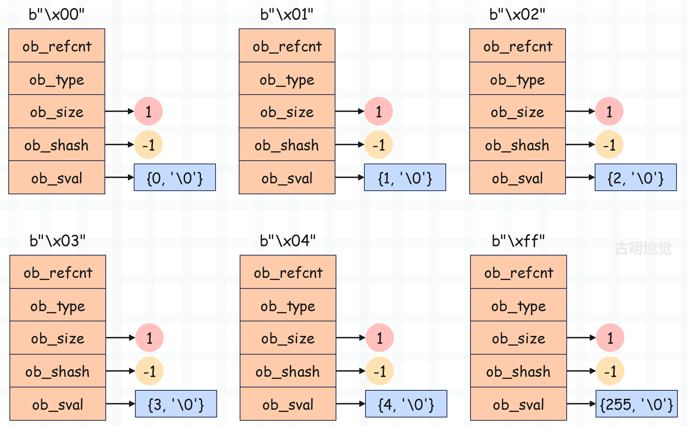

bytes 对象是不可变对象，那么根据我们对浮点数的了解，可以大胆猜测 bytes 对象也有自己的缓存池。事实上确实如此，为了优化单字节 bytes 对象的创建效率，Python 底层维护了一个缓存池，该缓存池是一个 PyBytesObject \* 类型的数组。

~~~C
// Objects/bytesobject.c

// 保存了 256 个单字节 bytes 对象，对应的 ASCII 码为 0 ~ 255
static PyBytesObject *characters[UCHAR_MAX + 1];
// 保存空 bytes 对象
static PyBytesObject *nullstring;
~~~

Python 内部创建单字节 bytes 对象时，会先检查目标对象是否已在缓存池中。PyBytes_FromString 函数是负责创建 bytes 对象的一个常用的 Python/C API，我们看一下它的逻辑。

~~~C
// Objects/bytesobject.c

// 基于 C 字符串创建 bytes 对象
PyObject *
PyBytes_FromString(const char *str)
{
    size_t size;  // bytes 对象的长度
    PyBytesObject *op;  // 指向创建的 bytes 对象

    assert(str != NULL);
    // 计算 C 字符串的长度，它和对应的 bytes 对象的长度是相等的
    size = strlen(str);
    if (size > PY_SSIZE_T_MAX - PyBytesObject_SIZE) {
        PyErr_SetString(PyExc_OverflowError,
            "byte string is too long");
        return NULL;
    }
    
    // 如果 size 等于 0，并且 nullstring 保存了空 bytes 对象，那么直接返回
    if (size == 0 && (op = nullstring) != NULL) {
#ifdef COUNT_ALLOCS
        _Py_null_strings++;
#endif
        Py_INCREF(op);
        return (PyObject *)op;
    }
    
    // 如果 size 等于 1，比如 char *str = "a"，证明创建的是单字节对象
    // 而 str 是字符串首元素的地址，所以 *str 会得到 'a'，即 97
    // 假设 *str 是 97，那么 op 就是 bytes_characters[97]
    if (size == 1 && (op = characters[*str & UCHAR_MAX]) != NULL) {
#ifdef COUNT_ALLOCS
        _Py_one_strings++;
#endif
        Py_INCREF(op);
        return (PyObject *)op;
    }

    // 否则创建新的 PyBytesObject 对象，此时是个空
    op = (PyBytesObject *)PyObject_MALLOC(PyBytesObject_SIZE + size);
    if (op == NULL)
        return PyErr_NoMemory();
    // 初始化内部字段
    (void)PyObject_INIT_VAR(op, &PyBytes_Type, size);
    op->ob_shash = -1;
    // 将 C 字符串拷贝到 ob_sval 中
    memcpy(op->ob_sval, str, size+1);
    // 如果 size == 0，说明创建的是空 bytes 对象，那么赋值给 nullstring
    if (size == 0) {
        nullstring = op;
        Py_INCREF(op);
    } else if (size == 1) {
        // 如果 size == 1，说明创建的是单字节 bytes 对象，那么放入到缓存池中
        // 并且在缓存池中的索引，就是该字节对应的 ASCII 码
        characters[*str & UCHAR_MAX] = op;
        Py_INCREF(op);
    }
    // 转成泛型指针之后返回
    return (PyObject *) op;
}
~~~

整体来说并不难，该 API 会将 C 字符串全部拷贝到 ob_sval 中。但如果 C 字符串长度为 10，而我们只希望基于前 n 个字符创建 bytes 对象，这时候可以使用 PyBytes_FromStringAndSize 函数。

+ PyBytes_FromString("Hello World") 会返回 b"Hello World"。
+ PyBytes_FromStringAndSize("Hello World", 5) 会返回 b"Hello"，如果传递的第二个参数 size 和 C 字符串长度相同，那么效果和 PyBytes_FromString 是等价的。

至于 PyBytes_FromStringAndSize 的逻辑和 PyBytes_FromString 类似，缓存池部分也是一样的，可以自己看一下。

当 Python 程序开始运行时，字节序列缓存池是空的。但随着单字节 bytes 对象的创建，缓存池中的对象慢慢多了起来。这样一来，单字节序列首次创建后便在缓存池中缓存起来，后续再使用时会直接从缓存池中获取，避免重复创建和销毁。与前面章节介绍的小整数对象池一样，字节序列缓存池也只能容纳为数不多的 256 个单字节序列，但使用频率非常高。

缓存池技术作为一种以空间换时间的优化手段，只需较小的内存为代价，便可明显提升执行效率。

~~~python
>>> a1 = b"a"
>>> a2 = b"a"
>>> a1 is a2
True
>>>
>>> a1 = b"ab"
>>> a2 = b"ab"
>>> a1 is a2
False
>>>
~~~

显然此时不需要解释了，单字节 bytes 对象会缓存起来，放到缓存池中。至于空字节 bytes 对象，则是由专门的 nullstring 变量保存，它们都是单例的。

到目前为止，关于 bytes 对象的内容就说完了。

-----

&nbsp;

**欢迎大家关注我的公众号：古明地觉的编程教室。**

**如果觉得文章对你有所帮助，也可以请作者吃个馒头，Thanks♪(･ω･)ﾉ。**

