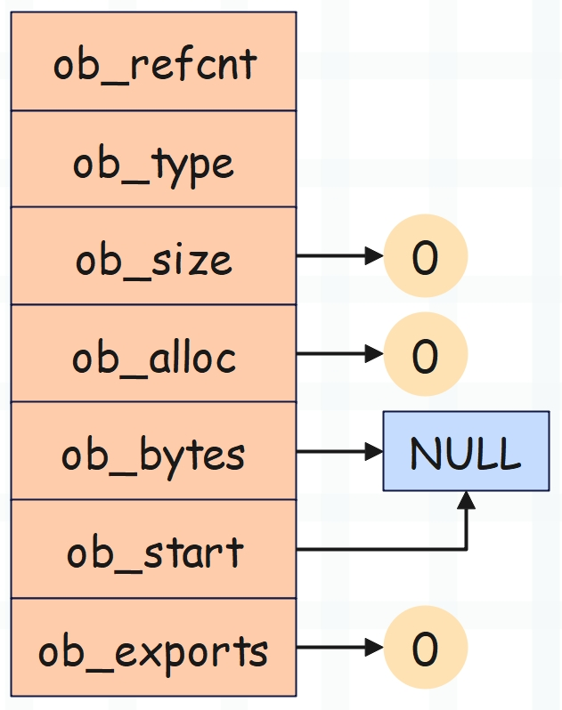
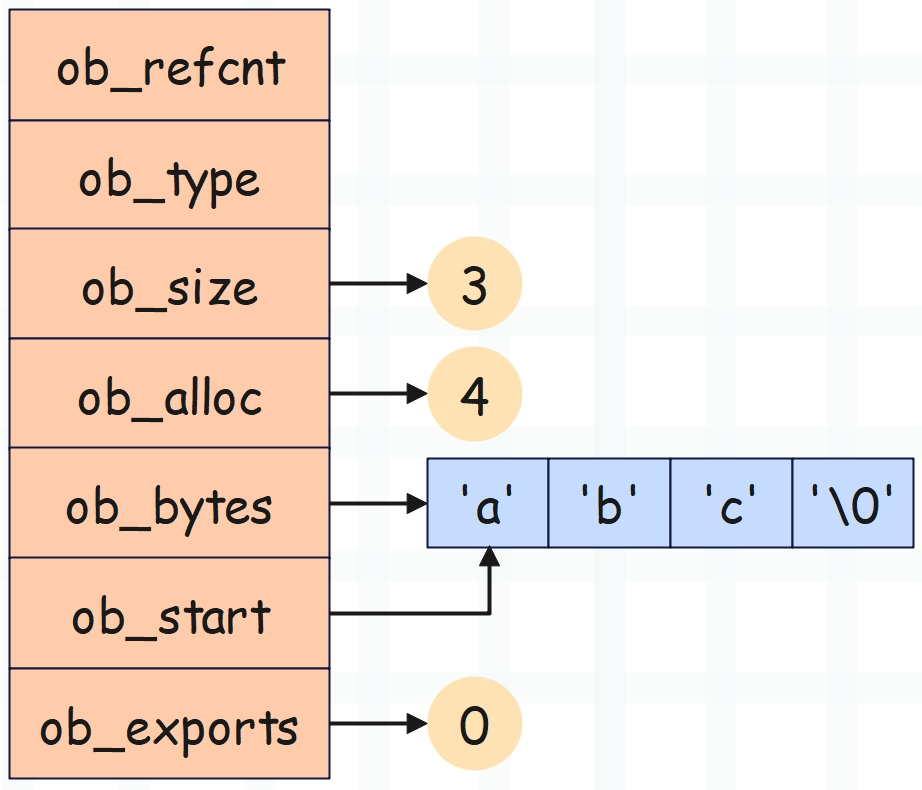
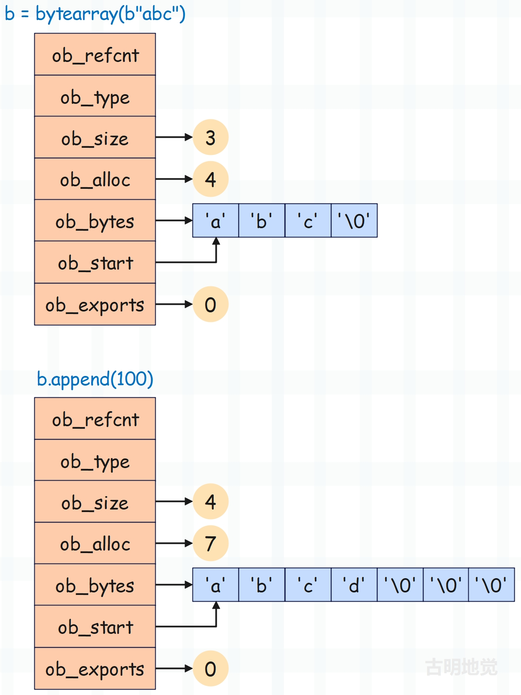
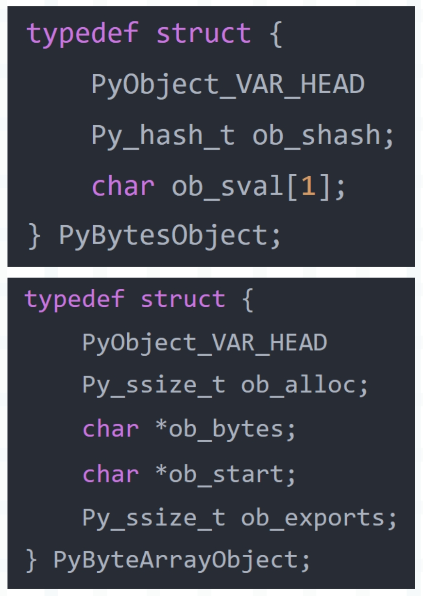

## 楔子

前面我们介绍了 bytes 对象，本篇文章来聊一聊 bytearray 对象，这两者都表示字节串或者字节序列，它们的创建方式和支持的操作也是类似的。

~~~Python
# 基于列表创建，里面的元素为 0 ~ 255 的整数
b1 = bytes([97, 98, 99])
b2 = bytearray([97, 98, 99])
print(b1)
print(b2)
"""
b'abc'
bytearray(b'abc')
"""

# 基于字符串创建
b1 = bytes("hello", encoding='utf-8')
b2 = bytearray("hello", encoding='utf-8')
print(b1)
print(b2)
"""
b'hello'
bytearray(b'hello')
"""

b1 = bytes.fromhex("61626364")
b2 = bytearray.fromhex("61626364")
print(b1)
print(b2)
"""
b'abcd'
bytearray(b'abcd')
"""
~~~

但区别在于 bytes 对象是不可变对象，bytearray 对象是可变对象。

~~~Python
# 也可以直接基于 bytes 对象创建 bytearray 对象
# 反过来也是如此
b = bytearray(b"satori")
print(b)  # bytearray(b'satori')

# 既然是可变对象，那么就意味着可以本地修改内部元素
# 由于字节序列内部的每个元素都是 0 ~ 255 的整数
# 因此这里修改时，也必须赋值整数
b[0] = ord("S")
print(b)  # bytearray(b'Satori')

# 当然，如果基于切片修改，那么需要赋值一个 bytes 对象
b[0: 2] = b"SA"
print(b)  # bytearray(b'SAtori')
# 当然也可以赋值一个 bytearray 对象
# 它和 bytes 对象本质一样，无非是 bytes 对象不能本地修改
b[0: 3] = bytearray(b"saT")
print(b)  # bytearray(b'saTori')

# 在尾部追加字节
b.append(ord(" "))
b.append(ord("h"))
b.append(ord("e"))
b.append(ord("l"))
b.append(ord("l"))
b.append(ord("o"))
print(b)  # bytearray(b'saTori hello')
~~~

还是那句话，如果不需要对字节序列做修改的话，那么 bytes 对象和 bytearray 对象是等价的，我们使用 bytes 对象即可。但若是希望字节序列可变，那么只能使用 bytearray 对象。

下面我们来分析一下 bytearray 对象的底层实现。

## bytearray 对象的底层实现

bytearray 对象在底层由 PyByteArrayObject 结构体表示，定义如下。

~~~C
// Include/bytearrayobject.h

typedef struct {
    PyObject_VAR_HEAD
    Py_ssize_t ob_alloc;
    char *ob_bytes;
    char *ob_start;
    int ob_exports;
} PyByteArrayObject;
~~~

解释一下每个字段的含义：

- PyObject_VAR_HEAD：变长对象的公共头部，包含引用计数、类型和长度。
- ob_alloc：底层缓冲区的长度，即最多能容纳多少个字节。注意它和 ob_size 的区别，ob_size 表示 bytearray 对象的长度，也就是缓冲区当前已经容纳了多少个字节。如果 append 的时候发现 ob_size 达到了 ob_alloc，那么要对缓冲区进行扩容。
- ob_bytes：指向缓冲区的指针，缓冲区是一个连续的内存块，用于存储字节序列的所有数据。
- ob_start：ob_bytes 指向缓冲区的物理起始位置，而 ob_start 指向缓冲区的逻辑起始位置。说白了 ob_start 可以指向缓冲区的任意位置，允许字节序列使用部分缓冲区，比如通过切片 [1:] 进行截取，那么 ob_start 便指向缓冲区的第二个元素（逻辑起始位置），而无需重新分配内存。
- ob_exports：缓冲区被外部对象引用的次数。

下面我们来创建几个 bytearray 对象，并通过画图来描述对应的底层结构。

**b = bytearray(b"")**

每个结构体字段都是 8 字节，所以一个空 bytearray 对象的大小是 56 字节。

~~~Python
>>> b = bytearray()
>>> b
bytearray(b'')
>>> b.__sizeof__()
56
~~~

结果和我们分析的一样。

**b = bytearray(b"abc")**

由于缓冲区长度为 4，因此大小为 56 + 4 = 60 字节。

~~~python
>>> b = bytearray(b"abc")
>>> b
bytearray(b'abc')
>>> b.__sizeof__()
60
~~~

所以我们可以得出结论，bytearray 对象的大小等于 56 + 缓冲区的长度，在不发生扩容的情况下，缓冲区的长度等于 ob_size + 1。

~~~Python
>>> name = "古明地觉"
>>> b = bytearray(name, encoding="utf-8")
>>> 
>>> 56 + len(name) * 3 + 1
69
>>> b.__sizeof__()
69
~~~

但如果发生扩容会怎么样呢？

~~~Python
>>> b = bytearray(b"abc")
>>> b
bytearray(b'abc')
>>> b.__sizeof__()
60
# 添加一个元素
>>> b.append(100)
>>> b
bytearray(b'abcd')
>>> b.__sizeof__()
63
~~~

添加一个元素之后，大小从 60 变成了 63，难道不应该是 61 吗？之所以出现这个现象，就是因为扩容的时候多申请了两个字节，我们画张图来展示一下这个过程。

以上就是 bytearray 对象的底层结构。

## bytearray 对象的创建

说完了 bytearray 对象的底层结构之后，再来看看它是怎么创建的？

~~~C
// Objects/bytearrayobject.c

PyObject *
PyByteArray_FromStringAndSize(const char *bytes, Py_ssize_t size)
{
    // 基于 C 的字符数组创建 bytearray 对象
    // 参数 size 表示 bytearray 对象的长度
    PyByteArrayObject *new;
    Py_ssize_t alloc;
    // size 必须大于 0
    if (size < 0) {
        PyErr_SetString(PyExc_SystemError,
            "Negative size passed to PyByteArray_FromStringAndSize");
        return NULL;
    }

    // size 必须小于 PY_SSIZE_T_MAX
    if (size == PY_SSIZE_T_MAX) {
        return PyErr_NoMemory();
    }
    // 为 PybyteArrayObject 申请内存，此处调用的是泛型 API
    new = PyObject_New(PyByteArrayObject, &PyByteArray_Type);
    // 申请失败返回 NULL
    if (new == NULL)
        return NULL;
    // 如果 size == 0，表示 bytearray 对象的长度为 0
    // 那么将 ob_bytes 设置为 NULL，将 alloc 设置为 0
    if (size == 0) {
        new->ob_bytes = NULL;
        alloc = 0;
    }
    else {
        // 否则将 alloc 设置为 size + 1，因为要多一个 '\0'
        alloc = size + 1;
        // 申请 alloc 个字节的内存，赋值给 ob_bytes
        new->ob_bytes = PyObject_Malloc(alloc);
        // 为 NULL 表示申请失败，内存不足
        if (new->ob_bytes == NULL) {
            Py_DECREF(new);
            return PyErr_NoMemory();
        }
        // 将参数 bytes（这里是 C 字符串）拷贝到 ob_bytes 指向的缓冲区
        // 在拷贝的时候，可以指定拷贝的长度，通过 size 参数指定
        // 如果希望整个字符串全部拷贝，那么将 size 指定为 strlen(bytes) 即可
        if (bytes != NULL && size > 0)
            memcpy(new->ob_bytes, bytes, size);
        // 将最后一个元素（索引为 size）设置为 '\0'
        new->ob_bytes[size] = '\0';  /* Trailing null byte */
    }
    // 将 ob_size 字段初始化为 size
    Py_SIZE(new) = size;
    // 将 ob_alloc 字段初始化为 alloc
    new->ob_alloc = alloc;
    // ob_start 默认等于 ob_bytes
    new->ob_start = new->ob_bytes;
    // 缓冲区被引用的次数为 0，因为刚创建
    new->ob_exports = 0;
    // 转成泛型指针之后返回
    return (PyObject *)new;
}
~~~

之前在创建 bytes 对象的时候介绍过 PyBytes_FromStringAndSize 这个函数，创建 bytearray 对象和它是类似的。但需要注意的是，bytes 对象和 bytearray 对象都实现了缓冲区，但这两者有一个区别。

+ bytes 对象的缓冲区存储在 PyBytesObject 结构体内部；
+ bytearray 对象则不是这样，PyByteArrayObject 内部存储的是指针，指针指向了缓冲区；

我们回顾一下这两个结构体的定义。

PyBytesObject 里面的 ob_sval 是一个数组，而 PyByteArrayObject 的 ob_bytes 是一个指针。那为什么会出现这种情况呢？原因在这个系列的最开始就说过了，bytes 对象是不可变的，元素会直接存储在对应的结构体内部。

而 bytearray 对象是可变的，那么它内部只能存储指针，指针指向的内存区域负责存储元素。如果发生扩容，只需申请一片更大的内存区域并将元素拷贝过去，然后改变指针（ob_bytes）指向即可。至于 bytearray 对象本身的地址是不会发生任何变化的，它的扩容对引用它的变量来说是无感知的。

## 小结

以上就是 bytearray 对象，关于它的具体操作就不赘述了，和 bytes 对象是类似的，可以自己尝试读一读。

总之在工作中，如果你不明确需要字节序列可变，那么使用 bytes 对象即可，否则使用 bytearray 对象。

-----

&nbsp;

**欢迎大家关注我的公众号：古明地觉的编程教室。**

**如果觉得文章对你有所帮助，也可以请作者吃个馒头，Thanks♪(･ω･)ﾉ。**

