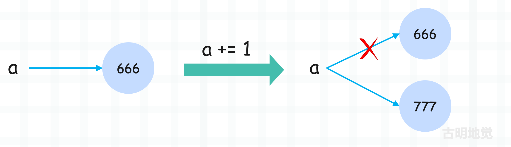
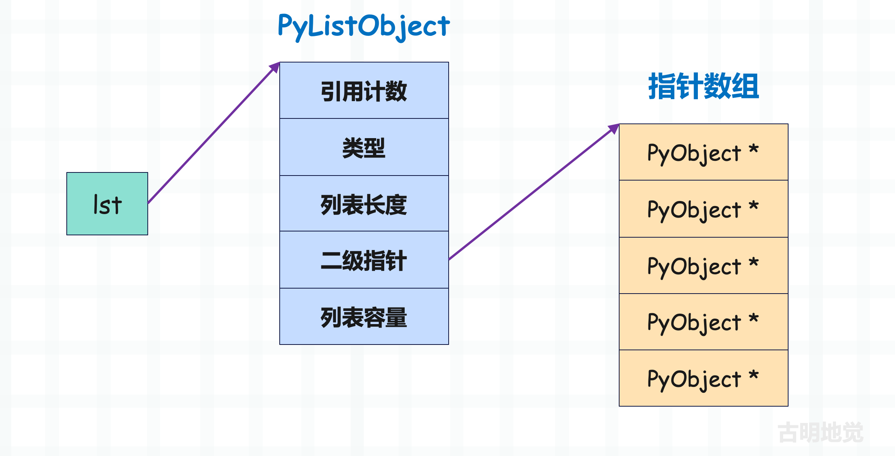
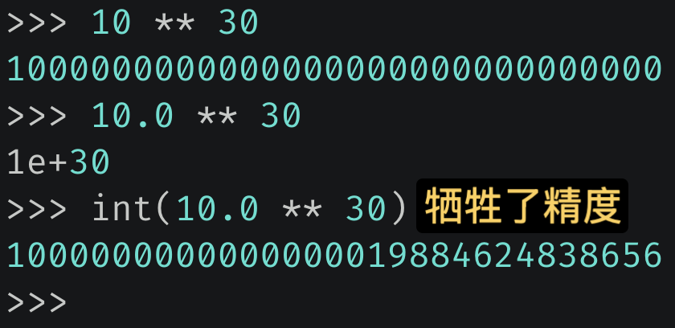
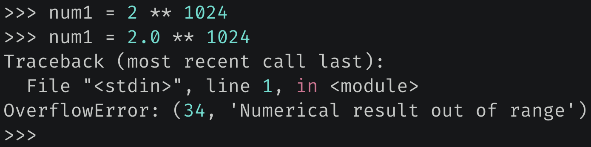

## 楔子

在程序开发中，我们每时每刻都在创建对象，那到底什么是对象呢？

其实一个对象就是一片被分配的内存空间，空间可以是连续的，也可以是不连续的。然后空间里面存储了指定的数据，并提供了操作数据的一些功能方法。而按照是否可变和内存大小是否固定，我们可以将对象进行如下分类。

- 可变对象和不可变对象；
- 定长对象和变长对象；

下面来详细解释一下。

## 可变对象和不可变对象

不可变对象一旦创建，其内存中存储的值就不可以再修改了。如果想修改，只能创建一个新的对象，然后让变量指向新的对象，所以前后的地址会发生改变。而可变对象在创建之后，其存储的值可以动态修改。

像整数就是一个不可变对象。

~~~python
>>> a = 666
>>> id(a)
140176818069136
>>> a += 1
>>> id(a)
140176818068368
~~~

我们看到执行 a += 1 操作之后，前后地址发生了变化，所以整数不支持本地修改，因此是一个不可变对象；

原来 a = 666，而我们说操作一个变量等于操作这个变量指向的内存，所以 a += 1 会将 a 指向的整数对象 666 和 1 进行加法运算，得到 667。因此会开辟新的空间来存储 667，然后让 a 指向这片新的空间。至于原来的 666 所占的空间怎么办，解释器会看它的引用计数，如果不为 0 代表还有变量引用（指向）它，如果为 0 则证明没有变量引用了，所以会被回收。

关于引用计数，我们后面会详细说，目前只需要知道，如果对象被变量引用了，那么该对象的引用计数就会加 1。有几个变量引用，那么它的引用计数就是几。

除了整数之外，浮点数、字符串、布尔值等等，都是不可变对象，它们的值不能本地修改。

**然后是可变对象，像列表、字典、集合等都是可变对象，它们支持动态修改。**

> 这里先多提一句，Python 对象本质上就是 C 的 malloc 函数为结构体实例在堆区申请的一块内存。Python 的任何对象在 C 中都会对应一个结构体，这个结构体除了存放具体的值之外，还存放了一些额外信息，具体细节在后续剖析内置对象的时候会细说。

在上一篇文章中我们说到，列表、元组、集合这些容器的内部存储的不是具体的对象，而是对象的指针。比如：lst = [1, 2, 3]，你以为列表存储的是三个整数对象吗？其实不是的，它存储的是三个整数对象的指针，当我们获取 lst[0] 的时候，拿到的是一个指针，但是操作（比如 print）的时候会自动操作指针指向的内存。

因为 Python 底层是用 C 实现的，所以列表的实现必然要借助 C 的数组。可 C 数组里面的元素的类型是一致的，但列表却可以存放任意的元素，因此从这个角度上讲，列表里面的元素就不可能是对象，因为不同的对象在底层对应的结构体是不同的，所以元素只能是指针。

可能有人又好奇了，不同对象的指针也是不同的啊，是的，但 C 指针是可以转化的。Python 底层将所有对象的指针，都转成了 PyObject 类型的指针，这样不就是同一种类型的指针了吗？关于这个 PyObject，它是我们后面要剖析的重中之重，贯穿了整个系列。不过目前只需要知道列表（还有其它容器）存储的元素、以及 Python 的变量，它们都是一个泛型指针 PyObject \*。

~~~Python
>>> lst = [1, 2, 3]
>>> id(lst)
140176818170432
>>> lst.append(4)
>>> lst.append(5)
>>> lst
[1, 2, 3, 4, 5]
>>> id(lst)
140176818170432
~~~

我们看到列表在添加元素的时候，前后地址并没有改变。列表在 C 中是通过 PyListObject 结构体实现的，我们在介绍列表的时候会细说。这个 PyListObject 内部除了一些基本信息之外，还维护了一个 PyObject 的二级指针，指向了 PyObject \* 类型的数组的首元素。

显然图中的指针数组用来存储具体的对象的指针，每一个指针都指向了相应的对象（这里是整数对象）。

然后我们还可以看到一个现象，那就是列表在底层是分开存储的，因为 PyListObject 结构体实例并没有存储相应的指针数组，而是存储了一个二级指针。显然添加、删除、修改元素等操作，都是通过这个二级指针来间接操作指针数组。

因为一个对象一旦被创建（任何语言都是如此），那么它在内存中的大小就不可以变了。所以这就意味着那些可以容纳可变长度数据的可变对象，要在内部维护一个指针，指针指向一片内存区域，该区域存放具体的数据。如果空间不够了，那就申请一片更大的内存区域，然后将元素依次拷贝过去，再让指针指向新的内存区域。而列表的底层也是这么做的，其内部并没有直接存储具体的指针数组，而是存储了指向指针数组首元素的二级指针。

**那么问题来了，为什么要这么做？**

其实很好理解，遵循这样的规则可以使通过指针维护对象的工作变得非常简单。一旦允许对象的大小可在运行期改变，那么我们就要考虑如下场景。

在内存中有对象 A，并且其后面紧跟着对象 B。如果在运行的某个时候，A 的大小增大了，这就意味着必须将 A 整个移动到内存中的其他位置，否则 A 增大的部分会覆盖掉原本属于 B 的数据。但要将 A 移动到内存的其他位置，那么所有指向 A 的指针就必须立即得到更新。可想而知这样的工作是多么的繁琐，因此通过在可变对象的内部维护一个指针就变得简单多了。

## 定长对象和变长对象

所谓定长和变长，取决于对象所占的内存大小是否固定，举个例子。

~~~Python
>>> import sys
>>> sys.getsizeof("")
49
>>> sys.getsizeof("hello")
54
>>> sys.getsizeof("hello world")
60

>>> sys.getsizeof(1.0)
24
>>> sys.getsizeof(3.14)
24
>>> sys.getsizeof((2 << 30) + 3.14)
24
>>> 
~~~

我们看到字符串的长度不同，所占的内存也不同，像这种内存大小不固定的对象，我们称之为变长对象；而浮点数所占的内存都是一样的，像这种内存大小固定的对象，我们称之为定长对象。

> 至于 Python 如何计算对象所占的内存，我们在剖析具体对象的时候会说，因为这涉及到底层对应的结构体。

所以变长对象的特点是：同一个类型的实例对象，如果值不同，那么占用的内存大小不同。像字符串、列表、元组、字典等，它们毫无疑问都是变长对象。值得一提的是，整数也是变长对象，因为 Python 整数的值在底层是通过数组维护的，后续介绍整数实现的时候再聊。

而定长对象的特点是：同一个类型的实例对象，不管值是多少，占用的内存大小始终是固定的，比如浮点数。因为 Python 的浮点数的值在 C 中是通过一个 double 来维护的。而 C 里面值的类型一旦确定，那么内存大小就不变了，所以 Python 浮点数的内存大小也是不变的。

但既然类型固定，内存大小固定，那么范围肯定是有限的。所以当浮点数不断增大，会牺牲精度来进行存储。

如果实在过大，则抛出 OverFlowError。

当然除了浮点数之外，布尔值、复数等也属于定长对象，它们占用的内存大小是固定的。

## 小结

以上我们就分析了对象的种类，对象可以被分为可变对象和不可变对象，以及变长对象和定长对象。

- 不可变对象：对象不支持本地修改；
- 可变对象：对象支持本地修改；
- 变长对象：对象维护的值不同，占用的内存大小也不同；
- 定长对象：占用的内存大小始终固定；

------

&nbsp;

**欢迎大家关注我的公众号：古明地觉的编程教室。**

**如果觉得文章对你有所帮助，也可以请作者吃个馒头，Thanks♪(･ω･)ﾉ。**

