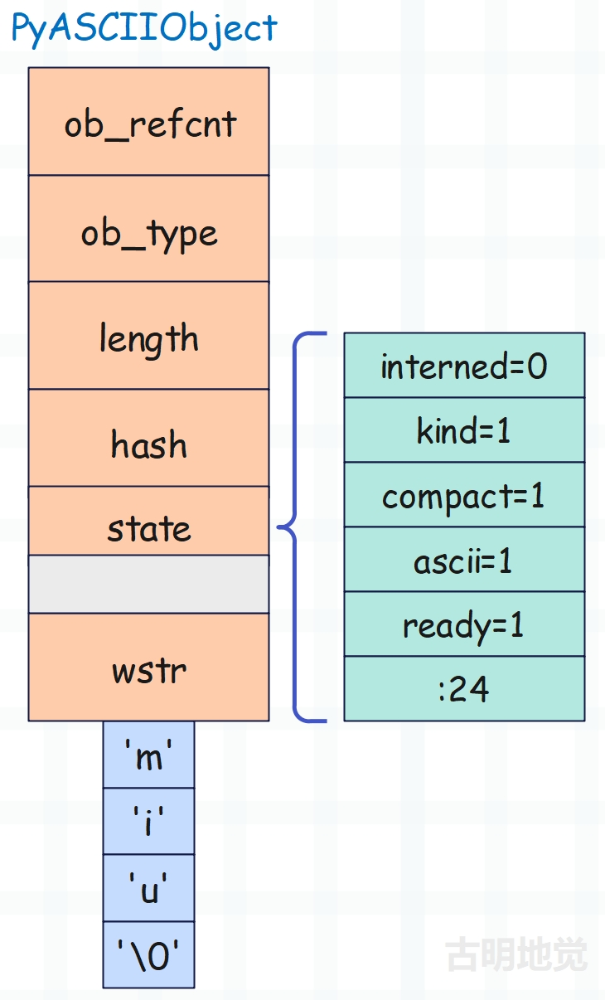
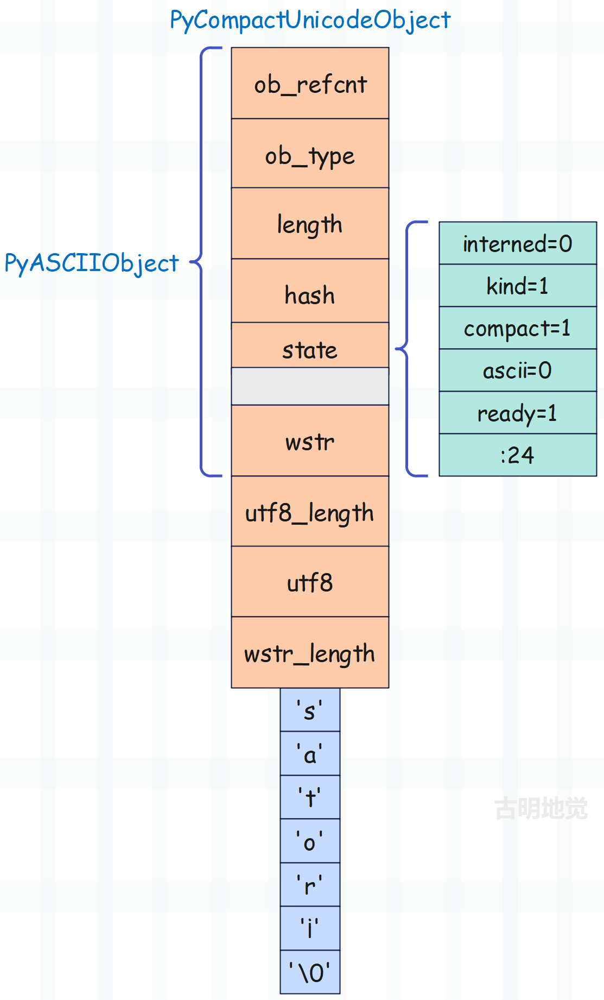
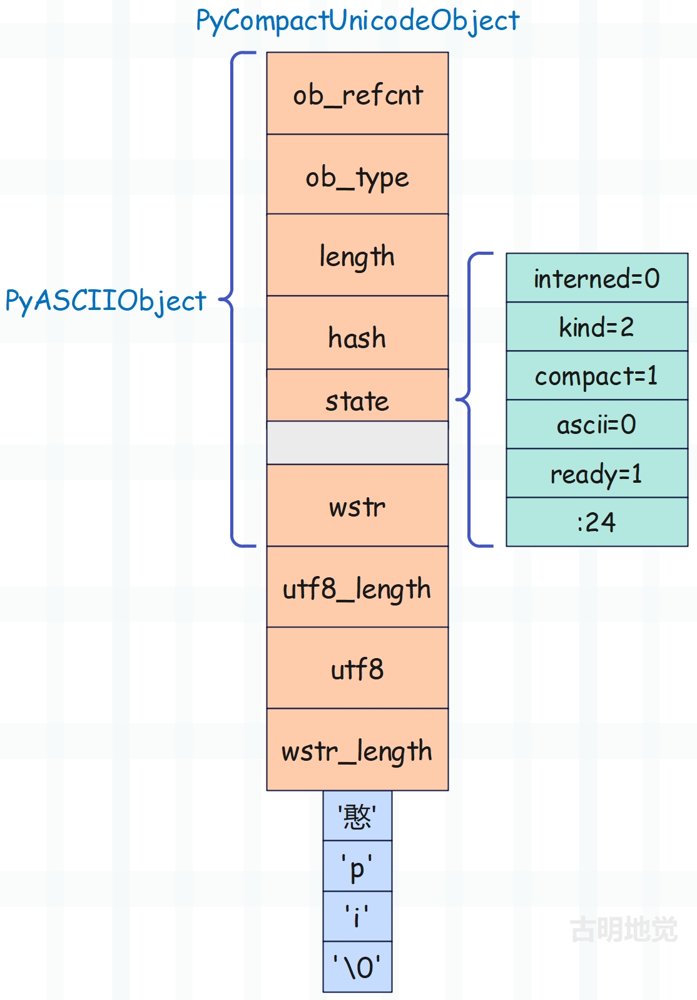
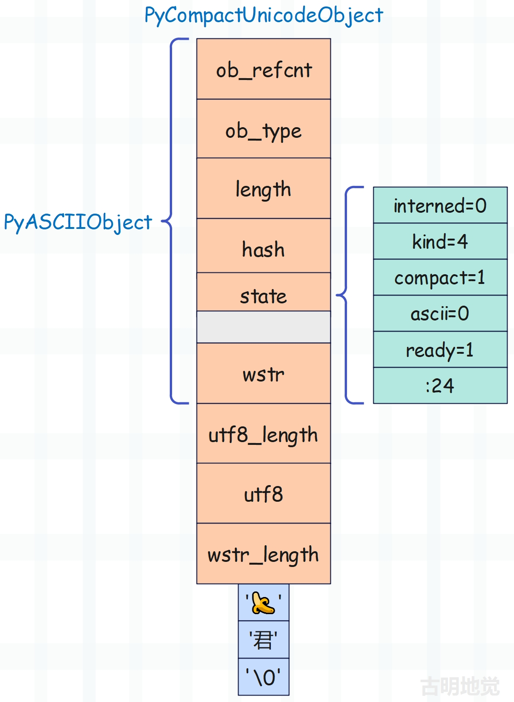

## 楔子

我们之前提到，字符串采用不同的编码，底层的结构体实例的元数据所占用的内存是不一样的。其实本质上是，字符串会根据编码的不同，而选择不同的存储结构。

- PyASCIIObject：字符串仅包含 ASCII 字符；
- PyCompactUnicodeObject：字符串包含非 ASCII 字符，但可以紧凑表示；
- PyUnicodeObject：通用结构，可以表达所有类型的字符串（该结构不做讨论）；

需要强调的是，虽然 ASCII 字符占一字节，但只有码点小于 128 的字符才叫 ASCII 字符。

下面我们来分析一下。

## unicode 分类

unicode 会根据编码的不同而分为以下几类。

~~~C
// Include/cpython/unicodeobject.h
enum PyUnicode_Kind {
    // 所有字符的码点均位于 U+0000 ~ U+00FF 
    PyUnicode_1BYTE_KIND = 1,
    // 所有字符的码点均位于 U+0000 ~ U+FFFF 
    // 且至少有一个大于 U+00FF
    PyUnicode_2BYTE_KIND = 2,
    // 所有字符的码点均位于 U+0000 ~ U+10FFFF
    // 且至少有一个大于 U+FFFF
    PyUnicode_4BYTE_KIND = 4
};
~~~

而采用不同的编码，每个字符的大小也是不同的。

~~~c
// Include/unicodeobject.h
typedef uint32_t Py_UCS4;
typedef uint16_t Py_UCS2;
typedef uint8_t Py_UCS1;
~~~

Python 有一个内置函数 ord，可以查看字符的码点。

- 如果码点位于 0 ~ 255，那么使用 Py_UCS1，占 1 字节；
- 如果码点位于 256 ~ 65535，那么使用 Py_UCS2，占 2 字节；
- 如果码点大于 65535，那么使用 Py_UCS4，占 4 字节；

通过字符的范围，选择一个最合适的存储单元，从而节省内存。

## PyASCIIObject

如果字符串只包含 ASCII 字符，即字符的码点均小于 128，那么底层使用 PyASCIIObject 进行存储。

~~~C
// Include/cpython/unicodeobject.h
typedef struct {
    // 对象的公共头部
    PyObject_HEAD
    // 字符串的长度，充当了 ob_size
    Py_ssize_t length;
    // 哈希值，初始为 -1   
    Py_hash_t hash;
    struct {
        // 字符串是否开启 intern 机制，后续介绍
        unsigned int interned:2;
        // 类型，标识每个存储单元的大小，可以有以下几种
        // PyUnicode_1BYTE_KIND
        // PyUnicode_2BYTE_KIND
        // PyUnicode_4BYTE_KIND
        unsigned int kind:3;
        // 字符串是否紧凑表示，它是针对内存分配方案而言的
        /* 紧凑的字符串由 PyASCIIObject 和 PyCompactUnicodeObject 表示
           它的特点是对象和文本缓冲区是结合的，只需要一个内存块 */
        /* 非紧凑的字符串由 PyUnicodeObject 表示（不是本文的重点）
           它的特点是对象和文本缓冲区是分离的，需要两个内存块 
           一个负责存储 PyUnicodeObject 对象，另一个负责存储文本缓冲区 */
        unsigned int compact:1;
        // 字符串是否只包含 ASCII 字符，如果是则为 1, 否则为 0
        // 虽然一个字节可表示的范围是 0 ~ 255，但只有 0 ~ 127 之间的才是 ASCII 字符
        unsigned int ascii:1;
        // 对象布局是否已完全初始化，不用关注
        unsigned int ready:1;
        // 注意上面的字段名后面跟着 :数字，这是 C 语言的位域
        // 比如 interned:2 表示使用 unsigned int 的前 2 个位
        // 所以 struct state 结构体总共占 4 字节，因为所有字段共用 4 字节内存
        // 上面总共使用了 8 个位，显然这里的 :24 负责占满 32 个位
        unsigned int :24;
    } state;
    // 缓存宽字符格式（wide character）的字符串，无需关注，在之后的版本会被移除
    wchar_t *wstr;
} PyASCIIObject;
~~~

那么问题来了，实际的字符串文本数据存在了什么地方，我们没看到结构体里面有哪个字段负责存储文本啊。答案很简单，字符串文本会直接跟在 PyASCIIObject 结构体实例的后面，也就是紧凑表示。

我们以字符串 "miu" 为例，看一下它的底层结构。

注：为优化内存访问效率，结构体字段会进行内存对齐，所以 state 后面会多出一个 4 字节的空洞。

再来分析一下为什么一个空字符串会占 49 个字节，因为 ob_refcnt、ob_type、length、hash、wstr 都是 8 字节，加起来 40 字节。而 state 是 4 字节，但又留下了 4 字节的空洞，加起来也是 8 字节，所以总共占 40 + 8 = 48 个字节。然后还有一个 '\\0'，所以还要加上一个 1，总共 49 字节。

而对于 "miu" 这个 unicode 字符串来说，占的总字节数就是 49 + 3 = 52。

~~~Python
>>> import sys
>>> sys.getsizeof("abc")
52
~~~

当字符串只包含 ASCII 字符时，由 PyASCIIObject 结构体表示，大小等于 49 + 字符串长度。当然啦，我们也可以认为大小等于 48 + (字符串长度 + 1)，这样理解起来更直观一些。

## PyCompactUnicodeObject

如果字符串包含了非 ASCII 字符，那么由 PyCompactUnicodeObject 结构体表示，假设字符串中码点最大的字符的码点为 maxchar。

~~~python
if maxchar < 128:
    struct = PyASCIIObject
    kind = PyUnicode_1BYTE_KIND  # 1
    ascii = 1
elif maxchar < 256:
    struct = PyCompactUnicodeObject
    kind = PyUnicode_1BYTE_KIND  # 1
    ascii = 0
elif maxchar < 65536:
    struct = PyCompactUnicodeObject
    kind = PyUnicode_2BYTE_KIND  # 2
    ascii = 0
else:
    struct = PyCompactUnicodeObject
    kind = PyUnicode_4BYTE_KIND  # 4
    ascii = 0
~~~

看一下 PyCompactUnicodeObject 的底层结构。

~~~C
// Include/cpython/unicodeobject.h
typedef struct {
    PyASCIIObject _base;
    // 字符串的 utf-8 编码长度
    Py_ssize_t utf8_length;
    // 字符串使用 utf-8 编码的结果，这里是缓存起来从而避免重复的编码运算
    char *utf8;
    // 宽字符的数量
    Py_ssize_t wstr_length;
} PyCompactUnicodeObject;
~~~

PyCompactUnicodeObject 相当于在 PyASCIIObject 的基础上增加了 3 个字段，那么它实例的大小是多少呢？由于新增的三个字段，每个都是 8 字节，并且字符串文本会紧跟在 PyCompactUnicodeObject 的后面，所以大小一目了然。

> PyCompactUnicodeObject 实例的大小等于 48 + 24 + (字符串长度 + 1) \* 每个字符的大小，即 72 + (字符串长度 + 1) \* 每个字符的大小

因此以后在看到一个字符串时，我们可以很轻松地计算出它的大小。

~~~Python
import sys
# 只包含 ASCII 字符，那么结构体使用 PyASCIIObject
# 这样的字符串所占的内存大小为 48 + (字符串长度 + 1)
only_ascii = "satori"
# 所以结果是 48 + (6 + 1) = 55 字节
print(sys.getsizeof(only_ascii))
"""
55
"""

# 包含非 ASCII 字符，结构体使用 PyCompactUnicodeObject
# 但所有字符的码点均小于 256，因此编码仍使用 Py_UCS1
# 这样的字符串所占的内存大小为 72 + (字符串长度 + 1)
non_ascii_with_ucs1 = "sator¡"
# 所以结果是 72 + (6 + 1) = 79 字节
print(sys.getsizeof(non_ascii_with_ucs1))
"""
79
"""

# 字符的码点达到了 256，但小于 65536，因此编码使用 Py_UCS2
# 这样的字符串所占的内存大小为 72 + (字符串长度 + 1) * 2
# 注意：因为编码使用 Py_UCS2，那么 \0 也要占两个字节
non_ascii_with_ucs2 = "憨pi"
# 所以结果是 72 + (3 + 1) * 2 = 80
print(sys.getsizeof(non_ascii_with_ucs2))
"""
80
"""

# 字符的码点达到了 65536，因此编码使用 Py_UCS4
# 这样的字符串所占的内存大小为 72 + (字符串长度 + 1) * 4
# 因为编码使用 Py_UCS4，那么 \0 也要占 4 个字节
non_ascii_with_ucs4 = "🍌君"
# 所以结果是 72 + (2 + 1) * 4 = 84
print(sys.getsizeof(non_ascii_with_ucs4))
"""
84
"""
~~~

所以随着编码的不同，一个 Python 字符串的元数据（包含 '\\0'）会占据不同的大小，假设字符串中码点最大的字符的码点为 maxchar。

+ 如果 maxchar < 128，那么采用 Latin-1 编码，结构体为 PyASCIIObject，元数据的大小为 48 + 1 = 49。
+ 如果 128 <= maxchar < 256，那么采用 Latin-1 编码，结构体为 PyCompactUnicodeObject，元数据的大小为 72 + 1 = 73。
+ 如果 256 <= maxchar < 65536，那么采用 USC2 编码，结构体为 PyCompactUnicodeObject，元数据的大小为 72 + 2 = 74。
+ 如果 maxchar >= 65536，那么采用 USC4 编码，结构体为 PyCompactUnicodeObject，元数据的大小为 72 + 4 = 76。

所以我们之前说根据编码的不同，字符串的额外部分可能占据 49、74、76字节，这个结论其实不够准确，还漏掉了一个 73。因为 128 <= maxchar < 256 的字符串虽然不是 ASCII 字符串，但它仍然使用 Latin-1 编码，所以 '\0' 占的是 1 字节，而不是 2 字节和 4 字节。

下面通过画图来描述一下这几个字符串的底层结构，由于 ASCII 字符串已经说过了，这里就不再赘述了。

**non_ascii_with_ucs1 = "sator¡"**

注意结尾的是字符 ¡，不是 i。

每个字符占一字节，所以大小是 72 + 7= 79 字节，然后 kind 为 PyUnicode_1BYTE_KIND。

~~~python
import sys

print(sys.getsizeof("sator¡"))  # 79
~~~

只有所有的字符的码点都小于 128，才叫 ASCII 字符串。而 ¡ 的码点是 161，所以 "sator¡" 不是 ASCII 字符串，但它的每个字符仍然只需一个字节存储。

**non_ascii_with_ucs2 = "憨pi"**

每个字符占两字节，所以大小是 72 + 4 \* 2 = 80 字节，然后 kind 为 PyUnicode_2BYTE_KIND。

~~~python
>>> import sys
>>> print(sys.getsizeof("憨pi"))
80
~~~

**non_ascii_with_ucs4 = "🍌君"**

每个字符占四字节，所以大小是 72 + 3 \* 4 = 84 字节，然后 kind 为 PyUnicode_4BYTE_KIND。

~~~python
>>> import sys
>>> print(sys.getsizeof("🍌君"))
84
~~~

以上我们就讨论了不同编码的字符串的底层结构，以及内存计算方式。

## 字符串的内存申请

我们再来看一下解释器是怎么为字符串申请内存的，这个过程会调用 PyUnicode_New 函数。

该函数接收一个 size 参数和 maxchar 参数，负责申请容纳 size 个字符的 unicode 对象。而 maxchar 表示所有字符的码点中最大的那一个，对象的每个字符占多大空间，则基于 maxchar 进行判断。

~~~C
// Objects/unicodeobject.c

PyObject *
PyUnicode_New(Py_ssize_t size, Py_UCS4 maxchar)
{   
    // 声明相关变量
    PyObject *obj;
    PyCompactUnicodeObject *unicode;
    void *data;
    enum PyUnicode_Kind kind;
    int is_sharing, is_ascii;
    Py_ssize_t char_size;
    Py_ssize_t struct_size;

    // 如果 size 为 0，返回空字符串，注：空字符串是单例的
    if (size == 0 && unicode_empty != NULL) {
        Py_INCREF(unicode_empty);
        return unicode_empty;
    }

    is_ascii = 0;
    is_sharing = 0;
    struct_size = sizeof(PyCompactUnicodeObject);
    // 如果 maxchar 小于 128，说明全部是 ASCII 字符
    // 此时结构体使用 PyASCIIObject 
    if (maxchar < 128) {
        kind = PyUnicode_1BYTE_KIND;  // kind 为 1
        char_size = 1;  // 字符大小为 1
        is_ascii = 1;  // 是 ASCII 字符串
        struct_size = sizeof(PyASCIIObject);   // 结构体大小
    }
    // 否则说明字符串包含非 ASCII 字符，那么 is_ascii 为 0
    // 此时结构体一律使用 PyCompactUnicodeObject
    else if (maxchar < 256) {
        // 如果 maxchar 小于 256，那么 kind 依旧为 1，字符大小为 1
        kind = PyUnicode_1BYTE_KIND;
        char_size = 1;
    }
    else if (maxchar < 65536) {
        // 如果 maxchar 小于 65536，那么 kind 为 2，字符大小为 2
        kind = PyUnicode_2BYTE_KIND;
        char_size = 2;
        if (sizeof(wchar_t) == 2)
            is_sharing = 1;
    }
    else {
        // 否则说明要采用 4 字节存储，此时 kind 为 4，字符大小为 4
        // 注意：maxchar 也是有范围的，不能超过 0x10ffff
        // 不过目前也没有哪个字符的码点能超过这个值
        if (maxchar > MAX_UNICODE) {
            PyErr_SetString(PyExc_SystemError,
                            "invalid maximum character passed to PyUnicode_New");
            return NULL;
        }
        kind = PyUnicode_4BYTE_KIND;
        char_size = 4;
        if (sizeof(wchar_t) == 4)
            is_sharing = 1;
    }

    // size 不能小于 0
    if (size < 0) {
        PyErr_SetString(PyExc_SystemError,
                        "Negative size passed to PyUnicode_New");
        return NULL;
    }
    // (size + 1) * char_size + struct_size 不能超过 PY_SSIZE_T_MAX
    if (size > ((PY_SSIZE_T_MAX - struct_size) / char_size - 1))
        return PyErr_NoMemory();

    // 为 Unicode 对象申请内存，如果返回 NULL 则说明申请失败
    // 申请的内存不仅包含结构体本身，还有 size + 1 个字符，每个字符大小为 char_size
    // 从这里就体现出 "紧凑" 的含义了，因为结构体和字符串文本是结合的
    obj = (PyObject *) PyObject_MALLOC(struct_size + (size + 1) * char_size);
    if (obj == NULL)
        return PyErr_NoMemory();
    // 初始化引用计数和类型
    obj = PyObject_INIT(obj, &PyUnicode_Type);
    if (obj == NULL)
        return NULL;
    // 将 obj 转成 PyCompactUnicodeObject *
    unicode = (PyCompactUnicodeObject *)obj;
    // 注：存储字符串文本的内存（可以理解为一个数组）紧跟在结构体后面
    // 而下面的变量 data 会指向数组的首元素
    // 那么问题来了，这是怎么做到的呢？我们解释一下，顺便回顾一下 C 的指针
    // 假设有一个 int * 类型的指针 a，即 a 指向一个 int
    // 而 C 指针是可以运算的，a + 1 会指向下一个 int
    // 当然更准确的说，a + 1 会向后偏移 sizeof(int) 个字节
    // 同理，如果 a 的类型是 ssize_t *，那么 a + 1 会向后偏移 sizeof(ssize_t) 个字节
    if (is_ascii)
        // 此时我们就知道这里的代码是做什么的了，如果 is_ascii 等于 1
        // 说明结构体是 PyASCIIObject，将泛型指针 obj 转成 PyASCIIObject *
        // 加 1 之后会向后偏移 sizeof(PyASCIIObject) 个字节
        // 正好指向跟在 PyASCIIObject 结构体实例尾部的首个字符
        data = ((PyASCIIObject*)obj) + 1;
    else
        // 否则说明结构体是 PyCompactUnicodeObject
        // 那么 unicode + 1 之后会向后偏移 sizeof(PyCompactUnicodeObject) 个字节
        // 同样指向跟在 PyCompactUnicodeObject 结构体实例尾部的首个字符
        data = unicode + 1;
    
    // 将 length 字段设置为 size
    _PyUnicode_LENGTH(unicode) = size;
    // 将 hash 字段初始化为 -1
    _PyUnicode_HASH(unicode) = -1;
    // 将 state.interned 字段设置为 0
    _PyUnicode_STATE(unicode).interned = 0;
    // 将 state.kind 字段设置为 kind
    _PyUnicode_STATE(unicode).kind = kind;
    // 将 state.compact 字段设置为 1
    _PyUnicode_STATE(unicode).compact = 1;
    // 将 state.ready 字段设置为 1
    _PyUnicode_STATE(unicode).ready = 1;
    // 将 state.ascii 字段设置为 is_ascii
    _PyUnicode_STATE(unicode).ascii = is_ascii;
    
    // 如果 is_ascii 等于 1，即字符串为 ASCII 字符串
    // 将字符数组索引为 size 的元素设置为 '\0'
    if (is_ascii) {
        ((char*)data)[size] = 0;
        _PyUnicode_WSTR(unicode) = NULL;
    }
    // 否则说明结构体是 PyCompactUnicodeObject，还要多初始化两个字段
    // 将 utf8 设置为 NULL，将 utf8_length 设置为 0
    else if (kind == PyUnicode_1BYTE_KIND) {
        ((char*)data)[size] = 0;
        _PyUnicode_WSTR(unicode) = NULL;
        _PyUnicode_WSTR_LENGTH(unicode) = 0;
        unicode->utf8 = NULL;
        unicode->utf8_length = 0;
    }
    // 结构体是 PyCompactUnicodeObject，并且 kind 不等于 PyUnicode_1BYTE_KIND
    else {
        unicode->utf8 = NULL;
        unicode->utf8_length = 0;
        // 如果 kind 等于 PyUnicode_2BYTE_KIND，说明每个字符要占 2 字节
        // 将 data 转成 Py_UCS2 *，此时会用两个字节存储 '\0'
        if (kind == PyUnicode_2BYTE_KIND)
            ((Py_UCS2*)data)[size] = 0;
        // 否则说明 kind 等于 PyUnicode_4BYTE_KIND，每个字符要占 4 字节
        // 将 data 转成 Py_UCS4 *，此时会用四个字节存储 '\0'
        else
            ((Py_UCS4*)data)[size] = 0;
        if (is_sharing) {
            _PyUnicode_WSTR_LENGTH(unicode) = size;
            _PyUnicode_WSTR(unicode) = (wchar_t *)data;
        }
        else {
            _PyUnicode_WSTR_LENGTH(unicode) = 0;
            _PyUnicode_WSTR(unicode) = NULL;
        }
    }
#ifdef Py_DEBUG
    unicode_fill_invalid((PyObject*)unicode, 0);
#endif
    assert(_PyUnicode_CheckConsistency((PyObject*)unicode, 0));
    // 最后返回泛型指针 PyObject *
    return obj;
}
~~~

通过字符串的内存申请，我们应该对底层结构有了更深刻的认识，说白了就是采用不同的编码，每个字符占用不同数量的字节。

另外 PyUnicode_New 主要负责申请内存，包括结构体本身以及指定数量的字符，至于具体的字符是什么则不得而知。因此 PyUnicode_New 一般会被其它 API 调用，当调用 PyUnicode_New 申请完内存之后，再对字符数组初始化。

## 小结

以上就是字符串的底层结构，虽然字符串作为最基础的数据结构被大量使用，但它的底层实现却并不简单。

-------

&nbsp;

**欢迎大家关注我的公众号：古明地觉的编程教室。**

**如果觉得文章对你有所帮助，也可以请作者吃个馒头，Thanks♪(･ω･)ﾉ。**

