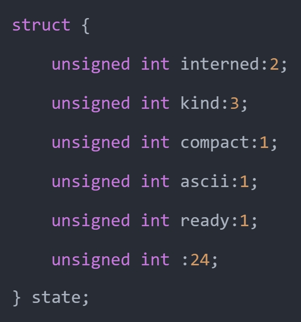

上一篇文章我们介绍了字符串的底层结构，看到里面有一个 state 字段，该字段也是一个结构体，内部定义了很多的标志位。

如果字符串的 interned 标志位大于 0，那么虚拟机将为其开启 intern 机制。那什么是 intern 机制呢？在 Python 中，某些字符串也可以像小整数对象池里的整数一样，共享给所有变量使用，从而通过避免重复创建来降低内存使用、减少性能开销，这便是 intern 机制。

Python 的做法是在虚拟机内部维护一个全局字典，所有开启 intern 机制的字符串均会保存在这里，后续如果需要使用的话，会尝试在全局字典中获取，从而实现避免重复创建的功能。

另外 intern 机制也分为多种。

~~~C
// Include/cpython/unicode.h
#define SSTATE_NOT_INTERNED 0
#define SSTATE_INTERNED_MORTAL 1
#define SSTATE_INTERNED_IMMORTAL 2
~~~

解释一下这几个字段：

- SSTATE_NOT_INTERNED：字符串未开启 intern 机制；
- SSTATE_INTERNED_MORTAL：字符串开启了 intern 机制，但它不是永久驻留的，在某些情况下可能会被回收；
- SSTATE_INTERNED_IMMORTAL：字符串开启了 intern 机制，会永远存活于内存中；

这些字段定义了字符串在内存管理中的不同驻留状态，从未驻留、短暂驻留到永久驻留，帮助优化字符串的内存使用和管理。

而当一个字符串要开启 intern 机制时，会调用 PyUnicode_InternInPlace 函数，看一下它的逻辑。

~~~c
// Objects/unicodeobject.c

void
PyUnicode_InternInPlace(PyObject **p)
{
    PyObject *s = *p;
    PyObject *t;
    // 类型检查，因为 intern 共享机制只能用在字符串对象上
    // PyUnicode_Check(s) -> isinstance(s, str)
    // PyUnicode_CheckExact(s) -> type(s) is str
    if (s == NULL || !PyUnicode_Check(s))
        return;
    if (!PyUnicode_CheckExact(s))
        return;
    // 执行到这儿，说明 s 一定指向字符串，那么检测它是否已经开启了 intern 机制
    // 这个函数的逻辑很简单，内部会获取 state.interned，看它是否大于 0
    // 如果已经被 intern 机制处理了，那么直接返回
    if (PyUnicode_CHECK_INTERNED(s))
        return;
    // 所有开启 intern 机制的字符串，都会保存在 interned 字典中
    // 如果 interned 字典为空，那么创建
    if (interned == NULL) {
        interned = PyDict_New();
        if (interned == NULL) {
            PyErr_Clear(); /* Don't leave an exception */
            return;
        }
    }
    // 将字符串同时作为 key 和 value 保存在 interned 字典中，即开启 intern 机制
    // PyDict_SetDefault 对应字典的 setdefault 方法
    t = PyDict_SetDefault(interned, s, s);
    if (t == NULL) {
        PyErr_Clear();
        return;
    }
    // 注意这里有一个让人混淆的地方，首先 t 和 s 都是 C 指针
    // 如果 t != s，说明它们指向了不同的字符串，如果 t == s，说明它们指向的是同一个字符串
    // 由于 s 同时作为 key 和 value，那么不管 s 指向的字符串是否在字典中已存在
    // PyObject_RichCompare(t, s, Py_EQ) 永远为真，也就是 t 和 s 指向的字符串的值是相等的
    // 只是当 t != s 时，说明它们指向的不是同一个字符串，但值相等
    // 这也意味着字典中已经存在某个 key，它指向的字符串维护了相同的文本数据
    // 那么增加 t 指向的字符串的引用计数，减少 s 指向的字符串的引用计数
    if (t != s) {
        Py_INCREF(t);
        Py_SETREF(*p, t);
        return;
    }
    // 否则说明 t == s，即 s 在字典中不存在，那么开启 interned 机制
    Py_REFCNT(s) -= 2;
    _PyUnicode_STATE(s).interned = SSTATE_INTERNED_MORTAL;
}
~~~

估计很多人都以为 Python 在创建字符串时，会先检测该字符串是否已经存在，如果有，就不用创建新的，这样可以节省空间。但其实不是这样的，事实上节省内存空间是没错的，可 Python 并不是在创建字符串的时候就通过 intern 机制实现了节省空间的目的。

对于任何一个字符串，Python 总是会为它申请内存，尽管创建出来的字符串在 interned 字典中已经存在了（有另外的字符串对象维护了相同的文本）。而这正是关键所在，通常 Python 在运行时创建了一个字符串对象（假设叫 temp）之后，基本上都会调用 PyUnicode_InternInPlace 对 temp 进行处理。

如果维护的值已经存在于 interned 字典中，那么 temp 指向的对象的引用计数就会减 1，然后会因引用计数为 0 而被销毁，只是昙花一现，然后归于湮灭。

> 所以现在我们就明白了 intern 机制，并不是说先判断是否存在，如果存在，就不创建。而是先创建，然后发现已经有其它的字符串维护了一个与之相同的文本数据，于是 intern 机制再将引用计数减一，导致引用计数为 0，最终被回收。

然后关于字符串对象的 intern 机制，还有一点需要注意。实际上，被 intern 机制处理过后的字符串分为两类，一类处于 SSTATE_INTERNED_IMMORTAL 状态，另一类处于 SSTATE_INTERNED_MORTAL 状态，这两种状态的区别在 unicode_dealloc 中可以清晰的看到。SSTATE_INTERNED_IMMORTAL 状态的字符串是永远不会被销毁的，它与解释器共存亡。

而 PyUnicode_InternInPlace 只能创建 SSTATE_INTERNED_MORTAL 的字符串对象，如果想创建 SSTATE_INTERNED_IMMORTAL 对象，必须通过另外的接口来强制改变 intern 状态。

~~~C
void
PyUnicode_InternImmortal(PyObject **p)
{
    PyUnicode_InternInPlace(p);
    if (PyUnicode_CHECK_INTERNED(*p) != SSTATE_INTERNED_IMMORTAL) {
        _PyUnicode_STATE(*p).interned = SSTATE_INTERNED_IMMORTAL;
        Py_INCREF(*p);
    }
}
~~~

但是问题来了，什么样的字符串才会开启 intern 机制呢？

**1）如果字符串为 ASCII 字符串，并且长度不超过 4096，那么会开启 intern 机制。**

~~~python
>>> s1 = "a" * 4096
>>> s2 = "a" * 4096
# 会开启 intern 机制，s1 和 s2 指向同一个字符串
>>> s1 is s2
True

# 长度超过了 4096，所以不会开启 intern 机制
>>> s1 = "a" * 4097
>>> s2 = "a" * 4097
>>> s1 is s2
False
~~~

**2）如果一个字符串只有一个字符，并且码点小于 256（一个字节可以表示），那么也会开启 intern 机制。**

~~~python
>>> hex(128)
'0x80'
# s1 和 s2 指向同一个字符串，因为开启了 intern 机制
>>> s1 = chr(128)
>>> s2 = "\x80"
>>> s1 is s2
True

# ASCII 字符指的是码点小于 128 的字符，显然 s1 和 s2 不是 ASCII 字符串
# 虽然码点小于 256，但长度不等于 1，所以不会开启 intern 机制
>>> s1 = chr(128) + "x"
>>> s2 = chr(128) + "x"
>>> s1 is s2
False
~~~

实际上，存储单个字符这种方式有点类似于 bytes 对象的缓存池。是的，正如整数有小整数对象池、bytes 对象有字符缓存池一样，字符串也有其对应的缓存池。

总之 intern 机制并不是大家想的那样：先检测字符串是否已经存在，如果有，就不用创建新的，从而节省内存。但其实不是这样的，节省内存空间是没错的，可 Python 并不是在创建字符串的时候就通过 intern 机制实现了节省空间的目的。对于任何一个字符串，解释器总是会为它创建对应的结构体实例，但如果发现创建出来的实例在 intern 字典中已经存在了，那么再将它销毁。

最后关于 intern 机制，在 Python 里面可以通过 sys.intern 函数强制开启。

~~~Python
>>> s1 = "憨pi-_-||"
>>> s2 = "憨pi-_-||"
>>> s1 is s2
False
>>> 
>>> s1 = sys.intern("憨pi-_-||")
>>> s2 = sys.intern("憨pi-_-||")
>>> s1 is s2
True
~~~

以上就是字符串的 intern 机制，下一篇文章来介绍字符串的相关操作是怎么实现的。

-------------

&nbsp;

**欢迎大家关注我的公众号：古明地觉的编程教室。**

**如果觉得文章对你有所帮助，也可以请作者吃个馒头，Thanks♪(･ω･)ﾉ。**

