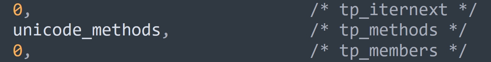

## 楔子

本文来说一说字符串的操作，字符串支持哪些操作，取决于类型对象 str，所以我们来看看 str 在底层的定义。

~~~c
// Objects/unicodeobject.c
PyTypeObject PyUnicode_Type = {
    PyVarObject_HEAD_INIT(&PyType_Type, 0)
    "str",                        /* tp_name */
    sizeof(PyUnicodeObject),      /* tp_basicsize */
    0,                            /* tp_itemsize */
    /* Slots */
    (destructor)unicode_dealloc,  /* tp_dealloc */
    0,                            /* tp_vectorcall_offset */
    0,                            /* tp_getattr */
    0,                            /* tp_setattr */
    0,                            /* tp_as_async */
    unicode_repr,                 /* tp_repr */
    &unicode_as_number,           /* tp_as_number */
    &unicode_as_sequence,         /* tp_as_sequence */
    &unicode_as_mapping,          /* tp_as_mapping */
    // ...
}        
~~~

bytes 对象和 str 对象的很多行为都是相似的，str 对象可以 encode 成 bytes 对象，bytes 对象可以 decode 成 str 对象。

看一下三个操作簇，字符串都支持，但根据 bytes 对象的经验，我们猜测 tp_as_number 里面实现的函数只有取模，也就是格式化。

~~~c
// Objects/unicodeobject.c

// 不出所料，只实现了一个取模
static PyNumberMethods unicode_as_number = {
    0,              /*nb_add*/
    0,              /*nb_subtract*/
    0,              /*nb_multiply*/
    unicode_mod,    /*nb_remainder*/
};

// 我们看到和 bytes 对象是几乎一样的
// 因为 str 对象和 bytes 都是不可变的变长对象，并且可以相互转化
// 因此它们的行为是高度相似的
static PySequenceMethods unicode_as_sequence = {
    (lenfunc) unicode_length,        /* sq_length */
    PyUnicode_Concat,                /* sq_concat */
    (ssizeargfunc) unicode_repeat,   /* sq_repeat */
    (ssizeargfunc) unicode_getitem,  /* sq_item */
    0,                               /* sq_slice */
    0,                               /* sq_ass_item */
    0,                               /* sq_ass_slice */
    PyUnicode_Contains,              /* sq_contains */
};

//也和 bytes 对象一样
static PyMappingMethods unicode_as_mapping = {
    (lenfunc)unicode_length,        /* mp_length */
    (binaryfunc)unicode_subscript,  /* mp_subscript */
    (objobjargproc)0,           /* mp_ass_subscript */
};
~~~

下面我们就通过源码来考察一下。

## 获取字符串的长度

获取字符串的长度会执行 unicode_length 函数。

~~~C
// Objects/unicodeobject.c
static Py_ssize_t
unicode_length(PyObject *self)
{
    if (PyUnicode_READY(self) == -1)
        return -1;
    return PyUnicode_GET_LENGTH(self);
}

// Include/cpython/unicodeobject.h
#define PyUnicode_GET_LENGTH(op)                \
    (assert(PyUnicode_Check(op)),               \
     assert(PyUnicode_IS_READY(op)),            \
     ((PyASCIIObject *)(op))->length)
~~~

比较简单，没什么可说的，length 字段维护的是字符串的长度。

## 字符串的相加

字符串相加会执行 PyUnicode_Concat 函数，将两个字符串组合成一个新的字符串。

~~~C
// Objects/unicodeobject.c
PyObject *
PyUnicode_Concat(PyObject *left, PyObject *right)
{   
    // 参数 left 和 right 指向两个要相加的字符串
    // result 则指向相加之后的字符串
    PyObject *result;
    // 还记得这个 Py_UCS4 吗，它是一个无符号 32 位整型
    Py_UCS4 maxchar, maxchar2;
    // left 的长度、right 的长度、相加之后的长度
    Py_ssize_t left_len, right_len, new_len;
    // 必须是两个字符串相加
    if (ensure_unicode(left) < 0)
        return NULL;

    if (!PyUnicode_Check(right)) {
        PyErr_Format(PyExc_TypeError,
                     "can only concatenate str (not \"%.200s\") to str",
                     right->ob_type->tp_name);
        return NULL;
    }
    if (PyUnicode_READY(right) < 0)
        return NULL;

    // 如果 left 指向空字符串，直接返回 right
    if (left == unicode_empty)
        return PyUnicode_FromObject(right);
    // 如果 right 指向空字符串，直接返回 left
    if (right == unicode_empty)
        return PyUnicode_FromObject(left);
    // 获取两个字符串的长度
    left_len = PyUnicode_GET_LENGTH(left);
    right_len = PyUnicode_GET_LENGTH(right);
    // 如果相加的之后的长度超过了 PY_SSIZE_T_MAX，那么报错
    if (left_len > PY_SSIZE_T_MAX - right_len) {
        PyErr_SetString(PyExc_OverflowError,
                        "strings are too large to concat");
        return NULL;
    }
    // 计算相加之后的字符串的长度
    new_len = left_len + right_len;
    // 解释一下 PyUnicode_MAX_CHAR_VALUE，它的逻辑很简单
    /* 如果是 ASCII 字符串，返回 0x7f
     * 如果 kind 等于 PyUnicode_1BYTE_KIND，返回 0xff
     * 如果 kind 等于 PyUnicode_2BYTE_KIND，返回 0xffff
     * 如果 kind 等于 PyUnicode_1BYTE_KIND，返回 0x10ffff */
    // 所以该函数计算的就是字符串使用的编码所能表示的最大范围
    maxchar = PyUnicode_MAX_CHAR_VALUE(left);
    maxchar2 = PyUnicode_MAX_CHAR_VALUE(right);
    // 显然要取 maxchar 和 maxchar2 之间两者较大的那一个
    maxchar = Py_MAX(maxchar, maxchar2);

    // PyUnicode_New 我们之前介绍过，它负责为字符串申请内存
    // new_len 表示要容纳多少个字符
    // maxchar 表示字符的最大码点，内部会基于 maxchar 选择一个合适的编码
    result = PyUnicode_New(new_len, maxchar);
    if (result == NULL)
        return NULL;
    // _PyUnicode_FastCopyCharacters 负责字符串之间的拷贝，它的原型如下：
    /* void
       _PyUnicode_FastCopyCharacters(PyObject *to, 
                                     Py_ssize_t to_start,
                                     PyObject *from, 
                                     Py_ssize_t from_start, 
                                     Py_ssize_t how_many)
       如果用 Python 代码举例的话，那么该函数所做的事情就等价于如下：
       for i in range(how_many):
           to[to_start + i] = from[from_start + i] */
    // 相当于 result[0: left_len] = left[0: left_len]
    _PyUnicode_FastCopyCharacters(result, 0, left, 0, left_len);
    // 相当于 result[left_len: left_len + right_len] = right[0: right_len]
    _PyUnicode_FastCopyCharacters(result, left_len, right, 0, right_len);
    assert(_PyUnicode_CheckConsistency(result, 1));
    return result;
}
~~~

可以看到逻辑还是很清晰的，不过和 bytes 对象不同，字符串没有实现缓冲区。但是在操作上，和 bytes 对象是类似的，如果有大量的字符串相加，那么效率会非常低下，官方建议是通过 join 的方式。

## 字符串的自定义方法

序列型对象除了拥有 tp_as_sequence 里面的方法之外，还可以有很多自定义方法，比如字符串可以转大小写，列表可以追加元素等等。下面来聊一聊字符串的自定义方法，在介绍类型对象的时候说过，实例对象的自定义方法都会放在类型对象的 tp_methods 字段里面。

tp_methods 字段的类型是 PyMethodDef 结构体数组，一个 PyMethodDef 结构体实例对应一个可调用方法。那么 PyMethodDef 长什么样子呢？

~~~C
// Include/methodobject.h
struct PyMethodDef {
    // 暴露给 Python 的方法名
    const char  *ml_name;   
    // 包含具体实现的 C 函数
    PyCFunction ml_meth;   
    // 函数的参数类型
    // 比如函数接收多少参数，是否支持关键字参数，
    // 是不是静态方法、类方法等等，这些都需要通过 ml_flags 指定
    int         ml_flags;   
    // 函数的 docstring
    const char  *ml_doc;    
};
~~~

字符串的自定义方法非常多，我们先从 Python 的角度罗列一下，然后再挑几个看一下源码实现。

~~~python
# 字符串转小写
print("ABC".lower())  # abc

# 字符串转大写
print("abc".upper())  # ABC

# 每个单词首字母大写，其它字母小写
print("my GRIL".title())  # My Gril

# 第一个单词首字母大写，其它字母小写
print("MY GIRL".capitalize())  # My girl

# 从字符两端开始去除指定的字符，比如位于 "001" 的字符会被去除
print("001古明地觉 1 号001".strip("001"))  # 古明地觉 1 号
# 也可以只从一端去除
print("001古明地觉 1 号001".lstrip("001"))  # 古明地觉 1 号001
print("001古明地觉 1 号001".rstrip("001"))  # 001古明地觉 1 号

# 查找指定的子串，返回子串第一次出现的位置
print("abcabcabc".index("bca"))  # 1
# 查找时也支持指定范围，比如从索引为 2 的位置开始查找
print("abcabcabc".index("bca", 2))  # 4

# index 方法如果在没有找到指定的子串时，会抛出 ValueError:
# 如果不希望报错，那么可以使用 find，当字符串不存在时会返回 -1
print("hello".find("ll"))  # 2
print("hello".find("lll"))  # -1
# find 也支持指定查找范围，并且是从左往右查找
# 如果使用 rfind，则可以实现从右往左查找，同理还有 rindex
print("abc abc".find("abc"))  # 0
print("abc abc".rfind("abc"))  # 4

# 统计指定子串的数量
print("abc abc abc".count("abc"))  # 3

# 是否以某个字符串开头
print("Hello".startswith("Hel"))  # True
print("Hello".startswith("hel"))  # False

# 是否以某个字符串结尾
print("world".endswith("rld"))  # True
print("world".endswith("rlD"))  # False

# 按照指定字符串进行分割，并支持传入 maxsplit 参数指定最大分割次数
print("a-b-c-d-e".split("-"))  # ['a', 'b', 'c', 'd', 'e']
print("a-b-c-d-e".split("-", 2))  # ['a', 'b', 'c-d-e']
# 如果不传递参数，那么会默认按照空白符（包含空格、Tab、换行等等）分隔
print("a  \n b \tc".split())  # ['a', 'b', 'c']
# 还可以从右向左分割，当然在不指定 maxsplit 参数时，效果和 split 一样
print("a-b-c-d-e".rsplit("-"))  # ['a', 'b', 'c', 'd', 'e']
print("a-b-c-d-e".rsplit("-", 2))  # ['a-b-c', 'd', 'e']

# 等价于 .split("\n")
print("a b\nc".splitlines())  # ['a b', 'c']

# 按照指定子串进行分割，返回一个三元组：(子串之前的部分, 子串, 子串之后的部分)
print("abcxxdef".partition("xx"))  # ('abc', 'xx', 'def')
# 当子串不存在时，会返回 (字符串本身, ""， "")
print("abc".partition("xx"))  # ('abc', '', '')

# 大小写交换
print("Hello World".swapcase())  # hELLO wORLD

# 对指定子串进行替换
print("abc abc abc".replace("abc", "ABC"))  # ABC ABC ABC
# 也可以指定最大替换次数
print("abc abc abc".replace("abc", "ABC", 2))  # ABC ABC abc

# 和 replace 作用相似，也是用来替换字符串指定部分
# 将 a 替换成 abc，将 x 替换成 xyz
trans = str.maketrans({"a": "abc", "x": "xyz"})
print("aaxx".translate(trans))  # abcabcxyzxyz
# 如果给 str.maketrans 只传一个参数，那么要传字典，并且 key 必须是单字符
# 如果给 str.maketrans 传递两个参数，那么两个参数必须是等长的字符串
trans = str.maketrans("abc", "ABC")
# a -> A，b -> B，c -> C
print("abccc".translate(trans))  # ABCCC
# 如果传三个参数，那么第三个参数也要是字符串
# 此时在替换的时候，还会去除掉位于 "def" 中的字符
trans = str.maketrans("abc", "ABC", "def")
print("abcdefabc".translate(trans))  # ABCABC
~~~

这些都属于基础内容了，我们挑几个看一下源码实现。

## 字符串的 join

字符串在相加时会创建一个新的字符串，所以如果有大量的字符串相加，那么效率会很低下。面对这种情况，官方的建议是通过 join 方法。

字符串的 join 方法在底层对应 PyUnicode_Join 函数。

~~~C
// Objects/unicodeobject.c
PyObject *
PyUnicode_Join(PyObject *separator, PyObject *seq)
{
    PyObject *res;  // 拼接结果
    PyObject *fseq;  // 拼接的字符串的数量
    Py_ssize_t seqlen;  // 总长度
    PyObject **items;  // PyObject * 数组首元素的地址
    
    // 遍历参数 seq，将里面的每个字符串拿出来放在列表中
    // 如果 seq 本身就是列表或元组，那么直接返回 seq
    fseq = PySequence_Fast(seq, "can only join an iterable");
    if (fseq == NULL) {
        return NULL;
    }

    // 列表或元组对应的结构体内部都有一个 ob_item 字段
    // 该字段是一个 PyObject * 类型的数组，负责保存具体的元素
    // 该函数会拿到 ob_item 数组，并赋值给 items
    items = PySequence_Fast_ITEMS(fseq);
    // 获取要拼接的字符串的数量
    seqlen = PySequence_Fast_GET_SIZE(fseq);
    // 调用 _PyUnicode_JoinArray 进行拼接
    res = _PyUnicode_JoinArray(separator, items, seqlen);
    Py_DECREF(fseq);
    return res;
}
~~~

核心在 _PyUnicode_JoinArray 函数里面，该函数的逻辑很长，但很简单。就是获取要拼接的每一个字符串的长度，然后加在一起，并取最大的存储单元，然后一次性申请对应的内存空间，再逐一进行拷贝。所以拷贝是避免不了的，+ 这种方式导致低效率的主要原因就在于大量临时字符串的创建和销毁。

## 字符串的 encode

在 Python 里面可以调用字符串的 encode 方法，得到 bytes 对象。那么它在底层是如何实现的呢？

~~~c
// Objects/unicodeobject.c
PyObject *
PyUnicode_AsEncodedString(PyObject *unicode,
                          const char *encoding,
                          const char *errors)
{
    PyObject *v;
    char buflower[11];
    
    // unicode 参数要指向一个字符串
    if (!PyUnicode_Check(unicode)) {
        PyErr_BadArgument();
        return NULL;
    }
    // 如果不指定编码，那么使用 UTF-8
    if (encoding == NULL) {
        return _PyUnicode_AsUTF8String(unicode, errors);
    }

    // 如果指定了编码，那么进行判断
    if (_Py_normalize_encoding(encoding, buflower, sizeof(buflower))) {
        char *lower = buflower;

        /* Fast paths */
        // 快分支，判断是否是 UTF-* 系列
        if (lower[0] == 'u' && lower[1] == 't' && lower[2] == 'f') {
            lower += 3;
            if (*lower == '_') {
                /* Match "utf8" and "utf_8" */
                lower++;
            }
            // 如果是 UTF-8
            if (lower[0] == '8' && lower[1] == 0) {
                return _PyUnicode_AsUTF8String(unicode, errors);
            }
            // 如果是 UTF-16
            else if (lower[0] == '1' && lower[1] == '6' && lower[2] == 0) {
                return _PyUnicode_EncodeUTF16(unicode, errors, 0);
            }
            // 如果是 UTF-32
            else if (lower[0] == '3' && lower[1] == '2' && lower[2] == 0) {
                return _PyUnicode_EncodeUTF32(unicode, errors, 0);
            }
        }
        // 否则判断是否是 ascii、latin1、iso8859-1 等编码
        else {
            if (strcmp(lower, "ascii") == 0
                || strcmp(lower, "us_ascii") == 0) {
                return _PyUnicode_AsASCIIString(unicode, errors);
            }
#ifdef MS_WINDOWS
            else if (strcmp(lower, "mbcs") == 0) {
                return PyUnicode_EncodeCodePage(CP_ACP, unicode, errors);
            }
#endif
            else if (strcmp(lower, "latin1") == 0 ||
                     strcmp(lower, "latin_1") == 0 ||
                     strcmp(lower, "iso_8859_1") == 0 ||
                     strcmp(lower, "iso8859_1") == 0) {
                return _PyUnicode_AsLatin1String(unicode, errors);
            }
        }
    }

    // 如果以上编码都不是，那么执行通用逻辑 _PyCodec_EncodeText
    v = _PyCodec_EncodeText(unicode, encoding, errors);
    if (v == NULL)
        return NULL;

    /* The normal path */
    if (PyBytes_Check(v))
        return v;

    /* If the codec returns a buffer, raise a warning and convert to bytes */
    if (PyByteArray_Check(v)) {
        int error;
        PyObject *b;

        error = PyErr_WarnFormat(PyExc_RuntimeWarning, 1,
            "encoder %s returned bytearray instead of bytes; "
            "use codecs.encode() to encode to arbitrary types",
            encoding);
        if (error) {
            Py_DECREF(v);
            return NULL;
        }

        b = PyBytes_FromStringAndSize(PyByteArray_AS_STRING(v),
                                      PyByteArray_GET_SIZE(v));
        Py_DECREF(v);
        return b;
    }

    PyErr_Format(PyExc_TypeError,
                 "'%.400s' encoder returned '%.400s' instead of 'bytes'; "
                 "use codecs.encode() to encode to arbitrary types",
                 encoding,
                 Py_TYPE(v)->tp_name);
    Py_DECREF(v);
    return NULL;
}
~~~

由于现在的主流编码是 utf-8，所以绝大部分情况都会执行 _PyUnicode_AsUTF8String 函数，我们看一下它的逻辑。

~~~c
// Objects/unicodeobject.c
PyObject *
_PyUnicode_AsUTF8String(PyObject *unicode, const char *errors)
{
    return unicode_encode_utf8(unicode, _Py_ERROR_UNKNOWN, errors);
}

static PyObject *
unicode_encode_utf8(PyObject *unicode, _Py_error_handler error_handler,
                    const char *errors)
{
    enum PyUnicode_Kind kind;
    void *data;
    Py_ssize_t size;

    if (!PyUnicode_Check(unicode)) {
        PyErr_BadArgument();
        return NULL;
    }

    if (PyUnicode_READY(unicode) == -1)
        return NULL;
    // 如果是 ASCII 字符串，那么直接获取每个字符的码点，创建 bytes 对象
    if (PyUnicode_UTF8(unicode))
        return PyBytes_FromStringAndSize(PyUnicode_UTF8(unicode),
                                         PyUnicode_UTF8_LENGTH(unicode));
    // 获取字符串的 kind
    kind = PyUnicode_KIND(unicode);
    // 获取首字符的地址，首字符紧跟在结构体后面
    data = PyUnicode_DATA(unicode);
    // 获取字符串的长度
    size = PyUnicode_GET_LENGTH(unicode);
    
    // 判断 kind 种类
    switch (kind) {
    default:
        Py_UNREACHABLE();
    case PyUnicode_1BYTE_KIND:
       // 基于不同 kind 调用不同的函数
        assert(!PyUnicode_IS_ASCII(unicode));
        return ucs1lib_utf8_encoder(unicode, data, size, error_handler, errors);
    case PyUnicode_2BYTE_KIND:
        return ucs2lib_utf8_encoder(unicode, data, size, error_handler, errors);
    case PyUnicode_4BYTE_KIND:
        return ucs4lib_utf8_encoder(unicode, data, size, error_handler, errors);
    }
}
~~~

整个过程还是我们之前说的，通过 utf-8 编码将每个字符转成对应的编号，组合起来得到的就是 bytes 对象。

## 小结

到目前为止，我们就说完了字符串相关的内容。必须要强调的是，字符串没有想象中的那么简单，而在 CPython 里面，字符串的源码将近两万行。

如果你还对字符串的其它操作感兴趣，想看看它的具体实现，可以自己深入源码探索一番。

----

&nbsp;

**欢迎大家关注我的公众号：古明地觉的编程教室。**

**如果觉得文章对你有所帮助，也可以请作者吃个馒头，Thanks♪(･ω･)ﾉ。**

