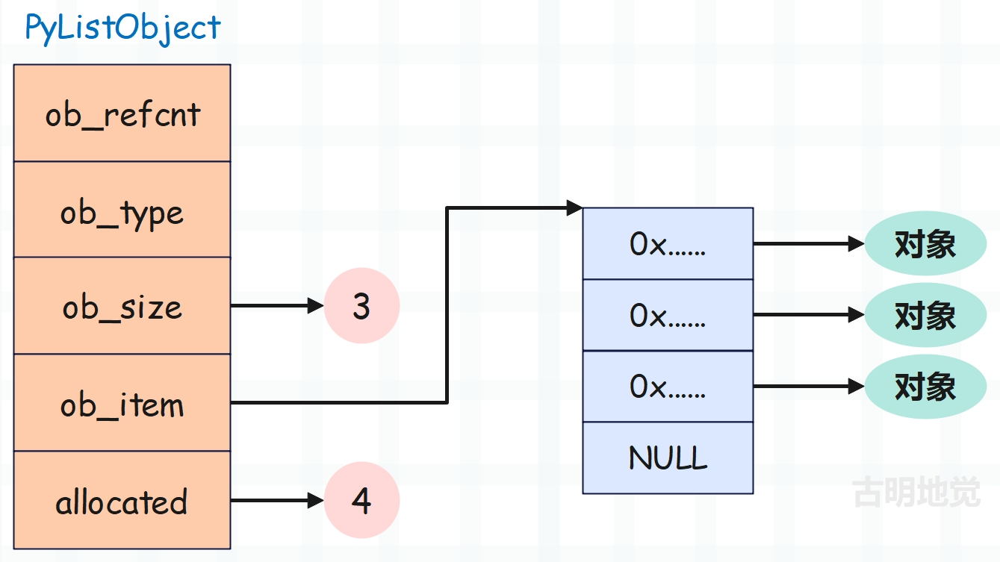
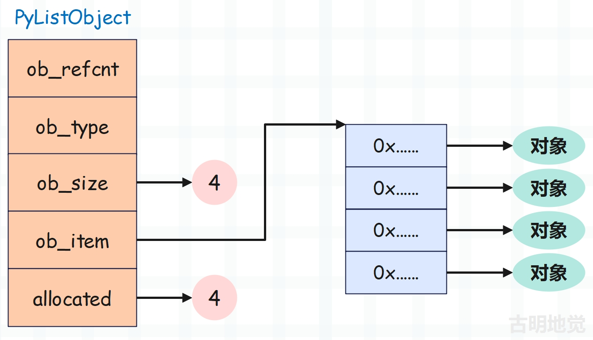
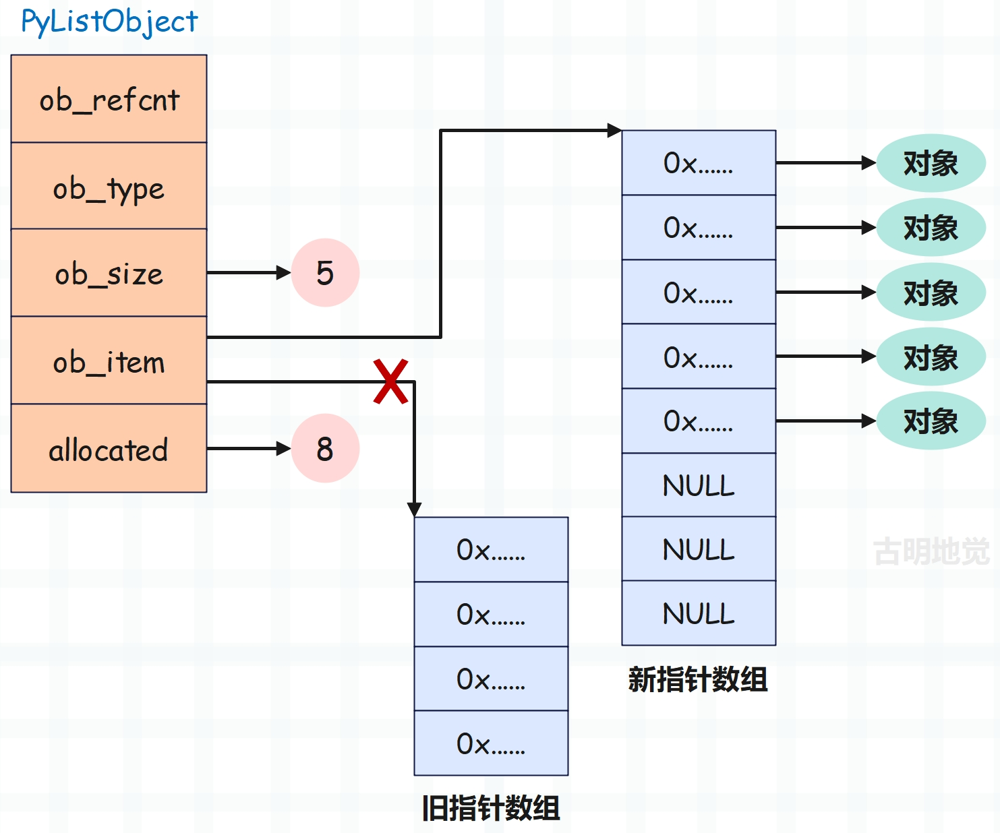
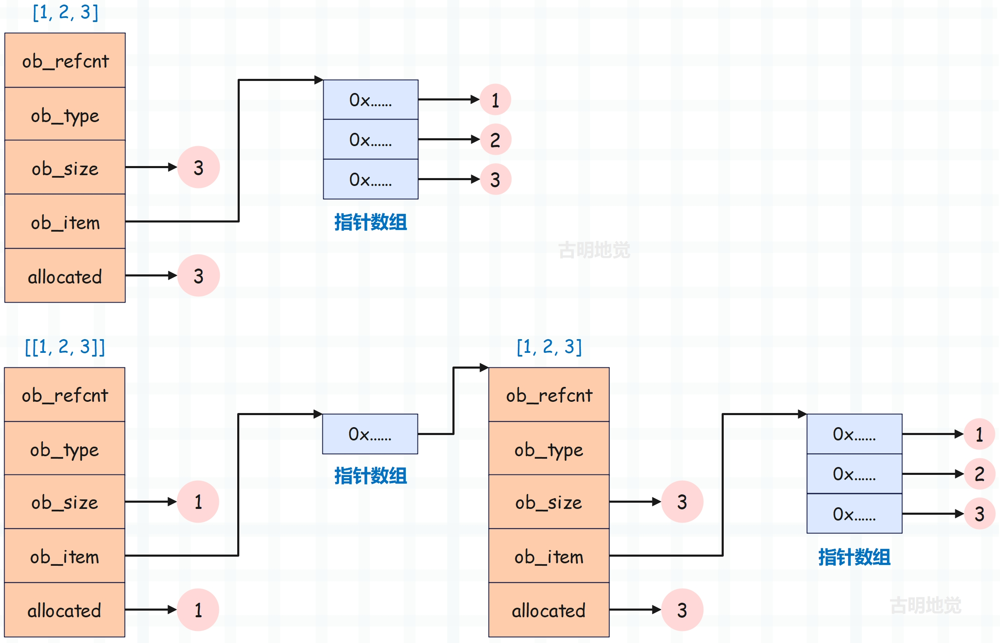

## 楔子

本篇文章来分析一下列表，在初学列表的时候，可能书上会告诉你列表就是一个大仓库，什么都可以存放。但在最开始的几个章节中，我们花了很大的笔墨介绍了 Python 的对象，并明白了变量的本质。所以到现在列表已经没有什么好神秘的了，它里面存放的元素其实都是泛型指针 PyObject \*。

并且根据我们使用列表的经验，可以得出以下两个结论：

- 每个列表的元素个数可以不一样，所以它是一个变长对象
- 可以对列表进行添加、删除、修改等操作，所以它是一个可变对象

## 列表的底层结构

列表在底层由 PyListObject 结构体表示，看一下它长什么样子。

~~~C
// Include/listobject.h
typedef struct {
    PyObject_VAR_HEAD
    /* Vector of pointers to list elements.  list[0] is ob_item[0], etc. */
    PyObject **ob_item;

    /* ob_item contains space for 'allocated' elements.  The number
     * currently in use is ob_size.
     * Invariants:
     *     0 <= ob_size <= allocated
     *     len(list) == ob_size
     *     ob_item == NULL implies ob_size == allocated == 0
     * list.sort() temporarily sets allocated to -1 to detect mutations.
     *
     * Items must normally not be NULL, except during construction when
     * the list is not yet visible outside the function that builds it.
     */
    Py_ssize_t allocated;
} PyListObject;
~~~

我们看到里面有如下字段：

- PyObject_VAR_HEAD：变长对象的公共头部信息；
- ob_item：一个二级指针，指向 PyObject \* 数组的首元素，这个指针数组保存的便是对象的指针，而操作数组都是通过 ob_item 来进行操作的；
- allocated：容量，我们知道列表底层使用了 C 的数组，而底层数组的长度就是列表的容量；

列表之所以要有容量的概念，是因为列表可以动态添加元素，但底层的数组在创建完毕之后，其长度却是固定的。所以当添加新元素时，发现数组已经满了，这个时候只能申请一个更长的数组，同时把原来数组中的元素依次拷贝到新数组里面（这一过程就是列表的扩容），然后再将新元素添加进去。

但是问题来了，总不可能每添加一个元素，就申请一次数组、将所有元素都拷贝一次吧。所以列表在扩容的时候，会将数组申请的长一些，从而在添加元素的时候不用每次都申请新的数组。

这便是列表的结构示意图，我们看到底层数组的长度为 4，说明此时列表的容量为 4。但是里面有 3 个 PyObject \* 指针，说明列表的 ob_size 是 3，或者说列表里面有 3 个元素。

如果这个时候我们往列表中 append 一个元素，那么会将这个新元素设置在数组索引为 ob_size 的位置、或者说第四个位置。一旦设置完，ob_size 会自动加 1，因为 ob_size 要和列表的长度保持一致。

列表的容量是 4，但此时长度也达到了 4，所以列表的长度、或者说元素个数已经达到了容量。这说明当下一次 append 的时候，已经没有办法再容纳新的元素了。当然最直观的还是这里的底层数组，很明显全都占满了。那这个时候如果想再接收新的元素的话，要怎么办呢？显然只能扩容了。

原来的容量是 4，长度也是 4，当再来一个新元素的时候由于没有位置了，所以要扩容。但扩容的时候肯定会将容量申请的大一些、即底层数组申请的长一些，具体申请多长，Python 内部有一个公式，我们后面会说。总之申请的新的底层数组长度是 8，那么说明列表的容量就变成了 8。

新数组申请之后，将原来旧数组中的 PyObject \* 按照顺序依次拷贝过去，再让 ob_item 指向新数组。然后把要添加的元素设置在新数组中索引为 ob_size 的位置、即第 5 个位置，并将 ob_size 加 1。最后将旧数组释放掉。

以上便是列表底层在扩容的时候所经历的过程。

> 由于扩容会申请新数组，然后将旧数组的元素拷贝到新数组中，所以这是一个时间复杂度为 O(n) 的操作。而 append 可能会导致列表扩容，因此 append 最坏情况下也是一个 O(n) 的操作，只不过扩容不会频繁发生，所以 append 方法的平均时间复杂度还是 O(1)。

另外我们还可以看到一个现象，那就是列表在底层是分开存储的，因为 PyListObject 结构体实例并没有存储相应的指针数组，而是存储了指向这个指针数组首元素的二级指针。显然我们添加、删除、修改元素等操作，都是通过 ob_item 二级指针来间接操作指针数组。

至于这么做的原因，我们在介绍 Python 对象的时候就说过了，不记得了的话，可以回去翻一翻。

所以底层对应的 PyListObject 实例的大小其实是不变的，因为指针数组没有存在 PyListObject 里面。但 Python 在计算内存大小的时候是会将这个指针数组也算进去的，所以列表的大小是可变的。

而且我们知道，列表在 append 之后地址是不变的，至于原因上面的几张图已经解释得很清楚了。

如果长度没有达到容量，那么 append 其实就是往底层数组中设置了一个新元素。如果达到容量了，那么会扩容，但扩容只是申请一个新的指针数组，然后让 ob_item 重新指向罢了。所以底层的指针数组会变，但是 PyListObject 结构体实例本身是没有变化的，因此列表在执行 append、extend、pop、insert 等操作时，地址不会发生变化。

下面再来看看列表所占的内存大小是怎么算的，首先 PyListObject 里面的 PyObject_VAR_HEAD 占 24 字节，ob_item 占 8 字节，allocated 占 8 字节，总共 40 字节。但是不要忘记，在计算列表大小的时候，ob_item 指向的指针数组也要算在内。所以：列表的大小 = 40 + 8 * 指针数组长度（或者说列表容量）。注意是指针数组长度，可不是列表长度，因为数组一旦申请了，不管你用没用，大小就摆在那里了。就好比你租了间房子，就算不住，房租该交还是得交。

~~~Python
# 显然一个空数组占 40 个字节
print([].__sizeof__())  # 40

# 40 + 3 * 8 = 64
print([1, 2, "x" * 1000].__sizeof__())  # 64
# 虽然里面有一个长度为 1000 的字符串
# 但我们说列表存放的都是指针，所以大小都是 8 字节

# 注意：我们通过 lst = [1, 2, 3] 这种方式创建列表的话
# 不管内部元素有多少个, 其 ob_size 和 allocated 都是一样的
# 只有当列表在添加元素的时候发现容量不够了才会扩容
lst = list(range(10))
# 40 + 10 * 8 = 120
print(lst.__sizeof__())  # 120

# 长度为 4，此时容量也是 4
lst = ["巭", "孬", "嫑", "睡觉"]
# 大小为 40 + 4 * 8 = 72
print(lst.__sizeof__())  # 72
# 添加一个元素
lst.append("觉得睡啊")
# 大小变成了 40 + 8 * 8 = 104
# 说明当发生扩容时，底层数据可以容纳 8 个元素
print(lst.__sizeof__())  # 104
~~~

关于列表的长度和容量的关系，以及扩容的规则，我们后续再聊。总之目前我们知道列表的大小是怎么计算的，以及为什么列表在通过索引定位元素的时候，时间复杂度是 O(1)。因为列表存储的都是对象的指针，不管对象有多大，其指针大小是固定的，都是 8 字节，通过索引可以瞬间计算出偏移量。

~~~Python
print([1, 2, 3].__sizeof__())  # 64
print([[1, 2, 3]].__sizeof__())  # 48
~~~

相信上面这个结果，你肯定能分析出原因。因为第一个列表中有 3 个指针，所以大小是 40 + 24 = 64。而第二个列表中有一个指针，所以是 40 + 8 = 48。用一张图来展示一下 [1, 2, 3] 和 [[1, 2, 3]] 的底层结构，看看它们之间的区别：

到此相信你已经彻底掌握列表的结构了，那么下一篇文章我们来介绍一下列表的长度和容量之间的关系，以及扩容是怎么实现的。

-----

&nbsp;

**欢迎大家关注我的公众号：古明地觉的编程教室。**

**如果觉得文章对你有所帮助，也可以请作者吃个馒头，Thanks♪(･ω･)ﾉ。**

