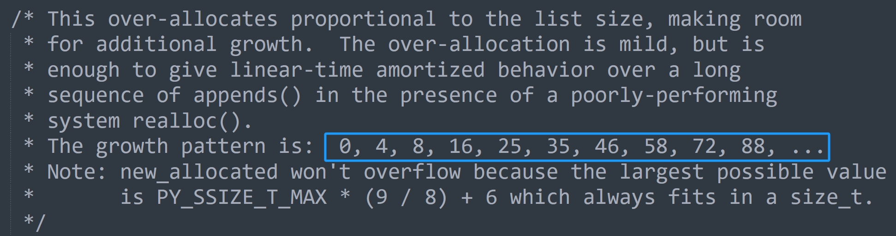

本篇文章来说一说列表的扩容，我们知道列表在添加元素时，如果发现底层的指针数组已经满了，那么会进行扩容，申请一个更大的数组。

下面就来看看底层是怎么实现的，相关操作都位于 Objects/listobject.c 中。

~~~C
static int
list_resize(PyListObject *self, Py_ssize_t newsize)
{   
    // 参数 self 就是列表，newsize 指的是元素在添加之后的 ob_size
    // 比如列表的 ob_size 和容量都是 4，append 的时候发现容量不够
    // 所以会扩容，那么这里的 newsize 就是 5
    // 如果是 extend 添加 3 个元素，那么这里的 newsize 就是 7
    // 当然 list_resize 这个函数不仅可以扩容，也可以缩容
    // 假设列表原来有 1000 个元素，这个时候将列表清空了，那么容量肯定缩小，不然会浪费内存
    // 如果清空了列表，那么这里的 newsize 显然就是 0

    // 二级指针，指向指针数组的首元素
    PyObject **items;
    // 新的容量，以及新的指针数组的内存大小
    size_t new_allocated, num_allocated_bytes;
    // 获取原来的容量
    Py_ssize_t allocated = self->allocated;

    // 如果 newsize 达到了容量的一半，但还没有超过容量
    // 那么意味着 newsize、或者新的 ob_size 和容量是匹配的
    // 所以容量不会变化，直接将列表的 ob_size 设置为 newsize 即可
    if (allocated >= newsize && newsize >= (allocated >> 1)) {
        assert(self->ob_item != NULL || newsize == 0);
        Py_SIZE(self) = newsize;
        return 0;
    }

    // 走到这里说明容量和 newsize 不匹配了，所以要进行扩容或者缩容
    // 因此要申请新的底层数组，那么长度是多少呢？
    // 这里给出了公式，一会儿我们可以通过 Python 进行测试
    new_allocated = (size_t)newsize + (newsize >> 3) + (newsize < 9 ? 3 : 6);
    // 容量也是有范围的，乘上 8 字节不能超过 PY_SSIZE_T_MAX
    if (new_allocated > (size_t)PY_SSIZE_T_MAX / sizeof(PyObject *)) {
        PyErr_NoMemory();
        return -1;
    }
    // 如果 newsize 为 0，那么容量也为 0
    if (newsize == 0)
        new_allocated = 0;
    // 分配内存
    num_allocated_bytes = new_allocated * sizeof(PyObject *);
    items = (PyObject **)PyMem_Realloc(self->ob_item, num_allocated_bytes);
    if (items == NULL) {
        PyErr_NoMemory();
        return -1;
    }
    // 将 ob_items 字段设置为 items
    self->ob_item = items;
    // 将 ob_size 字段设置为 newsize
    Py_SIZE(self) = newsize;
    // 将 allocated 字段设置为 new_allocated
    self->allocated = new_allocated;
    return 0;
}
~~~

我们看到还是很简单的，没有什么黑科技。然后是列表扩容的时候，容量和元素个数之间的规律。其实在 list_resize 函数中是有注释的，其中有这么一行。

说明我们往一个空列表中不断 append 元素的时候，容量会按照上面的规律进行变化，我们来试一下。

~~~python
lst = []
allocated = 0
print("此时容量是: 0")

for item in range(100):
    lst.append(item)  # 添加元素
    # 计算 ob_size
    ob_size = len(lst)
    # 判断 ob_size 和当前的容量
    if ob_size > allocated:
        # 列表的大小减去空列表的大小，再除以 8 显然就是容量
        allocated = (lst.__sizeof__() - [].__sizeof__()) // 8
        print(f"列表扩容啦, 新的容量是: {allocated}")
"""
此时容量是: 0
列表扩容啦, 新的容量是: 4
列表扩容啦, 新的容量是: 8
列表扩容啦, 新的容量是: 16
列表扩容啦, 新的容量是: 25
列表扩容啦, 新的容量是: 35
列表扩容啦, 新的容量是: 46
列表扩容啦, 新的容量是: 58
列表扩容啦, 新的容量是: 72
列表扩容啦, 新的容量是: 88
列表扩容啦, 新的容量是: 106
"""        
~~~

我们看到和官方给的结果是一样的，显然这是毫无疑问的，根据底层的公式也能算出来。

~~~Python
ob_size = 0
allocated = 0

print(allocated, end=" ")
for item in range(100):
    newsize = ob_size + 1
    if newsize > allocated:
        allocated = (newsize + (newsize >> 3) + 6) & ~3
        print(allocated, end=" ")
    ob_size = newsize
"""
0 4 8 16 24 32 40 52 64 76 92 108 
"""
~~~

注：扩容是在添加元素的时候发现容量不够发生的，也就是底层数组存储的实际元素的个数（列表长度）等于数组长度，没办法再容纳新的元素了，所以要扩容。

如果我们直接通过 lst = [] 这种形式创建列表的话，那么其长度和容量是一样的。

~~~python
lst = [0] * 1000
# 长度和容量一致
print(
    len(lst), (lst.__sizeof__() - [].__sizeof__()) // 8
)  # 1000 1000

# 但再添加一个元素的话, 那么 ob_size 会变成 1001，大于容量 1000
# 所以此时列表就要扩容了, 执行 list_resize，里面的 new_size 就是 1001
# 然后是怎么分配容量来着，new_allocated = (size_t)newsize + (newsize >> 3) + (newsize < 9 ? 3 : 6)
print(
    "新容量:", 1001 + (1001 >> 3) + (3 if 1001 < 9 else 6)
)  # 新容量: 1132

# append 一个元素，列表扩容
lst.append(123)
# 计算容量
print((lst.__sizeof__() - [].__sizeof__()) // 8)  # 1132
~~~

结果是一样的，因为底层就是这么实现的，所以结果必须一样。只不过我们通过这种测试的方式证明了这一点，也加深了对列表的认识。

需要注意的是，会影响列表元素个数的操作（append、extend、insert、pop 等等），在执行前都会先执行一下 list_resize 进行容量检测。如果计算之后的 newsize 和 allocated 之间的关系是匹配的，即 allocated//2 <= newsize <= allocated，那么只需要将 ob_size 的大小更新为 newsize 即可。如果不匹配，那么还要进行扩容，此时是一个 O(n) 的操作。

介绍完扩容，再来介绍缩容，因为列表元素个数要是减少到和容量不匹配的话，也要进行缩容。

举个生活中的例子，假设你租了 10 间屋子用于办公，显然你要付 10 间屋子的房租，不管你有没有用，一旦租了肯定是要付钱的。同理底层数组也是一样，只要你申请了，不管有没有元素，内存已经占用了。但有一天你用不到 10 间屋子了，假设要用 8 间或者 9 间，那么会让剩余的屋子闲下来。但由于退租比较麻烦，并且只闲下来一两间屋子，所以干脆就不退了，还是会付 10 间屋子的钱，这样没准哪天又要用的时候就不用重新租了。

对于列表也是如此，在删除元素（相当于屋子不用了）的时候，如果发现长度还没有低于容量的一半，那么也不会缩容。但反之就要缩容了，比如屋子闲了 8 间，也就是只需要两间屋子就足够了，那么此时肯定要退租了，闲了 8 间，可能会退掉 6 间。

~~~Python
lst = [0] * 1000
print(
    len(lst), (lst.__sizeof__() - [].__sizeof__()) // 8
)  # 1000 1000

# 删除 500 个元素, 此时长度或者说 ob_size 就为 500
lst[500:] = []
# 但 ob_size 还是达到了容量的一半, 所以不会缩容
print(
    len(lst), (lst.__sizeof__() - [].__sizeof__()) // 8
)  # 500 1000

# 如果再删除一个元素的话, 那么不好意思, 显然就要进行缩容了
# 因为 ob_size 变成了 499, 小于 1000 // 2
# 缩容之后容量怎么算呢? 还是之前那个公式
print(499 + (499 >> 3) + (3 if 499 < 9 else 6))  # 567

# 测试一下, 删除一个元素, 看看会不会按照我们期待的规则进行缩容
lst.pop()
print(
    len(lst), (lst.__sizeof__() - [].__sizeof__()) // 8
)  # 499 567
~~~

一切都和我们想的是一样的，另外在代码中我们还看到一个 if 语句，就是如果 newsize 是 0，那么容量也是 0，来测试一下。

~~~Python
lst = [0] * 1000
print(
    len(lst), (lst.__sizeof__() - [].__sizeof__()) // 8
)  # 1000 1000

lst[:] = []
print(
    len(lst), (lst.__sizeof__() - [].__sizeof__()) // 8
)  # 0 0

# 如果按照之前的容量变化公式的话, 会发现结果应该是 3
# 但实际结果是 0, 就是因为多了 if 判断
# 如果 newsize 是 0, 就把容量也设置为 0
print(0 + (0 >> 3) + (3 if 0 < 9 else 6))  # 3
~~~

为什么要这么做呢？因为 Python 认为，列表长度为 0 的话，说明你不想用这个列表了，所以多余的 3 个也没有必要申请了。

还以租房为栗，如果你一间屋子都不用了，说明你可能不用这里的屋子办公了，因此直接全部退掉。

**以上就是列表在改变容量时所采用的策略，我们从头到尾全部分析了一遍。下一篇文章来看一下列表的创建，以及缓存池。**

-----------

&nbsp;

**欢迎大家关注我的公众号：古明地觉的编程教室。**

**如果觉得文章对你有所帮助，也可以请作者吃个馒头，Thanks♪(･ω･)ﾉ。**

