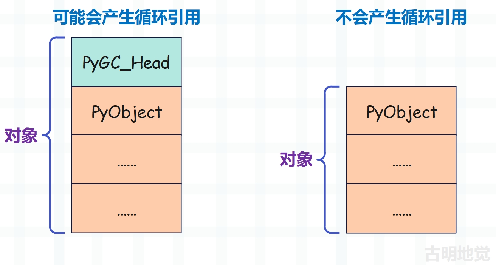

## 楔子

前面我们分析了列表的底层结构和扩容机制，本篇文章来聊一聊列表的创建和销毁，以及缓存池。

## 列表的创建

创建列表，解释器只提供了唯一的一个 Python/C API，也就是 PyList_New。这个函数接收一个 size 参数，允许我们在创建 PyListObject 对象时指定底层的 PyObject \* 数组的长度。

~~~C
//Objects/listobject.c
PyObject *
PyList_New(Py_ssize_t size)
{
    // 声明一个 PyListObject * 变量
    // 指向即将创建的 PyListObject 对象
    PyListObject *op;
    // 底层数组的长度必须大于等于 0
    if (size < 0) {
        PyErr_BadInternalCall();
        return NULL;
    }
    // numfree 表示缓存池中已缓存的元素个数
    // 如果大于 0，证明有可用元素，那么会从缓存池中获取
    if (numfree) {
        // 可用元素的数量减一
        numfree--;
        // 获取缓存的列表指针，并将指向的列表的引用计数设置为 1
        op = free_list[numfree];
        _Py_NewReference((PyObject *)op);
    } else {
        // 如果缓存池中没有可用元素，那么通过 PyObject_GC_New 申请内存
        // 问题来了，之前申请内存不是用的 PyObject_New 吗
        // 这里为啥换成 PyObject_GC_New 呢？我们稍后再说
        op = PyObject_GC_New(PyListObject, &PyList_Type);
        if (op == NULL)
            return NULL;
    }
    // 如果 size <= 0，那么一定等于 0，此时列表不包含任何元素
    if (size <= 0)
        // 那么 ob_item 直接设置为 NULL
        op->ob_item = NULL;
    else {
        // 否则为底层数组申请内存，因为存储的都是指针
        // 所以大小为 size * sizeof(PyObject *)
        op->ob_item = (PyObject **) PyMem_Calloc(size, sizeof(PyObject *));
        if (op->ob_item == NULL) {
            Py_DECREF(op);
            return PyErr_NoMemory();
        }
    }
    // 将 ob_size 和 allocated 均设置为 size
    Py_SIZE(op) = size;
    op->allocated = size;
    // 让列表被 GC 跟踪
    _PyObject_GC_TRACK(op);
    // 转成泛型指针之后返回
    return (PyObject *) op;
}
~~~

整个过程非常好理解，就是先创建一个 PyListObject 对象，然后再为底层数组申请内存，最后通过 ob_item 字段将两者关联起来。当然这个过程中会使用缓存池，关于缓存池一会儿再聊。

然后还要说一下内存申请函数，在这之前我们看到申请内存用的是 PyObject_New 函数，它和这里的 PyObject_GC_New 有什么区别呢？由于涉及到 Python 的内存管理，我们暂时先不聊那么深，大家先有个基本了解即可，等到介绍内存管理和垃圾回收的时候会详细剖析。

我们知道 Python 对象在底层都是一个结构体，并且结构体内部嵌套了 PyObject。但对于那些能够产生循环引用的可变对象来说，它们除了 PyObject 之外，还包含了一个 PyGC_Head，用于垃圾回收。

所以 PyObject_New 和 PyObject_GC_New 接收的参数是一样的，但后者会多申请 16 字节的内存，这 16 字节是为 PyGC_Head 准备的。那么问题来了，PyGC_Head 在什么地方呢？

PyGC_Head 就在 PyObject 的前面，但是注意：虽然为 PyGC_Head 申请了内存，但返回的是 PyObject 的地址。至于这里面的更多细节，后续在剖析内存管理和垃圾回收的时候细说，目前先简单了解一下即可。

然后再说一下计算内存的两种方式：

~~~Python
import sys

lst = []
# 可以调用 __sizeof__ 方法计算对象的内存
print(lst.__sizeof__())  # 40
# 也可以通过 sys.getsizeof 函数
print(sys.getsizeof(lst))  # 56
~~~

我们看到 sys.getsizeof 算出的结果会多出 16 字节，相信你能猜到原因，因为它将 PyGC_Head 也算进去了，而对象的 \_\_sizeof\_\_ 方法则不会算在内。

不过对于字符串、整数、浮点数这种不会产生循环引用的对象来说，由于没有 PyGC_Head，所以两种方式计算的结果是一样的。

~~~Python
import sys

print("".__sizeof__())  # 49
print(sys.getsizeof(""))  # 49

print((123).__sizeof__())  # 28
print(sys.getsizeof(123))  # 28
~~~

以上就是列表的创建，整个过程不难理解。

## 列表的销毁

创建 PyListObject 对象时，会先检测缓存池 free_list 里面是否有可用的对象，有的话直接拿来用，否则通过 malloc 在系统堆上申请。列表的缓存池是使用数组实现的，里面最多维护 80 个 PyListObject 对象。

~~~C
// Objects/listobject.c
#ifndef PyList_MAXFREELIST
#define PyList_MAXFREELIST 80
#endif
// free_list 是一个 PyListObject * 数组，容量为 80
// 添加元素时会从数组的尾部添加，获取元素时也会从数组的尾部获取
static PyListObject *free_list[PyList_MAXFREELIST];
// 缓存池中可用元素数量
static int numfree = 0;
~~~

根据之前的经验我们知道，既然创建的时候能从缓存池中获取，那么在执行析构函数的时候也要把列表放到缓存池里面。看一下列表的析构函数，它由 PyList_Type 的 tp_dealloc 字段负责，而该字段被设置为 list_dealloc。

~~~C
// Objects/listobject.c
static void
list_dealloc(PyListObject *op)
{
    Py_ssize_t i;
    // 列表可能会产生循环引用，因此创建之后要被 GC 跟踪
    // 而现在要被回收了，所以也要取消 GC 跟踪
    PyObject_GC_UnTrack(op);
    // 这一步的作用，稍后再说
    Py_TRASHCAN_BEGIN(op, list_dealloc)
    // 先释放底层数组
    if (op->ob_item != NULL) {
        // 但是释放之前，还有一件重要的事情
        // 要将底层数组中每个指针指向的对象的引用计数都减去 1
        // 因为它们不再持有对"对象"的引用
        i = Py_SIZE(op);
        while (--i >= 0) {
            Py_XDECREF(op->ob_item[i]);
        }
        // 然后释放底层数组所占的内存
        PyMem_FREE(op->ob_item);
    }
    // 如果已缓存的元素个数小于 80 个，并且 op 指向的是列表
    // 那么将 op 追加到数组中，并将 numfree 自增 1
    if (numfree < PyList_MAXFREELIST && PyList_CheckExact(op))
        free_list[numfree++] = op;
    else
        // 否则将列表的内存释放掉
        Py_TYPE(op)->tp_free((PyObject *)op);
    Py_TRASHCAN_END
}
~~~

我们知道创建一个 PyListObject 对象会分为两步，先创建 PyListObject 对象，然后创建底层数组，最后让 PyListObject 对象的 ob_item 字段指向底层数组的首元素。同理，在销毁一个 PyListObject 对象时，会先释放 ob_item 维护的底层数组，然后在缓存池已满的情况下再释放 PyListObject 对象自身。

现在我们算是明白了缓存池的机制，本来在销毁列表时，要将它的内存释放。但因为缓存池机制，解释器并没有这么做，而是将它的指针放在了缓存池里，至于列表对象则依旧驻留在堆上，只是我们已经无法再访问了。

当以后创建新的 PyListObject 对象时，解释器会首先唤醒这些已经死去的 PyListObject 对象，给它们一个洗心革面、重新做人的机会。但需要注意的是，这里缓存的仅仅是 PyListObject 对象，至于底层数组，其 ob_item 已经不再指向了。

从 list_dealloc 中我们可以看到，PyListObject 对象的指针在放进缓存池之前，ob_item 指向的数组就已经被释放掉了，同时数组中指针指向的对象的引用计数会减 1。所以最终数组中这些指针指向的对象也大难临头各自飞了，或生存、或毁灭，总之此时和 PyListObject 之间已经没有任何联系了。

但是为什么要这么做呢？为什么不连底层数组也一起维护呢？可以想一下，如果继续维护的话，数组中指针指向的对象永远不会被释放，那么很可能会产生悬空指针的问题。

但实际上是可以将底层数组进行保留的，做法是只将数组中指针指向的对象的引用计数减 1，然后将数组中的指针都设置为 NULL，不再指向之前的对象，但并不释放底层数组本身所占用的内存空间。这样一来释放的内存不会交给系统堆，那么再次分配的时候，速度会快很多。但这样会带来两个问题。

+ 1）这些内存没人用也会一直占着，并且只能供 PyListObject 对象的 ob_item 指向的底层数组使用。
+ 2）基于缓存池获取的列表的容量，和新创建的列表的容量不一定匹配。比如底层数组长度为 6 的 PyListObject \* 被放入了缓存池，那么表示列表最多容纳 6 个元素，但如果我们要创建一个长度为 8 的列表怎么办？此时依旧要重新为底层数组申请内存。

因此基于以上两个原因，Python 选择将底层数组所占的内存交还给了系统堆，当然也节省了内存。

~~~Python
lst1 = [1, 2, 3]
print(id(lst1))  # 139672412671360
# 扔到缓存池中，放在数组的尾部
del lst1

# 从缓存池中获取，也会从数组的尾部开始拿
lst2 = [1, 2, 3]
print(id(lst2))  # 139672412671360

# 因此打印的地址是一样的
~~~

以上就是列表的创建和销毁，以及它的缓存池原理。

## trashcan 机制

在看列表的销毁过程时，我们注意到里面有这么一行代码。

~~~C
Py_TRASHCAN_BEGIN(op, list_dealloc)
~~~

这是做什么的呢，首先在 Python 中，我们可以创建具有深度递归的对象，比如：

~~~python
L = None

for i in range(2 ** 20):
    L = [L]

del L
~~~

此时的 L 就是一个嵌套了 2 \*\* 20 层的列表，当我们删除 L 的时候，会先销毁 L[0]、然后销毁 L\[0\]\[0\]，以此类推，直到递归深度为 2 \*\* 20。而这样的深度毫无疑问会溢出 C 的调用栈，导致解释器崩溃。但事实上我们在 del L 的时候解释器并没有崩溃，原因就是 CPython 发明了一种名为 trashcan 的机制，它通过延迟销毁的方式来限制销毁的递归深度。关于这一特性，我们知道就好了，不用太关注。

下一篇文章来聊一聊列表的操作在底层是怎么实现的。

-------

&nbsp;

**欢迎大家关注我的公众号：古明地觉的编程教室。**

**如果觉得文章对你有所帮助，也可以请作者吃个馒头，Thanks♪(･ω･)ﾉ。**

