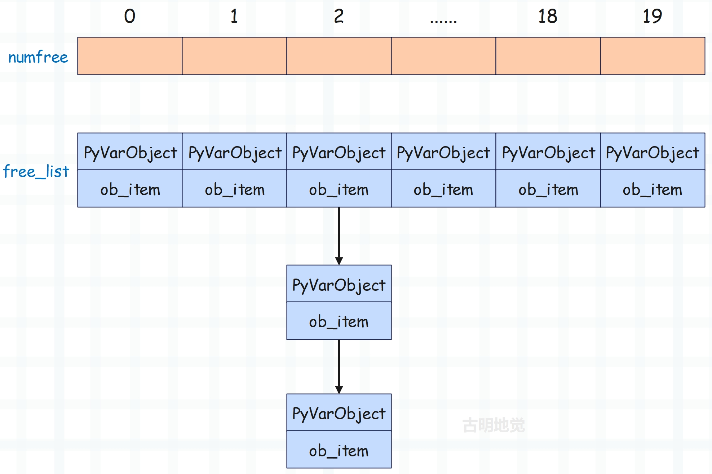
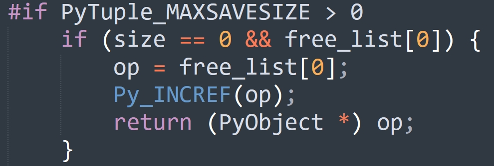

## 楔子

本篇文章来聊一聊元组，元组可以简单理解为不支持元素添加、修改、删除等操作的列表，也就是在列表的基础上移除了增删改操作。

所以从功能上来讲，元组只是列表的子集，那元组存在的意义是什么呢？首先元组可以作为字典的 key 以及集合的元素，因为字典和集合使用的数据结构是哈希表，它存储的元素一定是可哈希的，关于字典和集合我们后续章节会说。

而列表可以动态改变，所以列表不支持哈希。因此当我们希望字典的 key 是一个序列时，显然元组再适合不过了。比如要根据年龄和身高统计人数，那么就可以将年龄和身高组成元组作为字典的 key，人数作为字典的 value。所以元组可哈希，能够作为哈希表的 key，是元组存在的意义之一。当然元组还有其它作用，我们稍后再说。

> 元组如果可哈希，那么元组存储的元素必须都是可哈希的。只要有一个元素不可哈希，那么元组就会不可哈希。比如元组里面存储了一个列表，由于列表不可哈希，导致存储了列表的元组也会变得不可哈希。

## 元组的底层结构

根据我们使用元组的经验，可以得出元组是一个变长对象，但同时又是一个不可变对象。

~~~c
// Include/cpython/tupleobject.h
typedef struct {
    PyObject_VAR_HEAD
    PyObject *ob_item[1];
} PyTupleObject;
~~~

以上是元组在底层对应的结构体，包含引用计数、类型、ob_size、指针数组。然后数组声明的长度虽然是 1，但我们可以当成 n 来用。然后我们再通过结构体的定义，来对比一下它和列表的区别。

+ 元组没有 allocated、也就是容量的概念，这是因为它是不可变的，不支持 resize 操作。
+ 元组对应的指针数组是定义在结构体里面的，可以直接对数组进行操作。而列表对应的指针数组是定义在结构体外面的，两者通过二级指针进行关联，也就是通过二级指针来间接操作指针数组。

至于为什么要这么定义，我们在最开始介绍对象模型的时候也说得很详细了。可变对象的具体元素不会保存在结构体内部，而是会维护一个指针，指针指向的内存区域负责存储元素。当发生扩容时，只需改变指针指向即可，从而方便内存管理。

基于结构体的定义，我们也能分析出元组所占的内存大小，显然它等于 24 + 8 * 元组长度。

~~~python
>>> ().__sizeof__()
24
>>> (1,).__sizeof__()
32
>>> (1, 2).__sizeof__()
40
~~~

结果没有问题。

## 元组是怎么创建的？

元组支持的操作我们就不看了，因为它只支持查询操作，并且和列表是高度相似的。这里我们直接来看元组的创建过程。正如列表一样，解释器为创建 PyTupleObject 也提供了类似的初始化方法，即 PyTuple_New。

~~~C
// Objects/tupleobject.c
PyObject *
PyTuple_New(Py_ssize_t size)
{
    // 参数 size 表示元组的长度
    // op 指向创建的元组
    PyTupleObject *op;
    // 循环变量
    Py_ssize_t i;
    // size 必须大于等于 0
    if (size < 0) {
        PyErr_BadInternalCall();
        return NULL;
    }
    // PyTuple_MAXSAVESIZE 是一个宏，显然和缓存池相关
    // 关于缓存池我们一会儿再说
#if PyTuple_MAXSAVESIZE > 0
    if (size == 0 && free_list[0]) {
        op = free_list[0];
        Py_INCREF(op);
        return (PyObject *) op;
    }
    if (size < PyTuple_MAXSAVESIZE && (op = free_list[size]) != NULL) {
        free_list[size] = (PyTupleObject *) op->ob_item[0];
        numfree[size]--;
        _Py_NewReference((PyObject *)op);
    }
    else
#endif
    // 当不使用缓存池时，要在系统堆上申请内存
    {
        // size * sizeof(PyObject *) + sizeof(PyTupleObject) 便是元组大小
        // 该值不能超过 PY_SSIZE_T_MAX，否则报错
        if ((size_t)size > ((size_t)PY_SSIZE_T_MAX - sizeof(PyTupleObject) -
                    sizeof(PyObject *)) / sizeof(PyObject *)) {
            return PyErr_NoMemory();
        }
        // 为 PyTupleObject 和长度为 size 的指针数组申请内存
        // 然后将它的类型设置为 &PyTuple_Type，将 ob_size 设置为 size
        op = PyObject_GC_NewVar(PyTupleObject, &PyTuple_Type, size);
        if (op == NULL)
            return NULL;
    }
    // 将指针数组中所有元素设置为 NULL
    for (i=0; i < size; i++)
        op->ob_item[i] = NULL;
#if PyTuple_MAXSAVESIZE > 0
    if (size == 0) {
        free_list[0] = op;
        ++numfree[0];
        Py_INCREF(op);          /* extra INCREF so that this is never freed */
    }
#endif
    // 让 GC 进行跟踪
    _PyObject_GC_TRACK(op);
    // 转成泛型指针之后返回
    return (PyObject *) op;
}
~~~

相信这种代码逻辑现在对你来说已经没有任何难度了，另外源码中还有几个宏，不过不重要，因此这里直接去掉了。

以上就是元组创建的过程，但里面隐藏了很多的细节没有说，下面我们来介绍元组的缓存池，然后将细节一一揭开。

## 元组的缓存池

元组的缓存池也是通过数组来实现的。

~~~C
// Objects/tupleobject.c

#define PyTuple_MAXSAVESIZE     20
#define PyTuple_MAXFREELIST  2000

static PyTupleObject *free_list[PyTuple_MAXSAVESIZE];
static int numfree[PyTuple_MAXSAVESIZE];
~~~

里面出现了两个宏：

+ PyTuple_MAXSAVESIZE：缓存池的大小，默认为 20；
+ PyTuple_MAXFREELIST：缓存池的每个元素都对应一条链表，该宏表示每条链表最多容纳多少个节点（稍后解释）；

从定义中可以看到，元组的缓存池大小是 20，而我们之前介绍的列表的缓存池大小是 80。但这里的 20 和 80 还稍微有些不同，80 指的是列表缓存池的大小，除此之外没有别的含义。而 20 除了表示元组缓存池的大小之外，它还表示只有当元组的长度小于 20，回收时才会被放入缓存池。

当元组的长度为 n 时（其中 n < 20)，那么在回收的时候该元组就会放在缓存池中索引为 n 的位置。假设回收的元组长度为 6，那么就会放在缓存池索引为 6 的位置。

但是问题来了，如果要回收两个长度为 6 的元组该怎么办？很简单，像链表一样串起来就好了。所以 free_list 里面虽然存储的是 PyTupleObject \*，但每个 `(PyTupleObject *)->ob_item[0]`都存储了下一个 PyTupleObject \*。

因此你可以认为 free_list 存储了 20 条链表的头结点的指针，每条链表上面挂着具有相同 ob_size 的 PyTupleObject。比如 free_list[n] 便指向了长度为 n 的 PyTupleObject 组成的链表的头结点，至于每条链表的节点个数由 numfree 维护，并且最大不能超过 PyTuple_MAXFREELIST，默认是 2000。

这里再来重新捋一下，元组的缓存池是一个数组，并且索引为 n 的位置回收的是元素个数（ob_size）为 n 的元组，并且 n 不超过 20。但这样的话，具有相同长度的元组不就只能缓存一个了吗？比如我们有很多个长度为 2 的元组都要缓存怎么办呢？显然将它们以链表的形式串起来即可，正如图中显示的那样。至于长度为 n 的元组究竟缓存了多少个，则由 numfree[n] 负责维护。假设 free_list[2] 这条链表上挂了 1000 个 PyTupleObject，那么 numfree[2] 就等于 1000，即长度为 2 的元组被缓存了 1000 个。

当再回收一个长度为 2 的元组时，那么会让该元组的 ob_item[0] 等于 free_list[2]，然后 free_list[2] 等于该元组、numfree[2]++。所以这里的每一条链表和浮点数缓存池是类似的，也是采用的头插法。

我们看一下放入缓存池的具体过程，显然这一步发生在元组销毁的时候。

~~~C
// Objects/tupleobject.c
static void
tupledealloc(PyTupleObject *op)
{
    // 循环变量
    Py_ssize_t i;
    // 回收的元组的长度
    Py_ssize_t len =  Py_SIZE(op);
    // 让 GC 不再跟踪
    PyObject_GC_UnTrack(op);
    // 延迟释放，和列表是类似的
    Py_TRASHCAN_BEGIN(op, tupledealloc)
    
    if (len > 0) {
        i = len;
        // 减少内部元素指向对象的引用计数，因为元组不再持有对它们的引用
        while (--i >= 0)
            Py_XDECREF(op->ob_item[i]);
#if PyTuple_MAXSAVESIZE > 0
        // 回收的元组的长度必须小于 20，即元组长度不超过 20
        // 并且 numfree[index] 必须小于 2000，即每条链表最多缓存 2000 个元组
        if (len < PyTuple_MAXSAVESIZE &&
            numfree[len] < PyTuple_MAXFREELIST &&
            Py_TYPE(op) == &PyTuple_Type)
        {
            // ob_item[0] 充当了链表的 next 指针
            // 这里让 op->ob_item[0] 等于 free_list[index]
            // 然后让 free_list[index] 等于 op
            // 这样元组就缓存起来了，并成为链表新的头结点，即 free_list[index]
            op->ob_item[0] = (PyObject *) free_list[len];
            // 然后维护一下链表的节点个数
            numfree[len]++;
            free_list[len] = op;
            goto done; /* return */
        }
#endif
    }
    // 如果元组长度大于等于 20，或者缓存池已满，那么释放内存
    Py_TYPE(op)->tp_free((PyObject *)op);
done:
    Py_TRASHCAN_END
}
~~~

tupledealloc 函数在销毁元组时，会尝试放入缓存池中。那么同理，在创建元组时，也会尝试从缓存池中获取。我们再回过头看一下 PyTuple_New 这个函数，重新解释一下里面的细节。

~~~C
// Objects/tupleobject.c
PyObject *
PyTuple_New(Py_ssize_t size)
{
    // ...
#if PyTuple_MAXSAVESIZE > 0
    // 回收的元组的长度为 0 时比较特殊，一会单独说
    if (size == 0 && free_list[0]) {
        op = free_list[0];
        Py_INCREF(op);
        return (PyObject *) op;
    }
    // 当 0 < size < 20 时，直接通过 op = free_list[size] 从缓存池获取 
    if (size < PyTuple_MAXSAVESIZE && (op = free_list[size]) != NULL) {
        // 元组取走后，别忘记让 free_list[size] 指向下一个元素
        // 也就是 (PyTupleObject *) op->ob_item[0]
        free_list[size] = (PyTupleObject *) op->ob_item[0];
        // 维护对应的链表长度    
        numfree[size]--;
        // 引用计数初始化为 1
        _Py_NewReference((PyObject *)op);
    }
    else
#endif
    // ...
#if PyTuple_MAXSAVESIZE > 0
    if (size == 0) {
        free_list[0] = op;
        ++numfree[0];
        Py_INCREF(op); 
    }
#endif
    _PyObject_GC_TRACK(op);
    return (PyObject *) op;
}
~~~

到此，相信你已经明白元组的缓存池到底是怎么一回事了，说白了就是有 20 条链表，索引为 n 的链表存放长度为 n 的元组，因此可回收的元组的最大长度是 19。然后每条链表的长度小于 2000，也就是具有相同长度的元组最多回收 2000 个。至于链表的 next 指针，则由元组的 ob_item[0] 来充当，通过 ob_item[0] 来获取下一个元素。

~~~Python
>>> tpl = (1, 2, 3)
>>> print(id(tpl))
2279295395264
>>>
>>> del tpl  # 放入缓存池
>>>
>>> tpl = ("古明地觉", "古明地恋", "芙兰朵露")
>>> print(id(tpl))
2279295395264
~~~

可以看到打印的地址是一样的，因为第一次创建的元组被重复利用了。

另外我们说缓存池的长度为 20，会缓存长度为 0 ~ 19 的元组，每种规格的元组最多缓存 2000 个。其实这个说法不太严谨，应该说长度为 1 ~ 19 的元组会缓存 2000 个。如果元组长度为 0，那么它对应的链表只会容纳一个元素，这也说明了不管我们创建多少个空元组，最终在内存中只会存在一个。

~~~python
tpl1 = ()
tpl2 = ()
tpl3 = ()

print(id(tpl1) == id(tpl2) == id(tpl3))  # True
~~~

再来看看 PyTuple_New 这个函数：

从缓存池中获取之后只是增加了引用计数，因为长度为 0 的元组只会缓存一个。所以空元组可以认为是单例的，只有一份。

那么问题来了，为什么元组缓存池可以缓存的元组个数会这么多，每个链表缓存 2000 个，有 20 条链表，总共可以缓存将近 40000 个。这么做的原因就是，元组的使用频率远比我们想象的广泛，主要是它大量使用在我们看不到的地方。比如多元赋值：

~~~Python
a, b, c, d = 1, 2, 3, 4
~~~

在编译时，上面的 1, 2, 3, 4 实际上是作为元组被加载的，整个赋值相当于元组的解包。再比如函数、方法的返回值，如果是多返回值，本质上也是包装成一个元组之后再返回。

所以元组缓存池能缓存的对象个数，要远大于其它对象的缓存池。可以想象一个大型项目，里面的函数、方法不计其数，只要是多返回值，就会涉及到元组的创建，因此每种长度的元组缓存 2000 个是很合理的。当然如果长度达到了 20，就不会缓存了，这种元组的使用频率没有那么高。

然后再回顾一下元组的回收过程，会发现它和列表有一个很大的不同。列表在被回收时，它的指针数组会被释放；但元组不同，它在被回收时，底层的指针数组会保留，并且还巧妙地通过索引来记录了回收的元组的大小规格。元组的这项技术也被称为静态资源缓存，因为元组在执行析构函数时，不仅对象本身没有被回收，连底层的指针数组也被缓存起来了。那么当再次分配时，速度就会快一些。

~~~Python
from timeit import timeit

t1 = timeit(stmt="x1 = [1, 2, 3, 4, 5]", number=1000000)
t2 = timeit(stmt="x2 = (1, 2, 3, 4, 5)", number=1000000)

print(round(t1, 2))  # 0.05
print(round(t2, 2))  # 0.01
~~~

可以看到耗时，元组只是列表的五分之一。这便是元组的另一个优势，可以将资源缓存起来。而缓存的原因还是如上面所说，因为涉及大量的创建和销毁，所以这一切都是为了加快内存分配。

> 由于对象都在堆区，为了效率，Python 不得不大量使用缓存的技术。

## 小结

以上就是元组相关的内容，因为有了列表相关的经验，再来看元组就会快很多。当然啦，元组的一些操作我们没有说，因为和对应的列表操作是类似的。

-----

&nbsp;

**欢迎大家关注我的公众号：古明地觉的编程教室。**

**如果觉得文章对你有所帮助，也可以请作者吃个馒头，Thanks♪(･ω･)ﾉ。**

