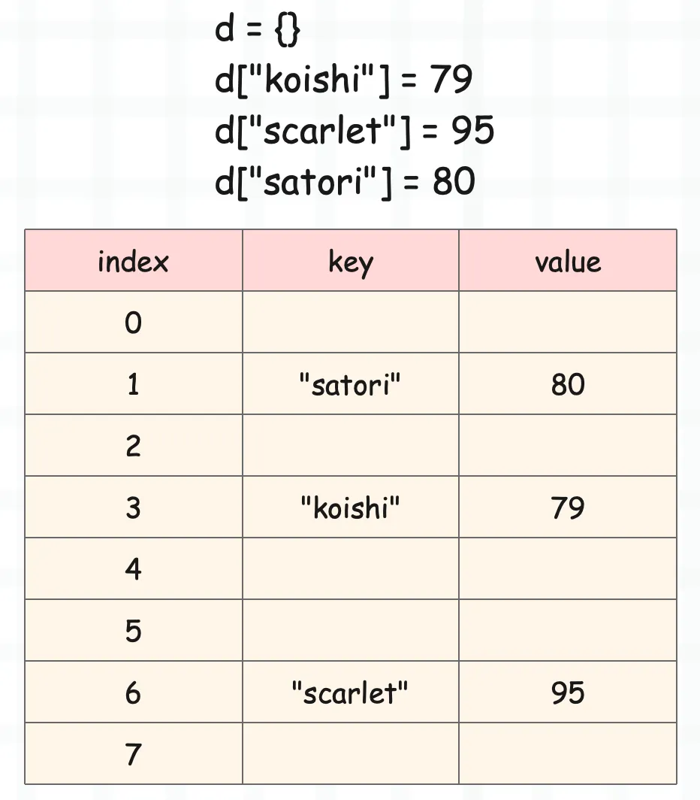
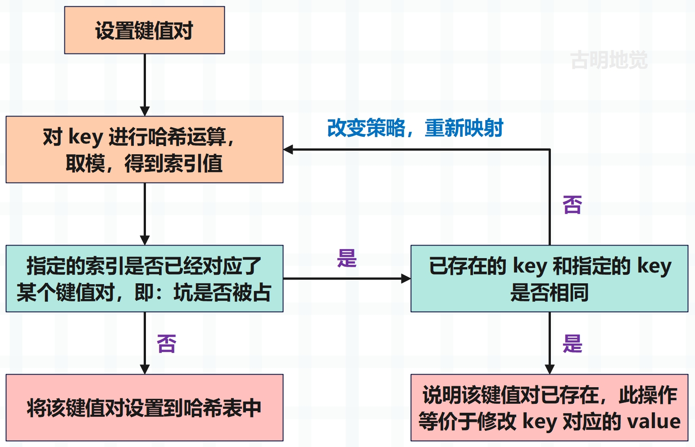
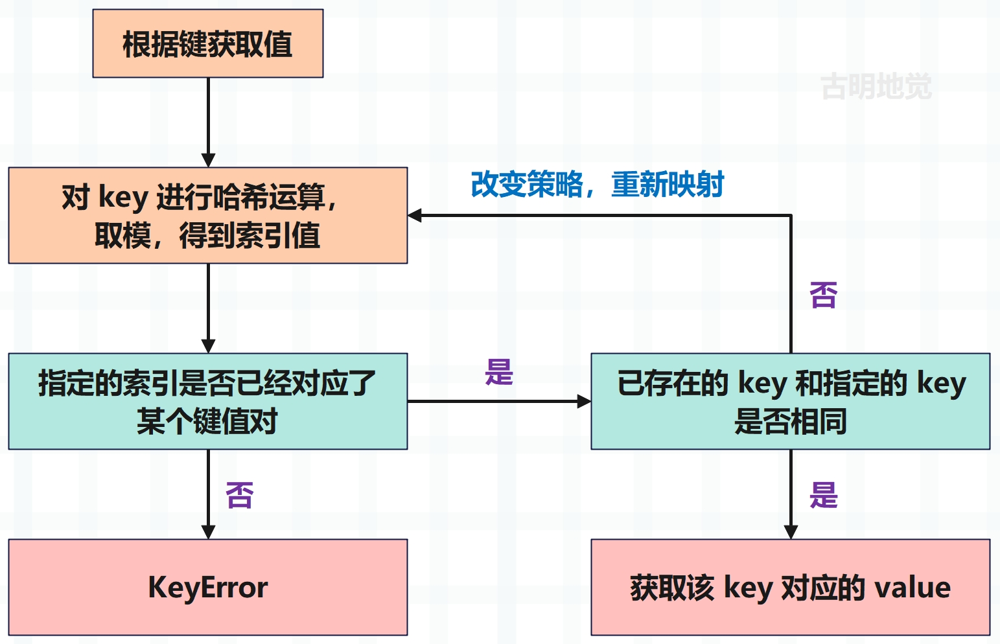

## 楔子

Python 的字典是一种映射型容器对象，保存了键（key）到值（value）的映射关系。通过字典，我们可以实现快速查找，JSON 这种数据结构也是借鉴了 Python 的字典。另外字典是经过高度优化的，因为 Python 底层也在大量地使用字典。

在 Python 里面我们要如何创建一个字典呢？

~~~python
# 创建一个字典
d = {"a": 1, "b": 2}
print(d)  # {'a': 1, 'b': 2}

# 或者我们还可以调用 dict，传入关键字参数即可
d = dict(a=1, b=2, c=3, d=4)
print(d)  # {'a': 1, 'b': 2, 'c': 3, 'd': 4}

# 当然 dict 里面还可以接收位置参数，但是最多接收一个
d1 = dict({"a": 1, "b": 2}, c=3, d=4)
d2 = dict([("a", 1), ("b", 2)], c=3, d=4)
print(d1)  # {'a': 1, 'b': 2, 'c': 3, 'd': 4}
print(d2)  # {'a': 1, 'b': 2, 'c': 3, 'd': 4}

# 还可以根据已有字典创建新的字典
d = {**{"a": 1, "b": 2}, "c": 3, **{"d": 4}}
print(d)  # {'a': 1, 'b': 2, 'c': 3, 'd': 4}

# 当然通过调用 dict 也是可以的
# 但是注意：** 这种方式本质上是把字典变成多个关键字参数
# 所以里面的 key 一定要符合 Python 的变量命名规范
d = dict(**{"a": 1, "b": 2}, c=3, **{"d": 4})
print(d)  # {'a': 1, 'b': 2, 'c': 3, 'd': 4}

try:
    # 这种是不合法的，因为 **{1: 1} 等价于 1=1
    d = dict(**{1: 1})
except Exception as e:
    print(e)  # keywords must be strings
# 但下面是合法的
d = {**{1: 1, 2: 2}}
print(d)  # {1: 1, 2: 2}
~~~

字典的底层是借助哈希表实现的，关于哈希表我们一会儿说，总之字典添加元素、删除元素、查找元素等操作的平均时间复杂度是 O(1)。

我们来测试一下字典的执行效率吧，看看它和列表之间的区别。

~~~Python
import time
import numpy as np

def test(count: int, value: int):
    """
    :param count: 循环次数
    :param value: 查询的元素
    :return:
    """
    # 包含一千个随机数的列表
    lst = list(np.random.randint(0, 2 ** 30, size=1000))
    # 基于列表构建一个字典
    d = dict.fromkeys(lst)

    # 查询元素 value 是否在列表中，循环 count 次，并统计时间
    t1 = time.perf_counter()
    for _ in range(count):
        value in lst
    t2 = time.perf_counter()
    print("列表查询耗时:", round(t2 - t1, 2))

    # 查询元素 value 是否在字典中，循环 count 次，并统计时间
    t1 = time.perf_counter()
    for _ in range(count):
        value in d
    t2 = time.perf_counter()
    print("字典查询耗时:", round(t2 - t1, 2))

# 分别查询一千次、一万次、十万次、二十万次
test(10 ** 3, 22333)
"""
列表查询耗时: 0.13
字典查询耗时: 0.0
"""
test(10 ** 4, 22333)
"""
列表查询耗时: 1.22
字典查询耗时: 0.0
"""
test(10 ** 5, 22333)
"""
列表查询耗时: 12.68
字典查询耗时: 0.01
"""
test(10 ** 5 * 2, 22333)
"""
列表查询耗时: 25.72
字典查询耗时: 0.01
"""
~~~

字典的查询速度非常快，从测试中我们看到，随着循环次数越来越多，列表所花费的总时间越来越长。但是字典由于查询所花费的时间极少，查询速度非常快，所以即便循环 50 万次，花费的总时间也不过才 0.01 秒左右。

此外字典还有一个特点，就是它的快不会受到数据量的影响，从含有一万个键值对的字典中查找，和从含有一千万个键值对的字典中查找，两者花费的时间几乎是没有区别的。

那么哈希表到底是什么样的数据结构，为什么能这么快呢？下面来分析一下。

## 什么是哈希表

映射型容器的使用场景非常广泛，基本上所有的主流语言都支持。例如 C++ 里面的 map 就是一种映射型容器，但它是基于红黑树实现的。红黑树是一种平衡二叉树，元素的插入、删除、查询等操作的时间复杂度均为 O(logN)，另外 Linux 的 epoll 也使用了红黑树。

而对于 Python 来讲，映射型容器指的就是字典，我们说字典在 Python 内部是被高度优化的。因为不光我们在用，虚拟机在运行时也在大量使用，比如类对象、自定义类的实例对象都有自己的属性字典，还有全局变量也是通过字典存储的。因此基于以上种种原因，Python 对字典的性能要求会更加苛刻。

所以 Python 字典采用的数据结构，在添加、删除、查询元素等方面肯定是要优于红黑树的，没错，就是哈希表。其原理是将 key 通过哈希函数进行运算，得到一个哈希值，再将这个哈希值映射成索引。

我们举例说明：

我们发现除了 key、value 之外，还有一个 index，因为哈希表本质上也是使用了索引。虽然数组在遍历的时候是个时间复杂度为 O(n) 的操作，但通过索引定位元素则是一个 O(1) 的操作，不管数组有多长，通过索引总是能瞬间定位到指定元素。

所以哈希表本质上就是一个数组，通过将 key 映射成一个数值，作为数组的索引，然后将键值对存在数组里面。至于它是怎么映射的，我们后面再谈，现在就假设是按照我们接下来说的方法映射的。

比如这里有一个能容纳 8 个元素的字典，如上图所示。我们先设置 d["koishi"]=79，那么会对 "koishi" 这个字符串进行哈希运算，得到一个哈希值，然后再让哈希值对当前的总容量进行取模，这样的话是不是能够得到一个小于 8 的数呢？假设是 3，那么就存在索引为 3 的位置。

然后 d["scarlet"]=95，按照同样的规则运算得到 6，那么就存在索引为 6 的位置；同理第三次设置 d["satori"]=80，对字符串 satori 进行哈希、取模，得到 1，那么存储在索引为 1 的位置。

同理当我们根据键来获取值的时候，比如：d["satori"]，那么同样会对字符串 "satori" 进行哈希、取模，得到索引发现是1，然后就把索引为 1 的 value 给取出来。

当然这种方式肯定存在缺陷，比如：

- 不同的 key 进行哈希、取模运算之后得到的结果一定是不同的吗？
- 在运算之后得到索引的时候，发现这个位置已经有人占了怎么办？
- 取值的时候，索引为 1，可如果索引为 1 对应的 key 和我们指定的 key 不一致怎么办？

所以哈希运算是会冲突的，如果冲突，那么 Python 底层会改变策略重新映射，直到映射出来的索引没有人用。比如我们设置一个新的键值对 d["tomoyo"]=88，可是 "tomoyo" 这个 key 映射之后得到的结果也是 1，而索引为 1 的地方已经被 key 为 "satori" 的键值对给占了，那么 Python 就会改变规则来对 "tomoyo" 重新映射，直到找到一个空位置。

但如果我们再次设置 d["satori"]=100，那么对 satori 映射得到的结果也是 1，而 key 是一致的，那么就会把对应的值进行修改。

同理，当我们获取值的时候，比如 d["tomoyo"]，那么对 key 进行映射，得到索引。但是发现该索引对应的 key 不是 "tomoyo" 而是 "satori"，于是改变规则（这个规则跟设置 key 冲突时，采用的规则是一样的），重新映射，得到新的索引，然后发现 key 是一致的，于是将值取出来。

所以从这里就已经能说明问题了，就是把 key 转换成数组的索引。可能有人问，这些键值对貌似不是连续的啊。对的，肯定不是连续的。并不是说你先存，你的索引就小、就在前面，这是由 key 进行哈希运算之后的结果决定的。

另外哈希表、或者说字典也会扩容，并且它还不是像列表那样，容量不够才扩容，而是当键值对个数达到容量的三分之二的时候就会扩容。

因为字典不可能会像列表那样，键值对之间是连续、一个一个挨在一起的。既然是哈希运算，得到的哈希值肯定是随机的，再根据哈希值映射出的索引也是随机的。那么在键值对个数达到容量三分之二的时候，计算出来的索引发生碰撞的概率会非常大，不可能等到容量不够了再去扩容，而是在键值对个数达到容量的三分之二时就要扩容，也就是申请一个更大的哈希表。

**一句话总结：哈希表就是一种空间换时间的方法。**

假设容量为 1024，那么就相当于数组有 1024 个位置，每个 key 都会映射成索引，找到自己的位置，将键值对存在里面。但很明显各自的位置是不固定的，肯定会空出来很多，但是无所谓，只要保证通过索引能在相应的位置找到它即可。

大量的文字会有些枯燥，我们用两张图来解释一下设置元素和获取元素的整个过程。

以上是设置元素，还是比较清晰的，果然图像是个好东西。再来看看获取元素：

以上就是哈希表的基本原理，说白了它就是个数组。存储键值对的时候，先将 key 映射成索引，然后基于索引找到数组中的指定位置，将键值对存进去。

## 小结

目前介绍的正是 Python 早期所采用的哈希表，但是它有一个严重的问题，就是内存浪费严重。下一篇文章我们就来看看字典的底层结构，以及 Python 是如何对哈希表进行优化的。

-----

&nbsp;

**欢迎大家关注我的公众号：古明地觉的编程教室。**

**如果觉得文章对你有所帮助，也可以请作者吃个馒头，Thanks♪(･ω･)ﾉ。**

