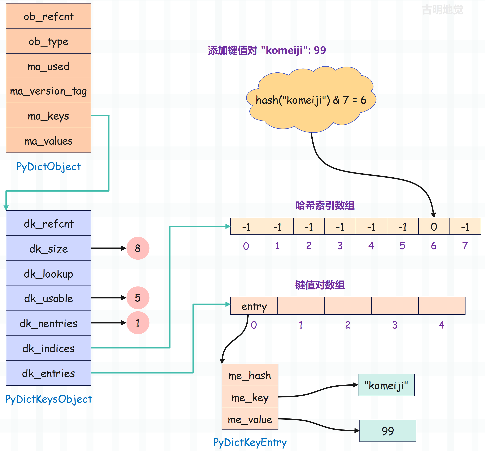
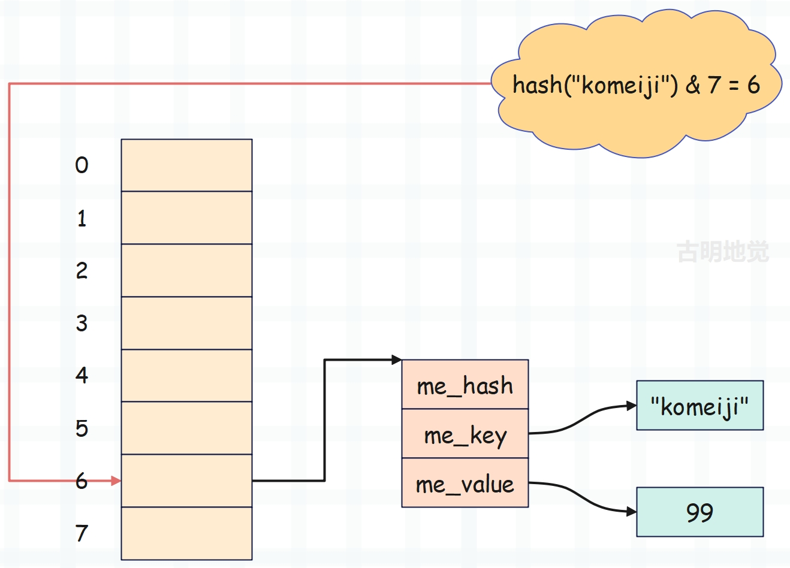
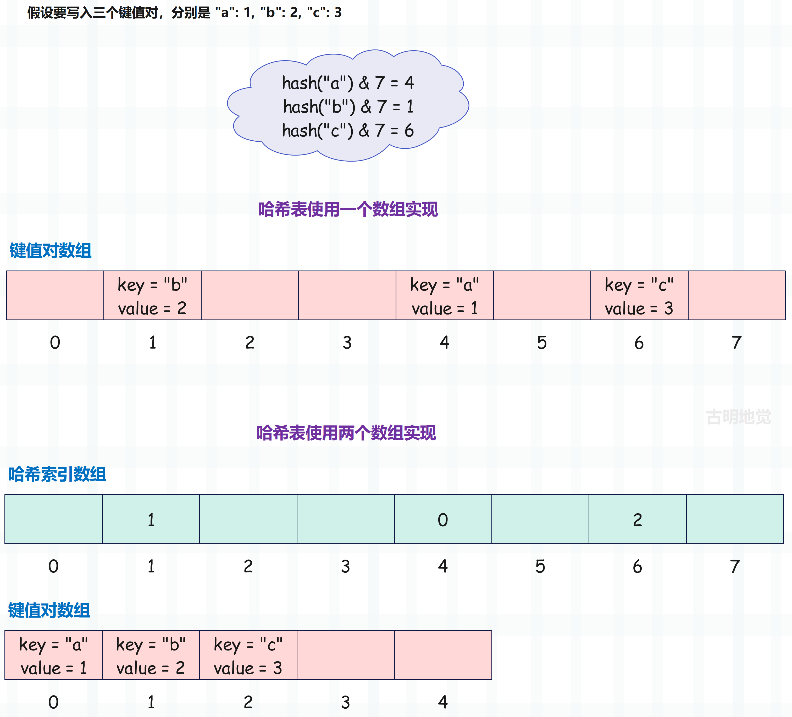

## 楔子

本篇文章来剖析一下字典的底层结构，看看它是怎么设计的，以及在设计的过程中都需要做哪些考量。另外字典是基于哈希表实现的，而传统的哈希表存在内存浪费的问题，那么字典又是如何优化的呢？带着这些问题，开始今天的内容。

## 字典的底层结构

Python 一切皆对象，字典也不例外，它在底层也由某个结构体表示。

~~~C
// Include/cpython/dictobject.h
typedef struct {
    PyObject_HEAD
    Py_ssize_t ma_used;
    uint64_t ma_version_tag;
    PyDictKeysObject *ma_keys;
    PyObject **ma_values;
} PyDictObject;
~~~

解释一下里面的字段的含义：

+ PyObject_HEAD：对象的头部信息，里面包含了对象的引用计数和类型。
+ ma_used：字典的长度，它充当了 ob_size。
+ ma_version_tag：字典的版本号，对字典的每一次修改都会导致其改变。该字段主要用于字典的迭代器，以检测字典在迭代过程中是否被修改。
+ ma_keys：从定义上来看它是一个指针，指向了 PyDictKeysObject。而 Python 里面的哈希表分为两种，分别是 combined table 和 split table，即结合表和分离表。如果是结合表，那么键值对全部由 ma_keys 维护，此时 ma_values 为 NULL。
+ ma_values：如果是分离表，那么键由 ma_keys 维护，值由 ma_values 维护。而 ma_values 是一个二级指针，指向 PyObject \* 类型的指针数组的首元素。

这里先解释一下结合表和分离表的由来。结合表的话，键和值会存在一起；分离表的话，键和值会存在不同的地方。那么问题来了，为什么要将哈希表分为两种呢？事实上，早期的哈希表只有结合表这一种，并且现在创建一个字典使用的也是结合表。

~~~Python
from ctypes import *

class PyObject(Structure):
    _fields_ = [("ob_refcnt", c_ssize_t),
                ("ob_type", c_void_p)]

class PyDictObject(PyObject):
    _fields_ = [("ma_used", c_ssize_t),
                ("ma_version_tag", c_uint64),
                ("ma_keys", c_void_p),
                ("ma_values", c_void_p)]

d = {"a": 1, "b": 2}
print(
    PyDictObject.from_address(id(d)).ma_values
)  # None
~~~

我们看到 ma_values 打印的结果是一个 None，证明是结合表，值不是由 ma_values 维护，而是和键一起，都由 ma_keys 负责维护。

而分离表是在 PEP-0412 中被引入的，主要是为了提高内存使用率，也就是让不同的字典共享相同的一组 key。比如自定义类的实例对象，它们默认都有自己的属性字典，如果对某个类多次实例化，那么改成分离表会更有效率。因为它们的属性名称是相同的，完全可以共享同一组 key；如果是结合表，那么每个实例的属性字典都要将相同的 key 单独保存一次，这显然是一种浪费。

~~~Python
from ctypes import *

class PyObject(Structure):
    _fields_ = [("ob_refcnt", c_ssize_t),
                ("ob_type", c_void_p)]

class PyDictObject(PyObject):
    _fields_ = [("ma_used", c_ssize_t),
                ("ma_version_tag", c_uint64),
                ("ma_keys", c_void_p),
                ("ma_values", c_void_p)]

class A:
    pass

a1 = A()
a2 = A()

# 因为类型指定的是 void *，所以打印的结果是一串地址
# 但我们看到输出不为 None，说明采用的确实是分离表
print(
    PyDictObject.from_address(id(a1.__dict__)).ma_values,
    PyDictObject.from_address(id(a2.__dict__)).ma_values
)  # 139672411587664 139672411587280

# 然后再查看 ma_keys，既然是共享同一组 key
# 那么打印的地址应该是一样的
print(
    PyDictObject.from_address(id(a1.__dict__)).ma_keys,
    PyDictObject.from_address(id(a2.__dict__)).ma_keys
)  # 139672411702528 139672411702528

# 结果确实是一样的，不同实例对象的属性字典里面的 key 是共享的
# 因为是同一个类的实例对象，属性字典的 key 是相同的，所以没必要将同一组 key 保存多次
~~~

以上就是结合表和分离表之间的区别，只需要知道分离表是 Python 为了提高内存使用率而专门引入的即可。我们平时自己创建的字典，使用的都是结合表，因此我们的重点也将会放在结合表身上。

而结合表的话，键值都由 ma_keys 维护，它是一个指向 PyDictKeysObject 的指针，因此玄机就隐藏在这个结构体里面。

~~~C
// Include/cpython/dictobject.h
typedef struct _dictkeysobject PyDictKeysObject;

// Objects/dict-common.h
struct _dictkeysobject {
    // key 的引用计数，也就是 key 被多少个字典所使用
    // 如果是结合表，那么该成员始终是 1，因为结合表独占一组 key
    // 如果是分离表，那么该成员大于等于 1，因为分离表可以共享一组 key
    Py_ssize_t dk_refcnt;

    // 哈希表的大小、或者说长度，注意：dk_size 满足 2 的 n 次方
    // 这样可将模运算优化成按位与运算，也就是将 num % dk_size 替换成 num & (dk_size - 1)
    Py_ssize_t dk_size;

    // 哈希函数，用于计算 key 的哈希值，然后映射成索引
    // 一个好的哈希函数应该能尽量少的避免冲突，并且哈希函数对哈希表的性能起着至关重要的作用
    // 所以底层的哈希函数有很多种，会根据对象的种类选择最合适的一个
    dict_lookup_func dk_lookup;

    // 键值对数组还可以添加多少个 entry（键值对）
    // 关于什么是键值对数组，以及它和哈希索引数组之间有什么区别，稍后会解释
    Py_ssize_t dk_usable;

    // 键值对数组里面已经添加了多少个键值对
    Py_ssize_t dk_nentries;

    // 哈希索引数组
    char dk_indices[];
    
    // 注：dk_indices 后面其实还有一个字段 dk_entries，只不过没有写在结构体里面
    // 从字段名也可以看出，它表示键值对数组，因此它的类型就是个数组
    // 然后数组里面存储的是键值对（entry），而键值对在底层由 PyDictKeyEntry 结构体实现
    // 所以你可以认为 char dk_indices[] 的下面还有一个 PyDictKeyEntry dk_entries[]
};
~~~

字典的定义还是稍微有点复杂的，如果目前感到困惑，没有关系，稍后我们会一点点解释清楚。这里再来看看键值对长什么样子。

~~~C
// Objects/dict-common.h
typedef struct {
    Py_hash_t me_hash;
    PyObject *me_key;
    PyObject *me_value;
} PyDictKeyEntry;
~~~

显然 me_key 和 me_value 指向了键和值，我们之前说 Python 的变量、以及容器内部的元素都是泛型指针 PyObject \*，这里也得到了证明。但是我们看到 entry 除了有键和值之外，还有一个 me_hash，它表示键对应的哈希值，这样可以避免重复计算。

至此，字典的整个底层结构就非常清晰了，我们画一张图，然后再来从头解释一下，并解答之前留下的疑问。

字典的真正实现藏在 PyDictKeysObject 中，它的内部包含两个关键数组：一个是哈希索引数组 dk_indices，另一个是键值对数组 dk_entries。

字典维护的键值对（entry）会按照先来后到的顺序保存在键值对数组中，而哈希索引数组则保存键值对在键值对数组中的索引。另外，哈希索引数组中的一个位置我们称之为一个槽，比如图中的哈希索引数组便有 8 个槽，其数量由 dk_size 字段维护。

比如我们创建一个空字典，注意：虽然字典是空的，但是容量已经有了，然后往里面插入键值对 "komeiji": 99 的时候，Python 会执行以下步骤：

+ 将键值对保存在 dk_entries 中，由于初始字典是空的，所以会保存在 dk_entries 数组中索引为 0 的位置。
+ 通过哈希函数计算出 "komeiji" 的哈希值，然后将哈希值映射成索引，假设是 6。
+ 将 "键值对" 在 "键值对数组" 中的索引 0，保存在哈希索引数组中索引为 6 的槽里面。

然后当我们在查找键 "komeiji" 对应的值的时候，便可瞬间定位。过程如下：

+ 通过哈希函数计算出 "komeiji" 的哈希值，然后映射成索引。因为在设置的时候索引是 6，所以在获取时，映射出来的索引肯定也是 6。
+ 找到哈希索引数组中索引为 6 的槽，得到其保存的 0，这里的 0 对应键值对数组的索引。
+ 找到键值对数组中索引为 0 的位置存储的 entry，然后判断 `entry->me_key` 和查找的 key 是否一致，不一致则重新映射。如果一致，则取出 me_value，然后返回。

由于哈希值计算以及数组索引查找均是 O(1) 的时间复杂度，所以字典的查询速度才会这么快。

另外前面介绍哈希表的时候，为了避免牵扯太多，说得相对简化了。比如 "xxx": 80，假设 "xxx" 映射出来的索引是 2，那么键值对就直接存在索引为 2 的地方。这实际上是简化了，因为这相当于把哈希索引数组和键值对数组组合在一块了，而早期的 Python 也确实是这么做的。

但是从上面字典的结构图中我们看到，实际上是先将键值对按照先来后到的顺序存在一个数组（键值对数组）中，然后再将它在键值对数组中的索引存放在另一个数组（哈希索引数组）的某个槽里面，因为 "xxx" 映射出来的是 2，所以就存在索引为 2 的槽里面。

而在查找的时候，映射出来的索引其实是哈希索引数组的索引。然后索引为 2 的槽又存储了一个索引，这个索引是键值对数组的索引，会再根据该索引从键值对数组里面获取指定的 entry。最后比较 key 是否相同、如果相同则返回指定的 value。

所以能看出两者整体思想是基本类似的，理解起来区别不大，甚至第一种方式实现起来还更简单一些。但为什么要采用后者这种实现方式，以及这两者之间的区别，我们下面来专门分析，之所以采用后者主要是基于内存的考量。

## 哈希表的内存优化

在早期，哈希表并没有分成两个数组实现，而是只由一个键值对数组实现，这个数组也承担哈希索引数组的角色。

我们看到这种结构不正是我们在介绍哈希表时说的吗？键值对数组不仅负责存储 entry，同时也负责承载映射后的索引，而无需分成两个数组，这种方式似乎更简单、更直观。没错，Python 在早期确实是通过这种方式实现的哈希表，只是这种实现方式有一个弊端，就是太耗费内存了。

前面说了，基于 key 映射出的索引是随机的，所以肯定会存在索引冲突的情况，即不同的 key 映射到了同一个槽。并且随着存储的 entry 增多，冲突也会越频繁，性能也就越差。因此哈希表必须要预留一定的空间，而经过实践表明，预留的空间至少要占总容量的 1/3。换句话说，哈希表存储的 entry 的数量不能超过总容量的 2/3。

~~~C
// Objects/dictobject.c
#define USABLE_FRACTION(n) (((n) << 1)/3)
~~~

宏 USABLE_FRACTION 会根据哈希表的长度，或者说容量，计算出哈希表可存储的元素个数。以长度为 8 的哈希表为例，最多可以保存 5 个键值对，超出则需要扩容，显然这存在严重的内存浪费。

所以 Python 为了节省内存，想出了一个妙招。既然只能用 2/3，那就将键值对数组的空间变为原来的 2/3，只用来存储键值对（entry），而对 key 进行映射得到的索引则由另一个数组（哈希索引数组）来承载。假设映射出的索引是 4，那么就去找哈希索引数组中索引为 4 的槽，该槽存储的便是键值对在键值对数组中的索引。

之所以这么设计，是因为键值对数组里面一个元素要占用 24 字节，而哈希索引数组在容量不超过 255 的时候，里面一个元素只占一个字节，容量不超过 65535 的时候，里面一个元素只占两个字节，其它以此类推。所以哈希索引数组里面的元素大小比键值对数组要小很多，将哈希表分成两个数组（避免键值对数组的浪费）来实现会更加节省内存。我们可以举个例子计算一下，假设有一个容量为 65535 的哈希表。

如果是通过第一种方式，只用一个数组来存储的话：

~~~python
# 总共需要 1572840 字节
>>> 65535 * 24
1572840  
# 除以 3, 会浪费 524280 字节
>>> 65535  * 24 // 3
524280
>>>
~~~

如果是通过第二种方式，使用两个数组来存储的话：

~~~Python
# 容量虽然是 65535
# 但键值对数组是容量的 2 / 3
# 然后加上哈希索引数组的大小
>>> 65535 * 24 * 2 // 3 + 65535 * 2
1179630
>>>
~~~

所以一个数组存储比两个数组存储要多用 393210 字节的内存，因此 Python 选择使用两个数组来存储。

我们再以长度为 8 的哈希表为例，画一张图对比一下，由于哈希表长度为 8，那么它最多存储 5 个键值对。

如果哈希表只使用一个键值对数组，那么基于 key 映射出的索引就是键值对数组的索引，这种方式简单直观，但内存浪费严重，因为要浪费掉 1/3 的空间。于是为了解决这个问题，哈希表选择使用两个数组实现，分别是哈希索引数组和键值对数组。

哈希索引数组的长度就是哈希表的长度，key 映射之后的索引也是哈希索引数组的索引，只不过它存储的不再是键值对，而是键值对在键值对数组中的索引。那么问题来了，明明多了一个数组，为啥内存占用反而变少了呢？很明显，由于引入了哈希索引数组，键值对数组的长度可以减少到原来的 2/3。

因为相比键值对数组，哈希索引数组的内存占用非常低，引入它需要的成本远小于避免键值对数组浪费 1/3 所带来的收益，所以使用两个数组来实现哈希表是更加合理的。

总结：

+ 哈希表本质上就是个数组，只不过 Python 选择使用两个数组实现，其中哈希索引数组的长度便是哈希表的容量，而该长度由 dk_size 字段维护。
+ 由于哈希表最多使用 2/3，那么就只为键值对数组申请 2/3 容量的空间。对于容量为 8 的哈希表，那么哈希索引数组的长度就是 8，键值对数组的长度就是 5。
+ dk_usable 字段表示键值对数组还可以容纳的 entry 的个数，所以它的初始值也是 5。

咦，前面介绍 PyDictObject 的时候，看到里面有一个 ma_used 字段，表示字典的长度。那么 dk_nentries 和 ma_used 有啥区别呢，从字面意思上看，两者的含义貌似是等价的，关于这一点后续再解释。

最后就是 dk_indices 和 dk_entries，它们表示哈希索引数组和键值对数组。到此我们就把每个字段的含义又重新回顾了一遍，现在再来看是不是就清晰多了呢。

## 字典遍历的有序性

我们知道 Python 从 3.6 开始，字典的遍历是有序的，那么这是怎么实现的呢？

其实很简单，在存储时，虽然映射之后的索引是随机的，但键值对本身始终是按照先来后到的顺序被添加进键值对数组中。而字典在 for 循环时，会直接遍历键值对数组，所以遍历的结果是有序的。但即便如此，我们也不应该依赖此特性。

还是以之前的图为例，我们顺序写入三个键值对，key 分别是 "a"、"b"、"c"：

早期的哈希表只有一个键值对数组，键值对在存储时本身就是无序的，那么遍历的结果自然也是无序的。对于当前来说，遍历的结果就是 "b"、"a"、"c"。

但从 3.6 开始，键值对数组中的键值对，和添加顺序是一致的。而遍历时，会直接遍历键值对数组，因此遍历的结果是有序的。对于当前来说，遍历的结果就是 "a"、"b"、"c"。

当然，如果你是 Python 的设计者，希望遍历依旧不保持有序的话，那么该怎么做呢？很简单，可以先遍历哈希索引数组，将存储的有效索引依次取出，对于当前来说就是 1、0、2。然后基于这些索引，从键值对数组中获取键值对，那么遍历的结果也是 "b"、"a"、"c"。

## 字典的内存大小

下面来分析一下字典占用的内存大小，首先字典和列表一样都有容量的概念，由于空间已经申请了，不管有没有使用，大小都必须算进去。而字典的容量策略相比列表要简单很多，因为大小要满足 2 的 n 次方，所以容量一定按照 8、16、32、64、······ 进行变化。

注意：字典的容量（或者说哈希表的容量）指的是内部哈希索引数组的长度，它要满足 2 的 n 次方，从而将取模运算优化成按位与运算。当哈希索引数组存储的元素（键值对数组的索引）个数达到了总长度的 2/3，同时也意味着键值对数组已经满了，那么说明字典（哈希表）该扩容了。

知道了容量规则，我们来看一下字典的内存大小怎么计算。

~~~C
typedef struct {
    PyObject_HEAD               // 16 字节
    Py_ssize_t ma_used;         // 8 字节
    uint64_t ma_version_tag;    // 8 字节
    PyDictKeysObject *ma_keys;  // 8 字节
    PyObject **ma_values;       // 8 字节
} PyDictObject;
// 所以 PyDictObject 实例占 48 字节

struct _dictkeysobject {
    Py_ssize_t dk_refcnt;        // 8 字节
    Py_ssize_t dk_size;          // 8 字节
    dict_lookup_func dk_lookup;  // 8 字节
    Py_ssize_t dk_usable;        // 8 字节
    Py_ssize_t dk_nentries;      // 8 字节
    char dk_indices[];
    // 隐藏字段 dk_entries
};

// 如果不算哈希索引数组 dk_indices 和键值对数组 dk_entries
// 那么 PyDictKeysObject 实例占 40 个字节
~~~

然后是剩余的两个数组，一个是 char 类型的数组 dk_indices，里面 1 个元素占 1 字节；还有一个 PyDictKeyEntry 类型的数组 dk_entries，里面一个元素占 24 字节。所以对于容量为 n 的字典来说：

+ 如果 n < 256，字典大小等于 48 + 40 + n + n \* 2 // 3 \* 24
+ 如果 256 <= n < 65536，字典大小等于 48 + 40 + n \* 2 + n \* 2 // 3 \* 24
+ 如果 n >= 65536，字典大小等于 48 + 40 + n \* 4 + n \* 2 // 3 \* 24

所以对于一个容量为 8 的字典，它的大小就是 48 + 40 + 8 + 120 = 216。

~~~Python
# 字典的初始容量为 8，所以大小为 216
>>> dict().__sizeof__()
216

# 注：如果你是通过字面量的方式创建空字典，那么容量是 0
# 显然大小就是 48 字节，因为此时 ma_keys 为 NULL
>>> {}.__sizeof__()
48
~~~

那么问题来了，如果一个字典包含 78 个键值对，那么这个字典占多大内存呢？既然有 78 个键值对，那么键值对数组 dk_entries 的长度至少为 78，而它又等于哈希表容量的 2/3，所以哈希表的长度至少为 117。由于哈希表的长度满足 2 的 n 次幂，所以我们只需找到大于等于 117 的最小 2 的幂次方数即可，显然这个数是 128。

所以大小有了，包含 78 个键值对的字典所占的内存大小等于 48 + 40 + 128 + 128 \* 2 // 3 \* 24。

~~~Python
>>> 48 + 40 + 128 + 128 * 2 // 3 * 24
2256
>>> dict.fromkeys(range(78)).__sizeof__()
2256
~~~

结果没有问题，再来个复杂点的，对于包含 12345 个键值对的字典，占用多大内存呢？

~~~Python
>>> import math
>>> math.log2(12345 * 3 / 2)
14.1766017167513
>>> 2 ** 15
32768
~~~

计算结果表明，对于包含 12345 个键值对的字典，哈希表的长度至少为 2 的 14.17... 次方，而实际的长度显然是 2 的 15 次方，那么大小就出来了。另外注意：因为长度超过了 255，所以哈希索引数组中的一个元素占两字节。

~~~Python
>>> 48 + 40 + 32768 * 2 + 32768 * 2 // 3 * 24
589904
>>> dict.fromkeys(range(12345)).__sizeof__()
589904
~~~

结果和我们分析的一样，以上我们就计算出了字典的内存大小，你也可以自己创建个字典测试一下。

## 小结

通过研究字典的具体实现，我们可以得出以下结论：

- 字典是一种高效的映射型容器，能够以 O(1) 的时间复杂度执行查询和写入操作；
- 字典之所以这么快，是因为它由哈希表实现。但快是要付出代价的，哈希表必须保证一定的稀疏性，否则会频繁出现索引冲突，导致哈希表性能下降，因为索引映射是随机的；
- 既然哈希表要保证稀疏性，就意味着内存开销大，因为存在内存浪费。
- 但 Python 为优化内存使用，选择基于两个数组来实现哈希表，通过避免键值对数组的浪费，来减少内存占用；
- 键值对数组里的 entry 除了保存 key 和 value 之外，还保存了 key 的哈希值。

以上就是字典的底层实现，但是还没有结束，哈希表的背后还隐藏了很多细节，我们就下一篇文章再聊吧。

-----

&nbsp;

**欢迎大家关注我的公众号：古明地觉的编程教室。**

**如果觉得文章对你有所帮助，也可以请作者吃个馒头，Thanks♪(･ω･)ﾉ。**

