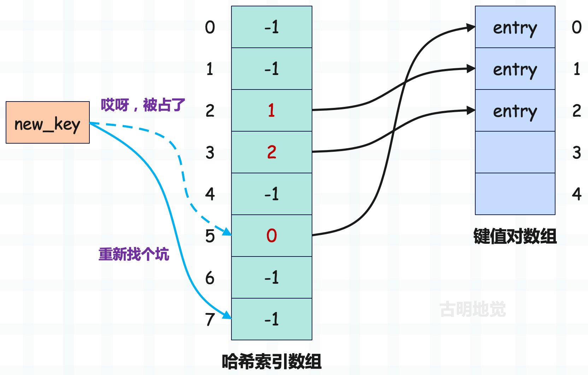

## 楔子

两个对象的哈希值相等，那么映射出的索引肯定相同。而如果哈希值不相等，映射出的索引也有可能相同，因为与哈希值空间相比，哈希表的槽位是非常有限的。如果不同的对象在经过映射之后，生成的索引相同，或者说它们被映射到了同一个槽，那么便发生了索引冲突。

解决索引冲突的常用方法有两种：分离链接法和开放寻址法。

分离链接法比较简单，如果有多个键值对映射到同一槽位，那么就用链表将它们串起来。然后是开放寻址法，这也是 Python 使用的方法，我们详细介绍一下。

## 开放寻址法

首先将 key 映射成索引，但如果发现该索引对应的哈希槽被占了，那么就尝试另一个。

new_key 被映射到了索引为 5 的槽，但是该槽已经存储了键值对数组的索引，即该槽被占了。如果是分离链接法，那么会使用链表将两个 entry 串起来，但开放寻址法则是选择一个新的槽，也就是重新找个坑。

那么问题来了，新的槽要怎么找呢？一般来说，会在首槽的基础上增加一个偏移量，得到新的槽，如果还冲突，那么继续增加偏移量，直到找到一个可用的槽。总的来说就是一个不断探测的过程，每一次探测都会尝试增加偏移量。

所以新的问题又产生了，每次增加的偏移量是多少呢？其实这个问题取决于具体实现，如果偏移量是线性增加的，我们称之为线性探测；如果偏移量是平方增加的，我们称之为平方探测。

但不管是线性探测，还是平方探测，其实都不够好。因为偏移量始终是以一种固定的模式增加，这就导致映射到同一槽位的两个 key 的探测序列是相同的。

比如这里的 key1 和 key2，它们的哈希值不同，但都映射到了索引为 2 的槽，这是完全正常的，因为哈希表的槽位有限。而由于偏移量的增加方式是固定的，比如这里每次都增加 2，再加上首槽相同，因此它们的探测序列也相同，显然这会导致后续出现多次冲突。

所以 Python 对此进行了优化，探测函数在发现索引冲突时，不会简单地增加一个偏移量，而是会参考对象的哈希值，计算下一个候选位置，这就大大降低了冲突的可能性。

Python 的这种做法被称为迭代探测，当然迭代探测也属于开放寻址法的一种。所以当出现索引冲突时，Python 并不是简简单单地加上一个偏移量，而是使用专门设计的探测函数进行二次探查，也就是之前说的改变规则、重新映射，然后在函数内部会参考对象的哈希值来计算出一个新的索引。

在 dictobject.c 文件开头有着大量的注释，对字典进行了全局性的概括，当然具体细节我们都会详细说明。

## 探测函数

当存储键值对时，要将 key 映射成索引，这个索引就是哈希索引数组的索引。至于具体的映射过程由探测函数负责，即 PyDictKeysObject 结构体内部的 dk_lookup 字段。

Python 为哈希表搜索提供了多种探测函数：

+ lookdict_unicode：专门针对 key 为字符串的 entry。
+ lookdict_index：专门针对 key 为整数的 entry。
+ lookdict：通用逻辑，可以把 lookdict_unicode、lookdict_index 看成 lookdict 的特殊实现，只不过 key 是整数和字符串的场景非常常见，因此为其单独实现了一个函数。

我们这里重点看一下 lookdict 的函数实现，不过在介绍之前，先来看几个宏。

~~~c
// Objects/dictobject.c

// 获取哈希表的长度，或者说哈希索引数组的长度
#define DK_SIZE(dk) ((dk)->dk_size)

// 哈希表的长度减 1，将 key 的哈希值和它按位与，便可将 key 映射成索引
// 因为 dk_size 满足 2 的 n 次方，所以 hash % dk_size 等价于 hash & (dk_size - 1)
#define DK_MASK(dk) (((dk)->dk_size)-1)

// 获取哈希索引数组中每个元素的大小，数组的长度不同，每个元素的大小不同
// dk_size <= 255，每个元素 1 字节
// 256 <= dk_size <= 65535，每个元素 2 字节
// 65536 <= dk_size <= 4294967295，每个元素 4 字节
// dk_size >= 4294967296，每个元素 8 字节
// 由于字典的键值对个数基本不会超过 4294967295，所以我们认为元素的大小就是 1、2 或者 4 字节
#define DK_IXSIZE(dk)                          \
    (DK_SIZE(dk) <= 0xff ?                     \
        1 : DK_SIZE(dk) <= 0xffff ?            \
            2 : DK_SIZE(dk) <= 0xffffffff ?    \
                4 : sizeof(int64_t))

// 获取紧跟在 PyDictKeysObject 结构体后面的键值对数组
// 这个和前面介绍字符串时，获取 PyASCIIObject 结构体后面的字符数组是类似的
// 主要是利用 C 语言指针的技巧（甚至都不能算技巧），这里再来详细介绍一下
// 假设有一个 int *a，那么 a + 3 和 a[3] 是等价的，都会向后偏移 3 个 int，即 12 字节
// 那么问题来了，对于任意类型的指针 T *p，如果想向后偏移 n 个字节，该怎么做呢？
// 很简单，将 p 加上 n / sizeof(T) 即可，但问题是 n / sizeof(T) 不一定是个整数啊
// 因此我们可以将指针转成 int8_t *，然后再加上 n，这样就会偏移 sizeof(int8_t) * n 个字节，即 n 个字节
// 比如 ((int8_t *)p) + n 或者 ((int8_t *)p)[n]
// 然后再来看 DK_ENTRIES 这个宏的逻辑，由于键值对数组紧跟在哈希索引数组后面
// 所以通过 (dk)->dk_indices 获取哈希索引数组，然后转成 int8_t * 类型
// 而 DK_SIZE(dk) * DK_IXSIZE(dk) 显然是哈希索引数组所占的内存大小
// 然后让 (int8_t*)((dk)->dk_indices) 向后偏移这些字节，不就定位到键值对数组的首元素了吗
#define DK_ENTRIES(dk) \
    ((PyDictKeyEntry*)(&((int8_t*)((dk)->dk_indices))[DK_SIZE(dk) * DK_IXSIZE(dk)]))

// Objects/dict-common.h
#define DKIX_EMPTY (-1)
#define DKIX_DUMMY (-2)  /* Used internally */
#define DKIX_ERROR (-3)
~~~

以上就是常用的几个宏，然后来看探测函数 lookdict 的逻辑。

~~~c
// Objects/dictobject.c

#define PERTURB_SHIFT 5

// 基于哈希索引数组的索引，获取指定的哈希槽里面存储的键值对数组的索引
static inline Py_ssize_t
dictkeys_get_index(PyDictKeysObject *keys, Py_ssize_t i)
{
    // 哈希表的长度
    Py_ssize_t s = DK_SIZE(keys);
    // 键值对数组的索引
    Py_ssize_t ix;
    // 如果哈希表的长度小于 1 << 8，哈希索引数组的每个元素占 1 字节
    if (s <= 0xff) {
        int8_t *indices = (int8_t*)(keys->dk_indices);
        ix = indices[i];
    }
    // 如果哈希表的长度小于 1 << 16，哈希索引数组的每个元素占 2 字节
    // 指针类型要转成 int16_t *，这样获取元素时会获取两个字节
    else if (s <= 0xffff) {
        int16_t *indices = (int16_t*)(keys->dk_indices);
        ix = indices[i];
    }
    // 如果哈希表的长度大于等于 1 << 32，哈希索引数组的每个元素占 8 字节（no way）
#if SIZEOF_VOID_P > 4
    else if (s > 0xffffffff) {
        int64_t *indices = (int64_t*)(keys->dk_indices);
        ix = indices[i];
    }
#endif
    // 否则哈希索引数组的每个元素占 4 字节
    else {
        int32_t *indices = (int32_t*)(keys->dk_indices);
        ix = indices[i];
    }
    assert(ix >= DKIX_DUMMY);
    // 返回键值对数组的索引
    return ix;
}

// 探测函数
static Py_ssize_t _Py_HOT_FUNCTION
lookdict(PyDictObject *mp, PyObject *key,
         Py_hash_t hash, PyObject **value_addr)
{
    // 将 key 映射成索引，这个索引就是哈希索引数组的索引
    /* 参数 mp：指向字典的指针
     * 参数 key：指向键的指针
     * 参数 hash：键的哈希值
     * 参数 value_addr：值的二级指针
     */    
  
    size_t i, mask, perturb;
    PyDictKeysObject *dk;
    PyDictKeyEntry *ep0;

top:
    // 指向 PyDictKeysObject 对象
    dk = mp->ma_keys;
    // 获取 PyDictKeysObject 内部的 dk_entries，即键值对数组
    ep0 = DK_ENTRIES(dk);
    // 哈希表的长度减 1
    mask = DK_MASK(dk);
    // perturb，初始值等于参数 hash，即 key 的哈希值
    perturb = hash;
    // 将哈希值和 mask 按位与，计算出哈希索引数组的索引
    i = (size_t)hash & mask;
    for (;;) {
        // 基于哈希索引数组的索引，从指定的哈希槽中获取键值对数组的索引
        Py_ssize_t ix = dictkeys_get_index(dk, i);
        // 哈希索引数组里面的元素初始为 -1，如果 ix == -1
        // 证明当前 key 映射出的哈希槽，还没有存储键值对数组的某个索引
        // 这就意味着当前要查找的 key 不存在，此时直接返回 -1 即可
        if (ix == DKIX_EMPTY) {
            *value_addr = NULL;
            return ix;
        }
        // 如果 ix >= 0，说明确实存储了一个合法的键值对数组的索引
        if (ix >= 0) {
            // ep0 是键值对数组，基于索引 ix 获取里面的键值对
            PyDictKeyEntry *ep = &ep0[ix];
            assert(ep->me_key != NULL);
            // ep->me_key 和变量 key 都是指针
            // 如果这两者相等，说明指向了同一个对象（字符串），显然查找的 key 已在字典中
            if (ep->me_key == key) {
                // 该函数不光要返回索引，还要返回 value，但 C 是单返回值语言，怎么办呢？
                // 只需要在调用函数时传个指针过来即可，会在函数内部进行修改
                // 由于 Python 的变量、容器存储的元素本身就是指针，所以 value_addr 是个二级指针
                *value_addr = ep->me_value;
                // 返回键值对数组的索引
                return ix;
            }
            // 如果 ep->me_key != key，说明两者指向的不是同一个对象
            // 那么就比较两个对象本身以及哈希值是否相等，如果相等，也表示 key 已存在
            if (ep->me_hash == hash) {  // 先保证哈希值相等
                PyObject *startkey = ep->me_key;
                Py_INCREF(startkey);
                // cmp 大于 0 说明比较结果为真，等于 0 说明比较结果为假，小于 0 说明比较时出现错误
                int cmp = PyObject_RichCompareBool(startkey, key, Py_EQ);
                Py_DECREF(startkey);
                if (cmp < 0) {
                    *value_addr = NULL;
                    return DKIX_ERROR;
                }     
                // 可能有人觉得这里的 if 是不是有点多余，这肯定百分百成立啊
                // 其实这一步主要是为了检测字典是否被修改（不用关注）
                if (dk == mp->ma_keys && ep->me_key == startkey) {
                    // 如果 cmp > 0，说明两个对象相等，那么修改 *value_addr，返回 ix
                    if (cmp > 0) {
                        *value_addr = ep->me_value;
                        return ix;
                    }
                }
                else {
                    // 字典如果被修改，那么重头来，这里不用关注
                    goto top;
                }
            }
        }
        // 走到这里说明 ix 是合法的，但是对应的 entry->me_key 和当前要查找的 key 不相等
        // 显然出现了索引冲突，于是将哈希值右移 5 位
        perturb >>= PERTURB_SHIFT;
        // 然后加上 i*5 + 1，并重新和 mask 按位与，得到新的哈希索引数组的索引
        // 也就是之前说的，改变规则、重新映射
        i = (i*5 + perturb + 1) & mask;
    }
    Py_UNREACHABLE();
}
~~~

以上就是 lookdict 函数的逻辑，至于 lookdict_index 和 lookdict_unicode 与之是类似的。

我们将逻辑再描述一遍，首先 perturb 初始等于 key 的哈希值，mask 等于哈希表的长度减一，然后执行 perturb & mask 便可得到一个索引。这个过程就是我们说的索引映射，映射出的索引便是哈希索引数组的索引，然后该索引对应的哈希槽又存储了一个索引，这个索引是键值对数组的索引。

哈希索引数组里面的一个位置我们称之为一个槽，如果映射出来的索引对应的哈希槽中存储的键值对数组的索引小于 0，说明该 key 对应的键值对还没有被存储过，那么直接返回初始值 -1 即可。

如果存储的键值对数组的索引（源码中的 ix）大于等于 0，说明已经存储了一个键值对，它的 key 和查找的 key 映射出的索引是相同的。然后比较 key 是否相等，如果相等，说明已经找到了，那么直接返回 ix 即可。如果 key 不相等，说明出现索引冲突了，那么要改变策略，重新映射。

~~~c
perturb >>= PERTURB_SHIFT;
i = mask & (i*5 + perturb + 1);
~~~

变量 i 便是映射出的哈希索引数组的索引，但发生冲突了，于是将 perturb 右移 5 位，然后加上 perturb + i * 5 + 1，再和 mask 按位与计算出新的 i。至于为什么要选择这种做法，这是 Python 官方经过多次实践得出来的结论。

当 lookdict 执行完之后，外界就拿到了指定的 key 对应的键值对数组的索引，并且也能拿到 key 对应的 value（key 若不存在就是 NULL）。但是还没结束，我们看到 lookdict 返回的是变量 ix，而变量 i 才是我们需要的。

变量 i 表示槽的索引，变量 ix 表示该槽存储的键值对数组的索引。由于我们是要寻找指定的槽，那么返回的应该是槽的位置、也就是变量 i 才对啊，为啥要返回变量 ix 呢？别急，往下看。

~~~C
#define DKIX_EMPTY (-1)
~~~

初始状态下，槽存储的都是 -1，表示当前槽是可用的。如果存储的索引大于等于 0，则表示该槽已经被占用了，当 key 不相等时会改变规则重新映射。总之最终的结果是：

- 如果 key 存在，那么返回的 ix 就是该 key 对应的键值对在键值对数组中的索引，此时 ix 大于等于 0；
- 如果 key 不存在，那么返回的 ix 就是哈希槽的初始值 -1。

所以 lookdict 函数只是告诉我们当前 key 在哈希表中是否存在，如果要获取槽的索引，即 lookdict 里面的变量 i，那么还需要另外两个函数。

+ find_empty_slot：如果 lookdict 返回的 ix 小于 0，说明 key 不存在，那么调用该函数返回槽的索引。
+ lookdict_index：如果 lookdict 返回的 ix 大于等于 0，说明 key 存在，那么调用该函数返回槽的索引。

所以这两个函数做的事情是一样的，都是返回槽的索引，我们看一下具体实现。

~~~C
// Objects/dictobject.c

static Py_ssize_t
find_empty_slot(PyDictKeysObject *keys, Py_hash_t hash)
{
    assert(keys != NULL);

    const size_t mask = DK_MASK(keys);
    // 获取槽的索引 i
    size_t i = hash & mask;
    // 获取槽存储的索引 ix
    Py_ssize_t ix = dictkeys_get_index(keys, i);
    // 不停映射，直到 ix 小于 0
    // 因为调用该函数时已经说明 key 不存在了
    // 所以最终一定会映射到一个空槽
    for (size_t perturb = hash; ix >= 0;) {
        perturb >>= PERTURB_SHIFT;
        // 映射的逻辑是相同的
        i = (i*5 + perturb + 1) & mask;
        ix = dictkeys_get_index(keys, i);
    }
    // 当 ix 小于 0 时，便找到了槽的索引
    return i;
}

static Py_ssize_t
lookdict_index(PyDictKeysObject *k, Py_hash_t hash, Py_ssize_t index)
{
    size_t mask = DK_MASK(k);
    size_t perturb = (size_t)hash;
    size_t i = (size_t)hash & mask;

    for (;;) {
        // 基于槽的索引 i，获取槽存储的索引 ix
        Py_ssize_t ix = dictkeys_get_index(k, i);
        // 参数 index 就是 lookdict 函数返回的 ix
        // 如果 ix 和 index 是相等的，说明此时的 i 就是要获取的槽的索引
        if (ix == index) {
            return i;
        }
        if (ix == DKIX_EMPTY) {
            return DKIX_EMPTY;
        }
        // 整个映射逻辑都是一样的
        // 因为在 lookdict 函数中只返回了 ix，即参数 index
        // 所以要按照相同的规则再映射一次，如果映射出的 ix 和 index 相等
        // 那么我们就找到了槽的索引 i，并且索引为 i 的槽存储的就是 index
        perturb >>= PERTURB_SHIFT;
        i = mask & (i*5 + perturb + 1);
    }
    Py_UNREACHABLE();
}
~~~

所以我们说的探测函数应该是 lookdict 和 find_empty_slot、lookdict_index 的组合。

+ lookdict 负责返回槽存储的索引，用于判断 key 是否存在。
+ find_empty_slot、lookdict_index 则负责返回槽的索引，即 key 最终被映射到了哪一个槽。

另外还有一点，我们之前说索引冲突时，会执行探测函数计算新的存储位置。其实不管有没有发生冲突，即使存储键值对的时候哈希表是空的，也要执行探测函数，毕竟探测函数的目的就是基于哈希值映射出一个合适的槽。如果探测函数执行的时候发现索引冲突了，也就是槽里的索引 ix >= 0，并且 key 还不相等，那么会改变规则重新映射。

因此在存储某个键值对时，无论索引冲突多少次，探测函数只会执行一次。在探测函数里面，会不断尝试解决冲突，直到映射出一个可用的槽。

## 小结

以上就是索引映射的具体逻辑，以及出现冲突是怎么解决的。就是先用哈希函数计算出 key 的哈希值，然后作为参数传递到探测函数中。在探测函数里面，会将哈希值和 mask 按位与，得到索引。如果索引冲突了，那么会改变规则，这里的规则如下：

~~~C
// 将哈希值右移 PERTURB_SHIFT 个位
perturb >>= PERTURB_SHIFT;
// 然后将哈希值加上 i*5 + 1，这个 i 就是当前冲突的索引
// 运算之后的结果再和 mask 按位与，得到一个新的 i
// 然后判断变量 i 对应的槽是否可用，不可用则重复当前逻辑，直到出现一个可用的槽
i = (i*5 + perturb + 1) & mask;
~~~

所以 Python 在索引冲突时，并不像线性探测和平方探测那样，简单地加一个固定的偏移量，而是参考对象的哈希值计算出一个新的索引。

------

&nbsp;

**欢迎大家关注我的公众号：古明地觉的编程教室。**

**如果觉得文章对你有所帮助，也可以请作者吃个馒头，Thanks♪(･ω･)ﾉ。**

