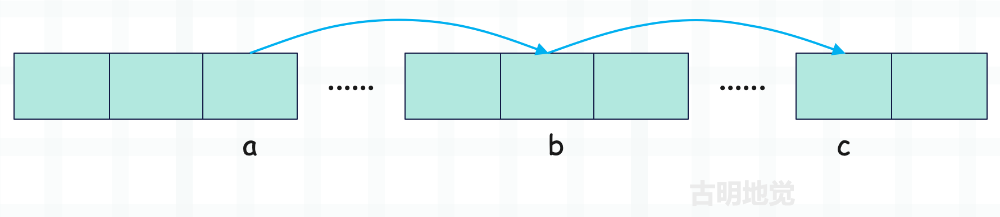
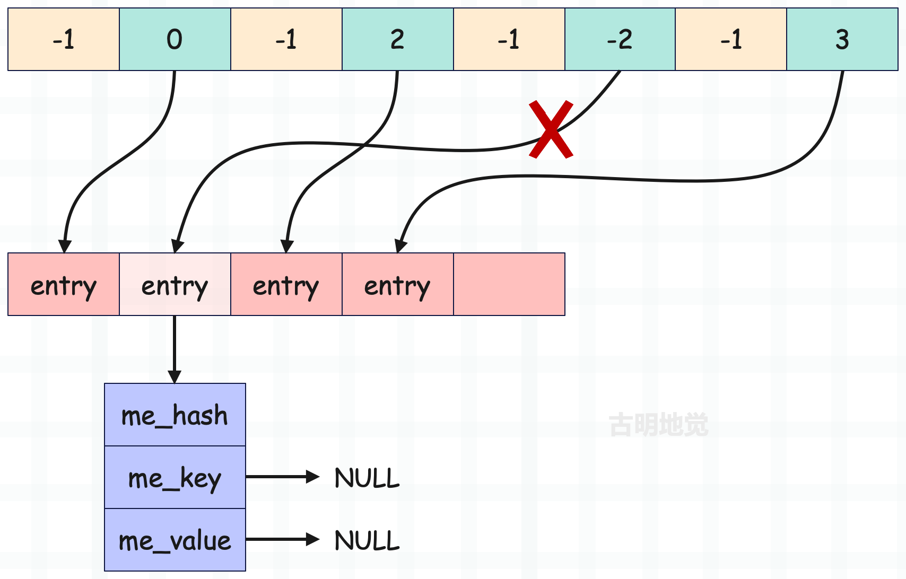
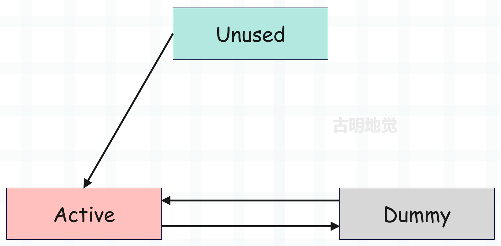
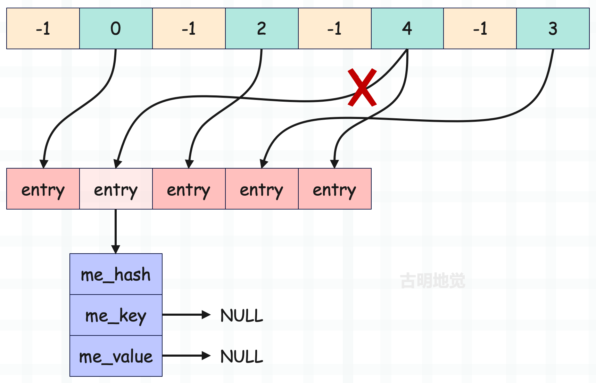
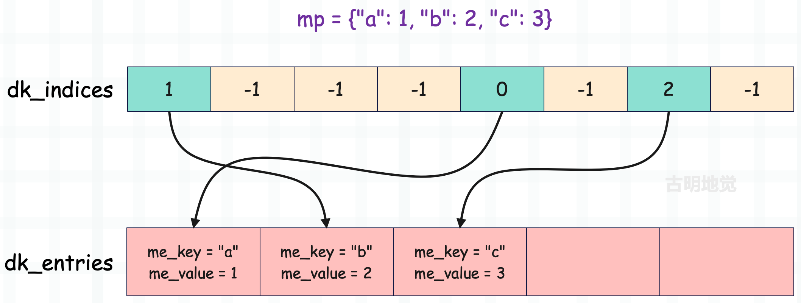
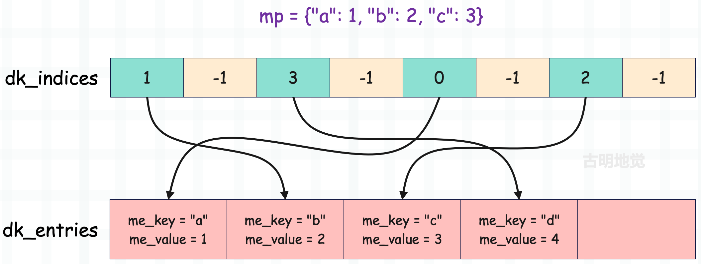
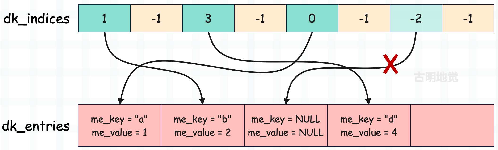

## 哈希表能直接删除元素吗

通过前面的学习，我们知道哈希表这种数据结构的逻辑是先通过哈希函数计算出键（key）的哈希值，然后将哈希值传递到探测函数中，映射成一个索引，最终通过索引去访问连续的内存区域。而哈希表这种数据结构，最终目的就是加速键的搜索过程。

但索引会存在冲突，并且键值对数量越多，映射出的索引出现冲突的概率越高。而如果冲突了，就改变规则重新映射，这种做法叫做开放寻址法。当发生冲突时，在探测函数内部会参考哈希值以及冲突的索引，计算下一个候选位置，并判断是否可用。如果不可用，会继续重复此过程，直到找到一个可用的位置。

通过多次探测，会经过多个位置，我们认为这些位置就形成了一个冲突探测链（探测序列），下面举例说明。

> 为了描述方便，我们后续偶尔会用 dk_indices 表示哈希索引数组、用 dk_entries 表示键值对数组、用 entry 表示键值对（包含两个字段：me_key 和 me_value，分别表示键和值）。当然在源码中，它们也是这个名字。
>
> key 映射之后的索引是哈希索引数组的索引，我们记作 i，该索引对应的哈希槽中又存储了一个索引（entry 在键值对数组中的索引），我们记作 ix。那么 ix = dk_indices[i]，对应的 entry = dk_entries[ix]。

比如插入一个 key 等于 "satori" 的键值对，它映射到了索引为 a 的槽，但是该槽已经被占用了，那么 dk_entries[dk_indices[a]] 便是使用该槽的 entry，但它的 key 不等于 "satori"，说明出现了索引冲突。于是重新映射，映射到索引为 b 的槽，发现依旧不行。那么只能再次映射，映射到索引为 c 的槽，发现该槽存储的索引是 -1，说明该槽还没有人用，于是将键值对追加到 dk_entries 中，并把它在 dk_entries 中的索引存在该槽中。

那么经过以上流程，`a -> b -> c` 便形成了一条冲突探测链，同理我们查找的时候也会按照这个顺序进行查找。

显然上面这些东西，现在理解起来已经没什么难度了，我们基于 key 获取 value 时也是这个过程。

当执行 d["satori"] 时，肯定会先映射到索引为 a 的槽，但 dk_entries[dk_indices[a]].me_key 不等于字符串 "satori"，于是重新映射。然后映射到索引为 b 的槽，发现还不相等，再映射到索引为 c 的槽，发现对应的键值对的 key 等于 "satori"，于是就把值取出来了。

显然以上符合我们的预期，但是，我要说但是了。如果我们把索引 b 的槽对应的 entry 删掉呢？那么老规矩，映射成索引，先走到索引为 a 的槽，但是发现坑被占，于是又走到索引为 b 的槽，结果发现居然没有 entry，那么直接就报出了一个 KeyError。

所以继续寻找的前提是，哈希槽一定存储了某个 entry 在键值对数组中的索引，并且该 entry 的 key 和指定的 key 不相等。但如果发现没有 entry，直接 KeyError。

然而 "satori" 这个 key 确实是存在的，因此这种情况我们称之为探测链断裂。本来应该走到位置 c 的，但是由于位置 b 没有对应 entry，导致探测函数在位置 b 就停止了。

因此我们发现，当一个 entry 只要位于任何一条探测链当中，在删除时都不能执行真正意义上的删除，而是要进行伪删除。那什么是伪删除呢？别着急，先往下看。

## 哈希槽的几种状态

哈希槽有以下几种状态：

- Unused；
- Active；
- Dummy；

来解释一下它们的含义。

~~~C
// Objects/dict-common.h
#define DKIX_EMPTY (-1)
#define DKIX_DUMMY (-2)  /* Used internally */
#define DKIX_ERROR (-3)
~~~

上面几个宏非常重要，当然主要是前两个宏。

**Unused 态**

如果没有 key 映射到指定的哈希槽，那么该哈希槽存储的索引就是 -1，即 DKIX_EMPTY，表示该槽尚未被使用，那么状态便是 Unused 态。比如一个刚初始化的哈希表，它的哈希索引数组存储的便都是 -1。

**Active 态**

如果某个 key 映射到了指定的哈希槽，那么该槽便会存储对应 entry 在键值对数组中的索引，这个索引一定是大于等于 0 的，此时该槽就从 Unused 态变成了 Active 态。

后续如果又有 key 映射到了该槽，那么看它和已存在的 entry 的 key，即 `entry->me_key` 是否相等。如果不相等，那么要改变规则重新映射；如果相等，那么便找到了指定的 entry，此时便可以更新或返回 `entry->me_value`。

**Dummy 态**

假设 key="abc" 映射到了索引为 i 的哈希槽，该槽存储了对应的 entry 在键值对数组中的索引 ix，这时如果将 key="abc" 的键值对给删掉，那么索引为 i 的哈希槽存储的值会变成多少呢？

可能有人觉得，键值对都删掉了，那么哈希槽也不用再存储它的索引了，应该会重置为 -1 吧。答案是不对的，原因就是我们刚才说的，这么做会导致探测链断裂。

当 entry 被删掉之后，哈希槽存储的值会变成 -2，即 DKIX_DUMMY，表示该槽之前存储过某个 entry 在键值对数组中的索引，但是该 entry 被删除了。注：删除 entry 也不是直接将它从键值对数组中删掉，而是将它的 me_key 和 me_value 字段设置为 NULL。

图中的 dk_indices 中有一个槽存储的是 -2，但很明显之前它存储的应该是 1，只是后续 dk_entries 中索引为 1 的 entry 被删除了。而删除一个 entry，会将它的 me_key 和 me_value 设置为 NULL，并将哈希槽存储的索引设置为 -2，这便是上面提到的伪删除技术。

所以一个哈希槽有三种状态，我们记哈希槽存储的索引为 ix。

+ 1）如果 ix == -1，说明该槽处于 Unused 态，还没有存储任何一个 entry 在键值对数组中的索引。
  + 当添加一个 entry 并且 key 映射到了该槽，那么直接将 entry 追加到键值对数组，并让该槽保存它在键值对数组中的索引。
  + 当基于 key 获取 value 并且 key 映射到了该槽，那么会 KeyError。
+ 2）如果 ix >= 0，说明该槽处于 Active 态，已经保存了某个 entry 在键值对数组中的索引。
  + 当添加一个 entry 并且 key 映射到了该槽，那么看已存在的 entry 的 key 和要添加的 entry 的 key 是否相等。如果不相等，索引冲突，要重新映射。如果相等，那么直接更新 value。
  + 当基于 key 获取 value 并且 key 映射到了该槽，那么看已存在的 entry 的 key 和要搜索的 key 是否相等。如果不相等，索引冲突，要重新映射。如果相等，那么返回 entry 的 value。
+ 3）如果 ix == -2，说明该槽处于 Dummy 态，之前存储了某个 entry 在键值对数组中的索引，但之后该 entry 被删除了。
  + 当添加一个 entry 并且 key 映射到了该槽，那么直接将 entry 追加到键值对数组，并让该槽保存它在键值对数组中的索引。
  + 当基于 key 获取 value 并且 key 映射到了该槽，发现处于 Dummy 态，会明白虽然当前的槽是无效的，但它不是探测链的终点，所以不会报错，而是会继续搜索，这样就保证了探测链的连续性。至于报错，是发现映射出的哈希槽处于 Unused 态，没有存储任何一个 entry 的索引，这就说明 key 对应的 entry 不存在，此时才会 KeyError。

以上就是哈希槽的三种状态，它们之间可以进行转换，但 Unused 态只能转换为 Active 态；Active 态只能转换为 Dummy 态；Dummy 态只能转换为 Active 态。

如果哈希槽存储的 ix == DKIX_EMPTY，那么它处于 Unused 态。如果后续存储了 entry 在键值对数组中的索引，那么 ix >= 0，此时哈希槽会从 Unused 态转换为 Active 态。如果哈希槽存储的索引对应的 entry 被删除，那么 ix 会变成 DKIX_DUMMY，此时哈希槽会从 Active 态转换为 Dummy 态。

**那么问题来了，Dummy 态转换为 Active 态，你能猜到会在什么时候发生吗？**

很容易想到，假设新来了一个 entry，它正好撞上了 Dummy 态的哈希槽，那么该槽会从 Dummy 态转为 Active 态。

**总结：假设新增一个 entry，它的 key 映射到了索引为 i 的槽，该槽存储的索引为 ix。**

+ 如果 ix == -1，说明一上来就有位置可用，那么直接将 entry 追加到 dk_entries 中，并把它在 dk_entries 中的索引赋值给 dk_indices[i]。也就是说，Python 默认不关心是否有 Dummy 态的哈希槽。
+ 如果 ix >= 0，说明该槽已经有人用了，那么比较 dk_entries[ix].me_key 和要插入的 entry 的 key 是否相等，如果相等，那么更新键值对，不相等则重新映射。
+ 如果 ix == -2，说明该槽之前被使用了，但使用它的 entry 后续又被删除了（伪删除，内存还在）。此时会复用该哈希槽，不过被伪删除的旧 entry 不会被复用，新增的 entry 依旧会追加到 dk_entries 中，并把它在 dk_entries 中的索引赋值给 dk_indices[i]。

还是这张图，但做了一些修改。图中索引为 5 的哈希槽存储的索引 ix 等于 4，但它经历了以下几个过程。

+ dk_indices[5] 初始为 -1，即 DKIX_EMPTY，此时处于 Unused 态。
+ 来了一个 entry，映射到了索引为 5 的槽，发现该槽可用，于是将 dk_indices[5] 修改为 1（它在 dk_entries 中的索引），此时哈希槽变成 Active 态。
+ 映射到索引为 5 的哈希槽的 entry 被删除，于是将 dk_indices[5] 修改为 DKIX_DUMMY，即 -2，并将 dk_entries[1] 的 me_key 和 me_value 设置为 NULL，此时哈希槽变成 Dummy 态。
+ 后续又来了一个 entry，也映射到了索引为 5 的哈希槽，发现 dk_indices[5] 等于 -2，处于 Dummy 态。于是将新的 entry 追加到 dk_entries 中，并且在 dk_entries 中的索引为 4，然后再将 dk_indices[5] 修改为 4，此时哈希槽再次变成 Active 态。

那么问题来了，被删除的旧 entry 怎么办？显然会留在那里，它是无法被复用的，当它被删除的那一刻，就和哈希索引数组失去了联系，因为对应的哈希槽存储的值被修改成了 -2。即使后续有新的 entry 映射到了同一个槽，它也不知道该槽在存储 -2 之前存储了什么，所以只能选择追加。

而那些被删除的旧 entry 会在哈希表执行扩缩容的时候被处理，比如哈希表满了，会申请新的存储单元，然后将处于 Active 态的哈希槽对应的 entry 搬过去，其它的则直接丢弃。

## 哈希表删除元素源码解析

下面我们通过源码，来感受一下字典（哈希表）是如何删除元素的。字典有一个 pop 方法，可以基于 key 弹出指定的 entry，我们就来看一下它的源码实现。

~~~C
// Objects/dictobject.c
#define DICT_POP_METHODDEF    \
    {"pop", (PyCFunction)(void(*)(void))dict_pop, METH_FASTCALL, dict_pop__doc__},

static PyObject *
dict_pop(PyDictObject *self, PyObject *const *args, Py_ssize_t nargs)
{
    // pop 方法的返回值
    PyObject *return_value = NULL;
    // 指定的 key
    PyObject *key;
    // pop 方法支持传入一个默认值
    // 当 key 不存在时，如果不指定默认值，pop 方法会报错，否则会返回默认值
    PyObject *default_value = NULL;
    // args 是由参数组成的元组，nargs 表示参数的个数
    // 显然参数的个数必须是 1 ~ 2 个
    if (!_PyArg_CheckPositional("pop", nargs, 1, 2)) {
        goto exit;
    }
    // args[0] 表示 key
    key = args[0];
    if (nargs < 2) {
        goto skip_optional;
    }
    // args[1] 表示默认值，如果指定了的话
    default_value = args[1];
skip_optional:
    // 调用 dict_pop_impl 函数
    // 从字典中弹出具有指定 key 的 entry，并返回它的 value
    return_value = _PyDict_Pop((PyObject*)self, key, default_value);

exit:
    return return_value;
}
~~~

具体的逻辑由 _PyDict_Pop 承载，看看它长什么样子？

~~~c
// Objects/dictobject.c
PyObject *
_PyDict_Pop(PyObject *dict, PyObject *key, PyObject *deflt)
{
    Py_hash_t hash;
    // 快分支，如果键值对的个数为 0
    if (((PyDictObject *)dict)->ma_used == 0) {
        // 那么当指定默认值时，直接返回默认值
        if (deflt) {
            Py_INCREF(deflt);
            return deflt;
        }
        // 否则抛出 KeyError
        _PyErr_SetKeyError(key);
        return NULL;
    }
    // 计算 key 的哈希值，这里分两种情况
    // key 不是字符串，那么调用 PyObject_Hash 函数进行计算
    // key 是字符串，那么直接获取，如果获取的结果为 -1（之前没有计算过），也要重新计算
    if (!PyUnicode_CheckExact(key) ||
        (hash = ((PyASCIIObject *) key)->hash) == -1) {
        // 如果计算的结果还是 -1，说明 key 无法被哈希
        hash = PyObject_Hash(key);
        if (hash == -1)
            return NULL;
    }
    return _PyDict_Pop_KnownHash(dict, key, hash, deflt);
}

PyObject *
_PyDict_Pop_KnownHash(PyObject *dict, PyObject *key, Py_hash_t hash, PyObject *deflt)
{
    Py_ssize_t ix, hashpos;
    PyObject *old_value, *old_key;
    PyDictKeyEntry *ep;
    PyDictObject *mp;

    assert(PyDict_Check(dict));
    mp = (PyDictObject *)dict;
    
    // 如果字典为空，即键值对个数为 0
    // 那么当指定默认值时，直接返回默认值，否则抛出 KeyError
    if (mp->ma_used == 0) {
        if (deflt) {
            Py_INCREF(deflt);
            return deflt;
        }
        _PyErr_SetKeyError(key);
        return NULL;
    }
    // mp->ma_keys->dk_lookup 表示探测函数，负责将 key 映射成索引，找到对应的哈希槽
    // 然后返回哈希槽存储的 entry 在 dk_entries 中的索引
    // 并且在探测函数里面，还会对 old_value 进行修改
    ix = (mp->ma_keys->dk_lookup)(mp, key, hash, &old_value);
    if (ix == DKIX_ERROR)
        return NULL;
    // 如果 ix == -1，说明映射之后的哈希槽处于 Unused 态
    // 说明该 key 对应的 entry 不存在，或者说 key 不存在
    if (ix == DKIX_EMPTY || old_value == NULL) {
        // 如果指定了默认值，返回默认值，否则抛出 KeyError
        if (deflt) {
            Py_INCREF(deflt);
            return deflt;
        }
        _PyErr_SetKeyError(key);
        return NULL;
    }

    // 到这里说明 ix >= 0，即 key 在字典中存在
    // 然后检测字典是否是分离表，由于分离表不允许删除 key，所以要重构为结合表
    // 分离表就是为了节省内存引入的，因此它的限制较多，这里不做过多讨论
    if (_PyDict_HasSplitTable(mp)) {
        if (dictresize(mp, DK_SIZE(mp->ma_keys))) {
            return NULL;
        }
        ix = (mp->ma_keys->dk_lookup)(mp, key, hash, &old_value);
        assert(ix >= 0);
    }
    // 这个函数之前也见过，它负责基于哈希槽存储的 entry 的索引，返回哈希槽的索引
    hashpos = lookdict_index(mp->ma_keys, hash, ix);
    assert(hashpos >= 0);
    assert(old_value != NULL);
    // 字典的长度减 1
    mp->ma_used--;
    // 更新字典的版本号
    mp->ma_version_tag = DICT_NEXT_VERSION();
    // 将索引为 hashpos 的哈希槽的值设置为 DKIX_DUMMY
    // 即 dk_indices[hashpos] = DKIX_DUMMY
    // 注意：不能设置为 DKIX_EMPTY，因为要保护冲突探测链不断裂
    dictkeys_set_index(mp->ma_keys, hashpos, DKIX_DUMMY);
    // 获取指定的 entry，即 dk_entries[ix]
    ep = &DK_ENTRIES(mp->ma_keys)[ix];
    ENSURE_ALLOWS_DELETIONS(mp);
    // 将 me_key 和 me_value 设置为 NULL，伪删除
    // 并减少它们指向的对象的引用计数
    old_key = ep->me_key;
    ep->me_key = NULL;
    ep->me_value = NULL;
    Py_DECREF(old_key);

    ASSERT_CONSISTENT(mp);
    // 返回弹出的 value
    return old_value;
}
~~~

整个过程和我们之前的分析一样，这里为了更好地理解，我们再举个实际的例子，将整个流程给串一下。

字典存储了三个键值对，显然它们会按照先来后到的顺序存储在 dk_entries 中。然后 "a": 1 映射到了索引为 4 的哈希槽，"b": 2 映射到了索引为 0 的哈希槽，"c": 3 映射到了索引为 6 的哈希槽。当然实际情况未必是这样，这里只是打个比方。

然后我们再添加一个键值对 mp["d"] = 4，首先要将 "d" 映射成索引，假设映射出的索引为 0，由于 dk_indices[0] 的值为 1，而 dk_entries[1].me_key 不等于 "d"，所以出现冲突，于是哈希值右移 5 位，重新映射。

第二次映射出的索引为 6，由于 dk_indices[6] 的值为 2，而 dk_entries[2].me_key 也不等于 "d"，说明第二次映射出的索引也冲突了，那么哈希值继续右移 5 位，重新映射。

第三次映射出的索引为 4，由于 dk_indices[4] 的值为 0，而 dk_entries[0].me_key 也不等于 "d"，说明第三次映射出的索引也冲突了，那么哈希值继续右移 5 位，重新映射。

第四次映射出的索引为 2，而 dk_indices[2] 的值为 -1，说明该槽没有人用，于是将 entry 追加到键值对数组中，并将它在 dk_entries 中的索引赋值给 dk_indices[2]。还是那句话，实际情况并不一定是这样，这里只是为了方便解释而刻意举的例子。

所以对于 "d": 4 这个键值对来说，`0 -> 6 -> 4 -> 2` 就是它的冲突探测链，在查找的时候也会按照这个顺序进行查找。比如我们获取 mp["d"]，那么会经历如下过程。

- 将 key="d" 映射成索引，得到 0，但 dk_entries[dk_indices[0]].me_key 不等于 "d"，所以改变策略，重新映射。
- 第二次映射得到索引 6，但 dk_entries[dk_indices[6]].me_key 依旧不等于 "d"，所以改变策略，重新映射。
- 第三次映射得到索引 4，但 dk_entries[dk_indices[4]].me_key 依旧不等于 "d"，所以改变策略，重新映射。
- 第四次映射得到索引 2，发现 dk_entries[dk_indices[2]].me_key 等于 "d"，说明找到了指定的 entry，于是返回它的 value。

以上就是查找的整个过程，这时如果将 key="c" 的 entry 删掉，比如执行 mp.pop("c")，那么会发生什么呢？

因为 "c" 映射到了索引为 6 的槽，当它被删除时，要将 dk_entries[dk_indices[6]] 的 me_key 和 me_value 都设置为 NULL，以及将 dk_indices[6] 设置为 DKIX_DUMMY。然后我们再获取 mp["d"]，第二次映射会得到索引 6，发现该槽存储的值为 -2，就知道该槽并不是探测链的终点，于是会继续映射。

## ma_used 和 dk_nentries 的区别

回顾一下字典的结构：

我们说 ma_used 字段表示字典的长度，它充当了 ob_size，而 dk_nentries 字段表示键值对数组中存储的键值对的个数，那么问题来了，这两个字段啥区别呢？从字面意思来看，这两者似乎是等价的。

相信这个问题对你来说没有任何难度，假设当前添加了 4 个键值对，那么 ma_used 和 dk_nentries 就都是 4。但如果再删除一个键值对，那么 ma_used 会变成 3，而 dk_nentries 还是 4。

所以 ma_used 会随着键值对的删除而减少，但 dk_nentries 保持不变，我们验证一下。

~~~python
from ctypes import *

class PyDictKeysObject(Structure):
    _fields_ = [("dk_refcnt", c_ssize_t),
                ("dk_size", c_ssize_t),
                ("dk_lookup", c_void_p),
                ("dk_usable", c_ssize_t),
                ("dk_nentries", c_ssize_t),
                ("dk_indices", c_char * 8)]

class PyObject(Structure):
    _fields_ = [("ob_refcnt", c_ssize_t),
                ("ob_type", c_void_p)]

class PyDictObject(PyObject):
    _fields_ = [("ma_used", c_ssize_t),
                ("ma_version_tag", c_uint64),
                ("ma_keys", POINTER(PyDictKeysObject)),
                ("ma_values", c_void_p)]

d = {1: 1, 2: 2, 3: 3, 4: 4}
obj = PyDictObject.from_address(id(d))
print(obj.ma_used)  # 4
print(obj.ma_keys.contents.dk_nentries)  # 4
# 删除一个键值对
d.pop(1)
print(obj.ma_used)  # 3
print(obj.ma_keys.contents.dk_nentries)  # 4
# 再删除一个
d.pop(2)
print(obj.ma_used)  # 2
print(obj.ma_keys.contents.dk_nentries)  # 4
~~~

结果和我们分析的一样，这就是 ma_used 和 dk_nentries 的区别。

## 小结

以上我们就介绍了哈希表是怎么删除元素的，以及相关的具体细节，下一篇文章来说一说字典的创建，以及它的一些方法。

-----

&nbsp;

**欢迎大家关注我的公众号：古明地觉的编程教室。**

**如果觉得文章对你有所帮助，也可以请作者吃个馒头，Thanks♪(･ω･)ﾉ。**

