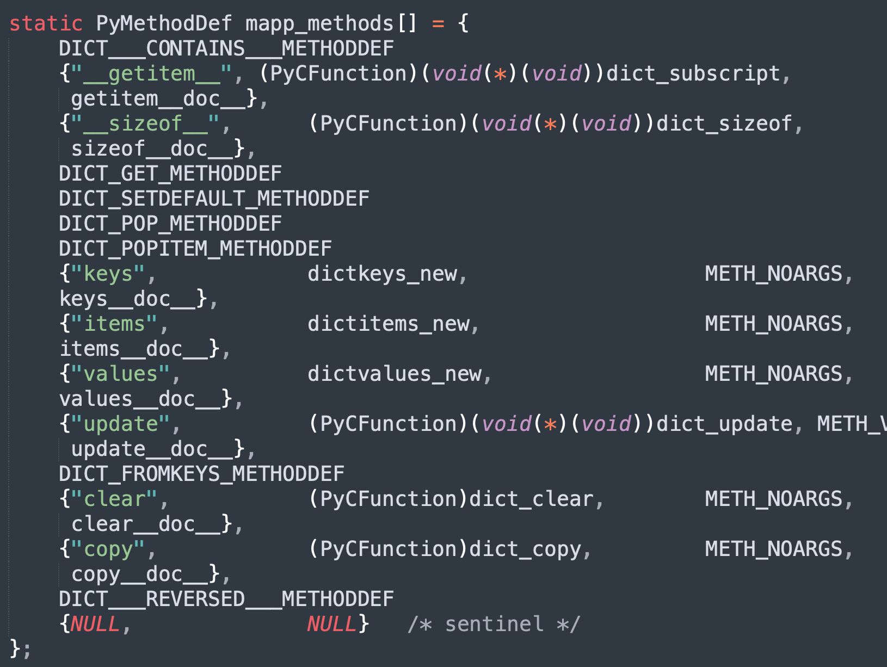
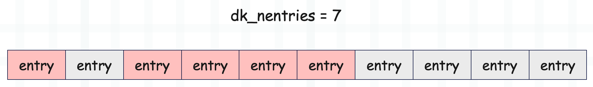
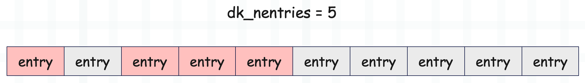

## 楔子

上一篇文章我们介绍了字典的创建过程，和一些基本操作，这些操作都对应一个魔法方法。但除了这些魔法方法之外，每个对象还可以单独定义很多自己的方法，这些方法统一由类型对象的 tp_methods 字段维护，当然这些之前已经说过了。

里面有很多的自定义方法，比如 get、pop、setdefault 等等，我们来剖析一下。

## 字典的 get 方法

获取指定 key 对应的 value，如果 key 不存在，那么返回默认值。

~~~Python
d = {"name": "古明地觉"}
print(d.get("name"))
"""
古明地觉
"""
# key 不存在，返回默认值 None
print(d.get("desc"))
"""
None
"""
# 当然也可以指定默认值
print(d.get("desc", "地灵殿美少女"))
"""
地灵殿美少女
"""
~~~

下面看一下源码实现。

~~~C
// Objects/clinc/dictobject.c.h
#define DICT_GET_METHODDEF    \
    {"get", (PyCFunction)(void(*)(void))dict_get, METH_FASTCALL, dict_get__doc__},

static PyObject *
dict_get(PyDictObject *self, PyObject *const *args, Py_ssize_t nargs)
{
    PyObject *return_value = NULL;  // 返回值
    PyObject *key;  // 指定的 key
    PyObject *default_value = Py_None;  // 默认值，默认为 None
    // get 方法接收 1 ~ 2 个参数
    if (!_PyArg_CheckPositional("get", nargs, 1, 2)) {
        goto exit;
    }
    // args[0] 便是指定的 key
    key = args[0];
    if (nargs < 2) {
        goto skip_optional;
    }
    // args[1] 便是传入的默认值，如果有的话
    default_value = args[1];
skip_optional:
    // 调用 dict_get_impl
    return_value = dict_get_impl(self, key, default_value);

exit:
    return return_value;
}

// Objects/dictobject.c
static PyObject *
dict_get_impl(PyDictObject *self, PyObject *key, PyObject *default_value)
{
    PyObject *val = NULL;
    Py_hash_t hash;  // 哈希值
    Py_ssize_t ix;  // 哈希槽存储的键值对数组的索引
    // 计算哈希值
    if (!PyUnicode_CheckExact(key) ||
        (hash = ((PyASCIIObject *) key)->hash) == -1) {
        hash = PyObject_Hash(key);
        if (hash == -1)
            return NULL;
    }
    // 获取 key 对应的哈希槽存储的键值对数组的索引
    ix = (self->ma_keys->dk_lookup) (self, key, hash, &val);
    if (ix == DKIX_ERROR)
        return NULL;
    // key 不存在，那么将默认值赋值给 val
    if (ix == DKIX_EMPTY || val == NULL) {
        val = default_value;
    }
    // 增加 val 的引用计数，然后返回
    Py_INCREF(val);
    return val;
}
~~~

以上就是字典的 get 方法，非常简单。

## 字典的 setdefault 方法

这是一个非常强大的方法，但是用的人不是很多。它和 get 方法类似，都是传入一个 key 和一个默认值，如果 key 存在，那么返回 key 对应的 value，否则返回默认值。但它和 get 方法不同的是，setdefault 在 key 不存在时，会将 key 和默认值添加到字典中。

~~~Python
d = {"name": "古明地觉"}
# 当 key 存在时，两个方法的效果是一样的，都等价于 d[key]
print(d.get("name"))
print(d.setdefault("name"))
"""
古明地觉
古明地觉
"""

# 但当 key 不存在时，就有差别了
# "desc" 这个 key 不存在，返回默认值
print(d.get("desc", "地灵殿美少女"))
"""
地灵殿美少女
"""
# 并且原始的字典不受影响
print(d)
"""
{'name': '古明地觉'}
"""

# 但对于 setdefault 来说，key 不存在时
# 会将 key 和默认值添加进去，然后返回默认值
print(d.setdefault("desc", "地灵殿美少女"))
"""
地灵殿美少女
"""
# 原始的字典会发生改变
print(d)
"""
{'name': '古明地觉', 'desc': '地灵殿美少女'}
"""
~~~

所以当获取的 key 不存在时，v = d.setdefault(key, value) 等价于如下。

- d[key] = value
- v = d[key]

那么 setdefault 一般用在什么地方呢？举个例子。

~~~Python
data = [
    ("古明地觉", "2020", 5), ("古明地觉", "2020", 2),
    ("古明地觉", "2021", 1), ("古明地觉", "2021", 4), ("古明地觉", "2021", 3),

    ("芙兰朵露", "2022", 7), ("芙兰朵露", "2022", 3), ("芙兰朵露", "2022", 3),
    ("芙兰朵露", "2023", 4), ("芙兰朵露", "2023", 1)
]
# 对于上面这种数据，我们需要变成下面这个样子
"""
{
    '古明地觉': {
        '2020': [5, 2], 
        '2021': [1, 4, 3]
    }, 
    '芙兰朵露': {
        '2022': [7, 3, 3], 
        '2023': [4, 1]
    }
}
"""
# 如果使用 setdefault 方法，就非常好解决了
d = {}
for name, year, cnt in data:
    d.setdefault(name, {}).setdefault(year, []).append(cnt)
print(d)
~~~

下面来看一下源码实现。

~~~C
// Objects/clinc/dictobject.c.h
#define DICT_SETDEFAULT_METHODDEF    \
    {"setdefault", (PyCFunction)(void(*)(void))dict_setdefault, METH_FASTCALL, dict_setdefault__doc__},

static PyObject *
dict_setdefault(PyDictObject *self, PyObject *const *args, Py_ssize_t nargs)
{
    // 这部分和 get 方法是类似的
    PyObject *return_value = NULL;
    PyObject *key;
    PyObject *default_value = Py_None;

    if (!_PyArg_CheckPositional("setdefault", nargs, 1, 2)) {
        goto exit;
    }
    key = args[0];
    if (nargs < 2) {
        goto skip_optional;
    }
    default_value = args[1];
skip_optional:
    return_value = dict_setdefault_impl(self, key, default_value);
exit:
    return return_value;
}

// Objects/dictobject.c
static PyObject *
dict_setdefault_impl(PyDictObject *self, PyObject *key,
                     PyObject *default_value)
{
    PyObject *val;

    val = PyDict_SetDefault((PyObject *)self, key, default_value);
    Py_XINCREF(val);
    return val;
}
~~~

所以核心在于 PyDict_SetDefault 函数，这个函数比较长，但逻辑不难理解。

~~~C
// Objects/dictobject.c
PyObject *
PyDict_SetDefault(PyObject *d, PyObject *key, PyObject *defaultobj)
{
    PyDictObject *mp = (PyDictObject *)d;
    PyObject *value;
    Py_hash_t hash;

    if (!PyDict_Check(d)) {
        PyErr_BadInternalCall();
        return NULL;
    }
    // 获取哈希值
    if (!PyUnicode_CheckExact(key) ||
        (hash = ((PyASCIIObject *) key)->hash) == -1) {
        hash = PyObject_Hash(key);
        if (hash == -1)
            return NULL;
    }
    // 如果 mp->ma_keys 等于 Py_EMPTY_KEYS，证明字典是空的，那么 key 肯定不存在
    // 将 key 和 defaultobj 添加进字典中，并返回 defaultobj
    if (mp->ma_keys == Py_EMPTY_KEYS) {
        if (insert_to_emptydict(mp, key, hash, defaultobj) < 0) {
            return NULL;
        }
        return defaultobj;
    }
    // 如果字典使用的是分离表，并且 key 不是字符串
    // 意味着字典的结构要发生改变，重构为结合表
    if (mp->ma_values != NULL && !PyUnicode_CheckExact(key)) {
        if (insertion_resize(mp) < 0)
            return NULL;
    }
    // 获取哈希槽存储的键值对数组的索引
    Py_ssize_t ix = (mp->ma_keys->dk_lookup)(mp, key, hash, &value);
    if (ix == DKIX_ERROR)
        return NULL;
    // 分离表不仅要求 key 全部是字符串，并且不能删除，否则要重构为结合表
    if (_PyDict_HasSplitTable(mp) &&
        ((ix >= 0 && value == NULL && mp->ma_used != ix) ||
         (ix == DKIX_EMPTY && mp->ma_used != mp->ma_keys->dk_nentries))) {
        if (insertion_resize(mp) < 0) {
            return NULL;
        }
        ix = DKIX_EMPTY;
    }
    // 如果 ix == -1，说明 key 不存在，那么要先添加键值对
    if (ix == DKIX_EMPTY) {
        PyDictKeyEntry *ep, *ep0;
        value = defaultobj;
        // 是否还有可用空间，如果没有，调用 insertion_resize
        if (mp->ma_keys->dk_usable <= 0) {
            if (insertion_resize(mp) < 0) {
                return NULL;
            }
        }
        // 返回 key 映射之后的哈希槽的索引
        Py_ssize_t hashpos = find_empty_slot(mp->ma_keys, hash);
        // 新添加的 entry 在键值对数组中的索引为 mp->ma_keys->dk_nentries
        // 将该索引赋值给 dk_indices[hashpose]
        ep0 = DK_ENTRIES(mp->ma_keys);
        ep = &ep0[mp->ma_keys->dk_nentries];
        dictkeys_set_index(mp->ma_keys, hashpos, mp->ma_keys->dk_nentries);
        Py_INCREF(key);
        Py_INCREF(value);
        MAINTAIN_TRACKING(mp, key, value);
        ep->me_key = key;
        ep->me_hash = hash;
        // 如果字典是分离表
        if (_PyDict_HasSplitTable(mp)) {
            // 值由 mp->ma_values 存储
            assert(mp->ma_values[mp->ma_keys->dk_nentries] == NULL);
            mp->ma_values[mp->ma_keys->dk_nentries] = value;
        }
        // 如果字典是结合表，那么键和值均保存在 entry 中
        else {
            ep->me_value = value;
        }
        // 字典长度加 1
        mp->ma_used++;
        // 修改版本号
        mp->ma_version_tag = DICT_NEXT_VERSION();
        // 键值对数组还可以容纳的 entry 个数减 1
        mp->ma_keys->dk_usable--;
        // 键值对数组已经容纳的 entry 个数加 1
        mp->ma_keys->dk_nentries++;
        assert(mp->ma_keys->dk_usable >= 0);
    }
    // ...
    ASSERT_CONSISTENT(mp);
    // 返回 value
    return value;
}
~~~

以上便是 setdefault 方法。

## 字典的 popitem 方法

字典的 pop 方法之前已经说过了，这里来看一下 popitem 方法。

~~~Python
d = {"x": 1, "y": 2, "z": 3}
# pop 方法可以弹出指定的 key，并返回对应的 value
# 如果 key 不存在，并且没有指定默认值，会抛出 KeyError，否则返回默认值
print(d.pop("x"))  # 1

# 而 popitem 方法则是弹出字典的最后一个键值对
d = {"x": 1, "y": 2, "z": 3}
print(d.popitem())  # ('z', 3)
print(d)  # {'x': 1, 'y': 2}
~~~

下面看一下源码实现。

~~~C
// Objects/clinc/dictobject.c.h
#define DICT_POPITEM_METHODDEF    \
    {"popitem", (PyCFunction)dict_popitem, METH_NOARGS, dict_popitem__doc__},

static PyObject *
dict_popitem(PyDictObject *self, PyObject *Py_UNUSED(ignored))
{
    return dict_popitem_impl(self);
}

// Objects/dictobject.c
static PyObject *
dict_popitem_impl(PyDictObject *self)
{
    Py_ssize_t i, j;
    PyDictKeyEntry *ep0, *ep;
    PyObject *res;
    // 返回值，一个二元组，负责存储 key 和 value
    res = PyTuple_New(2);
    if (res == NULL)
        return NULL;
    // 如果字典的长度为 0，那么抛出 KeyError
    if (self->ma_used == 0) {
        Py_DECREF(res);
        PyErr_SetString(PyExc_KeyError, "popitem(): dictionary is empty");
        return NULL;
    }
    // 如果字典使用分离表，那么当 popitem 之后，要重构为结合表
    // 分离表要求 key 必须全部是字符串，并且不能删除键值对
    if (self->ma_keys->dk_lookup == lookdict_split) {
        if (dictresize(self, DK_SIZE(self->ma_keys))) {
            Py_DECREF(res);
            return NULL;
        }
    }
    ENSURE_ALLOWS_DELETIONS(self);

    // 获取键值对数组
    ep0 = DK_ENTRIES(self->ma_keys);
    // ma_keys->dk_nentries 表示键值对数组中已使用的 entry 个数
    // 那么 entry 的最大索引就是 ma_keys->dk_nentries - 1
    i = self->ma_keys->dk_nentries - 1;
    // 从 i 开始往前遍历，找到第一个 me_value != NULL 的 entry
    // 因为被删除的 entry 依旧会驻留在键值对数组中，但 me_key、me_value 被设置为 NULL
    while (i >= 0 && ep0[i].me_value == NULL) {
        i--;
    }
    assert(i >= 0);
    // 获取 entry
    ep = &ep0[i];
    // 基于哈希槽存储的索引，获取哈希槽的索引
    j = lookdict_index(self->ma_keys, ep->me_hash, i);
    assert(j >= 0);
    assert(dictkeys_get_index(self->ma_keys, j) == i);
    // 因为 entry 被删除了，所以对应的哈希槽存储的值要修改为 DKIX_DUMMY
    dictkeys_set_index(self->ma_keys, j, DKIX_DUMMY);
    // 将 key 和 value 保存在元组中
    PyTuple_SET_ITEM(res, 0, ep->me_key);
    PyTuple_SET_ITEM(res, 1, ep->me_value);
    // 因为被弹出了，所以 entry 的 me_key 和 me_value 要重置为 NULL
    ep->me_key = NULL;
    ep->me_value = NULL;
    // 这一步一会儿解释
    self->ma_keys->dk_nentries = i;
    // 键值对个数减 1
    self->ma_used--;
    self->ma_version_tag = DICT_NEXT_VERSION();
    ASSERT_CONSISTENT(self);
    return res;
}
~~~

以上就是 popitem 方法，但是里面有一行 `self->ma_keys->dk_nentries = i` 估计让人有些费解，我们解释一下。

首先当键值对数组的空间申请之后，entry 就已经存在了，初始状态下的 entry 的 me_key 和 me_value 均为 NULL。所以一个被伪删除的 entry 和初始的 entry 是等价的，下面假设有这么一个键值对数组。

对于一个容量为 16 的哈希表，它的键值对数组的长度为 10，由于 dk_nentries = 7，说明键值对数组使用了 7 个 entry。而在之后，第 2 个 entry 和第 7 个 entry 被删除了，一旦删除，那么它的 me_key 和 me_value 会被重置为 NULL，和初始 entry 是等价的。

这时候如果执行 popitem，那么会弹出最后一个 me_value 不为 NULL 的 entry，即没有被伪删除的 entry，对于当前来说就是第 6 个 entry。所以源码中的 i 初始等于 dk_nentries - 1，然后往前遍历，最终会找到索引为 5 的 entry，所以循环之后 i = 5。然后将索引为 5 的 entry 的 me_key 和 me_value 设置为 NULL，因为它被删除了。

注意：这里关键来了，既然变量 i 保存的是最后一个 me_value != NULL 的 entry 的索引，那么当它被删除之后，就意味着从索引 i 开始，后面所有的 entry 都相当于回归到了初始状态，那么直接将 dk_nentries 设置为 i。

由于 dk_nentries 被设置为 i，后续再添加键值对时，就会添加到索引为 i 的位置。对于当前来说，添加键值对时，修改的是 dk_entries[5] 的 me_key 和 me_value，而不是 dk_entries[7] 的 me_key 和 me_value。

所以通过 popitem 方法，被删除的 entry 是有可能实现复用的。

## 小结

以上我们就简单分析了字典的几个自定义方法，下一篇文章来聊一聊字典的扩容。

-----

&nbsp;

**欢迎大家关注我的公众号：古明地觉的编程教室。**

**如果觉得文章对你有所帮助，也可以请作者吃个馒头，Thanks♪(･ω･)ﾉ。**

