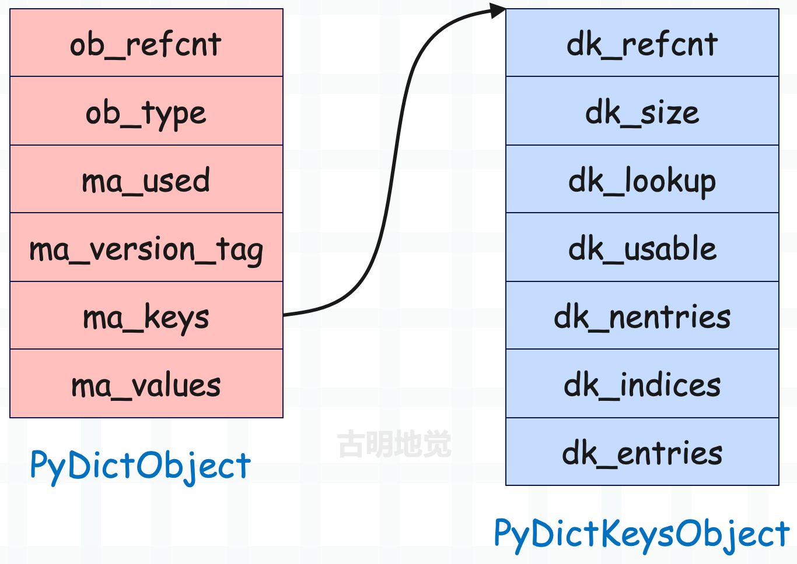
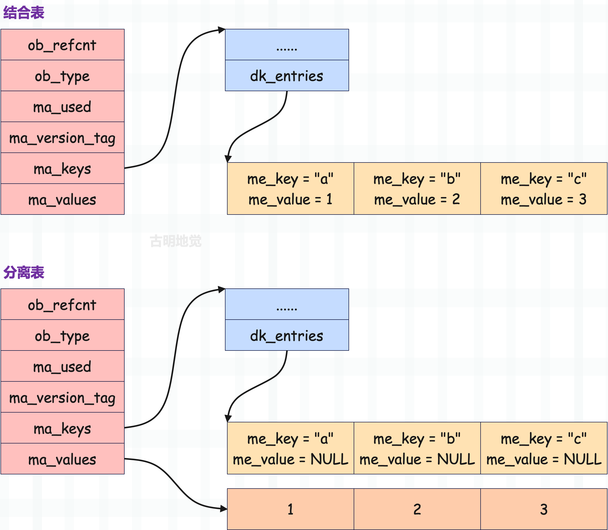

在介绍字典的底层结构时我们看到，当已使用的 entry 数量达到总容量的 2/3 时，会发生扩容。

而在早期，哈希表只使用一个键值对数组，这个键值对数组不仅要存储具体的 entry，还要承载哈希索引数组的功能。本来这个方式很简单，但是内存浪费严重，于是后面 Python 官方就将一个数组拆成两个数组来实现。

不是说只能用 2/3 吗？那就只给键值对数组申请 2/3 容量的空间，并且只负责存储键值对。至于索引，则由哈希索引数组来承载。通过将 key 映射成索引，找到指定的哈希槽，再根据槽里面存储的索引，找到键值对数组中存储的 entry。

> 因此减少内存开销的核心就在于，避免键值对数组的浪费。

所以哈希索引数组的长度就可以看成是哈希表的容量，而键值对数组的长度本身就是哈希索引数组长度的 2/3、或者说容量的 2/3。那么很明显，当键值对数组满了，就说明当前的哈希表要扩容了。

~~~C
// Objects/dictobject.c
#define GROWTH_RATE(d) ((d)->ma_used*3)
~~~

扩容之后的新哈希表的容量要大于等于 ma_used \* 3，注意是大于等于 ma_used \* 3，不是 dk_nentries \* 3。因为 dk_nentries 还包含了被删除的 entry，但哈希表在扩容的候会将其丢弃，所以扩容之后新哈希表的容量取决于 ma_used。

当然啦，哈希表的容量还要等于 2 的幂次方，所以有两个条件：

+ 大于等于 ma_used \* 3；
+ 等于 2 的幂次方；

基于以上两个限制条件，取到的最小值便是扩容之后的容量。而扩容的具体过程我们稍后会介绍，目前先来回顾一下基础知识。

以上是字典的底层结构，假设变量 mp 指向了 PyDictObject 实例，那么可以得到如下信息。

- `mp->ma_keys->dk_indices` 便是哈希索引数组，它的长度便是哈希表的容量。
- `mp->ma_keys->dk_entries` 便是键值对数组，里面的一个 entry 就是一个键值对。
- 如果字典使用的是结合表，那么 entry 的 me_key、me_value 字段负责存储键和值，此时 `mp->ma_values` 为 NULL。
- 如果字典使用的是分离表，那么 entry 的 me_key 字段负责存储键，me_value 字段则始终为 NULL，此时由 `mp->ma_values` 负责存储值，这种做法可以让多个字典共享一组 key，从而节省内存。

因为分离表是 Python 针对实例对象的属性字典单独设计的，我们平时创建的都是结合表，所以一开始并没有讨论分离表。但分离表其实非常简单，这里来补充一下吧。现在假设有一个字典，里面有三个键值对 "a": 1, "b": 2, "c": 3，我们看一下分别使用结合表和分离表存储时，字典的结构是什么样子。

所以结合表是键和值存在一起，分离表是键和值分开存储，非常好理解。我们自己创建的字典，使用的都是结合表，分离表是为了减少对象属性字典的内存使用而专门引入的。因此对于一个分离表而言，它的 key 一定都是字符串，否则不可能是分离表。而如果 key 都是字符串，那么既可以是分离表，也可以是结合表。

接着是转换关系：分离表可以重构为结合表，但反过来不行。

好，下面我们来看一下扩容逻辑，它由 dictresize 函数负责。

~~~C
// Objects/dictobject.c

#define PyDict_MINSIZE 8

static int
dictresize(PyDictObject *mp, Py_ssize_t minsize)
{
    // 参数 minsize 表示字典的 ma_used * 3，即长度 * 3
  
    Py_ssize_t newsize, numentries;
    // mp->ma_keys
    PyDictKeysObject *oldkeys;
    // mp->ma_values
    PyObject **oldvalues;
    // mp->ma_values->dk_entries
    PyDictKeyEntry *oldentries, *newentries;

    /* Find the smallest table size > minused. */
    // 初始容量为 8，如果 newsize < minsize，那么不断循环
    // 直到条件不满足时，便找到了大于等于 minsize 的最小 2 的幂次方数
    // newsize 便是字典扩容之后的新容量
    for (newsize = PyDict_MINSIZE;
         newsize < minsize && newsize > 0;
         newsize <<= 1)
        ;
    if (newsize <= 0) {
        PyErr_NoMemory();
        return -1;
    }
    // 获取扩容之前的 ma_keys
    oldkeys = mp->ma_keys;
    // 在介绍字典的创建时，我们说过这个函数，它负责为 PyDictKeysObject 实例申请内存
    mp->ma_keys = new_keys_object(newsize);
    if (mp->ma_keys == NULL) {
        mp->ma_keys = oldkeys;
        return -1;
    }
    assert(mp->ma_keys->dk_usable >= mp->ma_used);
    // 设置探测函数
    if (oldkeys->dk_lookup == lookdict)
        mp->ma_keys->dk_lookup = lookdict;
    // 字典的长度
    numentries = mp->ma_used;
    // 扩容之前的键值对数组
    oldentries = DK_ENTRIES(oldkeys);
    // 扩容之后的键值对数组
    newentries = DK_ENTRIES(mp->ma_keys);
    // 扩容之前的 ma_values
    oldvalues = mp->ma_values;
    // 如果 oldvalues 不为 NULL，说明字典使用的是分离表
    // 那么当字典发生扩容时，要转成结合表
    if (oldvalues != NULL) {
        // 将旧的键值对数组的 entry 拷贝到新的键值对数组中
        for (Py_ssize_t i = 0; i < numentries; i++) {
            assert(oldvalues[i] != NULL);
            PyDictKeyEntry *ep = &oldentries[i];
            PyObject *key = ep->me_key;
            Py_INCREF(key);
            // key 始终存储在 entry 中
            newentries[i].me_key = key;
            // 设置哈希值
            newentries[i].me_hash = ep->me_hash;
            // 将 mp->ma_values 里面的值，赋值给 entry->me_value
            newentries[i].me_value = oldvalues[i];
        }
        // 旧的 ma_keys 和 ma_values 要释放掉
        dictkeys_decref(oldkeys);
        mp->ma_values = NULL;
        if (oldvalues != empty_values) {
            free_values(oldvalues);
        }
    }
    // 说明字典使用的是结合表，重构的结果依旧是结合表
    else {  // combined table.
        // 如果 entry 的数量等于字典的长度，说明没有被删除的 entry，那么直接 memcpy 过去即可
        if (oldkeys->dk_nentries == numentries) {
            memcpy(newentries, oldentries, numentries * sizeof(PyDictKeyEntry));
        }
        // 否则遍历 oldentries，将 me_value != NULL 的 entry 拷贝过去
        else {
            PyDictKeyEntry *ep = oldentries;
            for (Py_ssize_t i = 0; i < numentries; i++) {
                while (ep->me_value == NULL)
                    ep++;
                newentries[i] = *ep++;
            }
        }

        assert(oldkeys->dk_lookup != lookdict_split);
        assert(oldkeys->dk_refcnt == 1);
        // 缓存池逻辑，后续聊
        if (oldkeys->dk_size == PyDict_MINSIZE &&
            numfreekeys < PyDict_MAXFREELIST) {
            _Py_DEC_REFTOTAL;
            keys_free_list[numfreekeys++] = oldkeys;
        }
        else {
            _Py_DEC_REFTOTAL;
            PyObject_FREE(oldkeys);
        }
    }
    // 到此键值对数组的元素就拷贝完了，然后还要进行索引映射，并存储在哈希槽中
    build_indices(mp->ma_keys, newentries, numentries);
    // dk_usable 表示还可以容纳多少个键值对
    // dk_nentries 表示已经容纳了多少个键值对
    // 而 numentries 表示字典的长度，所以重构之后
    // dk_usable 的大小要减去 numentries，dk_nentries 直接等于 numentries
    mp->ma_keys->dk_usable -= numentries;
    mp->ma_keys->dk_nentries = numentries;
    return 0;
}
~~~

因为要对哈希表的种类分情况讨论，所以导致代码有点长，但逻辑不难理解：

- 首先确定哈希表的容量，它要满足 2 的幂次方，并且大于等于 ma_used \* 3。
- 为 ma_keys 重新申请内存。
- 根据哈希表的种类分情况讨论，但核心都是将旧的没有被删除的 entry 搬过去。
- 释放 ma_keys，如果字典之前是分离表，还要释放 ma_values。

以上就是哈希表的扩容，或者说字典的扩容，我们就介绍到这儿，下一篇文章来介绍字典的缓存池。

------

&nbsp;

**欢迎大家关注我的公众号：古明地觉的编程教室。**

**如果觉得文章对你有所帮助，也可以请作者吃个馒头，Thanks♪(･ω･)ﾉ。**

