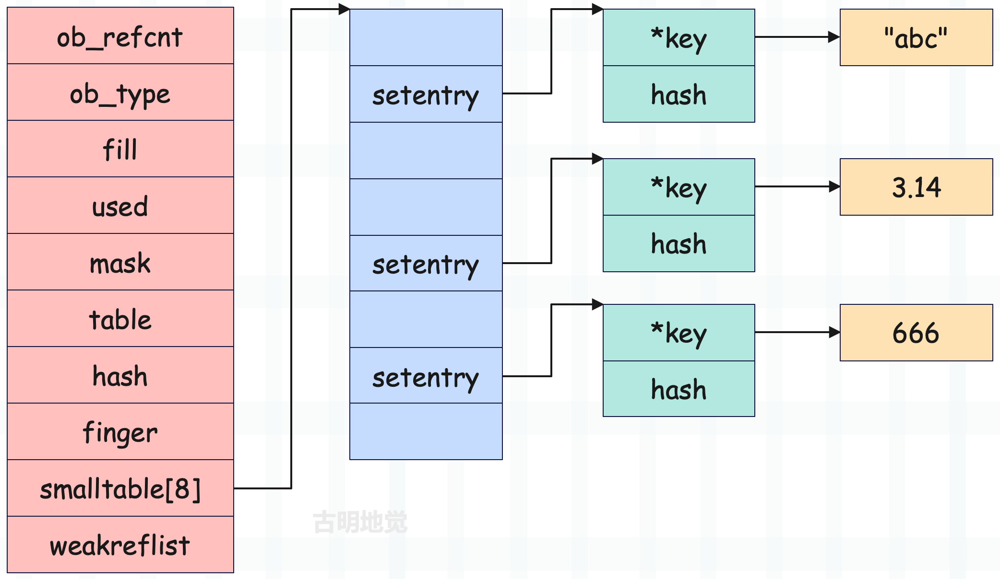
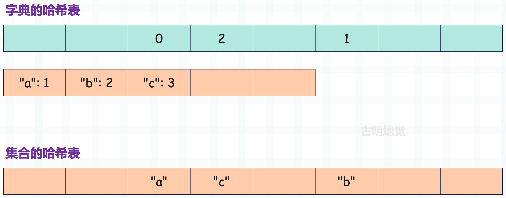
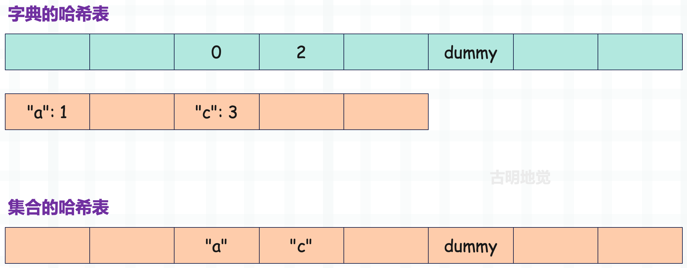
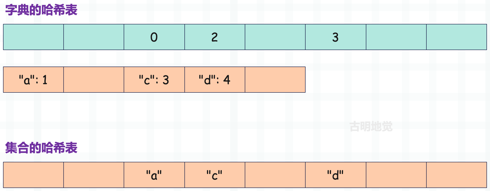

## 楔子

本篇文章来聊一聊 Python 的集合是怎么实现的？前面我们介绍了字典的实现原理，它底层是基于哈希表实现的，而集合也是如此。

> 事实上，集合就类似于没有 value 的字典。

## 集合的使用场景

那么集合都有哪些用处呢？

<font color="darkblue">**1）去重**</font>

~~~Python
chars = ["a", "b", "a", "c", "c"]

print(
    list(set(chars))
)  # ['b', 'a', 'c']
~~~

比如你需要监听一个队列，处理接收到的消息，但每一条消息都有一个编号，要保证具有相同编号的消息只能被处理一次，要怎么做呢？

显然集合此时就派上用场了，我们可以创建一个集合，每来一条消息，就检测它的编号是否在集合中。如果存在，则说明消息已经被处理过了，忽略掉；如果不存在，说明消息还没有被处理，那么就将它的编号添加到集合中，然后处理消息。

<font color="darkblue">**2）判断某个序列是否包含指定的多个元素**</font>

~~~Python
data = ["S", "A", "T", "O", "R", "I"]

# 现在要判断 data 是否包含 "T"、"R" 和 "I"
# 如果使用列表的话
print(
    "T" in data and "R" in data and "I" in data
)  # True

# 显然使用列表比较麻烦，并且效率也不高，于是我们可以使用集合
print(
    set(data) >= {"T", "R", "I"}
)  # True
~~~

同理，基于此方式，我们也可以检测一个字典是否包含指定的多个 key。

~~~Python
data = {
    "name": "satori",
    "age": 17,
    "gender": "female"
}

# 判断字典是否包含 name、age、gender 三个 key
print(
    data.keys() >= {"name", "age", "gender"}
)  # True

# 字典的 keys 方法会返回一个 dict_keys 对象
# 该对象具备集合的性质，可以直接和集合进行运算
~~~

显然对于这种需求，有了集合就方便多了。

## 集合的 API

然后我们来罗列一下集合支持的 API，在使用集合的时候要做到心中有数。

```python
# 如果是创建一个空集合，那么要使用 set()
# 写成 {} 的话，解释器会认为这是一个空字典
s = {1, 2, 3}

# 添加元素，时间复杂度是 O(1)
s.add(4)
print(s)  # {1, 2, 3, 4}

# 删除指定的元素，如果元素不存在，会抛出 KeyError
# 时间复杂度为 O(1)
s.remove(2)
print(s)  # {1, 3, 4}

# 删除指定的元素，如果元素不存在则什么也不做
# 时间复杂度为 O(1)
s.discard(666)
print(s)  # {1, 3, 4}

# 随机弹出一个元素并返回，如果集合为空，会抛出 KeyError
# 时间复杂度为 O(1)
print(s.pop())  # 1
print(s)  # {3, 4}

# 清空一个集合
s.clear()
print(s)  # set()

# 还有一些 API，但我们更推荐使用操作符的方式
# 两个集合取交集
print({1, 2} & {2, 3})  # {2}

# 两个集合取并集
print({1, 2} | {2, 3})  # {1, 2, 3}

# 两个集合取差集
# s1 - s2，返回在 s1、但不在 s2 当中的元素
print({1, 2, 3} - {2, 3, 4})  # {1}

# 两个集合取对称差集
# s1 ^ s2，返回既不在 s1、也不在 s2 当中的元素
print({1, 2, 3} ^ {2, 3, 4})  # {1, 4}

# 判断两个集合是否相等，也就是内部的元素是否完全一致
# 顺序无所谓，只比较元素是否全部相同
print({1, 2, 3} == {3, 2, 1})  # True
print({1, 2, 3} == {1, 2, 4})  # False

# 判断一个集合是否包含另一个集合的所有元素
# 假设有两个集合 s1 和 s2：
#    如果 s1 的元素都在 s2 中，那么 s2 >= s1；
#    如果 s2 的元素都在 s1 中，那么 s1 >= s2；
#    如果 s1 和元素和 s2 全部相同，那么 s1 == s2；
print({1, 2, 3} > {1, 2})  # True
print({1, 2, 3} >= {1, 2, 3})  # True
```

以上就是集合支持的一些 API，还是很简单的。

## 集合的底层结构

集合和字典的内部都使用了哈希表，但字典的哈希表采用两个数组实现，而集合的哈希表采用一个数组实现。因此对于集合来说，这个数组不仅要存储 entry，并且映射出的索引也是该数组的索引。

下面看一下集合的底层结构长什么样子。

~~~C
// Include/setobject.h

typedef struct {
    // 定长对象的头部信息，但集合显然是一个变长对象
    // 所以和字典一样，肯定有其它字段充当 ob_size
    PyObject_HEAD
    // Active 态的 entry 数量加上 Dummy 态的 entry 数量
    // 一个 entry 就是哈希表里的一个元素，类型为 setentry
    // 因此在集合里面，一个 entry 就是一个 setentry 结构体实例
    // 当删除集合的 entry 时，也必须是伪删除，因为要保证探测链不断裂
    // 如果 entry 被伪删除了，那么它便处于 Dummy 态
    Py_ssize_t fill;
    // Active 态的 entry 数量，显然这个 used 充当了 ob_size，也就是集合的元素个数
    Py_ssize_t used;
    // 在看字典源码的时候，我们也见到了 mask，它用于和哈希值进行按位与、计算索引
    // 并且这个 mask 等于哈希表的容量减 1，为什么呢？
    // 假设哈希值等于 v，哈希表容量是 n，那么通过 v 对 n 取模即可得到一个位于 0 到 n-1 之间的数
    // 然而取模运算的效率不高，应该使用 v&(n-1)，它的作用等价于 v%n，并且速度更快
    // 但是注意，只有在 n 为 2 的幂次方的时候，v&(n-1) 和 v%n 才是完全等价的
    // 所以哈希表的容量要求是 2 的幂次方，就是为了将取模运算优化成按位与运算
    Py_ssize_t mask;
    // 指向 setentry 数组首元素的指针
    // 这个 setentry 数组可以是下面的 smalltable，也可以是单独申请的一块内存
    setentry *table;
    // 集合的哈希值，只适用于不可变集合
    Py_hash_t hash;
    // 用于 pop 方法
    Py_ssize_t finger;
    // 一个 setentry 类型的数组，集合的元素就存在里面，但记得我们前面说过
    // 变长对象的内部不会存储具体的元素，而是会存储一个指针，该指针指向的内存区域才是用来存储具体元素的
    // 这样当扩容的时候，只需要让指针指向新的内存区域即可，从而方便维护
    // 没错，对于集合而言，只有在容量不超过 8 的时候，元素才会存在里面
    // 而一旦超过了 8，那么会使用 malloc 单独申请内存
    setentry smalltable[PySet_MINSIZE];
    // 弱引用列表，不做深入讨论
    PyObject *weakreflist;
} PySetObject;
~~~

有了字典的经验，再看集合会简单很多。然后是 setentry，用于承载集合内的元素，那么它的结构长什么样呢？相信你能够猜到。

~~~C
// Include/setobject.h

typedef struct {
    PyObject *key;
    Py_hash_t hash;
} setentry;
~~~

相比字典少了一个 value，这是显而易见的。

因此集合的结构很清晰了，假设有一个集合 <font color="blue">{3.14, "abc", 666}</font>，那么它的结构如下：



由于集合里面只有三个元素，所以它们都会存在 smalltable 数组里面，我们通过 ctypes 来证明这一点。

~~~python
from ctypes import *

class PyObject(Structure):
    _fields_ = [
        ("ob_refcnt", c_ssize_t),
        ("ob_type", c_void_p),
    ]

class SetEntry(Structure):
    _fields_ = [
        ("key", POINTER(PyObject)),
        ("hash", c_longlong)
    ]

class PySetObject(PyObject):
    _fields_ = [
        ("fill", c_ssize_t),
        ("used", c_ssize_t),
        ("mask", c_ssize_t),
        ("table", POINTER(SetEntry)),
        ("hash", c_long),
        ("finger", c_ssize_t),
        ("smalltable", (SetEntry * 8)),
        ("weakreflist", POINTER(PyObject)),
    ]


s = {3.14, "abc", 666}
# 先来打印一下哈希值
print('hash(3.14) =', hash(3.14))
print('hash("abc") =', hash("abc"))
print('hash(666) =', hash(666))
"""
hash(3.14) = 322818021289917443
hash("abc") = 2548892134347232650
hash(666) = 666
"""

# 获取 PySetObject 结构体实例
py_set_obj = PySetObject.from_address(id(s))
# 遍历 smalltable，打印索引和 key 的哈希值
for index, entry in enumerate(py_set_obj.smalltable):
    print(index, entry.hash)
"""
0 0
1 0
2 666
3 322818021289917443
4 0
5 0
6 2548892134347232650
7 0
"""
~~~

根据输出的哈希值我们可以断定，这三个元素确实存在了 smalltable 数组里面，并且 666 存在了数组索引为 2 的位置、3.14 存在了数组索引为 3 的位置、"abc" 存在了数组索引为 6 的位置。

当然，由于哈希值是随机的，所以每次执行之后打印的结果都可能不一样，但是整数除外，它的哈希值就是它本身。既然哈希值不一样，那么每次映射出的索引也可能不同，但总之这三个元素是存在 smalltable 数组里面的。

然后我们再考察一下其它的字段：

~~~python
s = {3.14, "abc", 666}
py_set_obj = PySetObject.from_address(id(s))
# 集合里面有 3 个元素，所以 fill 和 used 都是 3
print(py_set_obj.fill)  # 3
print(py_set_obj.used)  # 3

# 将集合元素全部删除
# 这里不能用 s.clear()，原因一会儿说
for _ in range(len(s)):
    s.pop()
    
# 我们知道哈希表在删除元素的时候是伪删除
# 所以 fill 不变，但是 used 每次会减 1
print(py_set_obj.fill)  # 3
print(py_set_obj.used)  # 0
~~~

fill 字段维护的是 Active 态的 entry 数量加上 Dummy 态的 entry 数量，所以删除元素时它的大小是不变的。但 used 字段的值每次会减 1，因为它维护的是 Active 态的 entry 的数量。所以在不涉及元素的删除时，这两者的大小是相等的。

另外我们说上面不能用 s.clear()，因为该方法表示清空集合，此时会重置为初始状态，然后 fill 和 used 都会是 0，这样就观察不到想要的现象了。

删除集合所有元素之后，我们再往里面添加元素，看看是什么效果：

~~~python
s = {3.14, "abc", 666}
py_set_obj = PySetObject.from_address(id(s))
for _ in range(len(s)):
    s.pop()

# 添加一个元素
s.add(0)
print(py_set_obj.fill)  # 3
print(py_set_obj.used)  # 1
~~~

多次执行的话，会发现打印的结果可能是 3、1，也有可能是 4、1。至于原因，有了字典的经验，相信你肯定能猜到。

首先添加元素之后，used 肯定为 1。至于 fill，如果添加元素的时候，正好撞上了一个 Dummy 态的 entry，那么将其替换掉，此时 fill 不变，仍然是 3。但如果没有撞上 Dummy 态的 entry，而是添加在了新的位置，那么 fill 就是 4。

~~~python
for i in range(1, 10):
    s.add(i)
print(py_set_obj.fill)  # 10
print(py_set_obj.used)  # 10
s.pop()
print(py_set_obj.fill)  # 10
print(py_set_obj.used)  # 9
~~~

在之前代码的基础上，继续添加 9 个元素，然后 used 变成了 10，这很好理解，因为此时集合有 10 个元素。但 fill 也是 10，这是为什么？很简单，因为哈希表扩容了，扩容时会删除 Dummy 态的 entry，所以 fill 和 used 是相等的。同理，如果再继续 pop，那么 fill 和 used 就又变得不相等了。

## 集合的创建

集合的结构我们已经清楚了，再来看看它的初始化过程。我们调用类 set，传入一个可迭代对象，便可创建一个集合，这个过程是怎样的呢？

~~~C
// Objects/setobject.c
PyObject *
PySet_New(PyObject *iterable)
{
    return make_new_set(&PySet_Type, iterable);
}

static PyObject *
make_new_set(PyTypeObject *type, PyObject *iterable)
{
    PySetObject *so;
    // 为 PySetObject 申请内存，初始容量为 8
    so = (PySetObject *)type->tp_alloc(type, 0);
    if (so == NULL)
        return NULL;
    // 对字段做初始化
    so->fill = 0;
    so->used = 0;
    so->mask = PySet_MINSIZE - 1;
    // 哈希表容量为 8 时，元素会存在 smalltable 里面
    // 因此直接将 smalltable 赋值给 table
    so->table = so->smalltable;
    so->hash = -1;
    so->finger = 0;
    so->weakreflist = NULL;
    
    // 遍历 iterable，将迭代出的元素添加到集合中
    // 关于这个函数，我们之后再介绍
    if (iterable != NULL) {
        if (set_update_internal(so, iterable)) {
            Py_DECREF(so);
            return NULL;
        }
    }

    return (PyObject *)so;
}
~~~

可以看到，集合的创建过程非常简单。

## 字典和集合的哈希表的差异

字典和集合都是采用哈希表实现的，但字典的哈希表使用了两个数组，而集合的哈希表使用了一个数组，我们对比一下两者的差异。

假设有一个字典和一个集合，字典包含三个键值对，分别是 <font color="blue">"a": 1、"b": 2、"c": 3</font>，集合包含三个元素，分别是 <font color="blue">"a"、"b"、"c"</font>，然后映射出的索引分别是 2、5、3。



> 注：为了方便，这里的图画得没有那么严谨。比如集合的哈希表，里面的元素直接用字符串代替了，但其实它存储的是 <font color="blue">setentry entry</font>，而 <font color="blue">entry 的 key 字段</font>指向的才是字符串。当然这里我们心里清楚就好。

在介绍字典的时候我们说过，早期的字典内部的哈希表也是使用一个数组实现，除了 entry 会多存储一个 value 之外，其它和当前的集合是类似的。

但如果只使用一个数组实现，会导致内存浪费严重，因为哈希表必须要保证一定的稀疏性。所以后续字典内部的哈希表采用两个数组实现，将存储键值对的数组的长度压缩到原来的 2/3，至于映射出的索引则由另一个数组（哈希索引数组）来承载。虽然引入新的数组会带来额外的内存开销（假设大小为 m 字节），但存储键值对的数组不用再浪费 1/3 的空间（假设大小为 n 字节），只要 m 小于 n，那么使用两个数组就会更加节省内存。而在介绍字典的时候我们也看到了，m 是远小于 n 的。

那么问题来了，为什么集合不使用两个数组呢？很简单，因为使用一个数组实现哈希表会更简单，虽然也更加浪费内存。而集合和字典在哈希表的实现上之所以区别对待，还是使用频率的问题，解释器内部极度依赖字典，比如全局变量就是使用字典存储的。

可以说字典的效率高度影响着整个解释器的效率，字典的内存大小高度影响着解释器的内存占用。因此 Python 除了优化字典的搜索性能之外，还要尽可能地减少字典的内存大小。所以字典搞出了分离表、结合表，这一切操作都是为了将字典的内存占用降到最低。

至于集合，解释器对它的依赖就很小了，所以内部的哈希表，只采用了一个数组实现。虽然会有内存浪费，但无伤大雅。

好，回到上面的例子，如果将字典的键值对 <font color="blue">"b": 2</font> 和集合的元素 <font color="blue">"b"</font> 删掉，那么它们的结构会发生什么变化呢？



"b" 映射出的索引为 5，因此对于字典来说，会将索引为 5 的哈希槽的值设置为 dummy。然后是键值对数组，会将指定的 entry 的 me_key 和 me_value 字段全部设置为 NULL，相当于回归到了初始状态。

> 需要注意的是，数组一旦申请，那么 entry 的空间就已经有了，只是 me_key 和 me_value 字段均为 NULL。而所谓添加键值对，本质上也是修改指定 entry 的 me_key 和 me_value 字段。

对于集合来说，它只有一个数组，这个数组不仅要存储键值对，它的索引还表示 key 映射出的索引，当然这里的 key 指的就是集合的元素。"b" 映射出的索引为 5，所以将数组中索引为 5 的 `entry->key` 设置为 dummy。

但要注意的是，字典的 dummy 是一个整数，值为 -2（DKIX_DUMMY），因为哈希索引数组存储的是<font color="blue">键值对数组的索引</font>，显然这是一个整数。然后 key 映射出的索引是哈希索引数组的索引，如果对应的哈希槽存储的值是 -2，说明当前搜索的 key 对应的 entry 被删除了，应该继续向后搜索。

而集合的 dummy 是一个结构体指针，定义如下：

~~~C
// Objects/setobject.c
static PyObject _dummy_struct;
#define dummy (&_dummy_struct)
~~~

因为集合内部的哈希表只使用了一个数组，该数组存储的是 setentry。如果在查找的时候，发现对应的 entry 的 key 等于 dummy，就知道该 entry 被删除了，应该继续向后搜索。

好，继续回到上面的例子，假设这时候再给字典添加一个键值对 <font color="blue">"d": 4</font>，给集合添加一个元素 <font color="blue">"d"</font>，而字符串 "d" 映射出的索引也是 5，那么结构是怎样的呢？



对于字典来说，键值对始终按照先来后到的顺序添加在键值对数组中，然后将它在键值对数组中的索引保存在指定的哈希槽中。由于索引为 5 的哈希槽保存的是 -2，处于 Dummy 态，因此直接将它设置为 3。

同理对于集合来说也是类似的。数组索引为 5 的位置保存的值等于 dummy，处于 Dummy 态，说明该元素被删除了，那么直接替换掉。因此整个过程的逻辑很简单：由于索引会存在冲突，所以元素删除之后，需要写入一个特殊的墓碑值，也就是这里的 dummy，因为要保证探测链不断裂。但如果集合后续添加元素时，正好撞上了一个 Dummy 态的 entry，那么会直接替换掉。

所以不论是字典还是集合，只要处于 Dummy 态，都可以替换掉。因为 Dummy 态存在的目的就是为了保证探测链不断裂，而替换之后探测链依旧是完整的。

## 小结

以上我们就剖析了集合的底层结构以及它的创建过程，不难发现集合的实现比字典要简单很多，并且集合没有自己的缓存池。

下一篇文章来介绍集合的相关操作。

-----

&nbsp;

**欢迎大家关注我的公众号：古明地觉的编程教室。**


**如果觉得文章对你有所帮助，也可以请作者吃个馒头，Thanks♪(･ω･)ﾉ。**

