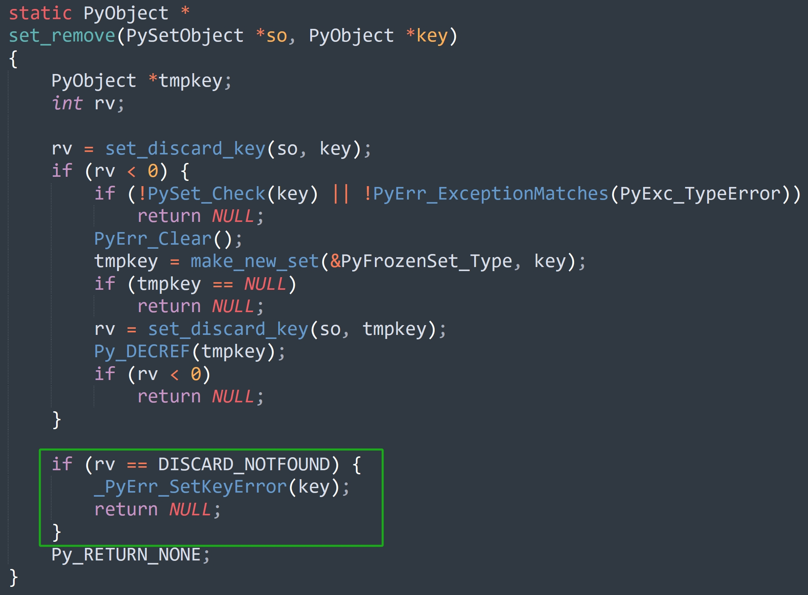

## 楔子

本篇文章来聊一聊集合支持的操作，比如元素的添加、删除，以及集合的扩容等等。并且集合还支持交集、并集、差集等运算，它们又是如何实现的呢？下面就一起来看一看。

## add 方法：添加元素

调用 add 方法可以向集合添加一个元素，在底层会执行 set_add 函数。

~~~C
// Objects/setobject.c
static PyObject *
set_add(PySetObject *so, PyObject *key)
{
    // 调用了 set_add_key 函数
    if (set_add_key(so, key))
        return NULL;
    // 返回 None
    Py_RETURN_NONE;
}

static int
set_add_key(PySetObject *so, PyObject *key)
{
    Py_hash_t hash;

    // 计算哈希值，由于字符串内部会缓存自身的哈希值，因此需要判断一下
    // 如果 key 不是字符串，或者 key 是字符串、但哈希值为 -1（尚未计算过）
    // 那么计算哈希值，但如果计算之后的结果是 -1，说明对象不支持哈希
    if (!PyUnicode_CheckExact(key) ||
        (hash = ((PyASCIIObject *) key)->hash) == -1) {
        hash = PyObject_Hash(key);
        if (hash == -1)
            return -1;
    }
    // 调用 set_add_entry
    return set_add_entry(so, key, hash);
}
~~~

假设有一个集合 so，那么 so.add("abc") 最终等价于 set_add_entry(so, "abc", hash("abc"))，所以核心逻辑位于 set_add_entry 里面，看一下它的实现，代码比较长。

~~~C
// Objects/setobject.c
static int
set_add_entry(PySetObject *so, PyObject *key, Py_hash_t hash)
{
    setentry *table;
    setentry *freeslot;
    setentry *entry;
    size_t perturb;
    size_t mask;
    size_t i;
    size_t j;
    int cmp;

    // 增加 key 的引用计数，当然这里的 key 指的就是集合的元素
    Py_INCREF(key);

  restart:
    // mask 等于哈希表的容量减 1
    mask = so->mask;
    // 和字典一样，让 hash & mask 计算出一个索引
    i = (size_t)hash & mask;
    
    // 获取对应的 entry，里面包含了元素 key 和哈希值
    // 如果 key == NULL，说明该位置还没有存储元素
    // 此时就找到了合适的位置，跳转到 found_unused 标签
    entry = &so->table[i];
    if (entry->key == NULL)
        goto found_unused;

    freeslot = NULL;
    // perturb 初始等于哈希值
    perturb = hash;

    while (1) {
        // 到这里说明指定的位置已经存储了元素，那么判断哈希值是否相同
        // 如果哈希值不同，那么 key 一定不相同
        // 如果哈希值相同，那么 key 不一定相同
        if (entry->hash == hash) {
            // 所以当哈希值相等时，还要比较新添加的 key 和已存在的 key 是否相同
            PyObject *startkey = entry->key;
            assert(startkey != dummy);
          、// 这里的 startkey 和 key 都是 C 的变量，它们都是指针
            // 如果两者相等，说明指向的是同一个对象，那么直接判定为相等，于是跳转到 found_active 标签
            if (startkey == key)  // 相当于 Python 的 is
                goto found_active;
            // 如果 startkey 和 key 不等，说明指向的不是同一个对象
            // 那么比较值是否相等，相当于 Python 的 ==
            // 这里是针对字符串的一个快分支
            if (PyUnicode_CheckExact(startkey)
                && PyUnicode_CheckExact(key)
                && _PyUnicode_EQ(startkey, key))
                goto found_active;
            table = so->table;
            Py_INCREF(startkey);
            // 如果 key 不是字符串，则执行通用比较逻辑
            cmp = PyObject_RichCompareBool(startkey, key, Py_EQ);
            Py_DECREF(startkey);
            // cmp > 0，说明结果为真，即两个 key 的值相等
            // 跳转到 found_active 标签
            if (cmp > 0)
                goto found_active;
            // cmp < 0 表示执行比较操作时出现错误，基本不会发生
            if (cmp < 0)
                goto comparison_error;
            // 到这里说明两个 key 虽然映射出的索引是一样的，但它们的值不相等
            // 那么要怎么办呢？显然要看下一个 entry 是否可用
            // 然后下面这三行代码估计让人有些费解，所做的事情如下
            // 如果在查询的过程中，哈希表扩容了，或者 key 发生了改变，那么跳转到 restart 标签重新执行
            // 但因为 GIL 的存在，实际不会发生
            if (table != so->table || entry->key != startkey)
                goto restart;
            mask = so->mask;
        }
        /* 如果是 Unused 态的 entry，那么 
         *     entry->key == NULL
         *     entry->hash == 0
         *
         * 如果是 Dummy 态的 entry，那么
         *     entry->key == dummy
         *     entry->hash == -1
         *
         * 如果是 Active 态的 entry，那么
         *     entry->key == some key
         *     entry->hash == some hash
         */
        // 说明 entry 处于 dummy 态，将它赋值给 freeslot
        else if (entry->hash == -1)
            freeslot = entry;
        // 关于这一步是做什么的，一会儿解释
        if (i + LINEAR_PROBES <= mask) {
            for (j = 0 ; j < LINEAR_PROBES ; j++) {
                entry++;
                if (entry->hash == 0 && entry->key == NULL)
                    goto found_unused_or_dummy;
                if (entry->hash == hash) {
                    PyObject *startkey = entry->key;
                    assert(startkey != dummy);
                    if (startkey == key)
                        goto found_active;
                    if (PyUnicode_CheckExact(startkey)
                        && PyUnicode_CheckExact(key)
                        && _PyUnicode_EQ(startkey, key))
                        goto found_active;
                    table = so->table;
                    Py_INCREF(startkey);
                    cmp = PyObject_RichCompareBool(startkey, key, Py_EQ);
                    Py_DECREF(startkey);
                    if (cmp > 0)
                        goto found_active;
                    if (cmp < 0)
                        goto comparison_error;
                    if (table != so->table || entry->key != startkey)
                        goto restart;
                    mask = so->mask;
                }
                else if (entry->hash == -1)
                    freeslot = entry;
            }
        }
        // 到这里说明 (&so->table[i])->key 和添加的 key 不相等，即出现了索引冲突
        // 那么要改变规则，重新映射，直到映射出一个可用的位置
        perturb >>= PERTURB_SHIFT;
        i = (i * 5 + 1 + perturb) & mask;

        entry = &so->table[i];
        if (entry->key == NULL)
            goto found_unused_or_dummy;
    }

  found_unused_or_dummy:
    // 如果 freeslot == NULL，说明没有撞上 Dummy 态的 entry
    // 跳转到 found_unused 标签
    if (freeslot == NULL)
        goto found_unused;
    // 否则说明撞上了 Dummy 态的 entry
    // 集合的长度加 1，或者说 Active 态的 entry 个数加 1
    so->used++;
    // 更新 key 和 hash
    freeslot->key = key;
    freeslot->hash = hash;
    return 0;

  found_unused:
    // 执行到这里，说明找到了新的可用位置
    // 那么不光 used 要加 1，fill 也要加 1
    so->fill++;
    so->used++;
    // 更新 key 和 hash
    entry->key = key;
    entry->hash = hash;
    // 如果哈希表的 entry 的个数（Active 态 + Dummy 态）没超过 mask * 3 / 5
    // 那么目前的容量是合理的，直接返回
    if ((size_t)so->fill*5 < mask*3)
        return 0;
    // 否则进行扩容，因为扩容的时候会丢弃 Dummy 的 entry
    // 所以扩容之后的容量取决于 used，而不是 fill
    // 如果 used 大于 50000，那么 2 倍扩容，否则 4 倍扩容
    return set_table_resize(so, so->used>50000 ? so->used*2 : so->used*4);

  found_active:
    // 执行到这里，说明添加的元素已经存在了
    // 那么减少 key 的引用计数，然后返回
    Py_DECREF(key);
    return 0;

  comparison_error:
    // 执行比较操作时出现错误，应该抛出异常，但这一步基本不会发生
    Py_DECREF(key);
    return -1;
}
~~~

所以整个过程和字典是类似的，依旧是将哈希值和 mask 按位与，得到索引，通过索引找到对应的 entry。接下来对 entry 分情况讨论。

**如果 `entry->key == NULL`。**

说明找到了可用的 entry，那么直接跳转到 found_unused 标签，然后修改 entry 的 key 和 hash 字段，这样新元素就添加成功了。

**如果 `entry->hash == hash`。**

说明找到的 entry 处于 Active 态，那么比较两个 key 是否相等。如果相等，证明添加的元素已存在，则不插入，直接减少引用计数，因为不是字典，不存在更新一说。但如果两个 key 不相等，说明出现索引冲突，那么要映射出一个新的索引，并且映射的方式和字典也是一样的。

~~~C
perturb >>= PERTURB_SHIFT;
i = (i * 5 + 1 + perturb) & mask;
~~~

但字典和集合有一处不同，就是集合这里多了一个 for 循环。

~~~C
// Objects/setobject.c
#define LINEAR_PROBES 9

static int
set_add_entry(PySetObject *so, PyObject *key, Py_hash_t hash)
{
    // ...

    while (1) {
        // ...
        
        // 当前映射出的索引为 i，如果 i + 9 没有超过 mask，那么循环 9 次
        if (i + LINEAR_PROBES <= mask) {
            for (j = 0 ; j < LINEAR_PROBES ; j++) {
                entry++;
                if (entry->hash == 0 && entry->key == NULL)
                    goto found_unused_or_dummy;
                if (entry->hash == hash) {
                    PyObject *startkey = entry->key;
                    assert(startkey != dummy);
                    if (startkey == key)
                        goto found_active;
                    if (PyUnicode_CheckExact(startkey)
                        && PyUnicode_CheckExact(key)
                        && _PyUnicode_EQ(startkey, key))
                        goto found_active;
                    table = so->table;
                    Py_INCREF(startkey);
                    cmp = PyObject_RichCompareBool(startkey, key, Py_EQ);
                    Py_DECREF(startkey);
                    if (cmp > 0)
                        goto found_active;
                    if (cmp < 0)
                        goto comparison_error;
                    if (table != so->table || entry->key != startkey)
                        goto restart;
                    mask = so->mask;
                }
                else if (entry->hash == -1)
                    freeslot = entry;
            }
        }
        // ...
    }

    // ...
}
~~~

当映射出的索引相同、但 key 不相同时，说明出现了索引冲突，对于字典来说，会立即重新映射，找到一个新的索引。而集合由于只用一个数组存储，可以有更好的做法。我们知道 CPU 是有缓存的，像 L1 Cache 加载数据会一次性加载 64 字节，称为一个 cache line。所以通过索引遍历包含 16 个 int32 的数组，每次 i++ 和每次 i += 4 的耗时是差不多的。

对于集合来说，因为映射出的索引是随机的，使得对应的 entry 可能不在 cache 中，从而导致 CPU 下一次要重新读取。所以 Python 引入了 LINEAR_PROBES，从当前的 entry 开始，向后查找 9 个 entry。如果还找不到可用位置，然后才重新计算，从而提高 cache 的稳定性。

**如果 `entry->hash == -1`，或者说 `entry->key == dummy`。**

说明撞上了一个 Dummy 态的 entry，但估计有人又注意到了一个问题。

就是在发现 Dummy 态的 entry 之后，为啥没有立即跳转到 found_unused_or_dummy 标签，而是要继续循环呢？

很简单，我们假设在发现 Dummy 态的 entry 之后立即跳转，看看会有什么后果。首先向集合添加一个元素 x，再添加一个元素 y，但 y 和 x 映射出的索引相同，那么在添加 y 的时候，会形成一条探测链，对应的元素就是 `x->y`。然后再将 x 删除，那么 `x->y` 就变成了 `dummy->y`。这时候如果再重新添加一个元素 y，那么肯定会撞上 Dummy 态的 entry，于是 `dummy->y` 就变成了 `y->y`。

所以当发现 Dummy 态的 entry 之后，如果立即跳转，就会无法消除集合的重复元素。因此正确的做法是先用变量保存起来，这里赋值给了 freeslot，然后继续查找。如果找到了相同的元素，那么就不添加了，因为集合中的元素是唯一的。但如果最后找到的 entry 的 key 为空，说明元素不存在，此时才能跳转到 found_unused_or_dummy 标签，然后对 freeslot 进行判断。如果不为空，说明撞上了 Dummy 态的 entry，那么直接复用该 entry 即可。

以上就是集合添加元素的过程，当然如果找到的是 Unused 态的 entry，还要判断容量的问题。如果 Active 态 + Dummy 态的 entry 个数不小于 3/5\*mask，那么扩容，扩容的规则是判断 Active 态的 entry 个数是否大于 50000，是的话就 2 倍扩容，否则 4 倍扩容；

## pop 方法：弹出元素

调用 pop 方法，可以从集合中弹出一个元素，在底层会执行 set_pop 方法。

~~~C
// Objects/setobject.c

static PyObject *
set_pop(PySetObject *so, PyObject *Py_UNUSED(ignored))
{
    // so->table 是指向 entry 数组首元素的指针
    // so->finger 是做什么的，稍后解释，总之它是一个整数
    // so->mask 等于 entry 数组的长度减 1，用于将取模运算优化成按位与运算

    // 因此 so->finger & so->mask 会得到一个 0 ~ mask 之间的整数，我们记为 n
    // 显然这里的变量 entry 会指向 entry 数组中索引 n 的元素
    setentry *entry = so->table + (so->finger & so->mask);
    // 变量 limit 则指向 entry 数组中最后一个元素（索引为 mask）
    setentry *limit = so->table + so->mask;
    PyObject *key;
    // 如果集合长度为 0，那么 pop 方法会抛出 KeyError
    if (so->used == 0) {
        PyErr_SetString(PyExc_KeyError, "pop from an empty set");
        return NULL;
    }
    // entry 有三种状态，但显然弹出的 entry 一定是 Active 态
    // 所以如果 entry 处于 Unused 或 Dummy 态，直接下一轮循环
    while (entry->key == NULL || entry->key==dummy) {
        entry++;
        // 我们记 so->finger & so->mask 的结果为 n
        // 所以相当于从 entry 数组中索引为 n 的位置开始遍历
        // 如果遍历到最后一个位置，也没找到 Active 态的 entry，那么从头开始遍历
        if (entry > limit)
            entry = so->table;  // 让变量 entry 指向 entry 数组的首元素
        // 所以不难发现，整个过程是先遍历 entry 数组中 [n: limit] 的部分
        // 如果没有找到 Active 态 entry，那么将 entry 重置为 so->table，从头开始遍历
        // 因为执行到这里，说明 so->used 大于 0，即集合的长度大于 0
        // 那么当 entry > limit 时，在 entry 数组 [0: n] 的部分，一定存在 Active 态的 entry
    }
    // pop 方法会返回弹出的元素，所以获取 entry->key
    key = entry->key;
    // 元素被弹出了，对应的 entry 要进行伪删除，所谓的伪删除就是设置一个特殊的墓碑值
    // 所以将 entry->key 设置为 dummy，将 entry->hash 设置为 -1
    entry->key = dummy;
    entry->hash = -1;
    // 集合的长度减 1
    so->used--;
    // 将 finger 更新为被删除的 entry 在 entry 数组中的索引加 1
    so->finger = entry - so->table + 1;   /* next place to start */
    return key;
}
~~~

所以删除的过程还是很简单的，如果不考虑 finger 字段，你就可以简单理解为遍历整个 entry 数组，找到 Active 态的 entry，然后删除即可。只是这么做会导致每次 pop 时，都要重头开始遍历数组。

而当引入了 finger 字段之后，由于该字段初始为 0，所以第一次 pop 时，会从数组的头部开始遍历。假设删除的是数组中索引为 n 的 entry，那么删除之后 finger 字段会被赋值为 n + 1，那么下一次 pop 就会从数组中索引为 n + 1 的 entry 开始遍历。

我们通过 ctypes 来验证这一点：

~~~python
from ctypes import *

class PyObject(Structure):
    _fields_ = [
        ("ob_refcnt", c_ssize_t),
        ("ob_type", c_void_p),
    ]

class SetEntry(Structure):
    _fields_ = [
        ("key", POINTER(PyObject)),
        ("hash", c_longlong)
    ]

class PySetObject(PyObject):
    _fields_ = [
        ("fill", c_ssize_t),
        ("used", c_ssize_t),
        ("mask", c_ssize_t),
        ("table", POINTER(SetEntry)),
        ("hash", c_long),
        ("finger", c_ssize_t),
        ("smalltable", (SetEntry * 8)),
        ("weakreflist", POINTER(PyObject)),
    ]

s = {11, 22, 33, 44}
# 获取 PySetObject 结构体实例
py_set_obj = PySetObject.from_address(id(s))
# 遍历 smalltable，打印索引和 key 的哈希值
# 对于整数来说，它的哈希值等于自身
for index, entry in enumerate(py_set_obj.smalltable):
    print(index, entry.hash)
"""
0 0
1 33
2 0
3 11
4 44
5 0
6 22
7 0
"""
# finger 初始为 0，因此在 pop 元素的时候会从头开始遍历数组
# 找到第一个 Active 态的 entry
print(py_set_obj.finger)
"""
0
"""

# 显然第一次 pop 出的元素是 33
print(s.pop())
"""
33
"""
for index, entry in enumerate(py_set_obj.smalltable):
    print(index, entry.hash)
"""
0 0
1 -1
2 0
3 11
4 44
5 0
6 22
7 0
"""
# 因为被伪删除了
# 所以索引为 1 的 entry->key 会被设置为 NULL，entry->hash 被设置为 -1
# 至于 finger 则等于 1 + 1，下一次 pop 时，会从索引为 2 的位置开始遍历
print(py_set_obj.finger)
"""
2
"""

# 那么同理，再次 pop 的时候，会弹出 11，然后 finger 变为 3 + 1 = 4
print(s.pop())
"""
11
"""
print(py_set_obj.finger)
"""
4
"""
~~~

以上就是 finger 字段的作用，它避免了每次都要从头遍历 entry 数组。从这里也不难发现，当一个集合不断执行 pop 方法，将所有元素依次弹出时，这些元素的顺序和直接遍历 entry 数组拿到的元素的顺序是一致的。

~~~Python
item1 = 22333
item2 = 177
item3 = 520
item4 = 10086
# 将它们映射成索引，由于是 4 个元素，因此哈希表容量为 8
index1 = item1 & 7
index2 = item2 & 7
index3 = item3 & 7
index4 = item4 & 7
print(index1, index2, index3, index4)
"""
5 1 0 6
"""
# 所以如果将 item1、item2、item3、item4 放到集合中
# 不管怎么排列，最终都是下面这个结果
# item3 会位于 entry 数组中索引为 0 的位置
# item2 会位于 entry 数组中索引为 1 的位置
# item1 会位于 entry 数组中索引为 5 的位置
# item4 会位于 entry 数组中索引为 6 的位置

# 所以不管是弹出元素，还是遍历元素，亦或是直接打印集合
# 元素顺序一定是 item3、item2、item1、item4
s1 = {item1, item2, item3, item4}
s2 = {item2, item1, item4, item3}
s3 = {item3, item1, item2, item4}
s4 = {item4, item3, item2, item1}
print(s1)  # {520, 177, 22333, 10086}
print(s2)  # {520, 177, 22333, 10086}
print(s3)  # {520, 177, 22333, 10086}
print(s4)  # {520, 177, 22333, 10086}
print(
    item3, item2, item1, item4
)  # 520 177 22333 10086
~~~

怎么样，是不是对集合又有了更深刻的认识了呢？

## remove 方法：删除指定元素

remove 方法可以接收参数，删除集合中指定的元素。除了 remove，还有一个 discard 方法，这两个方法的作用一模一样，都是用来删除指定元素。区别就是当删除的元素不存在时，remove 方法会抛出 KeyError，而 discard 方法不会。

remove 方法在底层对应 set_remove 函数，discard 方法在底层对应 set_discard 函数，而 set_remove 函数只比 set_discard 函数多了一个 if 判断，我们来看一下。

以上是 set_remove 函数，注意图中绿色方框的部分，如果要删除的元素不存在，那么 rv 会等于 DISCARD_NOTFOUND，于是抛出 KeyError。

如果将绿色方框里的 if 逻辑删掉，得到的就是 set_discard 函数的源码。所以这两个函数做的事情是一样的，区别就是 set_remove 会多做一层检测，当删除的元素不存在时，set_remove 会主动抛出一个 KeyError，而 set_discard 函数则什么也不做。

所以这里我们只看 set_remove 函数即可。

~~~C
// Objects/setobject.c

#define DISCARD_NOTFOUND 0
#define DISCARD_FOUND 1

static PyObject *
set_remove(PySetObject *so, PyObject *key)
{
    // 要删除的 key，或者说元素
    // 当然啦，从 C 的层面来看，删除 key 其实就是删除数组中该 key 对应的 entry
    // 只不过这个删除是伪删除，即写入一个特殊的墓碑值
    PyObject *tmpkey;
    int rv;
    // rv 表示删除结果，显然删除逻辑由 set_discard_key 函数实现
    // 如果 rv < 0，表示删除元素时出现错误，比如传入了一个不可哈希的对象
    // 如果 rv == 0，表示要删除的元素在集合中不存在
    // 如果 rv == 1，表示成功将元素从集合中删除
    rv = set_discard_key(so, key);
    if (rv < 0) {
        // 当传入一个不可哈希对象时，会抛出 TypeError
        // 我们知道集合也是不可哈希的，但如果要删除的 key 是集合类型
        // 那么解释器会额外做一个兜底操作，我们一会儿通过 Python 代码演示
        if (!PySet_Check(key) || !PyErr_ExceptionMatches(PyExc_TypeError))
            return NULL;
        // 将回溯栈里的异常清空
        PyErr_Clear();
        // 基于集合里的元素创建不可变集合
        tmpkey = make_new_set(&PyFrozenSet_Type, key);
        if (tmpkey == NULL)
            return NULL;
        // 然后尝试删除这个不可变集合，如果还删除失败，则报错
        rv = set_discard_key(so, tmpkey);
        Py_DECREF(tmpkey);
        if (rv < 0)
            return NULL;
    }
    // 如果 rv == DISCARD_NOTFOUND，表示要删除的元素不存在
    if (rv == DISCARD_NOTFOUND) {
        _PyErr_SetKeyError(key);  // 抛出 KeyError
        return NULL;
    }
    Py_RETURN_NONE;
}
~~~

我们看到当元素删除失败时，如果 key 是集合类型，那么解释器会做一个兜底操作，这是什么意思呢？我们演示一遍。

~~~python
try:
    s = {[1, 2, 3]}  # 列表不可哈希
except TypeError as e:
    print(e)
"""
unhashable type: 'list'
"""

try:
    s = {{1, 2, 3}}  # 同样，集合也不可哈希
except TypeError as e:
    print(e)
"""
unhashable type: 'set'
"""

# 当我们尝试 remove 列表时，依旧会抛出相同的错误
s = {1, 2, 3}
try:
    s.remove([])
except TypeError as e:
    print(e)
"""
unhashable type: 'list'
"""

# 但 remove 一个集合就不同了
s = {
    frozenset({1, 2, 3}),
    frozenset({4, 5, 6}),
}
# 不可变集合是可哈希对象，因此它可以放在集合中，也可以被删除
s.remove(frozenset({1, 2, 3}))
# 但删除可变集合理论上应该和删除列表一样，抛出 TypeError: unhashable type: 'set'
# 而事实上异常也确实产生了，保存在回溯栈中，但是从源码中我们看到，解释器会多做一个检测
# 如果删除的 key 是集合类型，并且栈里的异常是 TypeError，那么将异常清空
# 然后基于集合创建不可变集合，并尝试删除这个不可变集合
s.remove({4, 5, 6})
# 所以这里 s.remove({4, 5, 6}) 等价于 s.remove(frozenset({4, 5, 6}))
print(s)
"""
set()
"""
# 我们看到 s 里面的两个不可变集合被删除了
~~~

好，我们回到 set_remove 函数，它在删除元素时会调用 set_discard_key 函数，显然删除指定元素的核心逻辑位于此函数中，我们看一下它做了什么。

~~~C
// Objects/setobject.c

static int
set_discard_key(PySetObject *so, PyObject *key)
{
    Py_hash_t hash;
    // 计算哈希值
    if (!PyUnicode_CheckExact(key) ||
        (hash = ((PyASCIIObject *) key)->hash) == -1) {
        hash = PyObject_Hash(key);
        if (hash == -1)
            return -1;
    }
    // 调用 set_discard_entry 函数
    // 传入三个参数：集合、要删除的 key、以及 key 的哈希值
    return set_discard_entry(so, key, hash);
}

static int
set_discard_entry(PySetObject *so, PyObject *key, Py_hash_t hash)
{
    setentry *entry;
    PyObject *old_key;
    // 将 key 映射成索引，并获取该索引对应的 entry 的指针
    entry = set_lookkey(so, key, hash);
    // 因为 entry 数组申请好之后，内部的每个 entry 都拥有一块合法的内存
    // 所以指针不可能为 NULL，如果为 NULL，证明内部出问题了
    if (entry == NULL)  // 基本不会发生
        return -1;
    // 如果 entry->key 为 NULL，证明要删除的 key 不存在，返回 DISCARD_NOTFOUND
    // 当 set_remove 函数发现返回的是 DISCARD_NOTFOUND，会抛出 KeyError
    if (entry->key == NULL)
        return DISCARD_NOTFOUND;
    // 否则说明 key 存在
    old_key = entry->key;
    // 因为被删除了，所以将 entry->key、entry->hash 设置为 dummy 和 -1
    entry->key = dummy;
    entry->hash = -1;
    // 集合长度减 1
    so->used--;
    // 减少 key 指向对象的引用计数，因为集合不再持有对它的引用
    Py_DECREF(old_key);
    // 返回 DISCARD_FOUND
    return DISCARD_FOUND;
}
~~~

以上就是 set_remove 函数删除指定元素的具体细节，逻辑并不复杂。但是里面出现了一个 set_lookkey 函数，它的作用是将哈希值映射成索引，并返回指定的 entry。至于该函数的逻辑也很简单，它和 set_add 函数里面的逻辑是重复的。

~~~C
static setentry *
set_lookkey(PySetObject *so, PyObject *key, Py_hash_t hash)
{
    setentry *table;
    setentry *entry;
    size_t perturb;
    size_t mask = so->mask;
    size_t i = (size_t)hash & mask; /* Unsigned for defined overflow behavior */
    size_t j;
    int cmp;

    entry = &so->table[i];
    if (entry->key == NULL)
        return entry;

    perturb = hash;

    while (1) {
        if (entry->hash == hash) {
            PyObject *startkey = entry->key;
            /* startkey cannot be a dummy because the dummy hash field is -1 */
            assert(startkey != dummy);
            if (startkey == key)
                return entry;
            if (PyUnicode_CheckExact(startkey)
                && PyUnicode_CheckExact(key)
                && _PyUnicode_EQ(startkey, key))
                return entry;
            table = so->table;
            Py_INCREF(startkey);
            cmp = PyObject_RichCompareBool(startkey, key, Py_EQ);
            Py_DECREF(startkey);
            if (cmp < 0)                                          /* unlikely */
                return NULL;
            if (table != so->table || entry->key != startkey)     /* unlikely */
                return set_lookkey(so, key, hash);
            if (cmp > 0)                                          /* likely */
                return entry;
            mask = so->mask;                 /* help avoid a register spill */
        }

        if (i + LINEAR_PROBES <= mask) {
            for (j = 0 ; j < LINEAR_PROBES ; j++) {
                entry++;
                if (entry->hash == 0 && entry->key == NULL)
                    return entry;
                if (entry->hash == hash) {
                    PyObject *startkey = entry->key;
                    assert(startkey != dummy);
                    if (startkey == key)
                        return entry;
                    if (PyUnicode_CheckExact(startkey)
                        && PyUnicode_CheckExact(key)
                        && _PyUnicode_EQ(startkey, key))
                        return entry;
                    table = so->table;
                    Py_INCREF(startkey);
                    cmp = PyObject_RichCompareBool(startkey, key, Py_EQ);
                    Py_DECREF(startkey);
                    if (cmp < 0)
                        return NULL;
                    if (table != so->table || entry->key != startkey)
                        return set_lookkey(so, key, hash);
                    if (cmp > 0)
                        return entry;
                    mask = so->mask;
                }
            }
        }

        perturb >>= PERTURB_SHIFT;
        i = (i * 5 + 1 + perturb) & mask;

        entry = &so->table[i];
        if (entry->key == NULL)
            return entry;
    }
}
~~~

显然该函数的逻辑在介绍 set_add 函数的时候就说过了。

+ 如果 `entry->key` 为空，说明找到了 Unused 态的 entry，即 key 不存在，那么直接将 entry 返回即可。
+ 如果 `entry->key` 不为空，那么比较 `entry->hash` 和传入的 hash 是否相等，如果哈希值不相等，那么 key 一定不相等，说明出现了索引冲突。当然啦，如果 entry 处于 Dummy 态，那么哈希值肯定也不相等，但不管哪一种，都要重新映射。
+ 如果哈希值相等，那么比较 key 是否相等，如果 key 相等，说明查找的 key 存在于集合中，那么返回对应的 entry。如果 key 不相等，则重新映射。

## copy 方法：拷贝一个集合

调用 copy 方法可以拷贝一个集合，在底层会执行 set_copy 方法。

~~~C
// Objects/setobject.c

static PyObject *
set_copy(PySetObject *so, PyObject *Py_UNUSED(ignored))
{
    return make_new_set_basetype(Py_TYPE(so), (PyObject *)so);
}

static PyObject *
make_new_set_basetype(PyTypeObject *type, PyObject *iterable)
{
    if (type != &PySet_Type && type != &PyFrozenSet_Type) {
        if (PyType_IsSubtype(type, &PySet_Type))
            type = &PySet_Type;
        else
            type = &PyFrozenSet_Type;
    }
    return make_new_set(type, iterable);
}

static PyObject *
make_new_set(PyTypeObject *type, PyObject *iterable)
{
    PySetObject *so;
    // 为集合申请内存
    so = (PySetObject *)type->tp_alloc(type, 0);
    if (so == NULL)
        return NULL;
    // 字段初始化，显然刚创建的集合的容量为 8
    so->fill = 0;
    so->used = 0;
    so->mask = PySet_MINSIZE - 1;
    so->table = so->smalltable;
    so->hash = -1;
    so->finger = 0;
    so->weakreflist = NULL;
    // 调用 set_update_internal 函数，将可迭代对象的元素添加到集合中
    if (iterable != NULL) {
        if (set_update_internal(so, iterable)) {
            Py_DECREF(so);
            return NULL;
        }
    }

    return (PyObject *)so;
}

static int
set_update_internal(PySetObject *so, PyObject *other)
{   
    // 参数 so 表示集合，other 表示可迭代对象
    PyObject *key, *it;
    // 如果 other 的类型也是集合（或者不可变集合），那么调用 set_merge 函数
    if (PyAnySet_Check(other))
        return set_merge(so, other);
    // 否则检测 other 是否为字典
    if (PyDict_CheckExact(other)) {
        PyObject *value;
        Py_ssize_t pos = 0;
        Py_hash_t hash;
        Py_ssize_t dictsize = PyDict_GET_SIZE(other);

        // 判断 so->fill + dictsize 是否达到了 so->mask 的 3/5
        // 如果达到了，那么扩容
        if (dictsize < 0)
            return -1;
        if ((so->fill + dictsize)*5 >= so->mask*3) {
            if (set_table_resize(so, (so->used + dictsize)*2) != 0)
                return -1;
        }
        // 遍历字典，将字典的 key 和 hash 包装成 entry，添加到数组中，value 丢弃
        // 这里调用的是 set_add_entry 函数，我们介绍集合的 add 方法时说过
        while (_PyDict_Next(other, &pos, &key, &value, &hash)) {
            if (set_add_entry(so, key, hash))
                return -1;
        }
        return 0;
    }
    // 到这里说明 other 不是字典，那么迭代出来的整体就是 key
    // 基于可迭代对象创建迭代器
    it = PyObject_GetIter(other);
    if (it == NULL)
        return -1;
    // 将元素迭代出来
    while ((key = PyIter_Next(it)) != NULL) {
        // 调用 set_add_key 函数，它内部会先计算 key 的哈希值
        // 然后调用 set_add_entry 函数，添加元素
        if (set_add_key(so, key)) {
            Py_DECREF(it);
            Py_DECREF(key);
            return -1;
        }
        Py_DECREF(key);
    }
    Py_DECREF(it);
    if (PyErr_Occurred())
        return -1;
    return 0;
}
~~~

以上就是集合的 copy 方法的底层实现，非常简单。说白了就是先创建一个新的集合，然后调用 set_update_internal 函数将老集合里面的元素拷贝过去。当然啦，该函数可以拷贝任意可迭代对象里的元素，不仅仅是集合。只是当可迭代对象是集合时，会单独调用 set_merge 函数，如果不是集合，那么会直接遍历。

## update 方法：合并多个可迭代对象

调用 update 方法，可以合并多个可迭代对象，举例说明。

~~~Python
s = {1, 2, 3}
s.update([4, 5, 6], (7, 8, 9))
print(s)
"""
{1, 2, 3, 4, 5, 6, 7, 8, 9}
"""
~~~

相信你已经知道底层是怎么做的了，获取每个可迭代对象，然后调用 set_update_internal 函数即可。那么底层是不是这么做的呢？我们来看一下，update 方法在底层对应 set_update 函数。

~~~c
// Objects/setobject.c

static PyObject *
set_update(PySetObject *so, PyObject *args)
{
    Py_ssize_t i;

    for (i=0 ; i<PyTuple_GET_SIZE(args) ; i++) {
        PyObject *other = PyTuple_GET_ITEM(args, i);
        if (set_update_internal(so, other))
            return NULL;
    }
    Py_RETURN_NONE;
}
~~~

跟我们分析的一样，非常简单。

另外集合还有一个 union 方法，功能和 update 方法类似，但它会返回一个新的集合。

~~~Python
s1 = {1, 2, 3}
s1.update([4, 5, 6], (7, 8, 9))
print(s1)
"""
{1, 2, 3, 4, 5, 6, 7, 8, 9}
"""

s2 = {1, 2, 3}
s2_new = s2.union([4, 5, 6], (7, 8, 9))
print(s2)
print(s2_new)
"""
{1, 2, 3}
{1, 2, 3, 4, 5, 6, 7, 8, 9}
"""
~~~

update 方法会原地修改，而 union 方法会返回新的集合，不会影响原有的集合。

## 其它的一些方法

集合还有一些常用的方法，只不过我们更倾向于使用操作符的形式。

- s1 & s2：对两个集合做交集运算，返回新的集合，里面包含同时出现在 s1 和 s2 当中的元素；
- s1 | s2：对两个集合做并集运算，返回新的集合，里面包含出现在 s1 或 s2 当中的元素；
- s1 - s2：对两个集合做差集运算，返回新的集合，里面包含出现在 s1 当中、但没有出现在 s2 当中的元素；
- s1 ^ s2：对两个集合做对称差集运算，返回新的集合，里面包含只出现在 s1 当中、或只出现在 s2 当中的元素；
- s1 == s2：判断两个集合的元素是否完全相同；
- s1 >= s2：判断 s2 是否是 s1 的子集，如果是，那么 s2 - s1 == {}。
- s1 <= s2：判断 s1 是否是 s2 的子集，如果是，那么 s1 - s2 == {}。
- s1 > s2：判断 s2 是否是 s1 的真子集；
- s1 < s2：判断 s1 是否是 s2 的真子集；

注意：在使用这些操作符时，两侧的 s1 和 s2 都要求是集合类型。但如果使用操作符对应的方法，那么则不要求 s2 是集合类型，只要是可迭代对象即可。

~~~Python
# 做交集运算
s = {"a", "b", "c"}
print(s.intersection("bcd"))
"""
{'b', 'c'}
"""
# print(s & "bcd")  # TypeError
~~~

这些方法都非常的有用，可以自己测试一下，加深一遍印象。至于这些方法的底层实现，感兴趣也可以去 Objects/setobject.c 中探索一番，方法都定义在 set_methods 数组中。这里我们就以集合的交集运算为例，看一下实现过程。

~~~C
// Objects/setobject.c

// 判断集合是否包含某个元素
static int
set_contains_entry(PySetObject *so, PyObject *key, Py_hash_t hash)
{
    setentry *entry;
    // 调用 set_lookkey，返回 entry
    // 如果 entry->key 不为空，证明元素存在，否则不存在
    entry = set_lookkey(so, key, hash);
    if (entry != NULL)
        return entry->key != NULL;
    return -1;
}

// 两个集合做交集运算，返回新的集合
static PyObject *
set_intersection(PySetObject *so, PyObject *other)
{
    PySetObject *result;
    PyObject *key, *it, *tmp;
    Py_hash_t hash;
    int rv;
    // 快分支：如果两个集合相等，那么直接把其中一个拷贝一份
    if ((PyObject *)so == other)
        return set_copy(so, NULL);
    // 否则创建一个新的空集合
    result = (PySetObject *)make_new_set_basetype(Py_TYPE(so), NULL);
    if (result == NULL)
        return NULL;
    // 如果 other 是集合
    if (PyAnySet_Check(other)) {
        Py_ssize_t pos = 0;
        setentry *entry;
        // 如果 len(other) > len(so)，那么两者交换位置，也就是遍历元素较少的集合
        if (PySet_GET_SIZE(other) > PySet_GET_SIZE(so)) {
            tmp = (PyObject *)so;
            so = (PySetObject *)other;
            other = tmp;
        }
        // 遍历集合 other
        while (set_next((PySetObject *)other, &pos, &entry)) {
            key = entry->key;
            hash = entry->hash;
            // 判断 key 是否存在于集合 so 中
            rv = set_contains_entry(so, key, hash);
            if (rv < 0) {
                Py_DECREF(result);
                return NULL;
            }
            // 如果存在，那么添加到新集合 result 中
            if (rv) {
                if (set_add_entry(result, key, hash)) {
                    Py_DECREF(result);
                    return NULL;
                }
            }
        }
        return (PyObject *)result;
    }
    
    // 如果 other 不是集合，那么获取它的迭代器
    it = PyObject_GetIter(other);
    if (it == NULL) {
        Py_DECREF(result);
        return NULL;
    }
    // 直接迭代内部的元素，以下逻辑和上面类似
    while ((key = PyIter_Next(it)) != NULL) {
        hash = PyObject_Hash(key);
        if (hash == -1)
            goto error;
        // 如果 key 在 so 中存在，那么添加到 result 中
        rv = set_contains_entry(so, key, hash);
        if (rv < 0)
            goto error;
        if (rv) {
            if (set_add_entry(result, key, hash))
                goto error;
        }
        Py_DECREF(key);
    }
    Py_DECREF(it);
    if (PyErr_Occurred()) {
        Py_DECREF(result);
        return NULL;
    }
    return (PyObject *)result;
  error:
    Py_DECREF(it);
    Py_DECREF(result);
    Py_DECREF(key);
    return NULL;
}
~~~

以上就是集合的交集运算，至于其它的运算操作也是类似的，感兴趣可以看一下。

## 小结

关于集合相关的内容我们就介绍完了，当然到目前为止，Python 的内置数据结构也基本介绍完了。回顾一下我们介绍了哪些数据结构：

- 浮点数；
- 整数；
- 复数；
- 布尔值
- None；
- 切片；
- bytes 对象；
- bytearray 对象；
- 字符串；
- 列表；
- 元组；
- 字典；
- 集合；

以上这些结构都是内置的，当然还有一些数据结构是定义在标准库里面的，我们后面再说。

下一篇文章来介绍迭代器。

-----

&nbsp;

**欢迎大家关注我的公众号：古明地觉的编程教室。**

**如果觉得文章对你有所帮助，也可以请作者吃个馒头，Thanks♪(･ω･)ﾉ。**

