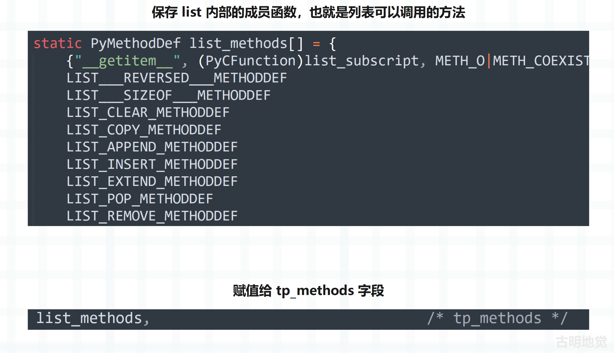
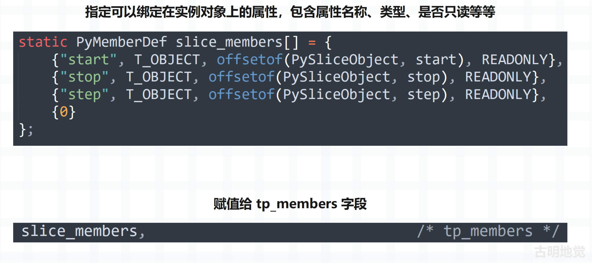
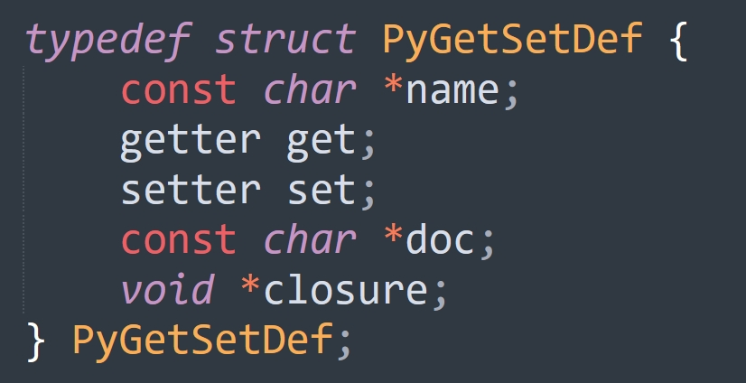
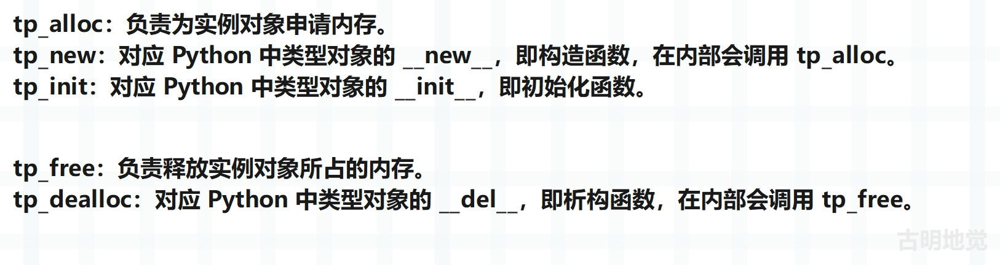
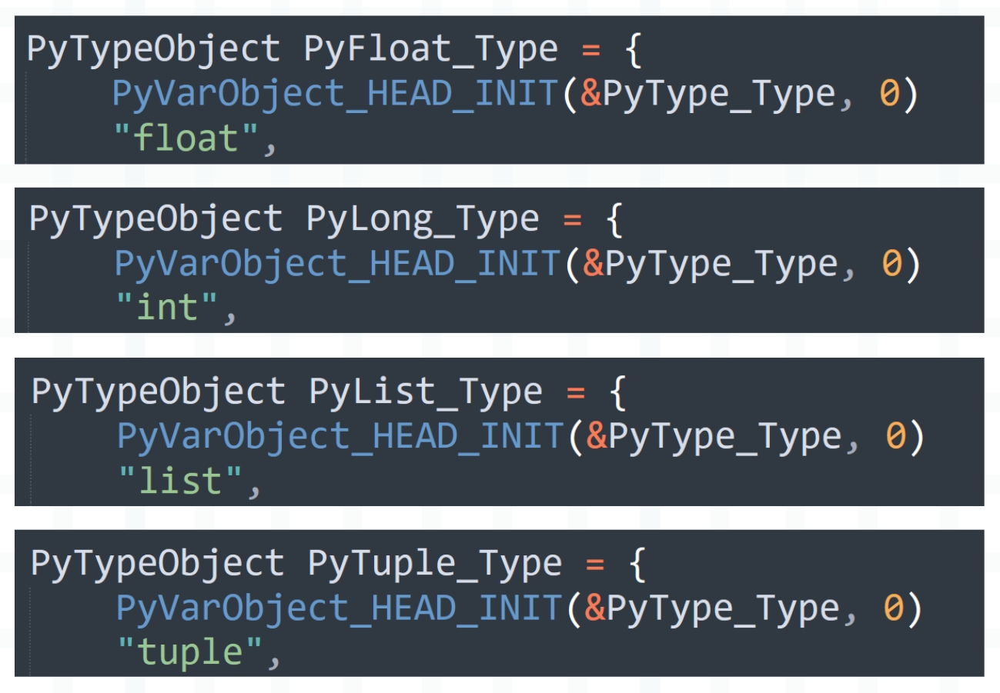
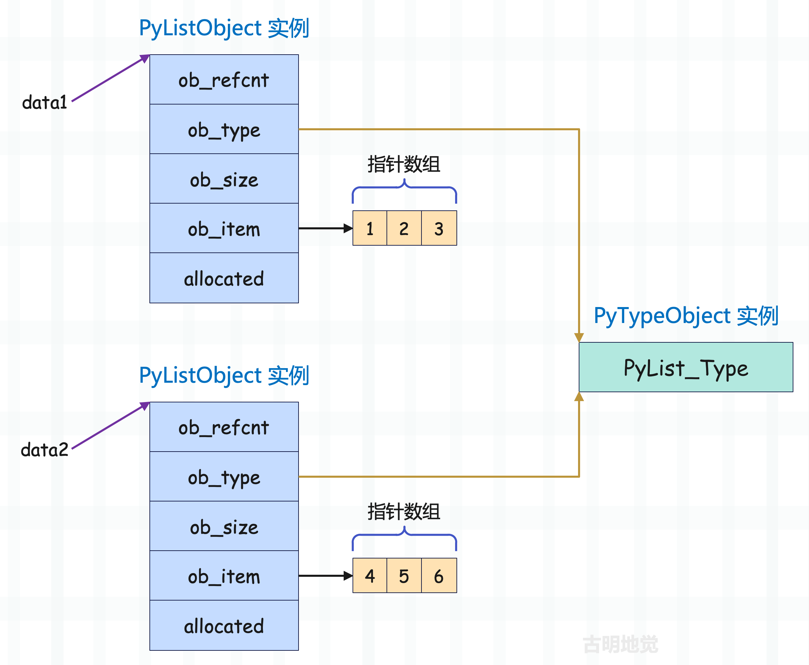

## 楔子

通过 PyObject 和 PyVarObject，我们看到了所有对象的公共信息以及变长对象的公共信息。任何一个对象，不管它是什么类型，内部必有引用计数（ob_refcnt）和类型指针（ob_type）。任何一个变长对象，不管它是什么类型，内部除了引用计数和类型指针之外，还有一个表示元素个数的 ob_size。

显然目前没有什么问题，一切都是符合预期的，但是当我们顺着时间轴回溯的话，就会发现端倪。比如：

- 当在内存中创建对象、分配空间的时候，解释器要给对象分配多大的空间？显然不能随便分配，那么对象的内存信息在什么地方？
- 对象是可以执行相关操作的，解释器怎么知道某个对象支持哪些操作呢？再比如一个整数可以和一个整数相乘，一个列表也可以和一个整数相乘，即使是相同的操作，但不同类型的对象执行也会有不同的效果，那么此时解释器又是如何进行区分的？

想都不用想，这些信息肯定都在对象的类型对象中。因为占用的空间大小实际上是对象的一个元信息，这样的元信息和其所属类型是密切相关的，因此它一定会出现在与之对应的类型对象当中。至于支持的操作就更不用说了，我们平时自定义类的时候，功能函数都写在什么地方，显然都是写在类里面，因此一个对象支持的操作也定义在类型对象当中。

而将对象和它的类型对象关联起来的，毫无疑问正是该对象内部的 PyObject 的 ob_type 字段，也就是类型指针。我们通过对象的 ob_type 字段即可获取类型对象的指针，然后通过指针获取存储在类型对象中的某些元信息。

下面我们来看看类型对象在底层是怎么定义的。

## 解密 PyTypeObject

PyObject 的 ob_type 字段的类型是 PyTypeObject \*，所以类型对象由 PyTypeObject 结构体负责实现，看一看它长什么样子。

~~~C
// Include/cpython/object.h

typedef struct _typeobject {
    PyObject_VAR_HEAD
    const char *tp_name;
    Py_ssize_t tp_basicsize, tp_itemsize;

    destructor tp_dealloc;
    Py_ssize_t tp_vectorcall_offset;
    getattrfunc tp_getattr;
    setattrfunc tp_setattr;
    PyAsyncMethods *tp_as_async;
    reprfunc tp_repr;

    PyNumberMethods *tp_as_number;
    PySequenceMethods *tp_as_sequence;
    PyMappingMethods *tp_as_mapping;

    hashfunc tp_hash;
    ternaryfunc tp_call;
    reprfunc tp_str;
    getattrofunc tp_getattro;
    setattrofunc tp_setattro;

    PyBufferProcs *tp_as_buffer;

    unsigned long tp_flags;
    const char *tp_doc;
    traverseproc tp_traverse;
    inquiry tp_clear;
    richcmpfunc tp_richcompare;

    Py_ssize_t tp_weaklistoffset;

    getiterfunc tp_iter;
    iternextfunc tp_iternext;

    struct PyMethodDef *tp_methods;
    struct PyMemberDef *tp_members;
    struct PyGetSetDef *tp_getset;
    
    struct _typeobject *tp_base;
    PyObject *tp_dict;
    descrgetfunc tp_descr_get;
    descrsetfunc tp_descr_set;
    Py_ssize_t tp_dictoffset;
    initproc tp_init;
    allocfunc tp_alloc;
    newfunc tp_new;
    freefunc tp_free;
    inquiry tp_is_gc;
    PyObject *tp_bases;
    PyObject *tp_mro;
    PyObject *tp_cache;
    PyObject *tp_subclasses;
    PyObject *tp_weaklist;
    destructor tp_del;

    unsigned int tp_version_tag;

    destructor tp_finalize;
    vectorcallfunc tp_vectorcall;

    Py_DEPRECATED(3.8) int (*tp_print)(PyObject *, FILE *, int);

#ifdef COUNT_ALLOCS
    Py_ssize_t tp_allocs;
    Py_ssize_t tp_frees;
    Py_ssize_t tp_maxalloc;
    struct _typeobject *tp_prev;
    struct _typeobject *tp_next;
#endif
} PyTypeObject;
~~~

类型对象在底层对应的是 struct \_typeobject，或者说 PyTypeObject，它保存了实例对象的元信息。

所以不难发现，无论是 int、str、dict 等内置类型，还是使用 class 关键字自定义的类型，它们在 C 的层面都是由 PyTypeObject 这个结构体实例化得到的，只不过内部字段的值不同，PyTypeObject 结构体在实例化之后得到的类型对象也不同。

然后我们来看看 PyTypeObject 里面的字段都代表啥含义，字段还是比较多的，我们逐一介绍。

**PyObject_VAR_HEAD**

宏，会被替换为 PyVarObject，所以类型对象是一个变长对象。因此类型对象也有引用计数和类型，这与我们前面分析的是一致的。

**tp_name**

对应 Python 中类型对象的 \_\_name\_\_ 属性，即类型对象的名称。

~~~python
# 类型对象在底层对应的是 PyTypeObject 结构体实例
# 它的 tp_name 字段表示类型对象的名称
print(int.__name__)  # int
# 动态创建一个类
A = type("我是 A", (object,), {})
print(A.__name__)  # 我是 A
~~~

所以任何一个类型对象都有 \_\_name\_\_ 属性，也就是都有名称。

**tp_basicsize，tp_itemsize**

- tp_basicsize：表示创建实例对象所需的基本内存大小；
- tp_itemsize：如果对象是变长对象，并且元素保存在对应的结构体内部，比如元组，那么 tp_itemsize 表示内部每个元素的内存大小。如果是定长对象，或者虽然是变长对象，但结构体本身不保存数据，而是只保存了一个指针，那么 tp_itemsize 为 0；

**tp_dealloc**

析构函数，对应 Python 中类型对象的 \_\_del\_\_，会在实例对象被销毁时执行。

**tp_vectorcall_offset**

如果想调用一个对象，那么它的类型对象要定义 \_\_call\_\_ 函数。

~~~Python
class A:

    def __call__(self, *args, **kwargs):
        return "被调用了"

a = A()
# 如果调用 a，那么 type(a) 要定义 __call__ 函数
print(a())
"""
被调用了
"""
# 底层会转成如下逻辑
print(A.__call__(a))
"""
被调用了
"""

# 函数也是一个实例对象，它能被调用
# 说明 type(函数) 也一定实现了 __call__
def some_func(name, age):
    return f"name: {name}, age: {age}"
# 函数的类型是 function
print(type(some_func))
"""
<class 'function'>
"""
# 调用函数
print(some_func("古明地觉", 17))
"""
name: 古明地觉, age: 17
"""
# 也可以这么做
print(type(some_func).__call__(some_func, "古明地觉", 17))
"""
name: 古明地觉, age: 17
"""
~~~

以上就是对象最通用的调用逻辑，但通用也意味着平庸，这种调用方式的性能是不高的。自定义类的实例对象还好，因为需要支持调用的场景不多，而函数则不同，尽管它也是实例对象，但它生下来就是要被调用的。如果函数调用也走通用逻辑的话，那么效率不高，因此 Python 从 3.8 开始引入了 vectorcall 协议，即矢量调用协议，用于优化和加速函数调用。相比常规调用，矢量调用具备如下优势：

+ 避免创建临时元组来传递参数
+ 减少参数打包/解包的开销
+ 支持关键字参数的快速处理

总之当一个对象被调用时，如果它支持 vectorcall 协议，那么会通过 tp_vectorcall_offset 找到实现矢量调用的函数指针。

注意：vectorcall 函数指针定义在实例对象中，而 tp_vectorcall_offset 字段维护了 vectorcall 函数指针在实例对象中的偏移量，该偏移量用于定位到一个特定的函数指针，这个函数指针符合 vectorcall 协议。

如果类型对象的 tp_vectorcall_offset 为 0，表示其实例对象不支持矢量调用，因此会退化为常规调用，即通过类型对象的 \_\_call\_\_ 进行调用。

**tp_getattr，tp_setattr**

对应 Python 中类型对象的 \_\_getattr\_\_ 和 \_\_setattr\_\_，用于操作实例对象的属性。但这两个字段已经不推荐使用了，因为它要求在操作属性时，属性名必须为 C 字符串，以及不支持通过描述符协议处理属性。

所以这两个字段主要用于兼容旧版本，现在应该使用 tp_getattro 和 tp_setattro。

**tp_as_number、tp_as_sequence、tp_as_mapping、tp_as_async**

tp_as_number：实例对象为数值时，所支持的操作。这是一个结构体指针，指向的结构体中的每一个字段都是一个函数指针，指向的函数就是对象可以执行的操作，比如四则运算、左移、右移、取模等等。

tp_as_sequence：实例对象为序列时，所支持的操作，也是一个结构体指针。

tp_as_mapping：实例对象为映射时，所支持的操作，也是一个结构体指针。

tp_as_async：实例对象为协程时，所支持的操作，也是一个结构体指针。

**tp_repr、tp_str**

对应 Python 中类型对象的 \_\_repr\_\_ 和 \_\_str\_\_，用于控制实例对象的打印输出。

**tp_hash**

对应 Python 中类型对象的 \_\_hash\_\_，用于定义实例对象的哈希值。

**tp_call**

对应 Python 中类型对象的 \_\_call\_\_，用于控制实例对象的调用行为。当然这属于常规调用，而对象不仅可以支持常规调用，还可以支持上面提到的矢量调用（通过减少参数传递的开销，提升调用性能）。

但要注意的是，不管使用哪种调用协议，对象调用的行为必须都是相同的。因此一个对象如果支持矢量调用，那么它也必须支持常规调用，换句话说对象如果实现了 vectorcall，那么它的类型对象也必须实现 tp_call。

> 如果你在实现 vectorcall 之后发现它比 tp_call 还慢，那么你就不应该实现 vectorcall，因为实现 vectorcall 是有条件的，当条件不满足时性能反而会变差。

**tp_getattro，tp_setattro**

对应 Python 中类型对象的 \_\_getattr\_\_ 和 \_\_setattr\_\_。

**tp_as_buffer**

指向 PyBufferProcs 类型的结构体，用于共享内存。通过暴露出一个缓冲区，可以和其它对象共享同一份数据，因此当类型对象实现了 tp_as_buffer，我们也说其实例对象实现了缓冲区协议，举个例子。

~~~python
import numpy as np

buf = bytearray(b"abc")
# 和 buf 共享内存
arr = np.frombuffer(buf, dtype="uint8")
print(arr)  # [97 98 99]
# 修改 buf
buf[0] = 255
# 会发现 arr 也改变了，因为它和 buf 共用一块内存
print(arr)  # [255  98  99]
~~~

所以 tp_as_buffer 主要用于那些自身包含大量数据，且需要允许其它对象直接访问的类型。通过实现缓冲区协议，其它对象可以直接共享数据，而无需事先拷贝，这在处理大型数据或进行高性能计算时非常有用。

关于缓冲区协议，后续还会详细介绍。

**tp_flags**

对应 Python 中类型对象的 \_\_flags\_\_，负责提供类型对象本身的附加信息，通过和指定的一系列标志位进行按位与运算，即可判断该类型是否具有某个特征。

那么标志位都有哪些呢？我们介绍几个常见的。

~~~C
// Include/object.h

// 类型对象的内存是否是动态分配的
// 像内置的类型对象属于静态类，它们不是动态分配的
#define Py_TPFLAGS_HEAPTYPE (1UL << 9)
// 类型对象是否允许被继承
#define Py_TPFLAGS_BASETYPE (1UL << 10)
// 类型对象的实例对象是否参与垃圾回收
#define Py_TPFLAGS_HAVE_GC (1UL << 14)
// 类型对象是否是抽象基类
#define Py_TPFLAGS_IS_ABSTRACT (1UL << 20)
~~~

我们通过 Python 来演示一下。

~~~python
# 是否是自定义的动态类
Py_TPFLAGS_HEAPTYPE = 1 << 9
class A:
    pass
# 如果与运算的结果为真，则表示是动态类，否则不是
print(A.__flags__ & Py_TPFLAGS_HEAPTYPE)
"""
512
"""
print(int.__flags__ & Py_TPFLAGS_HEAPTYPE)
"""
0
"""

# 类型对象是否允许被继承
Py_TPFLAGS_BASETYPE = 1 << 10
# object 显然允许被继承，因此与运算的结果为真
print(object.__flags__ & Py_TPFLAGS_BASETYPE)
"""
1024
"""
# 但 memoryview 就不允许被继承
try:
    class B(memoryview):
        pass
except TypeError as e:
    print(e)
    """
    type 'memoryview' is not an acceptable base type
    """
print(memoryview.__flags__ & Py_TPFLAGS_BASETYPE)
"""
0
"""

# 类型对象的实例对象是否参与垃圾回收
Py_TPFLAGS_HAVE_GC = 1 << 14
# int 的实例对象（整数）不会产生循环引用，所以不会参与垃圾回收
print(int.__flags__ & Py_TPFLAGS_HAVE_GC)
"""
0
"""
# 但列表是会参与垃圾回收的
print(list.__flags__ & Py_TPFLAGS_HAVE_GC)
"""
16384
"""

# 类型对象是否是抽象基类
Py_TPFLAGS_IS_ABSTRACT = 1 << 20
from abc import ABCMeta, abstractmethod
# 显然 C 不是抽象基类，而 D 是
class C:
    pass
class D(metaclass=ABCMeta):
    @abstractmethod
    def foo(self):
        pass
print(C.__flags__ & Py_TPFLAGS_IS_ABSTRACT)
"""
0
"""
print(D.__flags__ & Py_TPFLAGS_IS_ABSTRACT)
"""
1048576
"""
~~~

所以这就是 tp_flags 的作用，它负责描述一个类型对象都具有哪些额外特征。

**tp_doc**

对应 Python 中类型对象的 \_\_doc\_\_。

~~~Python
class People:
    """以前我没得选"""

print(People.__doc__)
"""
以前我没得选
"""
~~~

这个比较简单。

**tp_traverse，tp_clear**

这两个字段是一对，负责参与垃圾回收机制。

- tp_traverse：用于标记阶段，通过遍历实例对象所引用的其它对象，确定对象之间的引用关系，帮助垃圾回收器识别出所有活跃的对象和出现循环引用的对象。
- tp_clear：用于清除阶段，负责减少出现循环引用的对象的引用计数。

**tp_richcompare**

负责实现对象的比较逻辑，包含 >、>=、<、<=、!=、==。

**tp_weaklistoffset**

实例对象的弱引用列表在实例对象中的偏移量，如果 tp_weaklistoffset 为 0，则表示实例对象不支持弱引用。

**tp_iter、tp_iternext**

对应 Python 中类型对象的 \_\_iter\_\_ 和 \_\_next\_\_。

**tp_methods**

负责保存类型对象里的成员函数，我们以 list 为例。

**tp_members**

负责指定可以绑定在实例对象上的属性，我们使用 class 关键字定义动态类的时候，会在 \_\_init\_\_ 函数中给实例对象绑定属性，而对于底层 C 来说，需要通过 tp_members 字段。 

以 slice 为例，它负责创建一个切片。

~~~python
lst = list(range(10))
print(lst[1: 7: 2])  # [1, 3, 5]
# 等价于
print(lst[slice(1, 7, 2)])  # [1, 3, 5]
~~~

slice 是一个底层实现好的静态类，接收 start、end、step 三个参数，所以它底层的 tp_members 就是这么定义的。

对于静态类而言，可以给 self 绑定哪些属性、以及类型是什么，都已经事先在 tp_members 里面写死了，后续不可以新增或删除属性。

~~~python
s = slice(1, 7, 2)
# 静态类的实例对象不可以新增或删除属性
try:
    s.xx = "xx"
except AttributeError as e:
    print(e)
    """
    'slice' object has no attribute 'xx'
    """

# 至于能否修改，则看定义属性时是否要求属性是 READONLY
# 对于 slice 来说，它的三个属性都是 READONLY，所以不能修改
try:
    s.start = 2
except AttributeError as e:
    print(e)
    """
    readonly attribute
    """
~~~

但使用 class 自定义的动态类而言，新增、删除、修改属性都是可以的，至于里面的更多细节，后续在介绍类的时候会详细剖析。

**tp_getset**

指向一个 PyGetSetDef 结构体数组，里面的每个结构体都定义了一个属性的名称、获取该属性的函数、设置该属性的函数、属性的文档字符串。

- name：属性的名称，Python 代码可以通过该名称来访问属性。
- get：属性的 getter 函数，如果设置了这个函数，Python 代码读取属性时会调用它。
- set：属性的 setter 函数，如果设置了这个函数，Python 代码修改属性时会调用它。
- doc：属性的文档字符串，为属性提供描述信息。
- closure：一个 void \* 指针，用于传递额外的信息给 getter 和 setter，不常用。

所以我们发现 tp_getset 的作用不就类似于 @property 装饰器吗？tp_getset 数组里面的每个结构体负责实现一个 property 属性。

**tp_base**

对应 Python 中类型对象的 \_\_base\_\_，返回继承的第一个父类。

**tp_dict**

对应 Python 中类型对象的 \_\_dict\_\_，即属性字典。

**tp_descr_get、tp_descr_set**

对应 Python 中类型对象的 \_\_get\_\_ 和 \_\_set\_\_，用于实现描述符。

**tp_dictoffset**

注意它和 tp_dict 的区别，tp_dict 表示类型对象的属性字典，而 tp_dictoffset 表示实例对象的属性字典在实例对象中的偏移量。

**tp_init**

对应 Python 中类型对象的 \_\_init\_\_，用于实例对象属性的初始化。

**tp_alloc**

负责为实例对象申请内存，申请多大呢？取决于 tb_basicsize 和 tp_itemsize。

**tp_new**

对应 Python 中类型对象的 \_\_new\_\_，即构造函数，在 tp_new 内部会调用 tp_alloc 为实例对象申请内存。

**tp_free**

内存释放函数，负责释放实例对象所占的内存，注意它和 tp_dealloc 的区别与联系。tp_dealloc 表示析构函数，当对象的引用计数降到零的时候执行，内部会负责如下工作。

- 减少引用的其它对象的引用计数；
- 释放对象拥有的资源，比如文件句柄或网络连接；
- 调用内存释放函数来释放对象本身占用的内存，这一步由 tp_free 来完成。

所以要注意这几个字段之间的区别，我们再总结一下。

**tp_is_gc**

指示该类型对象的实例对象是否参与垃圾回收。

~~~C
// Objects/typeobject.c
unsigned long
PyType_GetFlags(PyTypeObject *type)
{
    return type->tp_flags;
}

// Include/object.h
#define PyType_HasFeature(t,f)  ((PyType_GetFlags(t) & (f)) != 0)

// Include/objimpl.h
// 显然只需判断 tp_flags & Py_TPFLAGS_HAVE_GC 是否不等于 0 即可
#define PyType_IS_GC(t) PyType_HasFeature((t), Py_TPFLAGS_HAVE_GC)
~~~

如果参与垃圾回收，那么 tp_flags & Py_TPFLAGS_HAVE_GC 的结果不等于 0。

**tp_bases**

对应 Python 中类型对象的 \_\_bases\_\_，返回一个元组，里面包含直接继承的所有父类。

**tp_mro**

对应 Python 中类型对象的 \_\_mro\_\_，返回一个元组，里面包含自身以及直接继承和间接继承的所有父类，直到 object。

注意：返回的元组中的类是有顺序关系的，它基于 C3 线性算法生成，定义了方法解析的顺序。当 Python 需要查找方法或属性时，将按照此顺序进行搜索。

**tp_cache**

该字段已废弃，这里不做介绍。

**tp_subclasses**

等价于 Python 中类型对象的 \_\_subclasses\_\_，会返回继承该类的所有子类。

~~~python
class A:
    pass

class B(A):
    pass

class C(B):
    pass

print(A.__subclasses__())
"""
[<class '__main__.B'>]
"""
~~~

但是只返回直接继承的子类，间接继承的不返回，比如这里只返回了 B，而 C 没有返回。

**tp_weaklist**

类型对象的弱引用列表，注意它和前面提到的 tp_weaklistoffset 的区别。tp_weaklist 表示类型对象的弱引用列表，tp_weaklistoffset 表示实例对象的弱引用列表在实例对象中的偏移量。

**tp_del**

和 tp_dealloc 作用相同，但 tp_del 主要是兼容以前的旧版本，现在直接使用 tp_dealloc 即可。

**tp_version_tag**

用于标记类型对象的版本，每当类型的定义发生变化时（例如添加、删除或修改成员函数），版本标签就会更新。解释器会使用这个版本标签来确定方法缓存是否有效，从而避免每次调用方法时都重新解析和查找。

**tp_finalize**

负责在对象被销毁之前执行相应的清理操作，确保资源得到妥善处理，它的调用时机在对象的引用计数达到零之后、tp_dealloc（析构函数）被调用之前。

该字段不常用，一般只出现在生成器和协程当中。然后 tp_dealloc、tp_del、tp_finalize 三个字段的类型是一致的，都是 destructor 类型，那么它们三者有什么区别呢？

- tp_dealloc：在所有的类型对象中都需要指定，因为它是管理实例对象生命周期的关键，它负责减少引用的其它对象的引用计数，以及调用 tp_free 释放当前对象占用的内存，当然也可以执行必要的清理操作。 
- tp_finalize：负责在对象的生命周期结束前执行相关清理操作，一般只用于生成器和协程当中，此时会和 tp_dealloc 搭配使用。
- tp_del：除非是兼容遗留代码，否则应避免使用 tp_del，而是依赖于更现代的垃圾回收和清理机制，即使用 tp_dealloc。

**tp_vectorcall**

前面说了，实例对象在调用时，可以走类型对象的 tp_call，但这样效率不高。为此 Python 引入了矢量调用，实现矢量调用的函数指针定义在实例对象内部，偏移量则由类型对象的 tp_vectorcall_offset 字段维护。

如果实例对象支持矢量调用，那么会通过类型对象的 tp_vectorcall_offset 定位到对应的 vectorcall 函数指针，进行调用。否则执行类型对象的 tp_call。

那么问题来了，既然实例对象可以支持矢量调用，那么类型对象当然也可以支持。而类型对象的矢量调用函数，便由 tp_vectorcall 字段指定。

所以 tp_vectorcall 和 tp_vectorcall_offset 之间的关系，就类似于 tp_dict 和 tp_dictoffset 之间的关系。

+ tp_dict 表示类型对象自身的属性字典，tp_dictoffset 表示实例对象的属性字典相对于实例对象首地址的偏移量。
+ tp_vectorcall 表示类型对象自身的矢量调用函数，tp_vectorcall_offset 表示实例对象的矢量调用函数相对于实例对象首地址的偏移量。
+ tp_weaklist 表示类型对象自身的弱引用列表，tp_weaklistoffset 表示实例对象的弱引用列表相对于实例对象首地址的偏移量。

> offset 机制允许实例对象拥有更加弹性的内存布局。

另外如果类型对象的 tp_vectorcall 字段为空，则表示类型对象不支持矢量调用，那么它在调用时会走元类的 tp_call。所以我们说 class 具有二象性，而这种平行的设计使得 Python 能够统一处理类型对象和实例对象的属性访问和调用行为。

以上就是 PyTypeObject 的各个字段的含义。

## 一些常见的类型对象

下面来介绍一些常见的类型在底层的定义。

Python 底层的 C API 和对象的命名都遵循统一的标准，比如类型对象均以 Py\*\*\*_Type 的形式命名，当然啦，它们都是 PyTypeObject 结构体实例。所以我们发现，Python 里的类在底层是以全局变量的形式静态定义好的。

所以实例对象可以有很多个，但对应的类型对象则是唯一的，在底层直接以全局变量的形式静态定义好了。比如列表的类型是 list，列表可以有很多个，但 list 类型对象则全局唯一。

~~~python
data1 = [1, 2, 3]
data2 = [4, 5, 6]
print(
    data1.__class__ is data2.__class__ is list
)  # True
~~~

如果站在 C 的角度来理解的话：

data1 和 data2 变量均指向了列表，列表在底层对应 PyListObject 结构体实例，里面字段的含义之前说过。但需要注意的是，指针数组里面保存的是对象的指针，而不是对象。不过为了方便，图中就用对象代替了。

然后列表的类型是 list，在底层对应 PyList_Type，它是 PyTypeObject 结构体实例，保存了列表的元信息（比如内存分配信息、支持的相关操作等）。

而将这两者关联起来的便是 ob_type，它位于 PyObject 中，是所有对象都具有的。因为变量只是一个 PyObject \* 指针，那么解释器要如何得知变量指向的对象的类型呢？答案便是通过 ob_type 字段。

## 小结

不同类型的实例对象，在底层由不同的结构体实现，比如整数对应 PyLongObject 实例、浮点数对应 PyFloatObject 实例、列表对应 PyListObject 实例等等。

但所有的类型对象，在底层由同一个结构体实现，它们都是 PyTypeObject 实例。而 PyTypeObject 结构体在实例化时，内部字段接收的值不同，那么生成的类型对象也不同，可以是 PyLong_Type、PyFloat_Type、PyList_Type 等等。并且每个类型对象都是唯一的，比如在程序中可以创建很多个列表（PyListObject 实例），但类型对象 \<class 'list'\>（PyList_Type）只会存在一个。

因为类型对象都是静态定义在源码中的，并以全局变量的形式存在。而将实例对象和类型对象关联起来的，则是实例对象的 ob_type 字段，在 Python 里面可以通过调用 type 或者获取 \_\_class\_\_ 属性查看。

关于类型对象的更多内容，后续会继续介绍。

-----

&nbsp;

**欢迎大家关注我的公众号：古明地觉的编程教室。**

**如果觉得文章对你有所帮助，也可以请作者吃个馒头，Thanks♪(･ω･)ﾉ。**

