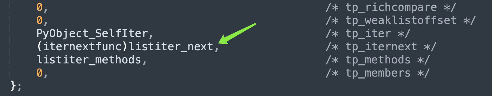

## 楔子

只要类型对象实现了 \_\_iter\_\_，那么它的实例对象就被称为可迭代对象（Iterable），比如字符串、元组、列表、字典、集合等等。而整数、浮点数，由于其类型对象没有实现 \_\_iter\_\_，所以它们不是可迭代对象。

~~~python
from typing import Iterable

print(
    isinstance("", Iterable),
    isinstance((), Iterable),
    isinstance([], Iterable),
    isinstance({}, Iterable),
    isinstance(set(), Iterable),
)  # True True True True True

print(
    isinstance(0, Iterable),
    isinstance(0.0, Iterable),
)  # False False
~~~

可迭代对象的一大特点是可以被 for 循环遍历，但能被 for 循环遍历的则不一定是可迭代对象。我们举个例子：

~~~Python
class A:

    def __getitem__(self, item):
        return f"参数 item: {item}"

a = A()
# 内部定义了 __getitem__
# 首先可以让实例对象像字典一样访问属性
print(a["name"])  # 参数 item: name
print(a["satori"])  # 参数 item: satori

# 此外还可以像可迭代对象一样被 for 循环
# 循环的时候会自动给 item 传值：0 1 2 3 ...
# 如果内部出现了 StopIteration，循环结束
# 否则会一直循环下去，这里我们手动 break
for idx, val in enumerate(a):
    print(val)
    if idx == 5:
        break
"""
参数 item: 0
参数 item: 1
参数 item: 2
参数 item: 3
参数 item: 4
参数 item: 5
"""
~~~

所以实现了 \_\_getitem\_\_ 的类的实例，也是可以被 for 循环的，但它并不是可迭代对象。

~~~Python
from typing import Iterable
print(isinstance(a, Iterable))  # False
~~~

总之判断一个对象是否是可迭代对象，就看它的类型对象有没有实现 \_\_iter\_\_。可迭代对象我们知道了，那什么是迭代器呢？很简单，调用可迭代对象的 \_\_iter\_\_ 方法，得到的就是迭代器。

## 迭代器的创建

不同类型的对象，都有自己的迭代器，举个栗子。

```Python
data = [1, 2, 3]
# 底层调用的其实是 list.__iter__(data)
# 或者说 PyList_Type.tp_iter(data)
it = data.__iter__()
print(it)
"""
<list_iterator object at 0x102c1cf10>
"""
print(str.__iter__(""))
"""
<str_iterator object at 0x100e623b0>
"""
print(tuple.__iter__(()))
"""
<tuple_iterator object at 0x100e623b0>
"""
# 不难发现，迭代器的种类非常多
# 比如 list_iterator、str_iterator、tuple_iterator 等等
```

迭代器也是可迭代对象，只不过迭代器内部的 \_\_iter\_\_ 返回的还是它本身。当然啦，在创建迭代器的时候，我们更常用内置函数 iter。

~~~python
data = [1, 2, 3]
# 等价于 type(data).__iter__(data)
it = iter(data)
~~~

但是 iter 函数还有一个鲜为人知的用法，我们来看一下：

~~~Python
val = 0

def foo():
    global val
    val += 1
    return val

# iter 可以接收一个参数: iter(可迭代对象)
# iter 也可以接收两个参数: iter(可调用对象, value)
for i in iter(foo, 5):
    print(i)
"""
1
2
3
4
"""
~~~

进行迭代的时候，会不停地调用<font color="blue">可调用对象</font>，直到返回值等于传递的第二个参数 value（在底层被称为哨兵），然后终止迭代。我们看一下 iter 函数的底层实现。

```C
// Python/bltinmodule.c
static PyObject *
builtin_iter(PyObject *self, PyObject *const *args, Py_ssize_t nargs)
{
    PyObject *v;
    // 内置函数 iter 接收 1 ~ 2 个参数
    if (!_PyArg_CheckPositional("iter", nargs, 1, 2))
        return NULL;
    // 如果 nargs 等于 1，那么 args[0] 是可迭代对象
    // 如果 nargs 等于 2，那么 args[0] 是可调用对象
    v = args[0];
    // nargs == 1，说明 v 是可迭代对象
    if (nargs == 1)
        // 调用 PyObject_GetIter 获取对象的迭代器
        return PyObject_GetIter(v);
    // 否则说明 nargs == 2，那么 v 是可调用对象
    // 这里进行检测，如果不是，抛出 TypeError
    if (!PyCallable_Check(v)) {
        PyErr_SetString(PyExc_TypeError,
                        "iter(v, w): v must be callable");
        return NULL;
    }
    // 获取哨兵
    PyObject *sentinel = args[1];
    // 一会儿单独解释
    return PyCallIter_New(v, sentinel);
}
```

以上就是 iter 函数的内部逻辑，既可以接收一个参数，也可以接收两个参数。这里我们只看接收一个可迭代对象的情况，所以核心就在 PyObject_GetIter 函数里面，它是根据可迭代对象生成迭代器的关键，我们来看一下它的逻辑是怎样的？

~~~C
// Objects/abstract.c
PyObject *
PyObject_GetIter(PyObject *o)
{
    // 获取可迭代对象的类型对象，比如 o 是列表，那么 t 就是 list
    PyTypeObject *t = o->ob_type;
    // 我们说类型对象定义的操作，决定了实例对象的行为
    // 实例对象调用的那些方法都是定义在类型对象里面的
    // 还是那句话：obj.func() 等价于 type(obj).func(obj)
    getiterfunc f;
    
    // 所以这里是获取类型对象的 tp_iter 字段
    // 也就是 Python 中的 __iter__
    f = t->tp_iter;
    // 如果 f 为 NULL，说明类型对象的内部没有定义 __iter__ 
    // 像 str、tuple、list 等类型对象，它们的 tp_iter 字段都是不为 NULL 的
    if (f == NULL) {
        // 如果 tp_iter 为 NULL，那么解释器会退而求其次
        // 检测该类型对象中是否定义了 __getitem__
        // 如果定义了，那么直接调用 PySeqIter_New，创建 seqiterobject 对象
        // 下面的 PySequence_Check 函数负责检测类型对象是否实现了 __getitem__
        // __getitem__ 对应 tp_as_sequence->sq_item
        if (PySequence_Check(o))
            return PySeqIter_New(o);
        // 走到这里说明该类型对象既没有 __iter__、也没有 __getitem__
        // 因此它的实例对象不具备可迭代的性质，于是抛出异常
        return type_error("'%.200s' object is not iterable", o);
    }
    else {
        // 否则说明定义了 __iter__
        // 调用 o->ob_type->tp_iter(o) 返回对应的迭代器
        PyObject *res = (*f)(o);
        // 但如果返回值 res 不为 NULL、并且还不是迭代器
        // 证明 __iter__ 的返回值有问题，于是抛出异常
        if (res != NULL && !PyIter_Check(res)) {
            PyErr_Format(PyExc_TypeError,
                         "iter() returned non-iterator "
                         "of type '%.100s'",
                         res->ob_type->tp_name);
            Py_DECREF(res);
            res = NULL;
        }
        // 返回 res
        return res;
    }
}
~~~

以上便是 iter 函数的底层实现，还是很简单的。然后是里面的 \_\_getitem\_\_，我们说如果类型对象内部没有定义 \_\_iter\_\_，那么解释器会退而求其次，检测内部是否定义了 \_\_getitem\_\_。

因此以上就是迭代器的创建过程，每个可迭代对象都有自己的迭代器，而迭代器本质上就是对原始数据的一层封装罢了。

## 迭代器的底层结构

由于迭代器的种类非常多，字符串、元组、列表等等，都有自己的迭代器，这里就不一一介绍了。我们就以列表的迭代器为例，看看迭代器在底层的结构是怎么样的。

~~~c
// Objects/listobject.c

// 列表迭代器的类型对象为 <class 'list_iterator'>
// 但这个类，解释器并没有暴露给我们，所以需要通过 type 获取
// 然后它的 tp_basicsize 字段为 sizeof(listiterobject)
// 这就说明列表迭代器在底层由 listiterobject 结构体表示
PyTypeObject PyListIter_Type = {
    PyVarObject_HEAD_INIT(&PyType_Type, 0)
    "list_iterator",                            /* tp_name */
    sizeof(listiterobject),                     /* tp_basicsize */
    0,                                          /* tp_itemsize */
    // ...
};

typedef struct {
    PyObject_HEAD
    Py_ssize_t it_index;
    // 指向创建该迭代器的列表
    PyListObject *it_seq;
} listiterobject;
~~~

所以迭代器就是基于可迭代对象进行了一层简单的封装，所谓元素迭代本质上还是基于索引，并且每迭代一次，索引就自增 1。一旦出现索引越界，就将 it_seq 设置为 NULL，表示迭代器迭代完毕。

我们实际演示一下：

~~~python
from ctypes import *

class PyObject(Structure):
    _fields_ = [
        ("ob_refcnt", c_ssize_t),
        ("ob_size", c_void_p)
    ]

class ListIterObject(PyObject):
    _fields_ = [
        ("it_index", c_ssize_t),
        ("it_seq", POINTER(PyObject))
    ]

it = iter([1, 2, 3])
it_obj = ListIterObject.from_address(id(it))

# it_seq 指向列表 [1, 2, 3]，it_index 初始为 0
print(it_obj.it_index)  # 0
# 进行迭代
next(it)
# 索引自增 1，此时 it_index 等于 1
print(it_obj.it_index)  # 1
# 再次迭代
next(it)
# 此时 it_index 等于 2
print(it_obj.it_index)  # 2
# 再次迭代
next(it)
# 此时 it_index 等于 3
print(it_obj.it_index)  # 3
~~~

当 it_index 为 3 的时候，如果再次迭代，那么底层会发现 it_index 已超过最大索引，于是知道迭代器已经迭代完毕了。因此会将 it_seq 设置为 NULL，并抛出 StopIteration。如果是 for 循环，那么会自动捕获此异常，然后停止循环。

所以这就是迭代器，真的没有想象中的那么神秘，甚至在知道它的实现原理之后，还觉得有点 low，因为就是将原始数据包了一层，加了一个索引而已。所谓的迭代仍然是基于索引来做的，并且每迭代一次，索引就自增 1。当索引超出范围时，证明迭代完毕了，于是将 it_seq 字段设置为 NULL，抛出 StopIteration。

## 迭代器是怎么迭代元素的

迭代器的创建我们知道了，那么它是怎么迭代元素的呢？首先迭代元素可以通过 next 函数，当然它本质上也是调用了对象的 \_\_next\_\_ 方法。

~~~C
// Python/bltinmodule.c
static PyObject *
builtin_next(PyObject *self, PyObject *const *args, Py_ssize_t nargs)
{
    PyObject *it, *res;
    // 同样接收 1 ~ 2 个参数
    // 因为调用 next 函数时，可以传入一个默认值
    // 表示当迭代器没有元素可以迭代的时候，会返回指定的默认值
    if (!_PyArg_CheckPositional("next", nargs, 1, 2))
        return NULL;
    // 迭代器
    it = args[0];
    // 类型检测，如果不是迭代器，那么抛出异常
    if (!PyIter_Check(it)) {
        PyErr_Format(PyExc_TypeError,
            "'%.200s' object is not an iterator",
            it->ob_type->tp_name);
        return NULL;
    }
    // it->ob_type 表示获取类型对象，也就是该迭代器的类型
    // 当然具体类型是哪一种并不确定，可能是列表迭代器、元组迭代器、字符串迭代器等等
    // 然后再获取 tp_iternext 字段，相当于 __next__
    // 拿到函数指针之后，传入迭代器进行调用
    res = (*it->ob_type->tp_iternext)(it);
    // 如果 res 不为 NULL，那么证明迭代到值了，直接返回
    if (res != NULL) {
        return res;
    } else if (nargs > 1) {
        // 否则的话，说明没有迭代到值（返回 NULL），而这时候有两种情况
        // 1）迭代器已耗尽，2）在迭代过程中出现异常
        // 那么判断 nargs 是否大于 1，如果大于 1，说明设置了默认值
        PyObject *def = args[1];
        // 检测异常是不是迭代完毕时（或者手动 raise）产生的 StopIteration 异常
        if (PyErr_Occurred()) {
            if(!PyErr_ExceptionMatches(PyExc_StopIteration))
                // 如果不是，说明程序的逻辑有问题，直接 return NULL，结束执行
                // 然后在 Python 里面我们会看到打印到 stderr 中的异常信息
                return NULL;
            // 如果异常是 StopIteration，证明迭代完毕了
            // 但我们设置了默认值，那么就应该返回默认值
            // 而不应该抛出 StopIteration，于是将异常回溯栈给清空
            PyErr_Clear();
        }
        // 增加默认值的引用计数，然后返回
        Py_INCREF(def);
        return def;
    } else if (PyErr_Occurred()) {
        // 走到这里说明 res == NULL，并且没有指定默认值
        // 那么当发生异常时，将异常直接抛出
        return NULL;
    } else {
        // 都不是的话，直接抛出 StopIteration
        PyErr_SetNone(PyExc_StopIteration);
        return NULL;
    }
}
~~~

以上就是 next 函数的背后逻辑，实际上还是调用了迭代器的 \_\_next\_\_ 方法。

~~~Python
data = [1, 2, 3]
it = iter(data)
# 然后迭代，等价于 next(it)
print(type(it).__next__(it))  # 1
print(type(it).__next__(it))  # 2
print(type(it).__next__(it))  # 3
# 但是 next 可以指定默认值
# 如果不指定默认值，或者还是 type(it).__next__(it)
# 那么就会报错，抛出 StopIteration
print(next(it, 666))  # 666
~~~

以上就是元素的迭代，由于内置函数 next 还可以指定一个默认值，所以更强大一些。当然在不指定默认值的情况下，next(it) 和 type(it).\_\_next\_\_(it) 最终是殊途同归的。

我们仍以列表的迭代器为例，看看 \_\_next\_\_ 的具体实现。



由于 tp_iternext 字段指向了 listiter_next，证明迭代的时候调用的是这个函数。

~~~C
// Objects/listobject.c
static PyObject *
listiter_next(listiterobject *it)
{
    // 迭代器只是对可迭代对象的一层封装
    // 如果是列表的迭代器，那么内部的 it_seq 字段便指向列表
    PyListObject *seq;
    PyObject *item;

    assert(it != NULL);
    // 如果 it->it_seq 等于 NULL，说明迭代器已经迭代完毕了
    // 从这里也能看出迭代器不能二次循环迭代
    seq = it->it_seq;
    if (seq == NULL)
        return NULL;
    assert(PyList_Check(seq));
    // 如果 it->it_index 小于列表的长度
    if (it->it_index < PyList_GET_SIZE(seq)) {
        // 那么获取元素
        item = PyList_GET_ITEM(seq, it->it_index);
        // it_index 自增 1
        ++it->it_index;
        // 增加元素的引用计数，并返回
        Py_INCREF(item);
        return item;
    }
    // 否则说明 it_index 已经达到了列表的长度
    // 再迭代就索引越界了，而对于迭代器来说
    // 当 it_index 等于列表长度时，就证明所有元素都迭代完毕了
    it->it_seq = NULL;  // 将 it_seq 设置为 NULL
    Py_DECREF(seq);
    return NULL;
}
~~~

显然这和之前分析的是一样的，以上我们就以列表为例，考察了迭代器的实现原理和元素迭代的具体过程。当然其它对象也有自己的迭代器，有兴趣可以看一看，实现方式都大同小异。

## iter 函数接收两个参数

前面说了，iter 函数如果接收一个参数，那么这个参数必须是可迭代对象。如果接收两个参数，那么第一个参数要是 callable，第二个参数是哨兵。迭代时会调用 callable，当返回值等于哨兵时，迭代结束，那么它的底层是怎么实现的呢？这里简单补充一下。

~~~C
// Python/bltinmodule.c
static PyObject *
builtin_iter(PyObject *self, PyObject *const *args, Py_ssize_t nargs)
{
    // ...
    PyObject *sentinel = args[1];
    // 如果参数个数等于 2，会调用 PyCallIter_New
    return PyCallIter_New(v, sentinel);
}

// Objects/iterobject.c
typedef struct {
    PyObject_HEAD
    PyObject *it_callable;
    PyObject *it_sentinel;
} calliterobject;

PyObject *
PyCallIter_New(PyObject *callable, PyObject *sentinel)
{  
    // iter(callable, value) 会返回一个 <class 'callable_iterator'> 实例
    // 在底层由 calliterobject 结构体实现
    calliterobject *it;
    // 为 calliterobject 实例申请内存
    it = PyObject_GC_New(calliterobject, &PyCallIter_Type);
    if (it == NULL)
        return NULL;
    // 初始化字段
    Py_INCREF(callable);
    it->it_callable = callable;
    Py_INCREF(sentinel);
    it->it_sentinel = sentinel;
    _PyObject_GC_TRACK(it);
    return (PyObject *)it;
}

// 再来看看迭代过程
static PyObject *
calliter_iternext(calliterobject *it)
{
    PyObject *result;
    // 如果 it_callable 字段为空，说明迭代结束，不能再次迭代
    if (it->it_callable == NULL) {
        return NULL;
    }
    // 调用 it_callable，拿到返回值 result
    result = _PyObject_CallNoArg(it->it_callable);
    if (result != NULL) {
        int ok;
        // 如果 result 和哨兵相等，那么 ok == 1，否则 ok == 0
        ok = PyObject_RichCompareBool(it->it_sentinel, result, Py_EQ);
        // ok == 0，说明两者不相等，那么返回 result
        if (ok == 0) {
            return result;
        }
        // ok > 0，说明返回值和哨兵相等，那么迭代结束
        // 减少引用计数，并将 it_callable 和 it_sentinel 字段设置为 NULL
        Py_DECREF(result);
        if (ok > 0) {
            Py_CLEAR(it->it_callable);
            Py_CLEAR(it->it_sentinel);
        }
    }
    else if (PyErr_ExceptionMatches(PyExc_StopIteration)) {
        // 如果函数抛出了 StopIteration 异常，同样视为迭代结束
        PyErr_Clear();
        Py_CLEAR(it->it_callable);
        Py_CLEAR(it->it_sentinel);
    }
    return NULL;
}
~~~

还是比较简单的，就是不停地调用可迭代对象，当返回值和哨兵相等时，迭代结束。

## 小结

通过探究迭代器，我们再次体会到了 Python 的设计哲学，虽然一切皆对象，但是拿到的都是对象的指针。像变量、函数参数等，它们存储的都不是对象本身，而是对象的泛型指针。而基于 PyObject \* 和 ob_type，Python 巧妙地实现了多态。

不管变量 obj 指向什么样的可迭代对象，都可以交给 iter 函数，会调用类型对象内部的 \_\_iter\_\_（底层对应 tp_iter 字段），得到迭代器。不管变量 it 指向什么样的迭代器，都可以交给 next 函数进行迭代，会调用迭代器的类型对象的 \_\_next\_\_（底层对应 tp_iternext 字段），将值迭代出来。

至于 \_\_iter\_\_ 和 \_\_next\_\_ 本身，每个迭代器都会有，我们这里只以列表的迭代器为例。所以这是不是实现了多态呢？

这就是 Python 的设计哲学，变量只是一个指针，传递变量的时候相当于传递指针（将指针拷贝一份），但操作一个变量的时候会自动操作变量（指针）指向的内存。

以上就是 Python 迭代器的相关内容，当然你也完全可以自己封装一个迭代器，有兴趣可以试一下。

-----

&nbsp;

**欢迎大家关注我的公众号：古明地觉的编程教室。**


**如果觉得文章对你有所帮助，也可以请作者吃个馒头，Thanks♪(･ω･)ﾉ。**

