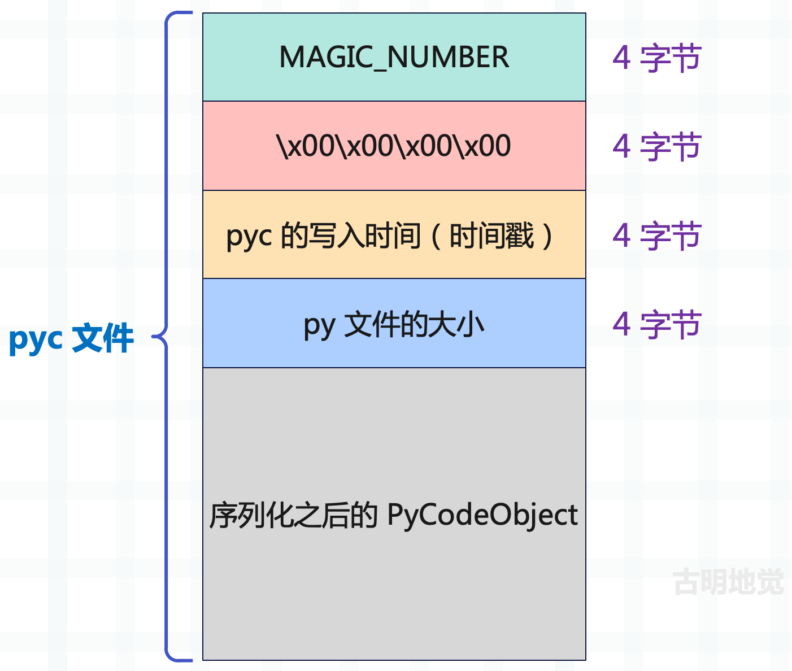
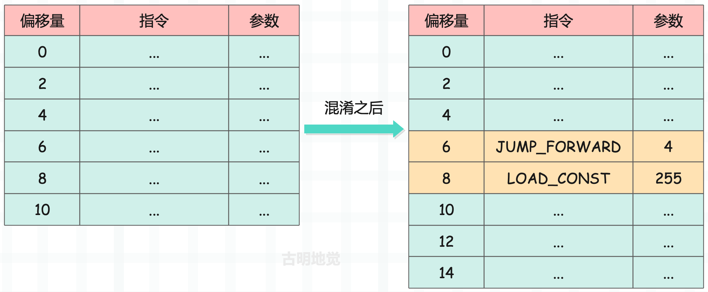

## pyc 文件的触发

上一篇文章我们介绍了字节码，当时提到，py 文件在执行的时候会先被编译成 PyCodeObject 对象，并且该对象还会被保存到 pyc 文件中。

然而事实并不总是这样，有时当我们运行一个简单的程序时，并没有产生 pyc 文件。因此我们猜测：有些 Python 程序只是临时完成一些琐碎的工作，这样的程序仅仅只会运行一次，然后就不会再使用了，因此也就没有保存至 pyc 文件的必要。

如果我们在代码中加上了一个 import abc 这样的语句，再执行你就会发现解释器为 abc.py 生成了 pyc 文件，这就说明 import 语句会触发 pyc 的生成。

实际上，在运行过程中，如果碰到 import abc 这样的语句，那么 Python 会在设定好的 path 中寻找 abc.pyc 或者 abc.pyd 文件。但如果没有这些文件，而是只发现了 abc.py，那么会先将 abc.py 编译成 PyCodeObject，然后写入到 pyc 文件中。

接下来，再对 abc.pyc 进行 import 动作。对的，并不是编译成 PyCodeObject 对象之后就直接使用，而是先写到 pyc 文件里，然后再将 pyc 文件里面的 PyCodeObject 对象重新在内存中复制出来。

当然啦，触发 pyc 文件生成不仅可以通过 import，还可以通过 py_compile 模块手动生成。比如当前有一个 tools.py，代码如下。

~~~Python
a = 1
b = "你好啊"
~~~

如何将其编译成 pyc 呢？

~~~Python
import py_compile

py_compile.compile("tools.py")
~~~

查看当前目录的 \_\_pycache\_\_ 目录，会发现 pyc 已经生成了。


<font color="blue">py文件名.cpython-版本号.pyc</font> 便是编译之后的 pyc 文件名。

## pyc 文件的导入

如果有一个现成的 pyc 文件，我们要如何导入它呢？

~~~Python
from importlib.machinery import SourcelessFileLoader

tools = SourcelessFileLoader(
    "tools", "__pycache__/tools.cpython-38.pyc"
).load_module()

print(tools.a)  # 1
print(tools.b)  # 你好啊
~~~

以上我们就成功手动导入了 pyc 文件。

## pyc 文件都包含哪些内容

pyc 文件在创建的时候都会往里面写入哪些内容呢？

<font color="darkblue">**1）magic number**</font>

这是解释器内部定义的一个值，不同版本的解释器会定义不同的 magic number，这个值是为了保证能够加载正确的 pyc，比如 Python3.8 不会加载 3.7 版本的 pyc。因为解释器在加载 pyc 文件的时候会检测该 pyc 的 magic number，如果和自身的 magic number 不一致，说明此 pyc 是由其它版本的解释器写入的，因此拒绝加载。

~~~Python
from importlib.util import MAGIC_NUMBER
print(MAGIC_NUMBER)  # b'U\r\r\n'

with open("__pycache__/tools.cpython-38.pyc", "rb") as f:
    magic_number = f.read(4)
print(magic_number)  # b'U\r\r\n'
~~~

pyc 文件的前 4 个字节便是 magic number。

<font color="darkblue">**2）py 文件的最后修改时间**</font>

这个很好理解，在加载 pyc 的时候会比较源代码的实际修改时间和 pyc 文件中存储的修改时间。如果两者不相等，说明在生成 pyc 之后，源代码又被修改了，那么会重新编译并写入 pyc，而反之则会直接加载已存在的 pyc。

<font color="darkblue">**3）py 文件的大小**</font>

py 文件的大小也会被记录在 pyc 文件中。

<font color="darkblue">**4）PyCodeObject 对象**</font>

编译之后的 PyCodeObject 对象，这个不用说了，肯定是要存储的，并且是序列化之后再存储。

<font color="blue">因此 pyc 文件的结构如下：</font>



我们实际验证一下：

~~~python
import struct
from importlib.util import MAGIC_NUMBER
from datetime import datetime

with open("__pycache__/tools.cpython-38.pyc", "rb") as f:
    data = f.read()

# 0 ~ 4 字节是 MAGIC NUMBER
print(data[: 4])  # b'U\r\r\n'
print(MAGIC_NUMBER)  # b'U\r\r\n'

# 4 ~ 8 字节是 4 个 \x00
print(data[4: 8])  # b'\x00\x00\x00\x00'

# 8 ~ 12 字节是 py 文件的最后修改时间（小端存储），一个时间戳
ts = struct.unpack("<I", data[8: 12])[0]
print(ts)  # 1734595934
print(datetime.fromtimestamp(ts))  # 2024-12-19 08:12:14

# 12 ~ 16 字节是 py 文件的大小
print(struct.unpack("<I", data[12: 16])[0])  # 22
~~~

那么实际的 tools.py 是不是这样呢？我们查看一下。


结果没有问题，实际大小是 22 字节，和 pyc 文件记录的一样。然后是最后修改时间，由于在生成 pyc 之后，没有对源文件做修改，所以它的最后修改时间和 pyc 文件记录的一样，都是 08:12。但如果我们再对 tools.py 做修改的话，那么它的最后修改时间和 pyc 文件记录的就不一样了，此时如果再导入 tools.py 就会重新编译生成 pyc，并写入新的最后修改时间。

以上就是 pyc 文件的前 16 个字节，而 16 个字节往后就是 PyCodeObject 对象，并且是序列化之后的，因为该对象显然无法直接存在文件中。

~~~Python
import marshal

with open("__pycache__/tools.cpython-38.pyc", "rb") as f:
    data = f.read()

# 通过 marshal.loads 可以反序列化
# marshal.dumps 则表示序列化
code = marshal.loads(data[16:])
# 此时就拿到了 py 文件编译之后的 PyCodeObject
print(code)
"""
<code object <module> at 0x..., file "tools.py", line 1>
"""
# 查看常量池
print(code.co_consts)  # (1, '你好啊', None)

# 符号表
print(code.co_names)  # ('a', 'b')
~~~

常量池和符号表都是正确的。

## pyc 文件的写入

下面通过源码来查看 pyc 文件的写入过程，既然要写入，那么肯定要有文件句柄。

~~~C
// Python/marshal.c

// FILE 是 C 自带的文件句柄
// 可以把 WFILE 看成是 FILE 的包装
typedef struct {
    FILE *fp;
    // 下面的字段在写入数据的时候会看到
    int error;
    int depth;
    PyObject *str;
    char *ptr;
    char *end;
    char *buf;
    _Py_hashtable_t *hashtable;
    int version;
} WFILE;
~~~

首先是写入 magic number、创建时间和文件大小，它们会调用 PyMarshal_WriteLongToFile 函数进行写入：

~~~C
// Python/marshal.c
void
PyMarshal_WriteLongToFile(long x, FILE *fp, int version)
{
    // magic number、创建时间和文件大小，只是一个 4 字节整数
    // 因此使用 char[4] 来保存
    char buf[4];
    // 声明一个 WFILE 类型的变量 wf
    WFILE wf;
    // 内存初始化
    memset(&wf, 0, sizeof(wf));
    // 初始化内部字段
    wf.fp = fp;  // 文件句柄
    wf.ptr = wf.buf = buf;  // buf 数组首元素的地址
    wf.end = wf.ptr + sizeof(buf);  // buf 数组尾元素的地址
    wf.error = WFERR_OK;
    wf.version = version;
    // 调用 w_long 将信息写到 wf 里面
    // 写入的信息可以是 magic number、时间和文件大小
    w_long(x, &wf);
    // 刷到磁盘上
    w_flush(&wf);
}
~~~

所以该函数只是初始化了一个 WFILE 对象，真正写入则是调用的 w_long。

```c
// Python/marshal.c
static void
w_long(long x, WFILE *p)
{
    w_byte((char)( x      & 0xff), p);
    w_byte((char)((x>> 8) & 0xff), p);
    w_byte((char)((x>>16) & 0xff), p);
    w_byte((char)((x>>24) & 0xff), p);
}
```

w_long 则是调用 w_byte 将 x 逐个字节地写到文件里面去。

当头信息写完之后，就该写 PyCodeObject 对象了，这个过程由 PyMarshal_WriteObjectToFile 函数负责。

~~~C
// Python/marshal.c
void
PyMarshal_WriteObjectToFile(PyObject *x, FILE *fp, int version)
{
    char buf[BUFSIZ];
    WFILE wf;
    memset(&wf, 0, sizeof(wf));
    wf.fp = fp;
    wf.ptr = wf.buf = buf;
    wf.end = wf.ptr + sizeof(buf);
    wf.error = WFERR_OK;
    wf.version = version;
    if (w_init_refs(&wf, version))
        return; /* caller mush check PyErr_Occurred() */
    // 写入头信息由 PyMarshal_WriteLongToFile 负责，它内部会调用 w_long
    // 写入 PyCodeObject 由当前函数负责，它内部会调用 w_object
    w_object(x, &wf);
    w_clear_refs(&wf);
    w_flush(&wf);
}
~~~

然后我们看一下 w_object 函数。

~~~C
// Python/marshal.c
static void
w_object(PyObject *v, WFILE *p)
{
    char flag = '\0';

    p->depth++;

    if (p->depth > MAX_MARSHAL_STACK_DEPTH) {
        p->error = WFERR_NESTEDTOODEEP;
    }
    else if (v == NULL) {
        w_byte(TYPE_NULL, p);
    }
    else if (v == Py_None) {
        w_byte(TYPE_NONE, p);
    }
    else if (v == PyExc_StopIteration) {
        w_byte(TYPE_STOPITER, p);
    }
    else if (v == Py_Ellipsis) {
        w_byte(TYPE_ELLIPSIS, p);
    }
    else if (v == Py_False) {
        w_byte(TYPE_FALSE, p);
    }
    else if (v == Py_True) {
        w_byte(TYPE_TRUE, p);
    }
    else if (!w_ref(v, &flag, p))
        w_complex_object(v, flag, p);

    p->depth--;
}
~~~

可以看到 w_object 和 w_long 一样，本质上都是调用了 w_byte。当然 w_byte 只能写入一些简单数据，如果是列表、字典之类的数据，那么会调用 w_complex_object 函数，也就是代码中的最后一个 else if 分支。

w_complex_object 这个函数的源代码很长，我们看一下整体结构，具体逻辑就不贴了，后面会单独截取一部分进行分析。

~~~C
// Python/marshal.c

static void
w_complex_object(PyObject *v, char flag, WFILE *p)
{
    Py_ssize_t i, n;
    // 如果是整数，执行整数的写入逻辑
    if (PyLong_CheckExact(v)) {
        // ...
    }
    // 如果是浮点数，执行浮点数的写入逻辑
    else if (PyFloat_CheckExact(v)) {
        // ...
    }
    // 如果是复数，执行复数的写入逻辑
    else if (PyComplex_CheckExact(v)) {
        // ...
    }
    // 如果是字节序列，执行字节序列的写入逻辑
    else if (PyBytes_CheckExact(v)) {
        // ...
    }
    // 如果是字符串，执行字符串的写入逻辑
    else if (PyUnicode_CheckExact(v)) {
        // ...
    }
    // 如果是元组，执行元组的写入逻辑
    else if (PyTuple_CheckExact(v)) {
        // ...
    }
    // 如果是列表，执行列表的写入逻辑
    else if (PyList_CheckExact(v)) {
        // ...
    }
    // 如果是字典，执行字典的写入逻辑
    else if (PyDict_CheckExact(v)) {
        // ...
    }
    // 如果是集合，执行集合的写入逻辑
    else if (PyAnySet_CheckExact(v)) {
        // ...
    }
    // 如果是 PyCodeObject 对象，执行 PyCodeObject 对象的写入逻辑
    else if (PyCode_Check(v)) {
        // ...
    }
    // 如果是 Buffer，执行 Buffer 的写入逻辑
    else if (PyObject_CheckBuffer(v)) {
        // ...
    }
    else {
        W_TYPE(TYPE_UNKNOWN, p);
        p->error = WFERR_UNMARSHALLABLE;
    }
}
~~~

源代码虽然长，但是逻辑非常单纯，就是对不同的对象、执行不同的写动作，然而其最终目的都是通过 w_byte 写到 pyc 文件中。了解完函数的整体结构之后，我们再看一下具体细节，看看它在写入对象的时候到底写入了哪些内容？

~~~C
// Python/marshal.c
static void
w_complex_object(PyObject *v, char flag, WFILE *p)
{
    // ......
    else if (PyList_CheckExact(v)) {
        W_TYPE(TYPE_LIST, p);
        n = PyList_GET_SIZE(v);
        W_SIZE(n, p);
        for (i = 0; i < n; i++) {
            w_object(PyList_GET_ITEM(v, i), p);
        }
    }
    else if (PyDict_CheckExact(v)) {
        Py_ssize_t pos;
        PyObject *key, *value;
        W_TYPE(TYPE_DICT, p);
        /* This one is NULL object terminated! */
        pos = 0;
        while (PyDict_Next(v, &pos, &key, &value)) {
            w_object(key, p);
            w_object(value, p);
        }
        w_object((PyObject *)NULL, p);
    }
    // ......
}
~~~

以列表和字典为例，它们在写入的时候实际上写的是内部的元素，其它对象也是类似的。

~~~python
def foo():
    lst = [1, 2, 3]

# 把列表内的元素写进去了
print(
    foo.__code__.co_consts
)  # (None, 1, 2, 3)
~~~

但很明显，如果只是将元素收集起来显然是不够的，否则 Python 在加载的时候怎么知道它是一个列表呢？所以在写入的时候不能光写数据，还要将类型信息也写进去。我们再看一下上面列表和字典的写入逻辑，里面都调用了 W_TYPE，它负责写入类型信息。

因此无论对于哪种对象，在写入具体数据之前，都会先调用 W_TYPE 将类型信息写进去。如果没有类型信息，那么当解释器加载 pyc 文件的时候，只会得到一坨字节流，而无法解析字节流中隐藏的结构和蕴含的信息。所以在往 pyc 文件里写入数据之前，必须先写入一个标识，比如 TYPE_LIST、TYPE_TUPLE、TYPE_DICT 等等，这些标识正是对应的类型信息。

如果解释器在 pyc 文件中发现了这样的标识，则预示着上一个对象结束，新的对象开始，并且也知道新对象是什么样的对象，从而也知道该执行什么样的构建动作。至于这些标识都是可以看到的，在底层已经定义好了。


到了这里可以看到，Python 对 PyCodeObject 对象的导出实际上是不复杂的。因为不管什么对象，最后都会归结为两种简单的形式，一种是数值写入，一种是字符串写入。

上面都是对数值的写入，比较简单，仅仅需要按照字节依次写入 pyc 即可。然而在写入字符串的时候，Python 设计了一种比较复杂的机制，有兴趣可以自己阅读源码，这里不再介绍。

## 字节码混淆

最后再来说一下字节码混淆，我们知道 pyc 是可以反编译的，而且目前也有现成的工具。但这些工具会将每一个指令都解析出来，所以字节码混淆的方式就是往里面插入一些恶意指令（比如加载超出范围的数据），让反编译工具在解析的时候报错，从而失去作用。

但插入的恶意指令还不能影响解释器执行，因此还要插入一些跳转指令，从而让解释器跳过恶意指令。



混淆之后多了两条指令，其中偏移量为 8 的指令，参数为 255，表示加载常量池中索引为 255 的元素。如果常量池没有这么多元素，那么显然会发生索引越界，导致反编译的时候报错。

但对于解释器来说，是可以正常执行的，因为在执行到偏移量为 6 的指令时出现了一个相对跳转，直接跳到偏移量为 6 + 4 = 10 的指令了。

因此对于解释器执行来说，混淆前后是没有区别的，但对于反编译工具而言则无法正常工作，因为它会把每个指令都解析一遍。根据这个思路，我们可以插入很多很多的恶意指令，然后再利用跳转指令来跳过这些不合法的指令。当然混淆的手段并不止这些，我们还可以添加一些虚假的分支，然后在执行时跳转到真实的分支当中。

而这一切的目的，都是为了防止别人根据 pyc 文件反推出源代码。不过这种做法属于治标不治本，如果真的想要保护源代码的话，可以使用 Cython 将其编译成 pyd ，这是最推荐的做法。

----

&nbsp;

**欢迎大家关注我的公众号：古明地觉的编程教室。**


**如果觉得文章对你有所帮助，也可以请作者吃个馒头，Thanks♪(･ω･)ﾉ。**

