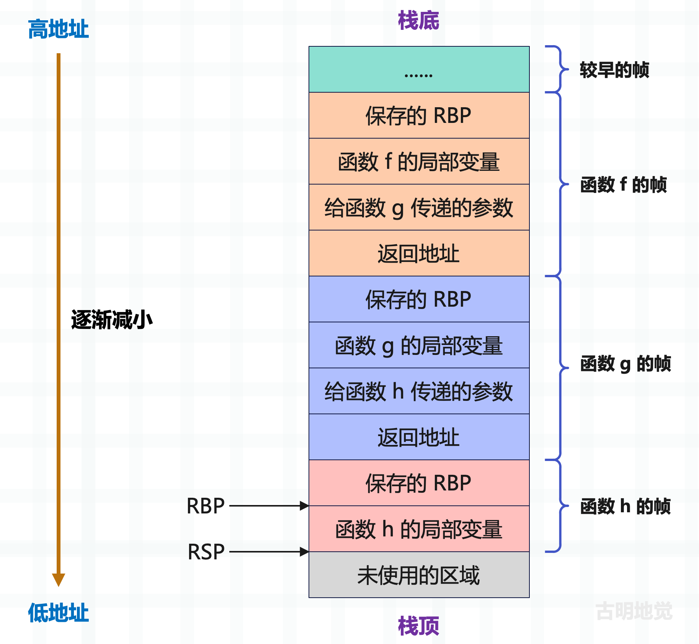

## 楔子

从现在开始，我们将剖析虚拟机运行字节码的原理。前面说了，Python 解释器可以分为两部分：Python 编译器和 Python 虚拟机。编译器将源代码编译成 PyCodeObject 对象之后，就由虚拟机接手整个工作。虚拟机会从 PyCodeObject 中读取字节码，并在当前的上下文中执行，直到所有的字节码都被执行完毕。

那么问题来了，既然源代码在经过编译之后，字节码指令以及静态信息都存储在 PyCodeObject 当中，那么是不是意味着虚拟机就在 PyCodeObject 对象上进行所有的动作呢？

很明显不是的，因为尽管 PyCodeObject 包含了关键的字节码指令以及静态信息，但有一个东西是没有包含、也不可能包含的，就是程序在运行时的执行环境，这个执行环境在 Python 里面就是栈帧。

## 栈帧：虚拟机的执行环境

那什么是栈帧呢？我们举个例子。

~~~Python
name = "古明地觉"

def some_func():
    name = "八意永琳"
    print(name)

some_func()
print(name)
~~~

上面的代码当中出现了两个 print(name)，它们的字节码指令相同，但执行的效果却显然是不同的，这样的结果正是执行环境的不同所产生的。因为环境的不同，name 的值也不同。

因此同一个符号在不同环境中可能指向不同的类型、不同的值，必须在运行时进行动态捕捉和维护，这些信息不可能在 PyCodeObject 对象中被静态存储。

所以可以得出结论，虚拟机并不是在 PyCodeObject 对象上执行操作的，而是在栈帧对象上。虚拟机在执行时，会根据 PyCodeObject 对象动态创建出栈帧对象，然后在栈帧里面执行字节码。所以栈帧是虚拟机执行的上下文，执行时依赖的所有信息都存储在栈帧中。

然后对于上面的代码，我们可以大致描述一下流程：

- 首先基于模块的 PyCodeObject 创建一个栈帧，假设叫 A，所有的字节码都会在栈帧中执行，虚拟机可以从栈帧里面获取变量的值，也可以修改；
- 当发生函数调用的时候，这里是 some_func，那么虚拟机会在栈帧 A 之上，为 some_func 创建一个新的栈帧，假设叫 B，然后在栈帧 B 里面执行函数 some_func 的字节码指令；
- 在栈帧 B 里面也有一个名字为 name 的变量，但由于执行环境、或者说栈帧的不同，name 指向的对象也不同；
- 一旦函数 some_func 的字节码指令全部执行完毕，那么会将当前的栈帧 B 销毁（也可以保留），再回到调用者的栈帧中来。就像是递归一样，每当调用函数时，就会在当前栈帧之上创建一个新的栈帧，一层一层创建，一层一层返回；

## 虚拟机和操作系统

不难发现，Python 虚拟机执行字节码这个过程，就是在模拟操作系统运行可执行文件。比如：

**程序加载**

- 操作系统：加载可执行文件到内存，设置程序计数器。
- Python 虚拟机：加载 .pyc 文件中的 PyCodeObject 对象，初始化字节码指令指针。

**内存管理**

- 操作系统：为进程分配内存空间，管理堆和栈。
- Python 虚拟机：创建和管理 Python 对象，处理内存分配和垃圾回收。

**指令执行**

- 操作系统：CPU 逐条执行机器指令。
- Python 虚拟机：虚拟机逐条执行字节码指令。

**资源管理**

- 操作系统：管理文件句柄、网络连接等系统资源。
- Python 虚拟机：管理文件对象、套接字等 Python 级别的资源。

**异常处理**

- 操作系统：处理硬件中断和软件异常。
- Python 虚拟机：捕获和处理 Python 异常。

我们简单地画一张示意图，来看看在一台普通的 x64 机器上，可执行文件是以什么方式运行的，在这里主要关注栈帧的变化。假设有三个函数，函数 f 调用了函数 g，函数 g 又调用了函数 h。

首先 CPU 有两个关键的寄存器，它们在函数调用和栈帧管理中扮演关键角色。

+ RSP（Stack Pointer）：栈指针，指向当前栈帧的顶部，或者说最后一个入栈的元素。因此随着元素的入栈和出栈，RSP 会动态变化。由于地址从栈底到栈顶是逐渐减小的，所以 RSP 会随着数据入栈而减小，随着数据出栈而增大。当然不管 RSP 怎么变，它始终指向当前栈的顶部。
+ RBP（Base Pointer）：基指针，指向当前栈帧的基址，它的作用是提供一个固定的参考点，用于访问当前函数的局部变量和参数。当新的帧被创建时，它的基址会保存上一个帧的基址，并由 RBP 指向。

我们用一段 C 代码来解释一下。

~~~c
#include <stdio.h>

int add(int a, int b) {
    int c = a + b;
    return c;
}

int main() {
    int a = 11;
    int b = 22;
    int result = add(a, b);
    printf("a + b = %d\n", result);
}
~~~

当执行函数 main 的时候，RSP 指向 main 栈帧的顶部，RBP 指向 main 栈帧的基址。然后在 main 里面又调用了函数 add，那么毫无疑问，系统会在地址空间中，在 main 的栈帧之上为 add 创建栈帧。然后让 RSP 指向 add 栈帧的顶部，RBP 指向 add 栈帧的基址，而 add 栈帧的基址保存了上一级栈帧（main 栈帧）的基址。

当函数 add 执行结束时，会销毁对应栈帧，再将 RSP 和 RBP 恢复为创建 add 栈帧之前的值，这样程序的执行流程就又回到了函数 main 里面，当然程序的运行空间也回到了函数 main 的栈帧中。

不难发现，通过两个 CPU 寄存器 RSP、RBP，以及栈帧中保存的上一级栈帧的基址，完美地维护了函数之间的调用链，这就是可执行文件在 x64 机器上的运行原理。

那么 Python 里面的栈帧是怎样的呢？

## 栈帧的底层结构

相较于 x64 机器上看到的那个简简单单的栈帧，Python 的栈帧实际上包含了更多的信息。注：栈帧也是一个对象。

~~~c
// Include/frameobject.h

typedef struct _frame {
    PyObject_VAR_HEAD
    struct _frame *f_back;
    PyCodeObject *f_code;
    PyObject *f_builtins;
    PyObject *f_globals;
    PyObject *f_locals;
    PyObject **f_valuestack;
    PyObject **f_stacktop;
    PyObject *f_trace;
    char f_trace_lines;
    char f_trace_opcodes;
    PyObject *f_gen;
    int f_lasti;
    int f_lineno;
    int f_iblock;
    char f_executing;
    PyTryBlock f_blockstack[CO_MAXBLOCKS];
    PyObject *f_localsplus[1];
} PyFrameObject;
~~~

下面来解释一下里面的每个字段都是啥含义，不过在解释之前，我们要先知道如何在 Python 中获取栈帧对象。

~~~Python
import inspect

def foo():
    # 返回当前所在的栈帧
    # 这个函数实际上是调用了 sys._getframe(1)
    return inspect.currentframe()

frame = foo()
print(frame) 
"""
<frame at 0x100de0fc0, file '.../main.py', line 6, code foo>
"""
print(type(frame)) 
"""
<class 'frame'>
"""
~~~

我们看到栈帧的类型是 \<class 'frame'\>，正如 PyCodeObject 对象的类型是 \<class 'code'\> 一样，这两个类没有暴露给我们，所以不可以直接使用。

同理，还有 Python 的函数，类型是 \<class 'function'\>，模块的类型是 \<class 'module'\>。这些解释器都没有给我们提供，如果直接使用的话，那么 frame、code、function、module 只是几个没有定义的变量罢了，这些类我们只能通过这种间接的方式获取。

下面来看一下 PyFrameObject 里面每个字段的含义。

**PyObject_VAR_HEAD**

变长对象的头部信息，所以栈帧也是一个对象。

**struct _frame \*f_back**

当前栈帧的上一级栈帧，也就是调用者的栈帧。所以 x64 机器是通过 RSP、RBP 两个指针维护函数的调用关系，而 Python 虚拟机则是通过栈帧的 f_back 字段。

~~~Python
import inspect

def foo():
    return inspect.currentframe()

frame = foo()
print(frame)
"""
<frame at 0x100de0fc0, file '.../main.py', line 6, code foo>
"""
# foo 的上一级栈帧，显然对应的是模块的栈帧
print(frame.f_back)
"""
<frame at 0x100adde40, file '.../main.py', line 12, code <module>>
"""
# 相当于模块的上一级栈帧，显然是 None
print(frame.f_back.f_back)
"""
None
"""
~~~

因此通过栈帧，可以轻松地获取完整的函数调用链路，我们一会儿演示。

**PyCodeObject \*f_code**

栈帧对象是在 PyCodeObject 之上构建的，所以它内部一定有一个字段指向 PyCodeObject，而该字段就是 f_code。

~~~Python
import inspect

def e():
    f()

def f():
    g()

def g():
    h()

def h():
    frame = inspect.currentframe()  # 获取栈帧
    func_names = []
    # 只要 frame 不为空，就一直循环，并将函数名添加到列表中
    while frame is not None:
        func_names.append(frame.f_code.co_name)
        frame = frame.f_back
    print(f"函数调用链路：{' -> '.join(func_names[:: -1])}")

f()
"""
函数调用链路：<module> -> f -> g -> h
"""
~~~

`模块 -> f -> g -> h`，显然我们获取了整个调用链路，是不是很有趣呢？

**PyObject \*f_builtins、\*f_gloabls、\*f_locals**

这三者均表示名字空间，其中 f_gloabls 指向全局名字空间（一个字典），它是全局变量的容身之所。是的，Python 的全局变量是通过字典存储的，调用函数 globals 即可拿到该字典。

~~~Python
# 等价于 name = "古明地觉"
globals()["name"] = "古明地觉"

# 等价于 print(name)
print(globals()["name"])  # 古明地觉

def foo():
    import inspect
    return inspect.currentframe()

frame = foo()
# frame.f_globals 同样会返回全局名字空间
print(frame.f_globals is globals())  # True
# 相当于创建了一个全局变量 age
frame.f_globals["age"] = 18
print(age)  # 18
~~~

关于名字空间，我们后面会用专门的篇幅详细说明。

然后 f_locals 指向局部名字空间（一个字典），但和全局变量不同，局部变量不存在局部名字空间中，而是静态存储在数组中。该字段先有个印象，后续再详细说。

f_builtins 指向内置名字空间（一个字典），显然一些内置的变量都存在里面。

~~~Python
def foo():
    import inspect
    return inspect.currentframe()

frame = foo()
print(frame.f_builtins["list"]("abcd"))
"""
['a', 'b', 'c', 'd']
"""
~~~

和我们直接使用 list("abcd") 是等价的。

**PyObject \*\*f_valuestack**

指向运行时栈的栈底，关于什么是运行时栈，后续详细说明。

**PyObject \*\*f_stacktop**

指向运行时栈的栈顶。

**PyObject \*f_trace**

追踪函数，用于调试。

**char f_trace_lines**

是否为每一行代码调用追踪函数，当设置为真（非零值）时，每当虚拟机执行到一个新的代码行时，都会调用追踪函数。这允许调试器在每行代码执行时进行干预，比如设置断点、检查变量等。

**char f_trace_opcodes**

是否为每个字节码指令调用追踪函数，当设置为真时，虚拟机会在执行每个字节码指令之前调用追踪函数。这提供了更细粒度的控制，允许进行指令级别的调试。

所以不难发现，f_trace_lines 是行级追踪，对应源代码的每一行，通常用于普通的调试，如设置断点、单步执行等，并且开销相对较小。f_trace_opcodes 是指令级追踪，对应每个字节码指令，通常用于更深层次的调试，比如分析具体的字节码执行过程，并且开销较大。

~~~Python
import sys

def trace_lines(frame, event, arg):
    print(f"行号：{frame.f_lineno}，文件名：{frame.f_code.co_filename}")
    return trace_lines

sys.settrace(trace_lines)
~~~

设置追踪函数一般需要通过 sys.settrace，不过不常用，了解一下即可。

**PyObject \*f_gen**

是否是基于生成器的 PyCodeObject 构建的栈帧。

**int f_lasti**

上一条已执行完毕的指令在指令序列中的偏移量。

**int f_lineno**

获取该栈帧时的源代码行号。

~~~Python
import inspect

def foo():
    return inspect.currentframe()

frame = foo()
print(frame.f_lineno)  # 4
~~~

我们是在第 4 行获取的栈帧，所以打印结果是 4。

**int f_iblock**

用于跟踪 try / except / finally 代码块的层级深度。具体等介绍异常捕获的时候再说，总之 f_iblock 对于虚拟机的异常捕获来说非常重要，可以在异常处理时确定当前代码在哪个 try 语句块内，帮助确定应该执行哪个 except 或 finally 子句，保证异常处理和清理代码能按正确的嵌套顺序执行。

**char f_executing**

当前栈帧是否仍在执行。

**PyTryBlock f_blockstack[CO_MAXBLOCKS]**

一个栈，用于追踪代码块，比如代码块的进入和退出，以及管理代码块的上下文信息。那么都支持哪些代码块呢？

+ SETUP_FINALLY：try / finally 块
+ SETUP_WITH：with 语句块
+ SETUP_ASYNC_WITH：async with 语句块

**PyObject \*localsplus[1]**

一个柔性数组，负责维护 "局部变量 + cell 变量 + free 变量 + 运行时栈"，大小在运行时确定。

以上就是栈帧内部的字段，这些字段先有个印象，后续在剖析虚拟机的时候还会继续细说。

总之我们看到，PyCodeObject 并不是虚拟机的最终目标，虚拟机最终是在栈帧中执行的。每一个栈帧都会维护一个 PyCodeObject 对象，换句话说，每一个 PyCodeObject 对象都会隶属于一个栈帧。并且从 f_back 可以看出，虚拟机在实际执行时，会产生很多的栈帧对象，而这些对象会被链接起来，形成一条执行环境链表，或者说栈帧链表。

而这正是 x64 机器上栈帧之间关系的模拟，在 x64 机器上，栈帧之间通过 RSP 和 RBP 指针建立了联系，使得新栈帧在结束之后能够顺利地返回到旧栈帧中，而 Python 虚拟机则是利用 f_back 来完成这个动作。

当然，获取栈帧除了通过 inspect 模块之外，在捕获异常时，也可以获取栈帧。

~~~python
def foo():
    try:
        1 / 0
    except ZeroDivisionError:
        import sys
        # exc_info 返回一个三元组
        # 分别是异常的类型、值、以及 traceback
        exc_type, exc_value, exc_tb = sys.exc_info()
        print(exc_type)  # <class 'ZeroDivisionError'>
        print(exc_value)  # division by zero
        print(exc_tb)  # <traceback object at 0x00000135CEFDF6C0>

        # 调用 exc_tb.tb_frame 即可拿到异常对应的栈帧
        # 另外这个 exc_tb 也可以通过下面这种方式获取
        # except ZeroDivisionError as e; e.__traceback__
        print(exc_tb.tb_frame.f_code.co_name)  # foo
        print(exc_tb.tb_frame.f_back.f_code.co_name)  # <module>
        # 显然 tb_frame 是当前函数 foo 的栈帧
        # 那么 tb_frame.f_back 就是整个模块对应的栈帧
        # 而 tb_frame.f_back.f_back 显然就是 None 了
        print(exc_tb.tb_frame.f_back.f_back)  # None

foo()
~~~

关于栈帧内部的字段的含义，我们就说完了。当然如果有些字段现在不是很理解，也没关系，随着不断地学习，你会豁然开朗。

## 小结

因为很多动态信息无法静态地存储在 PyCodeObject 对象中，所以 PyCodeObject 对象在交给虚拟机之后，虚拟机会在其之上动态地构建出 PyFrameObject 对象，也就是栈帧。

因此虚拟机是在栈帧里面执行的字节码，它包含了虚拟机在执行字节码时依赖的全部信息。

----

&nbsp;

**欢迎大家关注我的公众号：古明地觉的编程教室。**

**如果觉得文章对你有所帮助，也可以请作者吃个馒头，Thanks♪(･ω･)ﾉ。**

