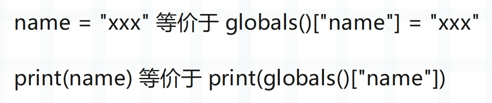

## 楔子

在介绍栈桢的时候，我们看到了 3 个独立的名字空间：f_locals、f_globals、f_builtins。名字空间对 Python 来说是一个非常重要的概念，虚拟机的运行机制和名字空间有着非常紧密的联系。并且在 Python 中，与名字空间这个概念紧密联系在一起的还有名字、作用域这些概念，下面我们就来剖析这些概念是如何体现的。

## 变量只是一个名字

在这个系列的最开始我们就说过，从解释器的角度来看，变量只是一个泛型指针 <font color="blue">PyObject \*</font>，而从 Python 的角度来看，变量只是一个名字、或者说符号，用于和对象进行绑定的。

~~~Python
name = "古明地觉"
~~~

上面这个赋值语句其实就是将 <font color="blue">name</font> 和 <font color="blue">"古明地觉"</font> 绑定起来，让我们可以通过 name 这个符号找到对应的 PyUnicodeObject。因此定义一个变量，本质上就是建立名字和对象之间的映射关系。

另外我们说 Python 虽然一切皆对象，但拿到的都是指向对象的指针，因此创建函数和类，以及模块导入，同样是在完成名字和对象的绑定。

~~~python
def foo(): pass

class A(): pass
~~~

创建一个函数也相当于定义一个变量，会先根据函数体创建一个函数对象，然后将<font color="blue">名字 foo</font> 和<font color="blue">函数对象</font>绑定起来。所以函数名和函数体之间是分离的，同理类也是如此。

~~~Python
import os
~~~

导入一个模块，也是在定义一个变量。<font color="blue">import os</font> 相当于将<font color="blue">名字 os</font> 和<font color="blue">模块对象绑定</font>起来，通过 os 可以找到指定的模块对象。

> 当我们导入一个模块的时候，解释器是这么做的。
>
> import os 等价于 os = \_\_import\_\_("os")，可以看到本质上还是一个赋值语句。

<font color="blue">import numpy as np</font> 中的 as 语句同样是在定义变量，将名字 np 和对应的模块对象绑定起来，以后就可以通过 np 这个名字去获取指定的模块了。

**总结：无论是普通的赋值语句，还是定义函数和类，亦或是模块导入，它们本质上都是在完成变量和对象的绑定。**

~~~python
name = "古明地觉"

def foo(): pass

class A(): pass

import os
import numpy as np
~~~

里面的 name、foo、A、os、np，都只是一个变量，或者说名字、符号，然后通过名字可以获取与之绑定的对象。

## 作用域和名字空间

正如上面所说，赋值语句、函数定义、类定义、模块导入，本质上只是完成了变量和对象之间的绑定，或者说我们创建了变量到对象的映射，通过变量可以获取对应的对象，而它们的容身之所就是名字空间。

所以名字空间是通过 PyDictObject 对象实现的，这对于映射来说简直再适合不过了。而前面介绍字典的时候，我们说字典是被高度优化的，原因就是虚拟机本身也重度依赖字典，从这里的名字空间即可得到体现。

当然，在一个模块内部，变量还存在可见性的问题，比如：

~~~Python
x = 1

def foo():
    x = 2
    print(x)  # 2

foo()
print(x)  # 1
~~~

我们看到同一个变量名，打印的确是不同的值，说明指向了不同的对象，换句话说这两个变量是在不同的名字空间中被创建的。

名字空间本质上是一个字典，如果两者在同一个名字空间，那么由于 key 的不重复性，当执行 x = 2 的时候，会把字典里面 key 为 "x" 的 value 给更新成 2。但是在外面还是打印 1，这说明两者所在的不是同一个名字空间，打印的也就自然不是同一个 x。因此对于一个模块而言，内部可以存在多个名字空间，每一个名字空间都与一个作用域相对应。作用域可以理解为一段程序的正文区域，在这个区域里面定义的变量是有意义的，然而一旦出了这个区域，就无效了。

关于作用域这个概念，我们要记住：它仅仅是由源代码的文本所决定。在 Python 中，一个变量在某个位置是否起作用，是由它的文本位置决定的。

因此 Python 具有静态作用域（词法作用域），而名字空间则是作用域的动态体现，一个由程序文本定义的作用域在运行时会转化为一个名字空间、即一个 PyDictObject 对象。比如进入一个函数，显然会进入一个新的作用域，因此函数在执行时，会创建一个名字空间。

> 在介绍 PyCodeObject 的时候，我们说解释器在对源代码进行编译的时候，对于代码中的每一个 code block，都会创建一个 PyCodeObject 对象与之对应。而当进入一个新的名字空间、或者说作用域时，就算是进入一个新的 block 了。
>
> 而根据我们使用 Python 的经验，显然函数、类都是一个新的 block，解释器在执行的时候会为它们创建各自的名字空间。

所以名字空间是名字、或者说变量的上下文环境，名字的含义取决于名字空间。更具体的说，一个变量绑定的对象是不确定的，需要由名字空间来决定。位于同一个作用域的代码可以直接访问作用域中出现的名字，即所谓的<font color="blue">直接访问</font>；但不同的作用域，则需要通过<font color="blue">访问修饰符 **.**</font> 进行属性访问。

~~~python
class A:
    x = 1
    
class B:
    y = 2
    print(A.x)  # 1
    print(y)  # 2
~~~

如果想在 B 里面访问 A 里面的内容，要通过 <font color="blue">A.属性</font>的方式，表示通过 A 来获取 A 里面的属性。但是访问 B 的内容就不需要了，因为都是在同一个作用域，所以直接访问即可。

访问名字这样的行为被称为<font color="blue">名字引用</font>，名字引用的规则决定了 Python 程序的行为。

~~~python
x = 1

def foo():
    x = 2
    print(x)  # 2

foo()
print(x)  # 1
~~~

还是上面的代码，如果我们把函数里面的 x = 2 给删掉，意味着函数的作用域里面已经没有 x 这个变量了，那么再执行程序会有什么结果呢？从 Python 层面来看，显然是会寻找外部的 x。因此我们可以得到如下结论：

- 作用域是层层嵌套的；
- 内层作用域可以访问外层作用域；
- 外层作用域无法访问内层作用域，如果是把外层的 x = 1 给去掉，那么最后面的 print(x) 铁定报错；
- 查找元素会依次从当前作用域向外查找，也就是查找元素时，对应的作用域是按照从小往大、从里往外的方向前进的；

## global 名字空间

不光函数、类有自己的作用域，模块对应的源文件本身也有相应的作用域。比如：

~~~python
name = "古明地觉"
age = 16

def foo():
    return 123

class A:
    pass
~~~

这个文件本身也有自己的作用域，并且是 global 作用域，所以解释器在运行这个文件的时候，也会为其创建一个名字空间，而这个名字空间就是 global 名字空间，即全局名字空间。它里面的变量是全局的，或者说是模块级别的，在当前文件的任意位置都可以直接访问。

而 Python 也提供了 globals 函数，用于获取 global 名字空间。

~~~python
name = "古明地觉"

def foo():
    pass

print(globals())
"""
{..., 'name': '古明地觉', 'foo': <function foo at 0x0000015255143E20>}
"""
~~~

里面的 ... 表示省略了一部分输出，我们看到创建的全局变量就在里面。而且 foo 也是一个全局变量，它指向一个函数对象。

注意：我们说函数内部是一个独立的 block，因此它会对应一个 PyCodeObject。然后在解释到 <font color="blue">def foo</font> 的时候，会根据 PyCodeObject 对象创建一个 PyFunctionObject 对象，然后将 foo 和这个函数对象绑定起来。

当后续调用 foo 的时候，再根据 PyFunctionObject 对象创建 PyFrameObject 对象、然后执行，至于具体细节留到介绍函数的时候再细说。总之，我们看到 foo 也是一个全局变量，全局变量都在 global 名字空间中。并且 <font color="blue">global 名字空间全局唯一</font>，它是程序运行时的<font color="blue">全局变量</font>和<font color="blue">与之绑定的对象</font>的容身之所。你在任何一个位置都可以访问到 global 名字空间，正如你在任何一个位置都可以访问全局变量一样。

另外我们思考一下，global 名字空间是一个字典，全局变量和对象会以键值对的形式存在里面。那如果我手动地往 global 名字空间里面添加一个键值对，是不是也等价于定义一个全局变量呢？

~~~Python
globals()["name"] = "古明地觉"
print(name)  # 古明地觉

def foo1():
    def foo2():
        def foo3():
            globals()["age"] = 16
        return foo3
    return foo2

foo1()()()
print(age)  # 16
~~~

我们看到确实如此，往 global 名字空间里面插入一个键值对完全等价于定义一个全局变量。并且 global 名字空间是唯一的，你在任何地方调用 globals() 得到的都是 global 名字空间，正如你在任何地方都可以访问到全局变量一样。

所以即使是在函数中给 global 名字空间添加一个键值对，也等价于定义一个全局变量。



问题来了，如果在函数里面，我们不获取 global 名字空间，怎么创建全局变量呢？

```python
name = "古明地觉"

def foo():
    global name
    name = "古明地恋"

print(name)  # 古明地觉
foo()
print(name)  # 古明地恋
```

很简单，Python 为我们准备了 global 关键字，表示声明的变量是全局的。

## local 名字空间

像函数和类拥有的作用域，我们称之为 local 作用域，在运行时会对应 local 名字空间，即局部名字空间。由于不同的函数具有不同的作用域，所以局部名字空间可以有很多个，但全局名字空间只有一个。

对于 local 名字空间来说，它也对应一个字典，显然这个字典就不是全局唯一的了。而如果想获取局部名字空间，Python 也提供了 locals 函数。

~~~python
def foo():
    name = "古明地觉"
    age = 17
    return locals()

def bar():
    name = "雾雨魔理沙"
    age = 18
    return locals()

print(locals() == globals())  # True
print(foo())  # {'name': '古明地觉', 'age': 17}
print(bar())  # {'name': '雾雨魔理沙', 'age': 18}
~~~

对于模块来讲，它的 local 名字空间和 global 名字空间是一样的，也就是说，模块对应的栈桢对象里面的 f_locals 和 f_globals 指向的是同一个 PyDictObject 对象。但对于函数而言，局部名字空间和全局名字空间就不一样了，调用 locals() 是获取自身的局部名字空间，而不同函数的局部名字空间是不同的。但是 globals() 函数的调用结果是一样的，获取的都是全局名字空间，这也符合<font color="blue">函数内不存在指定变量的时候会去找全局变量</font>这一结论。

> 注：关于 local 名字空间，还有一个重要的细节，全局变量会存储在 global 名字空间中，但局部变量却并不存储在 local 名字空间中。函数有哪些局部变量在编译的时候就已经确定了，会被静态存储在数组中，关于这一点，后续会单独详细说明。

## builtin 名字空间

Python 有一个所谓的 LGB 规则，指的是在查找一个变量时，会按照自身的 local 空间、外层的 global 空间、内置的 builtin 空间的顺序进行查找。

builtin 名字空间也是一个字典，当 local 名字空间、global 名字空间都查找不到指定变量的时候，会去 builtin 空间查找。而关于 builtin 空间的获取，Python 提供了一个模块。

~~~Python
# 等价于 __builtins__
import builtins
print(builtins is __builtins__)  # True
print(builtins)  # <module 'builtins' (built-in)>
~~~

builtins 是一个模块，那么 builtins.\_\_dict\_\_ 便是 builtin 名字空间，也叫内置名字空间。

~~~Python
import builtins

# builtins.list 表示从 builtin 名字空间中查找 list
# 它等价于 builtins.__dict__["list"]
# 而如果只写 list，那么由于 local 空间、global 空间都没有
# 因此最终还是会从 builtin 空间中查找
# 但如果是 builtins.list，那么就不兜圈子了
# 表示："builtin 空间，就从你这里获取了"
print(builtins.list is list)  # True


# 将 builtin 空间的 dict 改成 123
builtins.dict = 123
# 那么此时获取的 dict 就是 123
print(dict + 456)  # 579


# 如果是 str = 123，等价于创建全局变量 str = 123
str = 123
# 显然影响的是 global 空间
print(str)  # 123
# builtin 空间则不受影响
print(builtins.str)  # <class 'str'>
print(builtins.__dict__["str"])  # <class 'str'>
~~~

**这里提一下在 Python2 中，while 1 比 while True 要快，为什么？**

因为 True 在 Python2 中不是关键字，所以它是可以作为变量名的。那么虚拟机在执行的时候就要先看 local 空间和 global 空间里有没有 True 这个变量，有的话使用我们定义的，没有的话再使用内置的 True。

而 1 是一个常量，直接加载就可以，所以 while True 多了符号查找这一过程。但是在 Python3 中两者就等价了，因为 True 在 Python3 中是一个关键字，也会直接作为一个常量来加载。

## exec 和 eval

记得之前介绍 exec 和 eval 的时候，我们说这两个函数里面还可以接收第二个参数和第三个参数，它们分别表示 global 名字空间、local 名字空间。

```Python
# 如果不指定，默认是当前所在的名字空间
# 显然此时是全局名字空间
exec("name = '古明地觉'")
print(name)  # 古明地觉

# 但我们也可以指定某个名字空间
namespace = {}
# 比如将 namespace 作为全局名字空间
# 另外这里没有指定第三个参数，也就是局部名字空间
# 如果指定了第二个参数，但没有指定第三个参数
# 那么第三个参数默认和第二个参数保持一致
exec("name = 'satori'", namespace)
print(namespace["name"])  # satori
```

至于 eval 也是同理：

```Python
namespace = {"seq": [1, 2, 3, 4, 5]}
try:
    print(eval("sum(seq)"))
except NameError as e:
    print(e)  # name 'seq' is not defined
# 告诉我们 seq 没有被定义
# 如果将 namespace 作为名字空间
print(eval("sum(seq)", namespace))  # 15
```

所以名字空间本质上就是一个字典，所谓的变量不过是字典里面的一个 key。为了进一步加深印象，再举个模块的例子：

```Python
# 我们自定义一个模块吧
# 首先模块也是一个对象，类型为 <class 'module'>
# 但底层没有将这个类暴露给我们，所以需要换一种方式获取
import sys
ModuleType = type(sys)

# 以上就拿到了模块的类型对象，调用即可得到模块对象
# 这里我们自定义一个类，继承 ModuleType
class MyModule(ModuleType):

    def __init__(self, module_name):
        self.module_name = module_name
        super().__init__(module_name)
        # 也可以定义一些其它的属性

    def __str__(self):
        return f"<module '{self.module_name}' from '虚无之境'>"

my_module = MyModule("自定义模块")
print(my_module)
"""
<module '自定义模块' from '虚无之境'>
"""

# 此时的 my_module 啥也没有，我们为其添砖加瓦
my_module.__dict__["name"] = "古明地觉"
print(my_module.name)  # 古明地觉

# 给模块设置属性，本质上也是操作模块的属性字典，当然获取属性也是如此
# 如果再和 exec 结合的话
code_string = """
age = 16
def foo():
    return "我是函数 foo"
    
from functools import reduce     
"""
# 将属性设置在模块的属性字典里面
exec(code_string, my_module.__dict__)
# 然后我们获取它
print(my_module.age)  # 16
print(my_module.foo())  # 我是函数 foo
print(my_module.reduce(int.__add__, range(101)))  # 5050

# 是不是很神奇呢？由于 my_module 是一个模块对象
# 我们还可以将它注入到 sys.modules 中，然后通过 import 获取
sys.modules["俺滴模块"] = my_module
from 俺滴模块 import name, age, foo
print(name)  # 古明地觉
print(age)  # 16
print(foo())  # 我是函数 foo
```

怎么样，是不是很有意思呢？相信你对名字空间已经有了足够清晰的认识，它是变量和与之绑定的对象的容身之所。

## 小结

名字空间是 Python 的灵魂，它规定了一个变量应该如何查找，关于变量查找，下一篇文章来详细介绍，到时你会对名字空间有更加透彻的理解。

然后是作用域，所谓名字空间其实就是作用域的动态体现。整个 py 文件是一个作用域，也是全局作用域；定义函数、定义类、定义方法，又会创建新的作用域，这些作用域层层嵌套。那么同理，运行时的名字空间也是层层嵌套的，形成一条名字空间链。内层的变量对外层是不可见的，但外层的变量对内层是可见的。

然后全局名字空间是一个字典，它是唯一的，操作里面的键值对等价于操作全局变量；至于局部名字空间则不唯一，每一个函数都有自己的局部名字空间，但我们要知道函数内部在访问局部变量的时候是静态访问的（相关细节后续聊）。

还有内置名字空间，可以通过 \_\_builtins\_\_ 获取，但拿到的是一个模块，再获取它的属性字典，那么就是内置名字空间了。

----

&nbsp;

**欢迎大家关注我的公众号：古明地觉的编程教室。**


**如果觉得文章对你有所帮助，也可以请作者吃个馒头，Thanks♪(･ω･)ﾉ。**

