## 楔子

当解释器启动后，首先会进行<font color="blue">运行时环境</font>的初始化，注意这里的运行时环境，它和之前说的<font color="blue">执行环境</font>有很大不同，运行时环境是一个全局的概念，而执行环境是一个栈帧。

关于运行时环境的初始化是一个很复杂的过程，涉及到 Python 进程、线程的创建，类型对象的完善等非常多的内容，我们暂时先不讨论。这里就假设初始化动作已经完成，我们已经站在了虚拟机的门槛外面，只需要轻轻推动第一张骨牌，整个执行过程就像多米诺骨牌一样，一环扣一环地展开。

在介绍字节码的时候我们说过，解释器可以看成是：编译器+虚拟机，编译器负责将源代码编译成 PyCodeObject 对象，而虚拟机则负责执行。所以我们的重点就是虚拟机是怎么执行 PyCodeObject 对象的？整个过程是什么，掌握了这些，你对虚拟机会有一个更深的理解。

## 虚拟机的运行框架

在介绍栈帧的时候我们说过，Python 是一门动态语言，一个变量指向什么对象需要在运行时才能确定，这些信息不可能静态存储在 PyCodeObject 对象中。所以虚拟机在运行时会基于 PyCodeObject 对象动态创建出栈帧对象，然后在栈帧里面执行字节码。而创建栈帧，主要使用以下两个函数：

~~~C
// Python/ceval.c

/* 基于 PyCodeObject、全局名字空间、局部名字空间，创建栈帧
 * 参数非常简单，所以它一般适用于模块这种参数不复杂的场景
 * 前面说了，模块也会对应一个栈帧，并且它位于栈帧链的最顶层 
 */
PyObject *
PyEval_EvalCode(PyObject *co, PyObject *globals, PyObject *locals)
{
    return PyEval_EvalCodeEx(co,
                      globals, locals,
                      (PyObject **)NULL, 0,
                      (PyObject **)NULL, 0,
                      (PyObject **)NULL, 0,
                      NULL, NULL);
}

/* 相比 PyEval_EvalCode 多了很多的参数
 * 比如里面有位置参数以及个数，关键字参数以及个数
 * 还有默认参数以及个数，闭包等等，显然它用于函数等复杂场景 
 */
PyObject *
PyEval_EvalCodeEx(PyObject *_co, PyObject *globals, PyObject *locals,
                  PyObject *const *args, int argcount,
                  PyObject *const *kws, int kwcount,
                  PyObject *const *defs, int defcount,
                  PyObject *kwdefs, PyObject *closure)
{
    return _PyEval_EvalCodeWithName(_co, globals, locals,
                                    args, argcount,
                                    kws, kws != NULL ? kws + 1 : NULL,
                                    kwcount, 2,
                                    defs, defcount,
                                    kwdefs, closure,
                                    NULL, NULL);
}
~~~

我们看到 PyEval_EvalCode 也是调用了 PyEval_EvalCodeEx，后者是通用逻辑，只不过为模块创建栈帧时，参数非常简单，所以又封装了  PyEval_EvalCode 函数。

当然啦，上面这两个函数最终都会调用 _PyEval_EvalCodeWithName 函数，创建并初始化栈帧对象，我们来看一下该函数内部的逻辑。

~~~C
// Python/ceval.c

PyObject *
_PyEval_EvalCodeWithName(PyObject *_co, PyObject *globals, PyObject *locals,
           PyObject *const *args, Py_ssize_t argcount,
           PyObject *const *kwnames, PyObject *const *kwargs,
           Py_ssize_t kwcount, int kwstep,
           PyObject *const *defs, Py_ssize_t defcount,
           PyObject *kwdefs, PyObject *closure,
           PyObject *name, PyObject *qualname)
{
    PyCodeObject* co = (PyCodeObject*)_co;
    PyFrameObject *f;
    PyObject *retval = NULL;
    PyObject **fastlocals, **freevars;
    // ...

    // 调用 _PyFrame_New_NoTrack 函数创建栈帧
    f = _PyFrame_New_NoTrack(tstate, co, globals, locals);
    if (f == NULL) {
        return NULL;
    }
    fastlocals = f->f_localsplus;
    freevars = f->f_localsplus + co->co_nlocals;

    // ...
    
    // 调用 PyEval_EvalFrameEx 在栈帧中执行字节码
    retval = PyEval_EvalFrameEx(f,0);

fail:
    assert(tstate != NULL);
    if (Py_REFCNT(f) > 1) {
        Py_DECREF(f);
        _PyObject_GC_TRACK(f);
    }
    else {
        ++tstate->recursion_depth;
        Py_DECREF(f);
        --tstate->recursion_depth;
    }
    return retval;
}
~~~

这个函数的逻辑比较长，但做的事情很简单。

+ 调用 _PyFrame_New_NoTrack 函数创建栈帧，并初始化内部字段。
+ 栈帧创建完毕之后，里面的字段都是初始值，所以还要基于当前的 PyCodeObject 对象、位置参数、关键字参数、参数个数等信息修改栈帧字段，而省略掉的大部分代码就是在负责相关逻辑。以上这两步组合起来，就是我们之前说的基于 PyCodeObject 对象构建栈帧对象。
+ 栈帧字段设置完毕之后，调用 PyEval_EvalFrameEx 函数，在栈帧中执行字节码。

当然，PyEval_EvalFrameEx 也不是整个流程的终点，它内部还调用了一个函数。

~~~C
// Python/ceval.c

PyObject *
PyEval_EvalFrameEx(PyFrameObject *f, int throwflag)
{
    // interp 表示进程状态对象，它的 eval_frame 字段被设置为 _PyEval_EvalFrameDefault
    // 这个 _PyEval_EvalFrameDefault 函数便是虚拟机运行的核心，是一个代码量超级多的函数
    PyInterpreterState *interp = _PyInterpreterState_GET_UNSAFE();
    return interp->eval_frame(f, throwflag);
}
~~~

所以整个流程很清晰了，我们画一张图。

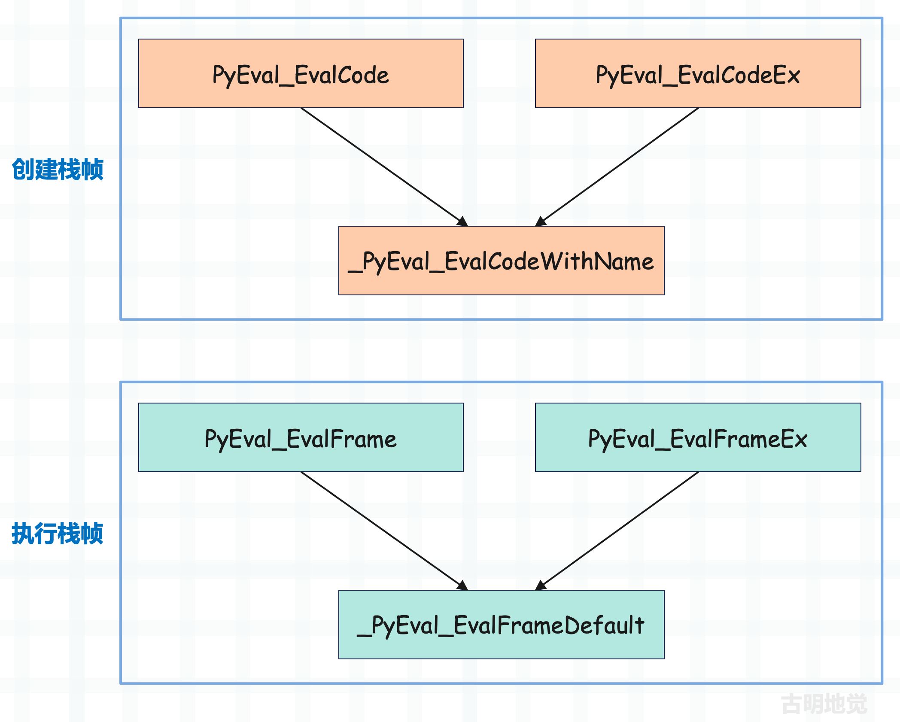

所以 _PyEval_EvalFrameDefault 函数是虚拟机运行的核心，该函数较为复杂，我们会在下一篇文章中分析它的具体实现。至于本篇文章就先从宏观的角度来描述一下虚拟机执行字节码的流程，并对之前的内容做一个补充，将背后涉及的概念阐述一遍，这样后续看源码的时候也会事半功倍。

首先栈帧中有一个 f_code 字段，它指向 PyCodeObject 对象，该对象的 co_code 字段则保存着字节码指令序列。而虚拟机执行字节码就是从头到尾遍历整个 co_code，对指令逐条执行的过程。

另外也不要觉得字节码指令（简称指令）有多神秘，说白了它就是个 uint8 整数，而一个程序肯定会包含多条指令，它们整体便构成了指令集，或者说指令序列。那么显然，使用 bytes 对象来表示指令序列再合适不过了，如果站在 C 的角度，则就是一个普普通通的字符数组，一条指令就是一个字符、或者说一个整数。

当然指令序列里面包含的不仅仅是指令，还有指令参数，因为每个指令都会带一个参数。因此索引为 0 2 4 6 8 ··· 的整数表示指令，索引为 1 3 5 7 9 ··· 的整数表示指令参数。

我们用 Python 来演示一下：

~~~Python
code_string = """
a = 1
b = 2
c = a + b
"""

code_object = compile(code_string, "<file>", "exec")
# 查看常量池
print(code_object.co_consts)
"""
(1, 2, None)
"""
# 查看符号表
print(code_object.co_names)
"""
('a', 'b', 'c')
"""
~~~

这些都比较简单，再来看一下反编译的结果，直接 dis.dis(code_object) 即可。

~~~C
/* 常量池：(1, 2, None)
 * 符号表：('a', 'b', 'c')
 */
 
// 第一列表示源代码行号
// 第二列表示指令的偏移量
// 第三列表示指令，在 C 中它们都是宏，对应一个整数
// 第四列表示指令参数
// 第五列是 dis 模块为了方便我们阅读而补充的提示信息


// 指令：LOAD_CONST，指令参数：0
// 表示从常量池中加载索引为 0 的常量，并压入运行时栈（关于运行时栈，一会儿详细说明）
// 索引为 0 的常量显然是 1，而括号里面的提示信息显示的也是 1
2           0 LOAD_CONST               0 (1)
// 指令：STORE_NAME，指令参数：0
// 表示从符号表中加载索引为 0 的符号，显然结果是 "a"
// 然后弹出运行时栈的栈顶元素，显然是上一条指令压入的 1
// 将 "a" 和 1 组成键值对，存储在当前的名字空间中
// 到此 a = 1 这条语句便完成了，或者说完成了变量和值的绑定  
            2 STORE_NAME               0 (a)

// 从常量池中加载索引为 1 的常量（结果是 2），并压入运行时栈  
3           4 LOAD_CONST               1 (2)
// 从符号表中加载索引为 1 的符号（结果是 "b")
// 然后从栈顶弹出元素 2，将 "b" 和 2 绑定起来  
            6 STORE_NAME               1 (b)

// 加载符号表中索引为 0 的符号对应的值，并压入运行时栈  
4           8 LOAD_NAME                0 (a)
// 加载符号表中索引为 1 的符号对应的值，并压入运行时栈  
           10 LOAD_NAME                1 (b)
// 将运行时栈的两个元素弹出，并执行加法运算
// 运算之后，再将结果 a + b 压入运行时栈    
           12 BINARY_ADD
// 从符号表中加载索引为 2 的符号，结果是 "c"           
// 将运行时栈的栈顶元素弹出，这里是 a + b 的运算结果
// 然后进行绑定，完成 c = a + b 这条赋值语句         
           14 STORE_NAME               2 (c)
// 从常量池中加载索引为 2 的元素并返回，有一个隐式的 return None  
           16 LOAD_CONST               2 (None)
           18 RETURN_VALUE
~~~

这些指令的源码实现后续都会说，但是不难发现，程序的主干逻辑都体现在字节码中，而依赖的信息则由其它字段来维护。所谓执行源代码，其实就是虚拟机执行编译之后的字节码，通过遍历 co_code，对不同的指令执行不同的逻辑。

然后我们基于上面这些输出信息，看看能否将字节码指令集还原出来，当然在还原之前首先要知道这些指令代表的数值是多少。


下面我们来进行还原。

~~~python
"""
 0 LOAD_CONST               0 (1)
 2 STORE_NAME               0 (a)

 4 LOAD_CONST               1 (2)
 6 STORE_NAME               1 (b)

 8 LOAD_NAME                0 (a)
10 LOAD_NAME                1 (b)
12 BINARY_ADD
14 STORE_NAME               2 (c)
16 LOAD_CONST               2 (None)
18 RETURN_VALUE
"""
BINARY_ADD = 23
RETURN_VALUE = 83
STORE_NAME = 90
LOAD_CONST = 100
LOAD_NAME = 101

codes = [
    # a = 1
    LOAD_CONST, 0,
    STORE_NAME, 0,

    # b = 2
    LOAD_CONST, 1,
    STORE_NAME, 1,

    # c = a + b
    LOAD_NAME, 0,  # 加载 a
    LOAD_NAME, 1,  # 加载 b
    BINARY_ADD, 0,  # 计算 a + b
    STORE_NAME, 2,  # 和变量 c 绑定

    # 所有代码块都隐式地包含了一个 return None
    LOAD_NAME, 2,
    RETURN_VALUE, 0
]
print(bytes(codes))
"""
b'd\x00Z\x00d\x01Z\x01e\x00e\x01\x17\x00Z\x02e\x02S\x00'
"""
~~~

那么字节码是不是我们还原的这个样子呢？来对比一下。

~~~python
>>> code_object.co_code
b'd\x00Z\x00d\x01Z\x01e\x00e\x01\x17\x00Z\x02d\x02S\x00'
~~~

结果是一样的，到此相信你对 Python 源代码的执行过程应该有更深的了解了，简单来讲，其实就是以下几个步骤。

+ 1）源代码被编译成 PyCodeObject 对象，该对象的 co_code 字段指向字节码指令序列，它包含了程序执行的主干逻辑，剩余字段则保存常量池、符号表等其它静态信息。
+ 2）虚拟机在 PyCodeObject 对象的基础上构建栈桢对象。
+ 3）虚拟机在栈桢对象内部执行字节码（帧评估），具体流程就是遍历指令集和，根据不同指令执行不同的处理逻辑，而这一过程便由 _PyEval_EvalFrameDefault 函数负责完成。

## 什么是运行时栈

之前一直提到一个概念，叫运行时栈，那什么是运行时栈呢？别急，我们先来回顾一下栈桢的基本结构。

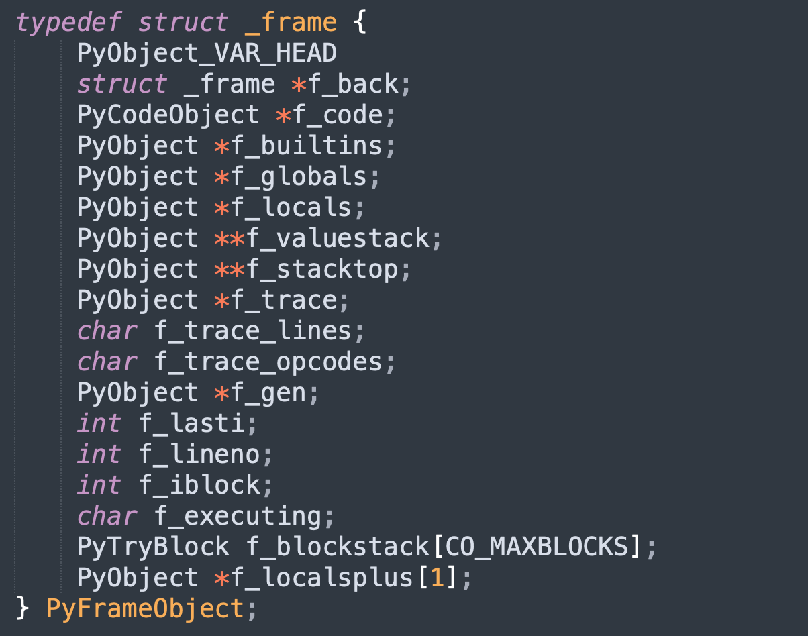

大部分字段都很好理解，因为之前通过 Python 代码演示过。但有几个字段是虚拟机用于执行指令的，后续会遇到，所以这里再拿出来解释一下。

<font color="darkblue">**f_lasti**</font>

上一条刚执行完的字节码指令的偏移量，因为每个指令要带一个参数，所以当虚拟机要执行偏移量为 n 的指令时，那么 f_lasti 就是 n - 2。当然，如果字节码还没有开始执行，那么 f_lasti 为 -1。

<font color="darkblue">**f_localsplus**</font>

一个柔性数组，它的内存大小被分为 4 个部分。


注：f_localsplus 是一个数组，所以它是一段连续的内存，只不过按照用途被分成了 4 个部分。如果用新一团团长丁伟的说法：每个部分之间是鸡犬相闻，但又老死不相往来。

然后再着重强调一下运行时栈，虚拟机在执行字节码指令时高度依赖它，因为一个指令只能带一个参数，那么剩余的参数就必须通过运行时栈给出。比如 <font color="blue">a = 1</font> 会对应两条字节码：LOAD_CONST 和 STORE_NAME。

STORE_NAME 的作用是从符号表中获取符号，或者说变量名，然后和值绑定起来。而要加载符号，那么必须要知道它在符号表中的索引，显然这可以通过指令参数给出，但问题是与之绑定的值怎么获取？毫无疑问，要通过运行时栈。因此 LOAD_CONST 将值读取进来之后，还要压入运行时栈，然后 STORE_NAME 会将值从运行时栈中弹出，从而完成符号（变量）和值的绑定。

关于运行时栈，我们再看个复杂的例子：

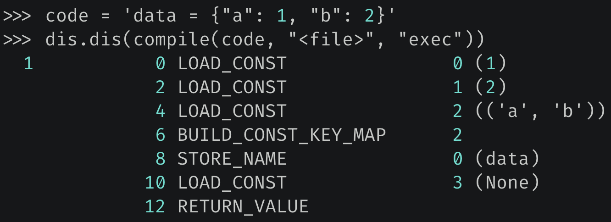

偏移量为 6 的指令表示要构建一个字典，指令参数 2 表示构建的字典的长度为 2，但问题是字典的键值对在什么地方？显然它们已经被提前压入了运行时栈，执行 BUILD_CONST_KEY_MAP 的时候直接弹出即可。

所以这就是运行时栈的作用，如果某个指令需要 n 个参数，那么其中的 n - 1 个必须要提前压入运行时栈，然后在该指令执行的时候依次弹出，因为一个指令只能带一个参数。

<font color="darkblue">**f_stacktop**</font>

一个指针，指向运行时栈的栈顶。由于运行时栈存储的都是 PyObject \*，所以 f_stacktop 的类型是 PyObject \*\*。当然在源码中没有直接操作 f_stacktop 字段，而是定义了一个变量 stack_pointer，它初始等于 f_stacktop。后续操作的都是 stack_pointer，当然操作完之后，还要重新赋值给 f_stacktop。

所以 stack_pointer 始终指向运行时栈的栈顶，而元素的入栈和出栈，显然都是通过操作 stack_pointer 完成的。

+ 执行 \*stack_pointer++ = v，一个元素就入栈了。
+ 执行 v = \*--stack_pointer，一个元素就出栈了。

而随着元素的入栈和出栈，运行时栈的栈顶、或者说 stack_pointer 也在不断变化，但无论如何，stack_pointer 始终指向运行时栈的栈顶。当然啦，由于栈顶发生变化，后续还要对 f_stacktop 进行更新。

<font color="darkblue">**f_valuestack**</font>

一个指针，指向运行时栈的栈底。

另外我们说 localsplus 数组被分成了 4 份，最后一份给了运行时栈，因此虽然我们称之为栈，但它其实就是一个数组，而且还是数组的一部分。

而对于数组而言，内存地址从左往右是增大的。

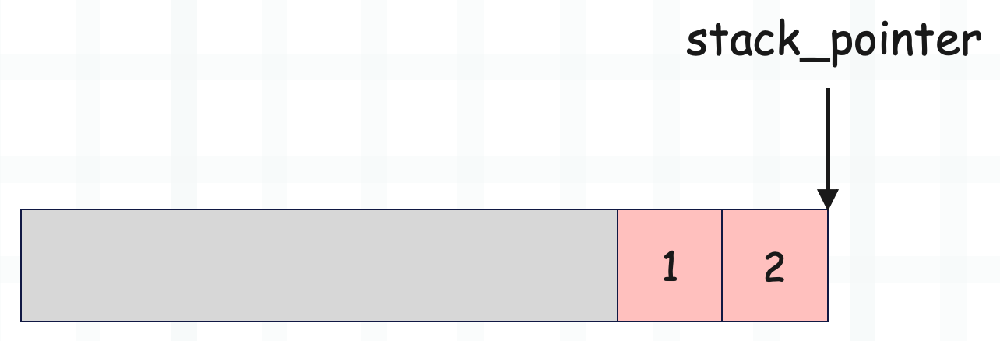

这是 localsplus 的示意图，灰色区域表示运行时栈之前的部分，这里我们只看运行时栈，目前栈里面有两个元素，stack_pointer 指向栈顶。

这时如果要添加一个元素 3，那么直接 <font color="blue">\*stack_pointer++ = 3</font> 即可。

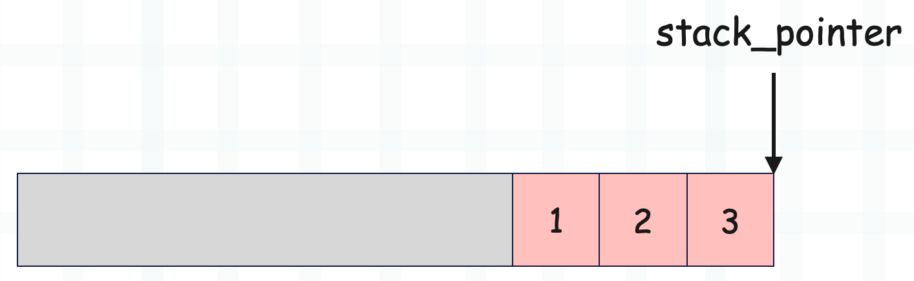

如果要将栈顶元素弹出，那么执行 <font color="blue">v = \*--stack_pointer</font> 即可。

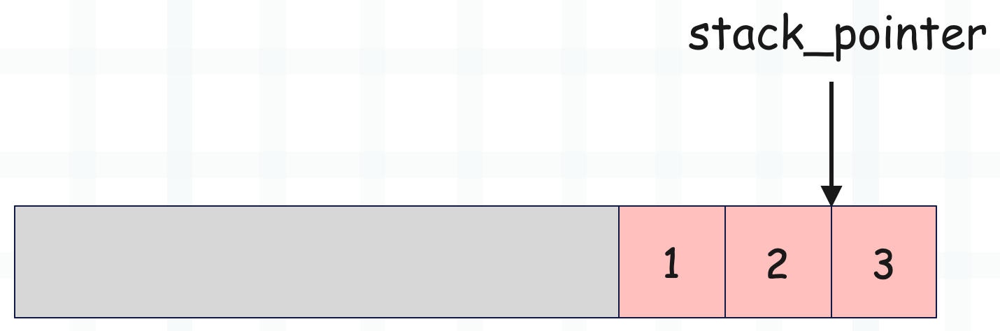

还是比较清晰的，不过还没结束，我们还要继续探讨运行时栈。

## 运行时栈的一些宏

相信你已经知道什么是运行时栈了，说白了它就是参数的容身之所，比如虚拟机在执行 a + b 的时候，通过指令和指令参数可以判断这是一个加法操作，但在执行加法的时候，加号两边的值要怎么获取呢？这时候就需要一个栈来专门保存相应的参数。在执行加法之前，先将 a 和 b 压入栈中，等执行加法的时候，再将 a 和 b 从栈里面弹出来即可，非常简单。

然后再来看看和运行时栈相关的一些宏，并加深对运行时栈的理解。

~~~C
// Python/ceval.c

#define STACK_LEVEL()     ((int)(stack_pointer - f->f_valuestack))
#define EMPTY()           (STACK_LEVEL() == 0)
#define TOP()             (stack_pointer[-1])
#define SECOND()          (stack_pointer[-2])
#define THIRD()           (stack_pointer[-3])
#define FOURTH()          (stack_pointer[-4])
#define PEEK(n)           (stack_pointer[-(n)])
#define SET_TOP(v)        (stack_pointer[-1] = (v))
#define SET_SECOND(v)     (stack_pointer[-2] = (v))
#define SET_THIRD(v)      (stack_pointer[-3] = (v))
#define SET_FOURTH(v)     (stack_pointer[-4] = (v))
#define SET_VALUE(n, v)   (stack_pointer[-(n)] = (v))
#define BASIC_STACKADJ(n) (stack_pointer += n)
#define BASIC_PUSH(v)     (*stack_pointer++ = (v))
#define BASIC_POP()       (*--stack_pointer)

#define PUSH(v)                BASIC_PUSH(v)
#define POP()                  BASIC_POP()
#define STACK_GROW(n)          BASIC_STACKADJ(n)
#define STACK_SHRINK(n)        BASIC_STACKADJ(-n)
#define EXT_POP(STACK_POINTER) (*--(STACK_POINTER))
~~~

宏还是比较多的，我们来逐一介绍。假设目前运行时栈内部有三个元素，从栈底到栈顶分别是整数 1、2、3，那么运行时栈的结构就是下面这样。

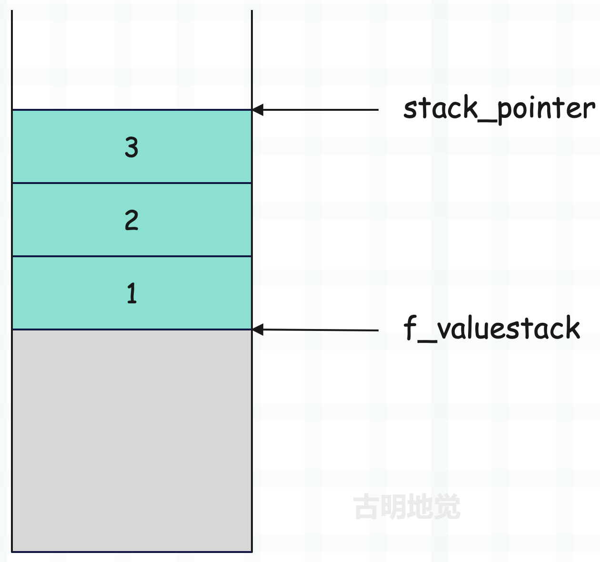

localsplus 数组被分成 4 个区域，运行时栈占据最后一个，因此图中的灰色区域便是运行时栈之前的内存。由于我们是研究运行时栈，所以这部分区域后续就不再画了。

然后看一下这些和运行时栈相关的宏都是干嘛的。

<font color="darkblue">**STACK_LEVEL()**</font>

返回运行时栈的元素个数，显然直接让栈顶指针和栈底指针相减就完事了。

~~~C
#define STACK_LEVEL()     ((int)(stack_pointer - f->f_valuestack))
~~~

所以 STACK_LEVEL() 是会动态变化的，因为 stack_pointer 会动态变化。

记得之前在介绍 PyCodeObject 时，我们说它内部的 co_stacksize 字段表示执行代码块所需要的<font color="blue">栈空间</font>，而这个栈空间就是运行时栈的长度。当然也可以理解为要想执行这段代码块，后续创建栈桢时，应该给 localsplus 数组中表示运行时栈的区域分配能存储多少个元素的内存。

比如 co_stacksize 是 1，那么表示应该给运行时栈分配能存储 1 个元素的内存，即运行时栈的长度为 1。

> STACK_LEVEL() 表示当前运行时栈已存储的元素数量，而 co_stacksize 表示运行时栈的长度，即最多能存储多少个元素。

我们通过反编译的方式，实际演示一下。

~~~Python
import dis

def some_func():
    a = 1
    b = 2
    c = 3

# 这里只保留字节码指令
dis.dis(some_func)
"""
LOAD_CONST     # 将元素压入运行时栈，栈里的元素个数为 1
STORE_FAST     # 将元素从栈顶弹出，栈里的元素个数为 0
LOAD_CONST     # 将元素压入运行时栈，栈里的元素个数为 1
STORE_FAST     # 将元素从栈顶弹出，栈里的元素个数为 0 
LOAD_CONST     # 将元素压入运行时栈，栈里的元素个数为 1 
STORE_FAST     # 将元素从栈顶弹出，栈里的元素个数为 0 
LOAD_CONST     # 将元素压入运行时栈，栈里的元素个数为 1
RETURN_VALUE   # 将元素从栈顶弹出，栈里的元素个数为 0
"""

# 也就是说，运行时栈只要能容纳一个元素，即可执行这段代码
print(some_func.__code__.co_stacksize)  # 1
~~~

我们再来看个例子。

~~~python
import dis

def some_func():
    a = 1
    b = 2
    c = 3
    lst = [a, b, c]

dis.dis(some_func)
"""
LOAD_CONST     # 将元素压入运行时栈，栈里的元素个数为 1 
STORE_FAST     # 将元素从栈顶弹出，栈里的元素个数为 0  
LOAD_CONST     # 将元素压入运行时栈，栈里的元素个数为 1   
STORE_FAST     # 将元素从栈顶弹出，栈里的元素个数为 0   
LOAD_CONST     # 将元素压入运行时栈，栈里的元素个数为 1   
STORE_FAST     # 将元素从栈顶弹出，栈里的元素个数为 0    

LOAD_FAST      # 将元素压入运行时栈，栈里的元素个数为 1
LOAD_FAST      # 将元素压入运行时栈，栈里的元素个数为 2   
LOAD_FAST      # 将元素压入运行时栈，栈里的元素个数为 3
BUILD_LIST     # 将栈里的三个元素弹出，构建列表并入栈（此时元素个数为 1）
STORE_FAST     # 将元素从栈顶弹出，栈里的元素个数为 0   
LOAD_CONST     # 将元素压入运行时栈，栈里的元素个数为 1
RETURN_VALUE   # 将元素从栈顶弹出，栈里的元素个数为 0
"""

# 不难看出，要想执行这段代码，运行时栈要能容纳 3 个元素
print(some_func.__code__.co_stacksize)  # 3
~~~

相信你现在应该理解 co_stacksize 的作用了，它表示运行时栈最多能容纳多少个元素，也就是运行时栈的长度。以上面代码为例，由于最多会压入 3 个元素，所以运行时栈的长度就是 3，即最多能容纳 3 个元素。并且这个长度在编译之后就已经确定了，因为可以通过遍历指令集静态计算出来。

我们画一张图描述一下上面的代码在执行时，运行时栈的变化过程。

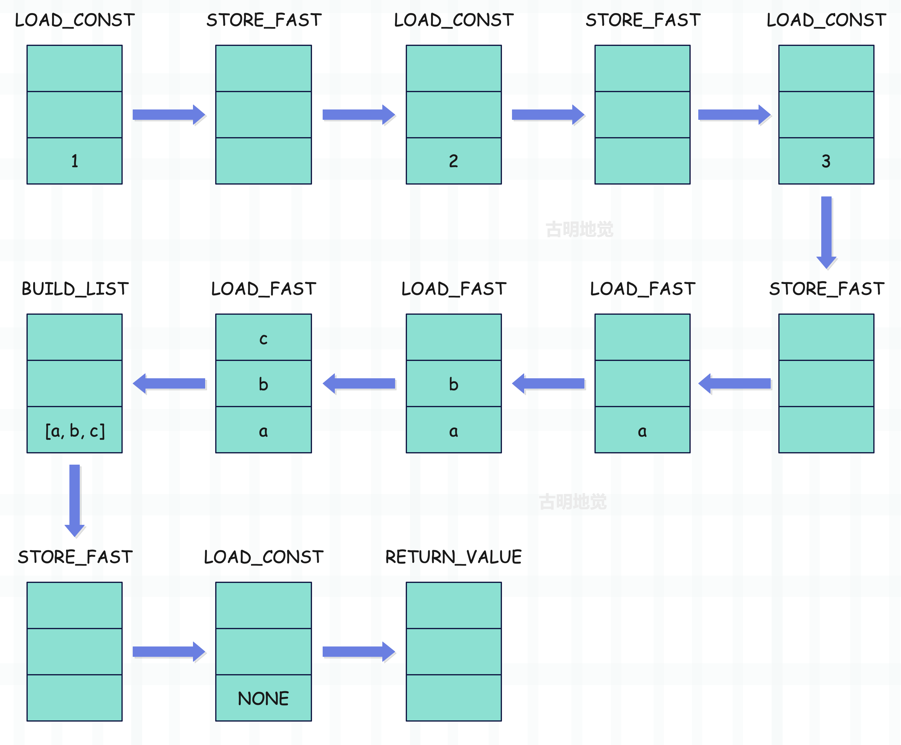

整个过程应该很清晰，当然上面只是运行时栈的变化，localsplus 中存储局部变量的内存区域也在变化。另外如果代码块位于全局作用域，那么变化的就是全局名字空间，相关细节后续详细展开。

<font color="darkblue">**EMPTY()**</font>

~~~c
#define EMPTY()           (STACK_LEVEL() == 0)
~~~

判断运行时栈是否为空，显然只需判断运行时栈的元素个数是否为 0 即可。

<font color="darkblue">**TOP()**</font>

~~~C
#define TOP()             (stack_pointer[-1])
~~~

查看当前运行时栈的栈顶元素。

<font color="darkblue">**SECOND()**</font>

~~~C
#define SECOND()          (stack_pointer[-2])
~~~

查看从栈顶元素开始的第二个元素。

<font color="darkblue">**THIRD()**</font>

```C
#define THIRD()           (stack_pointer[-3])
```

查看从栈顶元素开始的第三个元素。

<font color="darkblue">**FOURTH()**</font>

~~~C
#define FOURTH()          (stack_pointer[-4])
~~~

查看从栈顶元素开始的第四个元素。

<font color="darkblue">**PEEK(n)**</font>

~~~C
#define PEEK(n)           (stack_pointer[-(n)])
~~~

查看从栈顶元素开始的第 n 个元素。

<font color="darkblue">**SET_TOP(v)**</font>

~~~C
#define SET_TOP(v)        (stack_pointer[-1] = (v))
~~~

将当前运行时栈的栈顶元素设置成 v。

<font color="darkblue">**SET_SECOND(v)**</font>

~~~c
#define SET_SECOND(v)     (stack_pointer[-2] = (v))
~~~

将从栈顶元素开始的第二个元素设置成 v。

<font color="darkblue">**SET_THIRD(v)**</font>

~~~c
#define SET_THIRD(v)      (stack_pointer[-3] = (v))
~~~

将从栈顶元素开始的第三个元素设置成 v。

<font color="darkblue">**SET_FOURTH(v)**</font>

~~~C
#define SET_FOURTH(v)     (stack_pointer[-4] = (v))
~~~

将从栈顶元素开始的第四个元素设置成 v。

<font color="darkblue">**SET_VALUE(n, v)**</font>

~~~C
#define SET_VALUE(n, v)   (stack_pointer[-(n)] = (v))
~~~

将从栈顶元素开始的第 n 个元素设置成 v。

<font color="darkblue">**PUSH(v)**</font>

~~~C
#define PUSH(v)           BASIC_PUSH(v)
#define BASIC_PUSH(v)     (*stack_pointer++ = (v))
~~~

往运行时栈中压入一个元素，并且压入之后，栈中已存储的元素个数一定不超过 co_stacksize。假设当前栈里有一个元素 1，然后添加一个元素 2。

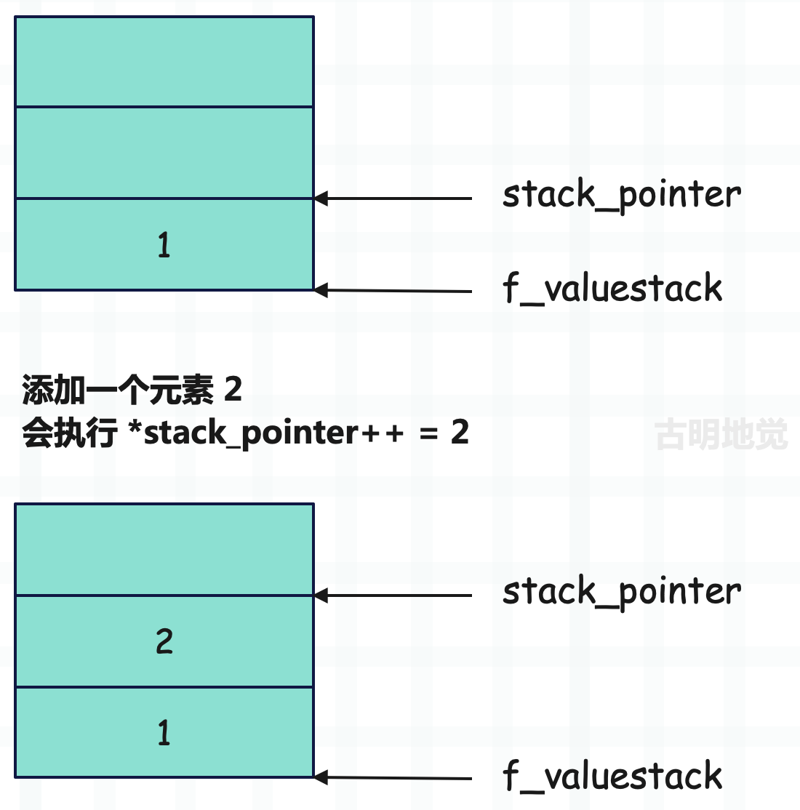

Python 的变量都是一个指针，所以 stack_pointer 是一个二级指针，它永远指向栈顶位置，只不过栈顶位置会变。另外要注意：运行时栈的内存一开始就申请好了，初始状态下，里面的元素全部为 NULL。而往栈里面压入一个元素，其实就是修改 stack_pointer 指向的内存单元，然后执行 stack_pointer\+\+。

<font color="darkblue">**POP()**</font>

~~~C
#define POP()             BASIC_POP()
#define BASIC_POP()       (*--stack_pointer)
~~~

弹出栈顶元素，注意它和 TOP 的区别，TOP 是返回栈顶元素，但不弹出。

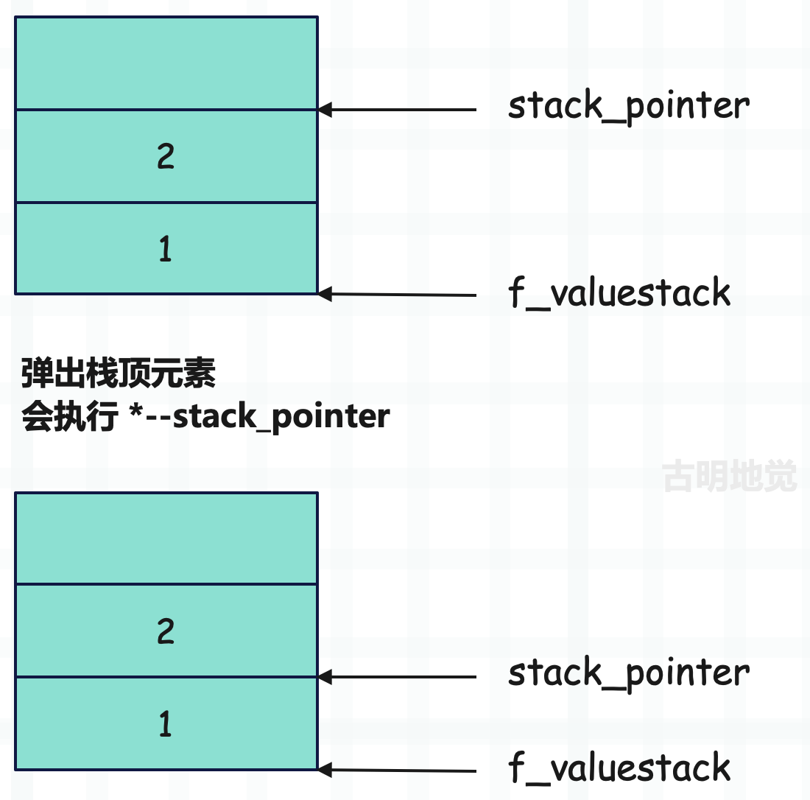

stack_pointer 指向栈顶位置，所以它向栈底移动一个位置，就相当于元素被弹出了。

关于<font color="blue">弹出元素</font>需要做一个说明，所谓弹出元素本质上就是将 stack_pointer 向栈底移动一个位置。我们看一下上图，一开始栈里面有两个元素，分别是整数 1 和整数 2，当然准确来说应该是指向它们的指针，但为了描述方便，我们就用对象本身代替了。

然后执行 POP()，将整数 2 弹出，但我们发现 POP() 之后，整数 2 还在栈里面。关于这一点很好理解，因为 stack_pointer 始终指向栈顶位置，而它向栈底移动了一个位置，那么整数 2 就已经不是栈顶元素了。当下一个元素入栈时，会把整数 2 替换掉。因此虽然整数 2 还在运行时栈里面，但和不在没有任何区别，此时我们依旧认为整数 2 被弹出了。

不过在后续的文章中，在画运行时栈的时候，我们也会这么画。

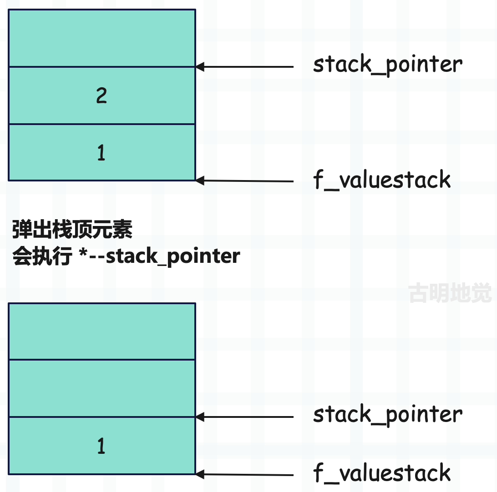

为了阅读清晰，stack_pointer 之后的元素就不写了。另外还要注意一点，运行时栈的内存一开始就已经申请好了，是固定的，弹出元素只是改变栈顶指针 stack_pointer 的指向，而内存区域的大小是不变的。

当然这些内容都比较简单，但为了避免出现歧义，这里单独解释一下。

<font color="darkblue">**STACK_GROW(n)**</font>

~~~C
#define STACK_GROW(n)          BASIC_STACKADJ(n)
#define BASIC_STACKADJ(n)      (stack_pointer += n)
~~~

改变运行时栈的栈顶，注：运行时栈的大小是固定的，但栈顶是由 stack_pointer 决定的。

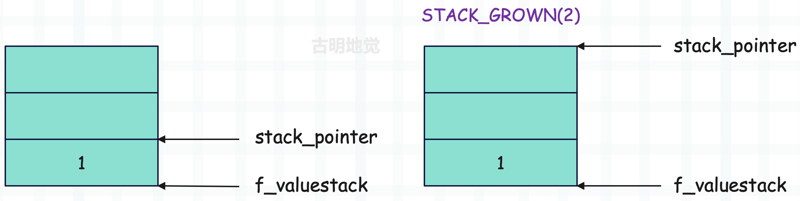

那么问题来了，假设要往运行时栈压入两个元素，分别是 2、3，该怎么做呢？首先肯定可以通过 PUSH 实现。

~~~C
PUSH(2);
PUSH(3);
~~~

但如果不让你用 PUSH，该怎么做呢？

~~~c
STACK_GROW(2);
// 设置元素
SET_VALUE(1, 3);  // stack_pointer[-1] = 3
SET_VALUE(2, 2);  // stack_pointer[-2] = 2
~~~

两种做法都是可以的。

<font color="darkblue">**STACK_SHRINK(n)**</font>

~~~c
#define STACK_SHRINK(n)        BASIC_STACKADJ(-n)
#define BASIC_STACKADJ(n)      (stack_pointer += n)
~~~

它的作用和 STACK_GROWN 正好相反。

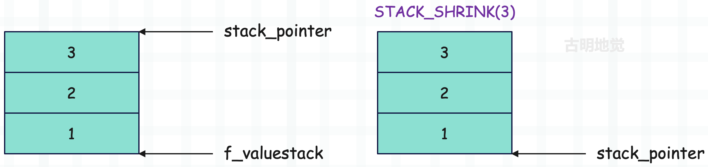

注意：STACK_SHRINK(3) 之后，stack_pointer 和 f_valuestack 都指向了运行时栈的栈底，同时也是栈顶。还是之前说的，栈空间是固定的，但栈顶会随着元素的入栈和出栈而动态变化。

另外，对于当前示例来说，如果你不关注栈里的元素的话，那么执行 STACK_SHRINK(3) 和执行三次 POP() 是等价的。当然不管是哪种情况，最终栈里的元素都还是 1、2、3，因为弹出元素只是改变栈顶指针 stack_pointer 的指向，而不会修改栈里的元素。当然啦，既然栈顶是由 stack_pointer 决定的，而它目前指向了栈底位置，所以我们可以认为此时栈是空的。

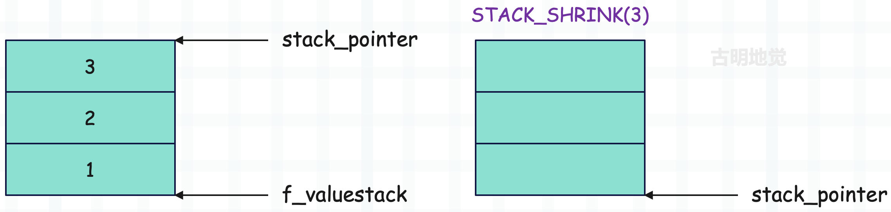

这么画似乎更清晰一些，但我们要知道这背后的整个过程。另外还要再次强调，运行时栈只是数组 f_localsplus 的一部分，并且是最后一部分，所以它的内存空间事先就申请好了，里面的每个元素都是 NULL。所谓添加元素，就是修改 stack_pointer 指针指向的内存，然后 stack_pointer++。所谓弹出元素，就是 stack_pointer--，然后返回 stack_pointer 指向的内存。

以上就是运行时栈的一些宏，后续阅读源码的时候，会经常遇到。

## 小结

本篇文章我们就从宏观的角度介绍了虚拟机执行字节码的流程，说白了虚拟机就是把自己当成一个 CPU，在栈桢中执行指令。通过遍历字节码指令集，对不同的指令执行不同的处理逻辑。

然后是运行时栈，因为一个指令只能带一个参数，那么剩余的参数就需要通过运行时栈给出。比如 LOAD_CONST 指令，它在加载完常量之后，会将常量压入运行时栈，然后 STORE_NAME 或 STORE_FAST 指令再将常量从运行时栈的顶部弹出，并和某个符号（变量）绑定起来。

> 关于这些指令，我们后面会详细说。

最后我们介绍了运行时栈的一些宏，因为执行指令的时候会反复操作运行时栈，所以底层封装了很多的宏。

-----

&nbsp;

**欢迎大家关注我的公众号：古明地觉的编程教室。**


**如果觉得文章对你有所帮助，也可以请作者吃个馒头，Thanks♪(･ω･)ﾉ。**

