## 楔子

上一篇文章我们介绍了虚拟机是怎么执行字节码指令的，并且还介绍了运行时栈，以及操作运行时栈的一些宏。相信你对字节码执行的整个流程应该有了清晰的认识，那么接下来我们就深入到源码中，进一步考察执行过程。

## 源码解析字节码指令的执行过程

之前说了，虚拟机就是把自己当成一个 CPU，在栈帧中执行字节码，面对不同的字节码指令，执行不同的处理逻辑。

具体实现由 Python/ceval.c 中的 _PyEval_EvalFrameDefault 函数负责，该函数超级长，并且里面还包含了大量的宏，这些宏完全可以定义在其它的文件中。像我们之前介绍的操作运行时栈的宏，也定义在 _PyEval_EvalFrameDefault 函数里面了。所以为了方便大家理解，我决定先介绍里面出现的宏，等宏说完了之后再看具体的逻辑。

~~~C
#ifdef HAVE_COMPUTED_GOTOS
    #ifndef USE_COMPUTED_GOTOS
    #define USE_COMPUTED_GOTOS 1
    #endif
#else
    #if defined(USE_COMPUTED_GOTOS) && USE_COMPUTED_GOTOS
    #error "Computed gotos are not supported on this compiler."
    #endif
    #undef USE_COMPUTED_GOTOS
    #define USE_COMPUTED_GOTOS 0
#endif

// 如果使用 "计算跳转"，导入静态跳转表
#if USE_COMPUTED_GOTOS
/* Import the static jump table */
#include "opcode_targets.h"
~~~

里面出现了一个关键词：计算跳转，这是什么意思呢？

首先 _PyEval_EvalFrameDefault（后续简称为帧评估函数）的代码量虽然很大，但它的核心不难理解，就是循环遍历字节码指令集，处理每一条指令。而当一条指令执行完毕时，虚拟机会有以下三种动作之一：

- 停止循环、退出帧评估函数，当执行的指令为 RETURN_VALUE、YIELD_VALUE 等。
- 执行指令的过程中出错了，比如执行 GET_ITER 指令，但对象不具备可迭代的性质。那么要进行异常处理（或者直接抛出异常），然后退出帧评估函数。
- 执行下一条指令。

前面两种动作没啥好说的，关键是第三种，如何执行下一条指令。首先虚拟机内部有一个巨型的 switch 语句，伪代码如下：

~~~c
int opcode;
int oparg;

for (;;) {
    // 循环遍历指令集，获取指令和指令参数
    opcode = ...;  // 指令
    oparg = ...;  // 指令参数
    // 执行对应的处理逻辑
    switch (opcode) {
        case LOAD_CONST:
            处理逻辑;
        case LOAD_FAST:
            处理逻辑;
        case LOAD_FAST:
            处理逻辑;
        case BUILD_LIST: 
            处理逻辑;
        case DICT_UPDATE: 
            处理逻辑;
        // ...
    }
}
~~~

一个 case 分支，对应一个字节码指令的实现，由于指令非常多，所以这个 switch 语句也非常庞大。然后遍历出的指令，会进入这个 switch 语句进行匹配，执行相应的处理逻辑。所以循环遍历 co_code 得到字节码指令，然后交给内部的 switch 语句、执行匹配到的 case 分支，如此周而复始，最终完成了对整个 Python 程序的执行。

其实到这里，你应该已经了解了帧评估函数的整体结构。说白了就是将自己当成一个 CPU，在栈帧中执行一条条指令，而执行过程中所依赖的常量、变量等，则由栈帧的其它字段来维护。因此在虚拟机的执行流程进入了那个巨大的 for 循环，并取出第一条字节码指令交给里面的 switch 语句之后，第一张多米诺骨牌就已经被推倒，命运不可阻挡的降临了。一条接一条的指令如同潮水般涌来，浩浩荡荡，横无际涯。

虽然在概念上很好理解，但很多细节被忽略掉了，本篇文章就将它们深挖出来。还是之前的问题，当一个指令执行完毕时，怎么执行下一条指令。

估计有人对这个问题感到奇怪，在 case 分支的内部加一行 continue 进行下一轮循环不就行了吗？没错，这种做法是行得通的，但存在性能问题。因为 continue 会跳转到 for 循环所在位置，所以遍历出下一条指令之后，会再次进入 switch 语句进行匹配。尽管逻辑上是正确的，但 switch 里面有数百个 case 分支，如果每来一个指令，都要顺序匹配一遍的话，那么效率必然不高。

而事实上整个字节码指令集是已知的，所以不管执行哪个指令，我们都可以提前得知它的下一个指令，只需将指针向后偏移两个字节即可。

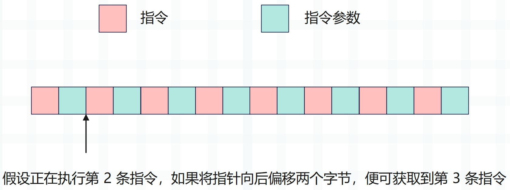

那么问题来了，既然知道下一条要执行的指令是什么，那么在当前指令执行完毕时，可不可以直接跳转到下一条指令对应的 case 分支中呢？

答案是可以的，这个过程就叫做计算跳转，通过标签作为值即可实现。关于什么是标签作为值，我们用一段 C 代码解释一下。

~~~C
#include <stdio.h>

void label_as_value(int jump) {
    int num = 4;
    void *label;
    switch (num) {
        case 1:
            printf("%d\n", 1);
            break;
        // 在 case 2 分支里面定义了一个标签叫 two
        case 2: two: {
            printf("%d\n", 2);
            break;
        }
        // 在 case 3 分支里面定义了一个标签叫 three
        case 3: three: {
            printf("%d\n", 3);
            break;
        }
        case 4:
            printf("%d\n", 4);
            // 如果参数 jump 等于 2，保存 two 标签的地址
            // 如果参数 jump 等于 3，保存 three 标签的地址
            if (jump == 2) label = &&two;
            else if (jump == 3) label = &&three;
            // 跳转到指定标签
            goto *label;
        default:
            break;
    }
}

int main() {
    label_as_value(2);
    // 4
    // 2
    label_as_value(3);
    // 4
    // 3
}
~~~

由于变量 num 等于 4，所以会进入 case 4 分支，在里面有一个 goto \*label。如果你对 C 不是特别熟悉的话，估计会有些奇怪，觉得不应该是  goto label 吗？如果是 goto label，那么需要显式地定义一个名为 label 的标签，但这里并没有。我们的目的是跳转到 two 标签或 three 标签，具体跳转到哪一个，则由参数控制。因此可以使用 \&\& 运算符，这是 GCC 的一个扩展特性，叫做标签作为值，它允许我们获取标签的地址作为一个值。

所以在开头声明了一个 void *label，然后让 label 保存标签地址，再通过 goto \*label 跳转到指定标签。由于 \*label 代表哪个标签是在运行时经过计算才能知晓，因此称为计算跳转（在运行时动态决定跳转目标）。

> 注意：`goto *&&标签名` 属于高级的、非标准的 C 语言用法。

那么毫无疑问，解释器也一定为处理指令的 case 分支定义了相应的标签，并拿到了这些标签的地址。没错，这些标签地址位于 Python/opcode_targets.h 中，这个 opcode_targets.h 就是上面的帧评估函数导入的头文件。

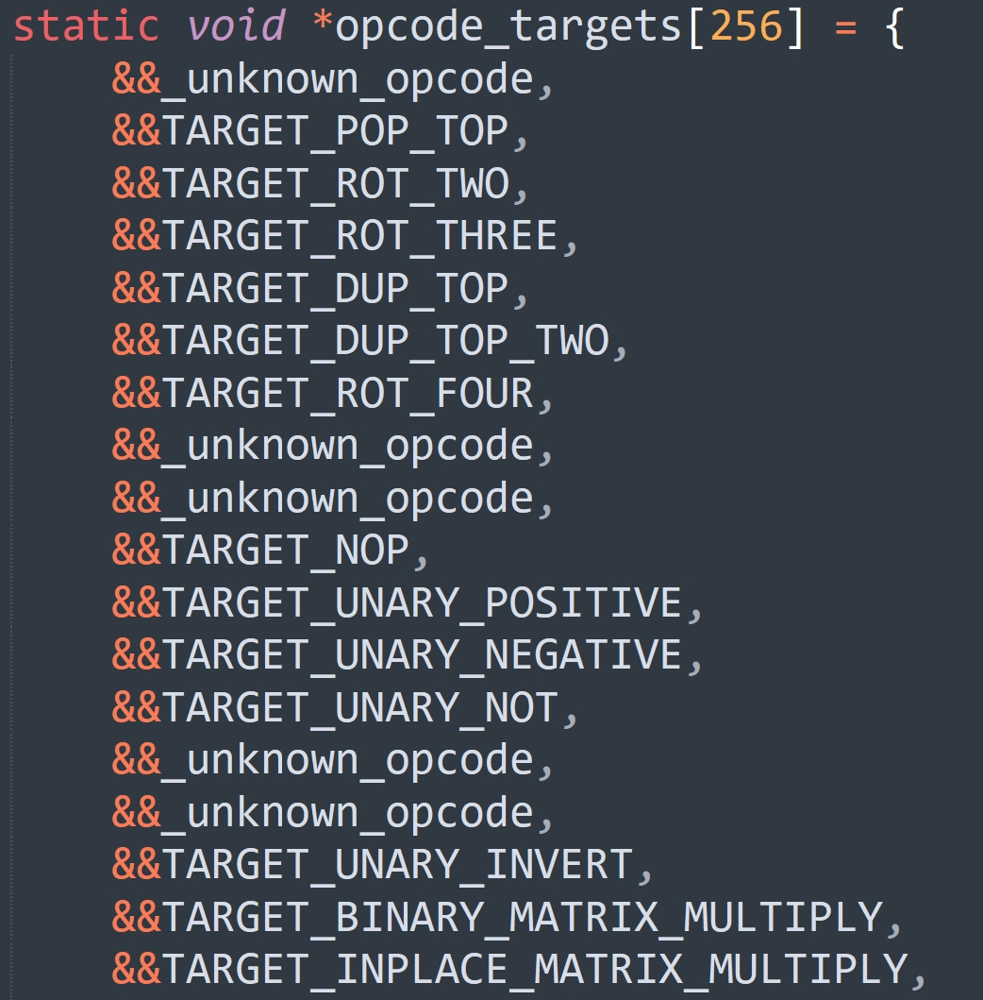

每个指令的处理逻辑都会对应一个标签，这些标签的地址全部保存在了数组中，执行帧评估函数时导入进来即可。这里可能有人会问，导入数组时，它里面的标签都还没有定义吧。确实如此，不过没关系，对于 C 来说，标签只要定义了，那么它在函数的任何一个位置都可以使用。

假设要执行的下一条指令为 opcode，那么就会跳转到 \*opcode_targets[opcode]，因此我们有理由相信，指令和 opcode_targets 数组的索引之间存在某种关联。而这种关联也很好想，opcode_targets[opcode] 指向的标签，其内部的逻辑就是用来处理 opcode 指令的，我们来验证一下。

~~~C
#define LOAD_CONST              100
#define LOAD_NAME               101
~~~

比如 LOAD_CONST 的值为 100，那么 opcode_targets[100] 肯定会指向 TARGET_LOAD_CONST 标签；LOAD_NAME 的值为 101，那么 opcode_targets[101] 肯定会指向 TARGET_LOAD_NAME 标签。

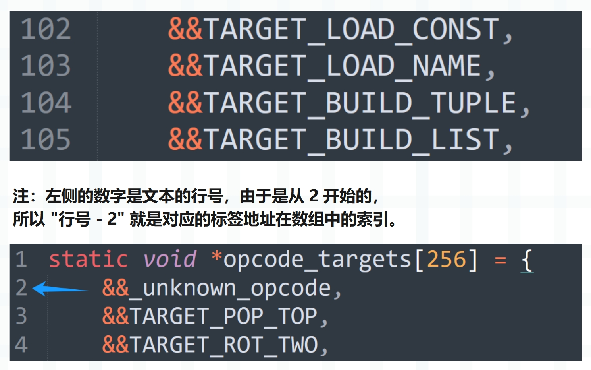

结果没有问题，其它指令也是一样的，通过计算跳转，可以直接 goto 到指定的标签。

好，我们总结一下，首先帧评估函数内部有一个巨型的 switch，每一个指令的处理逻辑都对应一个 case 分支，由于指令有一百多个，所以 case 分支也有一百多个。而当指令进入 switch 后，显然会顺序匹配这一百多个 case 分支，找到符合条件的那一个。

整个过程的逻辑是没问题的，但效率上还可以更进一步优化，因为整个字节码指令集是已知的，既然都提前知道了下一条待处理的指令是什么，那完全可以直接跳转到对应的 case 分支中。所以每个 case 分支都会对应一个标签，我们看一下源码。

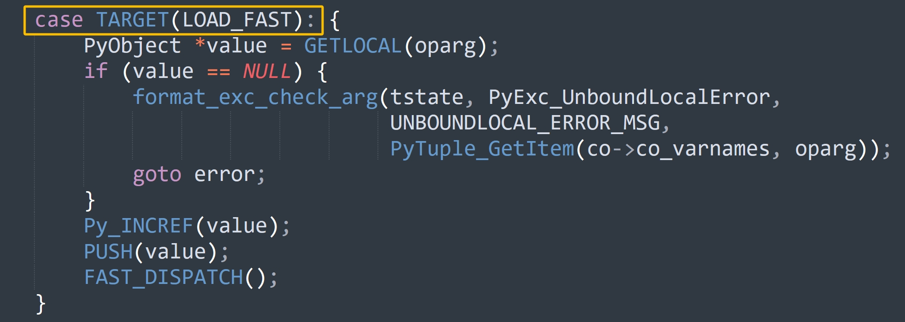

这个 TARGET 是一个宏，也定义在帧评估函数中。

~~~C
#define TARGET(op) \
    op: \
    TARGET_##op

// 所以 case TARGET(LOAD_CONST): 展开之后就会变成
// case LOAD_CONST: TARGET_LOAD_CONST:
~~~

所以在指令的名称前加一个 TARGET\_ 就是对应的标签，比如下一条要执行的指令是 YIELD_VALUE，它等于 86，那么 `opcode_targets[86]` 就等于 &&TARGET_YIELD_VALUE，指向的标签内部便是 YIELD_VALUE 的处理逻辑，至于其它指令也是同理。

因此读取完下一条指令之后，就不用跳转到开头重新走一遍 switch 了。而是将指令作为索引，从 opcode_targets 拿到标签地址直接跳转即可，并且跳转后的标签内部的逻辑就是用来处理该指令的。

**所以底层为每个指令的处理逻辑都定义了一个标签，而标签的地址在数组中的索引，和要处理的指令本身是相等的。**

不过要想实现计算跳转，需要 GCC 支持标签作为值这一特性，即 goto \*标签地址，至于标签地址是哪一个标签的地址，则在运行时动态计算得出。比如 opcode_targets[opcode] 指向哪个标签无从得知，这取决于 opcode 的值。

> `goto 标签`：静态跳转，标签需要显式地定义好，跳转位置在编译期间便已经固定。
>
> `goto *标签地址`：动态跳转（计算跳转），跳转位置不固定，可以是已有标签中的任意一个。至于具体是哪一个，需要在运行时经过计算才能确定。

以上就是计算跳转，我们继续往下说。

~~~C
// 如果使用了计算跳转
#define FAST_DISPATCH() \
    { \
        if (!_Py_TracingPossible(ceval) && !PyDTrace_LINE_ENABLED()) { \
            f->f_lasti = INSTR_OFFSET();   /* 将当前指令的偏移量赋值给 f_lasti */ \
            NEXTOPARG();                   /* 获取下一条指令 */ \
            goto *opcode_targets[opcode];  /* 跳转到对应的标签中 */ \
        } \
        goto fast_next_opcode; \
    }

#define DISPATCH() \
    { \
        if (!_Py_atomic_load_relaxed(eval_breaker)) { \
            FAST_DISPATCH(); \
        } \
        continue; \
    }

#define TARGET(op) \
    op: \
    TARGET_##op

// 如果不使用计算跳转
#define TARGET(op) op
#define FAST_DISPATCH() goto fast_next_opcode
#define DISPATCH() continue
~~~

每条指令在执行的最后，都会调用 DISPATCH() 或 FAST_DISPATCH()，我们看一下源码。

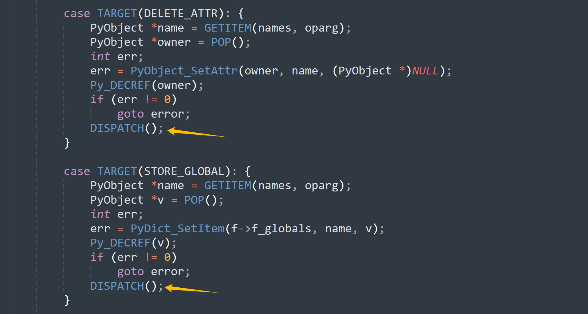

如果不使用计算跳转，那么 DISPATCH() 就等价于 continue，直接进行下一轮 for 循环，然后进入 switch。而 FAST_DISPATCH() 会跳转到 fast_next_opcode 标签，该标签定义在 for 循环的里面，switch 的外面，所以它虽然不用从 for 循环的位置开始执行，但依然要走一遍完整的 switch。另外由于不使用计算跳转，那么 case 分支里的标签也就没意义了，所以 case TARGET(op) 就等价于 case op。

如果使用计算跳转，那么就是之前说的那样，在指令执行完之后（并且没有中断请求）会调用 NEXTOPARG() 获取下一条指令，然后通过 goto \*opcode_targets[opcode] 实现计算跳转，直接跳到下一条指令对应的 case 分支中，从而省去了匹配的时间。

好，我们继续往下看。

~~~C
// 获取元组 v 中索引为 i 的元素
#define GETITEM(v, i) PyTuple_GetItem((v), (i))

/* 在遍历字节码指令序列时，会用到以下两个变量
 * first_instr：永远指向字节码指令序列的第一条指令
 * next_instr：永远指向下一条待执行（或正在执行）的字节码指令
 * 另外由于每条字节码指令都会带有一个参数
 * 所以 first_instr 和 next_instr 的类型都是 _Py_CODEUNIT *，即 uint16_t *
 * 其中前 8 位表示指令，后 8 位表示指令参数
 */

// 在调用 NEXTOPARG() 之前，next_instr 指向正在执行的字节码指令
// 如果调用了 NEXTOPARG()，那么 next_instr 就会指向下一条待执行的字节码指令
// 该宏计算的显然就是它和第一条指令（或者说字节码指令序列的起始位置）之间的偏移量
#define INSTR_OFFSET()  \
    (sizeof(_Py_CODEUNIT) * (int)(next_instr - first_instr))

// 获取 next_instr 指向的 uint16 的前 8 位和后 8 位，也就是拿到指令和指令参数
// 然后执行 next_instr++
#define NEXTOPARG()  do { \
        _Py_CODEUNIT word = *next_instr; \
        opcode = _Py_OPCODE(word); \
        oparg = _Py_OPARG(word); \
        next_instr++; \
    } while (0)
~~~

通过 INSTR_OFFSET 和 NEXTOPARG，我们介绍了两个指针变量：first_instr 和 next_instr，虚拟机就是通过它们来完成遍历的。

~~~C
#define JUMPTO(x)       (next_instr = first_instr + (x) / sizeof(_Py_CODEUNIT))
#define JUMPBY(x)       (next_instr += (x) / sizeof(_Py_CODEUNIT))
~~~

这两个指令等到介绍 if 控制流的时候再说，不过相信你也能猜到它是做什么的，if 控制流的某个分支如果不满足条件，就会跳到下一个分支。而这个跳转过程是怎么实现的呢？显然要借助于这里的 JUMPTO 和 JUMPBY。

~~~C
// 指令预测
#if defined(DYNAMIC_EXECUTION_PROFILE) || USE_COMPUTED_GOTOS
#define PREDICT(op)             if (0) goto PRED_##op
#else
#define PREDICT(op) \
    do{ \
        _Py_CODEUNIT word = *next_instr; \
        opcode = _Py_OPCODE(word); \
        if (opcode == op){ \
            oparg = _Py_OPARG(word); \
            next_instr++; \
            goto PRED_##op; \
        } \
    } while(0)
#endif
#define PREDICTED(op)           PRED_##op:
~~~

PREDICT 宏和指令预测相关，后续介绍 if 控制流的时候再说。

关于宏就说到这里，至于剩下的一些宏，暂时就先不用看了，我们在后续的部分才会用到它们。

好，既然宏说完了，接下来我们可以看整个帧评估函数都做些什么了，代码有删减。

~~~C
PyObject* _Py_HOT_FUNCTION
_PyEval_EvalFrameDefault(PyFrameObject *f, int throwflag)
{
    // 初始化一些变量，它们的含义等赋值的时候再说
    PyObject **stack_pointer;
    const _Py_CODEUNIT *next_instr;
    int opcode;
    int oparg;
    PyObject **fastlocals, **freevars;
    PyObject *retval = NULL;
    _PyRuntimeState * const runtime = &_PyRuntime;
    PyThreadState * const tstate = _PyRuntimeState_GetThreadState(runtime);
    struct _ceval_runtime_state * const ceval = &runtime->ceval;
    _Py_atomic_int * const eval_breaker = &ceval->eval_breaker;
    PyCodeObject *co;
    int instr_ub = -1, instr_lb = 0, instr_prev = -1;
    const _Py_CODEUNIT *first_instr;
    PyObject *names;
    PyObject *consts;
    _PyOpcache *co_opcache;
    
    // ...
    // 省略了一堆的宏定义，就是我们上面刚介绍的
    // ...
    
    // 检查是否超过递归深度限制
    if (Py_EnterRecursiveCall(""))
        return NULL;
    // tstate->frame 保存当前正在执行的栈桢，所以将 f 赋值给 tstate->frame
    // 至于之前的 tstate->frame，则保存在 f.f_back 字段中（在创建栈桢 f 的时候就完成了）
    tstate->frame = f;
    
    // 如果启用追踪机制
    if (tstate->use_tracing) {
        // tstate->c_tracefunc 对应 Python 里的 sys.settrace
        // 如果不为空，那么进行调用
        // 该函数可以监控每行代码的执行，因此一般用于调试器
        if (tstate->c_tracefunc != NULL) {
            if (call_trace_protected(tstate->c_tracefunc,
                                     tstate->c_traceobj,
                                     tstate, f, PyTrace_CALL, Py_None)) {
                goto exit_eval_frame;
            }
        }
        // tstate->c_profilefunc 对应 Python 里的 sys.setprofile
        // 如果不为空，那么进行调用，该函数主要用于性能分析
        if (tstate->c_profilefunc != NULL) {
            if (call_trace_protected(tstate->c_profilefunc,
                                     tstate->c_profileobj,
                                     tstate, f, PyTrace_CALL, Py_None)) {
                goto exit_eval_frame;
            }
        }
    }
    // DTrace 是一个强大的动态追踪工具
    // 这里检测是否启用了 DTrace 的函数入口探针
    if (PyDTrace_FUNCTION_ENTRY_ENABLED())
        // 如果启用了 DTrace，则记录函数进入的事件
        dtrace_function_entry(f);
    
    // 获取栈桢内部的关键字段
    co = f->f_code;
    names = co->co_names;
    consts = co->co_consts;
    fastlocals = f->f_localsplus;    
    freevars = f->f_localsplus + co->co_nlocals;
    assert(PyBytes_Check(co->co_code));
    assert(PyBytes_GET_SIZE(co->co_code) <= INT_MAX);
    assert(PyBytes_GET_SIZE(co->co_code) % sizeof(_Py_CODEUNIT) == 0);
    assert(_Py_IS_ALIGNED(PyBytes_AS_STRING(co->co_code), sizeof(_Py_CODEUNIT)));
    // 注意这里的 first_instr，上面已经介绍了，它指向字节码指令序列的起始位置，或者说第一条指令
    first_instr = (_Py_CODEUNIT *) PyBytes_AS_STRING(co->co_code);
    assert(f->f_lasti >= -1);
    // 初始状态下，next_instr 和 first_instr 相等
    next_instr = first_instr;
    if (f->f_lasti >= 0) {
        assert(f->f_lasti % sizeof(_Py_CODEUNIT) == 0);
        next_instr += f->f_lasti / sizeof(_Py_CODEUNIT) + 1;
    }
    stack_pointer = f->f_stacktop;
    assert(stack_pointer != NULL);
    f->f_stacktop = NULL;
    f->f_executing = 1;
    
// 进入主循环，在这个 for 循环里面一会儿就会看到那个巨型的 switch    
main_loop:
    // 遍历字节码指令集，处理每一条指令
    for (;;) {
        // stack_pointer 是栈顶指针，f_valuestack 是栈底指针
        // 由于 Python 的运行时栈是基于数组实现的，所以从栈底到栈顶，地址是增大的
        // 因此 stack_pointer 一定大于等于 f_valuestack
        assert(stack_pointer >= f->f_valuestack);
        // STACK_LEVEL() 一定小于等于运行时栈的长度，之前说过的
        assert(STACK_LEVEL() <= co->co_stacksize);
        // 线程状态对象里面没有异常产生
        assert(!_PyErr_Occurred(tstate));
        
        // 检测是否有待处理的中断（比如信号、GIL 释放请求等）
        if (_Py_atomic_load_relaxed(eval_breaker)) {
            opcode = _Py_OPCODE(*next_instr);
            /* 如果指令是以下之一，那么忽略中断，直接跳到 fast_next_opcode 标签进行处理
             *     SETUP_FINALLY：try / finally 语句的开始
             *     SETUP_WITH：with 语句的开始
             *     BEFORE_ASYNC_WITH：async with 语句的开始
             *     YIELD_FROM：yield from 表达式
             */
            // 这种设计主要是为了确保在某些关键操作（如资源管理、异常处理、异步操作）的开始阶段不被中断信号打断
            // 从而保证这些操作的正确性和可靠性，进而保证 Python 程序的稳定性和可预测性
            if (opcode == SETUP_FINALLY ||
                opcode == SETUP_WITH ||
                opcode == BEFORE_ASYNC_WITH ||
                opcode == YIELD_FROM) {
                goto fast_next_opcode;
            }
            // 使用原子操作检查是否有待处理的信号
            // 如果有待处理的信号，那么调用 handle_signals 函数处理它们
            // 这个机制允许 Python 程序响应外部事件和系统信号，同时保证执行的正确性
            if (_Py_atomic_load_relaxed(&ceval->signals_pending)) {
                if (handle_signals(runtime) != 0) {
                    goto error;
                }
            }
            // 通过原子操作检查是否有待处理的调用需要执行，calls_to_do 是一个计数器，表示待处理的调用的数量
            // 如果有待处理的调用，那么执行 make_pending_calls 函数
            // pending calls 主要用于垃圾回收（GC）、异步 IO 回调、定时器事件等
            // 这个机制是 Python 运行时系统的重要组成部分，允许虚拟机在主循环中处理各种异步任务和周期性任务
            // 确保各种后台任务能够得到及时处理，并且不需要使用额外的线程和复杂的调度机制
            if (_Py_atomic_load_relaxed(&ceval->pending.calls_to_do)) {
                if (make_pending_calls(runtime) != 0) {
                    goto error;
                }
            }
            // 通过原子操作检查是否有释放 GIL 的请求，如果有，那么该线程就要释放 GIL
            if (_Py_atomic_load_relaxed(&ceval->gil_drop_request)) {
                // 将当前线程状态设置为 NULL，因为要发生切换了（关于 GIL，后续会单独介绍）
                if (_PyThreadState_Swap(&runtime->gilstate, NULL) != tstate) {
                    Py_FatalError("ceval: tstate mix-up");
                }
                // 释放 GIL，给其它线程一个机会，不能让某一个线程一直霸占着
                // 如果开启了多线程，那么当释放 GIL 的那一刻，就会被其它线程获取
                drop_gil(ceval, tstate);
                // GIL 释放之后，还要再次获取，但 GIL 已经被其它线程拿走了
                // 所以会触发操作系统内核的线程调度机制，进入阻塞状态，等待 GIL 再度回到自己手中
                // 因此不难发现，如果有 n 个线程，那么其中的 n - 1 个会陷入阻塞，等待获取 GIL
                // 而一旦持有 GIL 的线程执行了 drop_gil 函数，将 GIL 释放了
                // 那么这 n - 1 个线程当中就会有一个线程拿到 GIL 并解除阻塞，然后开始执行字节码
                // 至于释放 GIL 的线程，则会尝试再次获取 GIL，但会因为获取不到而陷入阻塞（已经被其它线程拿走了）
                take_gil(ceval, tstate);
                // 检查是否需要快速退出线程（比如在解释器关闭时）
                exit_thread_if_finalizing(runtime, tstate);
                // 到这里说明 take_gil 返回了（即阻塞状态解除），也意味着拿到了 GIL，那么要恢复线程状态
                if (_PyThreadState_Swap(&runtime->gilstate, tstate) != NULL) {
                    Py_FatalError("ceval: orphan tstate");
                }
            }
            // 检测线程状态中是否存在异步的异常
            if (tstate->async_exc != NULL) {
                PyObject *exc = tstate->async_exc;
                tstate->async_exc = NULL;
                UNSIGNAL_ASYNC_EXC(ceval);
                _PyErr_SetNone(tstate, exc);
                Py_DECREF(exc);
                goto error;
            }
        }

    // 以上是一些中断检测逻辑，如果执行顺利，那么会走到这里
    fast_next_opcode:
        // 保存上一条已执行完毕的字节码的偏移量
        f->f_lasti = INSTR_OFFSET();
        // 如果启用了 DTrace 行追踪，那么记录行级别的执行信息
        if (PyDTrace_LINE_ENABLED())
            maybe_dtrace_line(f, &instr_lb, &instr_ub, &instr_prev);
        // 检查是否需要执行行级追踪，如果追踪功能可用并且设置了追踪函数，那么执行
        // 这是 Python 调试和性能分析功能的核心部分，使得像 pdb 这样的调试器能够逐行执行代码
        if (_Py_TracingPossible(ceval) &&
            tstate->c_tracefunc != NULL && !tstate->tracing) {
            int err;
            // 保存当前栈指针
            f->f_stacktop = stack_pointer;
            // 调用行追踪函数
            err = maybe_call_line_trace(tstate->c_tracefunc,
                                        tstate->c_traceobj,
                                        tstate, f,
                                        &instr_lb, &instr_ub, &instr_prev);
            // 追踪函数可能改变帧的状态，需要重新加载，并更新栈指针
            JUMPTO(f->f_lasti);
            if (f->f_stacktop != NULL) {
                stack_pointer = f->f_stacktop;
                f->f_stacktop = NULL;
            }
            if (err)
                goto error;
        }
        // 这个宏前面介绍了，它会获取下一条待处理的指令和指令参数
        NEXTOPARG();
    
    // 进入 dispatch_opcode 标签
    dispatch_opcode:
    // 下面这些宏主要用于指令追踪和性能分析，简单了解一下就好
#ifdef DYNAMIC_EXECUTION_PROFILE        // 如果启用了动态执行性能分析
#ifdef DXPAIRS                          // 如果启用了指令对分析
        dxpairs[lastopcode][opcode]++;  // 记录相邻指令对的出现次数
        lastopcode = opcode;            // 更新上一个指令
#endif
        dxp[opcode]++;                  // 记录单个指令的执行次数
#endif

#ifdef LLTRACE                         
        // 如果启用了低级追踪，并且追踪开关打开，那么打印偏移量、指令、指令参数等信息
        if (lltrace) {
            if (HAS_ARG(opcode)) {
                printf("%d: %d, %d\n",
                       f->f_lasti, opcode, oparg);
            }
            else {                      
                printf("%d: %d\n",
                       f->f_lasti, opcode);
            }
        }
#endif
        
        // 好的，关键来了，我们终于来到了这个巨型的 switch
        // 一个指令对应一个 case 分支，里面包含了该指令的处理逻辑
        // 因为有一百多个 case 分支，所以这个 switch 语句的代码量高达 2300 多行
        // 当然啦，也仅仅只是代码量大，但逻辑很单纯，就是定义了一百多条指令的处理逻辑嘛     
        switch (opcode) {
        
        // NOP 指令的处理逻辑，另外还记得这个 TARGET 宏吗？如果开启了计算跳转，那么分支内部还会定义一个标签
        // 此时 case TARGET(NOP) 会展开成 case NOP: TARGET_NOP:
        case TARGET(NOP): { 
            FAST_DISPATCH();
        }
        // LOAD_FAST 指令的处理逻辑
        case TARGET(LOAD_FAST): {
            PyObject *value = GETLOCAL(oparg);
            if (value == NULL) {
                format_exc_check_arg(tstate, PyExc_UnboundLocalError,
                                     UNBOUNDLOCAL_ERROR_MSG,
                                     PyTuple_GetItem(co->co_varnames, oparg));
                goto error;
            }
            Py_INCREF(value);
            PUSH(value);
            FAST_DISPATCH();
        }
        // LOAD_CONST 指令的处理逻辑
        case TARGET(LOAD_CONST): {
            PREDICTED(LOAD_CONST);
            PyObject *value = GETITEM(consts, oparg);
            Py_INCREF(value);
            PUSH(value);
            FAST_DISPATCH();
        }
        // STORE_FAST 指令的处理逻辑
        case TARGET(STORE_FAST): {
            PREDICTED(STORE_FAST);
            PyObject *value = POP();
            SETLOCAL(oparg, value);
            FAST_DISPATCH();
        }
        // POP_TOP 指令的处理逻辑
        case TARGET(POP_TOP): {
            PyObject *value = POP();
            Py_DECREF(value);
            FAST_DISPATCH();
        }
               
                
        // ...
        // ...                
        // ...                
        
                
        // MAKE_FUNCTION 指令的处理逻辑
        case TARGET(MAKE_FUNCTION): {
            // ...
            PUSH((PyObject *)func);
            DISPATCH();
        }
        // BUILD_SLICE 指令的处理逻辑
        case TARGET(BUILD_SLICE): {
            // ...
            if (slice == NULL)
                goto error;
            DISPATCH();
        }
        // FORMAT_VALUE 指令的处理逻辑
        case TARGET(FORMAT_VALUE): {
            // ...
            DISPATCH();
        }
        // EXTENDED_ARG 指令的处理逻辑
        case TARGET(EXTENDED_ARG): {
            int oldoparg = oparg;
            NEXTOPARG();
            oparg |= oldoparg << 8;
            goto dispatch_opcode;
        }
        /* 这些指令内部的具体逻辑，我们后续会聊 */

        // 如果执行到这里，说明上面的 case 分支都没有匹配到，意味着出现了一个未知的指令
        // 那么打印错误信息：unknown opcde，不过基本不会发生，除非你刻意构造一个不存在的指令
#if USE_COMPUTED_GOTOS
        _unknown_opcode:
#endif
        default:
            fprintf(stderr,
                "XXX lineno: %d, opcode: %d\n",
                PyFrame_GetLineNumber(f),
                opcode);
            _PyErr_SetString(tstate, PyExc_SystemError, "unknown opcode");
            goto error;

        } // 到这里，switch 语句块就结束了

        // 这个位置永远不可能到达，因为在每条指令的处理逻辑的最后，要么调用 DISPATCH()，要么 goto error
        // 调用 DISPATCH() 会去执行下一条指令，goto error 会跳转到下面的 error 标签
        // 当然这里的 Py_UNREACHABLE() 有没有都无所谓，但加上之后会让程序显得更加严谨
        Py_UNREACHABLE();

// 如果字节码指令在执行时出错了，那么会设置异常，然后跳转到 error 标签
error:
// 以下是错误处理的防御性代码，用于确保在发生错误时总是设置了适当的异常     
// 记得之前介绍过异常的本质，其实就是解释器内部在执行时发现逻辑出问题了（比如索引超出范围）
// 那么会将异常（比如 IndexError）设置在回溯栈中，并立即返回一个表示错误的哨兵值
// 当解释器将返回值传递给 Python 时，会发现返回值为 NULL，知道出异常了
// 于是会将回溯栈里的异常输出到 stderr 当中，就是我们在终端中看到的那一坨红色的东西，然后结束进程
// 但如果解释器发现回溯栈里面没有异常，那么会额外设置一个 SystemError: error return without exception set
// 意思就是："明明发生错误了，为什么回溯栈里面没有设置异常呢？"，一般这个问题会在用 C 编写扩展模块的时候遇到        
#ifdef NDEBUG
        if (!_PyErr_Occurred(tstate)) {
            _PyErr_SetString(tstate, PyExc_SystemError,
                             "error return without exception set");
        }
#else
        // 当然如果没有定义 NDEBUG 宏的话，那么就会展开成一个 assert 断言
        // 对于解释器本身来说，像这种 assert 断言都是成立的，否则底层源码写的就有问题
        assert(_PyErr_Occurred(tstate));
#endif

        // 报错时，要生成 traceback，即回溯栈，关于 traceback，等介绍异常捕获的时候再说
        PyTraceBack_Here(f);
        // 执行追踪函数，用于调试器捕获异常、追踪异常、以及异常处理的监控和分析等
        // 在使用 pdb 调试器时，这个机制允许调试器捕获和显示异常信息
        if (tstate->c_tracefunc != NULL)
            call_exc_trace(tstate->c_tracefunc, tstate->c_traceobj,
                           tstate, f);

// 这里和异常捕获相关，我们后续再聊        
exception_unwind:
        while (f->f_iblock > 0) {
            // ...
        }
        break;
        
    }  // 到这里，外层的 for 循环就结束了，显然会有两种情况
       // 要么字节码都执行完毕了，要么出异常了，但不管是哪种，都意味着要退出栈桢了

    assert(retval == NULL);
    assert(_PyErr_Occurred(tstate));

// 到这里说明要退出栈桢了，如果运行时栈里面还有元素的话，那么要清空
exit_returning:
    while (!EMPTY()) {
        PyObject *o = POP();
        Py_XDECREF(o);
    }

// 生成器在 yield 时的追踪处理逻辑
// 另外像这些追踪函数可以不用太关注，都是用于调试和性能分析的
exit_yielding:
    if (tstate->use_tracing) {
        if (tstate->c_tracefunc) {
            if (call_trace_protected(tstate->c_tracefunc, tstate->c_traceobj,
                                     tstate, f, PyTrace_RETURN, retval)) {
                Py_CLEAR(retval);
            }
        }
        if (tstate->c_profilefunc) {
            if (call_trace_protected(tstate->c_profilefunc, tstate->c_profileobj,
                                     tstate, f, PyTrace_RETURN, retval)) {
                Py_CLEAR(retval);
            }
        }
    }

// 帧评估函数退出时的清理代码
exit_eval_frame:
    // 如果启用了 DTrace，记录函数返回事件
    if (PyDTrace_FUNCTION_RETURN_ENABLED())
        dtrace_function_return(f);
    // 退出递归调用，与之前的 Py_EnterRecursiveCall() 相对应
    Py_LeaveRecursiveCall();
    // 标记帧不再处于执行状态
    f->f_executing = 0;
    // 当调用一个函数时，会在当前帧的基础上创建新的帧，并将执行权交给新的帧
    // 当函数执行完毕时，会销毁栈桢，并将执行权还给上一级栈帧（即调用者的帧），这个过程叫做栈桢回退
    // 显然这里要将 f->back 赋值给 tstate->frame，即回退到上一级栈桢
    tstate->frame = f->f_back;
    
    // 检查返回值的有效性，确保返回值符合 Python 的调用约定
    return _Py_CheckFunctionResult(NULL, retval, "PyEval_EvalFrameEx");    
}    
~~~

以上就是帧评估函数的源码逻辑，总的来说并不难理解，其核心就是通过 for 循环遍历字节码指令集，将遍历出的指令交给内部的 switch 语句，执行对应的 case 分支。当匹配到的 case 分支执行完毕时，会有以下三种情况：

+ 停止循环、退出帧评估函数，当执行的指令为 RETURN_VALUE、YIELD_VALUE 等。
+ 执行指令的过程中出错了，跳转到 error 标签，然后进行异常处理（或者直接抛出异常）。
+ 执行下一条指令，如果开启了计算跳转，那么会精确跳转到下一条指令的处理逻辑中，否则会跳转到 fast_next_opcode 标签的所在位置、或者 for 循环的所在位置。但不管如何，虚拟机接下来的动作就是获取下一条字节码指令和指令参数，完成对下一条指令的执行。

所以通过 for 循环一条一条遍历 co_code 中的字节码指令，然后交给内部的 switch 语句、执行对应的 case 分支，如此周而复始，最终完成了对整个 Python 程序的执行。

**相信到此刻你已经彻底了解了 Python 执行引擎的整体结构。说白了虚拟机就是将自己当成一个 CPU，在栈帧中一条条的执行指令，而执行过程中所依赖的常量、变量等，则由栈帧的其它字段来维护。**

## 通过反编译查看字节码

光看源码还是有点枯燥的，下面我们来写一段简单的代码，然后反编译，并通过画图来演示虚拟机是如何执行字节码的。

~~~Python
code = """\
chinese = 89
math = 99
english = 91
avg = (chinese + math + english) / 3
"""

# 将上面的代码以模块的方式进行编译
co = compile(code, "my_module", "exec")
# 查看常量池
print(co.co_consts)  # (89, 99, 91, 3, None)
# 查看符号表
print(co.co_names)  # ('chinese', 'math', 'english', 'avg')
~~~

在编译的时候，常量和符号（变量）都会被静态收集起来。然后我们反编译一下看看字节码，直接通过 dis.dis(co) 即可，结果如下：

~~~C
  1           0 LOAD_CONST               0 (89)
              2 STORE_NAME               0 (chinese)

  2           4 LOAD_CONST               1 (99)
              6 STORE_NAME               1 (math)

  3           8 LOAD_CONST               2 (91)
             10 STORE_NAME               2 (english)

  4          12 LOAD_NAME                0 (chinese)
             14 LOAD_NAME                1 (math)
             16 BINARY_ADD
             18 LOAD_NAME                2 (english)
             20 BINARY_ADD
             22 LOAD_CONST               3 (3)
             24 BINARY_TRUE_DIVIDE
             26 STORE_NAME               3 (avg)
             28 LOAD_CONST               4 (None)
             30 RETURN_VALUE
~~~

上面每一列的含义之前说过，这里再重复一下。

- 第一列是源代码的行号；
- 第二列是指令的偏移量，或者说该指令在整个字节码指令序列中的索引。因为每条指令后面都跟着一个参数，所以偏移量是 0 2 4 6 8 ...；
- 第三列是字节码指令，简称指令，它们在宏定义中代表整数；
- 第四列是字节码指令参数，简称指令参数、或者参数，不同的指令参数的含义不同；
- 第五列是 dis 模块给我们额外提供的信息，一会儿说；

**我们从上到下依次解释每条指令都干了什么？**

0 LOAD_CONST：表示加载一个常量（指针），并压入运行时栈。后面的指令参数 0 表示从常量池中加载索引为 0 的常量，至于 89 则表示加载的常量是 89。所以最后面的括号里面的内容实际上起到的是一个提示作用，告诉你加载的对象是什么。

2 STORE_NAME：表示将 LOAD_CONST 加载的常量用一个名字绑定起来，放在所在的名字空间中。后面的 0 (chinese) 则表示使用符号表中索引为 0 的名字（符号），且名字为 "chinese"。

所以像 chinese = 89 这种简单的赋值语句，会对应两条字节码指令。

然后 4 LOAD_CONST、6 STORE_NAME 和 8 LOAD_CONST、10 STORE_NAME 的作用显然和上面是一样的，都是加载一个常量，然后将某个符号和常量绑定起来，并放在名字空间中。

12 LOAD_NAME：加载一个变量，并压入运行时栈，而后面的 0 (chinese) 表示加载符号表中索引为 0 的变量的值，然后这个变量叫 chinese。14 LOAD_NAME 也是同理，将符号表中索引为 1 的变量的值压入运行时栈，并且变量叫 math。此时栈里面有两个元素，从栈底到栈顶分别是 chinese 和 math。

16 BINARY_ADD：将上面两个变量从运行时栈弹出，然后执行加法操作，并将结果压入运行时栈。

18 LOAD_NAME：将符号表中索引为 2 的变量 english 的值压入运行时栈，此时栈里面有两个元素，从栈底到栈顶分别是 chinese + math 的返回结果和 english。

20 BINARY_ADD：将运行时栈里的两个元素弹出，然后执行加法操作，并将结果压入运行时栈。此时栈里面有一个元素，就是 chinese + math + english 的返回结果。

22 LOAD_CONST：将常量 3 压入运行时栈，此时栈里面有两个元素；

24 BINARY_TRUE_DIVIDE：将运行时栈里的两个元素弹出，然后执行除法操作，并将结果压入运行时栈，此时栈里面有一个元素；

26 STORE_NAME：将元素从运行时栈里面弹出，并用符号表中索引为 3 的变量 avg 和它绑定起来，然后放在名字空间中。

28 LOAD_CONST：将常量 None 压入运行时栈，然后通过 30 RETURN_VALUE 将其从栈中弹出、并返回。

所以 Python 虚拟机就是把自己想象成一个 CPU，在栈帧中一条条执行字节码指令，当指令执行完毕或执行出错时，停止执行。

我们通过几张图展示一下上面的过程，为了阅读方便，这里将相应的源代码再贴一份。

~~~Python
chinese = 89
math = 99
english = 91
avg = (chinese + math + english) / 3
~~~

之前说了，模块也有自己的作用域，并且是全局作用域，所以虚拟机也会为它创建栈帧。而在代码还没有执行的时候，栈帧就已经创建好了，整个布局如下。

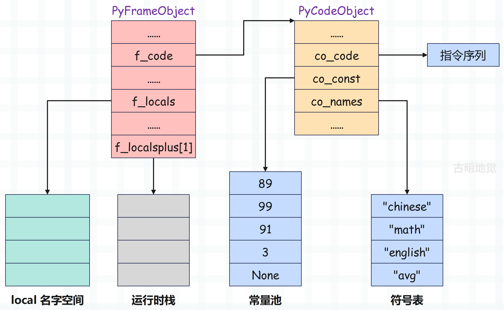

> f_localsplus 下面的箭头方向，代表运行时栈从栈底到栈顶的方向。

这里再强调一下 f_localsplus 字段，它是一个柔性数组。虽然声明的时候写着长度为 1，但实际使用时，长度不受限制，和 Go 语言不同，C 数组的长度不属于类型的一部分。然后 f_localsplus 在逻辑上被分成了四份，分别用于局部变量、cell 变量、free 变量、运行时栈，由于当前示例中的代码是以模块的方式编译的，里面所有的变量都是全局变量，而且也不涉及闭包啥的，所以这里就把 f_localsplus 理解为运行时栈即可。

接下来就开始执行字节码了，next_instr 指向下一条待执行的字节码指令，显然初始状态下，下一条待执行的指令就是第一条指令。

于是虚拟机开始执行 0 LOAD_CONST，该指令表示将常量加载进运行时栈，而要加载的常量在常量池中的索引，由指令参数表示。

> 在源码中，指令对应的变量是 opcode，指令参数对应的变量是 oparg。

~~~C
case TARGET(LOAD_CONST): {
    PREDICTED(LOAD_CONST);
    // 调用元组的 GETITEM 方法，从常量池中加载索引为 oparg 的对象
    // 当然啦，为了描述方便我们称之为对象，但其实是指向对象的指针
    PyObject *value = GETITEM(consts, oparg);
    // 增加引用计数
    Py_INCREF(value);
    // 压入运行时栈
    PUSH(value);
    FAST_DISPATCH();
}
~~~

该指令的参数为 0，所以会将常量池中索引为 0 的元素 89 压入运行时栈，执行完之后，栈帧的布局就变成了下面这样：

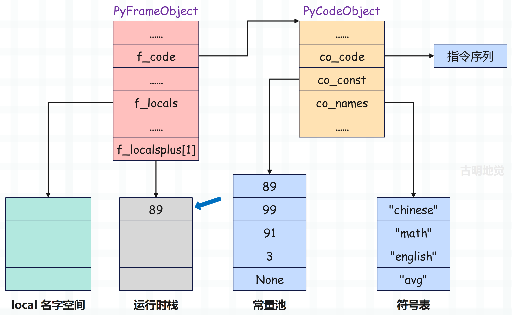

接着虚拟机执行 2 STORE_NAME 指令，从符号表中获取索引为 0 的符号、即 chinese。然后将栈顶元素 89 弹出，再将符号 chinese 和整数对象 89 绑定起来保存到 local 名字空间中。

~~~C
case TARGET(STORE_NAME): {
    // 从符号表中加载索引为 oparg 的符号  
    // 符号本质上就是一个 PyUnicodeObject 对象
    // 这里就是字符串 "chinese"
    PyObject *name = GETITEM(names, oparg);
    // 从运行时栈的栈顶弹出元素
    // 显然是上一步压入的 89
    PyObject *v = POP();
    // 获取名字空间 namespace
    PyObject *ns = f->f_locals;
    int err;
    // 如果没有名字空间则报错，设置异常
    if (ns == NULL) {
        _PyErr_Format(tstate, PyExc_SystemError,
                      "no locals found when storing %R", name);
        Py_DECREF(v);
        goto error;
    }
    // 将符号和对象绑定起来放在 ns 中
    // 名字空间是一个字典，PyDict_CheckExact 负责检测 ns 是否为字典，等价于 type(ns) is dict
    // 除此之外，还有 PyDict_Check(ns)，它等价于 isinstance(ns, dict)
    if (PyDict_CheckExact(ns))
        // 通过字典的特定类型 API 将键值对 "chinese": 89 设置到字典中
        err = PyDict_SetItem(ns, name, v);
    else
        // 走到这里说明 type(ns) 不是 dict，那么它应该继承 dict
        // 通过泛型 API 设置元素
        err = PyObject_SetItem(ns, name, v);
    // 对象的引用计数减 1，因为从运行时栈中弹出了
    Py_DECREF(v);
     // 如果 err != 0，证明设置元素出错了，跳转至 error 标签
    if (err != 0)
        goto error;
    // 调用 DISPATCH() 执行下一条指令，如果没有开启计算跳转，那么它就相当于一个 continue
    DISPATCH();
}
~~~

执行完之后，栈帧的布局就变成了下面这样：

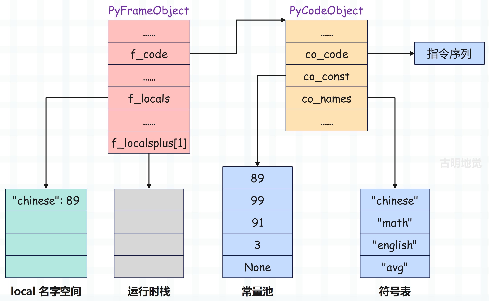

此时运行时栈为空，local 名字空间多了个键值对。

同理剩余的两个赋值语句也是类似的，只不过指令参数不同，比如 6 STORE_NAME 加载的是符号表中索引为 1 的符号，10 STORE_NAME 加载的是符号表中索引为 2 的符号，分别是 math 和 english。它们执行完之后，栈桢布局如下：

然后 12 LOAD_NAME 和 14 LOAD_NAME 负责将符号表中索引为 0 和 1 的变量的值压入运行时栈：

~~~C
case TARGET(LOAD_NAME): {
    // 从符号表 co_names 中加载索引为 oparg 的变量（符号）
    // 但是注意：全局变量是通过字典存储的
    // 所以这里的 name 只是一个字符串罢了，比如 "chinese"
    // 然后还要再根据这个字符串从字典里面查找对应的 value
    PyObject *name = GETITEM(names, oparg);
    // 对于模块来说，f->f_locals 和 f->f_globals 指向同一个字典
    PyObject *locals = f->f_locals;
    PyObject *v;
    // local 名字空间一定不为 NULL
    if (locals == NULL) {
        _PyErr_Format(tstate, PyExc_SystemError,
                      "no locals when loading %R", name);
        goto error;
    }
    // 如果 type(locals) is dict 为真
    if (PyDict_CheckExact(locals)) {
        // 根据 name 获取 value，所以 print(chinese) 本质上就是下面这样
        // print(locals["chinese"])
        v = PyDict_GetItemWithError(locals, name);
        if (v != NULL) {
            Py_INCREF(v);
        }
        else if (_PyErr_Occurred(tstate)) {
            goto error;
        }
    }
    // 否则说明 type(locals) is dict 为假，但 isinstance(locals, dict) 为真
    else {
        // 通过泛型 API 获取元素
        v = PyObject_GetItem(locals, name);
        if (v == NULL) {
            if (!_PyErr_ExceptionMatches(tstate, PyExc_KeyError))
                goto error;
            _PyErr_Clear(tstate);
        }
    }
    // 如果 v 等于 NULL，说明 local 空间不存在
    if (v == NULL) {
        // 那么从全局名字空间（global 名字空间）获取
        v = PyDict_GetItemWithError(f->f_globals, name);
        // 如果 v 不等于 NULL，说明获取到了
        if (v != NULL) {
            Py_INCREF(v);
        }
        // 否则说明 global 空间也不存在指定的 key
        // 这里检测一下是否有异常产生，有的话跳转到 error 标签
        else if (_PyErr_Occurred(tstate)) {
            goto error;
        }
        // local 空间和 global 空间都没有，那么该去 builtin 空间查找了
        else {
            // 逻辑和上面是类似的，如果查找不到，跳转到 error 标签，否则增加引用计数
            if (PyDict_CheckExact(f->f_builtins)) {
                v = PyDict_GetItemWithError(f->f_builtins, name);
                if (v == NULL) {
                    if (!_PyErr_Occurred(tstate)) {
                        format_exc_check_arg(
                                tstate, PyExc_NameError,
                                NAME_ERROR_MSG, name);
                    }
                    goto error;
                }
                Py_INCREF(v);
            }
            else {
                v = PyObject_GetItem(f->f_builtins, name);
                if (v == NULL) {
                    if (_PyErr_ExceptionMatches(tstate, PyExc_KeyError)) {
                        format_exc_check_arg(
                                    tstate, PyExc_NameError,
                                    NAME_ERROR_MSG, name);
                    }
                    goto error;
                }
            }
        }
    }
    // 压入运行时栈
    PUSH(v);
    DISPATCH();
}
~~~

上面两条指令执行完之后，栈帧的布局就变成了下面这样：

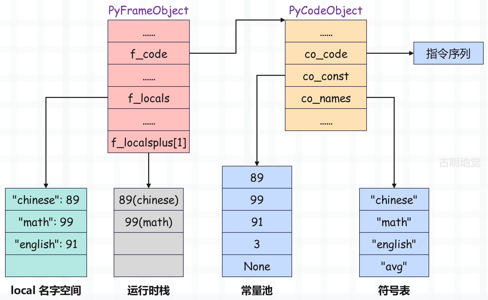

接下来执行 16 BINARY_ADD，它会将栈里的两个元素弹出，然后执行加法操作，最后再将结果入栈。

> 当然上面这种说法是为了方便理解，其实虚拟机真正执行的时候，只会弹出一个元素，而另一个元素只是使用 TOP() 进行查看，但不弹出。等结果计算完毕之后，再将栈顶元素替换掉。 
>
> 所以本质上，和弹出两个元素、再将计算结果入栈是一样的。

~~~C
case TARGET(BINARY_ADD): {
    // 从栈顶弹出元素，这里是 99（变量 math）
    PyObject *right = POP();
    // math 弹出之后，chinese 就成为了新的栈顶元素
    // 这里的 TOP() 则是获取栈顶元素 89（变量 chinese）
    PyObject *left = TOP();
    // 用于保存两者的和
    PyObject *sum;
    // 如果是字符串，执行专门的函数
    if (PyUnicode_CheckExact(left) &&
             PyUnicode_CheckExact(right)) {
        sum = unicode_concatenate(tstate, left, right, f, next_instr);
    }
     // 否则通过泛型 API 进行计算
    else {
        sum = PyNumber_Add(left, right);
        Py_DECREF(left);
    }
    // 减少元素的引用计数
    Py_DECREF(right);
    // 将栈顶元素替换成 sum
    SET_TOP(sum);
    if (sum == NULL)
        goto error;
    DISPATCH();
}
~~~

BINARY_ADD 指令执行完之后，栈帧的布局就变成了下面这样：

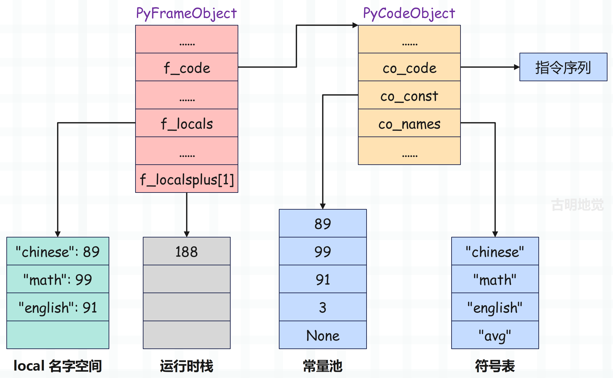

然后 18 LOAD_NAME 负责将符号表中索引为 2 的变量 english 的值压入运行时栈，而指令 20 BINARY_ADD 则是继续执行加法操作，并将结果设置在栈顶，然后 22 LOAD_CONST 将常量 3 再压入运行时栈。

这三条指令执行之后，运行时栈的变化如下：

接着是 24 BINARY_TRUE_DIVIDE，它的逻辑和 BINARY_ADD 类似，只不过一个执行除法，一个执行加法。

~~~C
case TARGET(BINARY_TRUE_DIVIDE): {
    // 从栈顶弹出元素，显然是 3
    PyObject *divisor = POP();
    // 查看栈顶元素，此时栈顶元素变成了 279
    PyObject *dividend = TOP();
    // 调用 PyNumber_TrueDivide，执行 279 / 3
    PyObject *quotient = PyNumber_TrueDivide(dividend, divisor);
    // 减少引用计数
    Py_DECREF(dividend);
    Py_DECREF(divisor);
    // 将栈顶元素替换成 279 / 3 的计算结果
    SET_TOP(quotient);
    if (quotient == NULL)
        goto error;
    DISPATCH();
}
~~~

当 24 BINARY_TRUE_DIVIDE 执行完之后，运行时栈如下：

然后 26 STORE_NAME 将栈顶元素 93.0 弹出，并将符号表中索引为 3 的变量 avg 和它绑定起来，放到名字空间中。因此最终栈帧关系图如下：

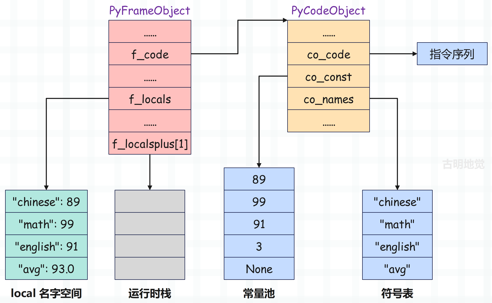

以上就是虚拟机对这几行代码的执行流程，整个过程就像 CPU 执行指令一样。

我们再用 Python 代码描述一遍上面的逻辑：

~~~python
# LOAD_CONST 将 89 压入栈中，STORE_NAME 将 89 从栈中弹出
# 并将符号 "chinese" 和 89 绑定起来，放在名字空间中
chinese = 89
print(
    {k: v for k, v in locals().items() if not k.startswith("__")}
)  # {'chinese': 89}

math = 99
print(
    {k: v for k, v in locals().items() if not k.startswith("__")}
)  # {'chinese': 89, 'math': 99}

english = 91
print(
    {k: v for k, v in locals().items() if not k.startswith("__")}
)  # {'chinese': 89, 'math': 99, 'english': 91}

avg = (chinese + math + english) / 3
print(
    {k: v for k, v in locals().items() if not k.startswith("__")}
)  # {'chinese': 89, 'math': 99, 'english': 91, 'avg': 93.0}
~~~

现在你是不是对虚拟机执行字节码有更深的了解了呢？当然字节码指令非常多，不止我们上面看到的那几个。你可以随便写一些代码，然后分析一下它的字节码指令是什么。

## 小结

到此，我们就深入源码，考察了虚拟机执行字节码的流程，帧评估函数虽然很长，也有那么一些复杂，但是核心逻辑不难理解。就是把自己当成一个 CPU，在栈帧中执行字节码指令。

下一篇文章我们来介绍一下常见的几个指令，并探讨不同的变量赋值语句的背后原理。

------

&nbsp;

**欢迎大家关注我的公众号：古明地觉的编程教室。**

**如果觉得文章对你有所帮助，也可以请作者吃个馒头，Thanks♪(･ω･)ﾉ。**

