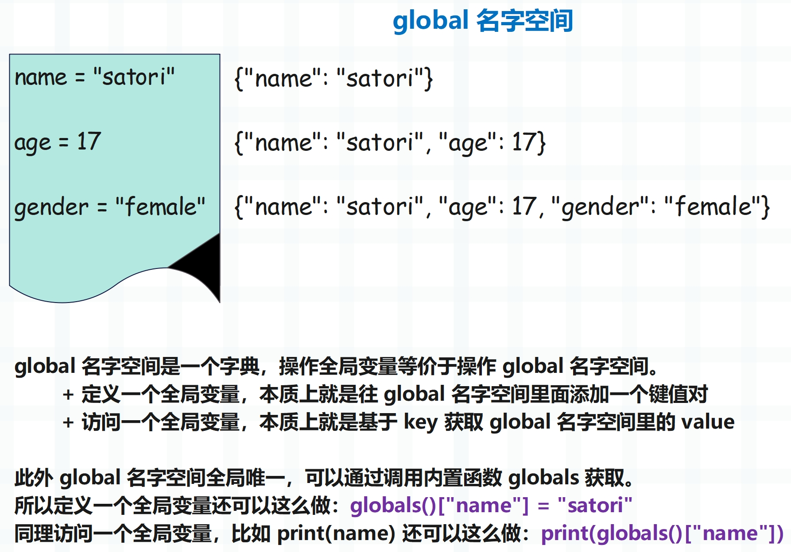
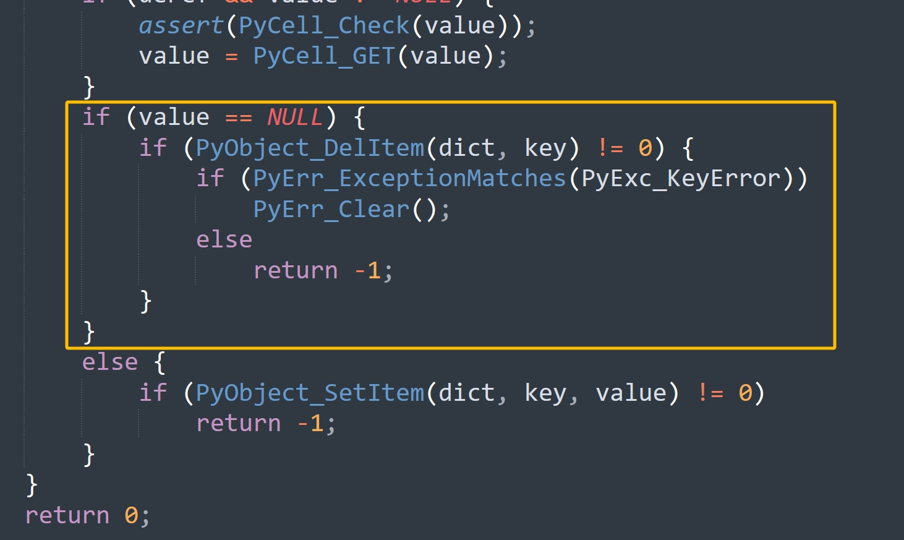

## 楔子

前面我们剖析了字节码的执行流程，本来应该接着介绍一些常见指令的，但因为有几个指令涉及到了局部变量，所以我们单独拿出来说。与此同时，我们还要再度考察一下 local 名字空间，它的背后还隐藏了很多内容。

我们知道函数的参数和函数内部定义的变量都属于局部变量，均是通过静态方式访问的。

~~~Python
x = 123

def foo1():
    global x
    a = 1
    b = 2

# co_nlocals 会返回局部变量的个数
# a 和 b 是局部变量，x 是全局变量，因此是 2
print(foo1.__code__.co_nlocals)  # 2

def foo2(a, b):
    pass

print(foo2.__code__.co_nlocals)  # 2

def foo3(a, b):
    a = 1
    b = 2
    c = 3

print(foo3.__code__.co_nlocals)  # 3
~~~

无论是参数还是内部新创建的变量，本质上都是局部变量。

按照之前的理解，当访问一个全局变量时，会去访问 global 名字空间（也叫全局名字空间）。

那么问题来了，当操作函数的局部变量时，是不是也等价于操作其内部的 local 名字空间（局部名字空间）呢？我们往下看。

## 如何访问（创建）一个局部变量

之前我们说过 Python 变量的访问是有规则的，会按照本地、闭包、全局、内置的顺序去查找，也就是 LEGB 规则，所以在查找变量时，local 名字空间应该是第一选择。

但不幸的是，虚拟机在为调用的函数创建栈帧对象时，这个至关重要的 local 名字空间并没有被创建。因为栈帧的 f_locals 字段和 f_globals 字段分别指向了局部名字空间和全局名字空间，而创建栈帧时 f_locals 被初始化成了 NULL，所以并没有创建局部名字空间。这里可能有人会有疑问，因为印象之中函数是有 local 空间的吧。

~~~Python
import inspect

# 模块的栈帧
frame = inspect.currentframe()
# 对于模块而言，局部名字空间和全局名字空间是同一个字典
print(frame.f_locals is frame.f_globals)  # True
# 当然啦，局部名字空间和全局名字空间也可以通过内置函数获取
print(
    frame.f_locals is locals() is frame.f_globals is globals()
)  # True

# 但对于函数而言就不一样了
def foo():
    name = "古明地觉"
    return inspect.currentframe()

frame = foo()
# global 名字空间全局唯一
# 无论是获取栈帧的 f_globals，还是调用 globals()，得到的都是同一份字典
print(frame.f_globals is globals())  # True
# 但每个函数都有自己独立的局部名字空间
print(frame.f_locals)  # {'name': '古明地觉'}

# 咦，不是说局部名字空间被初始化为 NULL 吗？
# 那么在 Python 里面获取的话，结果应该是个 None 才对啊
# 关于这一点，我们稍后会解释
~~~

总之对于函数而言，在创建栈帧时，它的 f_locals 被初始化为 NULL。那么问题来了，局部变量到底存储在什么地方呢？当然，由于变量只是一个名字（符号），而局部变量的名字都存储在符号表中，所以更严谨的说法是，局部变量的值存储在什么地方？

在介绍虚拟机执行字节码的时候我们说过，当函数被调用时，虚拟机会为其创建一个栈帧。栈帧是虚拟机的执行环境，包含了执行时所依赖的上下文，而栈帧内部有一个字段叫 f_localsplus，它是一个数组。

这个数组虽然是一段连续内存，但在逻辑上被分成了 4 份，其中局部变量便存储在 f_localsplus 的第一份空间中。现在我们明白了，局部变量是静态存储在数组中的。

我们举个例子。

~~~python
def foo(a, b):
    c = a + b
    print(c)
~~~

它的字节码如下：

~~~C
            // 加载局部变量 a，压入运行时栈
2           0 LOAD_FAST                0 (a)
            // 加载局部变量 b，压入运行时栈
            2 LOAD_FAST                1 (b)
            // 将 a 和 b 从栈中弹出，然后做加法运算，再将结果压入栈中
            4 BINARY_ADD
            // 加载符号 c，弹出栈顶元素（a + b 的运算结果）
            // 然后将两者绑定起来，完成赋值语句 c = a + b
            6 STORE_FAST               2 (c)
            
            // 加载变量 print，优先从 global 空间中加载
            // 如果 global 空间里面没有，那么再从 builtin 空间中加载
3           8 LOAD_GLOBAL              0 (print)
            // 加载局部变量 c
           10 LOAD_FAST                2 (c)
            // 执行 print(c)，并将返回值压入栈中，print 的返回值是 None
           12 CALL_FUNCTION            1
            // 弹出栈顶的返回值，因为没有用变量保存，所以会直接丢弃
           14 POP_TOP
            // 隐式的 return None
           16 LOAD_CONST               0 (None)
           18 RETURN_VALUE
~~~

注意里面的 LOAD_FAST 和 STORE_FAST，这两个指令对应的逻辑如下。

~~~C
case TARGET(LOAD_FAST): {
    // 通过宏 GETLOCAL 获取局部变量的值
    PyObject *value = GETLOCAL(oparg);
    // 如果值为 NULL，抛出 UnboundLocalError
    if (value == NULL) {
        format_exc_check_arg(tstate, PyExc_UnboundLocalError,
                             UNBOUNDLOCAL_ERROR_MSG,
                             PyTuple_GetItem(co->co_varnames, oparg));
        goto error;
    }
    // 增加引用计数并压入运行时栈
    Py_INCREF(value);
    PUSH(value);
    FAST_DISPATCH();
}

case TARGET(STORE_FAST): {
    PREDICTED(STORE_FAST);
    // 获取栈顶元素
    PyObject *value = POP();
    // 通过宏 SETLOCAL 创建局部变量
    SETLOCAL(oparg, value);
    FAST_DISPATCH();
}
~~~

所以 LOAD_FAST 和 STORE_FAST 分别负责加载和创建局部变量，而核心就是里面的两个宏：GETLOCAL、SETLOCAL，这两个宏也是定义在帧评估函数里面的。

~~~C
// Python/ceval.c

// 在帧评估函数中，fastlocals 会被赋值为 f->f_localsplus
#define GETLOCAL(i)     (fastlocals[i])

#define SETLOCAL(i, value)      do { PyObject *tmp = GETLOCAL(i); \
                                     GETLOCAL(i) = value; \
                                     Py_XDECREF(tmp); } while (0)
/* 这里额外再补充一个关于 C 语言的知识点
 * 我们看到宏 SETLOCAL 展开之后的结果是 do {...} while (0) 
 * do while 循环会先执行 do 里面的循环体，然后再判断条件是否满足
 * 因此从效果上来说，执行 do {...} while (0) 和直接执行 ... 是等价的
 * 那么问题来了，既然效果等价，为啥还要再套一层 do while 呢
 * 其实原因很简单，如果宏在展开之后会生成多条语句，那么这些语句要成为一个整体
 * 另外由于 C 程序的语句要以分号结尾，所以在调用宏时，我们也会习惯性地在结尾加上分号
 * 因此我们希望有这样一种结构，能同时满足以下要求：
 *   1）可以将多条语句包裹起来，作为一个整体；
 *   2）程序的语义不能发生改变；
 *   3）在语法上，要以分号结尾；
 * 显然 do while 完美满足以上三个要求，只需将 while 里的条件设置为 0 即可
 * 并且当编译器看到 while (0) 时，也会进行优化，去掉不必要的循环控制结构
 * 因此以后看到 do {...} while (0) 时，不要觉得奇怪，这是宏的一个常用技巧
 */
~~~

我们看到操作局部变量，就是在基于索引操作数组 f_localsplus，显然这个过程比操作字典要快。尽管字典是经过高度优化的，但显然再怎么优化，也不可能快过数组的静态操作。

所以此时我们对局部变量的藏身之处已经了然于心，它们就存放在栈帧的 f_localsplus 字段中，而之所以没有使用 local 名字空间的原因也很简单。因为函数内部的局部变量在编译时就已经确定了，个数是不会变的，因此编译时也能确定局部变量占用的内存大小，以及访问局部变量的字节码指令应该如何访问内存。

~~~Python
def foo(a, b):
    c = a + b
    print(c)

print(
    foo.__code__.co_varnames
)  # ('a', 'b', 'c')
~~~

比如变量 c 位于符号表中索引为 2 的位置，这在编译时就已确定。

- 当创建变量 c 时，只需修改数组 f_localsplus 中索引为 2 的元素即可。
- 当访问变量 c 时，只需获取数组 f_localsplus 中索引为 2 的元素即可。

这个过程是基于数组索引实现的静态查找，所以操作局部变量和操作全局变量有着异曲同工之妙。操作全局变量本质上是基于 key 操作字典的 value，其中 key 是变量的名称，value 是变量的值；而操作局部变量本质上是基于索引操作数组 f_localsplus 的元素，这个索引就是变量名在符号表中的索引，对应的数组元素就是变量的值。

> 所以我们说 Python 的变量其实就是个名字，或者说符号，到这里是不是更加深刻地感受到了呢？

但对于局部变量来说，如果想实现静态查找，显然要满足一个前提：变量名在符号表中的索引和与之绑定的值在 f_localsplus 中的索引必须是一致的。毫无疑问，两者肯定是一致的，并且索引是多少在编译阶段便已经确定，会作为指令参数保存在字节码指令序列中。

好，到此可以得出结论，虽然虚拟机为函数实现了 local 名字空间（初始为 NULL），但在操作局部变量时却没有使用它，原因就是为了更高的效率。当然还有所谓的 LEGB，都说变量查找会遵循这个规则，但我们心里清楚，局部变量其实是静态访问的，不过完全可以按照 LEGB 的方式来理解。

## 解密 local 名字空间

先来看一下全局名字空间：

~~~Python
x = 1

def foo():
    globals()["x"] = 2
    
foo()
print(x)  # 2
~~~

global 空间全局唯一，在 Python 层面上就是一个字典，在任何地方操作该字典，都相当于操作全局变量，即使是在函数内部。因此在执行完 foo() 之后，全局变量 x 就被修改了。但 local 名字空间也是如此吗？我们尝试一下。

~~~Python
def foo():
    x = 1
    locals()["x"] = 2
    print(x)

foo()  # 1
~~~

我们按照相同的套路，却并没有成功，这是为什么？原因就是上面解释的那样，函数内部有哪些局部变量在编译时就已经确定了，查询的时候是从数组 f_localsplus 中静态查找的，而不是从 local 名字空间中查找。

然后我们打印一下 local 名字空间，看看里面都有哪些内容。

~~~Python
def foo():
    name = "satori"
    print(locals())
    age = 17
    print(locals())
    gender = "female"
    print(locals())

foo()
"""
{'name': 'satori'}
{'name': 'satori', 'age': 17}
{'name': 'satori', 'age': 17, 'gender': 'female'}
"""
~~~

我们看到打印 locals() 居然也会显示内部的局部变量，相信聪明如你已经猜到 locals() 是怎么回事了。符号表里面存储了局部变量的符号（或者说名字），f_localsplus 里面存储了局部变量的值，当执行 locals() 的时候，会基于符号表和 f_localsplus 创建一个字典出来。

~~~Python
def foo():
    name = "satori"
    age = 17
    gender = "female"
    print(locals())

# 符号表：保存了函数中创建的局部变量的名字
print(foo.__code__.co_varnames)
"""
('name', 'age', 'gender')
"""
# 调用函数时会创建栈帧，局部变量的值都保存在 f_localsplus 里面
# 并且符号表中变量名的顺序和 f_localsplus 中变量值的顺序是一致的
f_localsplus = ["satori", 17, "female"]
# 这里就用一个列表来模拟了
~~~

我们来看一下变量的创建。

- 由于符号 name 位于符号表中索引为 0 的位置，那么执行 name = "satori" 时，就会将 "satori" 放在 f_localsplus 中索引为 0 的位置。
- 由于符号 age 位于符号表中索引为 1 的位置，那么执行 age = 17 时，就会将 17 放在 f_localsplus 中索引为 1 的位置。
- 由于符号 gender 位于符号表中索引为 2 的位置，那么执行 gender = "female" 时，就会将 "female" 放在 f_localsplus 中索引为 2 的位置。

后续在访问变量的时候，比如访问变量 age，由于它位于符号表中索引为 1 的位置，那么就会通过 f_localsplus[1] 获取它的值，这些符号对应的索引都是在编译阶段确定的。所以在运行时才能实现静态查找，指令 LOAD_FAST 和 STORE_FAST 都是基于索引来静态操作底层数组。

我们用一张图来描述这个过程：

符号表负责存储局部变量的名字，f_localsplus 负责存储局部变量的值（里面的元素初始为 NULL），而在给局部变量赋值的时候，本质上就是将值写在了 f_localsplus 中。并且变量名在符号表中的索引，和变量值在 f_localsplus 中的索引是一致的，因此操作局部变量本质上就是在操作 f_localsplus 数组。至于 locals() 或者说局部名字空间，它是基于符号表和 f_localsplus 动态创建的，为了方便我们获取已存在的局部变量，执行 locals() 会临时创建一个字典（只会创建一次）。

所以我们通过 locals() 获取局部名字空间之后，访问里面的局部变量是可以的，只不过此时将静态访问变成了动态访问。

~~~Python
def foo():
    name = "satori"
    # 会从 f_localsplus 中静态查找
    print(name)
    # 先基于已有的变量和值创建一个字典
    # 然后通过字典实现变量的动态查找
    print(locals()["name"])

foo()
"""
satori
satori
"""
~~~

两种方式都是可以的，但基于 locals() 来访问，在效率上明显会低一些。

另外基于 locals() 访问一个变量是可以的，但无法创建一个变量。

~~~Python
def foo():
    name = "satori"
    locals()["age"] = 17
    try:
        print(age)
    except NameError as e:
        print(e)

foo()
"""
name 'age' is not defined
"""
~~~

局部变量是静态存储在数组里的，locals() 只是做了一个拷贝而已。往局部名字空间里面添加一个键值对，不等于创建一个局部变量，因为局部变量不是从它这里查找的，因此代码中打印 age 报错了。但如果外部还有一个全局变量 age 的话，那么会打印全局变量 age。

然后再补充一点，我们说全局名字空间在任何地方都是唯一的，而对于函数而言，它的局部名字空间在整个函数内部也是唯一的。不管调用 locals 多少次，拿到的都是同一个字典。

~~~python
def foo():
    name = "satori"
    # 执行 locals() 的时候，内部只有一个键值对
    d = locals()
    print(d)  # {'name': 'satori'}
    # 再次获取，此时有两个键值对
    print(locals())  # {'name': 'satori', 'd': {...}}
    
    # 但两者的 id 相同，因为一个函数只有一个局部名字空间
    # 不管调用多少次 locals()，拿到的都是同一个字典
    print(id(d) == id(locals()))  # True

foo()
~~~

所以 locals() 和 globals() 指向的名字空间都是唯一的，只不过 locals() 是在某个函数内部唯一，而 globals() 在所有地方都唯一。

因此局部名字空间初始为 NULL，但在第一次执行 locals() 时，会以符号表中的符号作为 key，f_localsplus 中的值作为 value，创建一个字典作为函数的局部名字空间。而后续再执行 locals() 的时候，由于名字空间已存在，就不会再次创建了，直接基于当前的局部变量对字典进行更新即可。

~~~Python
def foo():
    # 创建一个字典，由于当前还没有定义局部变量，因此是空字典
    print(locals())  # {}

    # 往局部名字空间添加一个键值对
    locals()["a"] = "b"
    print(locals())  # {'a': 'b'}

    # 定义一个局部变量
    name = "satori"
    # 由于局部名字空间已存在，因此不会再次创建
    # 直接将局部变量的名字作为 key、值作为 value，拷贝到字典中
    print(locals())  # {'a': 'b', 'name': 'satori'}

foo()
~~~

注意：虽然局部名字空间里面存在 "a" 这个 key，但 a 这个局部变量是不存在的。

## local 名字空间的创建过程

目前我们已经知道 local 名字空间是怎么创建的了，也熟悉了它的特性，下面通过源码来看一下它的构建过程。

~~~C
// Python/bltinmodule.c

static PyObject *
builtin_locals_impl(PyObject *module)
{
    PyObject *d;
    // Python 内置函数的源码实现位于 bltinmodule.c 中
    // 这里又调用了 PyEval_GetLocals
    d = PyEval_GetLocals();
    Py_XINCREF(d);
    return d;
}

// Python/ceval.c
PyObject *
PyEval_GetLocals(void)
{
    // 获取线程状态对象
    PyThreadState *tstate = _PyThreadState_GET();
    // 拿到当前栈桢
    PyFrameObject *current_frame = _PyEval_GetFrame(tstate);
    if (current_frame == NULL) {
        _PyErr_SetString(tstate, PyExc_SystemError, "frame does not exist");
        return NULL;
    }
    // 调用 PyFrame_FastToLocalsWithError 创建 local 名字空间
    // 并赋值给 current_frame->f_locals
    if (PyFrame_FastToLocalsWithError(current_frame) < 0) {
        return NULL;
    }

    assert(current_frame->f_locals != NULL);
    // 返回 current_frame->f_locals
    return current_frame->f_locals;
}

// Objects/frameobject.c
int
PyFrame_FastToLocalsWithError(PyFrameObject *f)
{
    PyObject *locals, *map;
    PyObject **fast;
    PyCodeObject *co;
    Py_ssize_t j;
    Py_ssize_t ncells, nfreevars;
    
    // 栈桢不能为空
    if (f == NULL) {
        PyErr_BadInternalCall();
        return -1;
    }
    // 获取局部名字空间
    locals = f->f_locals;
    // 如果为 NULL，那么创建一个新字典，作为名字空间
    // 所以局部名字空间只会创建一次，后续不会再创建
    if (locals == NULL) {
        locals = f->f_locals = PyDict_New();
        if (locals == NULL)
            return -1;
    }
    // 获取 PyCodeObject 对象
    co = f->f_code;
    // 拿到内部的符号表（一个元组），里面保存了函数局部变量的名字
    map = co->co_varnames;
    if (!PyTuple_Check(map)) {
        PyErr_Format(PyExc_SystemError,
                     "co_varnames must be a tuple, not %s",
                     Py_TYPE(map)->tp_name);
        return -1;
    }
    // 获取 f_localsplus，它里面保存了局部变量的值
    // 只不过除了局部变量的值之外，还保存了其它的
    fast = f->f_localsplus;
    // 那么 f_localsplus 里面到底有多少个局部变量的值呢？显然这要基于符号表来判断
    // co_varnames 里面保存了多少个符号，f_localsplus 里面就保存了多少个局部变量的值
    j = PyTuple_GET_SIZE(map);
    if (j > co->co_nlocals)
        // 理论上符号表的长度和局部变量的个数（co_nlocals）是相等的
        // 但如果超过了 co_nlocals，那么让它等于 co_nlocals
        j = co->co_nlocals;
   
    // 如果 co_nlocals 大于 0，证明存在局部变量，那么调用 map_to_dict
    // 将 co_varnames 和 f_localsplus 里的元素组成键值对，添加到局部名字空间中
    if (co->co_nlocals) {
        // 相当于 locals.update(zip(co_varnames, f_localsplus))
        if (map_to_dict(map, j, locals, fast, 0) < 0)
            return -1;
    }
    // 如果里面有 cell 变量和 free 变量的话，也会添加到局部名字空间中
    // 关于 cell 变量和 free 变量，由于它们和闭包相关，所以等介绍闭包的时候再说
    ncells = PyTuple_GET_SIZE(co->co_cellvars);
    nfreevars = PyTuple_GET_SIZE(co->co_freevars);
    if (ncells || nfreevars) {
        if (map_to_dict(co->co_cellvars, ncells,
                        locals, fast + co->co_nlocals, 1))
            return -1;
        if (co->co_flags & CO_OPTIMIZED) {
            if (map_to_dict(co->co_freevars, nfreevars,
                            locals, fast + co->co_nlocals + ncells, 1) < 0)
                return -1;
        }
    }
    return 0;
}
~~~

可以看到，源码的实现逻辑和我们之前分析的是一样的。

- 变量 map 是符号表 co_varnames，保存了局部变量的名字；
- 变量 fast 是 f_localsplus，保存了局部变量的值；
- 变量 j 是局部变量的个数；
- 变量 locals 是局部名字空间；

然后将它们作为参数，传递给 map_to_dict 函数，该函数内部会进行遍历，按照顺序将变量名和变量值依次添加到局部名字空间中。然后我们再来看一下 map_to_dict 函数，它内部有一处细节非常之关键。

~~~C
// Objects/frameobject.c

static int
map_to_dict(PyObject *map, Py_ssize_t nmap, PyObject *dict, PyObject **values,
            int deref)
{
    Py_ssize_t j;
    assert(PyTuple_Check(map));
    assert(PyDict_Check(dict));
    assert(PyTuple_Size(map) >= nmap);
    // nmap 表示局部变量的个数
    for (j=0; j < nmap; j++) {
        // 从符号表中获取符号（变量名）
        PyObject *key = PyTuple_GET_ITEM(map, j);
        // values 就是 f_localsplus，然后获取变量的值
        PyObject *value = values[j];
        assert(PyUnicode_Check(key));
        // 闭包变量相关，等介绍闭包的时候再说，由于当前不存在闭包，所以先忽略掉
        if (deref && value != NULL) {
            assert(PyCell_Check(value));
            value = PyCell_GET(value);
        }
        // 注意这一步：检测 value 是否等于 NULL，那么问题来了，什么时候 value 会等于 NULL 呢？
        // 之前说了，局部变量有哪些在编译的时候就确定了，保存在符号表中，局部变量的值保存在 f_localsplus 中
        // 在局部变量还没有赋值的时候，它在 f_localsplus 中对应的值就是 NULL
        // 而给一个局部变量赋值，本质上就是在修改 f_localsplus
        // 假设一个函数的符号表为 ("a", "b", "c")，在给变量 c 赋值之前调用了 locals()
        // 那么在获取变量 c 对应的值时，拿到的就是一个 NULL
        if (value == NULL) {
            // 如果某个符号对应的值为 NULL，则说明在获取名字空间时，该变量还没有被赋值
            // 那么当该符号在 local 空间中已存在时，还要将它删掉。这一步非常关键，它的作用我们稍后会说
            if (PyObject_DelItem(dict, key) != 0) {
                if (PyErr_ExceptionMatches(PyExc_KeyError))
                    PyErr_Clear();
                else
                    return -1;
            }
        }
        // 如果 value 不等于 NULL，说明变量已经完成了和某个值的绑定，于是将它们组成键值对拷贝到 local 空间中
        else {
            if (PyObject_SetItem(dict, key, value) != 0)
                return -1;
        }
    }
    return 0;
}
~~~

以上就是 local 名字空间的获取过程在源码层面的体现。

## local 名字空间与 exec 函数

我们再来搭配 exec 关键字，结果会更加明显。首先 exec 函数可以将一段字符串当成代码来执行，并将执行结果体现在当前的名字空间中。

~~~Python
def foo():
    print(locals())  # {}
    exec("x = 1")
    print(locals())  # {'x': 1}
    try:
        print(x)
    except NameError as e:
        print(e)  # name 'x' is not defined
        
foo()
~~~

尽管 locals() 变了，但是依旧访问不到 x，因为虚拟机并不知道 exec("x = 1") 是创建一个局部变量，它只知道这是一个函数调用。

> 事实上 exec 会作为一个独立的编译单元来执行，并且有自己的作用域。

所以 exec("x = 1") 执行完之后，效果就是改变了局部名字空间，里面多了一个 "x": 1 键值对。但关键的是，局部变量 x 不是从局部名字空间中查找的，exec 终究还是错付了人。而由于函数 foo 对应的 PyCodeObject 对象的符号表中并没有 x 这个符号，所以报错了。

> 补充：exec 默认影响的是 local 名字空间，如果在执行时发现 local 名字空间为 NULL，那么会自动创建一个。所以调用 exec 也可以创建名字空间（当它为 NULL 时）。

~~~python
exec("x = 1")
print(x)  # 1
~~~

如果放在模块里面是可以的，因为模块的 local 名字空间和 global 名字空间指向同一个字典，所以 global 名字空间会多一个 key 为 "x" 的键值对。而全局变量是从 global 名字空间中查找的，所以这里没有问题。

~~~python
def foo():
    # 此时 exec 影响的是 global 名字空间
    exec("x = 123", globals())
    # 所以这里不会报错, 但此时的 x 不是局部变量, 而是全局变量
    print(x)

foo()
print(x)
"""
123
123
"""
~~~

可以给 exec 指定要影响的名字空间，代码中 exec 影响的是全局名字空间，打印的 x 也是全局变量。

## 变量名冲突的问题

我们说 exec 的执行效果会体现在 local 名字空间中，但是需要考虑变量名冲突的问题。举个例子：

~~~Python
def foo():
    exec("x = 1")
    print(locals()["x"])

foo()
"""
1
"""

def bar():
    exec("x = 1")
    print(locals()["x"])
    x = 123

bar()
"""
Traceback (most recent call last):
  File .....
    bar()
  File .....
    print(locals()["x"])
KeyError: 'x'
"""
~~~

这是什么情况？函数 bar 只是多了一行赋值语句，为啥就报错了呢？要想搞懂这个问题，首先要明确两点：

+ 1）函数的局部变量在编译的时候就已经确定，并存储在对应的 PyCodeObject 对象的符号表 (co_varnames) 中，这是由语法规则所决定的；
+ 2）函数内的局部变量在其整个作用域范围内都是可见的；

对于 foo 函数来说，exec 执行完之后相当于往 local 名字空间中添加一个键值对，这没有问题。对于 bar 函数而言也是如此，在执行完 exec("x = 1") 之后，local 名字空间中也会存在 "x": 1 这个键值对，但下面执行 locals() 的时候又把字典更新了。因为局部变量可以在函数的任意位置创建，或者修改，所以每一次执行 locals() 的时候，都会遍历符号表和 f_localsplus，组成键值对将原来的字典更新一遍。

在 bar 函数里面有一行 x  = 123，所以知道函数里面存在局部变量 x，符号表里面也会有 "x" 这个符号，这是在编译时就确定的。但我们是在 x = 123 之前调用的 locals，所以此时符号 x 在 f_localsplus 中对应的值还是一个 NULL，没有指向一个合法的 PyObject。换句话说就是，知道里面存在局部变量 x，但是还没有来得及赋值。

然后在更新名字空间的时候，如果发现值是个 NULL，那么就把名字空间中该变量对应的键值对给删掉。

我们回顾一下 map_to_dict 函数：

所以 bar 函数执行 locals()["x"] 的时候，会先获取名字空间，原本里面是有 "x": 1 这个键值对的。但因为赋值语句 x = 123 的存在，导致符号表里面存在 "x" 这个符号，但执行 locals() 的时候又尚未完成赋值，所以值为 NULL，于是又把这个键值对给删掉了。所以执行 locals()["x"] 的时候，出现了 KeyError。

因为局部名字空间体现的是局部变量的值，而调用 locals 的时候，局部变量 x 还没有被创建。所以 locals() 里面不应该存在 key 为 "x" 的键值对，于是会将它删除。

我们将名字空间打印一下：

~~~Python
def foo():
    # 创建局部名字空间，并写入键值对 "x": 1
    # 此时名字空间为 {"x": 1}
    exec("x = 1")
    # 获取名字空间，会进行更新
    # 但当前不存在局部变量，所以名字空间仍是 {"x": 1}
    print(locals())

def bar():
    # 创建局部名字空间，并写入键值对 "x": 1
    # 此时名字空间为 {"x": 1}
    exec("x = 1")
    # 获取名字空间，会进行更新
    # 由于里面存在局部变量 x，但尚未赋值
    # 于是将字典中 key 为 "x" 的键值对给删掉
    # 所以名字空间变成了 {}
    print(locals())
    x = 123

foo()  # {'x': 1}
bar()  # {}
~~~

上面代码中，局部变量的创建发生在 exec 之后，如果发生在 exec 之前也是相同的结果。

~~~Python
def foo():
    exec("x = 2")
    print(locals())

foo()  # {'x': 2}

def bar():
    x = 1
    exec("x = 2")
    print(locals())

bar()  # {'x': 1}
~~~

在 exec("x = 2") 执行之后，名字空间也变成了 {"x": 2}。但从源码中我们看到，每次调用 locals，都会遍历符号表和 f_localsplus，对字典进行更新，所以在 bar 函数里面获取名字空间的时候，又把 "x" 对应的 value 给更新回来了。

当然这是在变量冲突的情况下，会保存真实存在的局部变量的值。但如果不冲突，比如 bar 函数里面是 exec("y = 2")，那么 locals() 里面就会存在两个键值对。但只有 x 才是真正的局部变量，而 y 则不是。

> 将 exec("x = 2") 换成 locals()["x"] = 2 也是一样的效果，它们都是往局部名字空间中添加一个键值对，但不会创建一个局部变量。

## 薛定谔的猫

[当 Python 中混进一只薛定谔的猫……](https://mp.weixin.qq.com/s?__biz=MzUyOTk2MTcwNg==&mid=2247484227&idx=1&sn=f823e086fea6905175f0099c7991303b&scene=21#wechat_redirect)，这是猫哥在 19 年更新的一篇文章，里面探讨的内容我们本文的主题是重叠的。猫哥在文章中举了几个疑惑重重的例子，看看用上面学到的内容能不能合理地解释。

~~~Python
# 例 0
def foo():
    exec('y = 1 + 1')
    z = locals()['y']
    print(z)

foo()
# 输出：2

# 例 1
def foo():
    exec('y = 1 + 1')
    y = locals()['y']
    print(y)

foo()
# 报错：KeyError: 'y'
~~~

以上是猫哥文章中举的示例，首先例 0 很简单，因为 exec 影响了所在的局部名字空间，里面存在 "y": 2 这个键值对。至于里面的变量 z 则不影响，因为我们获取的是 "y" 这个 key 对应的 value。

但例 1 则不同，因为 Python 在语法解析的时候发现了 y = ... 这样的赋值语句，那么它在编译的时候就知道函数里面存在 y 这个局部变量，并写入符号表中。既然符号表中存在，那么调用 locals 的时候就会对它进行更新。但是对 y 赋值是发生在调用 locals 之后，所以在调用 locals 的时候，y 的值还是一个 NULL，也就是变量还没有赋值。所以会将名字空间中的 "y": 2 这个键值对给删掉，于是报出 KeyError 错误。

**再来看看猫哥文章的例 2：**

~~~python
# 例 2
def foo():
    y = 1 + 1
    y = locals()['y']
    print(y)

foo()
# 输出：2
~~~

locals() 是对真实存在的局部变量的一个拷贝，在调用 locals 之前 y 就已经创建好了。符号表里面有 "y"，f_localsplus 里面有一个数值 2，所以调用 locals() 的时候，会得到 {"y": 2}，因此函数执行正常。

**猫哥文章的例 3：**

~~~Python
# 例3
def foo():
    exec('y = 1 + 1')
    boc = locals()
    y = boc['y']
    print(y)

foo()
# KeyError: 'y'
~~~

这个例3 和例1 是一样的，只不过用变量 boc 将局部名字空间保存起来了。执行 exec 的时候，会创建局部名字空间，写入键值对 "y": 2。但调用 locals 的时候，发现函数内部存在局部变量 y 并且还尚未赋值，于是又会将 "y": 2 这个键值对给删掉，因此 boc 变成了一个空字典。

所以在执行 y = boc["y"] 的时候会出现 KeyError。

**猫哥文章的例 4：**

~~~Python
# 例4
def foo():
    boc = locals()
    exec('y = 1 + 1')
    y = boc['y']
    print(y)

foo()
# 输出：2
~~~

显然在调用 locals 的时候，会返回一个空字典，因为此时的局部变量都还没有赋值。但需要注意的是：boc 已经指向了局部名字空间（字典），而局部名字空间在一个函数里面也是唯一的。所以 exec("y = 1 + 1") 执行之后，会往局部名字空间里面写入一个键值对，而变量 boc 指向的字典也会发生改变，因为是同一个字典，所以程序正常执行。

**猫哥文章的例 5：**

~~~python
# 例5
def foo():
    boc = locals()
    exec('y = 1 + 1')
    print(locals())
    y = boc['y']
    print(y)

foo()
# {'boc': {...}} 
# KeyError: 'y'
~~~

首先在执行 boc = locals() 之后，boc 会指向一个空字典，然后 exec 函数执行之后会往字典里面写入一个键值对 "y": 2。如果在 exec 执行之后，直接执行 y = boc["y"]，那么代码是没有问题的，但问题是执行之前插入了一个 print(locals())。

我们说过，当调用 locals 的时候，会对名字空间进行更新，然后返回更新之后的名字空间。由于函数内部存在 y = ... 这样的赋值语句，所以符号表中就存在 "y" 这个符号，于是会进行更新。但更新的时候，发现 y 还没有被赋值，于是又将字典中的键值对 "y": 2 给删掉了。

由于局部名字空间只有一份，所以 boc 指向的字典也会发生改变，换句话说在 print(locals()) 之后，boc 就指向了一个空字典，因此执行 y = boc["y"] 时会出现 KeyError。

## 小结

以上我们就探讨了 local 名字空间相关的内容，它是一个字典，是对真实存在的局部变量的一个拷贝，每当我们调用 locals，都会拷贝一次（但字典只会存在一份）。

然后函数的局部变量都是静态存储的，编译时就已经确定，无法在运行时动态添加。我们往局部名字空间里面添加键值对，并不等价于创建局部变量。

-----

&nbsp;

**欢迎大家关注我的公众号：古明地觉的编程教室。**

**如果觉得文章对你有所帮助，也可以请作者吃个馒头，Thanks♪(･ω･)ﾉ。**

