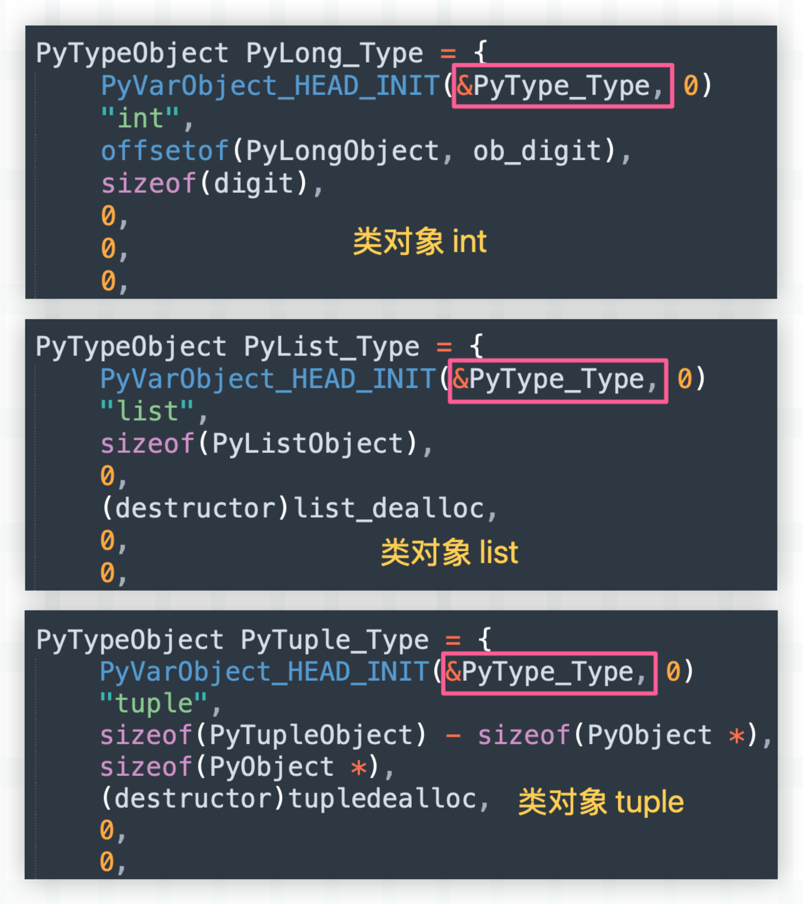
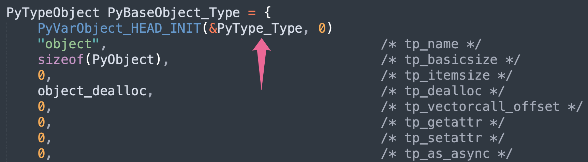
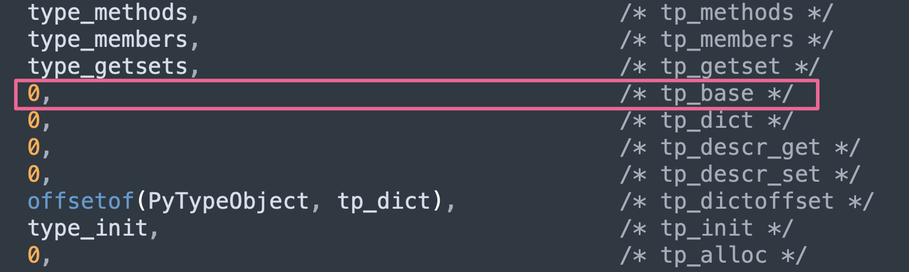
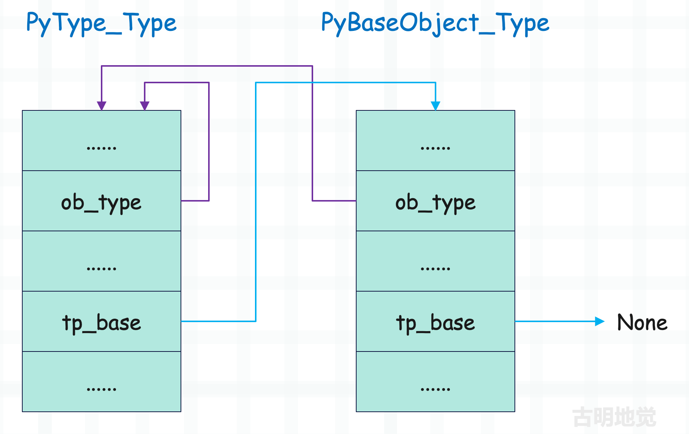

## 楔子

type 和 object 两者的关系估计会让很多人感到困惑，我们说 type 站在<font color="blue">类型金字塔</font>的顶端，任何对象按照类型追根溯源，最终得到的都是 type。而 object 站在<font color="blue">继承金字塔</font>的顶端，任何类型对象按照继承关系追根溯源，最终得到的都是 object。

因此我们可以得出以下结论：

- type 的父类是 object
- object 的类型是 type

验证一下：

```python
print(type.__base__)  # <class 'object'>
print(object.__class__)  # <class 'type'>
```

打印结果说明结论正确，但这就奇怪了，type 的父类是 object，而 object 的类型又是 type，那么问题来了，是先有 type 还是先有 object 呢？带着这些疑问，开始下面的内容。

## 类是由谁创建的

首先必须要澄清一个事实，类对象的类型是 type，这句话是没有问题的。但如果说类对象都是由 type 创建的，就有些争议了。因为 type 能够创建的是自定义的类，而内置的类在底层是预先定义好的。

~~~python
# int、tuple、dict 等内置类型
# 在底层是预先定义好的，以全局变量的形式存在
# 我们直接就可以拿来用
print(int)  # <class 'int'>
print(tuple)  # <class 'tuple'>

# 但对于自定义的类，显然就需要在运行时动态创建了
# 而创建这一过程，就交给 type 来做
class Girl:
    pass
~~~

然后 type 也只能对自定义类进行属性上的增删改，内置的类则不行。

```Python
class Girl:
    pass

# 给类对象增加一个成员函数
type.__setattr__(
    Girl,
    "info",
    lambda self: "name: 古明地觉, age: 17"
)
# 实例化之后就可以调用了
print(Girl().info())  # name: 古明地觉, age: 17

# 但内置的类对象，type 是无法修改的
try:
    type.__setattr__(int, "a", "b")
except TypeError as e:
    print(e)
"""
can't set attributes of built-in/extension type 'int'
"""
```

上一篇文章中我们说了，Python 所有的类型对象（包括 type）都是由 PyTypeObject 结构体实例化得到的，只不过结构体字段的值不同，得到的类也不同。并且内置的类型对象在底层是预定义好的，它们在解释器看来是同级别的，不存在谁创建谁。

而每一个对象都有引用计数和类型，然后解释器将这些类对象的类型都设置成了 type，我们举例说明。不过在此之前，需要先说一个宏。

~~~C
// Include/object.h

// _PyObject_EXTRA_INIT 可以忽略掉
// 我们看到这个宏是用来初始化引用计数和类型的
#define PyObject_HEAD_INIT(type)        \
    { _PyObject_EXTRA_INIT              \
    1, type },

// 负责初始化引用计数、类型和 ob_size
#define PyVarObject_HEAD_INIT(type, size)       \
    { PyObject_HEAD_INIT(type) size },
~~~

下面我们来看几个类型对象。 



我们看到所有类型对象的类型都被设置成了 &PyType_Type，也就是 Python 里的 type。所以结论很清晰了，虽然内置的类型对象可以看做是 type 的实例对象，但它却不是由 type 实例化得到的，而是在底层预定义好，并以全局变量的形式静态出现。

所以内置的类型对象之间不存在谁创建谁，它们都是预定义好的，只是在定义的时候，将自身的类型设置成了 type 而已，包括 type 本身（类型还是 type）。这样一来，每一个对象都会有一个类型，从而将面向对象理念贯彻的更加彻底。

~~~Python
print(int.__class__)
print(tuple.__class__)
print(set.__class__)
print(type.__class__)
"""
<class 'type'>
<class 'type'>
<class 'type'>
<class 'type'>
"""

print(
    type.__class__.__class__.__class__ is type
)  # True

print(
    type(type(type(type(type(type))))) is type
)  # True
~~~

好，说完了这些之后我们来正式考察 type 和 object 的底层实现。

## 类型对象的类型：PyType_Type

type 是所有类型对象的类型，我们称之为元类型或者元类，即 metaclass，当然它同时也是一个类型对象。下面看一下它的底层实现。

~~~C
// Objects/typeobject.c

PyTypeObject PyType_Type = {
    PyVarObject_HEAD_INIT(&PyType_Type, 0)
    "type",                                     /* tp_name */
    sizeof(PyHeapTypeObject),                   /* tp_basicsize */
    sizeof(PyMemberDef),                        /* tp_itemsize */
    (destructor)type_dealloc,                   /* tp_dealloc */
    0,                                          /* tp_vectorcall_offset */
    0,                                          /* tp_getattr */
    0,                                          /* tp_setattr */
    0,                                          /* tp_as_async */
    (reprfunc)type_repr,                        /* tp_repr */
    0,                                          /* tp_as_number */
    0,                                          /* tp_as_sequence */
    0,                                          /* tp_as_mapping */
    0,                                          /* tp_hash */
    (ternaryfunc)type_call,                     /* tp_call */
    // ...
};
~~~

所有的类型对象加上元类都是由 PyTypeObject 这个结构体实例化得到的，所以它们内部的字段都是一样的。只不过传入的值不同，实例化之后得到的结果也不同，可以是 PyLong_Type、可以是 PyFloat_Type，也可以是这里的 PyType_Type。

再看一下里面的宏 PyVarObject_HEAD_INIT，它用来初始化引用计数、类型和 ob_size，其中类型被初始化成了 &PyType_Type。换句话说，PyType_Type 里面的 ob_type 字段指向的还是 PyType_Type，而对应 Python 的话，就是 type 的类型还是 type。

~~~Python
>>> type.__class__
<class 'type'>
>>> type.__class__.__class__.__class__.__class__.__class__ is type
True
>>> type(type(type(type(type(type))))) is type
True
~~~

显然不管套娃多少次，最终的结果都是 True，这也是符合预期的。

## 类型对象的基类：PyBaseObject_Type

Python 中有两个类型对象比较特殊，一个是站在类型金字塔顶端的 type，另一个是站在继承金字塔顶端的 object。看完了 type，再来看看 object。

由于 object 的类型是 type，那么在初始化 PyBaseObject_Type 的时候，它的 ob_type 一定也被设置成了 &PyType_Type。

我们看一下 PyBaseObject_Type 的具体实现，它同样定义在 Objects/typeobject.c 中。



类型对象在创建的时候，ob_type 字段都会被初始化成 &PyType_Type，而 object 也不例外，所以它的类型为 type，这个非常简单。但 type 的基类是 object，又是怎么一回事呢？

之前介绍类型对象的时候，我们说类型对象内部的 tp_base 指向继承的基类，那么对于 PyType_Type 来讲，它内部的 tp_base 肯定是 &PyBaseObject_Type，即 object。



但令我们吃鲸的是，它的 tp_base 居然是个 0，也就是说基类为空。

> 在 C 中，将指针变量赋值为 0 和赋值为 NULL 是等价的，因为 NULL 就是值为 0 的指针常量。

不是说 type 的基类是 object 吗？为啥 tp_base 是 0 呢。事实上如果你去看其它类型的话，会发现它们内部的 tp_base 也是 0。为 0 的原因就在于我们目前看到的类型对象还不够完善，因为 Python 的动态性，显然不可能在定义的时候就将所有字段属性都设置好、然后解释器一启动就得到我们平时使用的类型对象。

因此目前看到的类型对象还不是最终形态，有一部分字段属性是在解释器启动之后再动态完善的，而这个完善的过程被称为<font color="blue">类型对象的初始化</font>，它由函数 PyType_Ready 负责。

~~~C
// Objects/typeobject.c

int
PyType_Ready(PyTypeObject *type)
{
    // ...
  
    // 注意这里的 type 是一个 C 函数的参数，不是 Python 里的 <class 'type'>
    // 获取类型对象的基类（指针）
    base = type->tp_base;
    // 如果类型对象的 tp_base 为空，并且本身也不是 &PyBaseObject_Type
    // 那么就将它的 tp_base 设置为 &PyBaseObject_Type
    if (base == NULL && type != &PyBaseObject_Type) {
        base = type->tp_base = &PyBaseObject_Type;
        Py_INCREF(base);
    }

    // ...
}
~~~

当解释器发现类对象还没有初始化时，会将其作为参数传递给 PyType_Ready，进行初始化。

初始化过程会做很多的工作，用于完善类型对象，而其中一项工作就是设置基类。如果发现类型对象的基类为空，那么就将基类设置为 object，因为在 Python3 里面新式类都要继承 object。当然啦，这个类不能是 object 本身，object 的基类是 None，因为继承链向上要有一个终点。

当 PyType_Ready 完成初始化之后，就得到我们平常使用的类型对象了，最终 PyType_Type 和 PyBaseObject_Type 的关系如下。



因此到目前为止，type 和 object 之间的恩怨纠葛算是真相大白了，总结一下：

1）和自定义类不同，内置的类不是由 type 实例化得到的，它们都是在底层预先定义好的，不存在谁创建谁。只是内置的类在定义的时候，它们的类型都被设置成了 type。这样不管是内置的类，还是自定义类，在调用时都可以执行 type 的 \_\_call\_\_ 函数，从而让它们的行为是一致的。

2）虽然内置的类在底层预定义好了，但还有一些瑕疵，因为有一部分逻辑无法以源码的形式体现，只能在解释器启动的时候再动态完善。而这个完善的过程，便包含了基类的填充，会将基类设置成 object。

所以 type 和 object 是同时出现的，它们的存在需要依赖彼此。首先这两者会以<font color="blue">不完全体</font>的形式定义在源码中，并且在定义的时候将 object 的类型设置成 type；然后当解释器启动的时候，再经过动态完善，进化成完全体，而进化的过程中会将 type 的基类设置成 object。

因此 object 的类型是 type，type 继承 object 就是这么来的。

## 小结

至此，我们算是从解释器的角度完全理清了 Python 中对象之间的关系，用之前的一张图总结一下。


当然，目前还远远没有结束，后续还会针对内置的对象进行专门的剖析，如浮点数、整数、字符串、字节串、元组、列表、字典、集合等等，都会一点一点剖析。我们会从 Python 的角度介绍对象该怎么用，然后再看它的底层实现，最后再用 Python 代码进行验证，加深理解。

----

&nbsp;

**欢迎大家关注我的公众号：古明地觉的编程教室。**


**如果觉得文章对你有所帮助，也可以请作者吃个馒头，Thanks♪(･ω･)ﾉ。**


