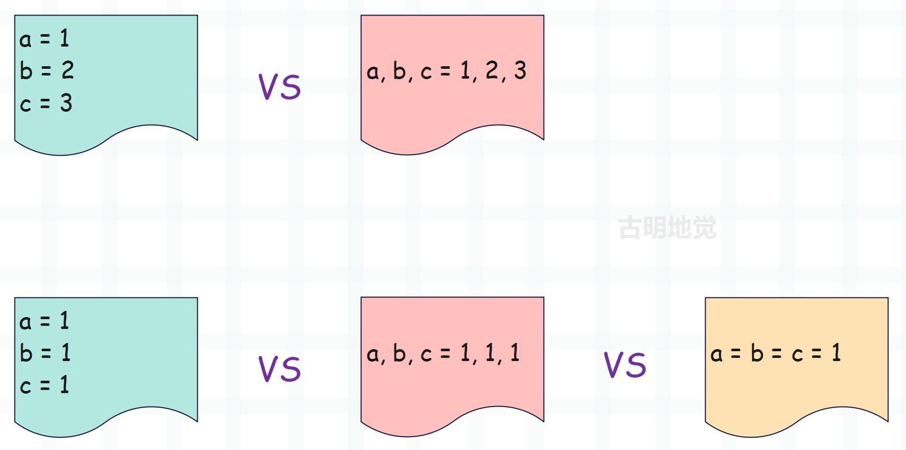

## 楔子

前面我们考察了虚拟机执行字节码指令的原理，那么本篇文章就来看看这些指令对应的逻辑是怎样的，每个指令都做了哪些事情。当然啦，由于字节码指令有一两百个，我们没办法逐一分析，这里会介绍一些常见的。至于其它的指令，会随着学习的深入，慢慢揭晓。

介绍完常见指令之后，我们会探讨 Python 赋值语句的背后原理，并分析它们的差异。

## 常用指令

有一部分指令出现的频率极高，非常常用，我们来看一下。

+ LOAD_CONST：加载一个常量；
+ LOAD_FAST：在局部作用域中加载一个局部变量；
+ LOAD_GLOBAL：在局部作用域中加载一个全局变量或内置变量；
+ LOAD_NAME：在全局作用域中加载一个全局变量或内置变量；
+ STORE_FAST：在局部作用域中定义一个局部变量，来建立和某个对象之间的映射关系；
+ STORE_GLOBAL：在局部作用域中定义一个使用 global 关键字声明的全局变量，来建立和某个对象之间的映射关系；
+ STORE_NAME：在全局作用域中定义一个全局变量，来建议和某个对象之间的映射关系；

我们举例说明：

~~~Python
import dis

name = "古明地觉"

def foo():
    age = 16
    print(age)
    global name
    print(name)
    name = "古明地恋"

dis.dis(foo)
"""
  6           0 LOAD_CONST               1 (16)
              2 STORE_FAST               0 (age)

  7           4 LOAD_GLOBAL              0 (print)
              6 LOAD_FAST                0 (age)
              8 CALL_FUNCTION            1
             10 POP_TOP

  9          12 LOAD_GLOBAL              0 (print)
             14 LOAD_GLOBAL              1 (name)
             16 CALL_FUNCTION            1
             18 POP_TOP

 10          20 LOAD_CONST               2 ('古明地恋')
             22 STORE_GLOBAL             1 (name)
             24 LOAD_CONST               0 (None)
             26 RETURN_VALUE
"""
~~~

**我们看到 age = 16 对应两条字节码指令。**

- LOAD_CONST：加载一个常量，这里是 16；
- STORE_FAST：在局部作用域中创建一个局部变量，这里是 age；

**print(age) 对应四条字节码指令。**

- LOAD_GLOBAL：在局部作用域中加载一个全局变量或内置变量，这里是 print；
- LOAD_FAST：在局部作用域中加载一个局部变量，这里是 age；
- CALL_FUNCTION：函数调用；
- POP_TOP：从栈顶弹出返回值；

**print(name) 对应四条字节码指令。**

- LOAD_GLOBAL：在局部作用域中加载一个全局变量或内置变量，这里是 print；
- LOAD_GLOBAL：在局部作用域中加载一个全局变量或内置变量，这里是 name；
- CALL_FUNCTION：函数调用；
- POP_TOP：从栈顶弹出返回值；

**name = "古明地恋" 对应两条字节码指令。**

- LOAD_CONST：加载一个常量，这里是 "古明地恋"；
- STORE_GLOBAL：在局部作用域中创建一个 global 关键字声明的全局变量，这里是 name；

这些指令非常常见，因为它们和常量、变量的加载，以及变量的定义密切相关，你写的任何代码在反编译之后都少不了它们的身影。

> 注：不管加载的是常量、还是变量，得到的永远是指向对象的指针。

## 变量赋值的具体细节

这里再通过变量赋值感受一下字节码的执行过程，首先关于变量赋值，你平时是怎么做的呢？

这些赋值语句背后的原理是什么呢？我们通过字节码来逐一回答。

**1）a, b = b, a 的背后原理是什么？**

想要知道背后的原理，查看它的字节码是我们最好的选择。

~~~C
  1           0 LOAD_NAME                0 (b)
              2 LOAD_NAME                1 (a)
              4 ROT_TWO
              6 STORE_NAME               1 (a)
              8 STORE_NAME               0 (b)
             10 LOAD_CONST               0 (None)
             12 RETURN_VALUE
~~~

里面关键的就是 ROT_TWO 指令，虽然我们还没看这个指令，但也能猜出来它负责交换栈里面的两个元素。假设 a 和 b 的值分别为 22、33，看一下运行时栈的变化过程。

示意图还是很好理解的，关键就在于 ROT_TWO 指令，它是怎么交换元素的呢？

~~~C
case TARGET(ROT_TWO): {
    // 获取栈顶元素
    PyObject *top = TOP();
    // 获取从栈顶开始的第二个元素（栈底元素）
    PyObject *second = SECOND();
    // 将栈顶元素设置为 second，将栈的第二个元素设置为 top
    // 完成两个元素之间的交换
    SET_TOP(second);
    SET_SECOND(top);
    FAST_DISPATCH();
}
~~~

执行 ROT_TWO 指令之前，栈里有两个元素，栈顶元素是 a，栈底元素是 b。执行 ROT_TWO 指令之后，栈顶元素是 b，栈底元素是 a。然后后面的两个 STORE_NAME 会将栈里面的元素 b、a 依次弹出，赋值给 a、b，从而完成变量交换。

**2）a, b, c = c, b, a 的背后原理是什么？**

老规矩，还是查看字节码，因为一切真相都隐藏在字节码当中。

~~~C
  1           0 LOAD_NAME                0 (c)
              2 LOAD_NAME                1 (b)
              4 LOAD_NAME                2 (a)
              6 ROT_THREE
              8 ROT_TWO
             10 STORE_NAME               2 (a)
             12 STORE_NAME               1 (b)
             14 STORE_NAME               0 (c)
             16 LOAD_CONST               0 (None)
             18 RETURN_VALUE
~~~

整个过程和 a, b = b, a 是相似的，首先 LOAD_NAME 将变量 c、b、a 依次压入栈中。由于栈先入后出的特性，此时栈的三个元素按照顺序（从栈顶到栈底）分别是 a、b、c。然后是 ROT_THREE 和 ROT_TWO，毫无疑问，这两个指令执行完之后，会将栈的三个元素调换顺序，也就是将 a、b、c 变成 c、b、a。最后 STORE_NAME 将栈的三个元素 c、b、a 依次弹出，分别赋值给 a、b、c，从而完成变量的交换。

因此核心就在 ROT_THREE 和 ROT_TWO 上面，由于后者上面已经说过了，所以我们看一下 ROT_THREE。

~~~C
case TARGET(ROT_THREE): {
    PyObject *top = TOP();
    PyObject *second = SECOND();
    PyObject *third = THIRD();
    SET_TOP(second);
    SET_SECOND(third);
    SET_THIRD(top);
    FAST_DISPATCH();
}
~~~

栈顶元素是 top、栈的第二个元素是 second、栈的第三个元素是 third，然后将栈顶元素设置为 second、栈的第二个元素设置为 third、栈的第三个元素设置为 top。所以栈里面的 a、b、c 在经过 ROT_THREE 之后就变成了 b、c、a，显然这还不是正确的结果。于是继续执行 ROT_TWO，将栈的前两个元素进行交换，执行完之后就变成了 c、b、a。

假设 a、b、c 的值分别为 "a"、"b"、"c"，整个过程如下：

对于多元赋值来说，解释器的做法是固定的，首先按照从左往右的顺序，将等号右边的变量依次压入栈中，然后在栈里面对元素做处理，最后再将栈里的元素弹出，仍旧按照从左往右的顺序，依次赋值给等号左边的变量。

另外这里为了交换栈里的三个元素，使用了两个指令，但其实一个指令就够了，只需将栈顶元素和栈底元素进行交换即可，因为中间的元素是不需要动的。而在之后的版本中，官方优化了这个逻辑。

**3）a, b, c, d = d, c, b, a 的背后原理是什么？它和上面提到的 1）和 2）有什么区别呢？**

我们还是看一下字节码。

~~~C
  1           0 LOAD_NAME                0 (d)
              2 LOAD_NAME                1 (c)
              4 LOAD_NAME                2 (b)
              6 LOAD_NAME                3 (a)
              8 BUILD_TUPLE              4
             10 UNPACK_SEQUENCE          4
             12 STORE_NAME               3 (a)
             14 STORE_NAME               2 (b)
             16 STORE_NAME               1 (c)
             18 STORE_NAME               0 (d)
             20 LOAD_CONST               0 (None)
             22 RETURN_VALUE
~~~

将等号右边的变量，按照从左往右的顺序，依次压入栈中，但此时没有直接将栈里面的元素做交换，而是构建一个元组。因为往栈里面压入了四个元素，所以 BUILD_TUPLE 后面的 oparg 是 4，表示构建长度为 4 的元组。

~~~C
case TARGET(BUILD_TUPLE): {
    // 元素从栈顶到栈底依次是 a、b、c、d
    PyObject *tup = PyTuple_New(oparg);
    if (tup == NULL)
        goto error;
    // 将元素依次弹出，弹出的顺序也是 a、b、c、d
    // 但是注意循环，元素是从后往前设置的
    // 所以 item[3], item[2], item[1], item[0] = a, b, c, d
    while (--oparg >= 0) {
        PyObject *item = POP();
        PyTuple_SET_ITEM(tup, oparg, item);
    }
    // 将元组 item 压入栈中，元组为 (d, c, b, a)
    PUSH(tup);
    DISPATCH();
}
~~~

此时栈里面只有一个元素，指向一个元组。接下来是 UNPACK_SEQUENCE，负责对序列进行解包，它的指令参数也是 4，表示要解包的序列的长度为 4，我们来看看它的逻辑。

~~~C
case TARGET(UNPACK_SEQUENCE): {
    PREDICTED(UNPACK_SEQUENCE);
    // seq：从栈里面弹出的元组 (d, c, b, a)
    // item：用于遍历元素
    // items：指向一个 PyObject * 类型的数组
    PyObject *seq = POP(), *item, **items;
    if (PyTuple_CheckExact(seq) &&
        PyTuple_GET_SIZE(seq) == oparg) {
        // 获取元组内部的 ob_item 字段，元素就存储在它指向的数组中
        items = ((PyTupleObject *)seq)->ob_item;
        // 遍历内部的每一个元素，并依次压入栈中
        // 由于是从后往前遍历的，所以遍历的元素依次是 a b c d
        // 但在压入栈中之后，元素从栈顶到栈底就变成了 d c b a
        while (oparg--) {
            item = items[oparg];
            Py_INCREF(item);
            PUSH(item);
        }
    } else if (PyList_CheckExact(seq) &&
               PyList_GET_SIZE(seq) == oparg) {
        // 该指令同样适用于列表，逻辑一样（一会儿会看到）
        items = ((PyListObject *)seq)->ob_item;
        while (oparg--) {
            item = items[oparg];
            Py_INCREF(item);
            PUSH(item);
        }
    } 
    // ...
    Py_DECREF(seq);
    DISPATCH();
}
~~~

最后 STORE_NAME 将 d c b a 依次弹出，赋值给变量 a b c d，从而完成变量交换。所以当交换的变量多了之后，不会直接在运行时栈里面操作，而是将栈里面的元素挨个弹出，构建元组；然后再按照指定顺序，将元组里面的元素重新压到栈里面。

假设变量 a b c d 的值分别为 1 2 3 4，我们画图来描述一下整个过程。

不管是哪一种做法，Python 在进行变量交换时所做的事情是不变的，核心分为三步走。首先将等号右边的变量，按照从左往右的顺序，依次压入栈中；然后对运行时栈里面元素的顺序进行调整；最后再将运行时栈里面的元素挨个弹出，还是按照从左往右的顺序，再依次赋值给等号左边的变量。

只不过当变量不多时，调整元素位置会直接基于栈进行操作；而当达到四个时，则需要额外借助于元组。

然后多元赋值也是同理，比如 a, b, c = 1, 2, 3，看一下它的字节码。

~~~C
  1           0 LOAD_CONST               0 ((1, 2, 3))
              2 UNPACK_SEQUENCE          3
              4 STORE_NAME               0 (a)
              6 STORE_NAME               1 (b)
              8 STORE_NAME               2 (c)
             10 LOAD_CONST               1 (None)
             12 RETURN_VALUE
~~~

元组直接作为一个常量被加载进来了，然后解包，再依次赋值。

**4）a, b, c, d = d, c, b, a 和 a, b, c, d = [d, c, b, a] 有区别吗？**

答案是没有区别，两者在反编译之后对应的字节码指令只有一处不同。

~~~C
  1           0 LOAD_NAME                0 (d)
              2 LOAD_NAME                1 (c)
              4 LOAD_NAME                2 (b)
              6 LOAD_NAME                3 (a)
              8 BUILD_LIST               4
             10 UNPACK_SEQUENCE          4
             12 STORE_NAME               3 (a)
             14 STORE_NAME               2 (b)
             16 STORE_NAME               1 (c)
             18 STORE_NAME               0 (d)
             20 LOAD_CONST               0 (None)
             22 RETURN_VALUE
~~~

前者是 BUILD_TUPLE，现在变成了 BUILD_LIST，其它部分一模一样，并且解包用的依旧是 UNPACK_SEQUENCE 指令，所以两者的效果是相同的。当然啦，由于元组的构建比列表快一些，因此还是推荐第一种写法。

**5）a = b = c = 123 背后的原理是什么？**

如果变量 a、b、c 指向的值相同，比如都是 123，那么便可以通过这种方式进行链式赋值。那么它背后是怎么做的呢？

~~~C
  1           0 LOAD_CONST               0 (123)
              2 DUP_TOP
              4 STORE_NAME               0 (a)
              6 DUP_TOP
              8 STORE_NAME               1 (b)
             10 STORE_NAME               2 (c)
             12 LOAD_CONST               1 (None)
             14 RETURN_VALUE
~~~

出现了一个新的字节码指令 DUP_TOP，只要搞清楚它的作用，事情就简单了。

~~~C
case TARGET(DUP_TOP): {
    // 获取栈顶元素，注意是获取、不是弹出
    // TOP：查看元素，POP：弹出元素
    PyObject *top = TOP();
    // 增加指向对象的引用计数
    Py_INCREF(top);
    // 压入栈中
    PUSH(top);
    FAST_DISPATCH();
}
~~~

所以 DUP_TOP 干的事情就是将栈顶元素拷贝一份，再重新压到栈里面。另外不管链式赋值语句中有多少个变量，模式都是一样的。

我们以 a = b = c = d = e = 123 为例：

~~~C
  1           0 LOAD_CONST               0 (123)
              2 DUP_TOP
              4 STORE_NAME               0 (a)
              6 DUP_TOP
              8 STORE_NAME               1 (b)
             10 DUP_TOP
             12 STORE_NAME               2 (c)
             14 DUP_TOP
             16 STORE_NAME               3 (d)
             18 STORE_NAME               4 (e)
             20 LOAD_CONST               1 (None)
             22 RETURN_VALUE
~~~

将常量压入运行时栈，然后拷贝一份，赋值给 a；再拷贝一份，赋值给 b；再拷贝一份，赋值给 c；再拷贝一份，赋值给 d；最后自身赋值给 e。

> 当然啦，虽然 Python 一切皆对象，但拿到的都是指向对象的指针，所以这里拷贝的是指针。

以上就是链式赋值的秘密，其实没有什么好神奇的，就是将栈顶元素进行拷贝，再依次赋值。但是这背后有一个坑，就是给变量赋的值不能是可变对象，否则容易造成 BUG。

~~~Python
a = b = c = {}

a["ping"] = "pong"
print(a)  # {'ping': 'pong'}
print(b)  # {'ping': 'pong'}
print(c)  # {'ping': 'pong'}
~~~

虽然 Python 一切皆对象，但对象都是通过指针来间接操作的。所以 DUP_TOP 是将字典的地址拷贝一份，而字典只有一个，因此最终 a、b、c 会指向同一个字典。

**6）a is b 和 a == b 的区别是什么？**

is 用于判断两个变量是不是引用同一个对象，也就是保存的对象的地址是否相等；而 == 则是判断两个变量引用的对象是否相等，等价于 a.\_\_eq\_\_(b) 。

> Python 的变量在 C 看来只是一个指针，因此两个变量是否指向同一个对象，等价于 C 中的两个指针存储的地址是否相等；
>
> 而 Python 的 ==，则需要调用 PyObject_RichCompare，来比较它们指向的对象所维护的值是否相等。

这两个语句的字节码指令是一样的，唯一的区别就是指令 COMPARE_OP 的参数不同。

~~~C
              // a is b
  1           0 LOAD_NAME                0 (a)
              2 LOAD_NAME                1 (b)
              4 COMPARE_OP               8 (is)
              6 POP_TOP
              8 LOAD_CONST               0 (None)
             10 RETURN_VALUE
  
              // a == b
  1           0 LOAD_NAME                0 (a)
              2 LOAD_NAME                1 (b)
              4 COMPARE_OP               2 (==)
              6 POP_TOP
              8 LOAD_CONST               0 (None)
             10 RETURN_VALUE      
~~~

我们看到指令参数一个是 8、一个是 2，然后是 COMPARE_OP 指令的背后逻辑：

~~~C
case TARGET(COMPARE_OP): {
    // 弹出栈顶元素，这里是 b
    PyObject *right = POP();
    // 显然 left 就是 a，因为 b 被弹出之后，a 就成为了新的栈顶元素
    PyObject *left = TOP();
    // 进行比较，比较结果为 res
    PyObject *res = cmp_outcome(tstate, oparg, left, right);
    // 减少 left 和 right 引用计数
    Py_DECREF(left);
    Py_DECREF(right);
    // 将栈顶元素替换为 res
    SET_TOP(res);
    if (res == NULL)
        goto error;
    // 指令预测，暂时不用管，等介绍 if 控制流的时候再说
    PREDICT(POP_JUMP_IF_FALSE);
    PREDICT(POP_JUMP_IF_TRUE);
    DISPATCH();
}
~~~

所以逻辑很简单，核心就在 cmp_outcome 函数中。

~~~C
// Python/ceval.c
static PyObject *
cmp_outcome(PyThreadState *tstate, int op, PyObject *v, PyObject *w)
{
    int res = 0;
    // op 就是 COMPARE_OP 指令的参数
    switch (op) {
    // PyCmp_IS 是一个枚举变量，等于 8，定义在 Include/opcode.h 中
    // 而 is 关键字，在 C 的层面就是一个 == 判断
    case PyCmp_IS:
        res = (v == w);
        break;
    // is not 则对应 !=
    case PyCmp_IS_NOT:
        res = (v != w);
        break;
    // in 关键字
    case PyCmp_IN:
        res = PySequence_Contains(w, v);
        if (res < 0)
            return NULL;
        break;
    // not in 关键字
    case PyCmp_NOT_IN:
        res = PySequence_Contains(w, v);
        if (res < 0)
            return NULL;
        res = !res;
        break;
    // except 关键字
    case PyCmp_EXC_MATCH:
        if (PyTuple_Check(w)) {
            Py_ssize_t i, length;
            length = PyTuple_Size(w);
            for (i = 0; i < length; i += 1) {
                PyObject *exc = PyTuple_GET_ITEM(w, i);
                if (!PyExceptionClass_Check(exc)) {
                    _PyErr_SetString(tstate, PyExc_TypeError,
                                     CANNOT_CATCH_MSG);
                    return NULL;
                }
            }
        }
        else {
            if (!PyExceptionClass_Check(w)) {
                _PyErr_SetString(tstate, PyExc_TypeError,
                                 CANNOT_CATCH_MSG);
                return NULL;
            }
        }
        res = PyErr_GivenExceptionMatches(v, w);
        break;
    default:
        // 剩下的走 PyObject_RichCompare 逻辑
        // 这是一个函数调用，比较对象维护的值是否相等
        return PyObject_RichCompare(v, w, op);
    }
    v = res ? Py_True : Py_False;
    Py_INCREF(v);
    return v;
}
~~~

我们实际举个栗子：

~~~Python
a = 3.14
b = float("3.14")
print(a is b)  # False
print(a == b)  # True
~~~

a 和 b 都是 3.14，两者是相等的，但不是同一个对象。

反过来也是如此，如果 a is b 成立，那么 a == b 也不一定成立。可能有人好奇，a is b 成立说明 a 和 b 指向的是同一个对象，那么 a == b 表示该对象和自己进行比较，结果应该始终是相等的呀，为啥也不一定成立呢？以下面两种情况为例：

~~~Python
class Girl:

    def __eq__(self, other):
        return False

g = Girl()
print(g is g)  # True
print(g == g)  # False
~~~

\_\_eq\_\_ 返回 False，此时虽然是同一个对象，但是两者不相等。

~~~Python
import math
import numpy as np

a = float("nan")
b = math.nan
c = np.nan
print(a is a, a == a)  # True False
print(b is b, b == b)  # True False
print(c is c, c == c)  # True False
~~~

nan 是一个特殊的浮点数，意思是 not a number（不是一个数字），用于表示空值。而 nan 和所有数字的比较结果均为 False，即使是和它自身比较。

但需要注意的是，在使用 == 进行比较的时候虽然是不相等的，但如果放到容器里面就不一定了。举个例子：

~~~Python
import numpy as np

lst = [np.nan, np.nan, np.nan]
print(lst[0] == np.nan)  # False
print(lst[1] == np.nan)  # False
print(lst[2] == np.nan)  # False
# lst 里面的三个元素和 np.nan 均不相等

# 但是 np.nan 位于列表中，并且数量是 3
print(np.nan in lst)  # True
print(lst.count(np.nan))  # 3
~~~

出现以上结果的原因就在于，元素被放到了容器里，而容器的一些 API 在比较元素时会先判定它们存储的对象的地址是否相同，即：是否指向了同一个对象。如果是，直接认为相等；否则，再去比较对象维护的值是否相等。可以理解为先进行 is 判断，如果结果为 True，直接判定两者相等；如果 is 操作的结果不为 True，再去进行 == 判断。

因此 np.nan in lst 的结果为 True，lst.count(np.nan) 的结果是 3，因为它们会先比较对象的地址。地址相同，则直接认为对象相等。

> 在用 pandas 做数据处理的时候，nan 是一个非常容易坑的地方。

提到 is 和 ==，那么问题来了，在和 True、False、None 比较时，是用 is 还是用 == 呢？由于 True、False、None 它们不仅是关键字，而且也被看做是一个常量，最重要的是它们都是单例的，所以我们应该用 is 判断。

另外 is 在底层只需要一个 == 即可完成，但 Python 的 ==，在底层则需要调用 PyObject_RichCompare 函数。因此 is 在速度上也更有优势，== 操作肯定比函数调用要快。

> 补充：判断对象是否相等，底层有两个常用的函数，分别是 PyObject_RichCompare 和 PyObject_RichCompareBool。
>
> PyObject_RichCompare 是直接比较对象的值是否相等。而 PyObject_RichCompareBool 会先比较地址是否相等（即是否是同一个对象），如果是同一个对象，那么直接认为相等，否则再调用 PyObject_RichCompare 判断值是否相等。
>
> 对于容器的一些 API，在比较对象是否相等时，调用的都是 PyObject_RichCompareBool。

## 小结

以上我们就分析了常见的几个指令，以及变量赋值的底层逻辑，怎么样，是不是对 Python 有更深的理解了呢。

-----

&nbsp;

**欢迎大家关注我的公众号：古明地觉的编程教室。**

**如果觉得文章对你有所帮助，也可以请作者吃个馒头，Thanks♪(･ω･)ﾉ。**

