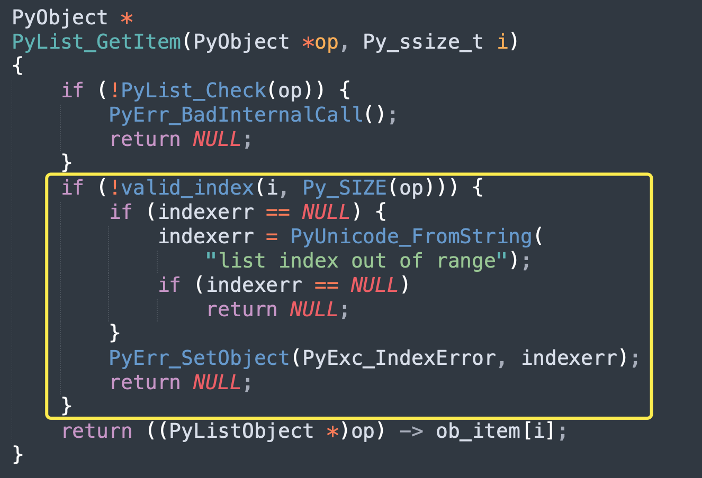
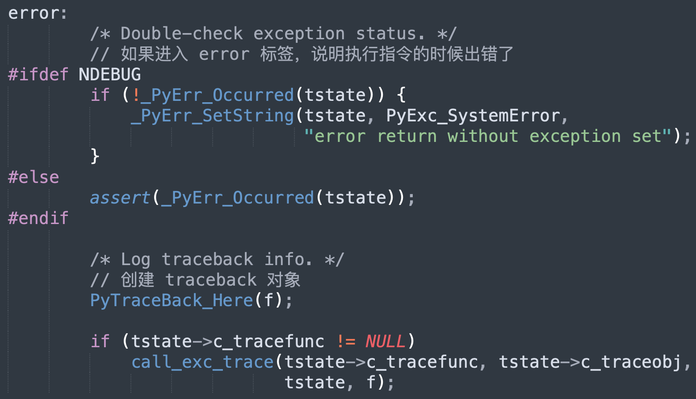
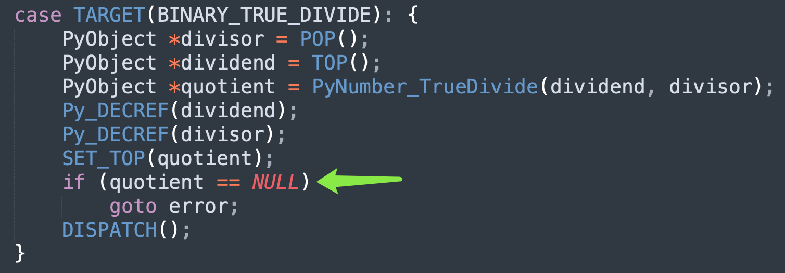
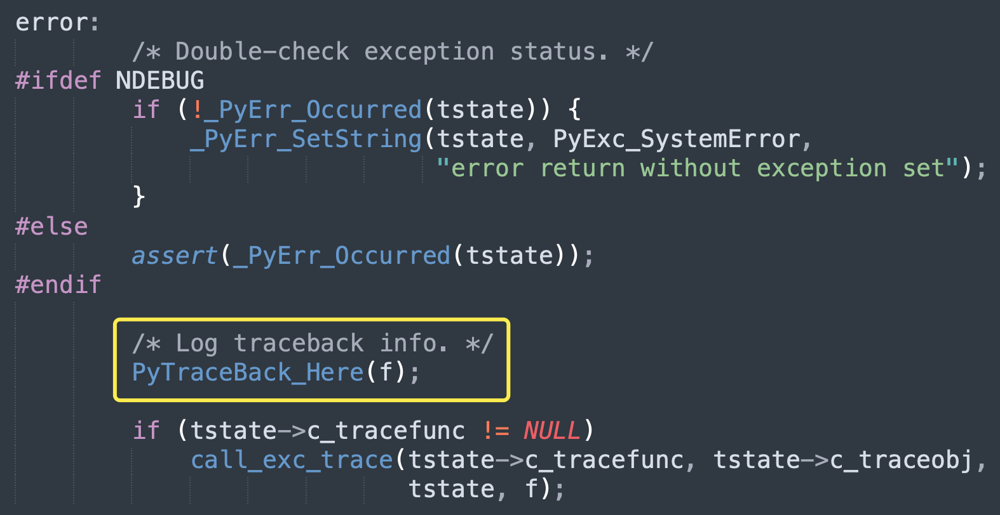
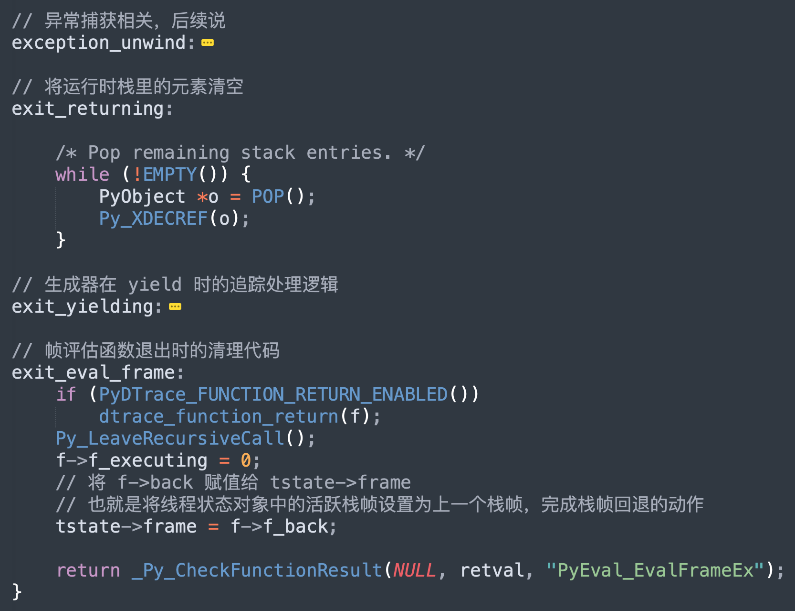
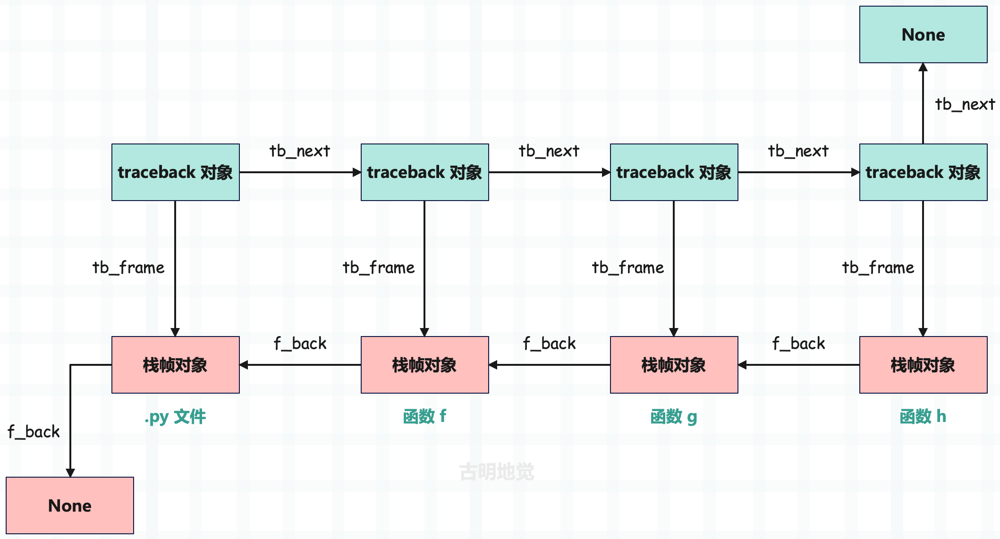
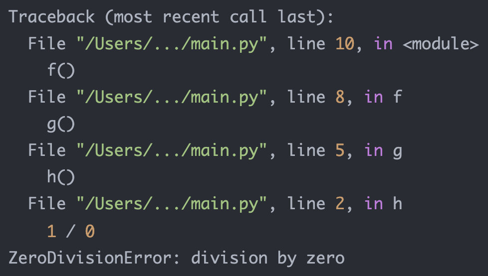

## 楔子

程序在运行的过程中，总是会不可避免地产生异常，此时为了让程序不中断，必须要将异常捕获掉。如果能提前得知可能会发生哪些异常，建议使用精确捕获，如果不知道会发生哪些异常，则使用 Exception 兜底。

另外异常也可以用来传递信息，比如生成器。

```Python
def gen():
    yield 1
    yield 2
    return "result"

g = gen()
next(g)
next(g)
try:
    next(g)
except StopIteration as e:
    print(f"返回值: {e.value}")   # 返回值: result
```

如果想要拿到生成器的返回值，我们需要让它抛出 StopIteration，然后进行捕获，再通过 value 属性拿到返回值。所以，Python 是将生成器的返回值封装到了异常里面。

之所以举这个例子，目的是想说明，异常并非是让人嗤之以鼻的东西，它也可以作为信息传递的载体。特别是在 Java 语言中，引入了 checked exception，方法的所有者还可以声明自己会抛出什么异常，然后调用者对异常进行处理。在 Java 程序启动时，抛出大量异常都是司空见惯的事情，并在相应的调用堆栈中将信息完整地记录下来。至此，Java 的异常不再是异常，而是一种很普遍的结构，从良性到灾难性都有所使用，异常的严重性由调用者来决定。

虽然在 Python 里面，异常还没有达到像 Java 异常那么高的地位，但使用频率也是很高的，下面我们就来剖析一下异常是怎么实现的？

## 异常的本质是什么？

<font color="blue">Python 解释器 = Python 编译器 + Python 虚拟机</font>，所以异常可以由编译器抛出，也可以由虚拟机剖出。如果是编译器抛出的异常，那么基本上都是 SyntaxError，即语法错误。

```python
try:
    >>>
except Exception as e:
    print(e)
```

比如上面这段代码，你会发现异常捕获根本没用，因为这是编译阶段就发生的错误，而异常捕获是在运行时进行的。当然语法不对属于低级错误，所以不会留到运行时。

然后是运行时产生的异常：

```Python
try:
    1 / 0
except ZeroDivisionError:
    print("Division by zero")
```

像这种语法正确，但程序执行时因逻辑出现问题而导致的异常，是可以被捕获的。对于我们来说，关注的显然是运行时产生的异常，比如 TypeError、IndexError 等等。

那么问题来了，异常本质上是什么呢？我们以列表为例，看看 IndexError 是怎么产生的。

```Python
lst = [1, 2, 3]
print(lst[3])
"""
IndexError: list index out of range
"""
```

列表的最大索引是 2，但我们访问了索引为 3 的元素，虚拟机就知道不能再执行下去了，否则会访问非法内存。因此虚拟机的做法是：输出异常信息，结束进程。我们通过源码来验证一下：



在获取列表元素时发现索引不合法，就知道要抛出 IndexError 了，于是将异常写入到回溯栈中，并返回 NULL。正常情况下，返回值应该指向一个合法的对象，如果为 NULL，证明出现异常了。

此时虚拟机会将回溯栈里的异常抛出来（就是我们在控制台看到的那一抹鲜红），然后结束进程，这就是异常的本质。当然异常也是一个 Python 对象，虚拟机在退出前，会写入到 stderr 中。

## 异常写入的一些 C API

当我们用 C 编写 Python 扩展时，如果想设置异常的话，该怎么做呢？首先设置异常之前，我们要知道有哪些异常。在 pyerrors.h 中，虚拟机内置了大量的异常，另外 Python 一切皆对象，因此异常也是一个对象。


有了异常之后，怎么写入呢？关于异常写入，底层也提供了相应的 C API。

+ PyErr_SetNone：设置异常，不包含提示信息。
+ PyErr_SetObject：设置异常，包含提示信息（Python 字符串）。
+ PyErr_SetString：设置异常，包含提示信息（C 字符串）。
+ PyErr_Occurred：检测回溯栈中是否有异常产生。
+ PyErr_Clear：将回溯栈中的异常清空，相当于 Python 的异常捕获。
+ PyErr_Fetch：将回溯栈中的异常清空，同时拿到它的 exc_type、exc_value、exc_tb。
+ PyErr_Restore：基于 exc_type、exc_value、exc_tb 设置异常。

我们以 PyErr_Restore 为例，看看异常的具体设置过程。

~~~C
// Python/errors.c

// PyErr_SetObject、PyErr_SetString 等等，最终都会调用 PyErr_Restore
void
PyErr_Restore(PyObject *type, PyObject *value, PyObject *traceback)
{
    // 获取线程状态对象
    PyThreadState *tstate = _PyThreadState_GET();
    _PyErr_Restore(tstate, type, value, traceback);
}

// 将异常设置在线程状态对象中
void
_PyErr_Restore(PyThreadState *tstate, PyObject *type, PyObject *value,
               PyObject *traceback)
{
    PyObject *oldtype, *oldvalue, *oldtraceback;

    if (traceback != NULL && !PyTraceBack_Check(traceback)) {
        Py_DECREF(traceback);
        traceback = NULL;
    }
    // 获取线程状态对象中已存在的异常（可能为空）
    oldtype = tstate->curexc_type;
    oldvalue = tstate->curexc_value;
    oldtraceback = tstate->curexc_traceback;

    // 将新异常设置在线程状态对象中
    tstate->curexc_type = type;
    tstate->curexc_value = value;
    tstate->curexc_traceback = traceback;
    
    // 减少旧异常的引用计数
    Py_XDECREF(oldtype);
    Py_XDECREF(oldvalue);
    Py_XDECREF(oldtraceback);
}
~~~

注意这里的 PyThreadState 对象，它是与线程相关的，但它只是线程信息的一个抽象描述，而真实的线程及状态肯定是由操作系统来维护和管理的。

但虚拟机在运行的时候总需要另外一些与线程相关的状态和信息，比如是否发生了异常等等，而这些信息显然操作系统是没办法提供的。而 PyThreadState 对象正是 Python 为线程准备的、在虚拟机层面保存线程状态信息的对象（后面简称线程状态对象、或者线程对象）。

当前活动线程（OS 原生线程）对应的 PyThreadState 对象可以通过 PyThreadState_GET 获得，在得到了线程状态对象之后，就将异常信息存放在里面。

> 关于线程相关的内容，后续会详细说。

## traceback 是什么？

帧评估函数里面有一个巨型的 switch，负责执行字节码指令，如果执行出错，那么跳转到 error 标签。



如果在执行指令的时候出现了异常，那么会跳转到 error 这里，否则会跳转到其它地方。另外当出现异常时，会在线程状态对象中将异常信息记录下来，包括异常类型、异常值、回溯栈（traceback），这个 traceback 就是在 error 标签中调用 PyTraceBack_Here 创建的。

另外可能有人不清楚 traceback 是做什么的，我们举个 Python 的例子。

~~~python
def h():
    1 / 0

def g():
    h()

def f():
    g()

f()
"""
Traceback (most recent call last):
  File "/Users/.../main.py", line 10, in <module>
    f()
  File "/Users/.../main.py", line 8, in f
    g()
  File "/Users/.../main.py", line 5, in g
    h()
  File "/Users/.../main.py", line 2, in h
    1 / 0
ZeroDivisionError: division by zero
"""
~~~

这是脚本运行时产生的错误输出，我们看到了函数调用的信息：比如在源代码的哪一行调用了哪一个函数，那么这些信息是从何而来的呢？没错，显然是 traceback 对象。虚拟机在处理异常的时候，会创建 traceback 对象，在该对象中记录栈帧的信息。虚拟机利用该对象来将栈帧链表中每一个栈帧的状态进行可视化，可视化的结果就是上面输出的异常信息。

而且我们发现输出的信息也是一个链状的结构，因为每一个栈帧都会对应一个 traceback 对象，这些 traceback 对象之间也会组成一个链表。

所以当虚拟机开始处理异常的时候，它首先的动作就是创建 traceback 对象，用于记录异常发生时活动栈帧的状态。创建方式是通过 PyTraceBack_Here 函数，它接收一个栈帧作为参数。

~~~C
// Python/traceback.c
int
PyTraceBack_Here(PyFrameObject *frame)
{
    // 获取当前的异常对象，拿到它的 exc_type、exc_val、exc_tb
    PyObject *exc, *val, *tb, *newtb;
    PyErr_Fetch(&exc, &val, &tb);
    // 创建新的 traceback 对象，并和旧的 traceback 对象组成链表
    newtb = _PyTraceBack_FromFrame(tb, frame);
    if (newtb == NULL) {
        _PyErr_ChainExceptions(exc, val, tb);
        return -1;
    }
    // 将异常设置在线程状态对象中
    // 并且异常的 exc_type 和 exc_val 保持不变，但 traceback 是新的 traceback
    PyErr_Restore(exc, val, newtb);
    Py_XDECREF(tb);
    return 0;
}
~~~

那么这个 traceback 对象究竟长什么样呢？

~~~C
// Include/cpython/traceback.h
typedef struct _traceback {
    PyObject_HEAD
    struct _traceback *tb_next;
    struct _frame *tb_frame;
    int tb_lasti;
    int tb_lineno;
} PyTracebackObject;
~~~

里面有一个 tb_next，所以很容易想到 traceback 也是一个链表结构。其实 traceback 对象的链表结构跟栈帧对象的链表结构是同构的、或者说一一对应的，即一个栈帧对象对应一个 traceback 对象。

## traceback 创建

在 PyTraceBack_Here 函数中我们看到，traceback 对象是通过 _PyTraceBack_FromFrame 创建的，那么秘密就隐藏在这个函数中。

~~~~C
// Python/traceback.c
_PyTraceBack_FromFrame(PyObject *tb_next, PyFrameObject *frame)
{
    assert(tb_next == NULL || PyTraceBack_Check(tb_next));
    assert(frame != NULL);

    return tb_create_raw((PyTracebackObject *)tb_next, frame, frame->f_lasti,
                         PyFrame_GetLineNumber(frame));
}

static PyObject *
tb_create_raw(PyTracebackObject *next, PyFrameObject *frame, int lasti,
              int lineno)
{
    PyTracebackObject *tb;
    if ((next != NULL && !PyTraceBack_Check(next)) ||
                    frame == NULL || !PyFrame_Check(frame)) {
        PyErr_BadInternalCall();
        return NULL;
    }
    // 为 traceback 对象申请内存
    tb = PyObject_GC_New(PyTracebackObject, &PyTraceBack_Type);
    if (tb != NULL) {
        // 设置属性
        Py_XINCREF(next);
        tb->tb_next = next;
        Py_XINCREF(frame);
        tb->tb_frame = frame;
        tb->tb_lasti = lasti;
        tb->tb_lineno = lineno;
        PyObject_GC_Track(tb);
    }
    return (PyObject *)tb;
}
~~~~

tb_next 将两个 traceback 连接了起来，不过这个和栈帧的 f_back 正好相反，f_back 指向的是上一个栈帧，而 tb_next 指向的是下一个 traceback。

另外在 traceback 中，还通过 tb_frame 字段和对应的 PyFrameObject 对象建立了联系，当然还有最后执行完毕时的字节码偏移量、以及在源代码中对应的行号。

## 栈帧展开

traceback 的创建我们知道了，那么它和栈帧对象是怎么联系起来的呢？我们还以之前的代码为例，来解释一下。

```python
def h():
    1 / 0

def g():
    h()

def f():
    g()

f()
```

当执行到函数 h 的 1 / 0 这行代码时，底层会执行 BINARY_TRUE_DIVIDE 指令。

```C
case TARGET(BINARY_TRUE_DIVIDE): {
    PyObject *divisor = POP();
    PyObject *dividend = TOP();
    // 调用了数值型对象的泛型 API
    PyObject *quotient = PyNumber_TrueDivide(dividend, divisor);
    Py_DECREF(dividend);
    Py_DECREF(divisor);
    SET_TOP(quotient);
    if (quotient == NULL)
        goto error;
    DISPATCH();
}

// Objects/abctract.c
PyObject *
PyNumber_TrueDivide(PyObject *v, PyObject *w)
{
    return binary_op(v, w, NB_SLOT(nb_true_divide), "/");
}

#define NB_SLOT(x) offsetof(PyNumberMethods, x)
// 最终会执行 (&PyLong_Type) -> tp_as_methods -> nb_true_divide
// 即 long_true_divice 函数，看一下它的逻辑

// Objects/longobject.c
static PyObject *
long_true_divide(PyObject *v, PyObject *w)
{
    // ...
    a_size = Py_ABS(Py_SIZE(a));
    b_size = Py_ABS(Py_SIZE(b));
    negate = (Py_SIZE(a) < 0) ^ (Py_SIZE(b) < 0);
    // 如果除数为 0，设置 ZeroDivisionError
    if (b_size == 0) {
        PyErr_SetString(PyExc_ZeroDivisionError,
                        "division by zero");
        goto error;
    }
    // ...
    error:
        return NULL;
}
```

由于除数为 0，因此会通过 PyErr_SetString 设置一个异常进去，最终将异常类型、异常值、以及 traceback 保存到线程状态对象中。然后跳转到 error 标签，注意：当前是 long_true_divide 的 error 标签，然后会返回 NULL。



当 long_true_divide 返回 NULL 时，那么变量 quotient 拿到的就是 NULL，由于没有指向一个合法的 PyObject，虚拟机就意识到发生异常了，这时候会跳转到 error 标签。注意：这个 error 标签是帧评估函数里的 error 标签。



在里面会先取出线程状态对象中已有的 traceback 对象，然后以函数 h 的栈帧为参数，创建一个新的 traceback 对象，将两者通过 tb_next 关联起来。最后，再替换掉线程状态对象里面的 traceback 对象。

在虚拟机意识到有异常抛出，并创建了 traceback 之后，它会在当前栈帧中寻找 try except 语句，来执行开发人员指定的异常捕捉动作。如果没有找到，那么虚拟机将退出当前的活动栈帧，并沿着栈帧链回退到上一个栈帧（这里是函数 g 的栈帧），在上一个栈帧中寻找 try except 语句。

就像我们之前说的，函数调用会创建栈帧，当函数执行完毕或者出现异常时，会回退到上一级栈帧。一层一层创建、一层一层返回。至于回退的这个动作，则是在 _PyEval_EvalFrameDefault 的最后完成。



当出现异常时，虚拟机会进入 exception_unwind 标签寻找异常捕获逻辑，相关细节下一篇文章再说，这里就让它抛出去。然后来到 exit_returning 标签，将运行时栈清空。最后进入 exit_eval_frame 标签，将当前线程状态对象中的活跃栈帧设置为上一级栈帧，从而完成栈帧回退的动作。

当栈帧回退时，会进入函数 g 的栈帧，由于返回值为 NULL，所以知道自己调用的函数 h 的内部发生异常了（否则返回值一定会指向一个合法的 PyObject），那么继续寻找异常捕获语句。对于当前这个例子来说，显然是找不到的，于是会从线程状态对象中取出已有的 traceback 对象（函数 h 的栈帧对应的 traceback），然后以函数 g 的栈帧为参数，创建新的 traceback 对象，再将两者通过 tb_next 关联起来，并重新设置到线程状态对象中。

异常会沿着栈帧链进行反向传播，函数 h 出现的异常被传播到了函数 g 中，显然接下来函数 g 要将异常传播到函数 f 中。因为函数 g 在无法捕获异常时，那么返回值也是 NULL，而函数 f 看到返回值为 NULL 时，同样会去寻找异常捕获语句。但是找不到，于是会从线程状态对象中取出已有的 traceback 对象（此时是函数 g 的栈帧对应的 traceback），然后以函数 f 的栈帧为参数，创建新的 traceback 对象，再将两者通过 tb_next 关联起来，并重新设置到线程状态对象中。

最后再传播到模块对应的栈帧中，如果还无法捕获发生的异常，那么虚拟机就要将异常抛出来了。

**这个沿着栈帧链不断回退的过程我们称之为<font color="blue">栈帧展开</font>，在栈帧展开的过程中，虚拟机不断地创建与各个栈帧对应的 traceback，并将其链接成链表。**



由于没有异常捕获，那么接下来会调用 PyErr_Print。然后在 PyErr_Print 中，虚拟机取出维护的 traceback 链表，并进行遍历，将里面的信息逐个输出到 stderr 当中，最终就是我们在 Python 中看到的异常信息。

并且打印顺序是：.py文件、函数f、函数g、函数h。因为每一个栈帧对应一个 traceback，而栈帧又是往后退的，因此显然会从 .py文件对应的 traceback 开始打印，然后通过 tb_next 找到函数 f 对应的 traceback，依次下去。当异常信息全部输出完毕之后，解释器就结束运行了。

因此从链路的开始位置到结束位置，将整个调用过程都输出出来，可以很方便地定位问题出现在哪里。



另外，虽然 traceback 一直在更新（因为要对整个调用链路进行追踪），但是<font color="blue">异常类型</font>和<font color="blue">异常值</font>始终是不变的，就是函数 h 中抛出的 <font color="blue">ZeroDivisionError: division by zero</font>。

## 小结

以上就是虚拟机抛异常的过程，异常在 Python 里面也是一个对象，和其它的实例对象并无本质区别。

~~~Python
exc = StopIteration("迭代结束了")
print(exc.value)  # 迭代结束了
print(exc.args)  # ('迭代结束了',)

exc = IndexError("索引越界了")
print(exc.args)  # ('索引越界了',)

exc = Exception("不知道是啥异常，总之出问题了")
print(exc.args)  # ('不知道是啥异常，总之出问题了',)

# 异常都有一个 args 属性，以元组的形式保存传递的参数
~~~

所谓抛出异常，就是将错误信息输出到 stderr 中，然后停止进程。并且除了虚拟机内部会抛出异常之外，我们还可以使用 raise 关键字手动引发一个异常。

~~~Python
def judge_score(score: int):
    if score > 100 or score < 0:
        raise ValueError("Score must be between 0 and 100")
~~~

站在虚拟机的角度，score 取任何值都是合理的，但对于我们来说，希望 score 位于 0 ~ 100。那么当 score 不满足 0 ~ 100 时，就可以手动 raise 一个异常。

-----

&nbsp;

**欢迎大家关注我的公众号：古明地觉的编程教室。**


**如果觉得文章对你有所帮助，也可以请作者吃个馒头，Thanks♪(･ω･)ﾉ。**

