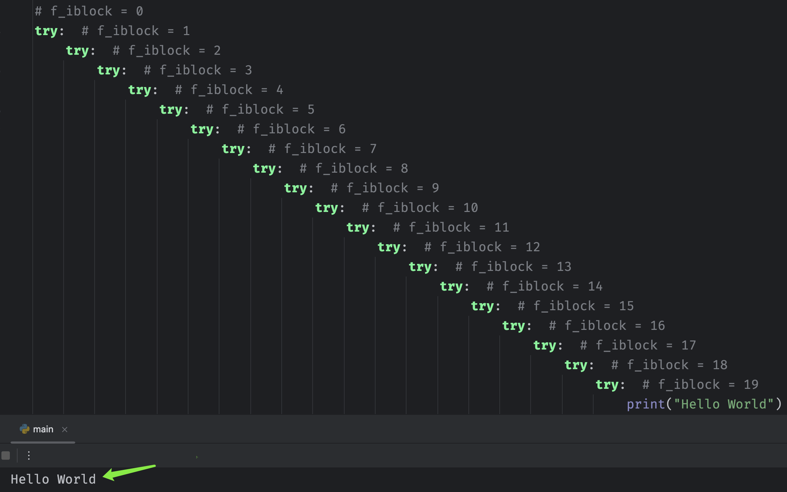
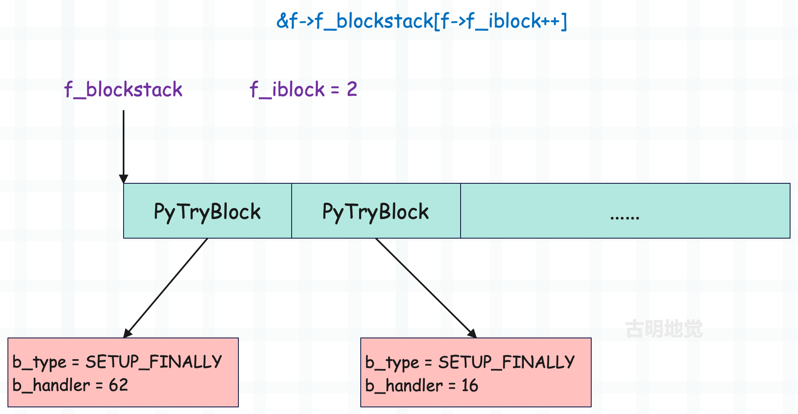

## 楔子

上一篇文章我们介绍了 Python 的异常是怎么实现的，抛出异常这个动作在虚拟机层面上是怎样的一个行为，以及虚拟机在处理异常时的栈帧展开行为。

既然虚拟机内建的异常处理动作我们已经了解了，那么接下来就看看异常捕获是如何实现的，还有它又是如何影响虚拟机的异常处理流程的。毕竟在大部分情况下，我们都不会将异常抛出去，而是将它捕获起来。

## 异常捕获语句

这里先来回顾一下异常捕获语句，首先一个完整的异常捕获语句如下。

~~~python
try:
    pass
except IndexError as e:
    pass
except Exception as e:
    pass
else:
    pass
finally:
    pass 
~~~

情况可以分为以下几种：

<font color="darkblue">**1）如果 try 里面的代码在执行时没有出现异常，那么会执行 else ，然后执行 finally。**</font>

~~~python
try:
    print("我是 try")
except Exception as e:
    print("我是 except")
else:
    print("我是 else")
finally:
    print("我是 finally")
"""
我是 try
我是 else
我是 finally
"""    
~~~

<font color="darkblue">**2）如果 try 里面的代码在执行时出现异常了（异常会被设置在线程状态对象中），那么会依次判断 except（可以有多个）能否匹配发生的异常。如果某个 except 将异常捕获了，那么会将异常给清空，然后执行 finally。**</font>

~~~python
try:
    raise IndexError("IndexError Occurred")
except ValueError as e:
    print("ValueError 匹配上了异常")
except IndexError as e:
    print("IndexError 匹配上了异常")
except Exception as e:
    print("Exception 匹配上了异常")
else:
    print("我是 else")
finally:
    print("我是 finally")
"""
IndexError 匹配上了异常
我是 finally
"""   
~~~

except 子句可以有很多个，发生异常时会从上往下依次匹配。但是注意：多个 except 子句最多只有一个被执行，比如当前的 IndexError 和 Exception 都能匹配发生的异常，但只会执行匹配上的第一个 except 子句。

另外只要发生异常了，else 就不会执行了。不管 except 有没有将异常捕获到，都不会执行 else，因为 else 只有在 try 里面没有发生异常的时候才会执行。

<font color="darkblue">**3）如果 try 里面的代码在执行时出现异常了，但 except 没有将异常捕获掉，那么异常仍然被保存在线程状态对象中，然后执行 finally。如果 finally 子句中没有出现 return、break、continue 等关键字，再将异常抛出来。**</font>

~~~python
try:
    raise IndexError("IndexError Occurred")
except ValueError:
    print("ValueError 匹配上了异常")
finally:
    print("我是 finally")
"""
我是 finally
Traceback (most recent call last):
  File "......", line 2, in <module>
    raise IndexError("IndexError Occurred")
IndexError: IndexError Occurred
"""
~~~

except 没有将异常捕获掉，所以执行完 finally 之后，异常又被抛出来了。但如果 finally 里面出现了 return、break、continue 等关键字，也不会抛出异常，而是将异常丢弃掉。

~~~python
def f():
    try:
        raise IndexError("IndexError Occurred")
    except ValueError:
        print("ValueError 匹配上了异常")
    finally:
        print("我是 finally")
        return

f()
"""
我是 finally
"""

def g():
    for i in range(3):
        try:
            raise IndexError("IndexError Occurred")
        except ValueError:
            print("ValueError 匹配上了异常")
        finally:
            print(f"我是 finally，i = {i}")
            continue

g()
"""
我是 finally，i = 0
我是 finally，i = 1
我是 finally，i = 2
"""
~~~

由于 finally 里面出现了 return 和 continue，所以异常并没有发生，而是被丢弃掉了。这个特性相信有很多小伙伴之前还是没有发现的。

然后 try、except、else、finally 这几个关键字不需要同时出现，可以有以下几种组合。

~~~python
try ... except

try ... finally

try ... except ... else

try ... except ... else ... finally
~~~

注意里面的 except，可以出现多次，但其它关键字在一个 try 语句内只能出现一次。

## 返回值问题

如果这几个关键字对应的代码块都指定了返回值，那么听谁的呢？下面解释一下。

~~~python
def retval():
    try:
        return 123
    except Exception:
        return 456

print(retval())  # 123
~~~

由于没有发生异常，所以返回了 try 指定的返回值。

```python
def retval():
    try:
        return 123
    except Exception:
        return 456
    else:
        return 789

print(retval())  # 123
```

虽然指定了 else，但是 try 里面已经执行 return 了，所以打印的仍是 try 的返回值。

~~~python
def retval():
    try:
        1 / 0
        return 123
    except Exception:
        return 456

print(retval())  # 456
~~~

由于发生异常，所以返回了 except 指定的返回值。

~~~python
def retval():
    try:
        1 / 0
        return 123
    except Exception:
        return 456
    else:
        return 789

print(retval())  # 456
~~~

一旦发生异常，else 就不可能执行，所以此时仍然返回 456。

~~~python
def retval():
    try:
        return 123
    except Exception:
        return 456
    finally:
        pass

print(retval())  # 123
~~~

finally 永远会执行，但它没有指定返回值，所以此时返回的是 123。

~~~python
def retval():
    try:
        return 123
    except Exception:
        return 456
    finally:
        return

print(retval())  # None
~~~

一旦 finally 中出现了 return，那么返回的都是 finally 指定的返回值。并且此时即便出现了没有捕获的异常，也不会报错，因为会将异常丢弃掉。

```python
def retval():
    try:
        return 123
    except Exception:
        return 456
    finally:
        pass
    return 789

print(retval())  # 123
```

函数一旦 return，就表示要返回了，但如果这个 return 是位于出现了 finally 的异常捕获语句中，那么会先执行 finally，然后再返回。所以最后的 return 789 是不会执行的，因为已经出现 return 了，finally 执行完毕之后就直接返回了。

```python
def retval():
    try:
        pass
    except Exception:
        return 456
    finally:
        pass
    return 789

print(retval())  # 789
```

没有异常，所以 except 里的 return 不会执行，而 try 和 finally 里面也没有 return，因此返回 789。

> 一个简单的异常捕获，总结起来还稍微有点绕呢。

从 Python 的层面理解完异常捕获之后，再来看看虚拟机是如何实现这一机制的？想要搞清楚这一点，还是得从字节码入手。

## 异常捕获对应的字节码

随便写一段代码，然后反编译一下。

~~~python
import dis

code_string = """
try:
    raise Exception("抛出一个异常")
except Exception as e:
    print(e)
finally:
    print("我一定会被执行的")
"""

dis.dis(compile(code_string, "exception", "exec"))
~~~

抛异常有两种方式，一种是虚拟机执行的时候出现错误而抛出异常，另一种是使用 raise 关键字手动抛出异常。这里我们就用第二种方式，来看一下反编译的结果（为了清晰，省略掉了源代码行号）。

~~~C
      0 SETUP_FINALLY           60 (to 62)
      2 SETUP_FINALLY           12 (to 16)

      4 LOAD_NAME                1 (Exception)
      6 LOAD_CONST               1 ('抛出一个异常')
      8 CALL_FUNCTION            1
     10 RAISE_VARARGS            1
     12 POP_BLOCK
     14 JUMP_FORWARD            42 (to 58)

>>   16 DUP_TOP
     18 LOAD_NAME                1 (Exception)
     20 COMPARE_OP              10 (exception match)
     22 POP_JUMP_IF_FALSE       56
     24 POP_TOP
     26 STORE_NAME               2 (e)
     28 POP_TOP
     30 SETUP_FINALLY           12 (to 44)

     32 LOAD_NAME                0 (print)
     34 LOAD_NAME                2 (e)
     36 CALL_FUNCTION            1
     38 POP_TOP
     40 POP_BLOCK
     42 BEGIN_FINALLY
>>   44 LOAD_CONST               2 (None)
     46 STORE_NAME               2 (e)
     48 DELETE_NAME              2 (e)
     50 END_FINALLY
     52 POP_EXCEPT
     54 JUMP_FORWARD             2 (to 58)
>>   56 END_FINALLY
>>   58 POP_BLOCK
     60 BEGIN_FINALLY

>>   62 LOAD_NAME                0 (print)
     64 LOAD_CONST               0 ('我一定会被执行的')
     66 CALL_FUNCTION            1
     68 POP_TOP
     70 END_FINALLY
     72 LOAD_CONST               2 (None)
     74 RETURN_VALUE
~~~

指令集还是有点复杂的，因为要分好几种情况。

+ try 里面没有出现异常。
+ try 里面出现了异常，但是 except 没有捕获到。
+ try 里面出现了异常，except 捕获到了。

但我们知道无论是哪种情况，都要执行 finally，所以开头有两个 SETUP_FINALLY 指令，但为什么会有两个呢？因为在 Python 的异常处理机制中，<font color="blue">try-except-finally</font> 结构会被编译成两个嵌套的异常处理块：

+ 第一个 SETUP_FINALLY 是为了处理 finally 块，会把 finally 块的地址压入栈中，它确保无论 try 块中是否发生异常，finally 块中的代码都会被执行；
+ 第二个 SETUP_FINALLY 实际上是在处理 except 块，在 Python 的字节码层面，except 块也是通过 SETUP_FINALLY 来实现的；

我们来看一下 SETUP_FINALLY 指令都干了什么。

~~~C
case TARGET(SETUP_FINALLY): {
    PyFrame_BlockSetup(f, SETUP_FINALLY, INSTR_OFFSET() + oparg,
                       STACK_LEVEL());
    DISPATCH();
}
~~~

该指令内部仅仅是调用了 PyFrame_BlockSetup 函数，但是参数我们需要解释一下。

+ f：当前的栈帧对象。
+ SETUP_FINALLY：指令本身，一个整数，值为 122。
+ INSTR_OFFSET()：一个宏，下一条待执行指令的偏移量，如果再加上 oparg，那么会对应 finally 子句（或 except 子句）。
+ STACK_LEVEL()：返回运行时栈的元素个数。

下面看看 PyFrame_BlockSetup 函数的本体。

~~~C
// Objects/frameobject.c

void
PyFrame_BlockSetup(PyFrameObject *f, int type, int handler, int level)
{
    // 关于 PyTryBlock 我们稍后再聊，总之 except 和 finally 都会对应 SETUP_FINALLY 指令
    // 虚拟机都会为它们创建 PyTryBlock
    PyTryBlock *b;
    // 一会儿解释
    if (f->f_iblock >= CO_MAXBLOCKS)
        Py_FatalError("XXX block stack overflow");
    // 栈帧有一个 f_blockstack 字段，它是 PyTryBlock 类型的数组
    // 当栈帧创建完毕之后，f_blockstack 的内存就已经申请好了
    // 因此当需要创建 PyTryBlock 实例时，只需从 f_blockstack 里面获取即可
    b = &f->f_blockstack[f->f_iblock++];
    // 设置 PyTryBlock 实例的属性，这个结构体一会儿说
    b->b_type = type;
    b->b_level = level;
    b->b_handler = handler;
}
~~~

当解释器发现 except 和 finally 时，在进入 try 语句块之前会先执行 SETUP_FINALLY 指令，通过索引 f_iblock 从 f_blockstack 数组中获取 PyTryBlock。

+ 每获取一个 PyTryBlock，f_iblock 会自增 1；
+ 当 except 或 finally 执行完毕时，要交还对应的 PyTryBlock，所以 f_iblock 会自减 1。

然后注意一下上面代码中的 if 条件，CO_MAXBLOCKS 是一个宏，值为 20，所以 f_iblock 的值必须小于 20。这也意味着，try 语句不能嵌套太深。我们举例说明：


每个 try 都对应一个 except，因为屏幕不够，这里只截取了一半。每次进入 try 之前，会提前执行 SETUP_FINALLY，获取 PyTryBlock。由于每获取一个，f_iblock 自增 1，而这里嵌套了 20 层，导致 f_iblock 达到了 20，所以报错了，这是一个在编译阶段就能检测出的错误。

如果我们去掉一层呢？看看报不报错。



结果没有问题，当然啦，如果不是恶意代码，我个人认为不会存在嵌套层级如此之深的异常捕获。

然后再来看看里面的 f_iblock，它表示对应的 PyTryBlock 在 f_blockstack 数组中的索引。栈帧刚创建时，f_iblock 的值为 0，每当执行 SETUP_FINALLY 执行时，就会从 f_blockstack 数组中获取一个 PyTryBlock，然后 f_iblock 自增 1。那么 PyTryBlock 长什么样子呢？

~~~C
// Include/frameobject.h
typedef struct {
    int b_type;
    int b_handler;
    int b_level;
} PyTryBlock;
~~~

b_type 表示 block 的种类，因为存在着多种用途的 PyTryBlock 对象，除了 SETUP_FINALLY 之外还有 SETUP_WITH 等。然后在 PyFrame_BlockSetup 中我们看到它被设置成了参数 type，而参数 type 接收的就是当前虚拟机正在执行的字节码指令。因此 PyTryBlock 具有多种用途，具体用于哪种则基于字节码指令进行判断。

b_handler 表示处理程序的字节码偏移量，即跳转目标，比如当前的 try 语句块，当 try 执行完了或者执行出错后，要跳转到什么位置呢？在 SETUP_FINALLY 指令中我们看到它被设置成了 <font color="blue">INSTR_OFFSET() + oparg</font>，所以它会跳转到 finally 或 except 所在的位置。

b_level 表示进入 try 语句块时的 STACK_LEVEL()，即运行时栈的深度，或者说当前运行时栈的元素个数，因为当发生异常时，要把运行时栈恢复到进入 try 语句块时的状态。

~~~python
# 假设此时运行是时栈深度是 n
try:                          # SETUP_FINALLY 执行时 b_level = n
    ...                       # 执行内部逻辑
    raise Exception("error")  # 在这里不幸发生异常，那么要将栈恢复到 b_level 记录的深度 n
except Exception:
    pass
~~~

所以 b_level 相当于一个检查点，通过 b_level，可以在发生异常时将运行时栈恢复到进入 try 时的状态。这种检查点机制确保了异常处理的可靠性，因为无论 try 块中发生什么，我们总能回到一个已知的、正确的栈状态。

然后我们再回头看开头的两个指令：

~~~C
      0 SETUP_FINALLY           60 (to 62)
      2 SETUP_FINALLY           12 (to 16)
~~~

执行之后，f_blockstack 数组的布局如下：



取出两块 PyTryBlock，第一块对应 finally，会无条件执行，第二块对应 except，异常捕获的时候用。至于具体做的稍后再说，我们先回到抛异常的地方看看。

~~~C
      // 加载 <class 'Exception'>
      4 LOAD_NAME                1 (Exception)
      // 加载字符串
      6 LOAD_CONST               1 ('抛出一个异常')
      // 尽管 Exception 是一个类，但调用的指令也同样是 CALL_FUNCTION
      // 至于这个指令的具体细节后面会介绍
      // 这里只需要知道一个异常对象已经被创建出来了，并被压入了运行时栈
      8 CALL_FUNCTION            1
      // 从运行时栈中弹出异常对象，然后抛出
     10 RAISE_VARARGS            1
~~~

下面我们来看一下 RAISE_VARARGS 指令。

~~~C
case TARGET(RAISE_VARARGS): {
    PyObject *cause = NULL, *exc = NULL;
    // raise 一个异常有三种方式
    // 1）重新抛出当前异常，只写一个 raise 即可，此时 oparg = 0
    // 2）抛出指定异常，raise exc，此时 oparg = 1
    // 3）抛出执行异常并指定原因：raise exc from cause，此时 oparg = 2
    // 所以当前的 oparg = 1
    switch (oparg) {
    case 2:
        cause = POP(); /* cause */
        /* fall through */
    case 1:
        exc = POP(); /* exc */
        /* fall through */
    case 0:
        // 调用 do_raise 函数，将异常设置在线程状态对象中
        if (do_raise(tstate, exc, cause)) {
            goto exception_unwind;
        }
        break;
    default:
        _PyErr_SetString(tstate, PyExc_SystemError,
                         "bad RAISE_VARARGS oparg");
        break;
    }
    goto error;
}
~~~

当异常设置完毕后，我们看到它跳转到了帧评估函数的 exception_unwind 标签，执行异常捕获。

~~~C
exception_unwind:
    // 虚拟机在进入 try 代码块之前，会为 except 和 finally 块创建 PyTryBlock
    // 对于当前来说，由于同时指定了 except 和 finally，因此会存在两个 PyTryBlock
    // 所以 f->f_iblock 的值为 2
    while (f->f_iblock > 0) {
        // 弹出 PyTryBlock，因为 except 在后面，所以要从后往前获取
        PyTryBlock *b = &f->f_blockstack[--f->f_iblock];
        
        // EXCEPT_HANDLER 定义在 opcode.h 中，值为 257，用于异常处理
        // 但比较特殊的是，它不是一个指令
        if (b->b_type == EXCEPT_HANDLER) {
            // 这是一个宏，所做的事情如下
            // 从线程状态对象中拿到 exc_info，这个和 python 里的 sys.exc_info() 等价
            // 然后从栈顶弹出 exc_type、exc_value、exc_traceback，并设置在 exc_info 中
            UNWIND_EXCEPT_HANDLER(b);
            continue;
        }
        // UNWIND_BLOCK 是一个宏，所做的事情如下
        /*
            // 当前栈深度大于进入 try 块时记录的深度时
            // 不断从栈顶弹出对象，并减少引用计数
            #define UNWIND_BLOCK(b) \
                while (STACK_LEVEL() > (b)->b_level) { \
                    PyObject *v = POP(); \
                    Py_XDECREF(v); \
                }
        */
        // 这个 b_level 我们上面说过的，它保存了进入 try 块时的运行时栈的深度
        // 因此这个宏就是用来倒掉多余的栈内容，把栈恢复到之前保存的检查点状态
        UNWIND_BLOCK(b);
        // 对于当前的代码而言，第一次弹出的 PyTryBlock 用于 except
        // 它的 b_type = SETUP_FINALLY，b_handler = 16
        if (b->b_type == SETUP_FINALLY) {
            // 异常类型、异常值、回溯栈
            PyObject *exc, *val, *tb;
            // 拿到 b_handler，一会要跳转的目标位置，也就是 except 所在位置
            int handler = b->b_handler;
            // 从线程状态对象中拿到 exc_info，它有三个属性，假设抛出的异常是 ValueError("值错了")
            // exc_info->exc_type 属性就是 <class 'ValueError'>
            // exc_info->exc_value 就是抛出的异常对象本身
            // exc_info->exc_traceback 就是回溯栈
            // exc_info->previous_item 指向上一个 previous_item
            // 这个 exc_info 保存的还是旧异常的 exc_info
            _PyErr_StackItem *exc_info = tstate->exc_info;
            // 将当前 PyTryBlock 的 b_type 设置为 EXCEPT_HANDLER
            PyFrame_BlockSetup(f, EXCEPT_HANDLER, -1, STACK_LEVEL());
            // 将旧异常的 exc_type、exc_value、exc_traceback 压入运行时栈
            PUSH(exc_info->exc_traceback);
            PUSH(exc_info->exc_value);
            if (exc_info->exc_type != NULL) {
                PUSH(exc_info->exc_type);
            }
            else {
                Py_INCREF(Py_None);
                PUSH(Py_None);
            }
            // 在 RAISE_VARARGS 指令中调用了 do_raise，设置了新异常
            // 这里是拿到新异常的 exc_type、exc_value、exc_traceback
            _PyErr_Fetch(tstate, &exc, &val, &tb);
            // 对异常规范化处理，不用关注
            _PyErr_NormalizeException(tstate, &exc, &val, &tb);
            if (tb != NULL)
                PyException_SetTraceback(val, tb);
            else
                PyException_SetTraceback(val, Py_None);
            // 用新异常的 exc_type、exc_value、exc_traceback 更新 exc_info
            Py_INCREF(exc);
            exc_info->exc_type = exc;
            Py_INCREF(val);
            exc_info->exc_value = val;
            exc_info->exc_traceback = tb;
            if (tb == NULL)
                tb = Py_None;
            Py_INCREF(tb);
            // 将新异常的 exc_type、exc_value、exc_traceback 也压入运行时栈
            PUSH(tb);
            PUSH(val);
            PUSH(exc);
            // 绝对跳转，跳转偏移量为 handler 的指令
            JUMPTO(handler);
            /* Resume normal execution */
            goto main_loop;
        }
    } /* unwind stack */

    /* End the loop as we still have an error */
    break;
} /* main loop */

assert(retval == NULL);
assert(_PyErr_Occurred(tstate));
~~~

我们看到虚拟机调用 PUSH 将旧异常和新异常的 exc_traceback、exc_value、exc_type 分别压入运行时栈中，并且知道此时开发者已经为异常处理做好了准备，所以接下来的异常处理工作，则需要交给开发者指定的代码来解决。于是内部调用了 `JUMPTO(b->b_handler)`，将虚拟机将要执行的下一条指令设置为异常处理代码编译后所得到的第一条字节码指令。

因为第一个弹出的是 PyTryBlock 的 b_handler 为 16，那么虚拟机将要执行的下一条指令就是偏移量为 16 的那条指令，而这条指令就是 DUP_TOP，异常处理代码对应的第一条字节码指令。

~~~C
>>   16 DUP_TOP
     18 LOAD_NAME                1 (Exception)
     20 COMPARE_OP              10 (exception match)
     22 POP_JUMP_IF_FALSE       56
     24 POP_TOP
     26 STORE_NAME               2 (e)
     28 POP_TOP
     30 SETUP_FINALLY           12 (to 44)

     32 LOAD_NAME                0 (print)
     34 LOAD_NAME                2 (e)
     36 CALL_FUNCTION            1
     38 POP_TOP
     40 POP_BLOCK
     42 BEGIN_FINALLY
~~~


