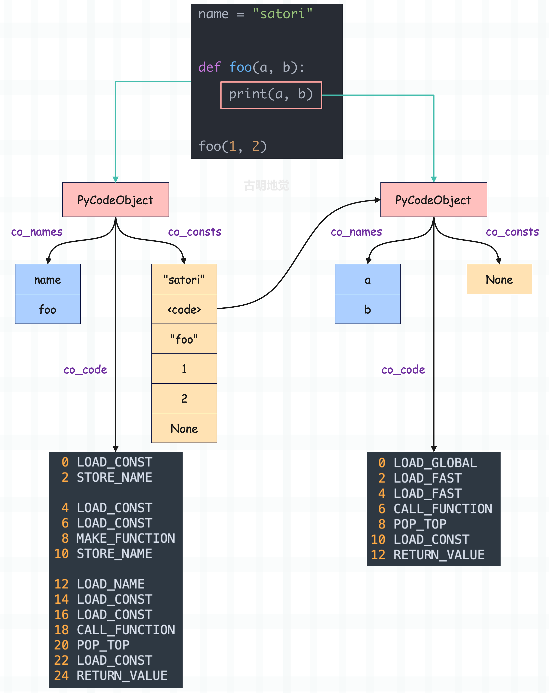
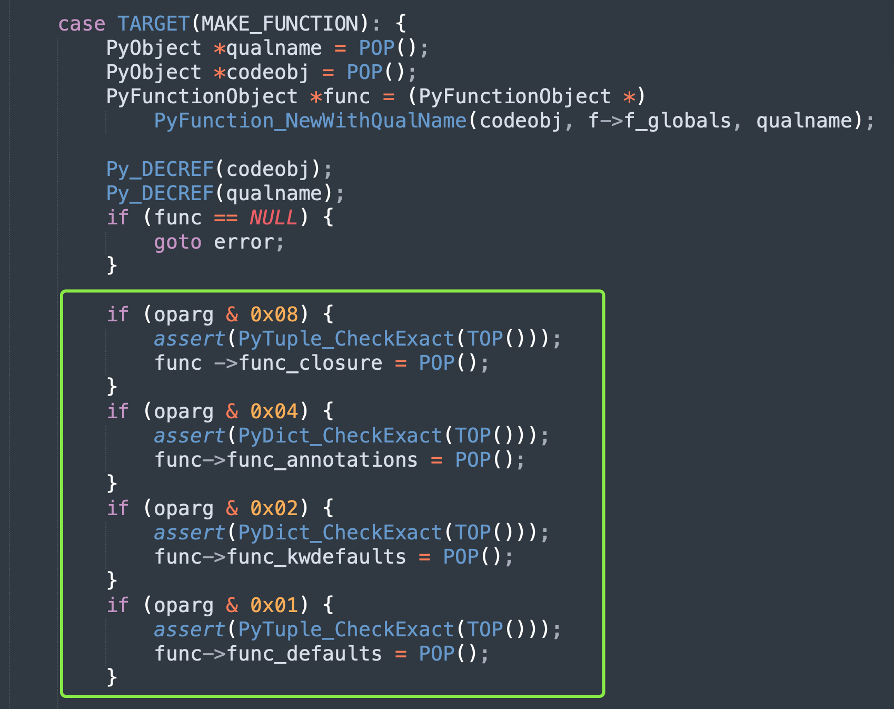
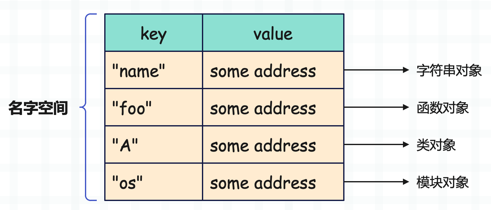

## 楔子

前面我们介绍了函数的基本结构，它在底层由 PyFunctionObject 结构体表示，那么本篇文章来看看函数的创建过程。

## 函数是何时创建的

介绍函数结构时，我们看到内部有一个 func_code 字段，指向一个 PyCodeObject 对象，而函数就是根据 PyCodeObject 对象创建的。

因为一个 PyCodeObject 是对一段代码的静态表示，Python 编译器将源代码编译之后，针对里面的每一个代码块（code block）都会生成相应的 PyCodeObject 对象，该对象包含了这个代码块的一些静态信息，也就是可以从源代码中看到的信息。

比如某个函数对应的代码块里面有一个 <font color="blue">a = 1</font> 这样的表达式，那么<font color="blue">符号 a</font> 和<font color="blue">整数 1</font>、以及它们之间的联系就是静态信息。这些信息会被静态存储起来，符号 a 被存在符号表 co_varnames 中，整数 1 被存在常量池 co_consts 中。然后 a = 1 是一条赋值语句，因此会有两条指令 LOAD_CONST 和 STORE_FAST 存在字节码指令序列 co_code 中。

这些信息是在编译的时候就可以得到的，因此 PyCodeObject 对象是编译之后的结果。

但 PyFunctionObject 对象是何时产生的呢？显然它是 Python 代码在运行时动态产生的，更准确的说，是在执行一个 def 语句的时候创建的。当虚拟机发现了 def 语句，那么就代表发现了新的 PyCodeObject 对象，因为它们是可以层层嵌套的。

然后虚拟机会根据这个 PyCodeObject 对象创建对应的 PyFunctionObject 对象，并将变量名和 PyFunctionObject 对象（函数体）组成键值对放在当前的 local 空间中。而在 PyFunctionObject 对象中，也需要拿到相关的静态信息，因此会有一个 func_code 字段指向 PyCodeObject。

除此之外，PyFunctionObject 对象还包含了一些函数在执行时所必需的动态信息，即上下文信息。比如 func_globals，就是函数在执行时关联的 global 名字空间，如果没有这个空间的话，函数就无法访问全局变量了。

由于 global 作用域中的符号和值必须在运行时才能确定，所以这部分必须在运行时动态创建，无法静态存储在 PyCodeObject 中。因此要基于 PyCodeObject 对象和 global 名字空间来创建 PyFunctionObject 对象，相当于一个封装。总之一切的目的，都是为了更好地执行字节码。

我们举个例子：

~~~python
# 首先虚拟机从上到下执行字节码
name = "古明地觉"
age = 17

# 啪，很快啊，出现了一个 def
def foo():
    pass

# 出现了 def，虚拟机就知道源代码进入了一个新的作用域了
# 也就是遇到一个新的 PyCodeObject 对象了
# 而通过 def 关键字知道这是一个函数，于是会进行封装
# 将 PyCodeObject 封装成 PyFunctionObject，同时包含了全局名字空间
# 所以当执行完 def 语句之后，一个函数就被创建了
# 然后将变量名 foo 和函数体（PyFunctionObject）组成键值对存放在当前的 local 空间中
# 当然对于模块而言，local 空间也是 global 空间
print({k: v for k, v in locals().items() if k == "foo"})
"""
{'foo': <function foo at 0x7f3f43b135e0>}
"""

# 函数内部也保存了 global 空间
print(foo.__globals__ is globals() is locals())
"""
True
"""
print(foo.__globals__["foo"] is foo is locals()["foo"])
"""
True
"""
~~~

调用的时候，会从 local 空间中取出符号 foo 对应的 PyFunctionObject 对象（函数对象）。然后根据函数对象创建栈帧对象，也就是为函数创建一个栈帧，随后将执行权交给新创建的栈帧，并在新创建的栈帧中执行字节码。

## 函数是怎么创建的

经过分析我们知道，当执行到 def 语句时会创建函数，并保存在 local 空间中。而通过<font color="blue">函数名()</font> 进行调用时，会从 local 空间取出和函数名绑定的函数对象，然后执行。

那么问题来了，函数（对象）是怎么创建的呢？或者说虚拟机是如何完成 PyCodeObject 对象到 PyFunctionObject 对象之间的转变呢？显然想了解这其中的奥秘，就必须从字节码入手。

~~~python
import dis

code_string = """
name = "satori"

def foo(a, b):
    print(a, b)

foo(1, 2)
"""

dis.dis(compile(code_string, "<func>", "exec"))
~~~

源代码很简单，定义一个变量 name 和一个函数 foo，然后调用函数。显然这里面会产生两个 PyCodeObject，我们来看一下。

~~~C
     // name = "satori"
   0 LOAD_CONST               0 ('satori')
   2 STORE_NAME               0 (name)
     
     // 我们看到 PyCodeObject 也会作为常量被静态收集
     // 这里是将常量池中索引为 1 的 PyCodeObject 压入运行时栈
   4 LOAD_CONST               1 (<code object foo at 0x7f3f43b12c90...>)
     // 加载字符串常量 "foo"，也就是函数名
   6 LOAD_CONST               2 ('foo')
     // 从栈中弹出函数名和 PyCodeObject，构建函数对象
     // 然后将函数对象（的指针）再压入运行时栈
   8 MAKE_FUNCTION            0
     // 从栈中弹出函数对象，并用符号 foo 绑定起来，到此函数就创建完毕了
  10 STORE_NAME               1 (foo)
    
     // 以下是 foo(1, 2) 对应的字节码
     // 加载全局变量 foo 并入栈
  12 LOAD_NAME                1 (foo)
     // 加载常量 1 和 2 并入栈
  14 LOAD_CONST               3 (1)
  16 LOAD_CONST               4 (2)
     // 从栈中弹出函数和参数，然后调用，并将调用结果、即函数的返回值压入栈中
  18 CALL_FUNCTION            2
     // 从栈顶弹出返回值，因为我们没有使用变量保存，所以会直接丢弃
     // 如果使用变量保存了，比如 res = foo(1, 2)，那么这里的字节码就是 STORE_NAME
  20 POP_TOP
  22 LOAD_CONST               5 (None)
  24 RETURN_VALUE
     
     // 以上是模块对应的字节码指令，下面是函数对应的字节码指令
Disassembly of <code object foo at 0x7f3f43b12c90, file "<func>", line 4>:
     // 比较简单，就是 print(a, b) 对应的字节码
   0 LOAD_GLOBAL              0 (print)
   2 LOAD_FAST                0 (a)
   4 LOAD_FAST                1 (b)
   6 CALL_FUNCTION            2
   8 POP_TOP
  10 LOAD_CONST               0 (None)
  12 RETURN_VALUE
~~~

通过字节码我们看到，def 关键字实际上还是在定义变量，正所谓<font color="blue">函数即变量</font>，我们可以把函数当成普通的变量来处理。函数名就是变量名，它位于模块对应的 PyCodeObject 的符号表中。函数体就是变量指向的值，它是基于一个独立的 PyCodeObject 构建的。

至此，函数的结构就已经非常清晰了。



分析完结构之后，重点就要落在 MAKE_FUNCTION 指令上了，我们说当遇到 def 关键字的时候，就知道要创建函数了。在语法上这是函数的声明语句，但从虚拟机的角度来看，这其实是函数对象的创建语句。

所以函数是怎么创建的，就是执行 MAKE_FUNCTION 指令创建的，该指令执行完毕后，一个函数对象就被压入了运行时栈。等到 STORE_NAME 执行时，再将它从栈中弹出，然后和变量（函数名）绑定起来。

## MAKE_FUNCTION 指令

下面我们就来分析一下 MAKE_FUNCTION 指令，看看它是怎么将一个 PyCodeObject 对象变成一个 PyFunctionObject 对象的。

~~~c
case TARGET(MAKE_FUNCTION): {
    // 弹出函数的全限定名
    PyObject *qualname = POP();
    // 弹出 PyCodeObject 对象
    PyObject *codeobj = POP();
    // 创建 PyFunctionObject 对象，接收三个参数
    // 分别是 PyCodeObject 对象、global 名字空间、函数的全限定名
    PyFunctionObject *func = (PyFunctionObject *)
        PyFunction_NewWithQualName(codeobj, f->f_globals, qualname);
    
    Py_DECREF(codeobj);
    Py_DECREF(qualname);
    // 如果函数创建失败会返回 NULL，那么跳转至 error 标签
    if (func == NULL) {
        goto error;
    }
  
    // 编译时，解释器能够静态检测出函数有没有闭包变量、类型注解等属性，并体现在 oparg 中
    // 构建函数时，通过 oparg 和一系列标志位做按位与，来判断函数是否包含指定属性
    // 由于 oparg 是指令参数，所以这些属性是否存在、以及如何访问，在编译阶段就已经确定了
    if (oparg & 0x08) {
        assert(PyTuple_CheckExact(TOP()));
        func ->func_closure = POP();
    }
    if (oparg & 0x04) {
        assert(PyDict_CheckExact(TOP()));
        func->func_annotations = POP();
    }
    if (oparg & 0x02) {
        assert(PyDict_CheckExact(TOP()));
        func->func_kwdefaults = POP();
    }
    if (oparg & 0x01) {
        assert(PyTuple_CheckExact(TOP()));
        func->func_defaults = POP();
    }
    // 函数创建之后，压入运行时栈
    PUSH((PyObject *)func);
    DISPATCH();
}
~~~

整个步骤很好理解，先通过 LOAD_CONST 将 PyCodeObject 对象和符号 foo 压入栈中。然后执行 MAKE_FUNCTION，将两者从栈中弹出，再加上当前栈帧对象中维护的 global 名字空间，三者作为参数传入 PyFunction_NewWithQualName 函数中，从而构建出相应的 PyFunctionObject 对象。

下面来看看 PyFunction_NewWithQualName 是如何构造出一个 Python 函数的。

~~~C
// Objects/funcobject.c

PyObject *
PyFunction_NewWithQualName(PyObject *code, PyObject *globals, PyObject *qualname)
{
    // 要返回的 PyFunctionObject 对象的指针 
    PyFunctionObject *op;
    // 函数的 doc、常量池、函数所在的模块
    PyObject *doc, *consts, *module;
    static PyObject *__name__ = NULL;
    // 将变量 __name__ 赋值为 "__main__"
    // 另外由于 __name__ 是静态变量，所以只会初始化一次
    if (__name__ == NULL) {
        __name__ = PyUnicode_InternFromString("__name__");
        if (__name__ == NULL)
            return NULL;
    }
    // 从 global 空间中获取 __name__ 的值
    // 如果创建 Python 函数时所在的文件是被导入的，那么它的值就是对应的模块名
    // 如果创建 Python 函数时所在的文件是直接执行的，那么它的值就是 __main__
    module = PyDict_GetItemWithError(globals, __name__);
    if (module) {
        Py_INCREF(module);
    }
    else if (PyErr_Occurred()) {
        return NULL;
    }
    // 通过 PyObject_GC_New 为函数对象申请空间，这里我们看到了 gc
    // 因为函数是可以发生循环引用的，因此需要被 GC 跟踪
    // 而想被 GC 跟踪，则需要有一个 PyGC_Head
    // 所以此处使用 PyObject_GC_New，同时也会为 PyGC_Head 申请内存
    op = PyObject_GC_New(PyFunctionObject, &PyFunction_Type);
    if (op == NULL) {
        Py_XDECREF(module);
        return NULL;
    }
    // 下面就是设置 PyFunctionObject 对象的字段属性了
    op->func_weakreflist = NULL;
    Py_INCREF(code);
    op->func_code = code;
    Py_INCREF(globals);
    op->func_globals = globals;
    op->func_name = ((PyCodeObject *)code)->co_name;
    Py_INCREF(op->func_name);
    op->func_defaults = NULL;
    op->func_kwdefaults = NULL;
    op->func_closure = NULL;
    // 以后会通过 _PyFunction_Vectorcall 来实现函数的调用
    op->vectorcall = _PyFunction_Vectorcall;
    op->func_module = module;
    // 通过 PyCodeObject 对象获取常量池
    consts = ((PyCodeObject *)code)->co_consts;
    // 函数的 docstring 其实就是一个字符串，显然它也是常量池的一个常量，并且是常量池的第一个常量
    // 如果函数没有 docstring，那么常量池里的第一个元素会是 None，而不是字符串
    if (PyTuple_Size(consts) >= 1) {
        // 所以如果 consts 的长度 >=1，并且第一个元素是字符串，那么它就是函数的 docstring
        doc = PyTuple_GetItem(consts, 0);
        if (!PyUnicode_Check(doc))
            doc = Py_None;
    }
    else
        doc = Py_None;
    Py_INCREF(doc);
    // 下面也是设置 PyFunctionObject 对象的字段
    op->func_doc = doc;
    op->func_dict = NULL;
    op->func_annotations = NULL;
    if (qualname)
        op->func_qualname = qualname;
    else
        op->func_qualname = op->func_name;
    Py_INCREF(op->func_qualname);
    // 让函数对象被 GC 跟踪
    _PyObject_GC_TRACK(op);
    // 返回其泛型指针
    return (PyObject *)op;
}
~~~

以上就是函数对象的创建过程，说白了就是对 PyCodeObject 进行了一个封装。等函数对象创建完毕后会回到 MAKE_FUNCTION，然后设置闭包、注解等属性，并将函数对象压入栈中。接着执行 STORE_NAME 从符号表中加载符号（函数名），并从栈顶弹出函数对象，然后将两者组成键值对存储在当前栈帧的 local 名字空间中，整体还是比较简单的。

但如果再加上类型注解、以及默认值，会有什么效果呢？

~~~python
import dis

code_string = """
name = "satori"
def foo(a: int = 1, b: int = 2):
    print(a, b)
"""

dis.dis(compile(code_string, "<func>", "exec"))
~~~

我们看看加上了类型注解和默认值之后，它的字节码指令会有什么变化？

~~~C
 0 LOAD_CONST               0 ('satori')
 2 STORE_NAME               0 (name)

 4 LOAD_CONST               7 ((1, 2))
 6 LOAD_NAME                1 (int)
 8 LOAD_NAME                1 (int)
10 LOAD_CONST               3 (('a', 'b'))
12 BUILD_CONST_KEY_MAP      2
14 LOAD_CONST               4 (<code object foo at 0x7f3f4...>)
16 LOAD_CONST               5 ('foo')
18 MAKE_FUNCTION            5 (defaults, annotations)
20 STORE_NAME               2 (foo)
// ......
~~~

不难发现，在构建函数时会先将默认值以元组的形式压入运行时栈；然后再将使用了类型注解的<font color="blue">参数</font>和<font color="blue">类型</font>也组成一个元组，并压入运行时栈。后续创建函数的时候，会将默认值保存在 func_defaults 字段中，类型注解对应的字典会保存在 func_annotations 字段中。



验证一下：

~~~python
def foo(a: int = 1, b: int = 2):
    print(a, b)

print(foo.__defaults__)
"""
(1, 2)
"""
print(foo.__annotations__)
"""
{'a': <class 'int'>, 'b': <class 'int'>}
"""
~~~

基于类型注解，我们便可以额外施加一些手段，让 Python 像静态语言一样，实现函数参数的类型约束。

## 聊一聊函数名

这里再说一下函数名，举个例子。

```python
def foo():
    pass

print(foo.__name__)  # foo

bar = foo
print(bar.__name__)  # foo
```

我们定义了一个函数 foo，那么函数名就是 foo，这是没问题的，但怎么理解 bar 呢？

所以严格意义上讲，代码中的 foo 应该是一个变量。之前说过，定义函数、类、导入模块，其实都是创建了一个变量。所以代码中的 foo 也是一个变量，它指向了函数对象，而函数的名字是保存在函数对象里面的。

~~~python
code_string = """
def foo():
    pass
"""

code_obj = compile(code_string, "<func>", "exec")
# 我们是以模块的形式编译的，它里面只有一个变量 foo
# 所以符号表就是 ('foo',)
print(code_obj.co_names)  # ('foo',)

# 然后常量池里面存在一个 PyCodeObject
# 这个 PyCodeObject 便是函数对应的 PyCodeObject
print(code_obj.co_consts[0])  # <code object foo ...>
print(code_obj.co_consts[0].co_name)  # foo

# 构建函数时，PyCodeObject 的 co_name 会被赋值给函数的 func_name
# 所以严格意义上讲，def foo() 中的 foo 只能算做是变量名
# 而真正的函数名是函数对象的 func_name，它来自于 co_name
# 只不过在编译成 PyCodeObject 对象时，会进行词法分析
# 因为 def 后面是 foo，所以编译之后的 PyCodeObject 的 co_name 也是 foo

# 当然其它对象也是如此
class A:
    pass

# 这里的 A 指向了类型对象，但类型对象的名称是保存在类型对象里面的
print(A.__name__)  # A
# A.__name__ 才是类名，class 后面的 A 只是一个变量名

# 这里同样创建了一个类
B = type("B1", (object,), {})
print(B.__name__)  # B1
# 但是我们看到类名不是 B，而是 B1
# 所以我们需要明白，不管是变量赋值、还是定义函数、类、方法，导入模块
# 我们得到的只是一个变量，这个变量指向了具体的对象（它们是字典中的一个键值对）
# 而对象的名称、类型等信息，都保存在对象里面，和变量无关
# 因为变量只是一个符号，或者理解为代号，每个对象都可以有不同的代号

def foo():
    pass

# 名称也可以自由更改
foo.__name__ = "foo1"
# 在更改过后，函数的名字就变成了 foo1
print(foo.__name__)  # foo1

# bar = foo 之后，这个函数对象就有了两个代号，你通过 foo 和 bar 都可以找到它
# 但函数对象的名字是不变的，还是 foo1，因为它的 __name__ 属性的值是 foo1
bar = foo
print(bar.__name__)  # foo1
~~~

我们之前说变量只是一个和对象绑定的符号，或者说代号，运行时会和某个对象（的地址）组成键值对保存在字典中。虚拟机通过变量可以找到它代表的对象，本质上就是将变量名作为 key，去字典中检索 value。至于获取到的对象叫什么名字，是保存在对象里面的。

如果变量指向的是整数、字符串等，那么该对象就没有名字。如果指向的是函数、类、模块，那么对象的 \_\_name\_\_ 就是对象的名字。只不过在默认情况下，定义函数（以及类）时，变量名默认和函数名是一样的，所以我们会把指向函数对象的变量的名称也叫做函数名。

关于这一点，大家一定要清晰。

```python
name = "古明地觉"

def foo():
    pass

class A:
    pass

import os

print("name" in locals())  # True
print("foo" in locals())  # True
print("A" in locals())  # True
print("os" in locals())  # True
```

这里的 name、foo、A、os 都是变量，站在虚拟机的角度，它们没有任何的不同，只不过指向的对象不同罢了。而站在 Python 的角度，它们也是一样的，其名称都是字典里的一个 key，只不过关联的 value 不同罢了。



比如 name 指向的是字符串对象，foo 指向的是函数对象，A 指向的是类对象，os 指向的是模块对象。但我们也可以改变指向，比如让 foo 指向类对象，A 指向字符串对像等等，都是可以的。

总结：变量只是一个指针，可以保存任意对象的地址，也就是可以指向任意的对象。而对象的名字、类型等一切信息，都保存在对象中，和变量无关。

当然这些都是之前说过的内容，再来回顾一下，总之一定要了解 Python 变量的本质。

## 函数的一些骚操作

我们通过一些骚操作，来更好地理解一下函数。之前说 \<class 'function'\> 是函数的类型对象，而这个类底层没有暴露给我们，但我们依旧可以通过曲线救国的方式进行获取。

~~~python
def foo():
    pass

print(type(foo))  # <class 'function'>
# lambda 匿名函数的类型也是 function
print(type(lambda: None))  # <class 'function'>
~~~

那么下面就来创建函数：

~~~python
gender = "female"

def foo(name, age):
    return f"name: {name}, age: {age}, gender: {gender}"

# 得到 PyCodeObject 对象
code = foo.__code__
# 根据 class function 创建函数对象
# 接收三个参数：PyCodeObject 对象、global 名字空间、函数名
new_foo = type(foo)(code, globals(), "根据 foo 创建的 new_foo")

# 打印函数名
print(new_foo.__name__)
"""
根据 foo 创建的 new_foo
"""

# 调用函数
print(new_foo("古明地觉", 17))
"""
name: 古明地觉, age: 17, gender: female
"""
~~~

是不是很神奇呢？另外函数之所以能访问全局变量，是因为在创建函数的时候将 global 名字空间传进去了，如果我们不传递呢？

~~~python
gender = "female"

def foo(name, age):
    return f"name: {name}, age: {age}, gender: {gender}"

code = foo.__code__
# 第二个参数必须是一个字典，不能传 None
new_foo = type(foo)(code, {}, "根据 foo 创建的 new_foo")

try:
    print(new_foo("古明地觉", 17))
except NameError as e:
    print(e)  # name 'gender' is not defined
~~~

因此现在我们又从 Python 的角度理解了一遍，为什么在函数内部能够访问全局变量。原因就在于构建函数的时候，将 global 名字空间交给了函数，使得函数可以在 global 空间中进行变量查找，所以它才能够找到全局变量。而我们这里给了一个空字典，那么显然就找不到 gender 这个变量了。

~~~python
gender = "female"

def foo(name, age):
    return f"name: {name}, age: {age}, gender: {gender}"

code = foo.__code__
new_foo = type(foo)(code, {"gender": "萌妹子"}, "根据 foo 创建的 new_foo")

# 我们可以手动传递一个字典进去
# 此时传递的字典对于函数来说就是 global 名字空间
print(new_foo("古明地觉", 17))
"""
name: 古明地觉, age: 17, gender: 萌妹子
"""
# 所以此时的 gender 不再是外部的 "female", 而是我们指定的 "萌妹子"
~~~

此外也可以为函数指定默认值：

```python
def foo(name, age, gender):
    return f"name: {name}, age: {age}, gender: {gender}"

# 必须接收一个 PyTupleObject 对象
foo.__defaults__ = ("古明地觉", 17, "female")
print(foo())
"""
name: 古明地觉, age: 17, gender: female
"""
```

我们看到函数 foo 明明接收三个参数，但是调用时不传递居然也不会报错，原因就在于我们指定了默认值。而默认值可以在定义函数的时候指定，也可以通过 \_\_defaults\_\_ 指定，但很明显我们应该通过前者来指定。

如果你使用的是 PyCharm，那么会在 foo() 这个位置给你加波浪线，提示你参数没有传递。但我们知道，由于通过 \_\_defaults\_\_ 设置了默认值，所以这里是不会报错的。只不过 PyCharm 没有检测到，当然基本上所有的 IDE 都无法做到这一点，毕竟动态语言。

另外如果 \_\_defaults\_\_ 接收的元组里面的元素个数和参数个数不匹配怎么办？

~~~python
def foo(name, age, gender):
    return f"name: {name}, age: {age}, gender: {gender}"

foo.__defaults__ = (15, "female")
print(foo("古明地恋"))
"""
name: 古明地恋, age: 15, gender: female
"""
~~~

由于元组里面只有两个元素，意味着我们在调用时需要至少传递一个参数，而这个参数会赋值给 name。原因就是在设置默认值的时候是从后往前设置的，也就是 "female" 会赋值给 gender，15 会赋值给 age。而 name 没有得到默认值，那么它就需要调用者显式传递了。

如果返回值从前往后设置的话，会出现什么后果？显然 15 会赋值给 name，"female" 会赋值给 age，此时函数就等价于如下：

```python
def foo(name=15, age="female", gender):
    return f"name: {name}, age: {age}, gender: {gender}"
```

这样的函数显然无法通过编译，因为默认参数必须在非默认参数的后面。所以 Python 的这个做法是完全正确的，必须要从后往前进行设置。

另外我们知道默认值的个数是小于等于参数个数的，如果大于会怎么样呢？

~~~python
def foo(name, age, gender):
    return f"name: {name}, age: {age}, gender: {gender}"

foo.__defaults__ = ("古明地觉", "古明地恋", 15, "female")
print(foo())
"""
name: 古明地恋, age: 15, gender: female
"""
~~~

依旧是从后往前进行设置，当所有参数都有默认值时，就结束了，多余的默认值会丢弃。当然，如果不使用 \_\_defaults\_\_，是不可能出现默认值个数大于参数个数的。可要是 \_\_defaults\_\_ 指向的元组先结束，那么没有得到默认值的参数就必须由调用者显式传递了。

最后，再来说一下如何深拷贝一个函数。首先如果是你的话，你会怎么拷贝一个函数呢？不出意外的话，你应该会使用 copy 模块。

~~~python
import copy

def foo(a, b):
    return [a, b]

# 但是问题来了，这样能否实现深度拷贝呢？
new_foo = copy.deepcopy(foo)
# 修改 foo 的默认值
foo.__defaults__ = (2, 3)
# 但是 new_foo 也会受到影响
print(new_foo())  # [2, 3]
~~~

打印结果提示我们并没有实现函数的深度拷贝，事实上 copy 模块无法对函数、方法、回溯栈、栈帧、模块、文件、套接字等类型的数据实现深度拷贝。那我们应该怎么做呢？

```python
from types import FunctionType

def foo(a, b):
    return "result"

# FunctionType 就是函数的类型对象，它也是通过 type 得到的
new_foo = FunctionType(foo.__code__,
                       foo.__globals__,
                       foo.__name__,
                       foo.__defaults__,
                       foo.__closure__)
# 显然 function 还可以接收第四个参数和第五个参数
# 分别是函数的默认值和闭包

# 然后别忘记将属性字典也拷贝一份
new_foo.__dict__ = {**foo.__dict__}

foo.__defaults__ = (2, 3)
print(foo.__defaults__)  # (2, 3)
print(new_foo.__defaults__)  # None
```

此时修改 foo 不会影响 new_foo，当然在拷贝的时候也可以自定义属性。

其实上面实现的深拷贝，本质上就是定义了一个新的函数。由于是两个不同的函数，那么自然就没有联系了。

## 判断函数都有哪些参数

最后再来看看如何检测一个函数有哪些参数，首先函数的局部变量（包括参数）在编译时就已经确定，会存在符号表 co_varnames 中。

```python
def foo(a, b, /, c, d, *args, e, f, **kwargs):
    g = 1
    h = 2

print(foo.__code__.co_varnames)
"""
('a', 'b', 'c', 'd', 'e', 'f', 'args', 'kwargs', 'g', 'h')
"""
```

在定义函数的时候，\* 和 \*\* 最多只能出现一次。然后这里的 a 和 b 必须通过位置参数传递，c 和 d 可以通过位置参数或者关键字参数传递，e 和 f 必须通过关键字参数传递。

而从打印的符号表来看，里面的符号是有顺序的。参数永远在函数内部定义的局部变量的前面，比如 g 和 h 就是函数内部定义的局部变量，所以它在所有参数的后面。而对于参数，\* 和 \*\* 会位于最后面，其它参数位置不变。所以除了 g 和 h，最后面的就是 args 和 kwargs。

有了这些信息，我们就可以进行检测了。

~~~python
def foo(a, b, /, c, d, *args, e, f, **kwargs):
    g = 1
    h = 2

varnames = foo.__code__.co_varnames
# 1. 寻找必须通过位置参数传递的参数
posonlyargcount = foo.__code__.co_posonlyargcount
print(posonlyargcount)  # 2
print(varnames[: posonlyargcount])  # ('a', 'b')

# 2. 寻找可以通过位置参数（或关键字参数）传递的参数
argcount = foo.__code__.co_argcount
# 注：co_argcount 里面包含了 co_posonlyargcount
print(argcount)  # 4
print(varnames[: argcount])  # ('a', 'b', 'c', 'd')
print(varnames[posonlyargcount: argcount])  # ('c', 'd')

# 3. 寻找必须通过关键字参数传递的参数
kwonlyargcount = foo.__code__.co_kwonlyargcount
print(kwonlyargcount)  # 2
print(varnames[argcount: argcount + kwonlyargcount])  # ('e', 'f')

# 4. 寻找 *args 和 **kwargs
flags = foo.__code__.co_flags
# 在介绍 PyCodeObject 的时候，我们说里面有一个 co_flags 字段
# 它是函数的标识，可以对函数类型和参数进行检测
# 如果 co_flags 和 4 按位与的结果为真，那么就代表有 *args，否则没有
# 如果 co_flags 和 8 按位与的结果为真，那么就代表有 **kwargs，否则没有
step = argcount + kwonlyargcount
if flags & 0x04:
    print(varnames[step])  # args
    step += 1

if flags & 0x08:
    print(varnames[step])  # kwargs
~~~

以上我们就检测出了函数都有哪些参数，你也可以自己试一试。另外还要注意一点，如果定义的时候，指定的不是 \*args，而只是一个 \*，那么它就不是参数了。

```python
def f(a, b, *, c):
    pass


# 符号表里面只有 a、b、c
print(f.__code__.co_varnames)  # ('a', 'b', 'c')

# 显然此时也都为假
print(f.__code__.co_flags & 0x04)  # 0
print(f.__code__.co_flags & 0x08)  # 0
```

单独的一个 * 只是为了强制要求后面的参数必须通过关键字参数的方式传递。

## 小结

这一次我们简单地分析了一下函数是如何创建的，并且还在 Python 的层面上做了一些小 trick。最后我们也分析了如何通过 PyCodeObject 对象来检索函数的参数，以及相关种类，标准库中的 inspect 模块也是这么做的。准确的说，是我们模仿人家的思路做的。

现在你是不是对函数有了一个更深刻的认识了呢？当然目前介绍的只是函数的一部分内容，还有更多内容等待我们挖掘，比如：

- 函数如何调用。
- 位置参数和关键字参数如何解析。
- 对于有默认值的参数，如何在不传参的时候使用默认值、在传参的时候使用我们传递的值。
- *args 和 **kwargs 如何解析。
- 闭包怎么实现。
- 装饰器怎么实现
- ......

这些内容我们接下来慢慢说。

------

&nbsp;

**欢迎大家关注我的公众号：古明地觉的编程教室。**


**如果觉得文章对你有所帮助，也可以请作者吃个馒头，Thanks♪(･ω･)ﾉ。**

